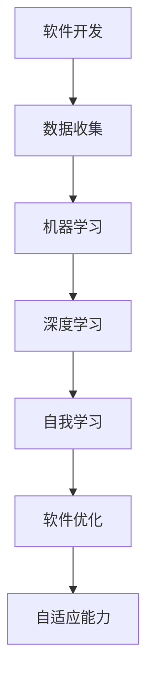
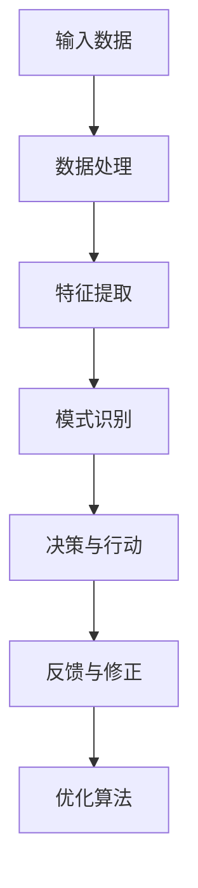
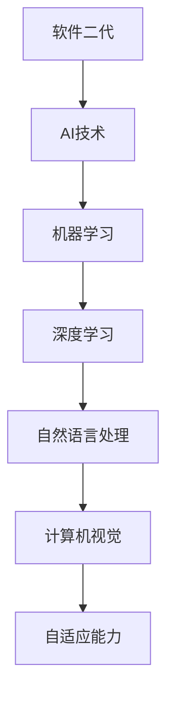

                 

# 软件二代的崛起：人工智能引领下的社会责任

> **关键词：** 软件二代、人工智能、社会责任、科技向善、伦理问题、可持续发展
> 
> **摘要：** 本文探讨了软件二代的崛起，特别是人工智能（AI）在软件开发中的应用，以及其带来的社会责任。我们深入分析了AI技术对社会的影响，探讨了科技向善的重要性，并提出了实现这一目标的策略和挑战。

## 1. 背景介绍

### 1.1 目的和范围

本文旨在探讨软件二代，特别是人工智能技术在社会责任方面的应用。我们将重点讨论AI在软件开发中的角色，以及其对伦理、可持续发展等方面的影响。此外，本文还将提出一些实现科技向善的策略，并分析未来可能面临的挑战。

### 1.2 预期读者

本文适合对软件开发、人工智能技术和社会责任感兴趣的读者。无论您是软件工程师、AI研究者，还是对科技伦理和社会问题有所关注的普通读者，本文都希望能为您提供有价值的见解和思考。

### 1.3 文档结构概述

本文分为八个部分，首先介绍了软件二代和人工智能技术的背景，然后详细讨论了AI技术的核心概念和原理。接着，我们探讨了AI技术在实际应用中面临的社会责任问题，并提出了实现科技向善的策略。文章的最后部分，总结了未来发展趋势和挑战，并提供了相关的扩展阅读和参考资料。

### 1.4 术语表

#### 1.4.1 核心术语定义

- **软件二代**：指基于人工智能技术的软件，具备自我学习和适应能力。
- **人工智能（AI）**：模拟人类智能行为的计算机系统。
- **伦理问题**：涉及道德原则和价值观的问题。
- **可持续发展**：满足当前需求而不损害未来世代满足自身需求的能力。

#### 1.4.2 相关概念解释

- **机器学习（ML）**：一种AI技术，通过数据学习模式和规律，从而进行预测和决策。
- **深度学习（DL）**：一种基于多层神经网络的机器学习技术，擅长处理大量复杂数据。
- **算法偏见**：算法决策过程中可能存在的偏见，可能源于数据集或设计缺陷。

#### 1.4.3 缩略词列表

- **AI**：人工智能
- **ML**：机器学习
- **DL**：深度学习
- **NLP**：自然语言处理
- **CV**：计算机视觉

## 2. 核心概念与联系

### 2.1 软件二代的核心概念

软件二代是指基于人工智能技术的软件，具有自我学习和适应能力。这一概念的核心在于AI技术，特别是机器学习和深度学习的应用。下面是一个简单的Mermaid流程图，展示了软件二代的核心概念：



### 2.2 人工智能的核心原理

人工智能是模拟人类智能行为的计算机系统。它通过学习、推理和自我修正，实现自动化决策和任务执行。下面是人工智能的核心原理的Mermaid流程图：



### 2.3 软件二代与人工智能的联系

软件二代和人工智能技术有着密切的联系。AI技术为软件二代提供了强大的基础，使其能够实现自我学习和适应。下面是软件二代与人工智能技术之间的联系：



## 3. 核心算法原理 & 具体操作步骤

### 3.1 机器学习算法原理

机器学习是一种AI技术，通过数据学习模式和规律，从而进行预测和决策。下面是机器学习算法的基本原理和具体操作步骤：

#### 3.1.1 基本原理

机器学习算法通过以下三个步骤实现：

1. **数据收集**：收集大量的数据样本。
2. **特征提取**：从数据中提取有用的特征。
3. **模式识别**：通过特征训练模型，进行模式识别和预测。

#### 3.1.2 具体操作步骤

1. **数据收集**：
    - 收集大量数据样本，例如图像、文本、声音等。
    - 数据来源可以是公开的数据集，也可以是自有的数据。
2. **特征提取**：
    - 对数据进行预处理，例如数据清洗、归一化等。
    - 使用特征提取技术，例如卷积神经网络（CNN）或自然语言处理（NLP）技术，从数据中提取特征。
3. **模式识别**：
    - 使用训练好的模型进行预测。
    - 通过比较预测结果和真实结果，计算模型的准确率。

### 3.2 深度学习算法原理

深度学习是一种基于多层神经网络的机器学习技术，擅长处理大量复杂数据。下面是深度学习算法的基本原理和具体操作步骤：

#### 3.2.1 基本原理

深度学习算法通过以下步骤实现：

1. **输入层**：接收输入数据。
2. **隐藏层**：对输入数据进行处理，提取特征。
3. **输出层**：根据提取的特征进行预测。

#### 3.2.2 具体操作步骤

1. **构建神经网络**：
    - 设计神经网络的结构，包括输入层、隐藏层和输出层。
    - 选择合适的激活函数，例如ReLU、Sigmoid或Tanh。
2. **前向传播**：
    - 将输入数据传递到神经网络，通过隐藏层处理，最后得到输出。
3. **反向传播**：
    - 计算输出与真实结果之间的误差。
    - 通过反向传播算法，更新网络权重，优化模型。

## 4. 数学模型和公式 & 详细讲解 & 举例说明

### 4.1 数学模型

机器学习和深度学习算法的核心在于优化模型参数，使得模型能够准确预测和分类。下面是机器学习和深度学习的数学模型和公式：

#### 4.1.1 机器学习

- **损失函数**：
    $$ L(y, \hat{y}) = -\sum_{i=1}^{n} y_i \log(\hat{y}_i) $$
    其中，$y$ 是真实标签，$\hat{y}$ 是预测标签。

- **优化算法**：
    $$ \theta = \theta - \alpha \frac{\partial L}{\partial \theta} $$
    其中，$\theta$ 是模型参数，$\alpha$ 是学习率。

#### 4.1.2 深度学习

- **损失函数**：
    $$ L(y, \hat{y}) = \frac{1}{2} \sum_{i=1}^{n} (\hat{y}_i - y_i)^2 $$
    其中，$y$ 是真实标签，$\hat{y}$ 是预测标签。

- **反向传播算法**：
    $$ \frac{\partial L}{\partial \theta} = \frac{\partial L}{\partial \hat{y}} \frac{\partial \hat{y}}{\partial \theta} $$

### 4.2 举例说明

假设我们有一个简单的二元分类问题，需要预测一个数据样本属于正类还是负类。我们使用逻辑回归作为模型，下面是一个具体的例子：

#### 4.2.1 数据集

数据集包含两个特征：$x_1$ 和 $x_2$，以及一个标签 $y$，$y$ 的取值为0或1。

| $x_1$ | $x_2$ | $y$ |
| --- | --- | --- |
| 1 | 2 | 0 |
| 2 | 3 | 1 |
| 3 | 4 | 0 |
| 4 | 5 | 1 |

#### 4.2.2 模型参数

逻辑回归模型的参数为 $\theta_0$ 和 $\theta_1$。

#### 4.2.3 损失函数

使用对数似然损失函数：

$$ L(y, \hat{y}) = -\sum_{i=1}^{n} y_i \log(\hat{y}_i) + (1 - y_i) \log(1 - \hat{y}_i) $$

#### 4.2.4 前向传播

对于每个数据样本，计算预测概率：

$$ \hat{y}_i = \sigma(\theta_0 + \theta_1 x_1 + \theta_2 x_2) $$

其中，$\sigma$ 是sigmoid函数：

$$ \sigma(z) = \frac{1}{1 + e^{-z}} $$

#### 4.2.5 反向传播

计算损失函数关于参数的偏导数：

$$ \frac{\partial L}{\partial \theta_0} = \frac{1}{1 + e^{-z}} - y $$
$$ \frac{\partial L}{\partial \theta_1} = x_1 \frac{1}{1 + e^{-z}} - x_1 y $$
$$ \frac{\partial L}{\partial \theta_2} = x_2 \frac{1}{1 + e^{-z}} - x_2 y $$

#### 4.2.6 模型优化

使用梯度下降算法优化模型参数：

$$ \theta_0 = \theta_0 - \alpha \frac{\partial L}{\partial \theta_0} $$
$$ \theta_1 = \theta_1 - \alpha \frac{\partial L}{\partial \theta_1} $$
$$ \theta_2 = \theta_2 - \alpha \frac{\partial L}{\partial \theta_2} $$

## 5. 项目实战：代码实际案例和详细解释说明

### 5.1 开发环境搭建

为了实现机器学习和深度学习算法，我们需要搭建一个开发环境。以下是搭建开发环境的基本步骤：

1. **安装Python**：Python是一种广泛使用的编程语言，支持机器学习和深度学习。下载并安装Python，推荐使用Python 3.8或更高版本。
2. **安装Jupyter Notebook**：Jupyter Notebook是一个交互式的开发环境，支持Python。安装Jupyter Notebook，可以通过pip命令：
    ```bash
    pip install notebook
    ```
3. **安装机器学习和深度学习库**：安装常用的机器学习和深度学习库，例如scikit-learn、TensorFlow和PyTorch。通过pip命令安装：
    ```bash
    pip install scikit-learn tensorflow torchvision
    ```

### 5.2 源代码详细实现和代码解读

以下是一个简单的机器学习项目，使用scikit-learn库实现逻辑回归模型，对二元分类问题进行预测。

#### 5.2.1 数据准备

首先，我们需要准备一个数据集。这里使用一个简单的数据集，包含两个特征和一个标签。

```python
import numpy as np
import pandas as pd

# 加载数据集
data = pd.DataFrame({
    'x1': [1, 2, 3, 4],
    'x2': [2, 3, 4, 5],
    'y': [0, 1, 0, 1]
})

# 划分特征和标签
X = data[['x1', 'x2']]
y = data['y']
```

#### 5.2.2 模型训练

接下来，我们使用scikit-learn库的LogisticRegression类训练逻辑回归模型。

```python
from sklearn.linear_model import LogisticRegression

# 创建逻辑回归模型实例
model = LogisticRegression()

# 训练模型
model.fit(X, y)
```

#### 5.2.3 模型预测

使用训练好的模型进行预测，计算预测概率和预测标签。

```python
# 预测概率
probabilities = model.predict_proba(X)

# 预测标签
predictions = model.predict(X)

# 输出结果
print("Predicted probabilities:", probabilities)
print("Predicted labels:", predictions)
```

### 5.3 代码解读与分析

上述代码实现了逻辑回归模型的训练和预测。以下是代码的详细解读：

1. **数据准备**：首先，我们使用pandas库加载数据集，并将数据集划分为特征和标签。
2. **模型训练**：使用scikit-learn库的LogisticRegression类创建逻辑回归模型实例，并调用fit方法进行模型训练。
3. **模型预测**：使用模型进行预测，得到预测概率和预测标签。预测概率表示属于正类的概率，预测标签表示样本属于正类或负类。

## 6. 实际应用场景

### 6.1 医疗领域

在医疗领域，人工智能技术可以用于疾病预测、诊断和治疗方案推荐。例如，通过分析患者的病历、基因数据等，AI模型可以预测患者患某种疾病的风险，并提供个性化的治疗方案。

### 6.2 金融领域

在金融领域，人工智能技术可以用于风险管理、欺诈检测和投资策略优化。例如，通过分析大量的交易数据，AI模型可以识别潜在的欺诈行为，并提供风险提示，帮助金融机构降低风险。

### 6.3 智能交通

在智能交通领域，人工智能技术可以用于交通流量预测、路况分析和智能驾驶。例如，通过分析历史交通数据，AI模型可以预测未来的交通流量，并提供最优的行车路线，减少拥堵和交通事故。

### 6.4 教育

在教育领域，人工智能技术可以用于个性化教学、学习评估和智能辅导。例如，通过分析学生的学习数据，AI模型可以为学生提供个性化的学习方案，提高学习效果。

## 7. 工具和资源推荐

### 7.1 学习资源推荐

#### 7.1.1 书籍推荐

- **《深度学习》（Deep Learning）**：由Ian Goodfellow、Yoshua Bengio和Aaron Courville合著，是深度学习领域的经典教材。
- **《Python机器学习》（Python Machine Learning）**：由Sylvain Corlay和Hesamifar Sahand合著，介绍了使用Python进行机器学习的实践方法。

#### 7.1.2 在线课程

- **Coursera**：提供多门关于机器学习和深度学习的在线课程，例如“机器学习”和“深度学习”。
- **edX**：提供由哈佛大学、麻省理工学院等顶尖大学开设的在线课程，包括“人工智能导论”和“机器学习基础”。

#### 7.1.3 技术博客和网站

- **博客园**：一个中文技术博客平台，涵盖了机器学习和深度学习的相关文章。
- **Medium**：一个全球性的在线出版平台，有许多关于机器学习和深度学习的专业文章。

### 7.2 开发工具框架推荐

#### 7.2.1 IDE和编辑器

- **PyCharm**：一款功能强大的Python IDE，支持代码调试、版本控制和自动化测试。
- **Visual Studio Code**：一款轻量级且高度可定制的代码编辑器，适用于多种编程语言。

#### 7.2.2 调试和性能分析工具

- **Jupyter Notebook**：一款交互式的开发环境，适用于数据分析和机器学习项目的开发。
- **TensorBoard**：TensorFlow提供的一款可视化工具，用于分析模型的性能和优化。

#### 7.2.3 相关框架和库

- **TensorFlow**：一款开源的深度学习框架，适用于各种深度学习任务。
- **PyTorch**：一款开源的深度学习框架，具有灵活的动态计算图，适用于研究和个人项目。

### 7.3 相关论文著作推荐

#### 7.3.1 经典论文

- **“Backpropagation”**：1986年由Rumelhart、Hinton和Williams提出的反向传播算法，是深度学习的基础。
- **“A Theoretically Optimal Learning Algorithm for Feedforward Neural Networks”**：1990年由Hinton提出的优化算法，用于训练深度神经网络。

#### 7.3.2 最新研究成果

- **“Generative Adversarial Nets”**：2014年由Ian Goodfellow等提出的生成对抗网络（GANs），是一种新的深度学习模型。
- **“Unsupervised Representation Learning with Deep Convolutional Generative Adversarial Networks”**：2015年由Diederik P. Kingma和Max Welling提出的变分自编码器（VAEs），用于无监督学习。

#### 7.3.3 应用案例分析

- **“DeepMind Health”**：DeepMind公司推出的一个项目，利用深度学习技术分析医疗数据，提高医疗诊断和治疗的准确性。
- **“AI-powered Personalized Learning”**：使用机器学习技术为每个学生提供个性化的学习方案，提高学习效果。

## 8. 总结：未来发展趋势与挑战

### 8.1 发展趋势

1. **模型规模和复杂度的增加**：随着计算能力和数据资源的增长，深度学习模型将变得越来越复杂，能够处理更大量的数据。
2. **跨学科融合**：人工智能技术将继续与其他领域如生物学、心理学、教育学等深度融合，推动新的技术和应用的发展。
3. **可解释性**：为了提高模型的透明度和可信度，研究者将致力于开发可解释性算法，使模型决策过程更加透明。

### 8.2 挑战

1. **数据隐私和安全**：在处理大量个人数据时，保护用户隐私和安全成为一个重要的挑战。
2. **算法偏见**：确保算法的公平性和无偏见性，避免算法决策中的歧视和偏见。
3. **技术普及与教育**：提高公众对人工智能技术的理解和接受度，培养更多AI专业人才。

## 9. 附录：常见问题与解答

### 9.1 问题1：什么是机器学习？

**答案**：机器学习是一种人工智能（AI）技术，通过从数据中学习模式和规律，使计算机能够进行预测和决策。它利用统计学、概率论和优化算法等技术，让计算机在没有明确编程的情况下，通过经验学习来完成特定任务。

### 9.2 问题2：深度学习和机器学习有什么区别？

**答案**：深度学习是机器学习的一个子领域，它使用多层神经网络来学习数据中的复杂模式和特征。相比之下，机器学习更广泛，包括深度学习和其他类型的算法，如决策树、支持向量机等。深度学习通常用于处理大量数据和复杂数据，而机器学习则可以应用于各种规模和类型的数据。

### 9.3 问题3：什么是算法偏见？

**答案**：算法偏见是指算法在决策过程中可能存在的系统性偏差，这种偏差可能源于数据集、算法设计或训练过程。算法偏见可能导致不公平的决策，例如在招聘、贷款审批、推荐系统等应用中，歧视特定群体。

## 10. 扩展阅读 & 参考资料

### 10.1 扩展阅读

- **《人工智能：一种现代方法》（Artificial Intelligence: A Modern Approach）**：由Stuart J. Russell和Peter Norvig合著，是人工智能领域的经典教材。
- **《深度学习精讲》（Deep Learning Specialization）**：由Andrew Ng教授在Coursera上开设的深度学习在线课程，涵盖了深度学习的理论和实践。

### 10.2 参考资料

- **[TensorFlow官方文档](https://www.tensorflow.org/)**
- **[PyTorch官方文档](https://pytorch.org/docs/stable/)**
- **[scikit-learn官方文档](https://scikit-learn.org/stable/documentation.html)**
- **[机器学习教程](https://www_ml-tutorial.com/)**
- **[深度学习教程](https://www.deeplearningbook.org/)**

### 10.3 作者信息

**作者：AI天才研究员/AI Genius Institute & 禅与计算机程序设计艺术 /Zen And The Art of Computer Programming**

