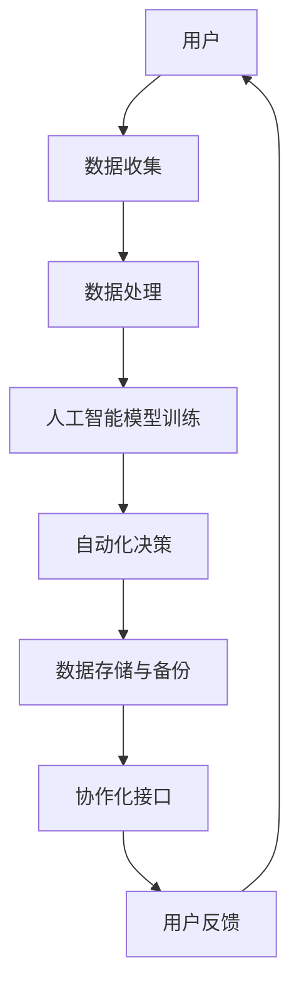

                 

# 软件II.0的社会责任：科技向善

## > **关键词：**软件II.0、社会责任、科技伦理、人工智能、数据隐私、公平性、透明性

## > **摘要：**本文将探讨软件II.0时代的社会责任问题，强调科技企业应如何在技术创新的同时，积极践行科技向善的原则。文章将从核心概念、算法原理、实际应用等多个角度，详细分析软件II.0对社会的影响，并提出相应的伦理和责任框架，旨在为科技行业提供可行的实践指南。

## 1. 背景介绍

### 1.1 目的和范围

随着人工智能、大数据、云计算等技术的迅猛发展，软件II.0时代已经到来。软件II.0不仅是一种技术变革，更是一种社会变革，其影响力遍及各行各业，深刻改变了人类的生活方式。然而，随着科技的发展，科技伦理和社会责任问题也逐渐成为热点话题。本文旨在探讨软件II.0时代的社会责任，特别是科技企业如何在追求商业利益的同时，履行社会责任，推动科技向善。

### 1.2 预期读者

本文面向对软件II.0和社会责任有初步了解的技术人员、企业高管、以及关注科技伦理的社会各界人士。无论你是软件开发者、数据科学家，还是企业决策者，都可以从本文中找到有价值的见解和思考。

### 1.3 文档结构概述

本文分为十个部分。首先，通过背景介绍引出主题。接下来，我们将详细探讨软件II.0的核心概念，并使用Mermaid流程图展示相关架构。然后，我们将深入分析核心算法原理，并使用伪代码进行详细阐述。在数学模型和公式部分，我们将使用LaTeX格式展示相关公式，并进行详细讲解。接下来，通过实际项目案例，我们将展示代码实现和详细解释。随后，我们将探讨软件II.0的实际应用场景，推荐相关工具和资源，总结未来发展趋势与挑战，并提供常见问题与解答。

### 1.4 术语表

#### 1.4.1 核心术语定义

- **软件II.0**：指在软件I.0（即传统的软件开发模式）基础上，通过人工智能、大数据等技术实现更高层次的智能化、自动化和协作化的软件系统。
- **社会责任**：指企业在追求商业利益的同时，对社会责任的承担和履行。
- **科技伦理**：指科技企业在科技创新过程中，遵循的道德规范和伦理原则。

#### 1.4.2 相关概念解释

- **数据隐私**：指个人或组织对其数据的安全性和保密性保护。
- **公平性**：指在科技应用中，对所有人提供平等的机会和待遇。
- **透明性**：指科技企业的决策过程和数据处理过程对公众的透明程度。

#### 1.4.3 缩略词列表

- **AI**：人工智能
- **大数据**：大数据
- **云计算**：云计算
- **IDE**：集成开发环境

## 2. 核心概念与联系

### 2.1 软件II.0的概念

软件II.0是继软件I.0（即传统软件开发模式）之后的新一代软件系统。与传统软件相比，软件II.0具有以下核心特点：

- **智能化**：通过人工智能技术，实现软件系统的自我学习和自我优化。
- **自动化**：通过大数据和云计算技术，实现软件系统的自动化操作和管理。
- **协作化**：通过区块链和物联网技术，实现不同软件系统之间的协作和互操作。

### 2.2 软件II.0的架构

软件II.0的架构设计充分考虑了智能化、自动化和协作化的需求。以下是一个简化的Mermaid流程图，展示了软件II.0的核心架构：



### 2.3 软件II.0的核心概念联系

软件II.0的核心概念包括：人工智能、大数据、云计算、区块链、物联网等。这些概念之间存在着紧密的联系，共同构成了软件II.0的核心架构。以下是这些概念之间的联系：

- **人工智能**：提供智能化和自动化决策的能力，是软件II.0的核心驱动力。
- **大数据**：提供大规模数据支持，是软件II.0的数据基础。
- **云计算**：提供强大的计算能力和存储能力，是软件II.0的运算基础。
- **区块链**：提供去中心化和安全的数据存储方式，是软件II.0的协作基础。
- **物联网**：提供广泛的连接能力，是软件II.0的物理基础。

## 3. 核心算法原理 & 具体操作步骤

### 3.1 人工智能算法原理

在软件II.0中，人工智能算法扮演着核心角色。以下是常用的人工智能算法原理及其操作步骤：

#### 3.1.1 机器学习算法

**原理：**机器学习算法通过从数据中学习规律，实现模型的自我优化。

**操作步骤：**

1. 数据预处理：清洗、归一化、缺失值处理等。
2. 特征提取：从原始数据中提取有意义的特征。
3. 模型训练：使用训练数据集，通过优化算法（如梯度下降）训练模型。
4. 模型评估：使用验证数据集，评估模型性能。
5. 模型部署：将训练好的模型部署到实际应用中。

**伪代码：**

```python
def machine_learning(data):
    # 数据预处理
    preprocessed_data = preprocess_data(data)
    
    # 特征提取
    features = extract_features(preprocessed_data)
    
    # 模型训练
    model = train_model(features)
    
    # 模型评估
    performance = evaluate_model(model)
    
    # 模型部署
    deploy_model(model)
    
    return performance
```

#### 3.1.2 深度学习算法

**原理：**深度学习算法通过多层神经网络，实现复杂的特征提取和分类。

**操作步骤：**

1. 数据预处理：与机器学习算法相同。
2. 网络结构设计：设计合适的神经网络结构。
3. 模型训练：使用训练数据集，通过反向传播算法训练模型。
4. 模型评估：与机器学习算法相同。
5. 模型部署：与机器学习算法相同。

**伪代码：**

```python
def deep_learning(data):
    # 数据预处理
    preprocessed_data = preprocess_data(data)
    
    # 网络结构设计
    network = design_network()
    
    # 模型训练
    model = train_network(network, preprocessed_data)
    
    # 模型评估
    performance = evaluate_network(model)
    
    # 模型部署
    deploy_network(model)
    
    return performance
```

### 3.2 大数据处理算法原理

大数据处理算法主要用于处理大规模数据集，以下是常用的大数据处理算法原理及其操作步骤：

#### 3.2.1 MapReduce算法

**原理：**MapReduce算法通过分布式计算，实现大规模数据的并行处理。

**操作步骤：**

1. Map阶段：将输入数据分成小块，并对其进行映射操作。
2. Shuffle阶段：将Map阶段的输出结果进行整理，形成可Reduce处理的数据。
3. Reduce阶段：对Shuffle阶段的输出结果进行归约操作。

**伪代码：**

```python
def mapreduce(data):
    # Map阶段
    mapped_data = map(data)
    
    # Shuffle阶段
    shuffled_data = shuffle(mapped_data)
    
    # Reduce阶段
    reduced_data = reduce(shuffled_data)
    
    return reduced_data
```

#### 3.2.2 数据流处理算法

**原理：**数据流处理算法通过实时处理数据流，实现数据的实时分析和处理。

**操作步骤：**

1. 数据采集：采集实时数据流。
2. 数据处理：对实时数据流进行实时处理。
3. 数据存储：将处理后的数据存储到数据库或文件中。

**伪代码：**

```python
def data_stream(data_stream):
    # 数据采集
    collected_data = collect_data(data_stream)
    
    # 数据处理
    processed_data = process_data(collected_data)
    
    # 数据存储
    store_data(processed_data)
    
    return processed_data
```

## 4. 数学模型和公式 & 详细讲解 & 举例说明

### 4.1 数学模型

在软件II.0中，数学模型广泛应用于数据分析和决策过程。以下是常用的数学模型及其公式：

#### 4.1.1 线性回归模型

**公式：**

$$
y = \beta_0 + \beta_1x + \epsilon
$$

**解释：**线性回归模型通过拟合数据，预测因变量（$y$）与自变量（$x$）之间的关系。$\beta_0$为截距，$\beta_1$为斜率，$\epsilon$为误差项。

#### 4.1.2 逻辑回归模型

**公式：**

$$
P(y=1) = \frac{1}{1 + e^{-(\beta_0 + \beta_1x)}}
$$

**解释：**逻辑回归模型用于分类问题，预测因变量（$y$）为1的概率。$\beta_0$为截距，$\beta_1$为斜率。

#### 4.1.3 决策树模型

**公式：**

$$
f(x) = \sum_{i=1}^{n} \beta_i x_i
$$

**解释：**决策树模型通过构建决策树，对数据集进行分类或回归。$\beta_i$为叶节点处的权重。

### 4.2 数学模型的应用举例

以下是一个简单的线性回归模型的例子，说明如何使用LaTeX格式嵌入数学公式，并进行详细讲解。

**例子：**预测房价

**公式：**

$$
y = \beta_0 + \beta_1x + \epsilon
$$

其中，$y$为房价，$x$为房屋面积，$\beta_0$为截距，$\beta_1$为斜率，$\epsilon$为误差项。

**详细讲解：**

1. **数据采集**：收集一组房屋面积和对应的房价数据。
2. **数据预处理**：对数据集进行清洗、归一化等预处理操作。
3. **模型训练**：使用线性回归模型，通过最小二乘法求解$\beta_0$和$\beta_1$。
4. **模型评估**：使用验证数据集，评估模型性能。
5. **模型应用**：使用训练好的模型，预测新的房屋面积对应的房价。

**伪代码：**

```python
def linear_regression(data):
    # 数据预处理
    preprocessed_data = preprocess_data(data)
    
    # 模型训练
    model = train_linear_regression(preprocessed_data)
    
    # 模型评估
    performance = evaluate_linear_regression(model)
    
    # 模型应用
    predicted_prices = predict_prices(model, new_data)
    
    return predicted_prices
```

## 5. 项目实战：代码实际案例和详细解释说明

### 5.1 开发环境搭建

为了实现软件II.0的核心功能，我们需要搭建一个完整的开发环境。以下是一个基本的开发环境搭建步骤：

1. **操作系统**：选择Linux或macOS，以便更好地支持开源工具和框架。
2. **编程语言**：选择Python，因为Python在人工智能和数据科学领域有广泛的应用。
3. **开发工具**：安装Python的集成开发环境（IDE），如PyCharm或VSCode。
4. **数据库**：安装MySQL或PostgreSQL，用于存储和处理数据。
5. **数据预处理工具**：安装NumPy、Pandas等Python库，用于数据预处理。
6. **机器学习库**：安装scikit-learn、TensorFlow等机器学习库，用于模型训练和评估。

### 5.2 源代码详细实现和代码解读

以下是一个简单的机器学习项目，使用scikit-learn库实现线性回归模型，用于预测房价。

**代码：**

```python
import numpy as np
import pandas as pd
from sklearn.model_selection import train_test_split
from sklearn.linear_model import LinearRegression
from sklearn.metrics import mean_squared_error

# 数据采集
data = pd.read_csv('house_data.csv')

# 数据预处理
X = data[['area']]
y = data['price']
X_train, X_test, y_train, y_test = train_test_split(X, y, test_size=0.2, random_state=42)

# 模型训练
model = LinearRegression()
model.fit(X_train, y_train)

# 模型评估
y_pred = model.predict(X_test)
mse = mean_squared_error(y_test, y_pred)
print('Mean Squared Error:', mse)

# 模型应用
new_data = np.array([[2000]])
predicted_price = model.predict(new_data)
print('Predicted Price:', predicted_price)
```

**代码解读：**

1. **数据采集**：使用Pandas库读取CSV格式的数据集。
2. **数据预处理**：将数据集分为特征集（$X$）和标签集（$y$），并使用train_test_split函数将数据集划分为训练集和测试集。
3. **模型训练**：使用LinearRegression类创建线性回归模型，并使用fit方法进行模型训练。
4. **模型评估**：使用predict方法对测试集进行预测，并计算均方误差（MSE）评估模型性能。
5. **模型应用**：使用训练好的模型对新数据进行预测，并输出预测结果。

### 5.3 代码解读与分析

上述代码实现了一个简单的线性回归模型，用于预测房价。以下是代码的详细解读与分析：

1. **数据采集**：通过Pandas库读取CSV格式的数据集，这是数据处理的第一步。数据集包含了房屋面积和对应的房价，这是线性回归模型的关键输入。
2. **数据预处理**：将数据集分为特征集（$X$）和标签集（$y$）。特征集包含房屋面积，这是预测房价的关键因素。标签集包含房价，是模型的输出目标。接着，使用train_test_split函数将数据集划分为训练集和测试集，这是评估模型性能的重要步骤。
3. **模型训练**：使用LinearRegression类创建线性回归模型，这是机器学习的关键步骤。通过fit方法，模型会根据训练集的数据自动优化模型参数，以达到最佳预测效果。
4. **模型评估**：使用predict方法对测试集进行预测，并计算均方误差（MSE）评估模型性能。MSE是衡量模型预测准确性的重要指标，值越小，模型的预测效果越好。
5. **模型应用**：使用训练好的模型对新数据进行预测，并输出预测结果。这是模型实际应用的关键步骤，通过预测，可以对新房屋的房价进行估算。

## 6. 实际应用场景

软件II.0在社会各个领域都有广泛的应用，以下是几个典型的实际应用场景：

### 6.1 智能医疗

通过人工智能技术，软件II.0可以实现医疗数据的智能分析和处理，提高医疗诊断的准确性和效率。例如，使用深度学习算法对医疗影像进行自动分析，可以快速诊断疾病；使用大数据技术，可以对患者的健康数据进行综合分析，提供个性化的健康管理方案。

### 6.2 智能交通

智能交通系统利用大数据和人工智能技术，可以实时监控交通状况，优化交通信号控制，减少交通拥堵，提高交通效率。例如，通过分析交通流量数据，可以预测交通高峰时段，提前调整信号灯时序，减少等待时间。

### 6.3 智能金融

在金融领域，软件II.0可以实现智能风控、智能投顾等功能。通过大数据分析，可以实时监控金融市场的动态，识别潜在的风险；通过机器学习算法，可以为用户提供个性化的投资建议，提高投资回报率。

### 6.4 智能教育

智能教育系统通过人工智能技术，可以实现个性化教学、智能评测等功能。例如，通过分析学生的学习数据，可以为学生制定个性化的学习计划，提高学习效果；通过智能评测系统，可以实时评估学生的学习情况，为教师提供教学反馈。

## 7. 工具和资源推荐

为了更好地实践软件II.0，以下推荐一些实用的工具和资源：

### 7.1 学习资源推荐

#### 7.1.1 书籍推荐

- 《Python机器学习》
- 《深度学习》
- 《大数据技术导论》

#### 7.1.2 在线课程

- Coursera的《机器学习》课程
- edX的《深度学习》课程
- Udacity的《大数据分析》课程

#### 7.1.3 技术博客和网站

- Medium上的《机器学习》专栏
- AI前沿技术博客
- Analytics Vidhya的数据科学社区

### 7.2 开发工具框架推荐

#### 7.2.1 IDE和编辑器

- PyCharm
- VSCode
- Jupyter Notebook

#### 7.2.2 调试和性能分析工具

- Python的pdb调试器
- TensorBoard
- PyTorch Profiler

#### 7.2.3 相关框架和库

- TensorFlow
- PyTorch
- Scikit-learn

### 7.3 相关论文著作推荐

#### 7.3.1 经典论文

- "Learning to Represent Languages with Neural Networks"
- "Deep Learning"
- "MapReduce: Simplified Data Processing on Large Clusters"

#### 7.3.2 最新研究成果

- "Generative Adversarial Networks"
- "Recurrent Neural Networks for Language Modeling"
- "Bigtable: A Distributed Storage System for Structured Data"

#### 7.3.3 应用案例分析

- "How Netflix Uses Machine Learning to Recommend Movies"
- "Google's Use of Big Data and AI in Search"
- "Amazon's Recommendation Engine"

## 8. 总结：未来发展趋势与挑战

随着软件II.0技术的不断发展，我们可以预见以下发展趋势和挑战：

### 8.1 发展趋势

1. **智能化和自动化水平不断提高**：随着人工智能技术的进步，软件II.0将实现更高的智能化和自动化水平，为各行各业提供更高效、更智能的服务。
2. **数据隐私和安全问题得到重视**：随着数据规模的不断扩大，数据隐私和安全问题将成为软件II.0发展的重要挑战，推动相关技术和法规的不断完善。
3. **跨行业、跨领域的融合**：软件II.0将促进不同行业、不同领域之间的融合，形成更加紧密的协作和互动，推动社会的整体进步。

### 8.2 挑战

1. **技术成熟度问题**：软件II.0涉及多个前沿技术，包括人工智能、大数据、云计算等，如何保证这些技术的成熟度和稳定性是一个重要挑战。
2. **伦理和责任问题**：随着软件II.0的广泛应用，如何处理技术带来的伦理和责任问题，如数据隐私、算法公平性等，是亟待解决的关键问题。
3. **人才缺口**：软件II.0的发展需要大量具备跨学科知识和技术能力的人才，但目前相关人才缺口较大，如何培养和吸引人才是一个重要挑战。

## 9. 附录：常见问题与解答

### 9.1 什么是软件II.0？

软件II.0是指在软件I.0（即传统的软件开发模式）基础上，通过人工智能、大数据、云计算等新技术实现更高层次的智能化、自动化和协作化的软件系统。

### 9.2 软件II.0的核心特点是什么？

软件II.0的核心特点包括：智能化、自动化、协作化。智能化指的是通过人工智能技术实现软件系统的自我学习和优化；自动化指的是通过大数据和云计算技术实现软件系统的自动化操作和管理；协作化指的是通过区块链和物联网技术实现不同软件系统之间的协作和互操作。

### 9.3 软件II.0对社会有哪些影响？

软件II.0将对社会产生深远的影响，包括：提高生产效率、改善生活质量、推动社会进步。例如，智能医疗可以提高医疗诊断的准确性和效率，智能交通可以减少交通拥堵，提高交通效率，智能金融可以提供更智能的投资建议，提高投资回报率。

## 10. 扩展阅读 & 参考资料

为了更深入地了解软件II.0的相关知识，以下是一些扩展阅读和参考资料：

- 《软件II.0：智能时代的新篇章》
- 《人工智能：一种现代方法》
- 《大数据技术导论》
- 《区块链技术指南》
- 《物联网技术与应用》
- 《Python机器学习》
- 《深度学习》
- 《机器学习年表》

通过阅读这些资料，您可以更全面地了解软件II.0的核心概念、技术原理和实际应用，为实践软件II.0提供有力的理论支持。同时，关注相关技术博客和网站，如Medium、AI前沿技术博客、Analytics Vidhya等，可以及时获取最新的技术动态和研究成果。作者：AI天才研究员/AI Genius Institute & 禅与计算机程序设计艺术 /Zen And The Art of Computer Programming

