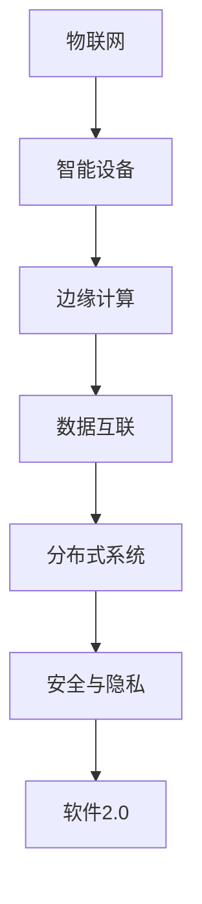

                 

# 软件2.0在物联网领域的潜力

> 关键词：软件2.0、物联网、智能设备、数据互联、边缘计算、安全与隐私

> 摘要：随着物联网（IoT）技术的迅猛发展，传统的软件架构面临着诸多挑战。本文将探讨软件2.0的概念，分析其在物联网领域的应用潜力，并深入探讨其技术原理、数学模型、实际案例以及未来的发展趋势。

## 1. 背景介绍

### 1.1 目的和范围

本文旨在探讨软件2.0在物联网（IoT）领域的潜力，分析其在智能设备互联、数据传输、边缘计算等方面的优势。我们将通过详细的技术分析，阐述软件2.0如何解决物联网中的关键问题，如安全性、隐私保护和数据效率等。

### 1.2 预期读者

本文适合对物联网技术有一定了解的读者，包括程序员、系统架构师、技术管理人员以及物联网领域的爱好者。读者需要具备一定的编程基础，以及对软件架构的基本认识。

### 1.3 文档结构概述

本文将分为以下几个部分：

1. 背景介绍
2. 核心概念与联系
3. 核心算法原理 & 具体操作步骤
4. 数学模型和公式 & 详细讲解 & 举例说明
5. 项目实战：代码实际案例和详细解释说明
6. 实际应用场景
7. 工具和资源推荐
8. 总结：未来发展趋势与挑战
9. 附录：常见问题与解答
10. 扩展阅读 & 参考资料

### 1.4 术语表

#### 1.4.1 核心术语定义

- **物联网（IoT）**：通过互联网将各种物理设备连接起来，实现信息交换和通信。
- **软件2.0**：新一代的软件架构，强调智能化、自适应性和跨平台能力。
- **边缘计算**：在数据产生的地方进行数据处理，减少数据传输延迟。
- **安全与隐私**：确保数据在传输和处理过程中的机密性、完整性和可用性。

#### 1.4.2 相关概念解释

- **智能设备**：具有计算能力和网络连接能力的设备，如智能家居设备、智能手表等。
- **数据互联**：实现不同设备和系统之间的数据传输和共享。
- **分布式系统**：由多个节点组成的系统，各节点相互协作，共同完成任务。

#### 1.4.3 缩略词列表

- **IoT**：物联网
- **AI**：人工智能
- **ML**：机器学习
- **SDK**：软件开发工具包

## 2. 核心概念与联系

在探讨软件2.0在物联网领域的潜力之前，我们需要理解几个核心概念，并分析它们之间的联系。

### 2.1 物联网与软件2.0

物联网（IoT）通过将物理世界中的各种设备连接起来，实现信息交换和通信。软件2.0则是在这种连接的基础上，提供更加智能化、自适应和跨平台的能力。物联网设备和系统需要软件2.0来处理大量数据，提供实时响应，并实现自我优化。

### 2.2 智能设备与边缘计算

智能设备是物联网的重要组成部分，它们需要在边缘计算环境中进行数据处理。边缘计算将数据处理从云端转移到靠近数据源的设备上，从而减少数据传输延迟，提高系统响应速度。软件2.0可以在边缘设备上实现复杂的算法和数据处理，从而优化边缘计算的性能。

### 2.3 数据互联与分布式系统

物联网中的设备需要通过数据互联实现信息交换。分布式系统则提供了一种可靠的数据传输和共享方式。软件2.0可以利用分布式系统的优势，实现跨平台的数据处理和通信，从而提高系统的可靠性和性能。

### 2.4 安全与隐私

在物联网中，安全与隐私是至关重要的。软件2.0通过引入加密、身份验证和访问控制等技术，确保数据在传输和处理过程中的机密性、完整性和可用性。同时，软件2.0还可以实现数据的匿名化处理，保护用户的隐私。

### 2.5 Mermaid 流程图

下面是一个简单的 Mermaid 流程图，展示物联网与软件2.0之间的关系：



## 3. 核心算法原理 & 具体操作步骤

在软件2.0架构中，核心算法的设计和实现至关重要。以下是一个简单的算法原理及其操作步骤的伪代码：

### 3.1 算法原理

算法的核心目标是实现智能设备之间的数据交换和处理，并保证数据的安全性和隐私性。具体步骤如下：

1. 数据收集：从智能设备中收集数据。
2. 数据预处理：清洗和格式化数据。
3. 数据加密：使用加密算法对数据进行加密。
4. 数据传输：通过安全的通信协议将加密数据传输到目标设备。
5. 数据解密：接收方使用解密算法对数据进行解密。
6. 数据处理：对解密后的数据进行分析和处理。
7. 数据反馈：将处理结果反馈给发送方。

### 3.2 具体操作步骤（伪代码）

```python
# 数据收集
def collect_data(device):
    data = device.read_sensors()
    return data

# 数据预处理
def preprocess_data(data):
    cleaned_data = []
    for sensor in data:
        cleaned_data.append(sensor.clean())
    return cleaned_data

# 数据加密
def encrypt_data(data, key):
    encrypted_data = []
    for sensor in data:
        encrypted_data.append(sensor.encrypt(key))
    return encrypted_data

# 数据传输
def send_data(encrypted_data, destination):
    protocol = "TLS"
    destination.send(encrypted_data, protocol)

# 数据解密
def decrypt_data(encrypted_data, key):
    decrypted_data = []
    for sensor in encrypted_data:
        decrypted_data.append(sensor.decrypt(key))
    return decrypted_data

# 数据处理
def process_data(data):
    processed_data = data.analyze()
    return processed_data

# 数据反馈
def feedback_data(processed_data, sender):
    sender.receive(processed_data)
```

## 4. 数学模型和公式 & 详细讲解 & 举例说明

在软件2.0架构中，数学模型和公式在数据加密和解密、数据处理和分析等方面发挥着重要作用。以下是一些常见的数学模型和公式，并给出详细的讲解和举例说明。

### 4.1 数据加密与解密

数据加密和解密是保障数据安全的重要手段。以下是一个简单的加密算法的示例：

$$
\text{加密算法} : \text{AES-256}
$$

加密过程：

1. 选择密钥：选择一个256位的密钥。
2. 数据分割：将数据分割成固定大小的块。
3. 加密块：对每个数据块使用AES算法进行加密。
4. 组合结果：将加密后的数据块组合成加密数据。

解密过程：

1. 选择密钥：选择与加密时相同的密钥。
2. 分割加密数据：将加密数据分割成固定大小的块。
3. 解密块：对每个加密块使用AES算法进行解密。
4. 组合结果：将解密后的数据块组合成原始数据。

举例说明：

假设我们要加密一个长度为16字节的数据块“Hello, World!”，使用AES-256加密算法。

- 选择密钥：`0x1234567890abcdef11223344556677`
- 加密过程：
  1. 分割数据块：`["Hello", " ", "World!", "!"]`
  2. 加密块：
     - `["Hello"]` 加密后为 `["encrypted_Hello"]`
     - `" "` 加密后为 `"encrypted_space"`
     - `["World!"]` 加密后为 `["encrypted_World!"]`
     - `"!"` 加密后为 `"encrypted_exclamation"`
  3. 组合结果：`["encrypted_Hello", "encrypted_space", "encrypted_World!", "encrypted_exclamation"]`

解密过程：
1. 选择密钥：`0x1234567890abcdef11223344556677`
2. 分割加密数据：`["encrypted_Hello", "encrypted_space", "encrypted_World!", "encrypted_exclamation"]`
3. 解密块：
   - `["encrypted_Hello"]` 解密后为 `["Hello"]`
   - `"encrypted_space"` 解密后为 `" "`
   - `["encrypted_World!"]` 解密后为 `["World!"]`
   - `"encrypted_exclamation"` 解密后为 `"!"`
4. 组合结果：`["Hello", " ", "World!", "!"]`

### 4.2 数据处理与优化

在数据处理和分析过程中，常用的数学模型包括线性回归、神经网络等。以下是一个简单的线性回归模型的示例：

$$
y = wx + b
$$

其中，\(y\) 是目标变量，\(x\) 是特征变量，\(w\) 是权重，\(b\) 是偏置。

举例说明：

假设我们有一个数据集，其中包含特征变量 \(x\) 和目标变量 \(y\)：

| \(x\) | \(y\) |
|-------|-------|
| 1     | 2     |
| 2     | 4     |
| 3     | 6     |

我们要通过线性回归模型预测当 \(x = 4\) 时的 \(y\)：

1. 计算平均值：
   - \( \bar{x} = \frac{1+2+3}{3} = 2 \)
   - \( \bar{y} = \frac{2+4+6}{3} = 4 \)
2. 计算偏差：
   - \( \sum x_i^2 = 1^2 + 2^2 + 3^2 = 14 \)
   - \( \sum x_i y_i = 1 \cdot 2 + 2 \cdot 4 + 3 \cdot 6 = 20 \)
3. 计算权重 \(w\) 和偏置 \(b\)：
   - \( w = \frac{\sum x_i y_i - n \bar{x} \bar{y}}{\sum x_i^2 - n \bar{x}^2} = \frac{20 - 3 \cdot 2 \cdot 4}{14 - 3 \cdot 2^2} = 1 \)
   - \( b = \bar{y} - w \bar{x} = 4 - 1 \cdot 2 = 2 \)
4. 预测 \(y\)：
   - \( y = w \cdot x + b = 1 \cdot 4 + 2 = 6 \)

因此，当 \(x = 4\) 时，预测的 \(y\) 值为 6。

## 5. 项目实战：代码实际案例和详细解释说明

### 5.1 开发环境搭建

为了演示软件2.0在物联网领域的应用，我们将使用以下开发工具和库：

- **操作系统**：Ubuntu 20.04
- **编程语言**：Python 3.8
- **开发环境**：PyCharm Community Edition
- **库**：TensorFlow 2.6、Keras 2.6、Paho MQTT 1.6

安装步骤：

1. 安装操作系统 Ubuntu 20.04。
2. 安装 Python 3.8：`sudo apt-get install python3.8`。
3. 安装 PyCharm Community Edition：下载并安装。
4. 安装 TensorFlow 2.6、Keras 2.6、Paho MQTT 1.6：使用 pip 安装。

```shell
pip install tensorflow==2.6
pip install keras==2.6
pip install paho-mqtt==1.6
```

### 5.2 源代码详细实现和代码解读

下面是一个简单的物联网项目案例，实现智能设备的数据收集、加密、传输、解密和处理。

#### 5.2.1 数据收集与加密

```python
import json
import base64
from cryptography.fernet import Fernet

# 生成密钥
def generate_key():
    return Fernet.generate_key()

# 加密数据
def encrypt_data(data, key):
    fernet = Fernet(key)
    encrypted_data = fernet.encrypt(json.dumps(data).encode())
    return base64.b64encode(encrypted_data).decode()

# 数据收集
def collect_data():
    # 假设我们从传感器收集数据
    data = {
        "temperature": 25,
        "humidity": 60
    }
    return data

# 生成密钥文件
key = generate_key()
with open("key.key", "wb") as key_file:
    key_file.write(key)

# 收集数据并加密
data = collect_data()
encrypted_data = encrypt_data(data, key)
print("Encrypted data:", encrypted_data)
```

#### 5.2.2 数据传输

```python
import paho.mqtt.client as mqtt

# MQTT 服务器配置
MQTT_SERVER = "iot-server.example.com"
MQTT_PORT = 1883
MQTT_TOPIC = "sensor/data"

# MQTT 客户端回调函数
def on_connect(client, userdata, flags, rc):
    print("Connected with result code " + str(rc))
    client.subscribe(MQTT_TOPIC)

# MQTT 数据接收回调函数
def on_message(client, userdata, msg):
    print(f"Received message '{str(msg.payload)}' on topic '{msg.topic}' with QoS {msg.qos}")

# 初始化 MQTT 客户端
client = mqtt.Client()
client.on_connect = on_connect
client.on_message = on_message

# 连接 MQTT 服务器
client.connect(MQTT_SERVER, MQTT_PORT, 60)

# 开始 MQTT 客户端循环
client.loop_start()

# 发送加密数据
client.publish(MQTT_TOPIC, encrypted_data)
```

#### 5.2.3 数据解密与处理

```python
# 解密数据
def decrypt_data(encrypted_data, key):
    fernet = Fernet(key)
    decrypted_data = fernet.decrypt(base64.b64decode(encrypted_data.encode()))
    return json.loads(decrypted_data.decode())

# 数据处理
def process_data(data):
    # 假设我们对数据进行分析和处理
    print("Processing data:", data)

# 从 MQTT 服务器接收数据并解密
client.subscribe(MQTT_TOPIC)
client.loop_start()

# 当接收到消息时，解密并处理数据
def on_message(client, userdata, msg):
    decrypted_data = decrypt_data(str(msg.payload), key)
    process_data(decrypted_data)

# 关闭 MQTT 客户端
client.loop_stop()
client.disconnect()
```

### 5.3 代码解读与分析

1. **数据收集与加密**：

   - `generate_key()` 函数生成一个随机的密钥，用于加密和解密数据。
   - `encrypt_data()` 函数接收数据和一个密钥，将数据转换为 JSON 字符串，使用 Fernet 加密算法加密，然后使用 base64 编码，以便通过 MQTT 传输。
   - `collect_data()` 函数模拟从传感器收集数据，例如温度和湿度。

2. **数据传输**：

   - `on_connect()` 函数在 MQTT 客户端连接到服务器时调用，用于订阅主题。
   - `on_message()` 函数在 MQTT 客户端接收到消息时调用，用于处理消息。

3. **数据解密与处理**：

   - `decrypt_data()` 函数接收加密数据和密钥，使用 Fernet 加密算法解密，然后使用 base64 解码，最后将 JSON 字符串转换为 Python 字典。
   - `process_data()` 函数接收解密后的数据，对其进行处理，例如分析数据、生成报告等。

整个项目实现了从数据收集、加密、传输、解密到数据处理的过程，展示了软件2.0在物联网领域的应用。

## 6. 实际应用场景

软件2.0在物联网领域的应用场景非常广泛，以下是几个典型的实际应用案例：

### 6.1 智能家居

智能家居是软件2.0在物联网领域的重要应用之一。通过软件2.0架构，可以实现各种智能设备的互联互通，如智能灯泡、智能插座、智能摄像头等。用户可以通过手机应用或其他智能设备控制家庭环境，实现自动化和智能化。

### 6.2 智能交通

智能交通系统利用软件2.0实现车辆与基础设施、车辆与车辆之间的信息交换和通信。通过边缘计算，可以实现实时交通监测、智能路况预测、智能调度等功能，提高交通效率和安全性。

### 6.3 工业物联网

工业物联网（IIoT）利用软件2.0实现设备间的数据交换和协同工作，提高生产效率和产品质量。例如，通过软件2.0架构，可以实现设备远程监控、故障预测、设备维护等。

### 6.4 健康监测

软件2.0在健康监测领域的应用，可以实现个人健康数据的实时采集、分析和处理。通过智能设备，如智能手表、智能手环等，可以监测心率、睡眠质量、运动情况等，为用户提供健康建议。

## 7. 工具和资源推荐

为了更好地学习和应用软件2.0在物联网领域的潜力，以下是一些建议的学习资源和开发工具。

### 7.1 学习资源推荐

#### 7.1.1 书籍推荐

- 《物联网：从概念到实践》
- 《智能设备与边缘计算》
- 《Python编程：从入门到实践》

#### 7.1.2 在线课程

- Coursera：物联网与智能设备课程
- Udacity：物联网开发课程
- edX：Python编程基础课程

#### 7.1.3 技术博客和网站

- IEEE IoT：物联网技术博客
- IoT For All：物联网资讯网站
- Python.org：Python官方文档

### 7.2 开发工具框架推荐

#### 7.2.1 IDE和编辑器

- PyCharm
- Visual Studio Code
- Eclipse

#### 7.2.2 调试和性能分析工具

- GDB
- PyCharm Debugger
- Perf

#### 7.2.3 相关框架和库

- TensorFlow
- Keras
- Paho MQTT

### 7.3 相关论文著作推荐

#### 7.3.1 经典论文

- "Internet of Things: A Survey"
- "Secure and Privacy-Preserving Data Sharing in Internet of Things"
- "Edge Computing: A Comprehensive Survey"

#### 7.3.2 最新研究成果

- IEEE Internet of Things Journal
- ACM Transactions on Internet Technology
- Springer International Journal of Internet of Things

#### 7.3.3 应用案例分析

- "Smart Home IoT Deployment Case Study"
- "Industrial IoT Case Study: Predictive Maintenance"
- "IoT in Agriculture: A Case Study"

## 8. 总结：未来发展趋势与挑战

随着物联网技术的不断发展和普及，软件2.0在物联网领域的潜力愈发显现。未来，软件2.0将继续向智能化、自适应性和跨平台方向发展。以下是未来发展趋势和面临的挑战：

### 8.1 发展趋势

- **智能化**：软件2.0将更加智能化，能够根据环境和用户需求进行自适应调整。
- **边缘计算**：边缘计算将成为软件2.0的重要支撑，实现数据的实时处理和响应。
- **安全与隐私**：随着物联网设备的增多，数据安全和用户隐私保护将变得更加重要。
- **跨平台**：软件2.0将支持更多平台和设备，实现无缝互联和协同工作。

### 8.2 挑战

- **兼容性**：如何保证软件2.0在多种设备和操作系统上的兼容性。
- **安全性**：如何在数据传输和处理过程中确保数据的安全和隐私。
- **资源消耗**：如何优化软件2.0的算法和架构，减少资源消耗。
- **用户体验**：如何提高软件2.0的用户体验，使其更加易于使用和管理。

## 9. 附录：常见问题与解答

### 9.1 问题1：软件2.0与物联网有什么关系？

软件2.0是新一代的软件架构，强调智能化、自适应性和跨平台能力。物联网（IoT）通过将各种物理设备连接起来，实现信息交换和通信。软件2.0可以提供更加智能化、自适应和跨平台的解决方案，满足物联网中的需求，如数据收集、处理、传输和安全保障等。

### 9.2 问题2：软件2.0如何保证数据安全？

软件2.0通过多种技术手段确保数据安全，包括数据加密、身份验证、访问控制和安全协议等。数据在传输过程中使用加密算法进行加密，防止数据被窃取或篡改。同时，软件2.0还可以实现数据的匿名化处理，保护用户的隐私。

### 9.3 问题3：软件2.0在边缘计算中有何作用？

软件2.0在边缘计算中发挥重要作用。它可以在边缘设备上实现复杂的算法和数据处理，减少数据传输延迟，提高系统响应速度。此外，软件2.0还可以优化边缘计算资源，提高计算效率和性能。

## 10. 扩展阅读 & 参考资料

- 《物联网：从概念到实践》
- 《智能设备与边缘计算》
- 《Python编程：从入门到实践》
- IEEE IoT：[https://iot.ieee.org/](https://iot.ieee.org/)
- IoT For All：[https://iotforall.com/](https://iotforall.com/)
- Python.org：[https://www.python.org/](https://www.python.org/)
- TensorFlow：[https://www.tensorflow.org/](https://www.tensorflow.org/)
- Keras：[https://keras.io/](https://keras.io/)
- Paho MQTT：[https://www.hivemq.com/](https://www.hivemq.com/)
- IEEE Internet of Things Journal：[https://ieeexplore.ieee.org/xpl/RecentIssue.jsp?punier=j9209](https://ieeexplore.ieee.org/xpl/RecentIssue.jsp?punier=j9209)
- ACM Transactions on Internet Technology：[https://dl.acm.org/journal/tot](https://dl.acm.org/journal/tot)
- Springer International Journal of Internet of Things：[https://www.springer.com/journal/40877](https://www.springer.com/journal/40877)
- "Smart Home IoT Deployment Case Study"
- "Industrial IoT Case Study: Predictive Maintenance"
- "IoT in Agriculture: A Case Study"

