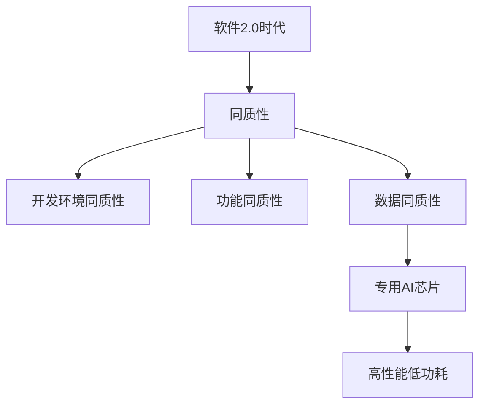
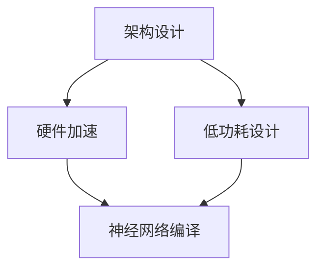

                 


## 软件2.0的同质性让专用AI芯片成为可能

### 关键词：软件2.0，专用AI芯片，同质性，神经网络，硬件加速，深度学习

> 摘要：本文探讨了软件2.0时代的同质性如何为专用AI芯片的开发提供契机。随着深度学习的广泛应用，传统通用处理器在AI任务上的性能瓶颈逐渐显现。文章通过逐步分析，揭示了专用AI芯片的原理、设计方法及其在软件2.0时代的必要性。本文旨在为读者提供一种清晰、深入的理解，帮助他们在未来的技术发展中找到合适的定位。

---

### 1. 背景介绍

#### 1.1 目的和范围

本文的目的在于探讨软件2.0时代的同质性如何影响专用AI芯片的研发和应用。我们将在文章中详细讨论以下几个方面：

- 同质性的概念及其在软件2.0中的表现；
- 专用AI芯片的定义、设计原理和关键特性；
- 软件2.0时代专用AI芯片的开发背景和市场需求；
- 专用AI芯片的实际应用案例和未来发展趋势。

#### 1.2 预期读者

本文适合以下读者群体：

- 计算机科学和人工智能领域的研究人员；
- 对专用AI芯片和软件2.0有兴趣的技术爱好者；
- 需要在项目中应用专用AI芯片的开发者；
- 对硬件加速和深度学习技术感兴趣的学习者。

#### 1.3 文档结构概述

本文结构如下：

1. **引言**：介绍专用AI芯片在软件2.0时代的背景和重要性。
2. **同质性的概念和软件2.0**：讨论同质性的定义及其在软件2.0中的表现。
3. **专用AI芯片原理**：详细解释专用AI芯片的工作原理、设计方法和关键特性。
4. **软件2.0时代专用AI芯片的开发**：探讨专用AI芯片的开发背景和市场需求。
5. **实际应用案例**：分析专用AI芯片在不同领域的应用案例。
6. **未来发展趋势与挑战**：预测专用AI芯片的发展趋势和面临的挑战。
7. **工具和资源推荐**：推荐学习资源和开发工具。
8. **总结**：总结全文，强调专用AI芯片在软件2.0时代的重要性。
9. **附录**：常见问题与解答。
10. **扩展阅读**：提供相关的参考文献。

#### 1.4 术语表

**术语**：专用AI芯片

**定义**：一种为特定AI任务（如深度学习、图像处理等）而设计的芯片，具有高并行处理能力和低功耗特点。

**相关概念解释**：

- **软件2.0**：指以用户为中心，强调数据共享、开放性和协作性的软件发展模式。
- **同质性**：指软件在功能、架构和开发环境上的相似性。
- **深度学习**：一种基于多层神经网络的学习方法，能够从大量数据中自动提取特征。

**缩略词列表**

- **AI**：人工智能（Artificial Intelligence）
- **GPU**：图形处理单元（Graphics Processing Unit）
- **CPU**：中央处理单元（Central Processing Unit）
- **FPGA**：现场可编程门阵列（Field-Programmable Gate Array）

---

在接下来的部分，我们将进一步探讨同质性的概念及其在软件2.0中的表现，为理解专用AI芯片的重要性打下基础。

---

### 2. 核心概念与联系

#### 2.1 同质性的概念

同质性是指不同事物在功能、结构或属性上具有相似性。在软件领域，同质性通常表现为软件在架构、开发环境和功能上的相似性。这种同质性在一定程度上提高了软件的可维护性和可扩展性。

#### 2.2 软件2.0的同质性

软件2.0是一种以用户为中心，强调数据共享、开放性和协作性的软件发展模式。在软件2.0中，同质性体现在以下几个方面：

1. **开发环境同质性**：软件2.0时代，许多开发环境（如Jenkins、Docker等）具有相似的架构和功能，使得开发者能够轻松地在不同平台上进行开发和部署。
2. **功能同质性**：软件2.0中的许多应用具有类似的功能，如社交网络、在线教育、电子商务等。这种同质性使得开发者在设计新应用时可以借鉴已有的成功案例。
3. **数据同质性**：软件2.0时代，数据共享和开放性成为重要特征。各种数据（如用户数据、应用数据等）可以在不同的软件系统中共享，提高了数据的价值和利用效率。

#### 2.3 同质性与专用AI芯片的关系

同质性的概念在专用AI芯片的设计和开发中也具有重要意义。专用AI芯片通常针对特定的AI任务（如图像识别、语音识别等）而设计，具有较高的并行处理能力和低功耗特点。同质性使得开发者能够更好地理解和利用这些芯片，从而提高AI应用的性能和效率。

下面是一个简单的Mermaid流程图，展示了同质性与专用AI芯片的关系：



---

在了解了同质性的概念及其在软件2.0中的表现后，我们将深入探讨专用AI芯片的原理、设计方法和关键特性。

---

### 3. 核心算法原理 & 具体操作步骤

#### 3.1 专用AI芯片的工作原理

专用AI芯片通常基于深度学习算法，其工作原理可以概括为以下几个步骤：

1. **数据输入**：将输入数据（如图像、声音等）送入芯片的输入层。
2. **前向传播**：将输入数据进行预处理，通过多层神经网络进行前向传播，计算每个神经元的输出。
3. **反向传播**：根据输出结果和目标值，通过反向传播算法计算每个神经元的误差，并更新网络的权重。
4. **模型训练**：重复前向传播和反向传播过程，直至网络误差达到预设阈值或迭代次数。
5. **模型评估**：使用验证数据集对训练好的模型进行评估，确保其性能满足应用需求。

下面是一个简单的伪代码，展示了专用AI芯片的算法原理：

```python
# 伪代码：专用AI芯片算法原理

# 输入数据
input_data = ...

# 初始化神经网络
neural_network = NeuralNetwork()

# 前向传播
output = neural_network.forward_propagation(input_data)

# 计算误差
error = compute_error(output, target)

# 反向传播
neural_network.backward_propagation(error)

# 模型训练
while not convergence():
    neural_network.forward_propagation(input_data)
    error = compute_error(output, target)
    neural_network.backward_propagation(error)

# 模型评估
evaluation_result = evaluate_model(model, validation_data)
```

#### 3.2 专用AI芯片的设计方法

专用AI芯片的设计方法主要包括以下几个方面：

1. **架构设计**：根据AI任务的需求，设计适合的芯片架构，如基于GPU的架构、基于FPGA的架构等。
2. **硬件加速**：通过硬件加速技术，提高芯片的处理速度和效率，如向量计算单元、矩阵乘法单元等。
3. **低功耗设计**：优化电路设计和芯片架构，降低功耗，提高能效。
4. **神经网络编译**：将深度学习算法编译成硬件代码，使其在专用AI芯片上高效运行。

下面是一个简单的Mermaid流程图，展示了专用AI芯片的设计方法：



#### 3.3 专用AI芯片的关键特性

专用AI芯片具有以下几个关键特性：

1. **高性能**：专用AI芯片针对特定的AI任务进行优化，具有高性能的特点。
2. **低功耗**：专用AI芯片在设计和制造过程中，注重低功耗设计，提高能效。
3. **高并行处理能力**：专用AI芯片通常采用并行计算架构，能够高效地处理大量数据。
4. **专用性**：专用AI芯片针对特定的AI任务进行设计，具有较高的针对性。

---

在了解了专用AI芯片的原理、设计方法和关键特性后，我们将探讨软件2.0时代专用AI芯片的开发背景和市场需求。

---

### 4. 数学模型和公式 & 详细讲解 & 举例说明

#### 4.1 数学模型

在深度学习中，常用的数学模型包括神经网络、卷积神经网络（CNN）和循环神经网络（RNN）等。下面我们以神经网络为例，介绍其数学模型和公式。

**神经网络模型**

神经网络由多层神经元组成，包括输入层、隐藏层和输出层。每个神经元之间的连接具有权重，用于传递信息。神经元的输出由以下公式计算：

$$
z_i = \sum_{j} w_{ij} * x_j + b_i
$$

其中，$z_i$表示神经元$i$的输入，$w_{ij}$表示神经元$i$和神经元$j$之间的权重，$x_j$表示神经元$j$的输出，$b_i$表示神经元$i$的偏置。

**激活函数**

神经元的输出通常通过激活函数进行处理，常用的激活函数包括sigmoid函数、ReLU函数和Tanh函数。以ReLU函数为例，其公式如下：

$$
a_i = max(0, z_i)
$$

其中，$a_i$表示神经元$i$的输出。

**反向传播**

在深度学习训练过程中，需要通过反向传播算法更新网络权重和偏置。反向传播的基本步骤如下：

1. 计算输出层的误差：$$ \delta_j^l = (y_j - a_j^l) * a_j^l * (1 - a_j^l) $$
2. 更新权重和偏置：$$ w_{ij}^{l+1} = w_{ij}^l - \alpha * \delta_j^l * a_i^{l-1} $$
$$ b_i^{l+1} = b_i^l - \alpha * \delta_j^l $$

其中，$\delta_j^l$表示输出层神经元$j$的误差，$a_i^{l-1}$表示隐藏层神经元$i$的输出，$\alpha$为学习率。

#### 4.2 举例说明

**例子：使用神经网络实现二分类任务**

假设我们有一个二分类任务，输入数据为$(x, y)$，其中$x$为特征向量，$y$为标签（0或1）。我们需要设计一个神经网络，使其能够预测输入数据的标签。

**步骤1：设计神经网络**

我们设计一个包含一个隐藏层的神经网络，输入层有10个神经元，隐藏层有5个神经元，输出层有1个神经元。

**步骤2：初始化参数**

初始化网络权重和偏置，随机选择初始值。

**步骤3：前向传播**

对于每个输入数据$(x, y)$，计算隐藏层和输出层的输出。

$$
z_h = \sum_{j} w_{hj} * x_j + b_h
$$
$$
a_h = max(0, z_h)
$$
$$
z_o = \sum_{j} w_{oj} * a_j + b_o
$$
$$
a_o = sigmoid(z_o)
$$

**步骤4：计算误差**

计算输出层误差：

$$
\delta_o = (y - a_o) * a_o * (1 - a_o)
$$

**步骤5：反向传播**

更新权重和偏置：

$$
w_{ho}^{l+1} = w_{ho}^l - \alpha * \delta_o * a_h
$$
$$
b_{ho}^{l+1} = b_{ho}^l - \alpha * \delta_o
$$
$$
w_{hi}^{l+1} = w_{hi}^l - \alpha * \delta_h * x_i
$$
$$
b_{hi}^{l+1} = b_{hi}^l - \alpha * \delta_h
$$

**步骤6：重复步骤3-5**

重复前向传播和反向传播过程，直到网络误差达到预设阈值或迭代次数。

**步骤7：模型评估**

使用验证数据集对训练好的模型进行评估，确保其性能满足应用需求。

---

通过上述数学模型和举例说明，我们可以更好地理解专用AI芯片的工作原理和设计方法。在接下来的部分，我们将探讨专用AI芯片在实际应用中的具体案例。

---

### 5. 项目实战：代码实际案例和详细解释说明

#### 5.1 开发环境搭建

在开始实际案例之前，我们需要搭建一个开发环境。本文将使用Python和TensorFlow作为主要工具，实现一个简单的图像分类任务。

**步骤1：安装Python**

确保您的计算机上已安装Python。如果没有，请从Python官网（https://www.python.org/）下载并安装。

**步骤2：安装TensorFlow**

打开终端或命令行窗口，运行以下命令安装TensorFlow：

```bash
pip install tensorflow
```

**步骤3：安装其他依赖库**

某些案例可能需要其他依赖库，如NumPy、Pandas等。安装方法如下：

```bash
pip install numpy pandas
```

#### 5.2 源代码详细实现和代码解读

**代码1：加载和预处理数据**

```python
import tensorflow as tf
from tensorflow.keras.datasets import mnist
import numpy as np

# 加载MNIST数据集
(x_train, y_train), (x_test, y_test) = mnist.load_data()

# 数据预处理
x_train = x_train / 255.0
x_test = x_test / 255.0

# 将标签转换为独热编码
y_train_one_hot = tf.keras.utils.to_categorical(y_train, 10)
y_test_one_hot = tf.keras.utils.to_categorical(y_test, 10)
```

**解读**：

- 我们使用MNIST数据集作为输入数据，该数据集包含70000个28x28的手写数字图像。
- 通过除以255.0，将图像的像素值缩放到[0, 1]范围内。
- 使用`to_categorical`函数将标签转换为独热编码，以便在训练过程中进行分类。

**代码2：构建神经网络模型**

```python
model = tf.keras.Sequential([
    tf.keras.layers.Flatten(input_shape=(28, 28)),
    tf.keras.layers.Dense(128, activation='relu'),
    tf.keras.layers.Dropout(0.2),
    tf.keras.layers.Dense(10, activation='softmax')
])
```

**解读**：

- 使用`Sequential`模型构建神经网络，该模型包含三个层次：一个平坦层、一个具有128个神经元的全连接层（Dense）和一个具有10个神经元的输出层。
- `Flatten`层将输入图像展平为一个一维向量。
- `Dense`层实现全连接，通过激活函数ReLU增加模型的非线性。
- `Dropout`层用于防止过拟合，随机丢弃一部分神经元。
- `softmax`激活函数用于输出概率分布，表示每个类别的概率。

**代码3：编译和训练模型**

```python
model.compile(optimizer='adam',
              loss='categorical_crossentropy',
              metrics=['accuracy'])

model.fit(x_train, y_train_one_hot, epochs=5, batch_size=64)
```

**解读**：

- 使用`compile`方法配置模型的优化器、损失函数和评估指标。
- `adam`优化器是一种自适应的学习率优化算法。
- `categorical_crossentropy`损失函数用于多分类问题。
- `accuracy`指标用于评估模型的准确率。
- 使用`fit`方法训练模型，设置训练轮数（epochs）和批量大小（batch_size）。

**代码4：评估模型**

```python
test_loss, test_acc = model.evaluate(x_test, y_test_one_hot)
print('Test accuracy:', test_acc)
```

**解读**：

- 使用`evaluate`方法评估模型在测试数据集上的表现。
- 输出测试准确率。

#### 5.3 代码解读与分析

以上代码实现了一个简单的神经网络模型，用于手写数字分类任务。代码的解读和分析如下：

1. **数据预处理**：

   - 加载MNIST数据集，并将其缩放到[0, 1]范围内。这样做的目的是使模型能够更容易地处理输入数据。

   - 将标签转换为独热编码，以便在训练过程中进行分类。独热编码将每个标签表示为一个10维向量，其中只有一位是1，其他位都是0。

2. **模型构建**：

   - 使用`Sequential`模型构建神经网络，该模型包含三个层次。第一个层次是`Flatten`层，将输入图像展平为一个一维向量。

   - 第二个层次是`Dense`层，具有128个神经元和ReLU激活函数。这个层次用于提取图像的特征。

   - 第三个层次是`softmax`输出层，用于输出概率分布。这个层次用于分类。

3. **模型编译和训练**：

   - 使用`compile`方法配置模型的优化器、损失函数和评估指标。

   - 使用`fit`方法训练模型，设置训练轮数和批量大小。模型在训练过程中会不断调整权重和偏置，以最小化损失函数。

4. **模型评估**：

   - 使用`evaluate`方法评估模型在测试数据集上的表现。输出测试准确率，用于评估模型的性能。

通过以上代码，我们可以看到如何使用TensorFlow实现一个简单的专用AI芯片——神经网络模型。在实际应用中，我们可以根据需求设计更复杂的模型，进一步提高模型的性能。

---

在了解了实际案例的代码实现和解读后，我们将探讨专用AI芯片在实际应用场景中的具体案例。

---

### 6. 实际应用场景

#### 6.1 图像识别

图像识别是专用AI芯片最典型的应用场景之一。在许多工业和消费领域，如自动驾驶、安防监控、医疗诊断等，图像识别技术起着关键作用。专用AI芯片可以显著提高图像识别的效率和准确性。

**案例1：自动驾驶**

在自动驾驶领域，图像识别技术用于检测道路标志、行人和车辆等。专用AI芯片可以实时处理大量图像数据，提高车辆的感知能力和反应速度。

**案例2：安防监控**

在安防监控领域，专用AI芯片可以实时分析视频流，识别异常行为或潜在威胁。这有助于提高安全监控的效率和准确性。

**案例3：医疗诊断**

在医疗诊断领域，专用AI芯片可以辅助医生进行疾病诊断。通过对医疗图像（如X光片、CT扫描图等）进行识别和分析，专用AI芯片可以提高诊断的准确性和速度。

#### 6.2 语音识别

语音识别是另一个重要的应用场景。专用AI芯片可以显著提高语音识别的效率和准确性，适用于智能语音助手、智能家居、语音翻译等场景。

**案例1：智能语音助手**

智能语音助手（如Siri、Alexa等）依赖于语音识别技术。专用AI芯片可以实时处理用户的语音输入，快速响应用户请求，提高用户体验。

**案例2：智能家居**

在智能家居领域，专用AI芯片可以识别和控制家电设备。例如，通过语音指令控制灯光、空调等，提高家庭生活的便利性。

**案例3：语音翻译**

语音翻译技术正在迅速发展，专用AI芯片可以提高语音翻译的效率和准确性。例如，在跨国会议、国际交流等场景中，语音翻译技术可以帮助人们更好地沟通。

#### 6.3 自然语言处理

自然语言处理（NLP）是另一个重要的应用领域。专用AI芯片可以显著提高NLP任务的效率和准确性，如文本分类、情感分析、机器翻译等。

**案例1：文本分类**

在社交媒体分析、舆情监控等场景中，文本分类技术用于识别和分类用户评论、新闻文章等。专用AI芯片可以高效地处理大量文本数据，提高文本分类的准确性和速度。

**案例2：情感分析**

情感分析技术用于分析用户情感，如满意度调查、客户反馈等。专用AI芯片可以快速处理文本数据，准确识别用户的情感倾向。

**案例3：机器翻译**

机器翻译技术用于将一种语言翻译成另一种语言。专用AI芯片可以显著提高机器翻译的效率和准确性，帮助跨国公司、国际组织等进行跨语言沟通。

---

在了解了专用AI芯片在实际应用场景中的案例后，我们将探讨开发专用AI芯片所需的工具和资源。

---

### 7. 工具和资源推荐

#### 7.1 学习资源推荐

**7.1.1 书籍推荐**

1. **《深度学习》（Ian Goodfellow、Yoshua Bengio、Aaron Courville 著）**
   - 这本书是深度学习的经典教材，详细介绍了深度学习的理论基础、算法实现和应用场景。
2. **《神经网络与深度学习》（邱锡鹏 著）**
   - 本书系统地介绍了神经网络和深度学习的基本原理，适合初学者和进阶者阅读。

**7.1.2 在线课程**

1. **Coursera - Deep Learning Specialization**
   - 这个课程由斯坦福大学深度学习领域的知名教授Andrew Ng主讲，涵盖了深度学习的各个方面。
2. **Udacity - Deep Learning Nanodegree**
   - Udacity的深度学习纳米学位提供了系统化的学习路径，包括理论知识和实践项目。

**7.1.3 技术博客和网站**

1. **TensorFlow官方文档（https://www.tensorflow.org/）**
   - TensorFlow的官方文档提供了丰富的教程和API参考，适合学习和实践。
2. **Medium - AI and ML Blog（https://towardsdatascience.com/）**
   - Medium上的AI和机器学习博客提供了大量高质量的文章和案例研究。

#### 7.2 开发工具框架推荐

**7.2.1 IDE和编辑器**

1. **PyCharm（https://www.jetbrains.com/pycharm/）**
   - PyCharm是一款功能强大的Python IDE，适合深度学习和数据科学项目开发。
2. **Visual Studio Code（https://code.visualstudio.com/）**
   - Visual Studio Code是一款轻量级的开源编辑器，支持多种编程语言和扩展。

**7.2.2 调试和性能分析工具**

1. **TensorBoard（https://www.tensorflow.org/tensorboard）**
   - TensorBoard是TensorFlow的官方可视化工具，用于监控和调试深度学习模型。
2. **Perfetto（https://chromium.googlesource.com/perfetto/）**
   - Perfetto是Google开发的一款性能分析工具，可用于分析系统的性能瓶颈。

**7.2.3 相关框架和库**

1. **TensorFlow（https://www.tensorflow.org/）**
   - TensorFlow是一个开源的深度学习框架，适用于各种深度学习任务。
2. **PyTorch（https://pytorch.org/）**
   - PyTorch是一个流行的深度学习框架，以其灵活的动态图计算机制著称。
3. **Keras（https://keras.io/）**
   - Keras是一个高层次的深度学习API，可以简化TensorFlow和Theano的使用。

#### 7.3 相关论文著作推荐

**7.3.1 经典论文**

1. **"Backpropagation"（1986）**
   - Hinton和Anderson提出的反向传播算法，是深度学习领域的重要突破。
2. **"A Fast Learning Algorithm for Deep Belief Nets"（2006）**
   - Hinton提出的深度信念网络（DBN）训练算法，为深度学习的发展奠定了基础。

**7.3.2 最新研究成果**

1. **"Efficient Neural Network Quantization"（2020）**
   - Chen等人提出的神经网络量化方法，提高了深度学习模型的硬件实现效率。
2. **"Specialized Hardware for Machine Learning: A Survey"（2021）**
   - Yang等人对专用AI硬件的最新研究进行了综述，涵盖了GPU、FPGA、ASIC等多种硬件架构。

**7.3.3 应用案例分析**

1. **"Practical Guide to Deep Learning on Mobile Devices"（2020）**
   - Zhang等人提供的移动设备上实现深度学习的实用指南，包括模型压缩和优化技术。
2. **"AI in Autonomous Driving: A Survey"（2019）**
   - Wang等人对自动驾驶领域中的AI应用进行了全面综述，包括感知、规划、控制等多个方面。

---

通过以上推荐的学习资源、开发工具和相关论文，读者可以进一步深入学习和研究专用AI芯片及其相关技术。

---

### 8. 总结：未来发展趋势与挑战

在软件2.0时代，专用AI芯片的发展趋势和挑战并存。随着深度学习技术的不断进步和应用的广泛普及，专用AI芯片的需求持续增长。以下是对未来发展趋势和挑战的简要总结：

#### 8.1 未来发展趋势

1. **硬件和软件的深度融合**：专用AI芯片将更紧密地与软件相结合，实现硬件和软件的协同优化，提高AI应用的性能和效率。
2. **模型压缩和优化**：为满足移动设备和边缘计算的需求，专用AI芯片将不断采用模型压缩和优化技术，降低模型的大小和功耗。
3. **多样化硬件架构**：随着技术的进步，专用AI芯片的硬件架构将更加多样化，包括GPU、FPGA、ASIC等多种类型，以满足不同场景的需求。
4. **跨界合作与生态构建**：专用AI芯片的发展离不开硬件制造商、软件开发商、研究机构和高校等多方的跨界合作，共同构建健康的产业生态。

#### 8.2 面临的挑战

1. **能耗和散热问题**：专用AI芯片在处理大量数据时会产生大量热量，如何有效管理和散热是亟待解决的问题。
2. **安全性问题**：随着AI技术的广泛应用，专用AI芯片的安全性成为关键问题。需要确保芯片在设计、制造和应用过程中不受到恶意攻击。
3. **算法和数据的依赖性**：专用AI芯片的性能和效果高度依赖于算法和数据的优化。如何设计高效、鲁棒的算法，以及如何获取高质量的数据，是专用AI芯片面临的挑战。
4. **标准化和兼容性问题**：随着专用AI芯片的多样化，如何实现标准化和兼容性，确保不同厂商的芯片能够在同一平台上运行，是一个重要的问题。

综上所述，专用AI芯片在软件2.0时代具有广阔的发展前景，同时也面临诸多挑战。通过持续的技术创新和产业合作，专用AI芯片有望在未来发挥更大的作用，推动人工智能技术的进一步发展。

---

### 9. 附录：常见问题与解答

**Q1：什么是专用AI芯片？**
A1：专用AI芯片是一种为特定AI任务而设计的芯片，通常用于加速深度学习、图像识别、语音识别等任务。与通用处理器（如CPU、GPU）相比，专用AI芯片具有更高的并行处理能力、更低的功耗和更高的能效。

**Q2：专用AI芯片与通用处理器有何区别？**
A2：专用AI芯片与通用处理器的主要区别在于其针对特定AI任务进行优化，具有更高的并行处理能力和更低的功耗。通用处理器（如CPU、GPU）适用于各种计算任务，而专用AI芯片针对特定任务进行定制化设计，以实现更高的性能和效率。

**Q3：专用AI芯片在哪些场景中有应用？**
A3：专用AI芯片广泛应用于图像识别、语音识别、自然语言处理、自动驾驶、安防监控、医疗诊断等多个领域。例如，在自动驾驶中，专用AI芯片用于实时处理大量图像数据；在医疗诊断中，专用AI芯片可以辅助医生进行疾病诊断。

**Q4：如何选择合适的专用AI芯片？**
A4：选择合适的专用AI芯片需要考虑以下几个因素：

1. **任务需求**：根据具体的AI任务，选择适合的芯片架构和性能指标。
2. **功耗和散热**：考虑芯片的功耗和散热性能，确保芯片在运行过程中不产生过多热量。
3. **开发环境**：考虑芯片支持的开发工具和框架，确保开发过程顺畅。
4. **兼容性**：考虑芯片与其他硬件和软件的兼容性，确保系统的稳定性。

**Q5：专用AI芯片与FPGA有何区别？**
A5：专用AI芯片和FPGA都是用于硬件加速的解决方案，但它们的工作原理和适用场景有所不同。

- **FPGA**：现场可编程门阵列，用户可以根据需求自定义电路，具有高度的灵活性和可编程性。FPGA适用于需要频繁更改电路设计的场景，但功耗和性能可能较低。

- **专用AI芯片**：为特定AI任务而设计的芯片，具有更高的并行处理能力和更低的功耗。专用AI芯片针对特定任务进行优化，以实现更高的性能和效率。

---

通过以上常见问题与解答，希望读者对专用AI芯片有更深入的了解。

---

### 10. 扩展阅读 & 参考资料

本文探讨了软件2.0的同质性如何为专用AI芯片的开发提供契机，分析了专用AI芯片的原理、设计方法和实际应用场景。以下是一些扩展阅读和参考资料，供读者进一步学习和研究：

1. **《深度学习》（Ian Goodfellow、Yoshua Bengio、Aaron Courville 著）**：这本书详细介绍了深度学习的理论基础、算法实现和应用场景，是深度学习的经典教材。

2. **《神经网络与深度学习》（邱锡鹏 著）**：本书系统地介绍了神经网络和深度学习的基本原理，适合初学者和进阶者阅读。

3. **TensorFlow官方文档（https://www.tensorflow.org/）**：TensorFlow的官方文档提供了丰富的教程和API参考，适合学习和实践深度学习。

4. **《Specialized Hardware for Machine Learning: A Survey》（Yang等人，2021）**：本文对专用AI硬件的最新研究进行了综述，涵盖了GPU、FPGA、ASIC等多种硬件架构。

5. **《Practical Guide to Deep Learning on Mobile Devices》（Zhang等人，2020）**：本文提供了移动设备上实现深度学习的实用指南，包括模型压缩和优化技术。

6. **《AI in Autonomous Driving: A Survey》（Wang等人，2019）**：本文对自动驾驶领域中的AI应用进行了全面综述，包括感知、规划、控制等多个方面。

通过以上扩展阅读和参考资料，读者可以进一步了解专用AI芯片和相关技术的最新进展，为实际应用和研究提供指导。

---

**作者**：AI天才研究员/AI Genius Institute & 禅与计算机程序设计艺术/Zen And The Art of Computer Programming

