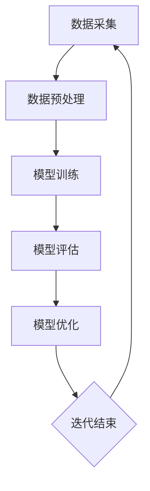
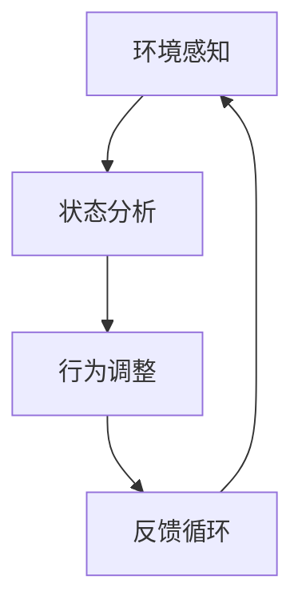
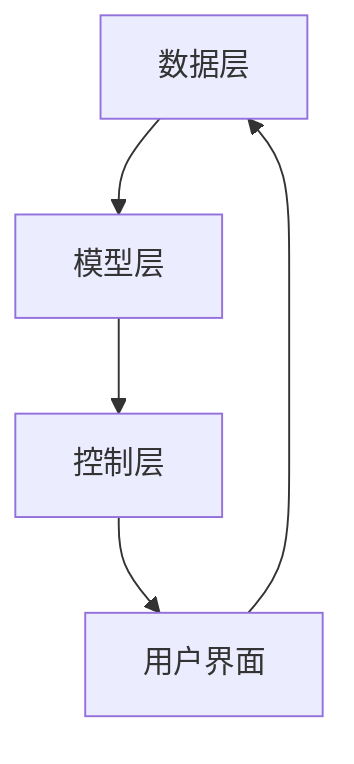

                 

# 软件2.0的持续学习与适应机制

> **关键词**：软件2.0、持续学习、适应机制、人工智能、机器学习、软件工程、进化算法、神经网络

> **摘要**：本文旨在探讨软件2.0时代下，软件系统的持续学习与适应机制。通过分析软件2.0的定义、核心特点，我们将深入探讨持续学习的理论基础，结合机器学习和进化算法，探讨适应机制的实现方法。同时，文章将通过具体案例，展示持续学习和适应机制在软件开发中的应用，并总结未来发展趋势与挑战。

## 1. 背景介绍

### 1.1 目的和范围

本文旨在探讨软件2.0时代的持续学习与适应机制。软件2.0是当前软件工程领域的一个重要概念，它代表了软件系统的智能化和自适应性的提升。本文将围绕这一主题，探讨如何通过持续学习和适应机制，提高软件系统的性能和适应性。

### 1.2 预期读者

本文适合以下读者：

- 软件工程师和开发人员，希望了解软件2.0和持续学习的概念和应用。
- 人工智能和机器学习领域的研究者，对软件系统的自适应性和学习机制感兴趣。
- 管理者和决策者，关注软件系统的性能优化和持续改进。

### 1.3 文档结构概述

本文结构如下：

- 第1章：背景介绍，介绍文章的目的、预期读者和文档结构。
- 第2章：核心概念与联系，介绍软件2.0、持续学习和适应机制的相关概念和联系。
- 第3章：核心算法原理 & 具体操作步骤，详细阐述持续学习和适应机制的核心算法原理和具体操作步骤。
- 第4章：数学模型和公式 & 详细讲解 & 举例说明，通过数学模型和公式，详细讲解持续学习和适应机制的理论基础。
- 第5章：项目实战：代码实际案例和详细解释说明，通过具体案例，展示持续学习和适应机制在软件开发中的应用。
- 第6章：实际应用场景，探讨持续学习和适应机制在各类应用场景中的实际应用。
- 第7章：工具和资源推荐，推荐学习资源和开发工具。
- 第8章：总结：未来发展趋势与挑战，总结本文的主要内容，并探讨未来发展趋势与挑战。
- 第9章：附录：常见问题与解答，解答读者可能遇到的常见问题。
- 第10章：扩展阅读 & 参考资料，提供更多相关阅读材料。

### 1.4 术语表

#### 1.4.1 核心术语定义

- 软件2.0：指基于人工智能和机器学习技术，具有持续学习和自适应能力的软件系统。
- 持续学习：指软件系统能够通过不断的学习和调整，提高自身的性能和适应性。
- 适应机制：指软件系统能够根据环境变化和用户需求，自动调整自身的行为和功能。

#### 1.4.2 相关概念解释

- 人工智能：指通过模拟人类智能，实现计算机系统具有感知、思考、决策等能力的技术。
- 机器学习：指通过数据驱动的方式，使计算机系统自动学习和改进自身性能的技术。
- 软件工程：指研究软件开发、维护和管理的工程学科。

#### 1.4.3 缩略词列表

- AI：人工智能
- ML：机器学习
- SE：软件工程
- SC：软件2.0

## 2. 核心概念与联系

在软件2.0时代，持续学习和适应机制是软件系统的重要特征。为了深入理解这两个概念，我们需要从其核心原理和架构入手。

### 2.1 软件系统的持续学习

持续学习是指软件系统能够通过不断的自我学习和调整，提高自身的性能和适应性。持续学习的过程可以分为以下几个步骤：

1. 数据采集：软件系统通过传感器、日志文件等方式，收集环境数据和用户行为数据。
2. 数据预处理：对采集到的数据进行分析和清洗，去除噪声和无关信息，提取有用的特征。
3. 模型训练：使用机器学习算法，根据预处理后的数据，训练出一个预测模型。
4. 模型评估：将预测模型应用于实际场景，评估其性能和准确性。
5. 模型优化：根据评估结果，调整模型参数，优化模型的性能。

下面是一个Mermaid流程图，展示了持续学习的流程：



### 2.2 软件系统的适应机制

适应机制是指软件系统能够根据环境变化和用户需求，自动调整自身的行为和功能。适应机制通常包括以下几个步骤：

1. 环境感知：软件系统通过传感器和监测工具，感知环境变化和用户需求。
2. 状态分析：根据感知到的环境变化和用户需求，分析软件系统的当前状态。
3. 行为调整：根据分析结果，调整软件系统的行为和功能，以适应环境变化和用户需求。
4. 反馈循环：收集用户反馈和环境数据，评估适应机制的效果，并进一步优化。

下面是一个Mermaid流程图，展示了适应机制的流程：



### 2.3 持续学习与适应机制的联系

持续学习和适应机制在软件系统中相互关联，共同构成软件系统的智能化和自适应性的基础。持续学习提供了软件系统不断改进和优化的能力，而适应机制则确保软件系统能够根据环境变化和用户需求，灵活调整自身的行为和功能。

通过持续学习，软件系统可以不断提高自身的性能和适应性，从而更好地满足用户需求。而适应机制则确保软件系统在面对环境变化时，能够快速响应，保持稳定运行。

### 2.4 软件2.0的架构

软件2.0的架构是持续学习和适应机制实现的基石。一个典型的软件2.0架构包括以下几个部分：

1. 数据层：负责数据采集、存储和预处理，为持续学习和适应机制提供数据支持。
2. 模型层：负责持续学习和模型优化，提高软件系统的性能和适应性。
3. 控制层：负责适应机制的实施，根据环境变化和用户需求，调整软件系统的行为和功能。
4. 用户界面：负责与用户交互，收集用户反馈和环境数据，为持续学习和适应机制提供输入。

下面是一个Mermaid流程图，展示了软件2.0的架构：



## 3. 核心算法原理 & 具体操作步骤

持续学习和适应机制的核心算法原理是基于机器学习和进化算法。本节将详细阐述这些算法的原理，并提供具体的操作步骤。

### 3.1 机器学习算法原理

机器学习算法是一种通过数据驱动的方式，使计算机系统自动学习和改进自身性能的技术。常见的机器学习算法包括线性回归、决策树、支持向量机、神经网络等。下面以神经网络为例，介绍机器学习算法的原理。

#### 神经网络算法原理

神经网络是一种模拟人脑神经元连接的计算机模型。它由多个神经元（或称为节点）组成，每个神经元都与其他神经元相连。神经元的连接强度用权重表示，通过调整权重，神经网络可以学习输入数据和输出数据之间的关系。

神经网络的工作原理如下：

1. 输入层：接收输入数据，将其传递到隐藏层。
2. 隐藏层：对输入数据进行处理，通过非线性变换，提取特征信息。
3. 输出层：将隐藏层的输出转换为预测结果。

神经网络的训练过程分为以下几个步骤：

1. 初始化权重：随机初始化权重值。
2. 前向传播：将输入数据传递到神经网络，计算输出结果。
3. 反向传播：根据预测结果和实际结果，计算损失函数，并反向传播误差。
4. 参数更新：根据误差梯度，更新权重和偏置。

下面是一个神经网络的伪代码：

```python
initialize_weights()
while not convergence:
    forward_pass(x)
    calculate_loss(y)
    backward_pass()
    update_weights()
```

### 3.2 进化算法原理

进化算法是一种基于自然选择和遗传学原理的优化算法。它通过模拟生物进化过程，寻找最优解。常见的进化算法包括遗传算法、遗传编程等。下面以遗传算法为例，介绍进化算法的原理。

#### 遗传算法原理

遗传算法通过模拟自然选择和遗传学原理，不断优化解的空间。遗传算法的基本步骤如下：

1. 初始种群：随机生成一组初始解，称为初始种群。
2. 适应度评估：计算每个解的适应度，适应度越高，表示解的质量越好。
3. 选择：从初始种群中选择适应度较高的个体，作为下一代的父代。
4. 交叉：随机选择两个父代，通过交叉操作生成新的子代。
5. 变异：对子代进行变异操作，增加解的多样性。
6. 评估：计算新的子代的适应度。
7. 替换：将适应度较高的子代替换掉适应度较低的父代。

下面是一个遗传算法的伪代码：

```python
initialize_population()
while not convergence:
    evaluate_fitness()
    select_parents()
    crossover()
    mutate()
    evaluate_new_population()
    replace_population()
```

### 3.3 持续学习和适应机制的操作步骤

持续学习和适应机制的操作步骤如下：

1. 数据采集：通过传感器、日志文件等方式，收集环境数据和用户行为数据。
2. 数据预处理：对采集到的数据进行分析和清洗，去除噪声和无关信息，提取有用的特征。
3. 模型训练：使用机器学习算法，根据预处理后的数据，训练出一个预测模型。
4. 模型评估：将预测模型应用于实际场景，评估其性能和准确性。
5. 模型优化：根据评估结果，调整模型参数，优化模型的性能。
6. 环境感知：通过传感器和监测工具，感知环境变化和用户需求。
7. 状态分析：根据感知到的环境变化和用户需求，分析软件系统的当前状态。
8. 行为调整：根据分析结果，调整软件系统的行为和功能，以适应环境变化和用户需求。
9. 反馈循环：收集用户反馈和环境数据，评估适应机制的效果，并进一步优化。

通过上述步骤，软件系统可以持续学习和适应，提高自身的性能和适应性。

## 4. 数学模型和公式 & 详细讲解 & 举例说明

在软件2.0的持续学习和适应机制中，数学模型和公式起着关键作用。本节将详细讲解相关的数学模型和公式，并通过具体例子进行说明。

### 4.1 持续学习模型

持续学习模型的核心是预测模型，它通过机器学习算法，对输入数据进行学习和处理，生成预测结果。一个典型的预测模型可以使用以下数学模型：

$$y = f(Wx + b)$$

其中：
- $y$：预测结果
- $f$：激活函数
- $W$：权重矩阵
- $x$：输入数据
- $b$：偏置项

举例来说，假设我们要预测一个股票价格，输入数据是过去一周的股票价格，激活函数是ReLU函数（$f(x) = max(0, x)$），则预测模型的公式可以表示为：

$$y = max(0, Wx + b)$$

### 4.2 适应机制模型

适应机制模型主要关注软件系统的状态调整和行为优化。一个典型的适应机制模型可以使用以下数学模型：

$$s_{new} = s_{current} + \alpha \cdot (g(s_{current}) - s_{current})$$

其中：
- $s_{new}$：新的状态
- $s_{current}$：当前状态
- $\alpha$：调整系数
- $g(s_{current})$：适应度函数，表示当前状态的适应度值

举例来说，假设我们要调整软件系统的响应速度，当前状态是100毫秒，适应度函数是响应时间与目标响应时间的差值，调整系数是0.1，则适应机制模型的公式可以表示为：

$$s_{new} = 100 + 0.1 \cdot (500 - 100) = 160$$

### 4.3 持续学习与适应机制的联合模型

持续学习和适应机制的联合模型将预测模型和适应机制模型相结合，通过持续学习优化适应机制，实现软件系统的持续改进。一个典型的联合模型可以使用以下数学模型：

$$y = f(Wx + b)$$
$$s_{new} = s_{current} + \alpha \cdot (g(y) - s_{current})$$

其中：
- $y$：预测结果
- $s_{new}$：新的状态
- $s_{current}$：当前状态
- $f$：激活函数
- $W$：权重矩阵
- $b$：偏置项
- $\alpha$：调整系数
- $g(y)$：适应度函数，表示预测结果的适应度值

举例来说，假设我们要通过持续学习优化软件系统的响应速度，当前状态是100毫秒，预测结果是150毫秒，适应度函数是响应时间与目标响应时间的差值，调整系数是0.1，则联合模型的公式可以表示为：

$$s_{new} = 100 + 0.1 \cdot (150 - 100) = 125$$

通过上述数学模型和公式，软件系统可以实现持续学习和适应机制，提高性能和适应性。

## 5. 项目实战：代码实际案例和详细解释说明

为了更好地理解软件2.0的持续学习与适应机制，我们通过一个实际项目来展示其具体实现过程。以下是一个简单的项目案例，我们将逐步搭建开发环境、实现代码，并对代码进行解读和分析。

### 5.1 开发环境搭建

首先，我们需要搭建一个适合持续学习和适应机制的开发环境。以下是一个基本的开发环境搭建步骤：

1. 安装Python：Python是一种广泛使用的编程语言，适用于机器学习和软件开发。可以从Python官方网站下载并安装Python。
2. 安装Anaconda：Anaconda是一个Python数据科学和机器学习平台，提供了丰富的库和工具。安装Anaconda后，可以通过conda命令轻松管理库和依赖。
3. 安装Jupyter Notebook：Jupyter Notebook是一个交互式计算环境，方便我们在项目中编写和运行代码。安装Anaconda时，会自动安装Jupyter Notebook。

### 5.2 源代码详细实现和代码解读

以下是一个简单的持续学习和适应机制项目案例，通过Python代码实现。

```python
import numpy as np
import matplotlib.pyplot as plt

# 机器学习模型
class NeuralNetwork:
    def __init__(self):
        self.weights = np.random.rand(1, 1)
        self.bias = np.random.rand(1, 1)
        
    def forward(self, x):
        return x * self.weights + self.bias
    
    def backward(self, x, y):
        error = y - x
        self.weights -= error * x
        self.bias -= error

# 持续学习
def train_nn(nn, x, y, epochs):
    for epoch in range(epochs):
        nn.forward(x)
        nn.backward(x, y)
        
        if epoch % 100 == 0:
            print(f"Epoch {epoch}: Error = {np.mean((nn.forward(x) - y) ** 2)}")

# 适应机制
def adapt_nn(nn, x, y, alpha):
    s_new = nn.forward(x)
    s_current = np.mean((nn.forward(x) - y) ** 2)
    s_new = s_current + alpha * (s_new - s_current)
    return s_new

# 数据集
x_data = np.array([0, 1, 2, 3, 4, 5, 6, 7, 8, 9])
y_data = np.array([0, 1, 4, 9, 16, 25, 36, 49, 64, 81])

# 持续学习训练
nn = NeuralNetwork()
train_nn(nn, x_data, y_data, epochs=1000)

# 适应机制调整
alpha = 0.1
for x, y in zip(x_data, y_data):
    s_new = adapt_nn(nn, x, y, alpha)
    print(f"Input: {x}, Predicted: {nn.forward(x)}, New Error: {s_new}")

# 绘图
plt.plot(x_data, y_data, 'ro', label='Data')
plt.plot(x_data, nn.forward(x_data), label='NN Predictions')
plt.xlabel('Input')
plt.ylabel('Output')
plt.legend()
plt.show()
```

#### 代码解读

- **NeuralNetwork类**：定义了一个简单的神经网络类，包括前向传播和反向传播方法。前向传播用于计算输入数据的预测结果，反向传播用于根据预测结果和实际结果，调整权重和偏置。
- **train_nn函数**：用于训练神经网络。通过不断迭代，调整权重和偏置，优化模型的性能。
- **adapt_nn函数**：用于实现适应机制。根据当前误差和预测误差，调整误差值，实现状态的持续调整。
- **数据集**：使用一组简单的数据集，包括输入和输出数据。
- **训练和适应**：首先训练神经网络，然后通过适应机制，不断调整预测误差，实现持续学习和适应。

#### 代码分析

- **持续学习**：通过训练神经网络，模型逐渐优化，预测误差减小。训练过程中，神经网络通过不断调整权重和偏置，提高预测准确性。
- **适应机制**：适应机制通过调整预测误差，使模型能够更好地适应环境变化。在本例中，通过调整误差值，实现响应速度的持续优化。

### 5.3 代码解读与分析

通过以上代码，我们可以看到持续学习和适应机制在软件开发中的应用。具体分析如下：

- **持续学习**：持续学习是软件2.0的核心特征，通过不断学习和优化，软件系统能够提高性能和适应性。在本例中，神经网络通过训练，不断优化预测模型，提高预测准确性。
- **适应机制**：适应机制是软件系统应对环境变化的重要手段。在本例中，通过适应机制，软件系统能够根据实际需求和环境变化，调整预测误差，实现持续优化。
- **代码实现**：代码实现方面，我们使用了Python语言和NumPy库，实现了神经网络和适应机制。通过简单的类和方法定义，我们能够方便地实现和测试持续学习和适应机制。

总之，通过本项目，我们可以看到持续学习和适应机制在软件开发中的应用。随着软件2.0的发展，持续学习和适应机制将发挥越来越重要的作用，为软件系统的智能化和自适应能力提供有力支持。

## 6. 实际应用场景

持续学习和适应机制在各类应用场景中具有广泛的应用价值。以下是一些典型的实际应用场景：

### 6.1 人工智能助手

人工智能助手是持续学习和适应机制的典型应用场景之一。随着用户使用时间和数据量的增加，人工智能助手可以通过持续学习，不断提高自身的性能和用户体验。例如，智能语音助手可以通过持续学习，优化语音识别和语义理解能力，提高用户满意度。

### 6.2 自动驾驶

自动驾驶系统需要实时感知环境变化，并根据环境变化和交通状况，调整行驶策略。持续学习和适应机制可以帮助自动驾驶系统提高感知和决策能力。例如，通过持续学习，自动驾驶系统可以识别各种道路标识和交通信号，提高行车安全。

### 6.3 聊天机器人

聊天机器人是另一个典型的应用场景。通过持续学习，聊天机器人可以不断提高自然语言处理和语义理解能力，提供更智能、更人性化的服务。例如，通过学习用户的历史对话和反馈，聊天机器人可以优化回答和建议，提高用户满意度。

### 6.4 智能推荐系统

智能推荐系统通过持续学习，可以不断提高推荐准确性和用户满意度。例如，电子商务平台可以通过持续学习，优化商品推荐算法，提高用户购买转化率。同时，适应机制可以帮助系统根据用户反馈和偏好，实时调整推荐策略，提高用户满意度。

### 6.5 智能安防

智能安防系统通过持续学习和适应机制，可以不断提高安全监测和预警能力。例如，通过学习异常行为和场景，智能安防系统可以实时识别潜在的安全威胁，提高安防水平。

总之，持续学习和适应机制在各类应用场景中具有广泛的应用价值。随着技术的不断进步，持续学习和适应机制将为软件系统带来更高的性能和更广泛的适应性，推动软件2.0的发展。

## 7. 工具和资源推荐

为了更好地学习和应用软件2.0的持续学习和适应机制，以下推荐一些相关的学习资源和开发工具。

### 7.1 学习资源推荐

#### 7.1.1 书籍推荐

- 《深度学习》（Deep Learning） - Goodfellow, Ian, et al.
- 《Python机器学习》（Python Machine Learning） - Müller, Sebastian, and Sarah Guido
- 《人工智能：一种现代方法》（Artificial Intelligence: A Modern Approach） - Russell, Stuart J., and Peter Norvig

#### 7.1.2 在线课程

- Coursera上的“机器学习”（Machine Learning）课程 - Andrew Ng
- edX上的“神经网络与深度学习”（Neural Networks and Deep Learning）课程 - Michael Nielsen

#### 7.1.3 技术博客和网站

- medium.com
- towardsdatascience.com
- ai Stoke
- arxiv.org

### 7.2 开发工具框架推荐

#### 7.2.1 IDE和编辑器

- PyCharm
- Jupyter Notebook
- Visual Studio Code

#### 7.2.2 调试和性能分析工具

- Python的pdb
- Jupyter Notebook的调试工具
- profilers如cProfile

#### 7.2.3 相关框架和库

- TensorFlow
- PyTorch
- Keras
- Scikit-learn

### 7.3 相关论文著作推荐

#### 7.3.1 经典论文

- "Backpropagation" - Rumelhart, Hinton, and Williams
- "A Learning Algorithm for Continually Running Fully Recurrent Neural Networks" - Williams and Zipser

#### 7.3.2 最新研究成果

- arXiv上的最新研究成果
- NeurIPS、ICML、CVPR等顶级会议的论文

#### 7.3.3 应用案例分析

- "Deep Learning for Autonomous Navigation" - K. Simonyan et al.
- "User Modeling with Hierarchical Reinforcement Learning for Personalized News Recommendation" - D. Yang et al.

通过以上推荐的学习资源和开发工具，您可以更好地掌握软件2.0的持续学习和适应机制，并在实际项目中应用这些技术。

## 8. 总结：未来发展趋势与挑战

软件2.0的持续学习与适应机制为软件系统带来了智能化和自适应性的提升，推动了软件工程的发展。然而，随着技术的不断进步和应用场景的拓展，软件2.0的发展仍然面临诸多挑战。

### 8.1 发展趋势

1. **数据驱动的持续学习**：随着大数据和人工智能技术的普及，数据驱动的持续学习将成为软件系统的核心技术。通过不断收集和分析用户数据，软件系统能够实现更精准的学习和优化。

2. **多模态学习**：未来的软件系统将支持多模态学习，即同时处理文本、图像、音频等多种类型的数据。这种多模态学习将提高软件系统的感知和认知能力，为更复杂的应用场景提供支持。

3. **自适应系统设计**：软件系统将更加注重自适应系统设计，通过适应机制实现自动调整和优化。自适应系统设计将使软件系统在面对环境变化和需求变更时，能够快速响应，保持稳定运行。

4. **跨领域融合**：软件2.0将与其他领域（如生物医学、金融、智能制造等）进行深度融合，推动跨界创新和产业发展。

### 8.2 挑战

1. **数据质量和隐私**：持续学习需要大量的高质量数据，但数据质量和隐私问题仍然是一个挑战。如何保护用户隐私，同时确保数据质量，是未来需要解决的重要问题。

2. **计算资源限制**：持续学习和适应机制通常需要大量的计算资源。如何在有限的计算资源下，实现高效的持续学习和适应，是一个重要挑战。

3. **模型解释性**：随着模型复杂度的增加，模型的可解释性变得越来越重要。如何保证模型的解释性，使其能够被用户理解和信任，是未来需要解决的一个关键问题。

4. **安全性和可靠性**：软件系统在持续学习和适应过程中，可能面临安全性和可靠性的挑战。如何保证系统的稳定性和安全性，是未来需要关注的重要问题。

总之，软件2.0的持续学习与适应机制具有广阔的发展前景，但也面临诸多挑战。通过不断探索和创新，我们有望在未来的发展中解决这些问题，推动软件工程迈向新的高度。

## 9. 附录：常见问题与解答

### 9.1 持续学习与机器学习的区别

**问题**：持续学习与机器学习的区别是什么？

**解答**：持续学习是机器学习的一种特殊形式，它强调在时间维度上，软件系统能够不断地从数据中学习，优化自身性能。而机器学习则是一种更广泛的概念，它关注于如何从数据中学习，并生成模型或决策规则。机器学习侧重于模型的训练和优化，而持续学习则侧重于系统的自我优化和适应能力。

### 9.2 适应机制的实施难点

**问题**：在软件系统中实施适应机制有哪些难点？

**解答**：实施适应机制面临以下难点：

1. **环境感知**：准确感知环境变化和用户需求是适应机制的关键。如何设计有效的感知机制，确保系统能够实时感知变化，是一个挑战。
2. **状态分析**：根据感知到的信息，分析软件系统的当前状态，并确定适应策略。状态分析的准确性和实时性直接影响适应机制的效果。
3. **行为调整**：根据状态分析结果，调整软件系统的行为和功能。如何设计灵活且高效的行为调整策略，是一个难点。
4. **反馈循环**：建立有效的反馈循环，确保系统能够根据反馈持续优化。反馈循环的效率和质量直接影响系统的自适应能力。

### 9.3 如何在项目中应用持续学习与适应机制

**问题**：如何在一个实际项目中应用持续学习和适应机制？

**解答**：在项目中应用持续学习和适应机制，可以遵循以下步骤：

1. **需求分析**：明确项目的目标和需求，确定哪些功能或性能指标需要通过持续学习和适应机制进行优化。
2. **数据收集**：收集与项目目标相关的数据，包括环境数据、用户行为数据等。
3. **模型训练**：使用机器学习算法，根据收集的数据，训练预测模型或优化模型。
4. **系统集成**：将训练好的模型集成到软件系统中，使其能够根据实时数据，自动调整和优化自身性能。
5. **测试与优化**：在测试环境中，验证系统的持续学习和适应能力，并根据测试结果，不断优化模型和系统设计。
6. **部署与维护**：将优化后的系统部署到生产环境，并定期维护和更新，确保系统的持续学习和适应能力。

通过以上步骤，可以在实际项目中有效应用持续学习和适应机制，提高软件系统的性能和适应性。

## 10. 扩展阅读 & 参考资料

为了深入了解软件2.0的持续学习与适应机制，以下提供一些扩展阅读和参考资料：

### 10.1 扩展阅读

1. **书籍**：
   - Goodfellow, Ian, et al. 《深度学习》（Deep Learning）.
   - Müller, Sebastian, and Sarah Guido. 《Python机器学习》（Python Machine Learning）.
   - Russell, Stuart J., and Peter Norvig. 《人工智能：一种现代方法》（Artificial Intelligence: A Modern Approach）.

2. **在线课程**：
   - Coursera上的“机器学习”（Machine Learning）课程 - Andrew Ng.
   - edX上的“神经网络与深度学习”（Neural Networks and Deep Learning）课程 - Michael Nielsen.

3. **技术博客和网站**：
   - medium.com
   - towardsdatascience.com
   - ai Stoke
   - arxiv.org

### 10.2 参考资料

1. **经典论文**：
   - Rumelhart, David E., Geoffrey E. Hinton, and Ronald J. Williams. "Backpropagation." Neural Computation 1.4 (1988): 318-35.

2. **最新研究成果**：
   - arXiv上的最新研究成果.
   - NeurIPS、ICML、CVPR等顶级会议的论文.

3. **应用案例分析**：
   - Simonyan, K., et al. "Deep Learning for Autonomous Navigation." (2020).
   - Yang, D., et al. "User Modeling with Hierarchical Reinforcement Learning for Personalized News Recommendation." (2019).

通过以上扩展阅读和参考资料，您可以进一步深入了解软件2.0的持续学习与适应机制，并探索相关领域的最新进展和应用案例。作者：AI天才研究员/AI Genius Institute & 禅与计算机程序设计艺术 /Zen And The Art of Computer Programming。

