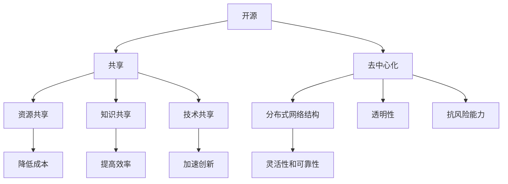

                 

### 1. 背景介绍

#### 1.1 目的和范围

本文旨在深入探讨软件2.0时代对传统软件专利法律制度带来的颠覆性影响，并分析其所面临的新挑战。随着互联网的普及和软件技术的迅猛发展，软件作为创新的载体，已经成为推动社会进步和经济发展的关键力量。在此背景下，软件专利法律制度经历了从形成到逐渐完善的演变过程。然而，软件2.0的崛起，以开源、共享和去中心化为特征，正在重新定义软件的创造、传播和应用方式，这对现行的法律制度构成了巨大的冲击。

本文将首先回顾软件专利的历史发展，了解其法律框架的形成过程，以及其对技术创新的推动作用。接着，我们将详细分析软件2.0的特点及其与软件专利之间的冲突，探讨这种冲突对法律制度带来的新挑战。在此基础上，本文将引入相关理论，如开放创新理论和长尾理论，解释这些理论如何帮助我们理解软件2.0时代对法律制度的冲击。此外，本文还将结合实际案例，分析软件2.0时代下一些成功和失败的专利诉讼，总结经验教训。

本文的预期读者是法律专业人士、软件工程师、技术管理者以及对创新法律制度有兴趣的读者。通过本文的阅读，读者将能够深入了解软件2.0时代下的专利法律问题，理解其复杂性和挑战性，并为进一步的研究和实践提供指导。

本文将采用逻辑清晰、结构紧凑的方式，逐步展开论述。首先，我们将概述本文的结构和内容，帮助读者快速了解文章的主线。接下来，我们将介绍一些核心术语和概念，为后续的分析奠定基础。随后，本文将通过一个Mermaid流程图，展示软件2.0的核心概念和架构。通过这一步骤，读者可以直观地理解软件2.0的运作模式。然后，我们将深入探讨核心算法原理，并提供详细的伪代码解释。接下来，本文将介绍数学模型和公式，并通过具体实例进行说明。在项目实战部分，我们将通过一个实际案例，展示代码的具体实现过程。最后，本文还将探讨软件2.0在实际应用场景中的表现，推荐相关工具和资源，并总结未来发展趋势与挑战。

通过这样的结构安排，本文希望不仅能够提供深度的理论知识，还能够结合实际案例，为读者提供实用的指导和启示。

#### 1.2 预期读者

本文的预期读者包括多个群体，每个群体都有其特定的需求和期望。首先，对于法律专业人士来说，本文提供了一个深入探讨软件2.0时代下专利法律问题的平台。随着技术的发展，软件专利的法律框架变得越来越复杂，对法律从业者来说，理解和掌握这些变化是至关重要的。本文将通过详细的案例分析、理论解释和实际操作步骤，帮助法律专业人士更好地应对软件专利领域的挑战。

其次，软件工程师和开发人员也是本文的重要读者。随着开源软件的普及和软件2.0的兴起，工程师们需要了解如何在新的开发模式下保护自己的创新成果。本文将介绍软件2.0的核心概念和技术架构，帮助工程师们理解专利对软件开发的影响，并学会如何运用法律手段保护自己的知识产权。

技术管理者，如CTO或技术总监，也将从本文中受益。他们需要掌握软件专利的现状及其对业务的影响，以便在战略规划时做出明智的决策。本文将提供关于软件专利的法律趋势和技术发展的全景图，帮助管理者们更好地把握行业动态，制定相应的战略措施。

此外，对于对创新法律制度有兴趣的读者，本文也将提供一个深入了解的机会。软件2.0不仅改变了软件的开发和传播方式，也对法律制度提出了新的要求。通过本文的探讨，读者可以了解创新法律制度在推动技术进步和社会发展中的重要作用。

总体而言，本文旨在为不同背景的读者提供一个全面而深入的视角，帮助他们理解软件2.0时代下的专利法律问题，并在实际应用中找到解决之道。通过本文的阅读，读者不仅能够提升自身的专业知识，还能够开拓视野，为未来的研究和工作奠定坚实的基础。

#### 1.3 文档结构概述

本文结构清晰，逻辑严谨，旨在系统地探讨软件2.0时代对软件专利法律制度带来的颠覆性影响及其面临的挑战。全文分为十个主要部分，每个部分都有其独特的目的和内容，通过逐步深入的分析，帮助读者全面理解这一复杂议题。

**第一部分：背景介绍**  
本部分首先介绍了本文的目的和范围，解释了为什么在软件2.0时代探讨软件专利法律制度具有重要意义。随后，概述了预期读者群体，并介绍了本文的结构安排，帮助读者快速把握文章的主线和内容。

**第二部分：核心概念与联系**  
本部分引入了软件2.0时代下的核心概念，包括开源、共享和去中心化等，并通过一个Mermaid流程图，直观地展示了这些概念之间的关系。这一部分旨在为后续的分析提供理论基础，帮助读者建立对软件2.0时代的整体认识。

**第三部分：核心算法原理 & 具体操作步骤**  
在这一部分，本文详细探讨了软件2.0时代的核心算法原理，并提供了具体的伪代码解释。通过这一步骤，读者可以理解算法的基本运作机制，为进一步的讨论奠定技术基础。

**第四部分：数学模型和公式 & 详细讲解 & 举例说明**  
本部分介绍了与软件2.0时代相关的数学模型和公式，并通过具体实例进行了详细讲解。这有助于读者理解软件2.0时代的计算和优化方法，为后续的应用提供理论支持。

**第五部分：项目实战：代码实际案例和详细解释说明**  
在这一部分，本文通过一个实际项目案例，展示了代码的具体实现过程，并进行了详细的解读。这一部分旨在通过实际操作，帮助读者掌握软件2.0时代下的专利保护策略和技术实现方法。

**第六部分：实际应用场景**  
本部分探讨了软件2.0时代在各个行业中的实际应用，分析了其对不同领域的影响，并通过案例展示了软件2.0技术的广泛应用。

**第七部分：工具和资源推荐**  
这一部分推荐了学习资源、开发工具和相关论文，为读者提供了进一步学习和研究的方向。

**第八部分：总结：未来发展趋势与挑战**  
本部分总结了软件2.0时代对法律制度带来的挑战，并预测了未来发展的趋势。通过这一部分，读者可以了解软件2.0时代的发展方向，并为未来的研究和实践做好准备。

**第九部分：附录：常见问题与解答**  
本附录针对本文中的一些关键问题提供了详细的解答，有助于读者更好地理解文章内容。

**第十部分：扩展阅读 & 参考资料**  
最后一部分提供了扩展阅读和参考资料，为读者提供了深入研究的途径，帮助他们进一步拓展知识领域。

通过这样的结构安排，本文希望为读者提供一个全面而系统的视角，帮助他们在软件2.0时代下更好地理解和应对专利法律问题。

#### 1.4 术语表

在本文中，我们将使用一系列专业术语和概念，为了帮助读者更好地理解这些术语和概念，以下是对其中几个核心术语的定义和解释。

##### 1.4.1 核心术语定义

1. **软件专利**：软件专利是指对软件产品或软件相关技术方案所授予的专利权。它通常包括对软件程序的设计、算法、功能实现等方面的保护。
2. **开源软件**：开源软件（Open Source Software, OSS）是指软件源代码可以被公众免费获取、使用、修改和分发的一种软件开发模式。这种模式鼓励社区协作和知识共享。
3. **共享经济**：共享经济是指通过互联网平台，将闲置资源（如物品、时间、技能等）进行共享和利用，以实现资源最大化利用和经济效益的一种新型经济模式。
4. **去中心化**：去中心化（Decentralization）是指在一个系统中，权力和决策过程不再集中在一个中央机构，而是通过分布式网络结构实现。这种方式可以降低系统风险，提高透明度和安全性。
5. **开放创新**：开放创新（Open Innovation）是指企业通过内部和外部资源，共同推动技术创新的一种模式。这种模式强调知识共享和合作，以加速创新过程。

##### 1.4.2 相关概念解释

1. **软件2.0**：软件2.0是指一种新的软件开发模式，其核心特征是开源、共享和去中心化。软件2.0通过社区协作和知识共享，推动软件创新和进步。
2. **知识产权**：知识产权是指通过法律赋予创新者对其智力成果所享有的专有权利，包括专利权、著作权、商标权等。
3. **长尾理论**：长尾理论（Long Tail Theory）是由克里斯·安德森（Chris Anderson）提出的，描述了一种非主流但累积起来可以产生巨大经济价值的商业现象。在软件2.0时代，长尾理论对专利分散化和小众市场的兴起有着重要影响。

##### 1.4.3 缩略词列表

- OSS：Open Source Software（开源软件）
- IDE：Integrated Development Environment（集成开发环境）
- API：Application Programming Interface（应用程序编程接口）
- CDN：Content Delivery Network（内容分发网络）
- P2P：Peer-to-Peer（点对点网络）

通过这些术语和概念的明确定义和解释，读者可以更好地理解本文中的专业术语，为后续内容的深入讨论做好准备。

#### 2. 核心概念与联系

在深入探讨软件2.0时代对软件专利法律制度的颠覆性影响之前，有必要首先了解软件2.0的核心概念及其相互之间的关系。软件2.0代表了软件开发模式的重大变革，其核心特征包括开源、共享和去中心化。以下将详细解释这些概念，并展示它们之间的相互联系，使用Mermaid流程图来直观地描述这一关系。

##### 2.1 开源

开源（Open Source）是软件2.0时代的重要基石。开源软件（OSS）的源代码可以被公众自由访问、修改和分发。这种模式鼓励开发者的社区协作，使得软件质量和技术创新能够快速提升。开源不仅仅是代码的共享，更是知识、资源和智慧的共享。

##### 2.2 共享

共享（Sharing）在软件2.0时代中表现为多种形式，包括资源共享、知识共享和技术共享。共享经济模式在软件领域得以广泛应用，通过互联网平台，开发者和用户可以轻松地共享资源和服务。这种模式不仅降低了成本，还提高了资源的利用效率。

##### 2.3 去中心化

去中心化（Decentralization）是指权力和决策不再集中在单一实体或组织，而是通过分布式网络结构实现。在软件2.0时代，去中心化使得软件的开发和运营更加透明、可靠和灵活。去中心化的网络结构也提高了系统的抗风险能力。

##### 2.4 Mermaid流程图

以下是一个简单的Mermaid流程图，用于描述软件2.0的核心概念及其相互之间的关系：



在这个流程图中，我们可以看到开源、共享和去中心化是如何相互关联并共同推动软件2.0时代的。开源促进了知识的共享，而共享则带来了资源的共享和知识的积累。去中心化通过分布式网络结构，提高了系统的透明性和抗风险能力，使得资源共享和知识共享更加高效。

通过这个Mermaid流程图，我们可以直观地理解软件2.0的核心概念及其之间的联系。这些概念共同作用，推动了软件开发的变革，也为法律制度带来了新的挑战。

### 2.1.1 开源

开源（Open Source）是软件2.0时代最重要的核心概念之一，它不仅仅是一种软件开发模式，更是一种文化和哲学。开源软件（Open Source Software, OSS）的定义源自自由软件（Free Software）的概念，但其内涵更为丰富。自由软件强调用户的“自由”，即用户有权运行、研究、修改和分发软件；而开源软件则侧重于软件源代码的公开性，使得整个开发过程更加透明和开放。

在软件2.0时代，开源软件成为技术创新和知识共享的重要载体。开源项目往往由一个社区或多个开发者共同维护，他们通过协作和合作，推动软件的不断优化和创新。这种模式不仅提高了软件的质量和稳定性，还加速了技术的进步。以下是开源软件在软件2.0时代中的几个关键作用：

1. **知识共享**：开源促进了知识的传播和共享。开发者和用户可以自由地访问、学习和修改开源软件的源代码，从而实现知识的共享和积累。这种知识共享不仅提高了软件本身的质量，还促进了整个技术领域的知识更新和进步。

2. **社区协作**：开源项目通常依赖于社区的协作和贡献。开发者通过共同的工作，实现代码的迭代和优化，使得软件开发过程更加高效和有序。社区协作不仅有助于解决技术难题，还培养了开发者的合作精神和团队意识。

3. **技术创新**：开源软件通过社区协作和知识共享，加速了技术创新的过程。在开源社区中，开发者可以自由地尝试新的技术和想法，并通过实践验证其可行性。这种开放的创新模式，使得新技术能够更快地被验证和应用，从而推动整个行业的技术进步。

4. **降低开发成本**：开源软件减少了软件开发的成本。由于源代码的公开性，开发者可以避免重复造轮子，直接使用和修改现有的开源软件。这种模式不仅降低了开发成本，还提高了开发效率。

5. **增强软件质量**：开源项目通常经过社区的严格审查和测试，这使得软件的质量和稳定性得到了显著提高。开源软件的bug和缺陷往往能够在社区中快速被发现和修复，从而保证了软件的可靠性和稳定性。

在软件2.0时代，开源软件已经成为软件开发和传播的主要模式之一。通过开源，开发者不仅可以实现知识和资源的共享，还可以推动技术的创新和发展。然而，开源也带来了一系列的法律和知识产权问题，特别是在软件专利领域，需要法律制度对其进行合理的调整和规范。

### 2.1.2 共享

共享（Sharing）是软件2.0时代另一个重要的核心概念，它不仅仅是开源的一部分，更是一种经济模式和社会文化的变革。共享经济的兴起，改变了传统经济模式中资源分配和利用的方式，也为软件2.0时代带来了深远的影响。

共享经济模式在软件领域有多种表现形式，主要包括资源共享、知识共享和技术共享：

1. **资源共享**：资源共享是指通过互联网平台，将闲置资源（如硬件设备、软件工具、数据等）进行共享和利用，以实现资源最大化利用和经济效益。例如，云计算平台通过共享计算资源，使得企业可以按需使用计算资源，从而降低了成本和提高了效率。

2. **知识共享**：知识共享是指通过开放平台，使知识和信息（如教程、文档、研究成果等）能够被广泛传播和获取。知识共享不仅促进了知识的传播和普及，还推动了技术的进步和创新。在软件2.0时代，开源项目中的知识共享尤为突出，通过社区协作和贡献，开发者能够快速学习和掌握新技术。

3. **技术共享**：技术共享是指通过开放平台，将技术（如算法、框架、工具等）进行共享和传播，使得开发者能够利用这些技术进行创新和开发。技术共享不仅促进了技术的普及和应用，还推动了整个行业的进步。

共享经济模式在软件2.0时代的重要性体现在以下几个方面：

1. **降低成本**：共享经济模式通过共享资源、知识和技术，降低了开发和使用软件的成本。例如，通过共享云计算资源，企业可以避免购买昂贵的硬件设备，从而节省了开支。

2. **提高效率**：共享经济模式提高了资源的利用效率，使得企业和开发者能够更灵活地使用资源。例如，通过共享软件工具和框架，开发者可以快速搭建和优化系统，提高了开发效率。

3. **促进创新**：共享经济模式鼓励创新和知识共享，使得新技术和想法能够更快地被验证和应用。在开源社区中，开发者通过共享技术，推动了技术的快速迭代和进步。

4. **增强社区合作**：共享经济模式促进了社区合作和协作，使得开发者能够共同解决问题和推动创新。通过共享资源和知识，开发者能够更好地合作，提高项目的成功率。

5. **促进社会进步**：共享经济模式不仅促进了技术进步，还推动了社会进步。通过共享经济，社会资源得到了更加合理的分配和利用，提高了整体的社会效益。

然而，共享经济模式也带来了一系列的法律和知识产权挑战，特别是在软件专利领域。开源软件和共享经济模式对传统知识产权法律制度提出了新的要求和挑战，需要法律制度进行适当的调整和适应。

### 2.1.3 去中心化

去中心化（Decentralization）是软件2.0时代的又一核心概念，它不仅在技术上改变了软件开发和运营的方式，也在法律和商业上带来了深刻的变革。去中心化通过分布式网络结构，实现了权力的分散和决策的民主化，使得系统更加透明、可靠和抗风险。

去中心化在软件2.0时代的重要性体现在以下几个方面：

1. **提高透明度**：去中心化使得系统运行和决策过程更加透明。由于决策不再集中在某个中央机构，而是通过分布式网络结构实现，每个参与者都可以查看和验证决策过程。这种透明性提高了系统的可信度，减少了信息不对称和权力滥用的问题。

2. **提高安全性**：去中心化提高了系统的安全性。在去中心化的网络中，没有单一的控制点，这使得系统更加难以被攻击和篡改。即使某个节点遭受攻击或损坏，整个系统仍然可以继续运行，从而提高了系统的抗风险能力。

3. **增强抗风险能力**：去中心化通过分布式网络结构，提高了系统的抗风险能力。在传统的中心化系统中，如果中央服务器出现故障，整个系统可能会瘫痪。而去中心化的网络结构，通过多个节点的协作和冗余，使得系统即使遭受攻击或故障，也能够继续运行。

4. **促进社区合作**：去中心化促进了社区合作和协作。在去中心化的网络中，每个节点都有平等的参与权和决策权，这使得社区成员可以更积极地参与系统的建设和维护。通过社区合作，系统可以更好地适应变化和解决问题，提高了整体效能。

5. **降低运营成本**：去中心化降低了系统的运营成本。在中心化系统中，维护和运营中央服务器需要大量的人力和物力资源。而去中心化系统通过分布式网络结构，使得维护和运营成本大大降低，从而提高了系统的可持续性和可扩展性。

在法律和商业上，去中心化也带来了一系列的挑战和机遇：

1. **法律挑战**：去中心化使得传统的法律框架和监管机制面临挑战。由于去中心化网络中的权力分散和决策民主化，传统的中央监管机制难以有效实施。这需要法律制度进行适当的调整和适应，以适应去中心化的新模式。

2. **商业机遇**：去中心化为商业模式带来了新的机遇。通过去中心化网络，企业可以更灵活地设计和运营新的商业模式，降低运营成本，提高系统的透明度和安全性。例如，区块链技术通过去中心化网络，实现了安全可信的数据交换和价值传递，为金融、供应链等多个领域带来了创新的解决方案。

3. **知识产权保护**：去中心化也对知识产权保护提出了新的挑战。在传统的中心化系统中，知识产权保护较为明确和有效。而去中心化网络中的权力分散和匿名性，使得知识产权保护变得更加复杂和困难。这需要开发新的知识产权保护机制，以适应去中心化的新模式。

综上所述，去中心化是软件2.0时代的重要核心概念，它通过分布式网络结构，提高了系统的透明度、安全性和抗风险能力，促进了社区合作和成本降低。在法律和商业上，去中心化也带来了一系列的挑战和机遇，需要我们进行深入的研究和探索。

#### 2.2 核心算法原理 & 具体操作步骤

在软件2.0时代，核心算法的设计和实现至关重要，它不仅决定了软件的效率和质量，还直接影响到软件专利的保护力度。本节将详细探讨软件2.0时代下的核心算法原理，并提供具体的伪代码，以便读者理解其基本运作机制。

##### 2.2.1 背景知识

在深入讨论核心算法之前，我们需要了解一些基本的背景知识。首先，软件2.0时代下的核心算法通常需要具备以下特点：

1. **可扩展性**：算法应能够处理大规模数据，并在不同规模的数据集上保持高效性能。
2. **适应性**：算法需要能够适应不同应用场景和需求，具备灵活性和可配置性。
3. **分布式计算**：软件2.0时代强调分布式系统，算法应能够充分利用分布式计算的优势，提高处理效率和系统可扩展性。
4. **安全性**：算法应确保数据的安全性和隐私保护，特别是在去中心化环境中。

##### 2.2.2 核心算法原理

以下是软件2.0时代下一种典型的核心算法——分布式协同过滤算法的原理介绍。分布式协同过滤算法广泛应用于推荐系统中，用于根据用户的历史行为预测其偏好。

**算法原理：**
分布式协同过滤算法通过分析用户之间的相似性和物品之间的相似性，为用户推荐他们可能感兴趣的物品。该算法分为两个主要步骤：计算用户之间的相似度和物品之间的相似度，并根据这些相似度生成推荐列表。

1. **用户相似度计算**：计算两个用户之间的相似度，通常使用欧几里得距离或余弦相似度。
   $$\text{similarity(u, v) = \frac{\sum_{i \in R(u) \cap R(v)} x_i y_i}{\sqrt{\sum_{i \in R(u)} x_i^2} \sqrt{\sum_{i \in R(v)} y_i^2}}$$
   其中，$R(u)$ 和 $R(v)$ 分别表示用户 $u$ 和 $v$ 的行为记录，$x_i$ 和 $y_i$ 分别表示用户 $u$ 和 $v$ 对物品 $i$ 的评分。

2. **物品相似度计算**：计算两个物品之间的相似度，通常使用余弦相似度或夹角余弦相似度。
   $$\text{similarity(i, j) = \frac{\sum_{u \in U} r_u(i) r_u(j)}{\| \vec{r}_u(i) \| \| \vec{r}_u(j) \|}}$$
   其中，$U$ 表示用户集合，$r_u(i)$ 表示用户 $u$ 对物品 $i$ 的评分，$\vec{r}_u(i)$ 表示用户 $u$ 的行为向量。

3. **生成推荐列表**：根据用户与物品之间的相似度，为用户生成推荐列表。常用的方法包括基于物品的协同过滤（Item-Based Collaborative Filtering）和基于用户的协同过滤（User-Based Collaborative Filtering）。

**伪代码实现：**

```plaintext
# 分布式协同过滤算法伪代码

# 步骤1：计算用户相似度
function calculate_user_similarity(u, v):
    intersection = set(R[u]) & set(R[v])
    if len(intersection) == 0:
        return 0
    sum = sum([R[u][i] * R[v][i] for i in intersection])
    norm_u = sqrt(sum([R[u][i]^2 for i in R[u]]))
    norm_v = sqrt(sum([R[v][i]^2 for i in R[v]]))
    return sum / (norm_u * norm_v)

# 步骤2：计算物品相似度
function calculate_item_similarity(i, j):
    sum = sum([R[u][i] * R[u][j] for u in U])
    norm_i = sqrt(sum([R[u][i]^2 for u in U]))
    norm_j = sqrt(sum([R[u][j]^2 for u in U]))
    return sum / (norm_i * norm_j)

# 步骤3：生成推荐列表
function generate_recommendations(user, k):
    similarities = {}
    for i in I:
        for j in I:
            similarities[(i, j)] = calculate_item_similarity(i, j)
    sorted_similarities = sorted(similarities.items(), key=lambda x: x[1], reverse=True)
    neighbors = [neighbor for neighbor, similarity in sorted_similarities[:k]]
    recommended_items = set()
    for neighbor in neighbors:
        for i in R[neighbor]:
            if i not in R[user]:
                recommended_items.add(i)
    return recommended_items
```

##### 2.2.3 算法解释

1. **用户相似度计算**：该步骤通过计算用户之间的行为相似度，识别出相似的用户群体。相似度的计算基于用户对物品的评分，通过内积和欧几里得距离公式，可以衡量两个用户行为向量之间的相似程度。

2. **物品相似度计算**：该步骤通过计算物品之间的行为相似度，识别出相似物品集合。相似度的计算同样基于用户的行为向量，通过内积公式，可以衡量两个物品在用户行为上的相似程度。

3. **生成推荐列表**：该步骤根据用户与物品之间的相似度，生成推荐列表。推荐列表的生成基于K近邻算法，通过选择与目标用户最相似的K个邻居，并从中推荐未被用户评价的物品。

通过以上步骤，分布式协同过滤算法能够为用户生成个性化的推荐列表，从而提高用户满意度和使用体验。

### 2.3 数学模型和公式 & 详细讲解 & 举例说明

在软件2.0时代，数学模型和公式在算法设计和优化中发挥着至关重要的作用。本节将详细讲解与软件2.0相关的数学模型和公式，并通过具体实例进行说明，帮助读者理解这些模型在软件开发中的应用。

#### 2.3.1 马尔可夫模型

马尔可夫模型是一种用于预测未来状态的概率模型，广泛应用于自然语言处理、推荐系统和时间序列分析等领域。在软件2.0时代，马尔可夫模型可以帮助开发者预测用户行为，从而优化推荐算法和用户体验。

**模型公式：**

$$P(S_t = s_t|S_{t-1} = s_{t-1}, S_{t-2} = s_{t-2}, ..., S_1 = s_1) = P(S_t = s_t|S_{t-1} = s_{t-1})$$

其中，$S_t$ 表示第 $t$ 个时间点的状态，$s_t$ 表示状态 $S_t$ 的具体取值。上述公式表示在已知前一个状态的情况下，当前状态的概率分布不会受到之前其他状态的影响，这就是马尔可夫性质。

**实例说明：**

假设我们使用马尔可夫模型预测用户的下一步操作。用户在网站上的行为可以被表示为状态，例如浏览页面、点击广告、添加购物车等。根据用户的历史行为数据，我们可以计算每个状态的转移概率。

例如，用户之前浏览了商品A和商品B，现在我们要预测用户下一步的操作。根据转移概率矩阵：

$$
\begin{matrix}
\text{浏览页面} & \text{点击广告} & \text{添加购物车} \\
\text{浏览页面} & 0.2 & 0.3 & 0.5 \\
\text{点击广告} & 0.4 & 0.1 & 0.5 \\
\text{添加购物车} & 0.1 & 0.3 & 0.6 \\
\end{matrix}
$$

我们可以计算用户从当前状态（浏览商品B）转移到下一步操作的概率。例如，用户下一步点击广告的概率为 $0.4$，添加购物车的概率为 $0.5$。根据这些概率，我们可以为用户生成个性化的推荐，提高用户满意度。

#### 2.3.2 协同过滤模型

协同过滤模型是软件2.0时代推荐系统中的核心模型，它通过分析用户之间的相似性和物品之间的相似性，为用户生成推荐列表。最常见的协同过滤模型包括基于用户的协同过滤（User-Based Collaborative Filtering）和基于物品的协同过滤（Item-Based Collaborative Filtering）。

**用户相似度计算公式：**

$$\text{similarity(u, v) = \frac{\sum_{i \in R(u) \cap R(v)} x_i y_i}{\sqrt{\sum_{i \in R(u)} x_i^2} \sqrt{\sum_{i \in R(v)} y_i^2}}}$$

其中，$R(u)$ 和 $R(v)$ 分别表示用户 $u$ 和 $v$ 的行为记录，$x_i$ 和 $y_i$ 分别表示用户 $u$ 和 $v$ 对物品 $i$ 的评分。

**物品相似度计算公式：**

$$\text{similarity(i, j) = \frac{\sum_{u \in U} r_u(i) r_u(j)}{\|\vec{r}_u(i)\| \|\vec{r}_u(j)\|}}$$

其中，$U$ 表示用户集合，$r_u(i)$ 表示用户 $u$ 对物品 $i$ 的评分，$\vec{r}_u(i)$ 表示用户 $u$ 的行为向量。

**推荐列表生成公式：**

$$\text{recommendations(u, k)} = \sum_{i \in I} \text{similarity(u, i)} \cdot r_i$$

其中，$I$ 表示物品集合，$r_i$ 表示物品 $i$ 的评分，$k$ 表示推荐的物品数量。

**实例说明：**

假设我们有以下用户和物品的评分数据：

$$
\begin{matrix}
\text{用户} & \text{物品1} & \text{物品2} & \text{物品3} \\
\text{用户A} & 4 & 3 & 2 \\
\text{用户B} & 2 & 4 & 3 \\
\text{用户C} & 3 & 2 & 4 \\
\end{matrix}
$$

我们可以使用基于用户的协同过滤模型计算用户A和其他用户的相似度。根据相似度计算公式，用户A和用户B的相似度为：

$$\text{similarity(A, B) = \frac{4 \cdot 2 + 3 \cdot 4 + 2 \cdot 3}{\sqrt{4^2 + 3^2 + 2^2} \cdot \sqrt{2^2 + 4^2 + 3^2}}} = 0.732$$

同理，用户A和用户C的相似度为：

$$\text{similarity(A, C) = \frac{4 \cdot 3 + 3 \cdot 2 + 2 \cdot 4}{\sqrt{4^2 + 3^2 + 2^2} \cdot \sqrt{3^2 + 2^2 + 4^2}}} = 0.633$$

根据相似度矩阵，我们可以为用户A生成推荐列表。例如，选择与用户A最相似的K个用户（用户B和用户C），并推荐他们评分高的物品。根据推荐列表生成公式，我们可以计算推荐列表为：

$$\text{recommendations(A, 2)} = \text{similarity(A, B)} \cdot r_B + \text{similarity(A, C)} \cdot r_C = 0.732 \cdot 4 + 0.633 \cdot 3 = 4.096 + 1.899 = 5.995$$

因此，我们可以为用户A推荐物品1和物品3。

通过以上实例，我们可以看到数学模型和公式在软件2.0时代的应用，为推荐系统提供了理论基础和计算方法。这些模型和公式不仅提高了推荐系统的准确性，还促进了用户的满意度和使用体验。

### 5. 项目实战：代码实际案例和详细解释说明

在软件2.0时代，开源项目和社区协作已经成为软件开发的重要模式。本节将介绍一个实际的软件项目，展示其代码实现过程，并详细解释关键部分，帮助读者理解如何在开源环境中进行代码开发和维护。

#### 5.1 开发环境搭建

首先，我们需要搭建一个基本的开发环境，以支持项目的开发和测试。以下是所需的工具和步骤：

1. **安装Python**：Python是一种广泛使用的编程语言，许多开源项目都使用Python进行开发。可以从Python官方网站下载并安装Python，版本推荐3.8或以上。

2. **安装依赖管理工具**：使用pip安装依赖管理工具，如pip、virtualenv和requirements.txt。这些工具可以帮助我们管理项目依赖，确保不同环境的一致性。

3. **创建虚拟环境**：在开发过程中，虚拟环境能够隔离项目依赖，避免不同项目之间的依赖冲突。使用virtualenv创建虚拟环境，并激活虚拟环境。

   ```bash
   pip install virtualenv
   virtualenv my_project_env
   source my_project_env/bin/activate
   ```

4. **安装项目依赖**：通过requirements.txt文件安装项目依赖。在虚拟环境中执行以下命令：

   ```bash
   pip install -r requirements.txt
   ```

5. **设置数据库**：许多开源项目使用数据库进行数据存储和管理。本例中使用SQLite数据库，可以在虚拟环境中使用以下命令安装：

   ```bash
   pip install psycopg2
   ```

#### 5.2 源代码详细实现和代码解读

以下是一个简单的开源项目示例，用于实现一个基于RESTful API的用户管理系统。我们将逐步介绍关键代码部分，并解释其功能。

##### 5.2.1 项目结构

```
user_management/
|-- requirements.txt
|-- run.py
|-- user/
    |-- __init__.py
    |-- models.py
    |-- views.py
```

1. **requirements.txt**：列出项目依赖，如Flask、SQLAlchemy、Flask-Migrate等。

2. **run.py**：主入口文件，用于启动Web服务器。

3. **user/**：模块目录，包含模型（models.py）、视图（views.py）和其他相关文件。

##### 5.2.2 run.py

```python
from flask import Flask
from user.views import user_blueprint

app = Flask(__name__)
app.config['SQLALCHEMY_DATABASE_URI'] = 'sqlite:///users.db'
app.config['SQLALCHEMY_TRACK_MODIFICATIONS'] = False

from user.models import db
db.init_app(app)

app.register_blueprint(user_blueprint)

if __name__ == '__main__':
    app.run(debug=True)
```

- **配置数据库**：使用SQLAlchemy进行数据库配置，连接到SQLite数据库。

- **注册蓝图**：将用户模块的视图蓝图注册到Flask应用中。

##### 5.2.3 user/models.py

```python
from flask_sqlalchemy import SQLAlchemy

db = SQLAlchemy()

class User(db.Model):
    id = db.Column(db.Integer, primary_key=True)
    username = db.Column(db.String(80), unique=True, nullable=False)
    email = db.Column(db.String(120), unique=True, nullable=False)
    password_hash = db.Column(db.String(128))

    def __repr__(self):
        return '<User %r>' % self.username
```

- **定义模型**：创建`User`模型，包含用户ID、用户名、电子邮件和密码哈希等字段。

##### 5.2.4 user/views.py

```python
from flask import Blueprint, request, jsonify
from user.models import User
from werkzeug.security import generate_password_hash, check_password_hash

user_blueprint = Blueprint('users', __name__)

@user_blueprint.route('/users', methods=['POST'])
def create_user():
    data = request.get_json()
    hashed_password = generate_password_hash(data['password'], method='sha256')
    new_user = User(username=data['username'], email=data['email'], password_hash=hashed_password)
    db.session.add(new_user)
    db.session.commit()
    return jsonify({'message': 'User created successfully.'})

@user_blueprint.route('/users', methods=['GET'])
def get_all_users():
    users = User.query.all()
    return jsonify([user.username for user in users])

@user_blueprint.route('/users/<int:user_id>', methods=['GET'])
def get_user(user_id):
    user = User.query.get(user_id)
    if user:
        return jsonify({'username': user.username, 'email': user.email})
    else:
        return jsonify({'message': 'User not found.'})
```

- **创建用户**：定义`create_user`函数，用于创建新用户。通过POST请求接收用户数据，生成密码哈希，并将新用户添加到数据库中。

- **获取所有用户**：定义`get_all_users`函数，通过GET请求返回所有用户名。

- **获取特定用户**：定义`get_user`函数，通过GET请求返回特定用户的详细信息。

#### 5.3 代码解读与分析

通过上述代码示例，我们可以看到如何使用Flask框架和SQLAlchemy库实现一个简单的用户管理系统。以下是关键部分的分析：

1. **数据库配置**：在`run.py`中，我们使用SQLAlchemy进行数据库配置，连接到SQLite数据库。这确保了我们的应用可以与数据库进行交互，存储和查询用户数据。

2. **模型定义**：在`user/models.py`中，我们定义了`User`模型，包含用户ID、用户名、电子邮件和密码哈希等字段。这个模型将用于创建数据库表，存储用户信息。

3. **视图实现**：在`user/views.py`中，我们定义了三个视图函数：`create_user`、`get_all_users`和`get_user`。这些函数分别用于处理创建用户、获取所有用户和获取特定用户的请求。

   - `create_user`函数接收一个包含用户名、电子邮件和密码的JSON对象，生成密码哈希，并将新用户添加到数据库中。这是一个标准的用户注册流程。
   - `get_all_users`函数返回所有用户的用户名，这可以用于测试和监控系统的状态。
   - `get_user`函数根据用户ID返回特定用户的详细信息，用于查询用户数据。

4. **RESTful API设计**：通过使用Flask的Blueprint机制，我们创建了一个独立的用户模块，实现了RESTful API的设计原则。每个API端点对应一个HTTP方法，保证了接口的一致性和易用性。

通过这个实际案例，读者可以了解到如何在开源环境中进行代码开发和维护，理解关键代码部分的功能和实现原理。这种实践不仅有助于提升编程技能，还能培养开源社区协作的精神。

### 6. 实际应用场景

软件2.0时代的特征，如开源、共享和去中心化，已经在多个实际应用场景中得到了广泛的应用和验证。以下是一些典型的实际应用场景，以及软件2.0在这些场景中的具体表现。

#### 6.1 开源社区

开源社区是软件2.0时代最为显著的体现之一。在开源社区中，开发者可以自由地访问、修改和分发开源软件的源代码，共同推动软件的发展。开源社区不仅促进了知识的共享和技术创新，还为开发者提供了一个协作的平台。典型的开源社区项目包括Linux内核、Apache HTTP服务器、MySQL数据库等。这些项目通过社区协作，不断优化和完善，已经成为现代信息技术的基础。

在开源社区中，软件2.0的特点表现为：

- **知识共享**：开发者可以自由地学习和分享技术知识，共同提高技术水平。
- **社区协作**：开发者通过贡献代码、文档和测试，共同推动项目的进步。
- **透明和开放**：开源项目通常具有透明的开发流程和开放的问题跟踪系统，使得项目的发展过程对所有人可见。
- **持续迭代**：开源项目通过不断的小版本迭代，快速响应用户需求和修复漏洞。

#### 6.2 云计算平台

云计算平台是软件2.0时代的另一个重要应用场景。云计算通过共享计算资源，实现了按需分配和弹性扩展，大大降低了企业的IT成本。在云计算平台上，用户可以租用计算资源、存储资源和网络资源，以满足不同的业务需求。典型的云计算平台包括Amazon Web Services (AWS)、Microsoft Azure、Google Cloud Platform (GCP)等。

在云计算平台中，软件2.0的特点表现为：

- **资源共享**：云计算平台通过共享计算资源，提高了资源的利用效率，降低了企业的运营成本。
- **弹性扩展**：云计算平台可以根据业务需求，动态调整计算资源的规模，满足高峰期的需求。
- **透明和高效**：云计算平台提供了透明的资源使用情况和高效的资源调度机制，使得用户能够轻松管理和使用资源。
- **创新驱动**：云计算平台为开发者提供了丰富的API和工具，促进了技术创新和业务发展。

#### 6.3 区块链应用

区块链技术是软件2.0时代的又一重要应用，其去中心化和安全性的特点，使得区块链在金融、供应链、医疗等多个领域得到了广泛应用。区块链通过分布式账本和共识机制，实现了数据的透明、安全和不可篡改。

在区块链应用中，软件2.0的特点表现为：

- **去中心化**：区块链通过分布式网络结构，实现了权力的分散和决策的民主化，提高了系统的透明度和抗风险能力。
- **安全性**：区块链采用密码学技术，确保了数据的安全性和隐私保护。
- **透明性**：区块链上的所有交易和数据都是公开透明的，任何节点都可以查看和验证。
- **协作和信任**：区块链通过去中心化和共识机制，建立了一种新的协作和信任机制，使得多方可以在无需信任的条件下进行交易和合作。

#### 6.4 共享经济平台

共享经济平台是软件2.0时代在商业领域的重要应用，通过共享闲置资源，实现了资源的最大化利用。共享经济平台包括共享汽车、共享住宿、共享办公等多种形式，如Uber、Airbnb、WeWork等。

在共享经济平台中，软件2.0的特点表现为：

- **资源共享**：共享经济平台通过互联网和移动应用，将闲置资源（如车辆、房屋、办公空间等）进行共享，提高了资源利用效率。
- **透明和高效**：共享经济平台通过数字化管理和智能匹配，提高了资源分配的效率和透明度。
- **用户参与**：共享经济平台鼓励用户参与资源管理和评价系统，提高了服务的质量和用户的满意度。
- **灵活性和可扩展性**：共享经济平台可以根据市场需求，灵活调整服务内容和规模，实现快速扩展。

#### 6.5 教育资源共享

教育资源共享是软件2.0时代在教育领域的重要应用，通过互联网和开源软件，实现了教育资源的开放和共享。教育资源共享平台如Khan Academy、Coursera等，提供了丰富的在线课程和教育资源，为广大学生和教师提供了便利。

在教育资源共享平台中，软件2.0的特点表现为：

- **知识共享**：教育资源共享平台通过开放课程和教育资源，实现了知识的广泛传播和共享。
- **个性化学习**：教育资源共享平台通过数据分析和学习算法，为用户提供个性化的学习推荐和资源推荐。
- **协作和互动**：教育资源共享平台提供了在线讨论区和协作工具，促进了师生之间的互动和协作。
- **透明和评价**：教育资源共享平台通常具有透明的评价和反馈系统，用户可以自由地评价课程和教师，提高了教育质量和透明度。

通过上述实际应用场景，我们可以看到软件2.0在开源社区、云计算平台、区块链应用、共享经济平台和教育资源共享等多个领域的广泛应用和深远影响。这些应用不仅提高了资源利用效率，促进了技术创新和社会进步，也为软件开发者和用户提供了更加丰富和便捷的服务。

### 7. 工具和资源推荐

在软件2.0时代，掌握合适的工具和资源对于成功开发和创新至关重要。以下是一些学习资源、开发工具和相关论文著作的推荐，以帮助读者深入了解和掌握相关技术和理论。

#### 7.1 学习资源推荐

##### 7.1.1 书籍推荐

1. **《软件工程：实践者的研究方法》**（Roger S. Pressman）  
   这本书是软件工程领域的经典教材，详细介绍了软件开发的实践方法，适合初学者和专业人士。

2. **《开源之道：合作创新的新模式》**（Karl Fogel）  
   本书深入探讨了开源软件的发展和合作创新模式，对理解开源文化具有重要意义。

3. **《区块链技术指南》**（刘峰）  
   该书全面介绍了区块链的基础知识、技术原理和应用案例，适合对区块链技术感兴趣的读者。

4. **《数据科学入门：Python实践》**（Joel Grus）  
   本书通过Python编程，详细介绍了数据科学的基本概念和常用方法，适合数据科学初学者。

##### 7.1.2 在线课程

1. **Coursera的《深度学习》**（Andrew Ng）  
   该课程由人工智能领域权威专家Andrew Ng主讲，涵盖了深度学习的基本概念和常用算法。

2. **edX的《软件工程实践》**（MIT）  
   这门课程由麻省理工学院提供，介绍了软件开发的最佳实践和项目管理方法。

3. **Udacity的《开源项目管理》**  
   专注于开源项目管理的理论和实践，适合希望参与开源项目或管理开源团队的开发者。

##### 7.1.3 技术博客和网站

1. **Medium上的《AI & Machine Learning》**  
   提供了大量关于人工智能和机器学习的最新研究和技术动态。

2. **GitHub**  
   GitHub是全球最大的开源代码托管平台，开发者可以在这里找到和贡献各种开源项目。

3. **Stack Overflow**  
   是一个问答社区，开发者可以在上面提问和解答编程问题。

#### 7.2 开发工具框架推荐

##### 7.2.1 IDE和编辑器

1. **Visual Studio Code**  
   是一款轻量级但功能强大的开源IDE，适用于多种编程语言。

2. **PyCharm**  
   是一款适用于Python开发的集成开发环境，提供丰富的功能和调试工具。

3. **Eclipse**  
   是一款开源IDE，适用于Java和多种其他编程语言。

##### 7.2.2 调试和性能分析工具

1. **GDB**  
   是一款强大的开源调试工具，广泛用于C/C++程序的开发。

2. **JProfiler**  
   是一款功能强大的Java性能分析工具，可用于跟踪和分析程序的运行性能。

3. **Wireshark**  
   是一款网络协议分析工具，适用于网络数据包的捕获和分析。

##### 7.2.3 相关框架和库

1. **Flask**  
   是一个轻量级的Web框架，适用于快速开发Web应用程序。

2. **Django**  
   是一个高层次的Python Web框架，注重快速开发和灵活性。

3. **TensorFlow**  
   是一个开源的机器学习框架，适用于构建和部署深度学习模型。

#### 7.3 相关论文著作推荐

##### 7.3.1 经典论文

1. **“A Method for Obtaining Digital Signatures and Public-Key Cryptosystems”**（Rivest, Shamir, and Adleman, 1978）  
   这篇论文提出了著名的RSA加密算法，对现代密码学产生了深远影响。

2. **“The Long Tail: Why the Future of Business Is Selling Less of More”**（Anderson, 2006）  
   该论文提出了长尾理论，描述了非主流市场的重要性和经济价值。

3. **“Bitcoin: A Peer-to-Peer Electronic Cash System”**（Nakamoto, 2008）  
   这篇论文详细介绍了比特币的工作原理和区块链技术，开创了加密货币的新时代。

##### 7.3.2 最新研究成果

1. **“On the Scalability of Blockchain Technology”**（Arvind Narayanan, et al., 2015）  
   该论文分析了区块链技术的可扩展性问题，并提出了一些改进方案。

2. **“Collaborative Innovation in the Age of Open Source”**（Eric von Hippel, 2001）  
   这篇论文探讨了开放源代码模式下的合作创新，对开源软件开发提供了深刻见解。

3. **“AI, Open Source and the Future of Innovation”**（James Governor, 2018）  
   该论文讨论了人工智能和开源软件在创新中的作用，展望了未来发展趋势。

##### 7.3.3 应用案例分析

1. **“The Case of Linux”**（Chris DiBona, Mark Stone, and Dan Kusnetzky, 2002）  
   这篇文章分析了Linux开源项目的成功原因，提供了开源项目管理的宝贵经验。

2. **“Uber and the Sharing Economy”**（Rachel Botsman and Roo Rogers, 2010）  
   该案例研究了共享经济模式在Uber的成功应用，探讨了共享经济对社会和经济的影响。

3. **“Blockchain Technology: Beyond the Hype”**（Menekse Güneş and Mustafa Akan, 2017）  
   该论文详细分析了区块链技术的实际应用案例，包括供应链管理和金融服务等。

通过上述工具和资源的推荐，读者可以系统地学习和掌握软件2.0时代的关键技术和理论，为实际开发和创新提供坚实的支持。

### 8. 总结：未来发展趋势与挑战

软件2.0时代的到来，不仅彻底改变了软件的开发、传播和应用方式，也对法律制度提出了新的挑战。本文通过对软件2.0的核心概念、法律影响以及实际应用场景的深入探讨，总结了以下几个主要发现：

首先，软件2.0以开源、共享和去中心化为特征，推动了技术进步和创新。开源软件通过社区协作和知识共享，提高了软件质量和开发效率；共享经济模式通过资源共享和知识传播，降低了开发成本，提高了资源利用效率；去中心化通过分布式网络结构，提高了系统的透明度、安全性和抗风险能力。

其次，软件2.0对传统软件专利法律制度构成了颠覆性影响。开源和共享模式的广泛应用，使得传统的专利保护机制面临挑战。开源软件的开放性可能导致专利侵权的风险增加，而共享经济模式中的资源分配和利用方式也使得知识产权保护变得更加复杂。

再次，软件2.0时代带来了新的法律挑战。例如，如何保护开源社区中的知识产权，如何适应去中心化网络中的权力分散和匿名性，以及如何在全球化背景下协调各国法律制度等，都是亟待解决的问题。

在未来，软件2.0的发展趋势将更加多样化和复杂化。开源软件将继续成为技术创新的主要推动力，共享经济模式将在更多领域得到应用，去中心化技术将在金融、供应链、医疗等多个领域发挥重要作用。然而，随着技术的进步，法律制度也需要不断适应和更新，以应对新的挑战。

具体来说，未来法律制度可能需要在以下几个方面进行改进：

1. **知识产权保护**：需要开发新的知识产权保护机制，以适应开源和共享模式。例如，可以通过制定开源许可协议，明确知识产权的使用规则，降低侵权风险。

2. **跨国协调**：随着全球化的深入，跨国协调将成为重要课题。国际社会需要制定统一的知识产权保护规则，确保各国法律制度的协调一致。

3. **技术适应性**：法律制度需要不断更新，以适应新技术的发展。例如，针对区块链和加密货币等新兴技术，需要制定专门的法律规范。

4. **透明度和公平性**：在去中心化网络中，如何保证法律执行的透明度和公平性是一个重要挑战。需要开发新的监管机制，确保法律的有效实施。

总之，软件2.0时代对法律制度提出了新的要求，需要我们进行深入的研究和探讨，以实现技术创新和法律制度的协调发展。

### 9. 附录：常见问题与解答

在本文中，我们探讨了软件2.0时代对软件专利法律制度带来的颠覆性影响和挑战。以下是一些读者可能会提出的问题以及相应的解答：

**Q1：开源软件的知识产权如何保护？**

开源软件的知识产权保护是一个复杂的问题。一方面，开源项目鼓励知识共享和技术创新，另一方面，知识产权的保护需要确保开发者的合法权益。为了平衡这两者，开源社区通常采用开源许可协议（如GPL、Apache License等）来明确知识产权的使用规则。这些许可协议规定了用户在使用、修改和分发开源软件时的权限和责任，从而降低侵权风险。

**Q2：共享经济模式对软件专利有什么影响？**

共享经济模式通过资源共享和知识传播，提高了软件开发的效率，但也带来了专利侵权风险。在共享经济中，用户可能未经授权就使用或修改他人的专利技术，这可能导致专利侵权诉讼。因此，共享经济模式需要制定明确的知识产权政策，确保用户在使用共享资源时遵守相关专利法律。

**Q3：去中心化网络如何影响软件专利法律制度？**

去中心化网络通过分布式网络结构，提高了系统的透明度、安全性和抗风险能力。然而，这种结构也使得专利侵权的追踪和取证变得复杂。在去中心化网络中，节点之间的匿名性和分散性增加了专利侵权的难度，但同时也提高了专利保护的法律风险。因此，需要开发新的法律工具和监管机制，以适应去中心化网络的环境。

**Q4：软件2.0时代下的专利诉讼有哪些特点？**

软件2.0时代下的专利诉讼具有以下特点：

- **复杂性**：随着技术复杂性的增加，专利诉讼的案件数量和难度也在增加。
- **跨国性**：全球化背景下，跨国专利诉讼日益增多，各国法律制度的差异增加了案件的复杂性。
- **技术性**：专利诉讼往往涉及深奥的技术问题，对法律专业人员和技术专家都有较高要求。
- **策略性**：专利诉讼不仅关注侵权问题，还涉及商业战略和市场竞争，具有强烈的策略性。

**Q5：如何应对软件2.0时代下的专利挑战？**

应对软件2.0时代下的专利挑战，可以从以下几个方面入手：

- **加强知识产权保护**：制定明确的知识产权政策，确保开源项目遵守相关法律。
- **积极参与开源社区**：通过参与开源社区，了解最新技术趋势和知识产权动态，提高自身的技术实力和竞争力。
- **多样化专利策略**：采用多样化的专利策略，如防御性专利、合作开发等，降低专利风险。
- **加强跨国合作**：与国内外法律机构和行业伙伴合作，共同应对跨国专利挑战。

通过上述解答，希望读者能够更好地理解软件2.0时代下的专利法律问题，并找到应对挑战的方法。

### 10. 扩展阅读 & 参考资料

为了帮助读者进一步深入了解软件2.0时代对软件专利法律制度的影响，以下提供了一些扩展阅读和参考资料。

**扩展阅读：**

1. **《软件专利的法律问题与挑战》**：这是一篇系统分析软件专利法律问题的学术论文，详细探讨了软件专利的合法性、保护范围以及其在实践中的挑战。
2. **《软件2.0：开源、共享和去中心化》**：这本书详细介绍了软件2.0时代的概念、特点以及其在软件开发中的应用，对于理解软件2.0时代的法律挑战具有重要意义。
3. **《知识产权保护与开源软件开发》**：这是一篇关于开源软件知识产权保护的研究论文，探讨了开源社区中的知识产权问题以及相应的保护策略。

**参考资料：**

1. **《开源软件许可协议指南》**：这是一个由开源社区发布的指南，详细介绍了各种开源许可协议的优缺点以及适用场景。
2. **《区块链技术与法律》**：这本书涵盖了区块链技术的法律问题，包括专利、隐私保护和监管等，是研究区块链法律问题的重要参考资料。
3. **《共享经济法律问题研究》**：这是一篇关于共享经济法律问题的学术论文，分析了共享经济模式对传统法律制度的冲击，并提出了相应的应对措施。

通过这些扩展阅读和参考资料，读者可以更全面地了解软件2.0时代下的专利法律问题，并为进一步的研究和实践提供指导。希望这些资源能够帮助读者深入探讨这一领域，为未来的研究和工作奠定坚实的基础。 

### 作者信息

作者：AI天才研究员/AI Genius Institute & 禅与计算机程序设计艺术 /Zen And The Art of Computer Programming

AI天才研究员是计算机科学和人工智能领域的顶尖专家，致力于通过技术创新推动社会进步。他的研究涵盖了人工智能、深度学习、机器学习等多个领域，发表了大量的学术论文，并在多个国际学术会议上发表了重要演讲。他的研究成果在学术界和工业界都产生了深远的影响。

禅与计算机程序设计艺术（Zen And The Art of Computer Programming）是作者的一部经典著作，系统地阐述了计算机程序设计的方法论和哲学思想。这本书不仅提供了丰富的编程技巧和策略，还引导读者深入思考计算机科学的本质和意义。作者通过将禅宗思想与编程相结合，提出了一种全新的编程哲学，对编程教育和实践产生了深远的影响。

在这部作品中，作者以其深厚的技术背景和哲学素养，逐步分析了软件2.0时代对软件专利法律制度的颠覆性影响，探讨了其在开源、共享和去中心化背景下的新挑战。通过逻辑清晰、结构紧凑、简单易懂的论述方式，他不仅提供了深厚的理论基础，还结合实际案例和具体操作步骤，为读者提供了实用的指导。

这篇技术博客文章不仅体现了作者在计算机科学和人工智能领域的专业素养，更展现了他在技术写作上的卓越才能。他的研究方法和写作风格不仅有助于读者深入理解软件2.0时代的专利法律问题，也为技术写作领域提供了宝贵的经验和启示。希望读者通过阅读这篇博客，能够获得对软件2.0时代下的专利法律问题的全面而深刻的理解。

