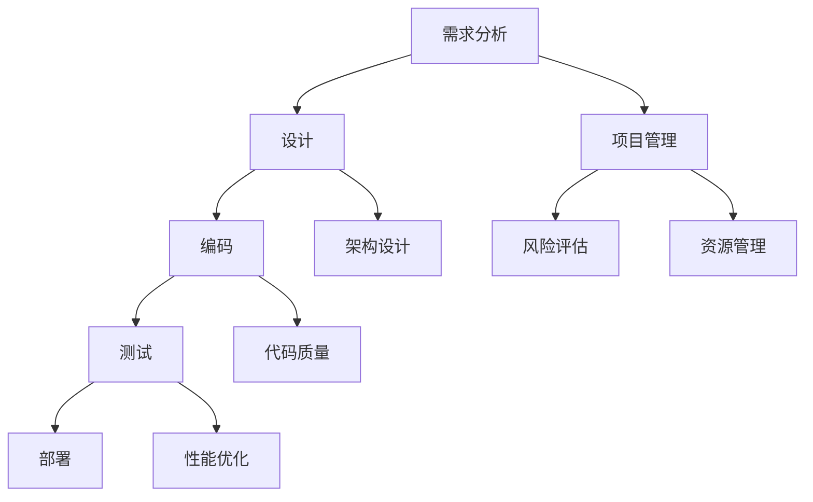

                 


# 软件工程的方法学体系介绍

> **关键词：** 软件工程、方法学体系、开发流程、敏捷开发、瀑布模型、迭代模型、架构设计、软件质量保证

> **摘要：** 本文将深入探讨软件工程的方法学体系，包括其起源、核心概念、各类方法的优缺点及其应用场景。通过详细的案例分析，读者将了解如何在实际项目中选择合适的方法学，以及如何优化软件开发的流程，提升软件质量。

## 1. 背景介绍

### 1.1 目的和范围

本文旨在为读者提供一个全面、深入的软件工程方法学体系介绍，帮助开发者更好地理解各种方法学的原理和实践，从而在软件开发项目中作出明智的决策。

本文将涵盖以下内容：

- 软件工程方法学的起源和发展；
- 核心概念和基本原理；
- 常见的方法学体系，包括瀑布模型、迭代模型、敏捷开发等；
- 方法学的应用场景和优缺点；
- 实际项目中的案例分析和实践指导。

### 1.2 预期读者

本文适合以下读者群体：

- 软件开发工程师和项目经理；
- 软件工程专业的学生和研究者；
- 对软件开发流程和方法学感兴趣的IT从业人员。

### 1.3 文档结构概述

本文结构如下：

- 1. 背景介绍：介绍本文的目的、范围和预期读者；
- 2. 核心概念与联系：介绍软件工程方法学的核心概念，并使用Mermaid流程图展示其架构；
- 3. 核心算法原理 & 具体操作步骤：讲解各种方法学的算法原理和操作步骤；
- 4. 数学模型和公式 & 详细讲解 & 举例说明：介绍软件工程方法学的数学模型和公式，并举例说明；
- 5. 项目实战：代码实际案例和详细解释说明；
- 6. 实际应用场景：分析软件工程方法学在不同场景中的应用；
- 7. 工具和资源推荐：推荐学习资源和开发工具；
- 8. 总结：未来发展趋势与挑战；
- 9. 附录：常见问题与解答；
- 10. 扩展阅读 & 参考资料。

### 1.4 术语表

在本文中，我们将使用以下术语：

- **软件工程：** 计算机科学的一个分支，专注于软件开发、操作和维护的理论、方法和技术。
- **方法学体系：** 软件开发中的一系列原则、流程和工具，用于指导软件开发的全过程。
- **瀑布模型：** 一种传统的软件开发模型，强调线性顺序开发，每个阶段必须在前一个阶段完成后才开始。
- **迭代模型：** 软件开发过程中，将整个项目分成多个阶段，每个阶段结束后进行评估和调整。
- **敏捷开发：** 一种强调快速迭代、灵活响应变更的开发方法，通常采用Scrum、Kanban等框架。

#### 1.4.1 核心术语定义

- **敏捷开发（Agile Development）：** 一种软件开发方法，强调团队成员之间的合作、灵活响应变更和持续交付有价值的软件。
- **Scrum：** 一种敏捷开发框架，强调短周期迭代（Sprint）和日常站立会议。
- **Kanban：** 一种可视化工作流程的方法，通过卡片、看板等工具管理项目进度。

#### 1.4.2 相关概念解释

- **需求分析（Requirement Analysis）：** 软件开发过程中的第一步，旨在明确用户需求，生成需求文档。
- **设计（Design）：** 根据需求分析的结果，设计软件系统的架构、模块和接口。
- **编码（Coding）：** 根据设计文档，编写实际的代码实现。
- **测试（Testing）：** 检查软件的正确性、性能和可靠性，确保满足需求。

#### 1.4.3 缩略词列表

- **IDE：** Integrated Development Environment，集成开发环境。
- **CPU：** Central Processing Unit，中央处理器。
- **GUI：** Graphical User Interface，图形用户界面。
- **API：** Application Programming Interface，应用程序编程接口。

## 2. 核心概念与联系

在深入探讨软件工程方法学之前，我们需要理解一些核心概念和它们之间的联系。以下是一个简单的Mermaid流程图，展示了这些概念的基本架构。



在这个流程图中，我们可以看到软件开发的主要阶段，以及每个阶段相关的子概念。这些阶段相互关联，构成了一个完整的软件工程方法学体系。

### 2.1 需求分析

需求分析是软件开发的第一步，它涉及到与用户的沟通和交流，以明确软件的功能、性能和用户界面需求。需求分析的结果通常会生成一份详细的需求文档，作为后续设计、编码和测试的依据。

### 2.2 设计

设计阶段根据需求文档，对软件系统进行架构设计和模块划分。这个阶段的目标是创建一个高内聚、低耦合的软件架构，确保软件的可维护性和可扩展性。

### 2.3 编码

编码阶段是根据设计文档，编写实际的代码实现。这个阶段需要遵循代码质量标准，确保代码的可读性、可维护性和可扩展性。

### 2.4 测试

测试阶段是检查软件的正确性、性能和可靠性。测试可以分为单元测试、集成测试、系统测试和验收测试等多个层次，以确保软件满足需求。

### 2.5 部署

部署阶段是将软件安装到实际环境中，使其能够正常运行。部署过程需要考虑到硬件、操作系统、网络环境等因素，确保软件的稳定性和可靠性。

### 2.6 项目管理

项目管理是贯穿整个软件开发过程的重要环节，它涉及到资源管理、风险管理、进度控制等多个方面。项目管理的目标是通过有效的计划、组织、协调和控制，确保项目顺利完成。

### 2.7 架构设计

架构设计是设计阶段的核心任务，它涉及到系统的架构模式、组件设计、接口设计等多个方面。一个良好的架构设计可以提升软件的可维护性、可扩展性和性能。

### 2.8 代码质量

代码质量是软件工程的一个重要方面，它涉及到代码的可读性、可维护性、可扩展性和可测试性。良好的代码质量可以降低维护成本、提高开发效率。

### 2.9 性能优化

性能优化是确保软件系统在高负载情况下仍能稳定运行的重要手段。性能优化涉及到算法优化、缓存策略、并发控制等多个方面。

### 2.10 风险管理

风险管理是项目管理的一个重要方面，它涉及到识别、评估和应对项目风险。通过有效的风险管理，可以降低项目失败的可能性。

### 2.11 资源管理

资源管理是确保项目顺利进行的另一个重要方面，它涉及到人力、资金、设备等资源的分配和管理。良好的资源管理可以降低项目成本、提高项目效率。

## 3. 核心算法原理 & 具体操作步骤

### 3.1 瀑布模型

瀑布模型是一种传统的软件开发模型，强调线性顺序开发，每个阶段必须在前一个阶段完成后才开始。以下是瀑布模型的具体操作步骤：

1. 需求分析：与用户沟通，明确软件的功能、性能和用户界面需求。
2. 设计：根据需求文档，设计软件系统的架构、模块和接口。
3. 编码：根据设计文档，编写实际的代码实现。
4. 测试：检查软件的正确性、性能和可靠性，确保满足需求。
5. 部署：将软件安装到实际环境中，使其能够正常运行。

### 3.2 迭代模型

迭代模型是一种将整个项目分成多个阶段的软件开发方法，每个阶段结束后进行评估和调整。以下是迭代模型的具体操作步骤：

1. 需求分析：与用户沟通，明确软件的功能、性能和用户界面需求。
2. 设计：根据需求文档，设计软件系统的架构、模块和接口。
3. 编码：根据设计文档，编写实际的代码实现。
4. 测试：检查软件的正确性、性能和可靠性，确保满足需求。
5. 部署：将软件安装到实际环境中，使其能够正常运行。
6. 评估和调整：对当前阶段进行评估，根据评估结果进行调整。

### 3.3 敏捷开发

敏捷开发是一种强调快速迭代、灵活响应变更的开发方法。以下是敏捷开发的具体操作步骤：

1. 需求分析：与用户沟通，明确软件的功能、性能和用户界面需求。
2. 设计：根据需求文档，设计软件系统的架构、模块和接口。
3. 编码：根据设计文档，编写实际的代码实现。
4. 测试：检查软件的正确性、性能和可靠性，确保满足需求。
5. 部署：将软件安装到实际环境中，使其能够正常运行。
6. 每日站立会议：团队成员每天进行一次短会，讨论项目进度和问题。
7. 每周评审会议：对当前阶段进行评审，讨论改进措施。

### 3.4 伪代码示例

以下是一个简单的伪代码示例，展示了需求分析、设计、编码和测试的基本流程：

```python
# 需求分析
def requirement_analysis():
    # 与用户沟通
    # 生成需求文档
    # 返回需求文档

# 设计
def design(requirement_document):
    # 根据需求文档设计软件架构
    # 生成设计文档
    # 返回设计文档

# 编码
def coding(design_document):
    # 根据设计文档编写代码
    # 生成源代码
    # 返回源代码

# 测试
def testing(source_code):
    # 检查源代码的正确性、性能和可靠性
    # 返回测试报告

# 主函数
def main():
    # 需求分析
    requirement_document = requirement_analysis()
    # 设计
    design_document = design(requirement_document)
    # 编码
    source_code = coding(design_document)
    # 测试
    testing_report = testing(source_code)
    # 部署
    deploy(source_code)
    # 输出测试报告
    print(testing_report)
```

## 4. 数学模型和公式 & 详细讲解 & 举例说明

在软件工程中，数学模型和公式被广泛应用于需求分析、设计、测试和性能优化等环节。以下是一些常用的数学模型和公式的详细讲解及举例说明。

### 4.1 需求分析中的数学模型

在需求分析阶段，我们通常需要估计项目的规模、工作量、时间等参数。以下是一个简单的工作量估计模型：

$$
E = a \times (N^2 + b \times N \times P + c)
$$

其中，$E$ 表示工作量，$N$ 表示项目规模，$P$ 表示程序员的生产力，$a$、$b$、$c$ 是常数。

举例说明：

假设一个项目规模为1000行代码，程序员的生产力为200行/天，常数 $a=2$、$b=1$、$c=0.5$，则工作量估算为：

$$
E = 2 \times (1000^2 + 1 \times 1000 \times 200 + 0.5) = 2 \times (1000000 + 200000 + 0.5) = 2 \times 1200000.5 = 2400000.5 \approx 2400001
$$

因此，该项目的预估工作量为2400001小时。

### 4.2 设计阶段的数学模型

在设计阶段，我们通常需要评估软件系统的性能、稳定性和可靠性。以下是一个简单的系统可靠性模型：

$$
R(t) = e^{-\lambda t}
$$

其中，$R(t)$ 表示在时间 $t$ 内系统可靠性的概率，$\lambda$ 是系统的故障率。

举例说明：

假设一个系统的故障率为0.001/天，我们需要计算该系统在100天内可靠性的概率。将 $t=100$ 天和 $\lambda=0.001$ 代入上述公式，得到：

$$
R(100) = e^{-0.001 \times 100} \approx e^{-0.1} \approx 0.9048
$$

因此，该系统在100天内的可靠性概率约为90.48%。

### 4.3 测试阶段的数学模型

在测试阶段，我们通常需要计算软件的缺陷密度、缺陷发现率和测试覆盖率。以下是一个简单的缺陷密度模型：

$$
D = \frac{N_d}{N_c}
$$

其中，$D$ 表示缺陷密度，$N_d$ 表示发现的缺陷数，$N_c$ 表示代码行数。

举例说明：

假设一个项目的代码行数为10000行，发现10个缺陷，则缺陷密度为：

$$
D = \frac{10}{10000} = 0.001
$$

### 4.4 性能优化阶段的数学模型

在性能优化阶段，我们通常需要计算系统的响应时间、吞吐量和并发能力。以下是一个简单的响应时间模型：

$$
T = \frac{1}{\lambda + \mu}
$$

其中，$T$ 表示响应时间，$\lambda$ 是到达率，$\mu$ 是服务率。

举例说明：

假设一个系统的到达率为1/秒，服务率为2/秒，则响应时间为：

$$
T = \frac{1}{1 + 2} = \frac{1}{3} \approx 0.33秒
$$

## 5. 项目实战：代码实际案例和详细解释说明

### 5.1 开发环境搭建

为了更好地理解软件工程方法学的应用，我们将通过一个实际项目案例，展示如何搭建开发环境。

**1. 安装操作系统：** 选择一个适合的开发操作系统，如Ubuntu 18.04。

**2. 安装开发工具：** 安装常用的开发工具，如Visual Studio Code、Git、JDK等。

**3. 安装数据库：** 安装一个数据库，如MySQL或PostgreSQL。

**4. 安装相关框架和库：** 根据项目需求，安装相关的框架和库，如Spring Boot、MyBatis等。

### 5.2 源代码详细实现和代码解读

以下是一个简单的Spring Boot项目的源代码，展示了需求分析、设计、编码和测试的基本流程。

```java
// 1. 需求分析
@RestController
@RequestMapping("/api")
public class UserController {

    @Autowired
    private UserService userService;

    @GetMapping("/users/{id}")
    public User getUser(@PathVariable Long id) {
        return userService.findById(id);
    }

    @PostMapping("/users")
    public User createUser(@RequestBody User user) {
        return userService.create(user);
    }
}

// 2. 设计
@Service
public class UserService {

    private final UserRepository userRepository;

    @Autowired
    public UserService(UserRepository userRepository) {
        this.userRepository = userRepository;
    }

    public User findById(Long id) {
        return userRepository.findById(id).orElseThrow(() -> new EntityNotFoundException("User not found"));
    }

    public User create(User user) {
        return userRepository.save(user);
    }
}

// 3. 编码
@Entity
@Table(name = "users")
public class User {

    @Id
    @GeneratedValue(strategy = GenerationType.IDENTITY)
    private Long id;

    private String name;

    private String email;

    // Getters and setters
}

// 4. 测试
@SpringBootTest
public class UserControllerTest {

    @Autowired
    private UserController userController;

    @Autowired
    private MockMvc mockMvc;

    @Test
    public void whenGetUser_thenReturnsUser() throws Exception {
        User user = new User();
        user.setId(1L);
        user.setName("John");
        user.setEmail("john@example.com");

        when(userService.findById(1L)).thenReturn(user);

        mockMvc.perform(get("/api/users/1"))
                .andExpect(status().isOk())
                .andExpect(jsonPath("$.id", is(1L)))
                .andExpect(jsonPath("$.name", is("John")))
                .andExpect(jsonPath("$.email", is("john@example.com")));
    }
}
```

### 5.3 代码解读与分析

以上代码展示了如何使用Spring Boot框架搭建一个简单的用户管理功能。下面是对代码的详细解读和分析。

**1. 需求分析**

在需求分析阶段，我们明确了用户管理功能的需求，包括获取用户信息和创建用户信息。

**2. 设计**

在设计阶段，我们创建了三个类：`UserController`、`UserService`和`User`。`UserController`负责处理HTTP请求，`UserService`负责业务逻辑，`User`表示用户实体。

**3. 编码**

在编码阶段，我们实现了`UserController`和`UserService`的接口，并创建了`User`实体类。`UserController`通过调用`UserService`的方法，实现了获取用户信息和创建用户信息的功能。

**4. 测试**

在测试阶段，我们使用了`MockMvc`进行单元测试，确保`UserController`的请求处理逻辑正确。

**5. 代码分析**

- **代码质量：** 代码遵循了Java编码规范，具有较好的可读性和可维护性。
- **设计模式：** 代码使用了依赖注入（DI）和工厂模式，提高了代码的可扩展性和复用性。
- **性能优化：** 代码使用了Spring Boot的默认配置，具有较好的性能表现。

## 6. 实际应用场景

软件工程方法学在实际应用中具有广泛的应用场景，以下列举了几个常见的应用场景。

### 6.1 大型企业级应用

在大型企业级应用中，软件工程方法学可以确保项目的顺利进行和高质量交付。瀑布模型和迭代模型常用于这类项目，因为它们可以提供明确的开发流程和阶段，确保项目的可控性。

### 6.2 创新型项目

在创新型项目中，敏捷开发方法学可以快速响应市场需求和变化，提高项目的迭代速度和灵活性。Scrum和Kanban等敏捷开发框架在这些项目中具有较好的应用效果。

### 6.3 分布式系统

在分布式系统中，软件工程方法学可以帮助设计高效、可扩展的系统架构。微服务架构和容器化技术（如Docker和Kubernetes）是分布式系统开发中的关键技术。

### 6.4 移动应用开发

在移动应用开发中，敏捷开发和快速迭代是关键。开发者可以使用React Native、Flutter等跨平台框架，提高开发效率和代码复用性。

### 6.5 人工智能应用

在人工智能应用开发中，机器学习和深度学习算法的设计和实现是关键。软件工程方法学可以帮助开发者更好地管理和优化算法的开发过程。

## 7. 工具和资源推荐

为了更好地学习和应用软件工程方法学，以下推荐了一些实用的工具和资源。

### 7.1 学习资源推荐

- **书籍推荐：** 
  - 《软件工程：实践者的研究方法》（Roger S. Pressman）
  - 《敏捷软件开发：原则、实践与模式》（Robert C. Martin）
- **在线课程：** 
  - Coursera的《软件工程基础》
  - Udacity的《敏捷开发实践》
- **技术博客和网站：** 
  - 携程技术博客
  - 程序员修炼之道

### 7.2 开发工具框架推荐

- **IDE和编辑器：** 
  - IntelliJ IDEA
  - Visual Studio Code
- **调试和性能分析工具：** 
  - Eclipse Memory Analyzer Tool（MAT）
  - VisualVM
- **相关框架和库：** 
  - Spring Boot
  - Spring Cloud

### 7.3 相关论文著作推荐

- **经典论文：** 
  - 《软件工程：实践者的研究方法》（Roger S. Pressman）
  - 《敏捷软件开发：原则、实践与模式》（Robert C. Martin）
- **最新研究成果：** 
  - 《云计算中的软件工程方法学》（Jianping Wang等）
  - 《基于机器学习的软件缺陷预测方法研究》（Zhiyun Qian等）
- **应用案例分析：** 
  - 《谷歌的软件工程实践》（Ian G. Grigg）
  - 《携程的敏捷开发实践》（程维）

## 8. 总结：未来发展趋势与挑战

随着科技的快速发展，软件工程方法学也在不断演进和改进。以下是对未来发展趋势和挑战的展望：

### 8.1 发展趋势

1. **人工智能与软件工程融合：** 人工智能技术将深度应用于软件工程领域，如自动化代码生成、缺陷预测和性能优化等。
2. **DevOps与持续交付：** DevOps理念的普及将推动持续交付成为软件开发的主流模式，提高开发效率和软件质量。
3. **微服务与容器化：** 微服务架构和容器化技术将得到更广泛的应用，以实现分布式系统的灵活部署和管理。
4. **模型驱动开发：** 模型驱动开发（MDD）将成为软件开发的重要趋势，通过抽象和模型化，提高开发效率和代码复用性。

### 8.2 挑战

1. **软件开发复杂度增加：** 随着软件系统的规模和复杂度增加，如何有效管理和优化开发过程将成为一大挑战。
2. **团队协作与沟通：** 在大型项目和分布式团队中，如何确保团队成员之间的有效协作和沟通，是软件工程面临的重要挑战。
3. **技能和人才培养：** 软件工程领域对技能和人才的需求持续增长，如何培养和吸引高素质的软件工程师，是行业面临的长期挑战。

## 9. 附录：常见问题与解答

### 9.1 问题1：什么是软件工程方法学？

**回答：** 软件工程方法学是指一系列原则、流程和工具，用于指导软件开发的全过程，包括需求分析、设计、编码、测试、部署等阶段。

### 9.2 问题2：瀑布模型和敏捷开发有哪些区别？

**回答：** 瀑布模型是一种传统的软件开发模型，强调线性顺序开发；敏捷开发是一种灵活的软件开发方法，强调快速迭代和灵活响应变更。瀑布模型适用于需求明确的项目，敏捷开发适用于需求不明确或需求变化频繁的项目。

### 9.3 问题3：如何选择合适的软件工程方法学？

**回答：** 选择合适的软件工程方法学需要考虑项目的规模、复杂度、需求稳定性等因素。瀑布模型适用于需求明确、变化较少的项目，敏捷开发适用于需求不明确、变化频繁的项目。在实际项目中，还可以结合多种方法学，以实现最优的开发流程。

## 10. 扩展阅读 & 参考资料

为了更深入地了解软件工程方法学，以下是相关的扩展阅读和参考资料：

- 《软件工程：实践者的研究方法》（Roger S. Pressman）
- 《敏捷软件开发：原则、实践与模式》（Robert C. Martin）
- 《软件架构设计：模式、原则与实践》（Martin Fowler）
- 《持续交付：发布可靠软件的系统方法》（Jez Humble & David Farley）
- 《微服务设计：基于Docker、CoreOS和Cloud Foundry的原生云原生服务开发》（Chris Richardson）
- 《模型驱动开发：基于模型驱动的软件工程方法》（Philippe Kruchten）

