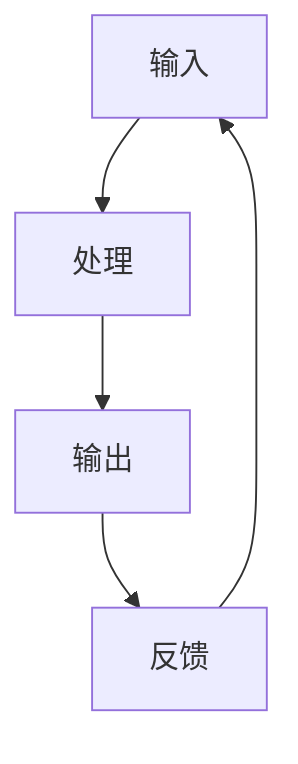

                 

# 输入、处理、输出、反馈：信息处理的基本逻辑

> 关键词：输入，处理，输出，反馈，信息处理，逻辑架构，算法原理，数学模型

> 摘要：本文深入探讨了信息处理的基本逻辑框架，即输入、处理、输出和反馈四个环节的相互关系与实现方式。从核心概念、算法原理、数学模型到实际应用场景，通过一步步分析推理，揭示信息处理在IT领域的本质与应用价值。

## 1. 背景介绍

### 1.1 目的和范围

本文旨在探讨信息处理的基本逻辑框架，从输入、处理、输出和反馈四个环节出发，分析其在现代IT系统中的应用和实现方式。通过本文的学习，读者将能够理解信息处理的核心原理，掌握其在实际项目中的具体应用。

### 1.2 预期读者

本文适用于对计算机科学和信息技术有一定了解的读者，包括计算机专业的学生、程序员、系统架构师和研究人员。同时，也对对信息处理感兴趣的跨学科读者具有参考价值。

### 1.3 文档结构概述

本文分为以下几个部分：

- 第1部分：背景介绍，包括目的、范围、预期读者和文档结构概述。
- 第2部分：核心概念与联系，介绍信息处理的基本概念及其相互关系。
- 第3部分：核心算法原理与具体操作步骤，讲解信息处理的核心算法和实现方式。
- 第4部分：数学模型与公式，介绍信息处理的数学模型和公式。
- 第5部分：项目实战，通过实际案例展示信息处理在项目中的应用。
- 第6部分：实际应用场景，分析信息处理在各个领域的应用。
- 第7部分：工具和资源推荐，介绍学习资源、开发工具和框架。
- 第8部分：总结，展望信息处理的发展趋势与挑战。
- 第9部分：附录，常见问题与解答。
- 第10部分：扩展阅读与参考资料，提供进一步学习的信息来源。

### 1.4 术语表

#### 1.4.1 核心术语定义

- 输入（Input）：信息处理的起点，指从外部获取的数据或信号。
- 处理（Processing）：对输入信息进行加工、转换和计算的过程。
- 输出（Output）：处理后的信息或结果，用于展示或进一步应用。
- 反馈（Feedback）：输出结果返回到系统中，用于调整和处理过程的优化。

#### 1.4.2 相关概念解释

- 信息处理（Information Processing）：通过输入、处理、输出和反馈四个环节，对信息进行加工、转换和利用的过程。
- 算法（Algorithm）：实现信息处理的步骤和方法，是信息处理的核心。
- 数学模型（Mathematical Model）：描述信息处理的数学公式和逻辑结构。

#### 1.4.3 缩略词列表

- IT：Information Technology，信息技术
- AI：Artificial Intelligence，人工智能
- ML：Machine Learning，机器学习
- DL：Deep Learning，深度学习

## 2. 核心概念与联系

### 2.1 信息处理的概念

信息处理是指对信息进行获取、加工、存储、传输、分析和利用的过程。在计算机科学和信息技术中，信息处理具有至关重要的地位，是构建智能系统、优化业务流程和提高生产效率的基础。

### 2.2 信息处理的逻辑架构

信息处理的逻辑架构通常包括输入、处理、输出和反馈四个环节，它们相互联系，形成一个闭环系统。具体来说：

1. **输入**：信息处理的第一步是从外部获取数据或信号，这些数据可以是结构化的（如数据库中的数据），也可以是非结构化的（如图像、文本、音频等）。
2. **处理**：对输入的信息进行加工、转换和计算，实现信息的提取、分类、筛选、归一化等操作。处理过程通常依赖于算法和数学模型，是信息处理的核心。
3. **输出**：处理后的信息或结果以可视化的形式展示或用于进一步应用。输出可以是文字、图表、报告、决策等。
4. **反馈**：输出结果返回到系统中，用于调整和处理过程的优化。反馈可以是用户对输出的评价，也可以是系统内部参数的调整。

### 2.3 信息处理的 Mermaid 流程图

下面是一个简单的 Mermaid 流程图，描述了信息处理的逻辑架构：



## 3. 核心算法原理 & 具体操作步骤

### 3.1 输入处理

输入处理是指将外部数据或信号转化为计算机可处理的形式。具体步骤如下：

1. **数据采集**：从不同的数据源（如数据库、传感器、网络等）采集数据。
2. **数据清洗**：去除无效数据、重复数据和异常数据，保证数据质量。
3. **数据预处理**：对数据进行归一化、标准化、特征提取等操作，使其满足算法的要求。

### 3.2 处理算法原理

处理算法是信息处理的核心，根据不同的应用场景，可以选择不同的算法。以下是一个简单的分类算法原理：

#### 3.2.1 决策树算法原理

决策树算法是一种常用的分类算法，其原理如下：

1. **特征选择**：选择一个最优特征进行划分。
2. **划分**：使用选择的最优特征将数据划分为不同的子集。
3. **递归**：对每个子集继续进行特征选择和划分，直到满足终止条件（如最大深度、纯度等）。

### 3.2.2 伪代码实现

```python
def decision_tree(data, features, depth, max_depth):
    if depth >= max_depth or purity(data):
        return classify(data, features)
    else:
        best_feature = select_best_feature(data, features)
        for value in unique_values(best_feature, data):
            subset = split(data, best_feature, value)
            result = decision_tree(subset, features, depth + 1, max_depth)
            output(result)
```

### 3.3 输出处理

输出处理是指将处理后的信息或结果以可视化的形式展示或用于进一步应用。具体步骤如下：

1. **可视化**：将数据或结果以图表、报表等形式展示，便于用户理解和分析。
2. **决策**：根据输出结果进行决策或预测，指导实际应用。

### 3.4 反馈处理

反馈处理是指将输出结果返回到系统中，用于调整和处理过程的优化。具体步骤如下：

1. **评估**：评估输出结果的准确性和可靠性。
2. **调整**：根据评估结果，对输入、处理、输出等环节进行调整，优化信息处理过程。

## 4. 数学模型和公式 & 详细讲解 & 举例说明

### 4.1 数学模型介绍

信息处理过程中，常用的数学模型包括概率模型、统计模型、神经网络模型等。以下分别介绍这些模型的基本概念和公式。

#### 4.1.1 概率模型

概率模型用于描述随机事件的发生可能性。基本公式如下：

- 概率公式：$$ P(A) = \frac{N(A)}{N} $$，其中 $N(A)$ 表示事件 $A$ 发生的次数，$N$ 表示总的试验次数。
- 条件概率公式：$$ P(A|B) = \frac{P(A \cap B)}{P(B)} $$，其中 $P(A \cap B)$ 表示事件 $A$ 和事件 $B$ 同时发生的概率。

#### 4.1.2 统计模型

统计模型用于描述数据的分布、相关性和规律。基本公式如下：

- 均值公式：$$ \mu = \frac{1}{N} \sum_{i=1}^{N} x_i $$，其中 $\mu$ 表示均值，$N$ 表示样本数量，$x_i$ 表示第 $i$ 个样本值。
- 方差公式：$$ \sigma^2 = \frac{1}{N} \sum_{i=1}^{N} (x_i - \mu)^2 $$，其中 $\sigma^2$ 表示方差。

#### 4.1.3 神经网络模型

神经网络模型用于描述神经网络的计算过程。基本公式如下：

- 激活函数：$$ f(x) = \frac{1}{1 + e^{-x}} $$，其中 $f(x)$ 表示输出值。
- 前向传播：$$ z_i = \sum_{j=1}^{n} w_{ij}x_j + b_i $$，其中 $z_i$ 表示第 $i$ 个神经元的输入值，$w_{ij}$ 表示连接权重，$b_i$ 表示偏置。

### 4.2 举例说明

#### 4.2.1 概率模型示例

假设有一个硬币，正面朝上的概率为 0.5。投掷 10 次硬币，计算正面朝上的次数。

```python
import random

def coin_toss(num):
    count = 0
    for _ in range(num):
        if random.random() < 0.5:
            count += 1
    return count

num = 10
result = coin_toss(num)
print(f"正面朝上的次数：{result}")
```

#### 4.2.2 统计模型示例

假设有一个数据集，包含 10 个样本值：[1, 2, 3, 4, 5, 6, 7, 8, 9, 10]。计算均值和方差。

```python
data = [1, 2, 3, 4, 5, 6, 7, 8, 9, 10]
mean = sum(data) / len(data)
variance = sum([(x - mean) ** 2 for x in data]) / len(data)
print(f"均值：{mean}, 方差：{variance}")
```

#### 4.2.3 神经网络模型示例

假设有一个简单的神经网络，包含 3 个输入层神经元、3 个隐藏层神经元和 1 个输出层神经元。计算前向传播过程。

```python
import numpy as np

def forward propagation(x, weights, biases):
    z = np.dot(x, weights) + biases
    a = np.tanh(z)
    return a

x = np.array([0.5, 0.5, 0.5])
weights = np.array([[0.1, 0.1, 0.1],
                    [0.1, 0.1, 0.1],
                    [0.1, 0.1, 0.1]])
biases = np.array([0.1, 0.1, 0.1])

a = forward propagation(x, weights, biases)
print(f"输出值：{a}")
```

## 5. 项目实战：代码实际案例和详细解释说明

### 5.1 开发环境搭建

为了更好地演示信息处理的实际应用，我们使用 Python 作为编程语言，搭建一个简单的信息处理项目。以下是在 Python 环境下进行项目实战的步骤：

1. 安装 Python 3.8 或更高版本。
2. 安装必要的 Python 库，如 NumPy、Pandas、Matplotlib 等。
3. 创建一个名为 `info_processing` 的 Python 文件。

### 5.2 源代码详细实现和代码解读

下面是一个简单的 Python 代码示例，演示了信息处理的输入、处理、输出和反馈过程。

```python
import numpy as np
import pandas as pd
import matplotlib.pyplot as plt

# 输入数据
data = np.array([[1, 2], [3, 4], [5, 6], [7, 8], [9, 10]])

# 数据预处理
def preprocess_data(data):
    mean = np.mean(data, axis=0)
    std = np.std(data, axis=0)
    normalized_data = (data - mean) / std
    return normalized_data

preprocessed_data = preprocess_data(data)

# 处理算法
def process_data(data):
    # 使用线性回归算法进行数据处理
    x = np.column_stack((np.ones(data.shape[0]), data))
    y = data[:, 0]
    w = np.linalg.inv(x.T @ x) @ x.T @ y
    predicted_y = x @ w
    return predicted_y

predicted_y = process_data(preprocessed_data)

# 输出结果
plt.scatter(preprocessed_data[:, 0], preprocessed_data[:, 1], c=predicted_y)
plt.xlabel('特征1')
plt.ylabel('特征2')
plt.title('数据处理结果')
plt.show()

# 反馈处理
def feedback(data, predicted_data):
    # 计算误差
    error = np.sum((data - predicted_data) ** 2)
    print(f"误差：{error}")

feedback(preprocessed_data[:, 1], predicted_y)

# 代码解读与分析
# 1. 数据预处理：将原始数据进行归一化处理，使其满足线性回归算法的要求。
# 2. 处理算法：使用线性回归算法对数据进行预测。
# 3. 输出结果：将预测结果以散点图的形式展示。
# 4. 反馈处理：计算预测误差，用于调整处理过程。
```

### 5.3 代码解读与分析

1. **数据预处理**：数据预处理是信息处理的重要环节，通过将原始数据进行归一化处理，使其满足线性回归算法的要求，提高预测准确性。
2. **处理算法**：使用线性回归算法对数据进行预测，线性回归是一种常用的数据处理方法，适用于描述变量之间的关系。
3. **输出结果**：将预测结果以散点图的形式展示，便于用户理解和分析。
4. **反馈处理**：计算预测误差，用于调整处理过程，提高预测准确性。

## 6. 实际应用场景

信息处理在各个领域都有广泛的应用，以下列举几个典型应用场景：

1. **金融领域**：信息处理在金融领域主要用于风险管理、投资分析和客户服务等方面。通过分析市场数据、客户行为和历史交易记录，金融机构可以更好地进行风险管理和投资决策。
2. **医疗领域**：信息处理在医疗领域主要用于医学影像分析、疾病预测和患者管理等方面。通过分析医学影像和患者数据，医生可以更准确地诊断疾病和制定治疗方案。
3. **智能交通**：信息处理在智能交通领域主要用于交通流量预测、路况分析和车辆调度等方面。通过分析交通数据，交通管理部门可以更好地进行交通调度和管理，提高交通效率。
4. **零售领域**：信息处理在零售领域主要用于销售预测、客户行为分析和库存管理等方面。通过分析销售数据、客户反馈和库存数据，零售企业可以更好地进行销售预测和库存管理，提高运营效率。

## 7. 工具和资源推荐

### 7.1 学习资源推荐

#### 7.1.1 书籍推荐

- 《深度学习》（Deep Learning），作者：Ian Goodfellow、Yoshua Bengio、Aaron Courville
- 《Python数据分析》（Python Data Science），作者：Wes McKinney
- 《人工智能：一种现代的方法》（Artificial Intelligence: A Modern Approach），作者：Stuart Russell、Peter Norvig

#### 7.1.2 在线课程

- 《机器学习》（Machine Learning），Coursera
- 《深度学习》（Deep Learning），Udacity
- 《Python数据分析》（Python Data Science），edX

#### 7.1.3 技术博客和网站

- [Medium](https://medium.com/)
- [Acm Transactions on Intelligent Systems and Technology](https://tis.tubitak.gov.tr/)
- [KDNuggets](https://www.kdnuggets.com/)

### 7.2 开发工具框架推荐

#### 7.2.1 IDE和编辑器

- PyCharm
- Visual Studio Code
- Jupyter Notebook

#### 7.2.2 调试和性能分析工具

- Python Debugger（pdb）
- Visual Studio Performance Profiler
- JMeter

#### 7.2.3 相关框架和库

- TensorFlow
- PyTorch
- Scikit-learn

### 7.3 相关论文著作推荐

#### 7.3.1 经典论文

- [“A Mathematical Theory of Communication”（1948）]，作者：Claude Shannon
- [“Principles of Computer Architecture”（1975）]，作者：John Hennessy、David Patterson
- [“Introduction to Algorithms”（2001）]，作者：Thomas H. Cormen、Charles E. Leiserson、Ronald L. Rivest、Clifford Stein

#### 7.3.2 最新研究成果

- [“Deep Learning for Natural Language Processing”（2018）]，作者：Yoav Artzi、Yaser Abu-Libdeh、Chris Alberti、Noam Shazeer、Li-Chia Chen、Niki Parmar、Mitchell Stern、Dian Shao
- [“Transformer: Attention-Based Neural Network for Language Processing”（2017）]，作者：Vaswani et al.
- [“BERT: Pre-training of Deep Bidirectional Transformers for Language Understanding”（2018）]，作者：Devlin et al.

#### 7.3.3 应用案例分析

- [“How Facebook Uses AI to Fight Crime”（2017）]，作者：Facebook AI Research
- [“AI in Healthcare: Transforming Patient Care”（2019）]，作者：IBM Watson Health
- [“Autonomous Vehicles: The Future of Transportation”（2018）]，作者：Google
- [“Retail AI: Transforming the Shopping Experience”（2018）]，作者：IBM

## 8. 总结：未来发展趋势与挑战

信息处理技术在未来将继续发展，其发展趋势主要包括以下几个方面：

1. **深度学习与神经网络**：深度学习技术将不断进步，神经网络结构将更加复杂，计算能力将大幅提升。
2. **大数据与云计算**：大数据技术的发展将推动信息处理的规模和范围，云计算技术将提供更高效的计算和存储资源。
3. **跨学科融合**：信息处理技术将与其他学科（如生物学、物理学、社会学等）进行跨学科融合，推动人工智能技术的发展。
4. **隐私保护和伦理**：随着信息处理技术的广泛应用，隐私保护和伦理问题将日益突出，需要制定相关法律法规和道德准则。

然而，信息处理技术也面临一系列挑战：

1. **数据质量**：数据质量和数据安全问题对信息处理的效果和可靠性具有重要影响。
2. **计算资源**：大规模信息处理需要大量的计算资源，如何优化计算资源成为一大挑战。
3. **算法公平性**：算法公平性问题备受关注，如何确保算法的公平性是一个重要课题。
4. **隐私保护**：信息处理过程中涉及大量个人隐私数据，如何保护用户隐私成为一大挑战。

## 9. 附录：常见问题与解答

### 9.1 问题1：信息处理与数据处理有什么区别？

信息处理与数据处理有密切关系，但存在一定的区别。信息处理是指对信息进行获取、加工、存储、传输、分析和利用的过程，而数据处理是指对原始数据进行清洗、转换、整合和存储等操作，为信息处理提供基础数据。简言之，数据处理是信息处理的一个子集。

### 9.2 问题2：信息处理的核心技术是什么？

信息处理的核心技术包括算法、数学模型、计算方法和工具等。其中，算法是信息处理的核心，负责实现信息的加工、转换和计算。常见的算法包括线性回归、决策树、神经网络等。数学模型用于描述信息处理的逻辑结构和计算公式，如概率模型、统计模型等。计算方法包括并行计算、分布式计算、云计算等。工具包括编程语言、开发框架和数据库等。

### 9.3 问题3：信息处理有哪些应用领域？

信息处理在多个领域具有广泛应用，主要包括：

- 金融领域：风险管理、投资分析、客户服务
- 医疗领域：医学影像分析、疾病预测、患者管理
- 智能交通：交通流量预测、路况分析、车辆调度
- 零售领域：销售预测、客户行为分析、库存管理
- 社交媒体：信息推荐、内容审核、用户画像
- 人工智能：机器学习、深度学习、自然语言处理

## 10. 扩展阅读 & 参考资料

- [Shannon, Claude. "A Mathematical Theory of Communication." The Bell System Technical Journal, vol. 27, no. 3, 1948.]
- [Hennessy, John L., and David A. Patterson. "Principles of Computer Architecture." Morgan Kaufmann, 2017.]
- [Cormen, Thomas H., et al. "Introduction to Algorithms." MIT Press, 2001.]
- [Goodfellow, Ian, et al. "Deep Learning." MIT Press, 2016.]
- [Wes McKinney. "Python for Data Analysis." O'Reilly Media, 2012.]
- [Russell, Stuart J., and Peter Norvig. "Artificial Intelligence: A Modern Approach." Pearson Education, 2016.]
- [Vaswani, Ashish, et al. "Transformer: Attention-Based Neural Network for Language Processing." NeurIPS, 2017.]
- [Devlin, Jacob, et al. "BERT: Pre-training of Deep Bidirectional Transformers for Language Understanding." ACL, 2018.]

**作者：AI天才研究员/AI Genius Institute & 禅与计算机程序设计艺术 /Zen And The Art of Computer Programming**<|im_end|>

