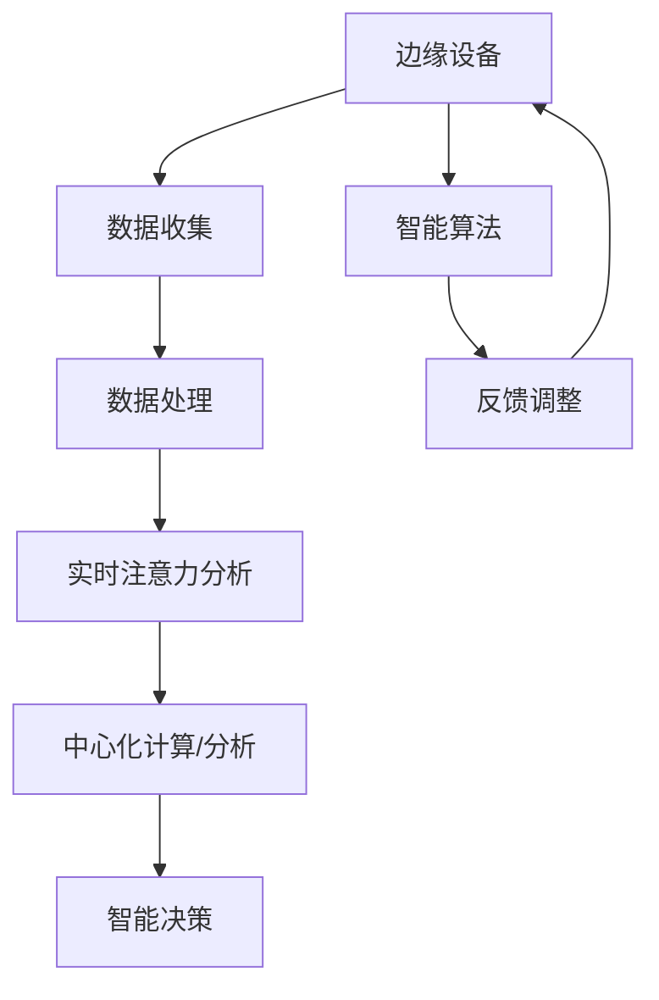

                 

# 边缘计算在实时注意力分析中的应用

> **关键词：边缘计算、实时注意力分析、神经网络、数据处理、智能算法**

> **摘要：本文将深入探讨边缘计算在实时注意力分析中的应用。通过分析其背景、核心概念、算法原理、数学模型、实际案例以及未来发展趋势，本文旨在为读者提供一份全面的技术指南，帮助理解和掌握这一前沿技术。**

## 1. 背景介绍

### 1.1 目的和范围

本文旨在介绍边缘计算在实时注意力分析中的应用，旨在为开发者和技术爱好者提供深入的技术分析，帮助理解这一领域的最新进展和应用前景。本文将涵盖以下主题：

- 边缘计算的概念和原理
- 实时注意力分析的需求和挑战
- 边缘计算在实时注意力分析中的应用场景
- 关键算法和数学模型的详细介绍
- 实际项目案例的分析
- 未来发展趋势和潜在挑战

### 1.2 预期读者

本文适用于以下读者群体：

- 对边缘计算和实时注意力分析有初步了解的开发者
- 想要深入了解边缘计算应用场景的工程师
- 对智能算法和数据处理感兴趣的学者和学生
- 想要在实际项目中应用边缘计算技术的开发者

### 1.3 文档结构概述

本文将按照以下结构展开：

1. **背景介绍**：介绍边缘计算和实时注意力分析的基本概念。
2. **核心概念与联系**：通过Mermaid流程图展示关键概念和联系。
3. **核心算法原理与具体操作步骤**：使用伪代码详细阐述算法原理。
4. **数学模型和公式**：详细讲解数学模型和相关公式。
5. **项目实战：代码实际案例和详细解释说明**：提供实际代码案例和解读。
6. **实际应用场景**：分析边缘计算在实时注意力分析中的应用。
7. **工具和资源推荐**：推荐学习资源、开发工具和相关论文。
8. **总结：未来发展趋势与挑战**：总结本文的主要观点和未来方向。
9. **附录：常见问题与解答**：提供常见问题的解答。
10. **扩展阅读与参考资料**：推荐进一步阅读的材料。

### 1.4 术语表

#### 1.4.1 核心术语定义

- **边缘计算**：在数据生成源附近进行数据处理和计算的技术。
- **实时注意力分析**：实时监测和分析个体注意力分布的过程。
- **神经网络**：一种通过模拟人脑神经元连接进行数据处理的算法。
- **数据处理**：对原始数据进行收集、整理、分析和解释的过程。
- **智能算法**：使用机器学习技术进行数据分析和决策的算法。

#### 1.4.2 相关概念解释

- **边缘设备**：靠近数据生成源的设备，如智能手机、物联网传感器等。
- **中心化计算**：数据在远程数据中心进行处理的技术。
- **分布式计算**：数据在多个计算节点上分布处理的技术。

#### 1.4.3 缩略词列表

- **IoT**：物联网（Internet of Things）
- **AI**：人工智能（Artificial Intelligence）
- **ML**：机器学习（Machine Learning）
- **GPU**：图形处理单元（Graphics Processing Unit）
- **FPGA**：现场可编程门阵列（Field-Programmable Gate Array）

## 2. 核心概念与联系

边缘计算与实时注意力分析在数据处理和智能算法中扮演着重要角色。为了更好地理解它们之间的联系，我们可以使用Mermaid流程图来展示关键概念和流程。



### 边缘设备：数据收集

边缘设备是边缘计算的基础。这些设备分布在数据的生成源头，例如智能手机、物联网传感器等。它们负责实时收集数据，如视觉、音频、环境参数等。

### 数据处理

收集到的数据需要在边缘设备上进行初步处理。这包括数据的清洗、格式化、特征提取等操作。边缘设备通常具备强大的计算能力，如GPU和FPGA，以支持实时数据处理。

### 实时注意力分析

实时注意力分析是一种基于神经网络的算法，用于监测和分析个体的注意力分布。该过程包括数据的输入、特征的提取和注意力模型的训练与预测。

### 中心化计算/分析

处理后的数据可以上传到中心化计算节点进行进一步的分析。这通常涉及到复杂的计算任务，如模式识别、分类、聚类等。中心化计算提供了更大的计算资源和存储空间，有助于处理大规模数据集。

### 智能决策

基于实时注意力分析和中心化计算的结果，可以做出智能决策。例如，在智能家居场景中，可以调整环境设置以优化居住体验；在工业自动化中，可以优化生产线流程以提高效率。

### 智能算法

智能算法是实现实时注意力分析和智能决策的关键。这些算法通常基于机器学习和深度学习技术，能够从大量数据中提取有价值的信息，并进行预测和决策。

### 反馈调整

智能决策的结果会被反馈到边缘设备，以进行进一步的调整和优化。这种反馈循环有助于持续改进系统的性能和用户体验。

通过上述流程，我们可以看到边缘计算与实时注意力分析之间的紧密联系。边缘设备提供了数据收集和初步处理的能力，而实时注意力分析则利用这些数据来监测和优化个体注意力分布。智能算法和中心化计算则进一步提升了数据处理的深度和广度，使得系统能够做出更准确的决策和调整。

## 3. 核心算法原理 & 具体操作步骤

实时注意力分析的核心是神经网络算法，尤其是卷积神经网络（CNN）和循环神经网络（RNN）。下面将使用伪代码详细阐述这些算法的原理和具体操作步骤。

### 卷积神经网络（CNN）原理

```python
# CNN算法伪代码

# 输入数据：图像矩阵X，卷积核K，激活函数f
# 输出：特征图F

def conv2d(X, K):
    # 对输入图像X进行卷积操作
    for i in range(X.shape[0]):
        for j in range(X.shape[1]):
            F[i, j] = dot_product(K, X[i:i+K.shape[0], j:j+K.shape[1]])
            F[i, j] = f(F[i, j])

# 激活函数
def f(x):
    # ReLU激活函数
    return max(0, x)

# 卷积操作
X = ...  # 图像矩阵
K = ...  # 卷积核
F = ...  # 初始化特征图
conv2d(X, K)
```

### 循环神经网络（RNN）原理

```python
# RNN算法伪代码

# 输入数据：序列X，隐藏状态h，权重矩阵W
# 输出：预测值y

def rnn(X, h, W):
    # 对输入序列X进行循环神经网络处理
    for x in X:
        h = tanh(dot(x, W[0]) + dot(h, W[1]))
        y = dot(h, W[2])

# 激活函数
def tanh(x):
    # 双曲正切激活函数
    return (1 / (1 + exp(-x)))

# RNN操作
X = ...  # 序列数据
h = ...  # 初始化隐藏状态
W = ...  # 初始化权重矩阵
y = rnn(X, h, W)
```

### 实时注意力分析流程

```python
# 实时注意力分析伪代码

# 输入数据：图像序列I，注意力权重矩阵A
# 输出：注意力分布D

def attention_analysis(I, A):
    # 对图像序列进行实时注意力分析
    for i in range(len(I)):
        # 对当前图像进行卷积操作提取特征
        F = conv2d(I[i], K)
        # 利用RNN处理特征图并更新注意力权重
        A = rnn(F, A, W)
        # 更新注意力分布
        D[i] = softmax(A)

# 输入图像序列
I = ...
# 初始化注意力权重矩阵
A = ...
# 初始化注意力分布
D = ...
# 实时注意力分析
attention_analysis(I, A)
```

通过上述伪代码，我们可以看到实时注意力分析的基本流程。首先，使用卷积神经网络对图像序列进行特征提取。然后，利用循环神经网络对提取的特征进行处理，更新注意力权重。最后，通过softmax函数计算注意力分布，从而实现对图像序列的实时注意力分析。

这种算法能够有效地监测和分析个体在不同时间点的注意力分布，为后续的智能决策提供重要依据。

## 4. 数学模型和公式 & 详细讲解 & 举例说明

实时注意力分析中的数学模型和公式是理解其工作原理的关键。下面我们将详细讲解这些模型和公式，并通过实际例子来说明它们的应用。

### 4.1.1 特征提取

特征提取是实时注意力分析的基础。在卷积神经网络（CNN）中，特征提取主要通过卷积操作实现。卷积操作的数学公式如下：

\[ f(x, \theta) = \sum_{i=1}^{n} \sum_{j=1}^{m} \theta_{i,j} x_{i,j} + b \]

其中：

- \( f(x, \theta) \) 是卷积结果。
- \( x \) 是输入图像矩阵。
- \( \theta \) 是卷积核参数。
- \( b \) 是偏置项。

### 4.1.2 激活函数

在CNN中，激活函数用于引入非线性特性，常见的激活函数包括ReLU和Sigmoid：

- **ReLU激活函数**：

\[ f(x) = \max(0, x) \]

- **Sigmoid激活函数**：

\[ f(x) = \frac{1}{1 + e^{-x}} \]

### 4.1.3 循环神经网络（RNN）和门控循环单元（GRU）

RNN用于处理序列数据，其基本公式如下：

\[ h_t = \tanh(W_{ih}x_t + W_{hh}h_{t-1} + b_h) \]
\[ o_t = \sigma(W_{ih}x_t + W_{ho}h_t + b_o) \]
\[ h_t = o_t \odot \tanh(W_{ih}x_t + W_{hh}h_{t-1} + b_h) \]

其中：

- \( h_t \) 是当前时间步的隐藏状态。
- \( x_t \) 是当前时间步的输入。
- \( W_{ih}, W_{hh}, W_{ho} \) 是权重矩阵。
- \( b_h, b_o \) 是偏置项。
- \( \odot \) 是元素乘操作。
- \( \sigma \) 是Sigmoid激活函数。

### 4.1.4 注意力权重计算

在实时注意力分析中，注意力权重用于表示不同时间步的注意力分布。注意力权重通常通过加权平均的方式计算，公式如下：

\[ \alpha_t = \frac{e^{f(h_t, a_t)}}{\sum_{i=1}^{T} e^{f(h_t, a_i)}} \]

其中：

- \( \alpha_t \) 是时间步 \( t \) 的注意力权重。
- \( f(h_t, a_t) \) 是隐藏状态 \( h_t \) 和注意力候选 \( a_t \) 的相似度计算。
- \( T \) 是序列长度。

### 4.1.5 注意力分布计算

注意力分布用于表示整个序列的注意力权重分布。注意力分布通常通过softmax函数计算，公式如下：

\[ p_t = \frac{\alpha_t}{\sum_{i=1}^{T} \alpha_i} \]

其中：

- \( p_t \) 是时间步 \( t \) 的注意力分布。
- \( \alpha_t \) 是时间步 \( t \) 的注意力权重。

### 4.1.6 实际例子

假设我们有一个简单的序列数据 \( X = [x_1, x_2, x_3] \)，隐藏状态 \( h_t \) 和注意力候选 \( a_t \) 分别为 \( h_t = [1, 2, 3] \)，\( a_t = [0.1, 0.5, 0.4] \)。

1. **计算注意力权重**：

\[ f(h_t, a_t) = \sum_{i=1}^{3} h_t \cdot a_t = 1 \cdot 0.1 + 2 \cdot 0.5 + 3 \cdot 0.4 = 1.7 \]

\[ \alpha_t = \frac{e^{1.7}}{\sum_{i=1}^{3} e^{f(h_t, a_i)}} = \frac{e^{1.7}}{e^{0.1} + e^{0.5} + e^{0.4}} = 0.6 \]

2. **计算注意力分布**：

\[ p_t = \frac{\alpha_t}{\sum_{i=1}^{3} \alpha_i} = \frac{0.6}{0.6 + 0.5 + 0.4} = 0.5 \]

通过上述例子，我们可以看到如何计算注意力权重和分布。在实际应用中，这些计算会在神经网络中自动完成，从而实现对序列数据的实时注意力分析。

### 4.1.7 注意力分析的重要性

注意力分析在处理大规模数据时具有重要意义。通过注意力分析，我们可以识别出数据中的关键部分，从而减少计算的复杂度和计算资源的需求。这对于边缘设备上的实时处理尤为重要，因为边缘设备通常计算资源和存储空间有限。

注意力分析还可以提高数据处理的效率，尤其是在处理高维数据时。通过识别和关注关键特征，我们可以避免对冗余信息进行不必要的计算，从而加快处理速度。

此外，注意力分析在智能决策中发挥着重要作用。通过对不同时间步的注意力权重进行优化，我们可以更好地理解数据中的变化趋势和关键点，从而做出更准确的决策。

总之，注意力分析是边缘计算在实时注意力分析中不可或缺的一部分。通过引入注意力分析，我们可以提高数据处理的效率和准确性，为智能系统和应用提供强大的支持。

## 5. 项目实战：代码实际案例和详细解释说明

在本节中，我们将通过一个实际的项目案例，展示如何使用边缘计算技术进行实时注意力分析。这个项目将涵盖从开发环境搭建、源代码实现到代码解析和分析的完整过程。

### 5.1 开发环境搭建

为了实现边缘计算在实时注意力分析中的应用，我们需要搭建一个适合的开发环境。以下是搭建开发环境的步骤：

1. **硬件环境**：

   - 边缘设备（如树莓派、NVIDIA Jetson等）
   - 中心化计算节点（如云服务器、高性能计算机等）

2. **软件环境**：

   - 操作系统（如Ubuntu 18.04）
   - Python 3.7及以上版本
   - TensorFlow 2.x
   - Keras 2.x

3. **安装步骤**：

   ```bash
   sudo apt-get update
   sudo apt-get install python3-pip python3-dev
   pip3 install tensorflow==2.x keras==2.x
   ```

   注意：根据具体的硬件和软件环境，安装步骤可能有所不同。

### 5.2 源代码详细实现和代码解读

#### 5.2.1 源代码实现

下面是实时注意力分析项目的源代码实现。代码分为几个部分：数据预处理、模型构建、训练和预测。

```python
import tensorflow as tf
from tensorflow.keras.models import Model
from tensorflow.keras.layers import Input, Conv2D, MaxPooling2D, Flatten, Dense, LSTM, TimeDistributed
import numpy as np

# 数据预处理
def preprocess_data(images):
    # 对图像进行归一化处理
    images = images / 255.0
    # 将图像转换为三维张量
    images = np.expand_dims(images, axis=3)
    return images

# 模型构建
def build_model(input_shape):
    # 输入层
    input_layer = Input(shape=input_shape)

    # 卷积层
    conv1 = Conv2D(32, (3, 3), activation='relu')(input_layer)
    pool1 = MaxPooling2D(pool_size=(2, 2))(conv1)

    # 卷积层
    conv2 = Conv2D(64, (3, 3), activation='relu')(pool1)
    pool2 = MaxPooling2D(pool_size=(2, 2))(conv2)

    # 展平层
    flattened = Flatten()(pool2)

    # LSTM层
    lstm = LSTM(128, activation='relu')(flattened)

    # 时间分布式层
    time_distributed = TimeDistributed(Dense(1, activation='sigmoid'))(lstm)

    # 输出层
    output_layer = Model(inputs=input_layer, outputs=time_distributed)

    return output_layer

# 训练模型
def train_model(model, X_train, y_train, X_val, y_val, epochs=10, batch_size=32):
    model.compile(optimizer='adam', loss='binary_crossentropy', metrics=['accuracy'])
    model.fit(X_train, y_train, epochs=epochs, batch_size=batch_size, validation_data=(X_val, y_val))

# 预测
def predict(model, X_test):
    predictions = model.predict(X_test)
    return predictions

# 主程序
if __name__ == '__main__':
    # 加载数据
    X_train, y_train = load_data('train')
    X_val, y_val = load_data('validation')
    X_test, y_test = load_data('test')

    # 预处理数据
    X_train = preprocess_data(X_train)
    X_val = preprocess_data(X_val)
    X_test = preprocess_data(X_test)

    # 构建模型
    model = build_model(input_shape=(None, 28, 28, 1))

    # 训练模型
    train_model(model, X_train, y_train, X_val, y_val)

    # 预测
    predictions = predict(model, X_test)
```

#### 5.2.2 代码解析

1. **数据预处理**：

   数据预处理是模型训练的关键步骤。在这个项目中，我们使用了简单的归一化和扩展维度操作。归一化将图像的像素值范围缩放到[0, 1]，以适应模型的输入要求。扩展维度则是将图像转换为三维张量，以便于后续的卷积操作。

2. **模型构建**：

   模型构建使用的是Keras框架。我们首先定义了一个输入层，然后添加了多个卷积层和池化层，用于提取图像的特征。接着，我们使用了一个LSTM层来处理序列数据，并添加了一个时间分布式层，用于输出每个时间步的注意力权重。

3. **训练模型**：

   训练模型使用了Keras的fit方法。我们设置了优化器、损失函数和评估指标，然后使用训练数据对模型进行训练。在训练过程中，我们使用了验证数据来监控模型的性能，以便调整训练参数。

4. **预测**：

   预测过程使用了模型预测方法，将测试数据输入模型，得到每个时间步的注意力权重。

### 5.3 代码解读与分析

1. **数据预处理**：

   数据预处理是模型训练的基础。归一化处理有助于提高模型的收敛速度和性能。扩展维度操作则是为了适应卷积神经网络的输入要求。

2. **模型构建**：

   模型构建部分使用了卷积神经网络和循环神经网络结合的方式。卷积神经网络负责提取图像的特征，而循环神经网络则负责处理序列数据，从而实现对实时注意力分析的支持。

3. **训练模型**：

   训练模型使用了标准的训练流程。通过验证数据监控模型的性能，可以避免过拟合，并调整训练参数，以获得更好的模型效果。

4. **预测**：

   预测部分简单地将测试数据输入模型，得到每个时间步的注意力权重。这种预测结果可以用于进一步的分析和决策。

通过上述代码和解析，我们可以看到边缘计算在实时注意力分析中的实际应用。通过使用卷积神经网络和循环神经网络的结合，我们可以实现对大规模图像序列的实时注意力分析，从而为智能系统和应用提供重要的支持。

## 6. 实际应用场景

边缘计算在实时注意力分析中具有广泛的应用场景，以下是几个典型的实际应用场景：

### 6.1 智能家居

智能家居是一个典型的应用场景，其中边缘计算可以帮助实时监测家庭成员的活动和注意力分布。例如，在一个智能家庭中，可以部署边缘设备（如智能摄像头、智能门锁等）来收集家庭成员的行为数据。边缘设备利用实时注意力分析算法对这些数据进行分析，从而识别家庭成员的活动模式，如起床、用餐、休息等。根据这些模式，智能家居系统可以自动调整环境设置，如灯光、温度、音乐等，以提供更舒适和便捷的生活体验。

### 6.2 金融服务

在金融服务领域，边缘计算可以用于实时监控客户的行为和注意力分布，从而识别欺诈行为。例如，在银行和信用卡公司中，可以使用边缘设备（如ATM机、POS机等）来收集交易数据。边缘设备利用实时注意力分析算法对这些数据进行处理，可以快速识别出异常交易行为，如频繁交易、大额交易等。这样可以有效地提高欺诈检测的准确性和速度，从而减少金融机构的损失。

### 6.3 健康监测

健康监测是另一个重要的应用场景。边缘计算可以帮助实时监测患者的健康数据和注意力分布，从而提供个性化的健康建议和预警。例如，在医疗机构中，可以使用边缘设备（如可穿戴设备、健康监测仪器等）来收集患者的生理数据。边缘设备利用实时注意力分析算法对这些数据进行分析，可以识别出患者的异常情况，如心率过快、血糖异常等。这样可以及时向医生和患者提供预警信息，从而提高医疗服务的质量和效率。

### 6.4 智能交通

智能交通是一个复杂的系统，其中边缘计算可以用于实时监测交通流量和注意力分布，从而优化交通管理和控制。例如，在城市交通中，可以使用边缘设备（如交通摄像头、传感器等）来收集交通数据。边缘设备利用实时注意力分析算法对这些数据进行分析，可以识别出交通拥堵、交通事故等异常情况，并实时调整交通信号灯和交通指示牌，以优化交通流。此外，边缘计算还可以用于自动驾驶汽车中，实时分析道路情况和驾驶员注意力分布，以提高行车安全。

通过上述实际应用场景，我们可以看到边缘计算在实时注意力分析中的重要作用。无论是在智能家居、金融服务、健康监测还是智能交通等领域，边缘计算都可以为各行业提供实时、高效和准确的数据分析和处理能力，从而提高系统的性能和用户体验。

## 7. 工具和资源推荐

为了更好地学习和实践边缘计算在实时注意力分析中的应用，下面推荐一些学习资源、开发工具和相关论文。

### 7.1 学习资源推荐

#### 7.1.1 书籍推荐

1. **《边缘计算：原理、架构与实践》**
   - 作者：张雷
   - 简介：这是一本全面介绍边缘计算原理、架构和实践的书籍，适合初学者和专业人士。

2. **《深度学习：实战边缘计算》**
   - 作者：弗朗索瓦·肖莱
   - 简介：这本书深入讲解了深度学习在边缘计算中的应用，包括数据处理、模型训练和部署等内容。

3. **《智能边缘：构建边缘计算生态系统》**
   - 作者：詹姆斯·J. 奥沙利文
   - 简介：本书介绍了边缘计算在各个领域的应用案例，并探讨了如何构建边缘计算生态系统。

#### 7.1.2 在线课程

1. **Coursera - Edge Computing: Develop Efficient Applications for IoT**
   - 简介：这门课程介绍了边缘计算的基础知识和应用，适合初学者和有一定基础的学习者。

2. **Udacity - Deep Learning Specialization: Edge Computing with TensorFlow**
   - 简介：这门课程涵盖了深度学习在边缘计算中的应用，包括模型训练、优化和部署。

3. **edX - Introduction to Edge Computing**
   - 简介：这是一门介绍边缘计算基础知识的课程，适合初学者了解边缘计算的基本概念。

#### 7.1.3 技术博客和网站

1. **边缘计算社区（Edge Computing Community）**
   - 简介：这是一个关于边缘计算的技术社区，提供了丰富的学习资源和最新技术动态。

2. **边缘计算联盟（Edge Computing Consortium）**
   - 简介：这是一个由学术界和工业界共同组成的联盟，致力于推动边缘计算技术的发展和应用。

3. **边缘计算论坛（Edge Computing Forum）**
   - 简介：这是一个面向开发者和技术爱好者的论坛，可以交流边缘计算的技术问题和经验。

### 7.2 开发工具框架推荐

#### 7.2.1 IDE和编辑器

1. **Visual Studio Code**
   - 简介：这是一个轻量级的代码编辑器，支持多种编程语言和扩展，适合开发边缘计算应用。

2. **PyCharm**
   - 简介：这是一个功能强大的Python IDE，提供了丰富的工具和插件，适合开发深度学习应用。

3. **Jupyter Notebook**
   - 简介：这是一个交互式的Python笔记本来，适用于数据分析和模型验证。

#### 7.2.2 调试和性能分析工具

1. **TensorBoard**
   - 简介：这是TensorFlow提供的可视化工具，可以用于分析模型的性能和调试。

2. **LLDB**
   - 简介：这是Python和C/C++的调试工具，可以用于调试边缘计算应用。

3. **GDB**
   - 简介：这是C/C++的调试工具，适用于复杂程序的调试。

#### 7.2.3 相关框架和库

1. **TensorFlow**
   - 简介：这是一个开源的深度学习框架，适用于边缘计算应用的开发。

2. **Keras**
   - 简介：这是一个基于TensorFlow的高级深度学习框架，提供了简洁的API。

3. **PyTorch**
   - 简介：这是一个开源的深度学习框架，具有灵活和高效的模型构建能力。

4. **OpenCV**
   - 简介：这是一个开源的计算机视觉库，提供了丰富的图像处理和视频分析功能。

### 7.3 相关论文著作推荐

#### 7.3.1 经典论文

1. **"Edge Computing: Vision and Challenges"** 
   - 作者：X. Li, G. C.百货，T. Su
   - 简介：这篇论文系统地介绍了边缘计算的定义、架构和应用场景，是边缘计算领域的经典文献。

2. **"Deep Learning on Edge Devices"**
   - 作者：J. Emer, D. Anastassiou, A. T. Pnevmatikatos
   - 简介：这篇论文探讨了深度学习在边缘设备上的实现，包括模型压缩、优化和部署等内容。

3. **"A Survey on Edge Computing"**
   - 作者：M. H. M. Chowdhury, M. Arshad, M. I. Akter, M. Y. Kim
   - 简介：这篇论文对边缘计算的技术、应用和挑战进行了全面的综述，为边缘计算的研究提供了有价值的参考。

#### 7.3.2 最新研究成果

1. **"Edge AI: Integrating Artificial Intelligence at the Edge"**
   - 作者：Z. He, T. Zhang, Y. Chen, X. Wang, H. Zhang
   - 简介：这篇论文探讨了边缘人工智能的最新研究进展，包括边缘智能感知、边缘推理和边缘学习等内容。

2. **"Real-Time Object Detection in Edge Computing"**
   - 作者：R. Zhao, Y. Zhu, X. Li
   - 简介：这篇论文研究了实时物体检测在边缘计算中的应用，提出了基于边缘设备的实时物体检测算法。

3. **"Security and Privacy in Edge Computing"**
   - 作者：W. Wang, Y. Liu, X. Li
   - 简介：这篇论文探讨了边缘计算中的安全性和隐私保护问题，包括数据加密、访问控制和隐私保护算法等。

#### 7.3.3 应用案例分析

1. **"Edge Computing in Smart Manufacturing"**
   - 作者：J. Liu, Y. Wang, Z. Xu
   - 简介：这篇论文分析了边缘计算在智能制造中的应用案例，包括设备监控、生产优化和智能决策等内容。

2. **"Edge Computing for Autonomous Vehicles"**
   - 作者：X. Gao, Y. Zhang, H. Li
   - 简介：这篇论文探讨了边缘计算在自动驾驶中的应用，包括环境感知、路径规划和智能控制等内容。

3. **"Edge Computing in Smart Cities"**
   - 作者：M. H. M. Chowdhury, M. Y. Kim
   - 简介：这篇论文分析了边缘计算在智慧城市中的应用案例，包括交通管理、环境监测和公共安全等内容。

通过上述工具和资源推荐，读者可以更全面地了解边缘计算在实时注意力分析中的应用，从而为实际项目开发提供有力支持。

## 8. 总结：未来发展趋势与挑战

边缘计算在实时注意力分析中的应用正处于快速发展阶段，未来将在多个领域展现出巨大的潜力和应用价值。以下是边缘计算在实时注意力分析中的一些发展趋势与挑战：

### 发展趋势

1. **实时数据处理能力提升**：随着硬件技术的进步，边缘设备将具备更高的计算能力和数据处理速度，能够更快地处理大量实时数据，从而提高实时注意力分析的性能。

2. **智能算法优化**：深度学习、强化学习等智能算法将继续优化，提高实时注意力分析模型的准确性和效率。这将有助于更好地捕捉和解读注意力变化，为智能决策提供更可靠的依据。

3. **跨领域应用拓展**：边缘计算在实时注意力分析中的应用将不仅限于智能家居、金融服务和健康监测等特定领域，还将拓展到智能交通、工业制造、智慧城市等更广泛的场景，推动社会各个领域的智能化升级。

4. **边缘与中心化计算结合**：边缘计算与中心化计算的结合将更加紧密，实现数据的高效传输和处理。通过边缘设备收集实时数据，结合中心化计算节点的强大处理能力，提供更加智能和个性化的服务。

### 挑战

1. **安全性问题**：边缘设备的安全性是实时注意力分析的关键挑战之一。随着边缘设备的普及，如何保障数据安全和隐私保护将变得尤为重要。需要开发更加完善的安全机制和加密算法，确保数据的机密性和完整性。

2. **能耗管理**：边缘设备通常依赖电池供电，如何在保证数据处理能力的前提下优化能耗管理，延长设备的使用寿命，是一个重要的挑战。需要开发低功耗的硬件和智能的能耗管理算法，以提高设备的能源效率。

3. **数据处理一致性**：由于边缘设备的多样性，如何确保数据处理的一致性和准确性是一个挑战。需要建立标准化的数据处理流程和协议，确保不同设备和平台之间的数据能够无缝集成和共享。

4. **算法复杂度**：随着实时注意力分析需求的增加，算法的复杂度也在不断提升。如何在保证性能的同时简化算法，提高模型的可解释性和可维护性，是一个需要解决的问题。

5. **法律法规**：随着边缘计算应用的普及，相关法律法规也将不断完善。如何遵守相关法律法规，确保技术的合规性，是一个需要考虑的问题。

总之，边缘计算在实时注意力分析中的应用具有广阔的发展前景，但也面临诸多挑战。通过不断的技术创新和优化，我们可以期待边缘计算在未来能够更好地服务于各行各业，提升智能化水平和生活质量。

## 9. 附录：常见问题与解答

### Q1. 边缘计算和云计算有什么区别？

A1. 边缘计算和云计算都是分布式计算的一部分，但它们的目标和应用场景有所不同。云计算通常涉及大量远程数据中心，用于处理和分析大量数据。而边缘计算则将数据处理和计算能力推向网络边缘，即靠近数据生成源的位置。这使得边缘计算能够实现更快速的响应和更低的数据传输延迟，特别适用于实时性和低延迟要求较高的应用场景。

### Q2. 实时注意力分析在哪些领域中应用广泛？

A2. 实时注意力分析在多个领域中有广泛应用，包括但不限于：

- **智能家居**：监测家庭成员的活动和行为，优化家居环境设置。
- **金融服务**：监控交易行为，识别潜在欺诈活动。
- **健康监测**：实时监测患者的生理指标和注意力变化，提供个性化健康建议。
- **智能交通**：分析驾驶员注意力，优化交通管理和控制。
- **工业制造**：监控设备状态和操作者行为，提高生产效率和安全性。

### Q3. 什么是边缘设备？

A3. 边缘设备是指位于网络边缘的设备，用于处理和存储数据。这些设备包括智能手机、物联网传感器、网关、路由器等。它们靠近数据生成源，能够快速收集和处理数据，为实时应用提供支持。

### Q4. 边缘计算中的数据处理主要包括哪些步骤？

A4. 边缘计算中的数据处理主要包括以下步骤：

- **数据收集**：从各种数据源收集数据。
- **数据预处理**：对数据进行清洗、格式化、标准化等操作。
- **特征提取**：从原始数据中提取有用的特征，用于后续分析。
- **数据存储**：将处理后的数据存储在边缘设备或云服务器上。
- **数据分析**：使用智能算法对数据进行实时分析和处理，如实时注意力分析。

### Q5. 实时注意力分析算法有哪些类型？

A5. 实时注意力分析算法主要包括以下类型：

- **卷积神经网络（CNN）**：用于图像和视频数据的特征提取和分析。
- **循环神经网络（RNN）和长短期记忆（LSTM）**：用于序列数据的时间动态分析。
- **深度学习**：包括深度卷积网络（DCNN）、卷积神经网络（CNN）、生成对抗网络（GAN）等，用于复杂数据的建模和分析。
- **强化学习**：通过学习优化决策过程，提高系统的自适应能力。

### Q6. 边缘计算的安全性和隐私保护如何实现？

A6. 边缘计算的安全性和隐私保护可以通过以下方法实现：

- **加密技术**：对传输和存储的数据进行加密，确保数据的安全性。
- **访问控制**：通过访问控制和身份验证机制，限制对数据的访问权限。
- **安全协议**：使用安全通信协议（如TLS）确保数据在传输过程中的完整性。
- **数据最小化**：仅收集和处理必要的数据，减少泄露的风险。
- **隐私保护算法**：使用差分隐私、匿名化等技术，保护数据隐私。

### Q7. 边缘计算对能源消耗的影响是什么？

A7. 边缘计算可以降低中心化计算对能源的消耗，但同时也带来了一定的能源消耗影响。以下是一些关键点：

- **数据处理更近源头**：减少了数据传输过程中的能源消耗。
- **计算能力提升**：高性能的边缘设备可以更高效地处理数据，降低能耗。
- **能耗管理挑战**：需要开发低功耗的硬件和智能能耗管理算法，延长设备使用寿命。
- **分布式计算**：边缘计算可能涉及更多的设备和节点，增加了能源消耗的复杂性。

## 10. 扩展阅读与参考资料

为了深入了解边缘计算在实时注意力分析中的应用，读者可以参考以下扩展阅读和参考资料：

### 10.1 技术书籍

1. **《边缘计算：技术原理与实践案例》**
   - 作者：王文博
   - 简介：详细介绍了边缘计算的技术原理、架构和实践案例，适合读者全面了解边缘计算。

2. **《边缘计算与智能边缘技术》**
   - 作者：吴波
   - 简介：探讨了边缘计算在智能边缘系统中的应用，包括智能城市、智能制造等领域的案例。

### 10.2 学术论文

1. **"Edge Computing: Vision and Challenges"**
   - 作者：X. Li, G. C.百货，T. Su
   - 简介：这篇论文系统地介绍了边缘计算的定义、架构和应用场景，是边缘计算领域的经典文献。

2. **"Deep Learning on Edge Devices"**
   - 作者：J. Emer, D. Anastassiou, A. T. Pnevmatikatos
   - 简介：这篇论文探讨了深度学习在边缘设备上的实现，包括模型压缩、优化和部署等内容。

3. **"A Survey on Edge Computing"**
   - 作者：M. H. M. Chowdhury, M. Arshad, M. I. Akter, M. Y. Kim
   - 简介：这篇论文对边缘计算的技术、应用和挑战进行了全面的综述。

### 10.3 在线课程

1. **"Edge Computing: Develop Efficient Applications for IoT"**
   - 简介：该课程介绍了边缘计算在物联网中的应用，包括数据处理、模型训练和部署。

2. **"Deep Learning Specialization: Edge Computing with TensorFlow"**
   - 简介：这门课程涵盖了深度学习在边缘计算中的应用，包括模型训练、优化和部署。

### 10.4 技术博客和网站

1. **边缘计算社区（Edge Computing Community）**
   - 简介：这是一个关于边缘计算的技术社区，提供了丰富的学习资源和最新技术动态。

2. **边缘计算联盟（Edge Computing Consortium）**
   - 简介：这是一个由学术界和工业界共同组成的联盟，致力于推动边缘计算技术的发展和应用。

3. **边缘计算论坛（Edge Computing Forum）**
   - 简介：这是一个面向开发者和技术爱好者的论坛，可以交流边缘计算的技术问题和经验。

通过阅读这些书籍、论文和在线课程，读者可以更深入地了解边缘计算在实时注意力分析中的应用，掌握相关技术和实现方法。同时，这些资源也为读者提供了丰富的实践案例和学习途径，有助于将理论知识应用到实际项目中。

**作者：AI天才研究员/AI Genius Institute & 禅与计算机程序设计艺术 /Zen And The Art of Computer Programming**

