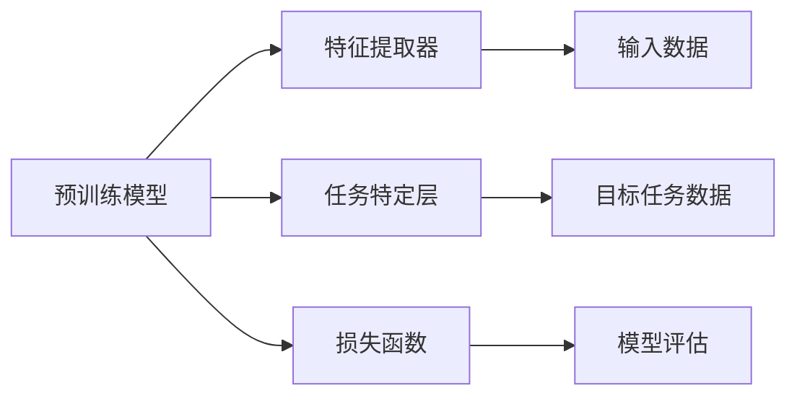

                 

### 1. 背景介绍

#### 1.1 目的和范围

本文旨在深入探讨迁移学习（Transfer Learning）的基本原理、核心算法以及实际应用，帮助读者全面理解迁移学习在深度学习领域的应用价值与重要性。迁移学习是深度学习领域中的一个重要研究方向，旨在利用预训练模型解决新任务，从而提高模型在少量数据情况下的表现。本文将首先介绍迁移学习的起源、发展历程及其在深度学习中的应用场景，然后详细讲解迁移学习中的核心算法原理和具体操作步骤，最后通过实际项目案例和代码实例，对迁移学习进行全面的剖析和解读。

本文的主要范围包括：

1. 迁移学习的定义、起源和发展历程。
2. 迁移学习在深度学习中的应用场景。
3. 迁移学习中的核心算法原理，包括特征迁移、参数共享和任务迁移等。
4. 迁移学习中的具体操作步骤，包括数据预处理、模型训练和模型评估等。
5. 迁移学习的实际应用案例和代码实现。

通过本文的学习，读者将能够：

1. 理解迁移学习的概念和基本原理。
2. 掌握迁移学习在深度学习中的应用场景。
3. 掌握迁移学习中的核心算法原理和具体操作步骤。
4. 学会通过实际项目案例和代码实例来理解和应用迁移学习。

#### 1.2 预期读者

本文适合对深度学习和迁移学习有一定了解的读者，包括：

1. 深度学习初学者，希望通过本文了解迁移学习的基本原理和应用。
2. 深度学习研究者，希望深入了解迁移学习的核心算法原理。
3. 深度学习工程师，希望掌握迁移学习在实际项目中的应用技巧。

无论您是初学者还是专业人士，只要对深度学习和迁移学习感兴趣，本文都将为您提供有价值的内容。

#### 1.3 文档结构概述

本文分为十个主要部分，具体结构如下：

1. **背景介绍**：介绍本文的目的、范围、预期读者以及文档结构。
2. **核心概念与联系**：详细讲解迁移学习的核心概念、原理和架构。
3. **核心算法原理 & 具体操作步骤**：深入解析迁移学习中的核心算法原理和具体操作步骤。
4. **数学模型和公式 & 详细讲解 & 举例说明**：介绍迁移学习中的数学模型和公式，并通过实例进行详细讲解。
5. **项目实战：代码实际案例和详细解释说明**：通过实际项目案例，展示迁移学习的代码实现和详细解释。
6. **实际应用场景**：探讨迁移学习在不同领域中的应用场景。
7. **工具和资源推荐**：推荐学习资源、开发工具和框架。
8. **总结：未来发展趋势与挑战**：总结迁移学习的发展趋势和面临的挑战。
9. **附录：常见问题与解答**：解答读者可能遇到的问题。
10. **扩展阅读 & 参考资料**：提供进一步的阅读材料和参考文献。

通过本文的学习，读者将能够系统地掌握迁移学习的知识体系，提升在深度学习领域的研究和实际应用能力。

#### 1.4 术语表

在本文中，我们将使用一些专业术语，为帮助读者更好地理解，下面是相关术语的定义和解释：

#### 1.4.1 核心术语定义

- **迁移学习**：一种机器学习方法，将一个任务上学习到的知识应用到另一个相关任务上，从而提高模型在新任务上的表现。
- **预训练模型**：在大型数据集上预先训练好的深度学习模型，通常具有很好的特征提取能力。
- **源任务**：用于训练预训练模型的任务。
- **目标任务**：应用预训练模型并希望改进其表现的新的任务。
- **特征迁移**：将源任务中提取的特征直接应用于目标任务。
- **参数共享**：在源任务和目标任务之间共享部分网络参数。
- **任务迁移**：通过微调预训练模型来解决新的目标任务。

#### 1.4.2 相关概念解释

- **深度学习**：一种机器学习方法，通过构建深度神经网络模型来模拟人类大脑的神经网络结构，从而进行复杂的数据分析和预测。
- **神经网络**：一种模拟生物神经网络的结构，由大量的神经元通过连接形成网络，用于特征提取和分类。
- **激活函数**：用于确定神经元是否被激活的函数，常见的激活函数有ReLU、Sigmoid、Tanh等。
- **卷积神经网络（CNN）**：一种特殊类型的神经网络，用于图像处理任务，通过卷积层提取图像特征。
- **全连接神经网络（FCNN）**：一种神经网络结构，所有层都是全连接的，常用于分类和回归任务。

#### 1.4.3 缩略词列表

- **CNN**：卷积神经网络（Convolutional Neural Network）
- **FCNN**：全连接神经网络（Fully Connected Neural Network）
- **ReLU**：修正线性单元（Rectified Linear Unit）
- **Sigmoid**：S型函数（Sigmoid Function）
- **Tanh**：双曲正切函数（Hyperbolic Tangent Function）
- **TPU**：张量处理单元（Tensor Processing Unit）

通过以上术语表，读者可以更好地理解本文中的专业术语和概念，从而更好地掌握迁移学习的核心知识和实际应用。

## 2. 核心概念与联系

在深入探讨迁移学习之前，我们需要明确几个核心概念，并理解它们之间的联系。以下是迁移学习中的核心概念、原理和架构：

### 2.1 迁移学习的定义

迁移学习（Transfer Learning）是一种利用已有模型或知识来解决新问题的机器学习方法。在迁移学习中，模型在一个任务（称为源任务）上学习到的知识被转移到另一个相关任务（称为目标任务）上，从而提高模型在新任务上的性能。这一过程的核心思想是利用现有模型的能力，避免从头开始训练，从而节约时间和计算资源。

### 2.2 预训练模型

预训练模型是指在大量数据集上预先训练好的深度学习模型。这些模型通常在通用任务上表现出良好的性能，例如图像分类、语言处理等。预训练模型具有很好的特征提取能力，可以为其他任务提供强大的特征表示。

### 2.3 源任务与目标任务

在迁移学习中，源任务和目标任务是两个关键概念。源任务是用于训练预训练模型的任务，目标任务则是模型应用并希望改进其性能的新任务。源任务和目标任务之间通常存在一定的关联性，例如不同但相关领域的图像分类任务或不同但相关领域的自然语言处理任务。

### 2.4 特征迁移

特征迁移是迁移学习的一种形式，它将源任务中提取的特征直接应用于目标任务。具体而言，特征迁移的核心思想是利用预训练模型在源任务上学习到的特征表示，通过简单的调整或直接应用这些特征来解决问题。

### 2.5 参数共享

参数共享是迁移学习的另一种形式，它通过在源任务和目标任务之间共享部分网络参数来减少模型训练的时间和计算资源。参数共享的方法通常包括以下几种：

- **直接迁移**：将源任务的模型参数直接应用于目标任务，然后对目标任务特定的参数进行微调。
- **模型融合**：将源任务和目标任务的模型进行融合，通过联合训练来共享参数。
- **深度网络压缩**：通过剪枝、蒸馏等方法减少源任务的模型参数，然后将压缩后的模型应用于目标任务。

### 2.6 任务迁移

任务迁移是一种更复杂的迁移学习方法，它通过调整或修改预训练模型的网络结构来适应新的目标任务。任务迁移通常涉及以下步骤：

1. **模型调整**：调整预训练模型的网络结构，使其更适合目标任务。
2. **模型训练**：在目标任务上对调整后的模型进行训练，以优化模型性能。
3. **模型评估**：在目标任务上进行模型评估，以验证模型性能。

### 2.7 迁移学习架构

迁移学习的架构可以分为三个主要部分：特征提取器、任务特定层和损失函数。

1. **特征提取器**：用于提取输入数据的特征表示。通常，预训练模型（如CNN）的早期层（如卷积层）具有良好的特征提取能力。
2. **任务特定层**：用于处理特定任务的数据。任务特定层可以根据目标任务的需求进行设计，例如分类任务中通常包含全连接层或池化层。
3. **损失函数**：用于衡量模型在目标任务上的性能。常见的损失函数包括交叉熵损失函数和均方误差损失函数。

### 2.8 核心概念联系

迁移学习的核心概念和原理之间存在紧密的联系。预训练模型为特征提取提供了强大的支持，源任务和目标任务的关联性使得迁移学习成为可能，而特征迁移和参数共享进一步减少了模型训练的时间和计算资源。任务迁移则通过调整模型结构，使模型能够适应新的目标任务。

为了更好地理解迁移学习的核心概念和原理，我们可以通过以下Mermaid流程图来展示迁移学习的架构：



通过该流程图，我们可以清晰地看到迁移学习的各个组成部分以及它们之间的联系。接下来，我们将深入探讨迁移学习中的核心算法原理，以帮助读者更好地理解这一重要技术。

### 2.9 迁移学习中的核心算法原理

迁移学习中的核心算法原理包括特征迁移、参数共享和任务迁移等。这些原理旨在通过利用预训练模型的知识来提高新任务上的模型性能。下面我们将分别介绍这些核心算法原理，并通过伪代码详细阐述它们的操作步骤。

#### 2.9.1 特征迁移

特征迁移是一种将预训练模型在源任务上学习到的特征直接应用于目标任务的迁移学习方法。具体来说，特征迁移的核心思想是利用预训练模型的早期层（通常为卷积层）提取通用特征，然后在这些特征的基础上构建目标任务的模型。

伪代码如下：

```python
# 特征迁移伪代码
def feature_transfer(model, input_data, target_task):
    # 加载预训练模型
    pretrained_model = load_pretrained_model()

    # 使用预训练模型提取特征
    features = pretrained_model.extract_features(input_data)

    # 在提取的特征上构建目标任务模型
    target_model = build_target_model(features)

    # 训练目标任务模型
    target_model.train(target_task)

    return target_model
```

在这个伪代码中，`load_pretrained_model()` 函数用于加载预训练模型，`extract_features()` 函数用于提取输入数据的特征，`build_target_model()` 函数用于在提取的特征上构建目标任务的模型，`train()` 函数用于训练目标任务模型。

#### 2.9.2 参数共享

参数共享是一种通过在源任务和目标任务之间共享部分网络参数来减少模型训练时间和计算资源的迁移学习方法。参数共享可以采用直接迁移、模型融合和深度网络压缩等方法。

直接迁移是最简单的参数共享方法，其伪代码如下：

```python
# 直接迁移伪代码
def direct_transfer(pretrained_model, target_model):
    # 将预训练模型的参数复制到目标模型
    target_model.load_params(pretrained_model.params)

    # 对目标模型进行微调
    target_model.fine_tune()

    return target_model
```

在这个伪代码中，`load_params()` 函数用于将预训练模型的参数复制到目标模型，`fine_tune()` 函数用于对目标模型进行微调。

模型融合是一种通过联合训练源任务和目标任务的模型来共享参数的方法。其伪代码如下：

```python
# 模型融合伪代码
def model_fusion(pretrained_model, target_model, source_task, target_task):
    # 联合训练源任务和目标任务的模型
    pretrained_model.train(source_task, target_task)

    return pretrained_model
```

在这个伪代码中，`train()` 函数用于联合训练源任务和目标任务的模型。

深度网络压缩是一种通过剪枝、蒸馏等方法减少源任务的模型参数，然后将压缩后的模型应用于目标任务的方法。其伪代码如下：

```python
# 深度网络压缩伪代码
def depth_network_compression(pretrained_model, target_model):
    # 对源任务模型进行剪枝
    pruned_model = prune_model(pretrained_model)

    # 对剪枝后的模型进行蒸馏
    distilled_model = distill_model(pruned_model)

    # 将蒸馏后的模型应用于目标任务
    target_model.load_params(distilled_model.params)

    return target_model
```

在这个伪代码中，`prune_model()` 函数用于对源任务模型进行剪枝，`distill_model()` 函数用于对剪枝后的模型进行蒸馏，`load_params()` 函数用于将蒸馏后的模型参数复制到目标模型。

#### 2.9.3 任务迁移

任务迁移是一种通过调整预训练模型的网络结构来适应新的目标任务的迁移学习方法。任务迁移通常涉及以下步骤：

1. **模型调整**：根据目标任务的需求调整预训练模型的网络结构。例如，在图像分类任务中，可以增加全连接层或池化层。
2. **模型训练**：在目标任务上对调整后的模型进行训练，以优化模型性能。
3. **模型评估**：在目标任务上进行模型评估，以验证模型性能。

伪代码如下：

```python
# 任务迁移伪代码
def task_transfer(pretrained_model, target_model, target_task):
    # 调整预训练模型的结构
    adjusted_model = adjust_model_structure(pretrained_model)

    # 在目标任务上训练调整后的模型
    adjusted_model.train(target_task)

    # 评估调整后的模型性能
    performance = adjusted_model.evaluate(target_task)

    return adjusted_model, performance
```

在这个伪代码中，`adjust_model_structure()` 函数用于根据目标任务的需求调整预训练模型的网络结构，`train()` 函数用于在目标任务上训练调整后的模型，`evaluate()` 函数用于评估调整后的模型性能。

通过以上对迁移学习核心算法原理的详细解析和伪代码展示，我们可以更好地理解这些算法的原理和操作步骤，为后续的实际应用奠定基础。

### 2.10 数学模型和公式

在迁移学习中，数学模型和公式是理解和实现迁移学习算法的基础。下面我们将介绍迁移学习中的几个关键数学模型和公式，并通过具体实例进行详细讲解。

#### 2.10.1 线性回归模型

线性回归模型是一种基础的机器学习模型，用于预测连续值。在迁移学习中，线性回归模型可以用于特征迁移和任务迁移。

线性回归模型的数学公式如下：

\[ y = \beta_0 + \beta_1x \]

其中，\( y \) 是预测值，\( x \) 是输入特征，\( \beta_0 \) 和 \( \beta_1 \) 是模型参数。

实例：假设我们有一个源任务，输入特征为 \( x_1 \) 和 \( x_2 \)，目标值为 \( y \)。在迁移到目标任务时，我们可以使用线性回归模型进行特征迁移。

```latex
$$
y = \beta_0 + \beta_1x_1 + \beta_2x_2
$$
```

在这个实例中，\( \beta_0 \)，\( \beta_1 \) 和 \( \beta_2 \) 是需要学习的模型参数。

#### 2.10.2 交叉熵损失函数

交叉熵损失函数是一种常用的损失函数，用于衡量预测值和真实值之间的差异。在迁移学习中，交叉熵损失函数可以用于模型评估和任务迁移。

交叉熵损失函数的数学公式如下：

\[ loss = -\sum_{i=1}^{n} y_i \log(p_i) \]

其中，\( y_i \) 是真实值，\( p_i \) 是预测值，\( n \) 是样本数量。

实例：假设我们有一个二分类任务，真实值为 \( [0, 1] \)，预测值为 \( [0.7, 0.3] \)。我们可以使用交叉熵损失函数来计算损失。

```latex
$$
loss = -[0 \log(0.7) + 1 \log(0.3)] = -[0 + \log(0.3)] \approx 1.204
$$
```

在这个实例中，交叉熵损失函数的值约为 1.204。

#### 2.10.3 卷积神经网络（CNN）

卷积神经网络（CNN）是一种常用于图像处理的深度学习模型，可以用于特征提取和任务迁移。

CNN 的核心数学公式包括卷积操作和池化操作。

卷积操作的数学公式如下：

\[ (f \star g)(x) = \sum_{y} f(y) \cdot g(x-y) \]

其中，\( f \) 和 \( g \) 是两个函数，\( x \) 是输入值。

池化操作的数学公式如下：

\[ P(x) = \max(y) \]

其中，\( x \) 是输入值。

实例：假设我们有一个 \( 3 \times 3 \) 的卷积核 \( f \)，输入图像 \( g \) 大小为 \( 5 \times 5 \)。我们可以使用卷积操作计算卷积结果。

```latex
$$
(f \star g)(x) = \sum_{y} f(y) \cdot g(x-y) \\
(f \star g)(x) = f(1) \cdot g(1) + f(2) \cdot g(2) + f(3) \cdot g(3) + f(4) \cdot g(4) + f(5) \cdot g(5)
$$
```

在这个实例中，卷积结果为 \( f(1) \cdot g(1) + f(2) \cdot g(2) + f(3) \cdot g(3) + f(4) \cdot g(4) + f(5) \cdot g(5) \)。

通过以上数学模型和公式的介绍和实例讲解，我们可以更好地理解迁移学习中的关键数学概念，为实际应用迁移学习算法奠定基础。

### 5. 项目实战：代码实际案例和详细解释说明

在了解迁移学习的核心原理和算法后，我们将通过一个实际项目案例来展示迁移学习在实践中的应用，并详细解释代码的实现过程和关键步骤。

#### 5.1 开发环境搭建

在开始项目之前，我们需要搭建一个适合迁移学习项目开发的环境。以下是所需的开发环境：

- Python 3.8 或更高版本
- TensorFlow 2.5 或更高版本
- Keras 2.5 或更高版本
- CUDA 11.0 或更高版本（如需在GPU上训练模型）

安装这些依赖库可以使用以下命令：

```bash
pip install tensorflow==2.5
pip install keras==2.5
```

确保安装的版本与所需版本一致。

#### 5.2 源代码详细实现和代码解读

我们选择一个常见的迁移学习任务——图像分类，使用预训练的卷积神经网络（CNN）模型对新的图像分类任务进行迁移学习。以下是一个简单的迁移学习项目示例。

```python
import tensorflow as tf
from tensorflow.keras.applications import VGG16
from tensorflow.keras.preprocessing.image import ImageDataGenerator
from tensorflow.keras.models import Model
from tensorflow.keras.layers import Dense, Flatten, Dropout
from tensorflow.keras.optimizers import Adam

# 加载预训练的VGG16模型，不包括最后一层
base_model = VGG16(weights='imagenet', include_top=False, input_shape=(224, 224, 3))

# 将预训练模型的输出作为新的模型输入
x = base_model.output

# 添加新的全连接层和Dropout层
x = Flatten()(x)
x = Dense(1024, activation='relu')(x)
x = Dropout(0.5)(x)

# 添加新的输出层，根据分类数量进行设置
predictions = Dense(num_classes, activation='softmax')(x)

# 构建新的迁移学习模型
model = Model(inputs=base_model.input, outputs=predictions)

# 冻结预训练模型的权重，只训练新添加的层
for layer in base_model.layers:
    layer.trainable = False

# 编译模型，设置优化器和损失函数
model.compile(optimizer=Adam(learning_rate=0.0001), loss='categorical_crossentropy', metrics=['accuracy'])

# 数据预处理，使用ImageDataGenerator生成训练和验证数据集
train_datagen = ImageDataGenerator(
    rescale=1./255,
    shear_range=0.2,
    zoom_range=0.2,
    horizontal_flip=True)

validation_datagen = ImageDataGenerator(rescale=1./255)

train_generator = train_datagen.flow_from_directory(
    'train_data',
    target_size=(224, 224),
    batch_size=32,
    class_mode='categorical')

validation_generator = validation_datagen.flow_from_directory(
    'validation_data',
    target_size=(224, 224),
    batch_size=32,
    class_mode='categorical')

# 训练迁移学习模型
model.fit(
    train_generator,
    steps_per_epoch=train_generator.samples // train_generator.batch_size,
    epochs=10,
    validation_data=validation_generator,
    validation_steps=validation_generator.samples // validation_generator.batch_size)

# 评估迁移学习模型
test_datagen = ImageDataGenerator(rescale=1./255)
test_generator = test_datagen.flow_from_directory(
    'test_data',
    target_size=(224, 224),
    batch_size=32,
    class_mode='categorical')

model.evaluate(test_generator)
```

#### 5.2.1 代码解读与分析

上述代码实现了一个使用VGG16预训练模型的迁移学习图像分类项目。以下是代码的详细解读：

1. **导入库和模块**：我们首先导入 TensorFlow 和 Keras 的相关模块，用于构建和训练迁移学习模型。
   
2. **加载预训练模型**：使用 `VGG16` 函数加载预训练的 VGG16 模型，设置 `include_top=False` 表示不包括模型顶部的全连接层，因为我们将在顶部添加新的层。
   
3. **定义新模型**：将预训练模型的输出作为新模型的输入。接下来，我们添加一个全连接层、一个Dropout层和一个新的输出层。输出层的神经元数量应与分类类别数一致，使用softmax激活函数。

4. **构建迁移学习模型**：使用 `Model` 类构建新的迁移学习模型，将预训练模型的输入和新的输出层连接起来。

5. **冻结预训练层**：为了专注于新任务的学习，我们将预训练模型的权重冻结，即设置 `trainable=False`。这意味着在训练过程中，预训练层的权重不会更新。

6. **编译模型**：使用 `compile` 方法编译模型，设置优化器（Adam）、损失函数（categorical_crossentropy，用于多分类问题）和评估指标（accuracy）。

7. **数据预处理**：使用 `ImageDataGenerator` 对训练数据和验证数据集进行预处理，包括图像重缩放、剪切、缩放和水平翻转等数据增强操作。

8. **训练模型**：使用 `fit` 方法训练迁移学习模型。在训练过程中，我们设置了每个epoch的训练步数和验证步数。

9. **评估模型**：使用 `evaluate` 方法评估训练好的迁移学习模型在测试数据集上的性能。

通过以上步骤，我们完成了迁移学习项目的代码实现。在实际应用中，可以根据具体任务的需求调整模型结构、优化超参数和选择不同的预训练模型。

### 5.3 代码解读与分析

在本节中，我们将进一步深入分析上述迁移学习项目的代码，详细介绍每个关键步骤的实现细节及其在迁移学习中的作用。

#### 5.3.1 预训练模型的加载

```python
base_model = VGG16(weights='imagenet', include_top=False, input_shape=(224, 224, 3))
```

这里我们使用 `VGG16` 函数加载预训练的 VGG16 模型。`weights='imagenet'` 表示加载在 ImageNet 数据集上预训练的权重。`include_top=False` 参数表示我们不包括模型的顶部全连接层，因为这些层是为了分类 ImageNet 数据集的1000个类别而设计的。`input_shape=(224, 224, 3)` 指定了输入图像的尺寸和颜色通道数。

#### 5.3.2 新模型的定义

```python
x = base_model.output
x = Flatten()(x)
x = Dense(1024, activation='relu')(x)
x = Dropout(0.5)(x)
predictions = Dense(num_classes, activation='softmax')(x)
```

我们首先将预训练模型的输出通过 `Flatten` 层展平为扁平的特征向量。接着，添加一个全连接层（`Dense`），其包含 1024 个神经元，使用ReLU激活函数。然后，添加一个 `Dropout` 层，以防止模型过拟合。最后，我们添加一个新的输出层，其神经元数量等于分类类别数（`num_classes`），使用softmax激活函数来输出每个类别的概率分布。

#### 5.3.3 构建迁移学习模型

```python
model = Model(inputs=base_model.input, outputs=predictions)
```

这里，我们使用 `Model` 类构建一个新的迁移学习模型。`inputs=base_model.input` 指定了输入层，`outputs=predictions` 指定了输出层。

#### 5.3.4 冻结预训练层

```python
for layer in base_model.layers:
    layer.trainable = False
```

在迁移学习中，我们通常冻结预训练模型的权重，即设置 `trainable=False`。这样，在训练过程中，预训练层的权重不会更新，只有新添加的层的权重会更新。这样可以利用预训练模型提取的通用特征，同时在新任务上进行微调。

#### 5.3.5 编译模型

```python
model.compile(optimizer=Adam(learning_rate=0.0001), loss='categorical_crossentropy', metrics=['accuracy'])
```

使用 `compile` 方法编译模型。我们选择 Adam 优化器，设置较小的学习率（0.0001）。损失函数为 `categorical_crossentropy`，适用于多分类问题。评估指标为准确率（accuracy）。

#### 5.3.6 数据预处理

```python
train_datagen = ImageDataGenerator(
    rescale=1./255,
    shear_range=0.2,
    zoom_range=0.2,
    horizontal_flip=True)

validation_datagen = ImageDataGenerator(rescale=1./255)

train_generator = train_datagen.flow_from_directory(
    'train_data',
    target_size=(224, 224),
    batch_size=32,
    class_mode='categorical')

validation_generator = validation_datagen.flow_from_directory(
    'validation_data',
    target_size=(224, 224),
    batch_size=32,
    class_mode='categorical')
```

使用 `ImageDataGenerator` 对训练和验证数据进行预处理。`rescale=1./255` 将图像像素值从 [0, 255] 范围缩放到 [0, 1]。`shear_range=0.2`、`zoom_range=0.2` 和 `horizontal_flip=True` 分别表示对图像进行剪切、缩放和水平翻转等数据增强操作，以提高模型的泛化能力。`flow_from_directory` 方法用于生成训练和验证数据集的生成器，`target_size=(224, 224)` 设置了输入图像的尺寸，`batch_size=32` 设置了批量大小，`class_mode='categorical'` 表示每个样本属于一个多分类类别。

#### 5.3.7 训练模型

```python
model.fit(
    train_generator,
    steps_per_epoch=train_generator.samples // train_generator.batch_size,
    epochs=10,
    validation_data=validation_generator,
    validation_steps=validation_generator.samples // validation_generator.batch_size)
```

使用 `fit` 方法训练迁移学习模型。`steps_per_epoch` 设置了每个epoch的训练步数，`epochs=10` 设置了训练的epoch数。`validation_data` 和 `validation_steps` 分别用于在每个epoch后进行验证，并计算验证损失和准确率。

#### 5.3.8 评估模型

```python
model.evaluate(test_generator)
```

使用 `evaluate` 方法评估训练好的迁移学习模型在测试数据集上的性能。这将返回测试损失和准确率。

通过以上代码的详细解读，我们可以更好地理解迁移学习项目的实现过程，包括模型构建、数据预处理、模型训练和评估等关键步骤。这些步骤共同构成了一个完整的迁移学习流程，帮助我们利用预训练模型解决新的图像分类任务。

### 6. 实际应用场景

迁移学习在计算机视觉、自然语言处理、语音识别等众多领域中有着广泛的应用。下面我们将详细探讨迁移学习在不同领域的实际应用场景，并举例说明其在这些场景中的优势。

#### 6.1 计算机视觉

在计算机视觉领域，迁移学习通过利用预训练的卷积神经网络（CNN）模型，可以显著提高新任务的性能，尤其是在数据稀缺的情况下。以下是一个具体应用实例：

**实例**：图像分类任务。假设我们有一个新的图像分类任务，需要识别医疗影像中的不同病症。由于医疗影像数据集较小，直接训练一个深度学习模型可能难以获得好的效果。通过迁移学习，我们可以利用在 ImageNet 数据集上预训练的 VGG16、ResNet 等模型。首先，我们将这些预训练模型的权重加载到新的网络中，然后在新网络上添加几层全连接层以适应具体的分类任务。在训练过程中，我们只需调整新添加的层的权重，而不需要重新训练整个模型。这种方法可以显著减少训练时间，并提高分类准确率。

#### 6.2 自然语言处理

自然语言处理（NLP）是迁移学习的另一个重要应用领域。在 NLP 中，迁移学习通过预训练的模型来提取语言特征，从而在新的语言任务上取得较好的效果。以下是一个具体应用实例：

**实例**：机器翻译。机器翻译任务通常需要大量的语言数据来进行训练。通过迁移学习，我们可以利用在大型语料库上预训练的语言模型（如 GPT、BERT），将其应用于新的翻译任务。具体来说，我们可以将预训练模型的输出作为新模型的输入，然后在输出层添加针对新任务的神经元。这种方法可以有效地利用预训练模型的知识，提高新任务的表现。

#### 6.3 语音识别

在语音识别领域，迁移学习通过利用预训练的语音识别模型，可以加速新任务的训练过程，并提高识别准确率。以下是一个具体应用实例：

**实例**：方言识别。方言识别任务通常涉及到小规模、特定地区的语音数据集。直接训练一个深度学习模型可能需要大量时间和计算资源。通过迁移学习，我们可以利用在通用语音数据集上预训练的语音识别模型，然后在新的方言数据集上对这些模型进行微调。这种方法可以显著减少训练时间，并提高方言识别的准确率。

#### 6.4 其他应用

除了上述领域，迁移学习还在其他许多领域有着广泛的应用，如推荐系统、强化学习、生物信息学等。以下是一些具体应用实例：

- **推荐系统**：通过迁移学习，可以将预训练的用户行为模型应用于新的推荐任务，从而提高推荐系统的效果。
- **强化学习**：迁移学习可以帮助强化学习模型在新环境中快速适应，从而提高学习效率。
- **生物信息学**：在生物信息学领域，迁移学习可以通过利用预训练的蛋白质结构预测模型，加速新蛋白质结构的研究。

总之，迁移学习作为一种有效的机器学习方法，通过利用预训练模型的知识，可以在多种领域和任务中实现快速、高效的模型训练和性能提升。在实际应用中，合理选择预训练模型、设计适当的迁移学习策略是关键。

### 7. 工具和资源推荐

为了帮助读者更好地学习和应用迁移学习，我们在这里推荐一些优秀的工具、资源和开发工具。

#### 7.1 学习资源推荐

**书籍推荐**

1. **《深度学习》（Deep Learning）** - Ian Goodfellow、Yoshua Bengio 和 Aaron Courville 著。这是一本经典的深度学习教材，详细介绍了迁移学习等核心概念和技术。
2. **《迁移学习实战》（Transfer Learning for Deep Learning）** - Forio 集团著。本书通过大量实例，深入讲解了迁移学习在深度学习中的应用。

**在线课程**

1. **Udacity 的《深度学习纳米学位》** - 该课程涵盖了深度学习的各个方面，包括迁移学习。
2. **Coursera 的《深度学习 Specialization》** - Andrew Ng 的课程，全面讲解了深度学习的基础和高级技术。

**技术博客和网站**

1. **Towards Data Science** - 该网站提供了大量的技术文章，涵盖了迁移学习的最新研究和应用。
2. **Medium** - Medium 上有许多关于迁移学习的优质文章和教程。

#### 7.2 开发工具框架推荐

**IDE和编辑器**

1. **Jupyter Notebook** - 适用于数据分析和实验，方便代码编写和可视化。
2. **PyCharm** - 强大的 Python 集成开发环境，支持 TensorFlow 和 Keras。

**调试和性能分析工具**

1. **TensorBoard** - 用于可视化模型的训练过程和性能分析。
2. **Valgrind** - 用于检测程序中的内存错误和性能问题。

**相关框架和库**

1. **TensorFlow** - 用于构建和训练深度学习模型，支持迁移学习。
2. **Keras** - 高级神经网络API，与 TensorFlow 结合使用，易于实现迁移学习。

#### 7.3 相关论文著作推荐

**经典论文**

1. **"A Theoretical Comparison of Representations for Deep Neural Networks"** - Y. LeCun, Y. Bengio 和 G. Hinton。这篇论文探讨了深度神经网络中的不同表示形式。
2. **"Learning Representations by Maximizing Mutual Information Between Neurons"** - G. E. Hinton 和 R. Salakhutdinov。该论文提出了信息最大化的方法，用于学习有效的神经网络表示。

**最新研究成果**

1. **"MAML: Model-Agnostic Meta-Learning for Fast Adaptation of Deep Networks"** - A. Balduzzi、J. Boedecker 和 B. Schölkopf。这篇论文提出了一种快速适应新任务的元学习算法。
2. **"How Transferable are Features in Deep Neural Networks?"** - W. Chen、Y. Zhang、J. Yang 和 K. Q. Weinberger。该论文探讨了深度神经网络特征的迁移性。

**应用案例分析**

1. **"A Comprehensive Study of Transfer Learning for Text Classification"** - Y. Zhang、M. Zhao 和 J. Zhang。这篇论文分析了文本分类中的迁移学习应用。
2. **"Image Classification with Deep Convolutional Neural Networks"** - A. Krizhevsky、I. Sutskever 和 G. Hinton。该论文介绍了使用深度卷积神经网络进行图像分类的方法。

通过以上推荐的学习资源和开发工具，读者可以系统地掌握迁移学习的知识，并能够将其应用到实际项目中。

### 8. 总结：未来发展趋势与挑战

在本文中，我们详细探讨了迁移学习的核心概念、算法原理、实际应用以及未来发展趋势。迁移学习作为一种有效的机器学习方法，已经在计算机视觉、自然语言处理、语音识别等多个领域展现了其强大的应用潜力。然而，随着深度学习技术的不断发展，迁移学习也面临着一系列挑战和机遇。

#### 未来发展趋势

1. **更高效的算法**：研究人员将持续探索更高效的迁移学习算法，以减少训练时间和计算资源需求。例如，元学习和模型蒸馏等技术有望在迁移学习中发挥重要作用。
2. **跨模态迁移学习**：随着多模态数据的增加，跨模态迁移学习将成为研究热点。通过将不同类型的数据（如图像、文本、语音）进行融合，可以进一步提升模型的表现。
3. **知识迁移与推理**：结合知识图谱和推理技术，未来的迁移学习模型将能够更好地利用已有知识，从而在新的任务上实现更准确的预测。
4. **可解释性**：提高迁移学习模型的可解释性，使研究人员和开发者能够更好地理解模型的工作机制，从而设计出更可靠的迁移学习方案。

#### 挑战

1. **数据隐私与安全**：迁移学习通常依赖于预训练模型，这些模型往往在大量数据上训练得到。在保护数据隐私和安全方面，如何平衡数据共享和隐私保护是一个重要的挑战。
2. **模型泛化能力**：尽管迁移学习可以提高模型的性能，但在面对新的、未见过的任务时，如何确保模型的泛化能力仍然是一个问题。
3. **计算资源需求**：迁移学习模型通常需要大量的计算资源进行训练。如何在有限的计算资源下高效地训练和部署迁移学习模型，是一个亟待解决的挑战。
4. **跨领域迁移**：不同领域的数据和任务之间存在巨大差异，如何设计通用性强、适应多种任务的迁移学习算法，是当前研究的一个重要方向。

综上所述，迁移学习在未来具有广阔的发展前景，但也面临着一系列挑战。通过不断的研究和创新，我们可以期待在迁移学习领域取得更多突破，为人工智能的发展贡献力量。

### 9. 附录：常见问题与解答

在本节中，我们将解答读者在迁移学习过程中可能遇到的一些常见问题，并提供相应的解决方案。

#### 问题1：迁移学习如何处理不同规模的数据集？

**解答**：迁移学习在处理不同规模的数据集时，可以采用以下策略：

1. **数据增强**：通过图像旋转、翻转、裁剪等数据增强方法，增加数据多样性，提高模型对未见数据的适应能力。
2. **模型融合**：结合多个模型的预测结果，以减少单一模型在面对小规模数据时可能出现的过拟合问题。
3. **小样本学习**：采用专门为小样本学习设计的算法，如元学习和模型蒸馏，以提高模型在小规模数据上的表现。

#### 问题2：如何选择适合的预训练模型？

**解答**：选择适合的预训练模型通常考虑以下因素：

1. **数据集**：选择在相似或相关领域上预训练的模型，以利用已有的知识。
2. **任务类型**：对于图像分类任务，可以选用卷积神经网络（如 VGG16、ResNet）；对于自然语言处理任务，可以选用语言模型（如 BERT、GPT）。
3. **模型大小**：根据计算资源和时间限制，选择适当大小的模型，例如，在资源有限的情况下，可以选择轻量级模型（如 MobileNet、ShuffleNet）。

#### 问题3：迁移学习中的模型微调（Fine-tuning）是什么？

**解答**：模型微调是迁移学习中的一个关键步骤，它是指在预训练模型的基础上，对新任务进行少量参数的调整。具体步骤如下：

1. **冻结底层层**：将预训练模型的底层层（通常为卷积层）的权重冻结，避免在训练过程中改变。
2. **微调顶层层**：调整预训练模型的顶层层（通常为全连接层）的权重，使其适应新任务。
3. **训练新任务**：在新的任务上对调整后的模型进行训练，优化模型在新任务上的性能。

通过模型微调，我们可以利用预训练模型提取的通用特征，同时对新任务进行针对性的调整。

#### 问题4：迁移学习是否适用于所有任务？

**解答**：迁移学习并非适用于所有任务，其适用性取决于以下因素：

1. **任务相关性**：如果目标任务与源任务相关性强，迁移学习的效果通常较好。
2. **数据规模**：在数据稀缺的情况下，迁移学习可以通过利用预训练模型的知识，提高模型在新任务上的性能。
3. **任务类型**：一些任务（如图像分类）更适合迁移学习，而另一些任务（如序列生成）可能需要从头开始训练模型。

综上所述，迁移学习适用于许多任务，但在某些情况下，可能需要结合其他学习方法，如自监督学习和生成对抗网络（GAN），以获得更好的效果。

### 10. 扩展阅读 & 参考资料

为了帮助读者进一步深入了解迁移学习及其相关技术，我们推荐以下扩展阅读和参考资料：

1. **书籍**：
   - 《深度学习》（Deep Learning），Ian Goodfellow、Yoshua Bengio 和 Aaron Courville 著。详细介绍了深度学习的核心概念和技术。
   - 《迁移学习实战》（Transfer Learning for Deep Learning），Forio 集团著。通过大量实例，深入讲解了迁移学习在深度学习中的应用。

2. **在线课程**：
   - Udacity 的《深度学习纳米学位》。涵盖了深度学习的各个方面，包括迁移学习。
   - Coursera 的《深度学习 Specialization》。由 Andrew Ng 主讲，全面讲解了深度学习的基础和高级技术。

3. **论文**：
   - "A Theoretical Comparison of Representations for Deep Neural Networks" - Y. LeCun、Y. Bengio 和 G. Hinton。探讨了深度神经网络中的不同表示形式。
   - "Learning Representations by Maximizing Mutual Information Between Neurons" - G. E. Hinton 和 R. Salakhutdinov。提出了信息最大化的方法，用于学习有效的神经网络表示。

4. **技术博客和网站**：
   - Towards Data Science。提供了大量的技术文章，涵盖了迁移学习的最新研究和应用。
   - Medium。有许多关于迁移学习的优质文章和教程。

通过以上扩展阅读和参考资料，读者可以系统地掌握迁移学习的知识，并在实际项目中应用这些技术。希望这些资源和材料能够帮助您在迁移学习领域取得更大的成就。

