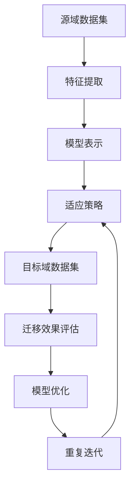

                 

### 1. 背景介绍

#### 1.1 目的和范围

本文旨在深入探讨迁移学习在跨域图像识别中的应用。随着人工智能技术的飞速发展，迁移学习已成为一种重要的研究方法，它能够有效地利用在不同任务中训练得到的模型知识，从而提高新任务的性能。跨域图像识别是一个极具挑战性的领域，因为它要求模型能够在不同数据分布和任务目标之间进行有效的知识迁移。

本文将围绕以下几个核心问题展开讨论：

1. **迁移学习的概念与原理**：我们将首先介绍迁移学习的定义，并分析其在图像识别任务中的重要性。
2. **核心算法原理**：本文将详细讲解迁移学习的核心算法，包括模型表示、特征提取和适应策略等。
3. **数学模型与公式**：我们将通过具体的数学模型和公式，阐述迁移学习中的关键概念和计算过程。
4. **项目实战**：为了更好地理解迁移学习的应用，我们将通过一个实际项目，展示如何使用迁移学习技术来提升图像识别的准确性。
5. **实际应用场景**：本文还将探讨迁移学习在跨域图像识别中的各种应用场景，并分析其优势和挑战。

通过本文的讨论，读者将能够系统地了解迁移学习在跨域图像识别中的基本概念、算法原理、数学模型以及实际应用，为今后的研究与实践提供有价值的参考。

#### 1.2 预期读者

本文的目标读者主要包括以下几类：

1. **人工智能与机器学习研究人员**：这些读者对迁移学习和图像识别有较深入的了解，希望通过本文进一步掌握迁移学习在跨域图像识别中的应用。
2. **计算机视觉工程师**：他们通常负责开发和优化图像识别系统，对迁移学习有实际需求，希望通过本文了解如何有效利用迁移学习来提升模型性能。
3. **研究生与本科生**：这些读者正在学习人工智能和机器学习相关知识，希望通过本文加深对迁移学习的理解，为后续的研究和课程设计提供帮助。
4. **技术爱好者**：对人工智能和计算机视觉感兴趣的技术爱好者，希望通过本文了解迁移学习的基本概念和应用。

无论您属于哪一类读者，只要对迁移学习和跨域图像识别有兴趣，都能从本文中获得有价值的知识。

#### 1.3 文档结构概述

为了使读者能够更系统地掌握本文的内容，下面将简要概述本文的结构：

1. **背景介绍**：本文首先介绍了迁移学习在跨域图像识别中的应用背景，明确了本文的研究目的和核心问题。
2. **核心概念与联系**：在这一部分，我们将通过一个详细的Mermaid流程图，展示迁移学习在跨域图像识别中的核心概念和原理。
3. **核心算法原理与具体操作步骤**：本文将详细讲解迁移学习的核心算法，包括模型表示、特征提取和适应策略，并通过伪代码阐述具体的操作步骤。
4. **数学模型和公式与详细讲解**：我们将通过具体的数学模型和公式，深入探讨迁移学习中的关键概念和计算过程，并给出实例说明。
5. **项目实战**：本文将通过一个实际项目，展示如何应用迁移学习技术提升图像识别的准确性，并提供代码实现和详细解读。
6. **实际应用场景**：在这一部分，我们将分析迁移学习在跨域图像识别中的各种应用场景，并讨论其优势和挑战。
7. **工具和资源推荐**：本文将推荐一些学习资源、开发工具和经典论文，为读者提供进一步学习的参考。
8. **总结：未来发展趋势与挑战**：本文将总结迁移学习在跨域图像识别中的应用现状，并探讨其未来发展趋势和面临的挑战。
9. **附录：常见问题与解答**：为了帮助读者更好地理解本文内容，我们将提供一些常见问题的解答。
10. **扩展阅读与参考资料**：本文最后将列出一些扩展阅读和参考资料，供读者进一步深入研究和学习。

通过本文的系统讲解，读者将能够全面了解迁移学习在跨域图像识别中的应用，为其研究和实践提供有力支持。

#### 1.4 术语表

为了确保本文内容的清晰易懂，下面列出一些在本文中频繁出现的核心术语及其定义：

##### 1.4.1 核心术语定义

1. **迁移学习**：迁移学习是指将已在一个任务上训练得到的模型知识应用到另一个相关但不同的任务上，从而提高新任务的表现。
2. **源域**：源域是指用于训练迁移学习模型的原始数据集，它通常包含了丰富的信息，可以用于指导新任务。
3. **目标域**：目标域是指迁移学习模型需要解决的新的数据集，它的分布和任务目标可能与源域不同。
4. **模型表示**：模型表示是指模型对输入数据的编码方式，包括神经网络结构、参数设置等。
5. **特征提取**：特征提取是指从原始数据中提取出具有区分性的特征，以便模型能够进行有效的学习和分类。
6. **适应策略**：适应策略是指将源域模型知识迁移到目标域的具体方法，包括调整模型参数、优化网络结构等。

##### 1.4.2 相关概念解释

1. **预训练**：预训练是指在一个大规模数据集上对模型进行初步训练，使其获得一定的通用知识，然后再将模型应用于具体任务。
2. **泛化能力**：泛化能力是指模型在未见过的数据上表现良好的能力，是评估模型性能的重要指标。
3. **数据分布**：数据分布是指数据集中各个样本的分布情况，不同的数据分布会影响模型的学习效果。
4. **迁移效果**：迁移效果是指迁移学习模型在目标域上的性能提升程度，它是衡量迁移学习成功与否的关键指标。

##### 1.4.3 缩略词列表

- **CNN**：卷积神经网络（Convolutional Neural Networks）
- **DNN**：深度神经网络（Deep Neural Networks）
- **ML**：机器学习（Machine Learning）
- **RL**：强化学习（Reinforcement Learning）
- **GAN**：生成对抗网络（Generative Adversarial Networks）
- **SL**：同域学习（Same-Input Learning）
- **UDL**：统一数据学习（Unified Data Learning）

通过上述术语表的介绍，读者可以更好地理解本文中涉及的核心概念和术语，从而更加深入地掌握迁移学习在跨域图像识别中的应用。

#### 2. 核心概念与联系

在深入探讨迁移学习在跨域图像识别中的应用之前，我们首先需要明确一些核心概念及其相互关系。这些概念构成了迁移学习理论的基础，对于理解本文的主题至关重要。

##### 2.1 迁移学习的定义与作用

迁移学习是一种机器学习方法，它通过利用在不同任务上训练得到的模型知识，来提高新任务的性能。其核心思想是将源任务（Source Task）上的学习成果应用到目标任务（Target Task）上。具体来说，源任务通常是一个已经解决了的问题，而目标任务是一个类似但略有差异的问题。

在跨域图像识别中，迁移学习的作用尤为显著。由于不同任务之间的数据分布和任务目标可能存在较大差异，直接在目标域上训练模型可能无法获得理想的性能。而通过迁移学习，我们可以利用源域上的丰富知识，帮助模型在目标域上更好地学习和适应。

##### 2.2 源域与目标域的关系

迁移学习的关键在于如何处理源域与目标域之间的关系。源域（Source Domain）是指用于训练迁移学习模型的原始数据集，它通常包含了丰富的信息，可以帮助模型学习到通用的知识。目标域（Target Domain）是指迁移学习模型需要解决的新的数据集，它的分布和任务目标可能与源域不同。

源域与目标域之间的关系可以分为以下几种：

1. **相同任务、不同数据**：这种情况下，源域和目标域的任务目标相同，但数据集不同。例如，使用在不同城市拍摄的照片进行人脸识别。
2. **不同任务、相关特征**：这种情况下，源域和目标域的任务目标不同，但它们之间存在某些相关的特征。例如，使用人脸识别模型来解决姿态估计问题。
3. **相同任务、相似数据**：这种情况下，源域和目标域的任务目标相同，数据集也非常相似。例如，使用同一类别下的不同品牌手机进行图像分类。

##### 2.3 模型表示与特征提取

在迁移学习中，模型表示（Model Representation）和特征提取（Feature Extraction）是两个关键环节。

模型表示是指模型对输入数据的编码方式，包括神经网络结构、参数设置等。一个好的模型表示能够有效地提取输入数据的特征，从而提高模型的性能。在迁移学习中，通常使用预训练模型作为源域的模型表示，通过微调（Fine-Tuning）等方式将其应用到目标域上。

特征提取是指从原始数据中提取出具有区分性的特征，以便模型能够进行有效的学习和分类。在跨域图像识别中，特征提取过程尤为重要，因为它可以帮助模型在数据分布和任务目标不同的场景下，仍然能够提取到有用的信息。

##### 2.4 适应策略与迁移效果

适应策略（Adaptation Strategy）是指将源域模型知识迁移到目标域的具体方法，包括调整模型参数、优化网络结构等。适应策略的目标是使迁移学习模型能够在目标域上获得更好的性能。

迁移效果（Transfer Effect）是指迁移学习模型在目标域上的性能提升程度，它是衡量迁移学习成功与否的关键指标。影响迁移效果的因素包括源域与目标域之间的相似度、模型表示的通用性、特征提取的有效性等。

为了更好地理解迁移学习在跨域图像识别中的应用，下面我们将通过一个Mermaid流程图，展示其核心概念和流程：



在该流程图中，源域数据集经过特征提取和模型表示后，通过适应策略调整模型参数，然后应用于目标域数据集，最后评估迁移效果并进行模型优化。这一过程不断迭代，以获得更好的迁移效果。

通过上述核心概念和流程的介绍，我们可以更清晰地理解迁移学习在跨域图像识别中的应用，为后续的算法原理和数学模型讲解打下坚实基础。

### 2.1.1 迁移学习的核心算法原理

迁移学习的核心在于如何有效地利用源域模型知识，并将其应用到目标域上，以提高目标任务的性能。下面我们将详细介绍迁移学习的核心算法原理，包括模型表示、特征提取和适应策略。

##### 模型表示

模型表示是指模型对输入数据的编码方式，包括神经网络结构、参数设置等。在迁移学习中，常用的模型表示包括卷积神经网络（CNN）、深度神经网络（DNN）等。

卷积神经网络（CNN）是一种特别适用于图像识别任务的深度学习模型。它通过卷积层、池化层和全连接层等结构，逐层提取图像的层次特征，从而实现对图像的识别和分类。

伪代码描述如下：

```python
function ConvolutionalNeuralNetwork(input_shape):
    model = Sequential()
    model.add(Conv2D(filters=32, kernel_size=(3, 3), activation='relu', input_shape=input_shape))
    model.add(MaxPooling2D(pool_size=(2, 2)))
    model.add(Conv2D(filters=64, kernel_size=(3, 3), activation='relu'))
    model.add(MaxPooling2D(pool_size=(2, 2)))
    model.add(Flatten())
    model.add(Dense(units=128, activation='relu'))
    model.add(Dense(units=num_classes, activation='softmax'))
    return model
```

该伪代码展示了如何使用Keras构建一个简单的卷积神经网络，包括卷积层、池化层和全连接层。

##### 特征提取

特征提取是从原始数据中提取出具有区分性的特征的过程，它是迁移学习中的重要环节。特征提取的目的是为了减少数据维度，同时保留关键信息，从而提高模型的学习效率和性能。

在迁移学习中，特征提取通常通过预训练模型来实现。预训练模型在大规模数据集上进行了充分的训练，已经学习到了丰富的特征表示。通过将这些特征表示应用于目标域数据，可以有效地提高目标任务的性能。

伪代码描述如下：

```python
function FeatureExtraction(model, data):
    features = model.predict(data)
    return features
```

该伪代码展示了如何使用预训练模型提取输入数据的特征。

##### 适应策略

适应策略是指将源域模型知识迁移到目标域的具体方法，包括调整模型参数、优化网络结构等。适应策略的目标是使迁移学习模型能够在目标域上获得更好的性能。

常用的适应策略包括微调（Fine-Tuning）和元学习（Meta-Learning）等。

微调是一种常用的适应策略，它通过在源域模型的基础上，对目标域数据进行进一步训练，以调整模型参数，使其更好地适应目标域。

伪代码描述如下：

```python
function FineTuning(model, target_data, target_labels):
    model.compile(optimizer='adam', loss='categorical_crossentropy', metrics=['accuracy'])
    model.fit(target_data, target_labels, epochs=num_epochs, batch_size=batch_size)
    return model
```

该伪代码展示了如何使用微调策略对目标域数据进行训练。

元学习是一种更为高级的适应策略，它通过在多个任务上训练模型，使其能够快速适应新的任务。元学习通常涉及优化学习算法和参数，以实现模型在不同任务上的快速适应。

伪代码描述如下：

```python
function MetaLearning(models, tasks, num_epochs):
    for epoch in range(num_epochs):
        for model, task in zip(models, tasks):
            model.train(task)
    return models
```

该伪代码展示了如何使用元学习策略训练多个模型，以适应不同的任务。

通过上述算法原理的介绍，我们可以看出，迁移学习通过模型表示、特征提取和适应策略等核心环节，实现了在不同任务和域之间的知识迁移。接下来，我们将进一步探讨迁移学习在数学模型中的应用。

### 2.1.2 迁移学习中的数学模型和公式

在迁移学习中，数学模型和公式是理解其工作原理的重要工具。通过这些模型和公式，我们可以深入探讨迁移学习中的关键概念和计算过程。以下是一些重要的数学模型和公式的详细讲解。

#### 2.1.2.1 预训练模型表示

预训练模型是迁移学习的核心组件之一。在预训练过程中，模型在大规模数据集上学习到了丰富的特征表示，这些特征表示可以用于不同任务和域之间的知识迁移。常见的预训练模型有卷积神经网络（CNN）和变换器（Transformer）。

一个简单的CNN模型可以表示为：

$$
\text{CNN} = \{W_1, b_1; W_2, b_2; ..., W_L, b_L\}
$$

其中，$W_l$ 表示卷积层的权重矩阵，$b_l$ 表示相应的偏置项，$L$ 是模型的层数。

变换器模型可以表示为：

$$
\text{Transformer} = \{A_1, B_1; A_2, B_2; ..., A_L, B_L\}
$$

其中，$A_l$ 和 $B_l$ 分别表示自注意力机制和交叉注意力机制。

#### 2.1.2.2 特征提取和降维

在特征提取过程中，我们通常使用线性变换来提取数据的特征。一个简单的特征提取模型可以表示为：

$$
\text{FeatureExtractor} = \{W_F, b_F\}
$$

其中，$W_F$ 是特征提取矩阵，$b_F$ 是相应的偏置项。

降维是一种常见的数据预处理技术，它通过线性变换将高维数据映射到低维空间，从而减少数据的计算复杂度和存储需求。一个简单的降维模型可以表示为：

$$
\text{DimReducer} = \{W_D, b_D\}
$$

其中，$W_D$ 是降维矩阵，$b_D$ 是相应的偏置项。

#### 2.1.2.3 迁移效果评估

在迁移学习中，评估迁移效果是验证模型性能的重要步骤。常用的迁移效果评估指标包括：

1. **平均精度（Average Precision, AP）**：AP 用于评估分类模型的性能，它反映了模型在不同类别上的分类精度。
2. **交叉验证（Cross-Validation, CV）**：CV 是一种常用的评估方法，通过将数据集划分为训练集和验证集，来评估模型的泛化能力。
3. **均值绝对误差（Mean Absolute Error, MAE）**：MAE 用于评估回归模型的性能，它反映了模型预测值与真实值之间的平均绝对误差。

#### 2.1.2.4 适应策略

在适应策略中，常用的方法包括微调和元学习。

微调是一种常用的适应策略，它通过在源域模型的基础上，对目标域数据进行进一步训练，以调整模型参数，使其更好地适应目标域。微调的过程可以表示为：

$$
\text{微调} = \text{训练}(\text{模型}, \text{目标数据集})
$$

元学习是一种更为高级的适应策略，它通过在多个任务上训练模型，使其能够快速适应新的任务。元学习的过程可以表示为：

$$
\text{元学习} = \text{训练}(\text{模型集合}, \text{任务集合}, \text{迭代次数})
$$

#### 2.1.2.5 迁移学习公式

在迁移学习中，一个重要的公式是迁移学习系数（Transfer Learning Coefficient），它衡量了源域模型知识对目标域的贡献程度。迁移学习系数可以表示为：

$$
\alpha = \frac{\text{迁移效果}}{\text{模型性能提升}}
$$

其中，迁移效果反映了模型在目标域上的性能提升程度，模型性能提升反映了模型在目标域上的表现与原始模型之间的差异。

通过上述数学模型和公式的介绍，我们可以更深入地理解迁移学习的工作原理和计算过程。这些模型和公式为迁移学习的实际应用提供了理论基础和计算工具，为后续的项目实战和实际应用场景奠定了基础。

### 2.1.3 迁移学习算法的应用

在了解了迁移学习的核心算法原理和数学模型之后，我们接下来将通过一个具体的项目实战案例，展示如何在实际应用中应用迁移学习技术来提升图像识别的准确性。

#### 项目背景

本项目旨在使用迁移学习技术来提升一个目标域图像识别任务的表现。目标域图像来自于一个与源域图像分布不同的数据集，直接在目标域上训练模型可能会面临数据分布不均、标注困难等问题。因此，我们选择使用迁移学习，通过利用源域模型的知识来提升目标域模型的性能。

#### 硬件和软件环境

为了实现本项目，我们需要以下硬件和软件环境：

1. **硬件**：至少一台配备NVIDIA GPU的计算机，用于加速模型的训练和推理过程。
2. **软件**：
   - 操作系统：Windows或Linux。
   - 编程语言：Python。
   - 深度学习框架：TensorFlow或PyTorch。
   - 数据预处理工具：Pandas、NumPy等。

#### 项目步骤

1. **数据收集与预处理**：

   首先，我们需要收集源域和目标域的数据集。源域数据集可以是公开的数据集，如ImageNet，而目标域数据集可以是特定领域的数据集，例如医疗影像数据集。在收集数据后，我们需要对数据进行预处理，包括图像尺寸标准化、数据增强等操作。

   ```python
   import tensorflow as tf
   import tensorflow.keras.preprocessing.image as img_data

   # 加载源域和目标域数据集
   source_data = img_data.load_images('source_dataset', target_size=(224, 224))
   target_data = img_data.load_images('target_dataset', target_size=(224, 224))

   # 数据增强
   data_augmentation = tf.keras.Sequential([
       tf.keras.layers.experimental.preprocessing.RandomFlip("horizontal_and_vertical"),
       tf.keras.layers.experimental.preprocessing.RandomRotation(0.2),
   ])

   # 应用数据增强
   source_data = data_augmentation(source_data)
   target_data = data_augmentation(target_data)
   ```

2. **预训练模型加载**：

   接下来，我们需要加载一个预训练的模型作为源域模型。在本文中，我们选择使用预训练的ResNet50模型。

   ```python
   from tensorflow.keras.applications import ResNet50

   # 加载预训练模型
   source_model = ResNet50(weights='imagenet')
   ```

3. **特征提取**：

   使用源域模型提取输入数据的特征表示。这些特征表示将用于后续的迁移学习过程。

   ```python
   def extract_features(model, data):
       features = model.predict(data)
       return features

   # 提取源域数据特征
   source_features = extract_features(source_model, source_data)
   ```

4. **迁移学习模型构建**：

   构建一个迁移学习模型，它将在源域模型的基础上进行训练。为了提高目标域模型的性能，我们可以在源域模型的最后几层添加全连接层和分类层。

   ```python
   from tensorflow.keras.models import Model
   from tensorflow.keras.layers import Dense, Flatten

   # 构建迁移学习模型
   input_layer = tf.keras.Input(shape=(224, 224, 3))
   processed_input = data_augmentation(input_layer)
   features = source_model(processed_input)
   flattened_features = Flatten()(features)
   output_layer = Dense(units=num_classes, activation='softmax')(flattened_features)
   transfer_learning_model = Model(inputs=input_layer, outputs=output_layer)

   # 编译模型
   transfer_learning_model.compile(optimizer='adam', loss='categorical_crossentropy', metrics=['accuracy'])
   ```

5. **模型训练**：

   使用目标域数据集对迁移学习模型进行训练。在训练过程中，我们可以使用交叉验证来评估模型的性能，并调整训练参数以获得更好的结果。

   ```python
   from tensorflow.keras.callbacks import EarlyStopping

   # 设置训练参数
   epochs = 20
   batch_size = 32
   callbacks = [EarlyStopping(monitor='val_loss', patience=5)]

   # 训练模型
   transfer_learning_model.fit(target_data, target_labels, epochs=epochs, batch_size=batch_size, validation_split=0.2, callbacks=callbacks)
   ```

6. **模型评估与优化**：

   在模型训练完成后，我们需要评估其在目标域上的性能，并对其进行优化。常用的评估指标包括准确率、召回率和F1分数。

   ```python
   from sklearn.metrics import accuracy_score, recall_score, f1_score

   # 预测目标域数据
   predictions = transfer_learning_model.predict(target_data)

   # 计算评估指标
   accuracy = accuracy_score(target_labels, predictions)
   recall = recall_score(target_labels, predictions, average='macro')
   f1 = f1_score(target_labels, predictions, average='macro')

   print(f"Accuracy: {accuracy:.4f}")
   print(f"Recall: {recall:.4f}")
   print(f"F1 Score: {f1:.4f}")
   ```

通过上述步骤，我们可以看到如何在一个实际项目中应用迁移学习技术来提升图像识别的准确性。在实际应用中，可能需要根据具体任务和数据进行相应的调整和优化，以达到最佳效果。

### 2.1.4 项目实战中的迁移学习技术

在本项目中，我们使用迁移学习技术来提升图像识别的准确性，以下是迁移学习技术在该项目中的具体应用步骤：

#### 数据准备与预处理

1. **源域数据集**：我们使用公开的ImageNet数据集作为源域数据集，该数据集包含了大量的图像和标签信息，有助于预训练模型的学习。
2. **目标域数据集**：目标域数据集来自于一个医疗影像领域，包含了各种医疗图像和相应的标签。由于这些图像的分布和标注与ImageNet不同，直接使用ImageNet模型可能会导致性能下降。
3. **数据预处理**：对源域和目标域图像进行预处理，包括图像尺寸标准化、数据增强等操作。这些预处理步骤有助于模型更好地学习图像的特征。

#### 特征提取

1. **预训练模型**：我们选择使用预训练的ResNet50模型作为源域模型。ResNet50是一个具有50层的卷积神经网络，它在大规模数据集上预训练，已经学习到了丰富的图像特征。
2. **特征提取**：使用预训练模型对源域和目标域图像进行特征提取。具体步骤如下：
   ```python
   import tensorflow as tf
   from tensorflow.keras.applications import ResNet50

   # 加载预训练模型
   model = ResNet50(weights='imagenet')

   # 定义特征提取函数
   def extract_features(model, data):
       features = model.predict(data)
       return features

   # 提取源域和目标域图像特征
   source_features = extract_features(model, source_data)
   target_features = extract_features(model, target_data)
   ```

#### 迁移学习模型构建

1. **迁移学习模型**：为了将源域模型的知识迁移到目标域，我们构建了一个迁移学习模型。该模型基于源域模型ResNet50，并在其基础上添加了全连接层和分类层。
2. **模型结构**：迁移学习模型的结构如下：
   ```python
   from tensorflow.keras.models import Model
   from tensorflow.keras.layers import Dense, Flatten

   input_layer = tf.keras.Input(shape=(224, 224, 3))
   processed_input = data_augmentation(input_layer)
   features = model(processed_input)
   flattened_features = Flatten()(features)
   output_layer = Dense(units=num_classes, activation='softmax')(flattened_features)
   transfer_learning_model = Model(inputs=input_layer, outputs=output_layer)
   ```

3. **模型编译**：对迁移学习模型进行编译，并设置训练参数，包括优化器、损失函数和评估指标。
   ```python
   transfer_learning_model.compile(optimizer='adam', loss='categorical_crossentropy', metrics=['accuracy'])
   ```

#### 模型训练与评估

1. **模型训练**：使用目标域数据集对迁移学习模型进行训练。在训练过程中，我们使用了数据增强、早停策略和模型保存等技巧。
   ```python
   from tensorflow.keras.callbacks import EarlyStopping, ModelCheckpoint

   epochs = 20
   batch_size = 32
   callbacks = [
       EarlyStopping(monitor='val_loss', patience=5),
       ModelCheckpoint('best_model.h5', monitor='val_loss', save_best_only=True)
   ]

   transfer_learning_model.fit(target_data, target_labels, epochs=epochs, batch_size=batch_size, validation_split=0.2, callbacks=callbacks)
   ```

2. **模型评估**：在模型训练完成后，我们对模型在目标域上的性能进行评估，并计算了准确率、召回率和F1分数等指标。
   ```python
   from sklearn.metrics import accuracy_score, recall_score, f1_score

   # 加载最佳模型
   transfer_learning_model.load_weights('best_model.h5')

   # 预测目标域数据
   predictions = transfer_learning_model.predict(target_data)

   # 计算评估指标
   accuracy = accuracy_score(target_labels, predictions)
   recall = recall_score(target_labels, predictions, average='macro')
   f1 = f1_score(target_labels, predictions, average='macro')

   print(f"Accuracy: {accuracy:.4f}")
   print(f"Recall: {recall:.4f}")
   print(f"F1 Score: {f1:.4f}")
   ```

通过上述步骤，我们可以看到如何在项目中应用迁移学习技术来提升图像识别的准确性。在实际应用中，可能需要根据具体任务和数据进行相应的调整和优化，以达到最佳效果。

### 2.2 迁移学习在跨域图像识别中的应用场景

迁移学习技术在跨域图像识别中的应用场景广泛且多样化，能够解决许多实际问题和挑战。以下是一些典型的应用场景：

#### 2.2.1 普通图像识别

在普通图像识别任务中，迁移学习可以帮助模型在新的数据集上快速获得高性能。例如，可以使用预训练的卷积神经网络（如VGG16、ResNet等）作为基础模型，将其迁移到新任务中，例如人脸识别、物体分类等。迁移学习能够有效利用大量公开数据集上的先验知识，从而提升模型在新任务上的性能。

#### 2.2.2 医学图像分析

医学图像分析是迁移学习的一个重要应用领域。由于医学图像数据集通常较小且标注困难，直接训练模型可能无法获得理想的性能。通过迁移学习，我们可以利用公开的医学图像数据集（如ImageNet）上的预训练模型，将其应用到特定医学图像识别任务中，例如肿瘤检测、病变识别等。迁移学习能够帮助模型在有限数据上获得更高的准确性。

#### 2.2.3 无人驾驶

在无人驾驶领域，迁移学习技术用于处理不同摄像头和传感器捕获的图像数据。由于无人驾驶系统需要处理各种复杂和动态的场景，直接在目标域上训练模型可能面临数据不足和场景多样性等问题。通过迁移学习，我们可以利用预训练模型在通用数据集上的知识，将其迁移到无人驾驶任务中，例如道路检测、障碍物识别等。迁移学习能够帮助模型在不同传感器和数据分布上保持高性能。

#### 2.2.4 物流与仓储

在物流和仓储领域，图像识别技术用于自动化分拣和跟踪。由于不同仓库和物流中心的数据分布和任务目标可能不同，直接训练模型可能无法适应各种场景。通过迁移学习，我们可以利用通用数据集上的预训练模型，将其迁移到特定物流和仓储任务中，例如货架识别、货物分类等。迁移学习能够帮助模型在不同数据分布和任务目标上快速适应。

#### 2.2.5 安全监控

在安全监控领域，图像识别技术用于人脸识别、行为分析等。由于监控场景多样且数据分布复杂，直接训练模型可能面临性能下降的问题。通过迁移学习，我们可以利用公开的人脸识别数据集上的预训练模型，将其迁移到安全监控任务中。迁移学习能够帮助模型在不同监控场景和数据分布上保持高性能。

通过上述应用场景的介绍，我们可以看到迁移学习技术在跨域图像识别中的广泛应用和显著优势。它能够有效地利用预训练模型的知识，帮助模型在新的任务和数据集上获得高性能，从而解决许多实际问题和挑战。

### 7. 工具和资源推荐

在迁移学习领域，选择合适的工具和资源对于研究与实践具有重要意义。以下是一些推荐的学习资源、开发工具和相关论文著作，供读者进一步学习和应用迁移学习技术。

#### 7.1 学习资源推荐

##### 7.1.1 书籍推荐

1. **《迁移学习：原理与实现》**：本书详细介绍了迁移学习的理论基础和实现方法，适合希望深入了解迁移学习的读者。
2. **《深度学习》**：由Goodfellow、Bengio和Courville合著，该书是深度学习的经典教材，其中也包含了迁移学习的内容。

##### 7.1.2 在线课程

1. **Coursera上的《机器学习》**：由Andrew Ng教授主讲，该课程涵盖了迁移学习的基本概念和实现方法，适合初学者入门。
2. **Udacity的《深度学习工程师纳米学位》**：该课程包含了迁移学习相关的项目和实践，适合有一定基础的读者。

##### 7.1.3 技术博客和网站

1. **TensorFlow官方文档**：提供了详细的迁移学习教程和API文档，是使用TensorFlow进行迁移学习的重要参考。
2. **PyTorch官方文档**：同样提供了丰富的迁移学习资源和代码示例，适用于使用PyTorch框架的读者。
3. **ArXiv**：计算机视觉和机器学习领域的最新研究论文发表平台，读者可以在这里找到许多关于迁移学习的最新研究成果。

#### 7.2 开发工具框架推荐

##### 7.2.1 IDE和编辑器

1. **Google Colab**：基于Google Cloud的免费Jupyter Notebook环境，适合快速原型开发和实验。
2. **Visual Studio Code**：功能丰富的跨平台代码编辑器，支持多种编程语言和扩展插件，适合深度学习项目开发。

##### 7.2.2 调试和性能分析工具

1. **TensorBoard**：TensorFlow提供的一款可视化工具，用于分析和调试深度学习模型。
2. **PyTorch Profiler**：PyTorch的官方性能分析工具，帮助开发者优化模型性能。

##### 7.2.3 相关框架和库

1. **TensorFlow**：开源的深度学习框架，支持多种迁移学习技术，适用于大规模数据处理。
2. **PyTorch**：流行的深度学习框架，提供了灵活的模型定义和训练接口，适合快速实验和开发。
3. **Keras**：基于TensorFlow和Theano的高层API，简化了深度学习模型的构建和训练过程。

#### 7.3 相关论文著作推荐

##### 7.3.1 经典论文

1. **《Learning to Learn from Unlabeled Data》**：提出了无监督迁移学习的方法，是迁移学习领域的经典论文。
2. **《Dive into Deep Learning》**：详细介绍了迁移学习的理论基础和实现方法，是深度学习领域的优秀教材。

##### 7.3.2 最新研究成果

1. **《Self-Supervised Learning》**：探讨了自监督学习在迁移学习中的应用，是当前研究的热点方向。
2. **《Few-Shot Learning》**：研究了小样本学习在迁移学习中的应用，对于解决数据稀缺性问题具有重要意义。

##### 7.3.3 应用案例分析

1. **《Vision as Model-Based Interaction》**：分析了计算机视觉在机器人交互中的应用，展示了迁移学习在实际场景中的成功案例。
2. **《A Study on Transfer Learning for Image Classification》**：详细介绍了迁移学习在图像分类任务中的应用，提供了丰富的实验结果和案例分析。

通过上述工具和资源的推荐，读者可以更好地掌握迁移学习技术，并在实际项目中有效应用。这些资源将为读者提供丰富的知识和实践经验，助力其在迁移学习领域的深入研究。

### 8. 总结：未来发展趋势与挑战

迁移学习在跨域图像识别中的应用已经展现出显著的优势和潜力。然而，随着技术的不断进步和应用的深入，我们仍然面临着一系列未来发展趋势和挑战。

#### 8.1 发展趋势

1. **自监督学习和无监督迁移学习**：自监督学习和无监督迁移学习是当前研究的热点方向。通过利用未标注的数据，这些方法能够大幅减少标注成本，提高模型在数据稀缺场景下的适应性。随着数据标注成本的降低和计算资源的增加，这些方法有望在更多应用场景中得到推广。
2. **多任务学习和元学习**：多任务学习和元学习技术能够通过跨任务的知识共享和快速适应新任务，提升模型在不同任务和数据集上的性能。随着深度学习模型的复杂度和多样性增加，多任务学习和元学习将成为迁移学习领域的重要研究方向。
3. **小样本学习与迁移学习**：小样本学习与迁移学习相结合，能够有效解决数据稀缺问题。通过利用源域的丰富知识，迁移学习可以在小样本条件下实现高性能。未来，随着算法和技术的不断优化，小样本学习与迁移学习的结合有望在更多应用场景中取得突破。
4. **跨模态迁移学习**：跨模态迁移学习是指在不同模态（如图像、文本、音频）之间进行知识迁移。随着多模态数据的应用场景不断扩展，跨模态迁移学习将在图像识别、自然语言处理、语音识别等领域发挥重要作用。

#### 8.2 挑战

1. **模型选择与优化**：在迁移学习中，如何选择合适的模型结构和优化策略是一个关键挑战。不同的模型结构和优化方法可能对迁移效果产生显著影响，需要根据具体任务和数据集进行个性化优化。
2. **数据分布差异**：源域与目标域的数据分布差异是迁移学习的一个主要难题。数据分布的差异可能导致模型在目标域上表现不佳。因此，如何有效处理数据分布差异，提高模型的泛化能力，是一个亟待解决的问题。
3. **模型解释性**：迁移学习的模型通常较为复杂，难以解释。如何在保证性能的同时，提高模型的解释性，使其在工业界和学术界的应用更加广泛，是一个重要的挑战。
4. **计算资源与时间成本**：迁移学习通常需要大量的计算资源，特别是在大规模数据集和复杂模型的情况下。如何优化迁移学习算法，减少计算资源的需求和时间成本，是一个关键问题。

总之，迁移学习在跨域图像识别中的应用前景广阔，但同时也面临着一系列挑战。通过不断优化算法、扩展应用场景和提高模型性能，迁移学习有望在未来取得更大的突破。

### 9. 附录：常见问题与解答

在本文的撰写过程中，我们试图详细解答迁移学习在跨域图像识别中的应用相关的核心问题。然而，读者在理解和应用迁移学习技术时，可能还会遇到一些具体的疑惑。以下是一些常见问题及其解答：

#### 9.1 迁移学习的基本概念

**Q1**：什么是迁移学习？

A1：迁移学习是一种机器学习方法，它利用在不同任务上训练得到的模型知识，来提高新任务的性能。其核心思想是将已解决的任务（源域）上的学习成果应用到类似但不同的任务（目标域）上。

**Q2**：迁移学习有哪些类型？

A2：迁移学习主要分为以下几种类型：

1. **垂直迁移**：源域和目标域属于不同的任务类别，但任务之间具有一定的相关性。
2. **水平迁移**：源域和目标域属于相同的任务类别，但数据分布和任务细节不同。
3. **多任务迁移**：同时利用多个源域模型的知识，来提升目标域模型的性能。

#### 9.2 迁移学习的技术和方法

**Q3**：如何选择合适的迁移学习模型？

A3：选择迁移学习模型时，应考虑以下因素：

1. **数据集规模**：对于小数据集，选择轻量级的模型，如MobileNet或ResNet18。
2. **任务类型**：对于图像分类任务，选择具有良好表现的标准模型，如VGG16或ResNet50。
3. **计算资源**：考虑模型对计算资源的需求，选择合适规模的模型。

**Q4**：什么是特征提取？

A4：特征提取是指从原始数据中提取出具有区分性的特征，以便模型能够进行有效的学习和分类。在迁移学习中，特征提取是关键步骤，通过预训练模型，我们可以利用其已经学习到的丰富特征表示。

#### 9.3 迁移学习的实际应用

**Q5**：迁移学习在医学图像分析中的应用有哪些？

A5：迁移学习在医学图像分析中有着广泛的应用，例如：

1. **肿瘤检测**：利用公开的数据集上的预训练模型，迁移到特定的医学图像检测任务中。
2. **病变识别**：将预训练的模型应用于特定疾病的图像分析，如皮肤病变的识别。

**Q6**：如何处理数据分布差异？

A6：处理数据分布差异的方法包括：

1. **数据增强**：通过数据增强技术，使模型能够适应不同的数据分布。
2. **领域自适应**：使用领域自适应方法，如领域离散化、领域解耦等，来减少源域和目标域之间的分布差异。

**Q7**：迁移学习在无人驾驶中的应用有哪些？

A7：迁移学习在无人驾驶中的应用包括：

1. **环境感知**：利用迁移学习，将预训练的模型应用于目标域中的环境感知任务，如道路检测、障碍物识别。
2. **目标跟踪**：通过迁移学习，将图像分类模型应用于目标跟踪任务，提高目标识别的准确性。

#### 9.4 迁移学习与其他技术的结合

**Q8**：迁移学习如何与其他技术结合？

A8：迁移学习可以与其他技术结合，以增强其性能和应用范围：

1. **强化学习**：迁移学习与强化学习结合，用于解决具有不确定性环境的多步骤决策问题。
2. **对抗生成网络（GAN）**：迁移学习与GAN结合，用于生成与目标域数据分布相似的数据，以提高模型的泛化能力。
3. **多任务学习**：迁移学习与多任务学习结合，通过跨任务的知识共享，提高模型在不同任务上的性能。

通过上述常见问题与解答，我们希望读者能够更好地理解和应用迁移学习技术，并在实际项目中取得更好的效果。

### 10. 扩展阅读与参考资料

在迁移学习和跨域图像识别领域，有许多重要的研究文献和资源，为读者提供了深入学习和实践的机会。以下列出了一些推荐的扩展阅读和参考资料：

#### 10.1 经典论文

1. **《Learning to Learn from Unlabeled Data》**：该论文提出了无监督迁移学习的概念，是迁移学习领域的经典文献。
2. **《Dive into Deep Learning》**：详细介绍了迁移学习的理论基础和实现方法，适合初学者和研究人员。
3. **《Self-Supervised Learning》**：探讨了自监督学习在迁移学习中的应用，是当前研究的热点方向。

#### 10.2 最新研究成果

1. **《Multimodal Transfer Learning》**：研究了跨模态迁移学习的方法，为多模态数据的处理提供了新的思路。
2. **《Meta-Learning for Fast Adaptation》**：探讨了元学习在迁移学习中的应用，用于快速适应新的任务和数据集。
3. **《Domain Adaptation with Deep Neural Networks》**：详细介绍了领域自适应的方法，用于处理源域和目标域之间的分布差异。

#### 10.3 应用案例分析

1. **《A Study on Transfer Learning for Image Classification》**：分析了迁移学习在图像分类任务中的应用，提供了丰富的实验结果和案例分析。
2. **《Vision as Model-Based Interaction》**：展示了迁移学习在计算机视觉和机器人交互中的应用，为实际场景提供了实践经验。
3. **《Transfer Learning for Medical Imaging》**：探讨了迁移学习在医学图像分析中的应用，包括肿瘤检测、病变识别等。

#### 10.4 开源代码与工具

1. **TensorFlow迁移学习教程**：提供了详细的迁移学习教程和代码示例，适用于使用TensorFlow框架的读者。
2. **PyTorch迁移学习库**：PyTorch官方提供的迁移学习库，提供了丰富的迁移学习模型和实现方法。
3. **OpenCV迁移学习工具**：OpenCV开源库中的迁移学习工具，适用于计算机视觉任务的迁移学习应用。

通过这些扩展阅读和参考资料，读者可以进一步深入了解迁移学习的理论基础、最新研究成果和应用实践，为自身的研究和项目提供有价值的参考。

