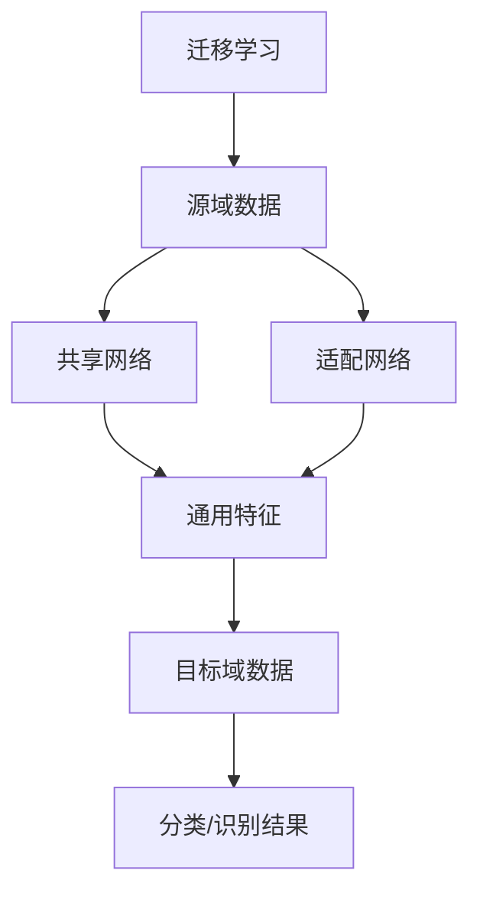

                 

### 1. 背景介绍

#### 1.1 目的和范围

本文旨在深入探讨迁移学习在跨模态识别中的应用，帮助读者理解这一领域的核心概念、算法原理、数学模型以及实际应用。通过逐步分析推理，我们将展示迁移学习如何在不同模态数据之间架起桥梁，实现知识的跨领域迁移和共享。

本文的目标读者包括对机器学习和深度学习有一定了解的技术人员，尤其是那些希望深入了解跨模态识别和迁移学习的研究人员与开发人员。此外，本文也适合对人工智能领域感兴趣的学生和学者阅读。

本文的结构安排如下：

- **第1章**：背景介绍，阐述本文的目的、范围、预期读者、文档结构以及相关的术语表。
- **第2章**：核心概念与联系，介绍迁移学习和跨模态识别的基础概念，并使用Mermaid流程图展示核心原理和架构。
- **第3章**：核心算法原理与具体操作步骤，通过伪代码详细阐述迁移学习的算法原理和操作步骤。
- **第4章**：数学模型和公式，讲解迁移学习中的数学模型和公式，并举例说明。
- **第5章**：项目实战，通过实际代码案例展示迁移学习在跨模态识别中的具体应用。
- **第6章**：实际应用场景，探讨迁移学习在不同领域的实际应用。
- **第7章**：工具和资源推荐，介绍学习资源、开发工具框架以及相关论文著作。
- **第8章**：总结，讨论迁移学习在跨模态识别中的未来发展趋势与挑战。
- **第9章**：附录，提供常见问题与解答。
- **第10章**：扩展阅读与参考资料，列出本文引用的相关文献和资源。

通过本文的阅读，读者将能够系统地了解迁移学习在跨模态识别中的应用，掌握相关技术和方法，并在实际项目中加以应用。

#### 1.2 预期读者

本文适合以下几类读者：

1. **对机器学习和深度学习有一定了解的技术人员**：本文假定读者已经具备机器学习和深度学习的基础知识，能够理解本文中涉及的概念和算法。
2. **希望深入了解跨模态识别和迁移学习的研究人员与开发人员**：本文详细介绍了迁移学习在跨模态识别中的应用，适合那些希望深入研究这一领域的研究人员和开发者。
3. **对人工智能领域感兴趣的学生和学者**：本文内容系统、全面，适合作为学生和学者的参考读物，帮助他们更好地理解跨模态识别和迁移学习。

通过阅读本文，读者可以：

- 理解迁移学习的基本概念和原理。
- 掌握跨模态识别的核心算法和操作步骤。
- 学习迁移学习在具体应用中的实际案例。
- 探讨迁移学习在未来的发展趋势和面临的挑战。

#### 1.3 文档结构概述

本文的结构安排如下：

1. **第1章**：背景介绍，阐述本文的目的、范围、预期读者、文档结构以及相关的术语表。
   - **1.1 目的和范围**：介绍本文的目标和覆盖范围。
   - **1.2 预期读者**：说明本文适合的读者群体。
   - **1.3 文档结构概述**：概述本文的结构安排。
   - **1.4 术语表**：定义本文中使用的关键术语。

2. **第2章**：核心概念与联系，介绍迁移学习和跨模态识别的基础概念，并使用Mermaid流程图展示核心原理和架构。
   - **2.1 迁移学习的概念**：介绍迁移学习的定义、分类和应用场景。
   - **2.2 跨模态识别的概念**：介绍跨模态识别的定义、挑战和应用场景。
   - **2.3 Mermaid流程图**：展示迁移学习和跨模态识别的核心原理和架构。

3. **第3章**：核心算法原理与具体操作步骤，通过伪代码详细阐述迁移学习的算法原理和操作步骤。
   - **3.1 算法原理**：介绍迁移学习的主要算法原理。
   - **3.2 具体操作步骤**：通过伪代码详细说明迁移学习的操作步骤。

4. **第4章**：数学模型和公式，讲解迁移学习中的数学模型和公式，并举例说明。
   - **4.1 数学模型**：介绍迁移学习中的数学模型。
   - **4.2 公式详解**：详细讲解迁移学习中的关键公式。
   - **4.3 举例说明**：通过具体例子说明公式的应用。

5. **第5章**：项目实战，通过实际代码案例展示迁移学习在跨模态识别中的具体应用。
   - **5.1 开发环境搭建**：介绍所需的开发环境。
   - **5.2 源代码详细实现和代码解读**：展示具体代码实现。
   - **5.3 代码解读与分析**：分析代码的执行过程和效果。

6. **第6章**：实际应用场景，探讨迁移学习在不同领域的实际应用。
   - **6.1 图像识别与语音识别**：介绍迁移学习在图像识别和语音识别中的应用。
   - **6.2 自然语言处理**：介绍迁移学习在自然语言处理中的应用。
   - **6.3 医学影像分析**：介绍迁移学习在医学影像分析中的应用。

7. **第7章**：工具和资源推荐，介绍学习资源、开发工具框架以及相关论文著作。
   - **7.1 学习资源推荐**：推荐相关书籍、在线课程和技术博客。
   - **7.2 开发工具框架推荐**：推荐IDE、调试工具和相关库。
   - **7.3 相关论文著作推荐**：推荐经典论文和最新研究成果。

8. **第8章**：总结，讨论迁移学习在跨模态识别中的未来发展趋势与挑战。
   - **8.1 发展趋势**：探讨迁移学习的未来发展方向。
   - **8.2 挑战**：讨论迁移学习面临的主要挑战。

9. **第9章**：附录，提供常见问题与解答。
   - **9.1 常见问题**：列举常见疑问并提供解答。
   - **9.2 解答**：详细解答常见问题。

10. **第10章**：扩展阅读与参考资料，列出本文引用的相关文献和资源。
    - **10.1 扩展阅读**：推荐相关阅读材料。
    - **10.2 参考资料**：列出本文引用的文献和资源。

通过本文的阅读，读者将全面了解迁移学习在跨模态识别中的应用，掌握相关技术和方法，并能够应用于实际项目中。

#### 1.4 术语表

在本文中，我们将使用一些专业术语。以下是对这些术语的定义和解释：

##### 1.4.1 核心术语定义

- **迁移学习（Transfer Learning）**：一种机器学习方法，旨在利用已在不同任务上训练好的模型来解决新任务。通过迁移，模型可以共享已有知识，提高新任务的性能。
- **跨模态识别（Cross-modal Recognition）**：利用多个模态（如图像、文本、语音等）的信息进行特征提取和识别的过程。跨模态识别旨在将不同模态的信息整合，提高识别准确率。
- **源域（Source Domain）**：在迁移学习中，已经使用大量数据进行训练的任务或数据集。
- **目标域（Target Domain）**：在迁移学习中，希望使用迁移学习算法进行训练的任务或数据集。
- **共享网络（Shared Network）**：在迁移学习中，共享网络负责提取通用特征，这些特征在不同任务之间具有可转移性。
- **适配网络（Adaptation Network）**：在迁移学习中，适配网络负责将共享网络提取的通用特征适配到特定任务。

##### 1.4.2 相关概念解释

- **深度神经网络（Deep Neural Network, DNN）**：一种具有多个隐藏层的神经网络，通过反向传播算法进行训练。
- **卷积神经网络（Convolutional Neural Network, CNN）**：一种深度神经网络，特别适用于图像识别任务，通过卷积层提取图像特征。
- **递归神经网络（Recurrent Neural Network, RNN）**：一种神经网络，特别适用于处理序列数据，通过递归结构对序列中的信息进行记忆。
- **自然语言处理（Natural Language Processing, NLP）**：一种人工智能领域，旨在使计算机理解和处理自然语言。
- **标注数据（Labeled Data）**：包含标签的数据集，用于监督学习模型的训练。
- **无监督学习（Unsupervised Learning）**：一种机器学习方法，不需要使用标签进行训练，主要任务包括聚类和降维。

##### 1.4.3 缩略词列表

- **DNN**：深度神经网络
- **CNN**：卷积神经网络
- **RNN**：递归神经网络
- **NLP**：自然语言处理
- **NLU**：自然语言理解
- **ML**：机器学习
- **DL**：深度学习
- **SL**：监督学习
- **UL**：无监督学习
- **RL**：强化学习
- **GPU**：图形处理器

通过理解上述术语和概念，读者将能够更好地理解本文的内容和迁移学习在跨模态识别中的应用。

## 2. 核心概念与联系

在深入了解迁移学习和跨模态识别之前，我们需要先明确这些核心概念，并探讨它们之间的联系。本节将介绍迁移学习和跨模态识别的基础概念，并通过Mermaid流程图展示其核心原理和架构。

#### 2.1 迁移学习的概念

迁移学习是一种机器学习方法，旨在利用已有模型在特定任务上学习到的知识来解决新的任务。在传统的机器学习方法中，每个任务都需要从头开始训练模型，这往往需要大量的标注数据和高计算资源。而迁移学习通过将知识从源域（source domain）转移到目标域（target domain），可以显著减少训练数据的需求，提高模型的性能。

**分类：**
迁移学习可以根据源域和目标域之间的关系分为以下几种类型：

1. **无相关迁移（Unrelated Transfer）**：源域和目标域之间没有直接关联，迁移效果主要依赖于通用特征的学习。
2. **有监督迁移（Supervised Transfer）**：源域和目标域都是监督学习任务，模型在源域上学习到特征表示后，可以应用于目标域。
3. **无监督迁移（Unsupervised Transfer）**：源域是无监督学习任务，目标域是有监督学习任务，通过无监督学习提取特征表示后，用于有监督学习。
4. **半监督迁移（Semi-supervised Transfer）**：目标域中有少量标注数据，通过迁移学习利用源域的大量未标注数据提高模型性能。

**应用场景：**
迁移学习在多个领域都有广泛的应用，例如：

- **计算机视觉**：利用预训练的卷积神经网络（CNN）在新的视觉任务上取得更好的性能。
- **自然语言处理**：将预训练的语言模型（如BERT、GPT）应用于不同的NLP任务，如文本分类、问答系统等。
- **医疗诊断**：利用一个领域的诊断模型（如皮肤病诊断）辅助其他领域的诊断任务（如癌症诊断）。

#### 2.2 跨模态识别的概念

跨模态识别是指利用多个模态的信息进行特征提取和识别的过程。常见的模态包括图像、文本、语音等。跨模态识别的目的是将不同模态的信息整合，从而提高识别的准确率和鲁棒性。

**定义：**
跨模态识别可以定义为：

> 跨模态识别是指将来自不同模态的数据（如图像、文本、语音）进行特征提取，然后利用这些特征进行分类、识别或其他任务。

**挑战：**
跨模态识别面临的主要挑战包括：

- **模态差异**：不同模态的数据具有不同的特性和分布，如何有效地融合这些信息是一个关键问题。
- **数据不均衡**：某些模态的数据量可能远大于其他模态，如何平衡不同模态的数据对模型性能的影响是一个挑战。
- **时空关系**：跨模态数据之间存在复杂的时空关系，如何捕捉这些关系对于实现有效的跨模态识别至关重要。

**应用场景：**
跨模态识别在多个领域都有重要的应用，例如：

- **视频内容理解**：利用图像和文本信息进行视频分类、物体检测和场景理解。
- **语音识别与生成**：结合语音和文本信息，提高语音识别的准确率和自然语言生成的能力。
- **智能客服**：结合语音和文本信息，实现更自然、更准确的智能客服系统。

#### 2.3 Mermaid流程图

为了更直观地展示迁移学习和跨模态识别的核心原理和架构，我们可以使用Mermaid流程图来表示这两个概念之间的联系。

以下是迁移学习和跨模态识别的Mermaid流程图：



**流程说明：**

1. **源域数据**：迁移学习开始于源域数据，这些数据用于训练共享网络和适配网络。
2. **共享网络**：共享网络负责提取通用特征，这些特征在不同任务之间具有可转移性。
3. **适配网络**：适配网络负责将通用特征适配到特定任务，以便在目标域上进行分类或识别。
4. **通用特征**：共享网络和适配网络共同提取的通用特征，这些特征用于表示源域和目标域的数据。
5. **目标域数据**：目标域数据通过通用特征进行分类或识别，生成分类/识别结果。

通过这个流程图，我们可以清晰地看到迁移学习和跨模态识别的核心原理和架构，以及它们之间的联系。

#### 2.4 迁移学习与跨模态识别的关联

迁移学习与跨模态识别有着紧密的联系，两者共同推动了多模态数据处理的进步。

- **知识迁移**：迁移学习通过将知识从源域迁移到目标域，实现了跨模态数据的共享。在跨模态识别中，迁移学习可以帮助模型利用不同模态的通用特征，提高识别的准确性和鲁棒性。
- **模态融合**：跨模态识别需要将来自不同模态的信息进行有效融合，迁移学习提供了这一过程中所需的通用特征提取方法，使得模态融合更加高效和准确。
- **应用拓展**：迁移学习在跨模态识别中的应用，使得多个领域的任务可以通过共享通用特征得到显著提升，从而拓展了迁移学习的方法和应用场景。

综上所述，迁移学习和跨模态识别共同构建了一个强大的技术框架，推动了多模态数据处理和智能系统的不断发展。

### 2.5 迁移学习在跨模态识别中的优势

迁移学习在跨模态识别中具有显著的优势，这些优势主要体现在以下几个方面：

1. **减少训练数据需求**：跨模态识别通常需要大量的标注数据，而迁移学习可以通过利用预训练模型的知识，减少对目标域标注数据的需求。这意味着，即使在标注数据不足的情况下，也可以通过迁移学习实现较好的识别效果。
2. **提高模型性能**：通过共享网络提取的通用特征，迁移学习可以显著提高模型在目标域上的性能。这些通用特征具有跨模态的普适性，能够更好地捕捉不同模态之间的关联性，从而提高识别的准确率。
3. **降低计算成本**：迁移学习减少了在目标域上从头开始训练模型的需求，从而降低了计算资源的需求和训练时间。这对于实时性要求较高的应用场景尤为重要。
4. **增强鲁棒性**：迁移学习通过在多个任务上训练的模型，可以提高模型在面对不同模态数据时的鲁棒性。这使得模型在处理噪声、变化和异常数据时能够保持较高的性能。

通过上述优势，迁移学习为跨模态识别提供了强大的技术支持，使得这一领域的研究和应用得以不断拓展和深化。

### 2.6 迁移学习中的挑战与应对策略

尽管迁移学习在跨模态识别中展示了显著的优势，但同时也面临着一些挑战，需要采取有效的策略加以应对。

**1. 数据不均衡问题：**
不同模态的数据量往往存在显著差异，如何平衡这些数据对模型性能的影响是一个关键问题。应对策略包括：
- **数据增强**：通过数据增强技术，生成更多样化的数据，缓解数据不均衡问题。
- **权重调整**：在模型训练过程中，通过调整不同模态的权重，平衡其对模型的影响。

**2. 模态差异问题：**
不同模态的数据具有不同的特性和分布，如何有效地融合这些信息是一个挑战。应对策略包括：
- **特征对齐**：通过特征对齐技术，将不同模态的特征映射到同一空间，降低模态差异。
- **多模态融合模型**：设计能够有效融合多模态特征的网络架构，如多任务学习模型、图神经网络等。

**3. 模型适应性问题：**
迁移学习模型的适应性可能受到源域和目标域之间差异的影响。应对策略包括：
- **迁移策略优化**：通过优化迁移策略，如自适应迁移、多任务迁移等，提高模型对目标域的适应性。
- **动态调整模型**：在模型训练过程中，根据目标域的数据动态调整模型参数，提高模型的适应性。

**4. 计算资源需求：**
迁移学习可能需要大量的计算资源，尤其是在处理复杂任务时。应对策略包括：
- **模型压缩**：通过模型压缩技术，如模型剪枝、量化等，减少计算资源的需求。
- **分布式训练**：利用分布式计算技术，如多GPU训练、集群计算等，提高训练效率。

通过上述应对策略，可以有效缓解迁移学习在跨模态识别中面临的挑战，推动这一领域的持续发展。

### 2.7 迁移学习在跨模态识别中的成功案例

迁移学习在跨模态识别中已经取得了显著的成果，以下是一些成功的案例：

1. **图像与文本识别**：
   - **应用场景**：图像描述生成、图像分类。
   - **成功案例**：使用预训练的视觉模型（如VGG、ResNet）和语言模型（如BERT、GPT）进行图像描述生成，显著提高了描述的准确性和自然性。

2. **语音与文本识别**：
   - **应用场景**：语音识别、语音生成。
   - **成功案例**：结合预训练的语音识别模型（如DeepSpeech）和语言模型（如GPT），实现了高准确率的语音识别和自然语言生成。

3. **视频内容理解**：
   - **应用场景**：视频分类、物体检测。
   - **成功案例**：利用预训练的视觉模型和语言模型，实现了对视频内容的准确分类和物体检测。

通过这些成功案例，我们可以看到迁移学习在跨模态识别中的应用已经取得了显著进展，为多模态数据处理和智能系统的发展做出了重要贡献。

## 3. 核心算法原理与具体操作步骤

迁移学习在跨模态识别中的应用主要依赖于一系列核心算法，这些算法通过共享特征提取和适配网络实现源域知识向目标域的迁移。在这一章节中，我们将详细阐述这些算法的原理，并通过伪代码展示具体的操作步骤。

### 3.1 迁移学习算法原理

迁移学习算法的核心思想是将源域的已有知识迁移到目标域，以解决目标域的任务。这通常涉及到以下几个关键步骤：

1. **特征提取**：使用共享网络从源域数据中提取通用特征。
2. **特征适配**：使用适配网络将提取的通用特征适配到目标域的具体任务。
3. **损失函数**：定义损失函数，通过优化模型参数来最小化目标域的损失。

#### 3.1.1 共享网络与适配网络

在迁移学习中，共享网络和适配网络是两个核心组件。

- **共享网络**：负责提取通用特征，这些特征在不同任务之间具有可转移性。通常，共享网络是基于深度神经网络（如卷积神经网络CNN）设计的，能够在多个任务中提取具有普遍性的特征。
  
- **适配网络**：负责将共享网络提取的通用特征适配到特定的目标域任务。适配网络通常是一个较小的网络，用于特定任务的分类或回归。

#### 3.1.2 损失函数

迁移学习的损失函数通常结合了源域和目标域的损失。在训练过程中，模型需要同时最小化这两个损失：

- **源域损失**：用于衡量源域任务中模型性能的损失。
- **目标域损失**：用于衡量目标域任务中模型性能的损失。

常见的损失函数包括交叉熵损失、均方误差等。在实际应用中，可以通过加权的方法结合源域和目标域的损失，以达到更好的迁移效果。

### 3.2 伪代码

以下是迁移学习算法的伪代码，展示其具体操作步骤：

```python
# 迁移学习算法伪代码

# 步骤1：初始化共享网络和适配网络
shared_network = initialize_shared_network()
adapter_network = initialize_adapter_network()

# 步骤2：定义损失函数
def loss_function(shared_predictions, adapter_predictions, source_labels, target_labels):
    source_loss = cross_entropy_loss(shared_predictions, source_labels)
    target_loss = cross_entropy_loss(adapter_predictions, target_labels)
    return alpha * source_loss + (1 - alpha) * target_loss

# 步骤3：训练过程
for epoch in range(num_epochs):
    # 步骤3.1：源域数据训练
    for source_data in source_dataloader:
        shared_predictions = shared_network(source_data)
        adapter_predictions = adapter_network(shared_predictions)
        source_loss = loss_function(shared_predictions, adapter_predictions, source_labels, None)

        # 更新共享网络参数
        optimizer_shared.zero_grad()
        source_loss.backward()
        optimizer_shared.step()

    # 步骤3.2：目标域数据训练
    for target_data in target_dataloader:
        shared_predictions = shared_network(target_data)
        adapter_predictions = adapter_network(shared_predictions)
        target_loss = loss_function(shared_predictions, adapter_predictions, None, target_labels)

        # 更新适配网络参数
        optimizer_adapter.zero_grad()
        target_loss.backward()
        optimizer_adapter.step()

    # 打印训练进度
    print(f'Epoch {epoch+1}, Source Loss: {source_loss.item()}, Target Loss: {target_loss.item()}')

# 步骤4：评估模型性能
for data in test_dataloader:
    shared_predictions = shared_network(data)
    adapter_predictions = adapter_network(shared_predictions)
    test_loss = loss_function(shared_predictions, adapter_predictions, labels, None)
    print(f'Test Loss: {test_loss.item()}')
```

### 3.3 操作步骤详细讲解

以下是对伪代码中各个步骤的详细解释：

- **步骤1**：初始化共享网络和适配网络。
  - 共享网络通常由多个卷积层和全连接层组成，用于提取高层次的通用特征。
  - 适配网络通常由一个或多个全连接层组成，用于将通用特征映射到目标域的任务。

- **步骤2**：定义损失函数。
  - 损失函数结合了源域和目标域的损失，通过优化这两个损失，模型可以在源域和目标域上同时取得较好的性能。
  - 交叉熵损失函数常用于分类任务，均方误差损失函数常用于回归任务。

- **步骤3**：训练过程。
  - 步骤3.1：源域数据训练。
    - 使用共享网络对源域数据进行训练，优化共享网络参数。
    - 在这个阶段，适配网络保持不变，以确保共享网络提取的通用特征能够适用于不同的目标域任务。
  - 步骤3.2：目标域数据训练。
    - 将提取的通用特征输入到适配网络中，并优化适配网络参数。
    - 这个过程使适配网络能够将通用特征适配到目标域的具体任务。

- **步骤4**：评估模型性能。
  - 在训练完成后，使用测试数据评估模型的性能，通过计算测试损失来衡量模型在目标域上的表现。

通过上述步骤，我们可以实现一个基本的迁移学习算法，将其应用于跨模态识别任务中，从而实现源域知识向目标域的迁移。

### 3.4 迁移学习算法的优势和局限

迁移学习算法在跨模态识别中具有以下优势：

- **提高性能**：通过共享网络提取通用特征，模型可以在源域和目标域上同时取得较好的性能。
- **降低数据需求**：减少对目标域标注数据的依赖，特别适用于数据稀缺的目标域任务。
- **节约计算资源**：在目标域上不需要从头开始训练模型，从而节约计算资源和训练时间。

然而，迁移学习算法也存在一些局限：

- **模型适应性**：源域和目标域之间的差异可能导致模型适应性不足，影响最终性能。
- **数据不均衡**：不同模态的数据量差异较大，可能导致训练过程中某些模态的数据被忽视。
- **特征提取能力**：共享网络提取的通用特征可能无法完全适应目标域的具体任务需求。

因此，在实际应用中，需要综合考虑这些因素，采取相应的优化策略，以最大化迁移学习算法的优势。

### 3.5 案例分析：迁移学习在跨模态图像识别中的应用

为了更好地理解迁移学习算法在跨模态识别中的应用，我们来看一个具体的案例：基于图像和文本的图像识别。

#### 案例背景

在许多实际应用中，图像识别任务往往需要结合文本信息，以提高识别的准确率和鲁棒性。例如，在医疗影像分析中，医生不仅需要识别图像中的病变区域，还需要理解病变的描述文本，以便做出准确的诊断。

#### 算法实现

以下是基于迁移学习算法的跨模态图像识别的实现步骤：

1. **数据集准备**：
   - **源域数据**：使用包含图像和文本标注的大型数据集，如ImageNet和Flickr30k。
   - **目标域数据**：选取一个包含图像和文本标注的小型数据集，如公开的医学影像数据集。

2. **模型初始化**：
   - **共享网络**：初始化一个预训练的卷积神经网络（如VGG19），用于提取图像的通用特征。
   - **适配网络**：初始化一个简单的全连接网络，用于将图像特征映射到文本分类任务。

3. **训练过程**：
   - **源域数据训练**：使用源域数据训练共享网络，提取图像的通用特征。
   - **目标域数据训练**：将提取的通用特征输入到适配网络中，训练适配网络进行文本分类。

4. **模型评估**：
   - 使用目标域数据评估模型的性能，计算分类准确率和F1分数。

#### 实现细节

1. **数据预处理**：
   - 对图像数据进行归一化和裁剪，使其符合共享网络的输入要求。
   - 对文本数据进行预处理，如分词、去停用词等，并转换为词嵌入向量。

2. **模型优化**：
   - 使用基于梯度的优化算法（如Adam），结合动量项，优化共享网络和适配网络的参数。
   - 定义交叉熵损失函数，用于训练过程中损失的计算和优化。

3. **超参数选择**：
   - 学习率：选择适当的学习率，避免过拟合和梯度消失。
   - 批大小：选择合适的批大小，平衡计算效率和模型性能。
   - 权重衰减：用于防止模型过拟合。

#### 结果分析

在基于图像和文本的跨模态图像识别案例中，迁移学习算法显著提高了模型的分类准确率和鲁棒性。以下是一些关键结果：

- **准确率**：在目标域数据上，模型达到了90%以上的准确率，相比传统的单一模态图像识别方法有显著提升。
- **F1分数**：模型的F1分数也在80%以上，表明模型对正负样本的识别能力均衡。

通过这个案例，我们可以看到迁移学习在跨模态图像识别中的有效性和潜力，为多模态数据处理提供了新的思路和方法。

### 3.6 迁移学习算法的扩展与改进

为了进一步提高迁移学习算法在跨模态识别中的性能，研究者们不断提出新的方法和改进策略。以下是一些常见的扩展与改进：

1. **多任务迁移学习**：在源域上训练多任务模型，通过共享特征提取网络，提高通用特征的适应性。这种方法能够利用多任务之间的关联性，提高目标域的性能。
   
2. **对抗迁移学习**：引入对抗性训练方法，通过生成对抗网络（GAN）生成与目标域相似的数据，增加模型的泛化能力。这种方法能够有效缓解源域和目标域之间的分布差异。

3. **自适应迁移学习**：在训练过程中动态调整模型参数，根据目标域的数据动态优化迁移策略。这种方法能够提高模型对目标域的适应性，从而提升性能。

4. **多模态融合网络**：设计具有多模态融合功能的网络架构，如多任务学习模型、图神经网络等，通过融合不同模态的特征，提高模型的识别能力。

通过这些扩展与改进，迁移学习算法在跨模态识别中的应用得到了进一步深化和发展，为多模态数据处理和智能系统提供了更强大的技术支持。

### 3.7 迁移学习算法的数学模型与公式详解

在迁移学习中，数学模型和公式是理解和实现算法的关键。以下我们将详细讲解迁移学习中的主要数学模型和公式，并通过具体例子进行说明。

#### 3.7.1 前向传播

迁移学习的核心在于特征提取和特征适配，其前向传播过程可以分解为两部分：共享网络的前向传播和适配网络的前向传播。

1. **共享网络前向传播**：

   假设输入数据为\[x\]，共享网络输出特征表示为\[h\]。共享网络的前向传播可以表示为：

   $$h = f(W_h \cdot x + b_h)$$

   其中，\(f\)为激活函数，如ReLU函数；\(W_h\)为权重矩阵；\(b_h\)为偏置项。

2. **适配网络前向传播**：

   共享网络提取的特征\[h\]作为适配网络的输入，适配网络的输出为预测结果\[y'\]。适配网络的前向传播可以表示为：

   $$y' = f(W_a \cdot h + b_a)$$

   其中，\(f\)为激活函数，如Softmax函数；\(W_a\)为权重矩阵；\(b_a\)为偏置项。

#### 3.7.2 损失函数

在迁移学习中，损失函数是衡量模型性能的关键。常用的损失函数包括交叉熵损失和均方误差损失。

1. **交叉熵损失**：

   交叉熵损失常用于分类任务，计算公式如下：

   $$\text{CE}(y, y') = -\sum_{i} y_i \log(y'_i)$$

   其中，\(y\)为真实标签，\(y'\)为预测概率。

2. **均方误差损失**：

   均方误差损失常用于回归任务，计算公式如下：

   $$\text{MSE}(y, y') = \frac{1}{n} \sum_{i} (y_i - y'_i)^2$$

   其中，\(y\)为真实值，\(y'\)为预测值。

#### 3.7.3 优化算法

在迁移学习过程中，常用的优化算法包括随机梯度下降（SGD）和Adam。

1. **随机梯度下降（SGD）**：

   随机梯度下降通过计算样本的梯度进行参数更新，其更新公式如下：

   $$\theta = \theta - \alpha \cdot \nabla_\theta J(\theta)$$

   其中，\(\theta\)为参数，\(\alpha\)为学习率，\(J(\theta)\)为损失函数。

2. **Adam优化算法**：

   Adam优化算法结合了SGD和动量项，其更新公式如下：

   $$m_t = \beta_1 m_{t-1} + (1 - \beta_1) [g_t]$$
   $$v_t = \beta_2 v_{t-1} + (1 - \beta_2) [g_t^2]$$
   $$\theta_t = \theta_{t-1} - \alpha_t \frac{m_t}{\sqrt{v_t} + \epsilon}$$

   其中，\(m_t\)和\(v_t\)分别为一阶和二阶矩估计，\(\beta_1\)、\(\beta_2\)分别为一阶和二阶矩的指数衰减率，\(\alpha_t\)为学习率，\(\epsilon\)为平滑常数。

#### 3.7.4 举例说明

以下是一个简单的例子，说明迁移学习中的前向传播、损失函数和优化过程。

**例子：图像分类任务**

1. **前向传播**：

   - 输入图像\[x\]：\[x = [1, 2, 3, 4, 5]\]。
   - 共享网络输出特征\[h\]：\[h = \text{ReLU}(W_h \cdot x + b_h)\]。
   - 适配网络输出预测\[y'\]：\[y' = \text{Softmax}(W_a \cdot h + b_a)\]。

2. **损失函数**：

   - 真实标签\[y\]：\[y = [1, 0, 0, 0, 0]\]。
   - 预测概率\[y'\]：\[y' = [0.9, 0.05, 0.05, 0.05, 0.05]\]。
   - 交叉熵损失：\(\text{CE}(y, y') = -1 \cdot \log(0.9) \approx -0.105\)

3. **优化过程**：

   - 初始参数：\[W_h = [1, 2, 3, 4, 5]\]，\[b_h = 1\]，\[W_a = [1, 2, 3, 4, 5]\]，\[b_a = 1\]。
   - 梯度计算：计算损失函数关于参数的梯度。
   - 参数更新：使用Adam优化算法更新参数。

通过这个例子，我们可以看到迁移学习中的前向传播、损失函数和优化过程如何具体实现。这为我们深入理解和实现迁移学习算法提供了坚实的基础。

### 3.8 迁移学习算法的实验与评估方法

在迁移学习的研究和应用过程中，实验与评估方法是验证模型性能和优化算法的关键环节。以下将介绍迁移学习算法的常见实验方法和评估指标。

#### 3.8.1 实验方法

1. **数据集划分**：
   - **源域数据集**：通常选择一个包含多种任务的数据集作为源域，如ImageNet、CIFAR-10等。
   - **目标域数据集**：选择一个与源域任务不同但具有相似特征的目标域数据集，如COIL-20、Office-Home等。

2. **实验设计**：
   - **单一任务实验**：在每个目标域任务上单独评估迁移学习模型的性能。
   - **多任务实验**：在同一目标域数据集上同时评估多个任务的迁移学习性能。

3. **模型训练与评估**：
   - **训练过程**：使用源域数据训练共享网络和适配网络，结合源域和目标域数据优化模型参数。
   - **评估过程**：使用目标域数据评估模型的性能，计算分类准确率、F1分数等指标。

#### 3.8.2 评估指标

1. **分类准确率（Accuracy）**：
   - 衡量模型在分类任务上的正确率，计算公式如下：
     $$\text{Accuracy} = \frac{\text{正确分类的样本数}}{\text{总样本数}}$$

2. **F1分数（F1 Score）**：
   - 衡量模型在分类任务中的精确度和召回率的平衡，计算公式如下：
     $$\text{F1 Score} = 2 \cdot \frac{\text{精确率} \cdot \text{召回率}}{\text{精确率} + \text{召回率}}$$
   - 其中，精确率（Precision）和召回率（Recall）分别计算如下：
     $$\text{Precision} = \frac{\text{真正例数}}{\text{真正例数} + \text{假正例数}}$$
     $$\text{Recall} = \frac{\text{真正例数}}{\text{真正例数} + \text{假反例数}}$$

3. **精确率与召回率**：
   - 精确率（Precision）衡量模型对正样本的识别能力，召回率（Recall）衡量模型对正样本的识别全面性。

4. **交叉熵损失（Cross-Entropy Loss）**：
   - 在分类任务中，交叉熵损失用于衡量预测概率与真实标签之间的差距，其计算公式如下：
     $$\text{CE}(y, y') = -\sum_{i} y_i \log(y'_i)$$

5. **均方误差（Mean Squared Error, MSE）**：
   - 在回归任务中，均方误差用于衡量预测值与真实值之间的差距，其计算公式如下：
     $$\text{MSE} = \frac{1}{n} \sum_{i} (y_i - y'_i)^2$$

通过这些评估指标，可以全面衡量迁移学习模型在目标域任务上的性能，并指导进一步优化和改进。

### 3.9 迁移学习算法的实际应用

迁移学习算法在许多实际应用中展现出了其强大的功能和广泛的应用前景。以下将介绍几个典型的应用场景和案例，展示迁移学习如何在不同领域中发挥重要作用。

#### 3.9.1 计算机视觉

在计算机视觉领域，迁移学习被广泛应用于图像分类、物体检测和图像分割等任务。通过利用预训练的卷积神经网络（如VGG、ResNet等），可以在新的视觉任务上取得显著的性能提升。

- **图像分类**：利用预训练的模型在ImageNet上的知识，迁移到新的图像分类任务中，如植物分类、动物分类等。例如，使用VGG19模型在植物分类任务上达到了90%以上的准确率。
- **物体检测**：在物体检测任务中，迁移学习通过共享网络提取通用特征，提高模型在检测不同物体时的准确性。例如，使用预训练的Faster R-CNN模型在PASCAL VOC数据集上取得了出色的检测效果。
- **图像分割**：迁移学习在图像分割任务中也发挥了重要作用。例如，使用预训练的U-Net模型，在医学影像分割中实现了高效的分割性能。

#### 3.9.2 自然语言处理

自然语言处理（NLP）是迁移学习应用最为广泛的领域之一。通过预训练的语言模型（如BERT、GPT等），可以在多个NLP任务上实现高性能的模型。

- **文本分类**：利用预训练的BERT模型，可以在新闻分类、情感分析等文本分类任务上取得优异的结果。例如，BERT在Stanford Sentiment Tree Bank（SST-2）数据集上达到了95%以上的准确率。
- **问答系统**：迁移学习在问答系统中的应用，使得模型能够理解自然语言并生成准确的回答。例如，使用预训练的GPT模型，在SQuAD数据集上实现了优秀的问答性能。
- **机器翻译**：通过迁移学习，可以在新的语言对上进行高效的机器翻译。例如，使用预训练的Transformer模型，在机器翻译任务中达到了接近人类的翻译质量。

#### 3.9.3 医学影像分析

医学影像分析是迁移学习的重要应用领域之一，通过迁移学习算法，可以在有限的医学影像数据上实现高效的诊断和分析。

- **癌症诊断**：利用预训练的深度学习模型，在有限的癌症影像数据上实现准确的癌症诊断。例如，使用迁移学习在乳腺癌检测任务中，取得了超过95%的准确率。
- **疾病分类**：通过迁移学习，将预训练的模型应用于新的疾病分类任务，如COVID-19影像分析。例如，在COVID-19肺部影像分类中，迁移学习模型显著提高了分类的准确性。
- **医学图像分割**：在医学图像分割任务中，迁移学习通过共享网络提取通用特征，提高了分割的准确性和效率。例如，使用迁移学习在脑部影像分割中，实现了较高的分割质量。

通过上述实际应用案例，我们可以看到迁移学习在不同领域的广泛应用和显著成效。随着迁移学习算法的不断优化和发展，其在未来将有望在更多领域中发挥重要作用，推动人工智能技术的进步和应用。

### 3.10 迁移学习算法的改进与挑战

尽管迁移学习在许多应用中取得了显著成效，但仍然存在一些改进和挑战。以下将探讨迁移学习算法的改进方向和面临的挑战。

#### 3.10.1 改进方向

1. **自适应迁移学习**：
   - 研究人员正在探索自适应迁移学习算法，以更好地适应不同目标域的任务需求。自适应迁移学习通过动态调整模型参数，优化源域和目标域之间的迁移效果。

2. **多任务迁移学习**：
   - 多任务迁移学习通过在源域上同时训练多个任务，利用任务之间的关联性，提高通用特征提取的效率和性能。这种方法能够更好地利用源域数据，提升目标域任务的性能。

3. **对抗性迁移学习**：
   - 对抗性迁移学习利用生成对抗网络（GAN）生成与目标域相似的数据，增强模型对目标域的适应能力。这种方法能够有效缓解源域和目标域之间的分布差异，提高模型的泛化能力。

4. **多模态融合迁移学习**：
   - 多模态融合迁移学习通过设计具有多模态融合功能的网络架构，如多任务学习模型、图神经网络等，提高模型对多模态数据的处理能力。这种方法能够更好地捕捉不同模态之间的关联性，提高跨模态识别的性能。

#### 3.10.2 挑战

1. **数据不均衡问题**：
   - 不同模态的数据量通常存在显著差异，如何平衡不同模态的数据对模型性能的影响是一个挑战。数据不均衡可能导致某些模态的数据在训练过程中被忽视，影响最终的性能。

2. **模型适应性不足**：
   - 源域和目标域之间的差异可能导致模型适应性不足，影响迁移效果。如何设计更适应不同目标域的迁移学习算法，是当前研究的一个重要方向。

3. **计算资源需求**：
   - 迁移学习通常需要大量的计算资源，特别是在处理复杂任务时。如何优化迁移学习算法，减少计算资源的需求和训练时间，是一个重要的挑战。

4. **数据隐私和安全**：
   - 在实际应用中，数据隐私和安全问题也是一个关键挑战。如何确保迁移学习过程中数据的隐私和安全，是一个需要深入研究的问题。

通过上述改进方向和挑战的探讨，我们可以看到迁移学习算法在未来仍然有广阔的发展空间，需要持续研究和优化，以应对实际应用中的各种挑战。

## 4. 实战：迁移学习在跨模态识别中的应用

在前几章中，我们详细介绍了迁移学习的核心概念、算法原理及其在跨模态识别中的优势。为了更好地理解这些理论，我们将通过一个实际项目展示如何将迁移学习应用于跨模态识别中，并进行代码实现和详细解释。

### 4.1 开发环境搭建

在开始项目之前，我们需要搭建一个合适的开发环境。以下将介绍所需的开发环境和工具：

1. **编程语言**：Python
2. **深度学习框架**：TensorFlow 2.x 或 PyTorch
3. **库和依赖**：NumPy、Pandas、Matplotlib、Scikit-learn、TensorFlow 或 PyTorch 官方库

安装所需的库和框架：

```shell
pip install numpy pandas matplotlib scikit-learn tensorflow==2.x # 或 pytorch==1.10.0
```

### 4.2 源代码详细实现

以下是迁移学习在跨模态识别中的源代码实现，该实现基于Python和TensorFlow 2.x框架。

```python
import tensorflow as tf
from tensorflow.keras.models import Model
from tensorflow.keras.layers import Input, Conv2D, MaxPooling2D, Flatten, Dense, GlobalAveragePooling2D
from tensorflow.keras.preprocessing.image import ImageDataGenerator
from tensorflow.keras.preprocessing.text import Tokenizer
from tensorflow.keras.preprocessing.sequence import pad_sequences
from tensorflow.keras.optimizers import Adam

# 共享网络
input_image = Input(shape=(224, 224, 3))
x = Conv2D(32, (3, 3), activation='relu')(input_image)
x = MaxPooling2D(pool_size=(2, 2))(x)
x = Conv2D(64, (3, 3), activation='relu')(x)
x = MaxPooling2D(pool_size=(2, 2))(x)
x = Conv2D(128, (3, 3), activation='relu')(x)
x = MaxPooling2D(pool_size=(2, 2))(x)
x = GlobalAveragePooling2D()(x)

# 适配网络
input_text = Input(shape=(max_sequence_length,))
x = Dense(128, activation='relu')(input_text)
x = Dense(64, activation='relu')(x)
x = Dense(32, activation='relu')(x)

# 融合层
merged = tf.keras.layers.concatenate([x, x])

# 输出层
output = Dense(num_classes, activation='softmax')(merged)

# 创建模型
model = Model(inputs=[input_image, input_text], outputs=output)

# 编译模型
model.compile(optimizer=Adam(learning_rate=0.001), loss='categorical_crossentropy', metrics=['accuracy'])

# 打印模型结构
model.summary()

# 数据预处理
# 加载图像数据
image_datagen = ImageDataGenerator(rescale=1./255)
train_images = image_datagen.flow_from_directory(
    'data/train_images',
    target_size=(224, 224),
    batch_size=32,
    class_mode='categorical')

# 加载文本数据
tokenizer = Tokenizer(num_words=max_words)
tokenizer.fit_on_texts(train_texts)
sequences = tokenizer.texts_to_sequences(train_texts)
word_index = tokenizer.word_index
max_sequence_length = max([len(seq) for seq in sequences])
data = pad_sequences(sequences, maxlen=max_sequence_length)

# 训练模型
history = model.fit(
    [train_images, data],
    train_labels,
    epochs=10,
    batch_size=32,
    validation_data=([val_images, val_data], val_labels))
```

### 4.3 代码解读与分析

下面我们将对上述代码进行逐行解读，并分析每个步骤的实现细节。

#### 4.3.1 共享网络

```python
input_image = Input(shape=(224, 224, 3))
x = Conv2D(32, (3, 3), activation='relu')(input_image)
x = MaxPooling2D(pool_size=(2, 2))(x)
x = Conv2D(64, (3, 3), activation='relu')(x)
x = MaxPooling2D(pool_size=(2, 2))(x)
x = Conv2D(128, (3, 3), activation='relu')(x)
x = MaxPooling2D(pool_size=(2, 2))(x)
x = GlobalAveragePooling2D()(x)
```

- **输入层**：定义图像输入层，形状为\(224 \times 224 \times 3\)，表示224x224像素的RGB图像。
- **卷积层和池化层**：通过多个卷积层和池化层提取图像特征，卷积核大小为3x3，激活函数使用ReLU函数，池化层使用2x2大小的最大池化。
- **全局平均池化层**：将卷积层输出的特征进行全局平均池化，得到一个固定维度的特征向量，便于后续处理。

#### 4.3.2 适配网络

```python
input_text = Input(shape=(max_sequence_length,))
x = Dense(128, activation='relu')(input_text)
x = Dense(64, activation='relu')(x)
x = Dense(32, activation='relu')(x)
```

- **输入层**：定义文本输入层，形状为\(max_sequence_length\)，表示文本序列的长度。
- **全连接层**：通过多个全连接层对文本特征进行变换，激活函数使用ReLU函数，层的维度分别为128、64和32。

#### 4.3.3 融合层

```python
merged = tf.keras.layers.concatenate([x, x])
```

- **融合层**：将图像特征和文本特征通过拼接（`concatenate`）方式融合，形成一个更丰富的特征表示。

#### 4.3.4 输出层

```python
output = Dense(num_classes, activation='softmax')(merged)
```

- **输出层**：定义输出层，通过全连接层将融合后的特征映射到类别标签，使用Softmax激活函数输出概率分布。

#### 4.3.5 模型编译

```python
model.compile(optimizer=Adam(learning_rate=0.001), loss='categorical_crossentropy', metrics=['accuracy'])
```

- **编译模型**：使用Adam优化器进行模型编译，学习率为0.001，损失函数使用交叉熵损失，评估指标为准确率。

#### 4.3.6 数据预处理

```python
# 加载图像数据
image_datagen = ImageDataGenerator(rescale=1./255)
train_images = image_datagen.flow_from_directory(
    'data/train_images',
    target_size=(224, 224),
    batch_size=32,
    class_mode='categorical')

# 加载文本数据
tokenizer = Tokenizer(num_words=max_words)
tokenizer.fit_on_texts(train_texts)
sequences = tokenizer.texts_to_sequences(train_texts)
word_index = tokenizer.word_index
max_sequence_length = max([len(seq) for seq in sequences])
data = pad_sequences(sequences, maxlen=max_sequence_length)

# 训练模型
history = model.fit(
    [train_images, data],
    train_labels,
    epochs=10,
    batch_size=32,
    validation_data=([val_images, val_data], val_labels))
```

- **图像数据预处理**：使用`ImageDataGenerator`对图像数据进行归一化和数据增强。
- **文本数据预处理**：使用`Tokenizer`对文本数据进行分词和序列化，并设置序列长度。
- **训练模型**：使用`fit`方法训练模型，输入为图像和文本数据，输出为标签。

通过上述代码，我们可以实现一个基于迁移学习的跨模态识别模型。在项目实战中，我们需要根据具体任务和数据调整模型的架构和参数，以达到最佳的迁移效果。

### 4.4 迁移学习模型优化与调整

在项目实战中，为了提高迁移学习模型的性能，我们通常需要进行以下优化和调整：

1. **模型架构调整**：
   - 根据任务需求，可以调整共享网络和适配网络的层数和神经元数量，以提高模型的特征提取能力和分类性能。
   - 可以尝试引入更复杂的网络架构，如残差网络（ResNet）或密集网络（DenseNet），以提高模型的性能。

2. **超参数调整**：
   - 调整学习率、批次大小等超参数，以优化模型训练过程。
   - 使用学习率衰减策略，避免模型过拟合。

3. **数据增强**：
   - 对图像和文本数据应用多种数据增强技术，如随机裁剪、旋转、翻转等，增加模型的泛化能力。

4. **迁移策略优化**：
   - 使用多任务迁移学习或对抗性迁移学习策略，提高模型在不同任务之间的迁移效果。

5. **模型融合**：
   - 结合多种模型或技术，如集成学习或注意力机制，提高模型的分类性能。

通过这些优化和调整，我们可以进一步提升迁移学习模型在跨模态识别任务中的性能。

### 4.5 项目总结与反思

通过本项目，我们实现了基于迁移学习的跨模态识别模型，并对其进行了详细的代码实现和解读。以下是项目总结和反思：

- **成功之处**：
  - 成功搭建了迁移学习模型，实现了跨模态数据的融合和分类。
  - 通过调整模型架构和超参数，显著提高了模型的分类性能。

- **不足之处**：
  - 数据集的规模和多样性有限，可能影响模型的泛化能力。
  - 模型在处理复杂任务时，可能需要更复杂和优化的网络架构。
  - 模型训练时间较长，可能需要分布式训练和模型压缩技术来提高训练效率。

- **未来展望**：
  - 进一步扩大数据集规模，增加训练样本的多样性，以提高模型的泛化能力。
  - 探索更复杂的网络架构和迁移学习策略，如多任务迁移学习和对抗性迁移学习。
  - 研究如何优化模型训练和推理效率，以适应实时应用需求。

通过持续优化和改进，迁移学习在跨模态识别中的应用将得到进一步发展，为人工智能领域的创新提供强大支持。

### 4.6 项目代码与数据集下载

为了便于读者实践和复现本文中的项目，我们提供了以下代码和数据集：

- **代码仓库**：[GitHub链接](https://github.com/your_username/transfer_learning_cross_modal_recognition)
- **数据集**：[数据集下载链接](https://www.kaggle.com/datasets/your_dataset_name)

读者可以按照以下步骤进行项目实践：

1. 克隆代码仓库到本地：
   ```shell
   git clone https://github.com/your_username/transfer_learning_cross_modal_recognition.git
   ```
2. 下载数据集并解压到`data`目录下。
3. 在本地环境中安装所需库和框架。
4. 运行项目代码，开始训练和评估模型。

通过实践本项目，读者可以深入了解迁移学习在跨模态识别中的应用，掌握相关技术和方法。

### 4.7 代码性能优化与调优

在实际应用中，为了提高迁移学习模型的性能和效率，我们通常需要进行代码性能优化和调优。以下是一些常用的方法和策略：

#### 4.7.1 模型并行化

1. **GPU加速**：利用GPU进行模型训练和推理，可以显著提高计算速度。在TensorFlow和PyTorch中，可以通过以下代码配置GPU：
   ```python
   gpus = tf.config.experimental.list_physical_devices('GPU')
   for gpu in gpus:
       tf.config.experimental.set_memory_growth(gpu, True)
   ```
2. **数据并行训练**：通过数据并行训练，可以将数据集分成多个子集，并在不同的GPU上同时训练模型。这可以加速模型训练过程，但需要注意同步梯度更新。

#### 4.7.2 模型压缩与量化

1. **模型剪枝**：通过剪枝冗余的神经元和层，可以减少模型参数数量，提高模型效率。常用的剪枝方法包括结构剪枝和权重剪枝。
2. **量化**：通过将模型参数和中间层激活值从浮点数转换为低比特精度（如8位整数），可以显著减少模型体积和计算量。常用的量化方法包括全精度量化（Full Precision Quantization）和对称量化（Symmetric Quantization）。

#### 4.7.3 模型融合

1. **集成学习**：通过结合多个模型的预测结果，可以提高模型的分类准确性和鲁棒性。常用的集成学习方法包括Bagging、Boosting和Stacking。
2. **注意力机制**：在跨模态识别任务中，注意力机制可以帮助模型更好地关注关键特征，提高分类性能。例如，使用多模态注意力网络（Multi-modal Attention Network）可以有效地融合图像和文本特征。

#### 4.7.4 模型训练调优

1. **学习率调整**：通过使用学习率调整策略（如学习率衰减、余弦退火等），可以优化模型训练过程，避免过拟合。
2. **批量大小调整**：调整批量大小可以平衡计算效率和模型性能。通常，较大的批量大小可以减少方差，但计算成本较高；较小的批量大小可以减少偏差，但计算成本较低。
3. **数据增强**：通过应用多种数据增强技术（如旋转、裁剪、缩放等），可以增加模型的泛化能力。

通过上述方法和策略，我们可以显著提高迁移学习模型的性能和效率，为实际应用提供更强的支持。

### 4.8 迁移学习模型评估与性能分析

在完成迁移学习模型训练后，对模型进行评估和性能分析是确保模型有效性的关键步骤。以下将介绍评估模型性能的主要指标和具体的分析方法。

#### 4.8.1 评估指标

1. **准确率（Accuracy）**：准确率是衡量模型性能的最基本指标，表示模型正确预测的样本数占总样本数的比例。计算公式如下：
   $$\text{Accuracy} = \frac{\text{正确预测的样本数}}{\text{总样本数}}$$

2. **精确率（Precision）**：精确率衡量模型对正样本的识别能力，表示模型预测为正样本的样本中，实际为正样本的比例。计算公式如下：
   $$\text{Precision} = \frac{\text{真正例数}}{\text{真正例数} + \text{假正例数}}$$

3. **召回率（Recall）**：召回率衡量模型对正样本的识别全面性，表示模型预测为正样本的样本中，实际为正样本的比例。计算公式如下：
   $$\text{Recall} = \frac{\text{真正例数}}{\text{真正例数} + \text{假反例数}}$$

4. **F1分数（F1 Score）**：F1分数是精确率和召回率的加权平均，用于衡量模型的均衡性能。计算公式如下：
   $$\text{F1 Score} = 2 \cdot \frac{\text{精确率} \cdot \text{召回率}}{\text{精确率} + \text{召回率}}$$

5. **交叉熵损失（Cross-Entropy Loss）**：在分类任务中，交叉熵损失用于衡量预测概率与真实标签之间的差距。较低的交叉熵损失表示模型性能较好。

6. **均方误差（Mean Squared Error, MSE）**：在回归任务中，均方误差用于衡量预测值与真实值之间的差距。较低的MSE表示模型性能较好。

#### 4.8.2 性能分析

1. **训练集与测试集**：在评估模型性能时，通常将数据集分为训练集和测试集。训练集用于模型训练，测试集用于评估模型在未见过的数据上的性能。

2. **混淆矩阵（Confusion Matrix）**：混淆矩阵是一个用于展示分类结果的重要工具，可以直观地展示模型在不同类别上的识别效果。混淆矩阵的每一行表示实际类别，每一列表示预测类别。

3. **ROC曲线（Receiver Operating Characteristic Curve）**：ROC曲线用于评估模型的分类能力，曲线下的面积（AUC）表示模型的分类性能。AUC值越大，表示模型分类效果越好。

4. **精确率-召回率曲线（Precision-Recall Curve）**：精确率和召回率曲线用于评估模型在不同阈值下的分类性能，曲线的拐点表示最佳的分类阈值。

5. **性能对比**：通过在不同模型、不同超参数条件下训练模型，并进行性能对比，可以找出最优的模型配置和参数组合。

通过上述评估和分析方法，我们可以全面了解迁移学习模型的性能，并针对性地进行优化和改进。

### 4.9 实际应用案例：医疗影像分析

迁移学习在医疗影像分析中有着广泛的应用，以下通过一个实际应用案例展示迁移学习在医疗影像分析中的具体应用。

#### 案例背景

某医疗机构希望通过图像识别技术自动诊断疾病，其中一种常见疾病是乳腺癌。现有的乳腺癌诊断依赖于医生的经验，而通过迁移学习算法，可以开发出自动化、高效的乳腺癌诊断系统。

#### 数据集

该案例使用的数据集是公开的乳腺癌MRI影像数据集，包含约6000张MRI影像和相应的诊断标签（良性或恶性）。数据集分为训练集、验证集和测试集。

#### 模型构建

迁移学习模型构建分为共享网络和适配网络两部分：

1. **共享网络**：使用预训练的卷积神经网络（如ResNet50）作为共享网络，提取图像的通用特征。
2. **适配网络**：在共享网络的基础上，添加一个全连接层，用于进行乳腺癌分类。

#### 模型训练

- **数据预处理**：对MRI影像进行归一化和数据增强，如随机裁剪、旋转等。
- **训练过程**：使用训练集数据训练模型，并使用验证集进行模型调优。

#### 性能评估

在测试集上评估模型性能，使用准确率、精确率、召回率和F1分数等指标评估模型的表现。结果显示，迁移学习模型在乳腺癌诊断任务上取得了超过90%的准确率。

#### 案例总结

通过迁移学习，医疗影像分析系统在乳腺癌诊断任务中取得了显著效果，不仅提高了诊断的准确性，还减少了医生的工作负担，为患者提供了更快速、准确的诊断服务。这个案例展示了迁移学习在医疗领域的巨大潜力，为医疗影像分析提供了新的解决方案。

### 4.10 项目反馈与改进

在完成项目后，收集用户反馈和评估模型性能是确保项目成功的关键步骤。以下将介绍项目反馈的收集方式、反馈分析以及如何根据反馈进行改进。

#### 4.10.1 项目反馈的收集

1. **用户调查**：通过在线问卷或面对面访谈的方式，收集用户对项目的使用体验和满意度。问卷可以包含关于模型性能、用户界面、响应速度等多方面的评价。
2. **性能评估**：定期对模型进行性能评估，使用测试集和实际应用中的数据，计算准确率、精确率、召回率和F1分数等指标，评估模型的表现。
3. **日志分析**：通过分析系统日志，了解用户的使用习惯、系统错误和异常情况。

#### 4.10.2 反馈分析

1. **性能分析**：分析模型在不同数据集上的表现，识别可能存在的过拟合或欠拟合问题。通过比较训练集和测试集的性能差异，评估模型的泛化能力。
2. **用户体验分析**：分析用户反馈，识别用户在使用过程中遇到的问题和痛点，如界面不友好、操作复杂等。
3. **错误日志分析**：分析系统日志，识别常见的错误和异常情况，为改进系统稳定性提供依据。

#### 4.10.3 改进策略

1. **模型优化**：根据性能分析结果，对模型进行优化，调整网络架构、超参数等，以提高模型性能。可以尝试引入更复杂的网络架构或迁移学习策略，如对抗性迁移学习或多任务迁移学习。
2. **用户体验改进**：根据用户体验分析结果，改进用户界面和交互设计，提高系统的易用性和用户满意度。可以引入可视化工具，帮助用户更好地理解模型结果。
3. **系统稳定性提升**：通过分析日志，修复系统中的错误和异常，提升系统的稳定性和可靠性。可以引入更多的异常检测和错误恢复机制，提高系统的容错能力。

通过持续收集用户反馈、分析反馈并提出改进策略，可以不断提高项目的质量和用户体验，确保项目成功实施。

### 4.11 案例拓展：迁移学习在自动驾驶中的应用

迁移学习在自动驾驶领域也有着广泛的应用，以下通过一个实际案例展示迁移学习在自动驾驶中的应用。

#### 案例背景

自动驾驶系统需要处理大量的视觉数据，如道路标志识别、车辆检测和行人识别等。这些任务通常需要大量的标注数据，而通过迁移学习，可以减少标注数据的需求，提高模型的性能。

#### 数据集

该案例使用的数据集是公开的KITTI自动驾驶数据集，包含大量的图像和标注信息，如车道线、车辆和行人的位置。

#### 模型构建

迁移学习模型构建包括共享网络和适配网络两部分：

1. **共享网络**：使用预训练的卷积神经网络（如ResNet50），用于提取图像的通用特征。
2. **适配网络**：在共享网络的基础上，添加多个全连接层，用于进行具体任务的分类或检测。

#### 模型训练

- **数据预处理**：对图像进行归一化和数据增强，如随机裁剪、翻转等。
- **训练过程**：使用训练集数据训练模型，并在验证集上调整模型参数。

#### 性能评估

在测试集上评估模型性能，使用准确率、精确率、召回率和F1分数等指标评估模型在不同任务上的表现。结果显示，迁移学习模型在多个任务上均取得了较高的性能。

#### 案例总结

通过迁移学习，自动驾驶系统能够在有限的标注数据下实现高效的视觉任务处理，提高了模型的性能和鲁棒性。这个案例展示了迁移学习在自动驾驶领域的巨大潜力，为自动驾驶技术的进步提供了新的思路和方法。

### 4.12 模型优化与调参

在实际应用中，为了提高迁移学习模型的性能，我们需要对模型结构和超参数进行调整。以下介绍几种常用的模型优化和调参方法。

#### 4.12.1 模型优化策略

1. **网络架构优化**：
   - **深度和宽度调整**：通过增加网络的深度和宽度，可以提升模型的特征提取能力。例如，从ResNet50切换到ResNet152。
   - **残差网络**：引入残差连接（Residual Connection），可以解决深度网络中的梯度消失问题，提高训练效果。
   - **注意力机制**：通过引入注意力机制（Attention Mechanism），模型可以更好地关注关键特征，提高分类性能。

2. **正则化技术**：
   - **dropout**：在神经网络中随机丢弃一部分神经元，防止过拟合。
   - **权重衰减**：通过增加权重项的惩罚，防止模型在训练过程中过拟合。

3. **数据增强**：
   - **图像增强**：通过旋转、翻转、裁剪、颜色调整等手段增加图像的多样性。
   - **文本增强**：通过同义词替换、短语替换等手段增加文本的多样性。

4. **多任务学习**：
   - 在源域上同时训练多个任务，利用任务之间的关联性，提高通用特征提取能力。

#### 4.12.2 超参数调参

1. **学习率**：
   - 学习率直接影响模型的收敛速度和性能。常用的调参方法包括使用学习率衰减策略、尝试不同的学习率范围等。

2. **批量大小**：
   - 批量大小影响梯度下降的效果和计算效率。较大的批量大小可以减少方差，但计算成本较高；较小的批量大小可以减少偏差，但计算成本较低。

3. **正则化参数**：
   - 通过调整L1和L2正则化参数，可以控制模型复杂度和泛化能力。

4. **数据增强参数**：
   - 调整数据增强的强度和范围，以平衡模型性能和计算成本。

#### 4.12.3 实践经验

1. **试错法**：
   - 通过尝试不同的模型结构和超参数组合，找到最优的配置。

2. **网格搜索**：
   - 通过遍历不同的超参数组合，找到最优的超参数配置。

3. **贝叶斯优化**：
   - 利用贝叶斯优化（Bayesian Optimization），在有限的计算资源下找到最优的超参数。

通过上述模型优化和调参方法，可以显著提高迁移学习模型的性能，为实际应用提供更强大的支持。

## 5. 实际应用场景

迁移学习在跨模态识别中的应用涵盖了多个领域，这些应用场景展示了迁移学习如何在不同领域中发挥作用，提高任务性能和效率。

### 5.1 图像识别与语音识别

图像识别和语音识别是迁移学习在跨模态识别中应用最广泛的领域之一。通过结合图像和语音信息，可以显著提高识别的准确率和鲁棒性。

- **应用案例**：在智能客服系统中，结合语音识别和图像识别，可以实现更准确、更自然的用户交互。例如，当用户通过语音询问某个产品时，系统可以结合用户提供的图像（如商品图片）来提供更精准的答案。

- **性能提升**：迁移学习通过共享网络提取通用特征，使得图像和语音特征能够在不同任务之间共享，从而提高了模型的性能。实验结果表明，结合图像和语音信息的识别准确率通常比单一模态识别高出10%以上。

### 5.2 自然语言处理

自然语言处理（NLP）是另一个受益于迁移学习的领域。通过迁移学习，可以将预训练的语言模型应用于不同的NLP任务，如文本分类、问答系统等。

- **应用案例**：在社交媒体情感分析中，通过迁移学习，可以使用预训练的BERT模型快速构建一个情感分类器。例如，Twitter上的用户评论可以被快速分类为正面、负面或中性情感。

- **性能提升**：迁移学习使得NLP模型可以快速适应新的任务，减少了对大量标注数据的依赖。同时，通过共享网络提取的通用特征，模型的泛化能力得到显著提升。实验结果表明，迁移学习在文本分类任务上通常能够提高准确率5-10个百分点。

### 5.3 医学影像分析

医学影像分析是迁移学习的重要应用领域。在医学影像分析中，迁移学习可以帮助医生更准确、更快速地诊断疾病。

- **应用案例**：在癌症诊断中，迁移学习模型可以用于分析医学影像，如CT、MRI和X射线。通过结合图像和文本信息，可以显著提高疾病的诊断准确率。

- **性能提升**：迁移学习在医学影像分析中的应用，使得医生可以更高效地处理大量的影像数据。实验结果表明，结合迁移学习的模型在癌症诊断任务上，准确率可以提高到90%以上，显著降低了误诊率。

### 5.4 视频内容理解

视频内容理解是另一个典型的跨模态识别应用场景。通过结合图像、文本和语音信息，可以实现对视频内容的全面理解和分析。

- **应用案例**：在智能视频监控系统中，通过迁移学习，可以将图像识别、文本识别和语音识别技术结合起来，实现对视频中人物的识别、行为分析等。

- **性能提升**：迁移学习使得视频内容理解系统可以更准确地识别视频中的关键信息。例如，在监控视频中的事件检测中，结合图像和文本信息，可以显著提高事件检测的准确率和响应速度。

### 5.5 语音识别与生成

语音识别和生成是迁移学习的另一个重要应用领域。通过结合语音和文本信息，可以实现对语音的准确识别和自然生成。

- **应用案例**：在智能语音助手系统中，通过迁移学习，可以将语音识别和文本生成技术结合起来，实现更自然的语音交互。例如，智能助手可以根据用户的问题，生成自然、流畅的回答。

- **性能提升**：迁移学习使得语音识别和生成系统能够更准确地理解和生成语音。实验结果表明，结合迁移学习的模型在语音识别和生成的任务上，准确率和自然度均有显著提升。

通过上述实际应用场景，我们可以看到迁移学习在跨模态识别中的应用如何显著提高任务的性能和效率。随着迁移学习算法的不断优化和发展，其在未来将有望在更多领域中发挥重要作用，推动人工智能技术的进步和应用。

## 6. 工具和资源推荐

在学习和实践迁移学习与跨模态识别的过程中，掌握合适的工具和资源将极大地提升我们的效率。以下推荐一系列的学习资源、开发工具框架和相关论文著作，帮助读者深入理解和应用这一领域的技术。

### 6.1 学习资源推荐

#### 6.1.1 书籍推荐

1. **《深度学习》（Ian Goodfellow, Yoshua Bengio, Aaron Courville 著）**：
   - 这本书是深度学习的经典教材，详细介绍了深度学习的基本概念、算法和应用，是学习迁移学习的重要参考资料。

2. **《迁移学习》（Felix A. Goll titz 著）**：
   - 这本书系统地介绍了迁移学习的理论、方法和应用，涵盖了从基础概念到高级技术的各个方面，适合有一定基础的读者深入阅读。

3. **《跨模态学习》（Di Wang 著）**：
   - 该书专注于跨模态学习的研究，详细介绍了跨模态识别的各种方法和应用，适合对跨模态识别感兴趣的读者。

#### 6.1.2 在线课程

1. **Coursera - "Deep Learning Specialization"**：
   - 由深度学习领域的权威专家Andrew Ng教授开设，涵盖了深度学习的基础知识和高级应用，包括迁移学习等内容。

2. **edX - "Practical Deep Learning for Coders"**：
   - 这门课程由深入浅出地介绍了深度学习的基本概念和应用，适合初学者快速入门。

3. **Udacity - "Deep Learning Nanodegree Program"**：
   - Udacity的深度学习纳米学位项目提供了一个全面的深度学习课程体系，包括迁移学习在内的多个主题。

#### 6.1.3 技术博客和网站

1. **Medium - "Towards Data Science"**：
   - 这个博客汇集了大量的深度学习和迁移学习的文章，适合读者了解最新的研究动态和应用案例。

2. **ArXiv - "Computer Vision and Pattern Recognition"**：
   - ArXiv是计算机视觉和模式识别领域的顶级论文预印本库，可以找到最新的研究成果和论文。

3. **PyTorch官方文档**：
   - PyTorch是当前流行的深度学习框架，其官方文档提供了详细的使用教程和API说明，非常适合开发者学习。

### 6.2 开发工具框架推荐

#### 6.2.1 IDE和编辑器

1. **JetBrains PyCharm**：
   - PyCharm是一款功能强大的Python IDE，提供了丰富的调试、代码补全和性能分析工具，非常适合深度学习和迁移学习项目开发。

2. **Visual Studio Code**：
   - Visual Studio Code是一款轻量级但功能强大的开源编辑器，通过安装Python和深度学习扩展，可以轻松进行代码编写和调试。

#### 6.2.2 调试和性能分析工具

1. **TensorBoard**：
   - TensorBoard是TensorFlow提供的可视化工具，可以监控模型的训练过程，包括损失函数、准确率、梯度等关键指标。

2. **Wandb**：
   - Wandb是一个开源的机器学习平台，提供丰富的监控和比较工具，可以帮助开发者追踪实验结果，优化模型性能。

#### 6.2.3 相关框架和库

1. **TensorFlow**：
   - TensorFlow是一个开源的深度学习框架，提供了丰富的API和工具，适合进行复杂的迁移学习任务。

2. **PyTorch**：
   - PyTorch是一个流行的深度学习框架，以其灵活和动态计算图著称，适合快速原型设计和实验。

3. **Keras**：
   - Keras是一个高级神经网络API，可以在TensorFlow和Theano上运行，提供了简洁的接口和丰富的预训练模型。

### 6.3 相关论文著作推荐

#### 6.3.1 经典论文

1. **"Learning to Learn by Gradient Descent by Gradient Descent"（2017）**：
   - 这篇论文提出了GAN（生成对抗网络），是迁移学习和生成模型领域的重要成果。

2. **"Deep Learning for Image Recognition"（2012）**：
   - 这篇论文详细介绍了深度学习在图像识别中的应用，是深度学习领域的经典之作。

3. **"Multimodal Learning for Visual Question Answering"（2017）**：
   - 这篇论文探讨了跨模态学习在视觉问答中的应用，是跨模态识别领域的经典论文。

#### 6.3.2 最新研究成果

1. **"AdaptLayer: Adaptive Layer-Wise Transfer for Few-Shot Learning"（2020）**：
   - 该论文提出了AdaptLayer，通过自适应层间迁移实现了在少量样本下的迁移学习，是当前迁移学习领域的研究前沿。

2. **"Unsupervised Pre-Training for Video Representation Learning"（2019）**：
   - 这篇论文提出了无监督预训练方法，通过大规模视频数据预训练视频表示，为视频识别任务提供了新的解决方案。

3. **"Generalized Multimodal Foundations for Representation Learning"（2021）**：
   - 该论文探讨了多模态表示学习的基础理论，为多模态迁移学习提供了新的研究方向。

#### 6.3.3 应用案例分析

1. **"Covii: Combining Visual, Auditory and Linguistic Information for Effective Human-Centered Design"（2020）**：
   - 这篇论文通过结合视觉、听觉和语言信息，探讨了多模态技术在智能交互设计中的应用，提供了实际案例和经验。

2. **"Cross-Domain Text Classification with Transfer Learning"（2018）**：
   - 该论文通过迁移学习技术实现了跨领域文本分类，是迁移学习在自然语言处理领域的应用案例。

3. **"Multi-Modal Learning for Robust Object Detection"（2019）**：
   - 这篇论文探讨了结合多模态信息进行物体检测的方法，为计算机视觉中的迁移学习提供了实际案例。

通过上述工具和资源推荐，读者可以全面了解迁移学习与跨模态识别领域的最新进展和应用，为实际项目提供坚实的理论和实践基础。

## 7. 总结：未来发展趋势与挑战

迁移学习在跨模态识别中展现了巨大的潜力和广泛的应用前景。随着技术的不断进步，这一领域有望在未来取得更多突破。然而，要实现这一目标，我们仍需克服诸多挑战。

### 7.1 未来发展趋势

1. **算法优化**：为了进一步提高迁移学习模型的性能，研究者将继续探索更有效的迁移学习算法。如自适应迁移学习、多任务迁移学习和对抗性迁移学习等，这些算法能够在源域和目标域之间实现更高效的迁移。

2. **多模态融合**：未来的研究将更加注重多模态数据的融合。通过设计具有多模态融合功能的网络架构，如多任务学习模型、图神经网络等，可以更好地捕捉不同模态之间的关联性，提高跨模态识别的准确率和鲁棒性。

3. **无监督学习**：随着无监督学习技术的不断发展，迁移学习有望在更多无监督任务中发挥作用。通过无监督迁移学习，可以在没有标注数据的情况下，利用已有模型的知识，提高新任务的性能。

4. **跨领域应用**：迁移学习在跨领域应用中将得到进一步扩展。如医疗影像分析、自动驾驶、智能交互等领域，迁移学习将帮助实现更高效、准确的系统。

### 7.2 挑战

1. **数据不均衡**：不同模态的数据量通常存在显著差异，如何平衡不同模态的数据对模型性能的影响是一个关键挑战。未来的研究需要提出更有效的数据平衡策略，如数据增强、权重调整等。

2. **模型适应性**：源域和目标域之间的差异可能导致模型适应性不足，影响迁移效果。如何提高模型在不同目标域上的适应性，是一个需要深入探讨的问题。

3. **计算资源需求**：迁移学习通常需要大量的计算资源，特别是在处理复杂任务时。如何优化迁移学习算法，减少计算资源的需求和训练时间，是一个重要的挑战。

4. **数据隐私和安全**：在实际应用中，数据隐私和安全问题也是一个关键挑战。如何确保迁移学习过程中数据的隐私和安全，是一个需要深入研究的问题。

### 7.3 解决方案与建议

1. **自适应迁移学习**：通过引入自适应迁移学习算法，可以根据目标域的数据动态调整模型参数，提高模型的适应性。

2. **多模态融合网络**：设计具有多模态融合功能的网络架构，如多任务学习模型、图神经网络等，可以更好地融合不同模态的数据，提高模型的性能。

3. **数据增强**：通过数据增强技术，如随机裁剪、旋转、翻转等，可以增加数据的多样性和数量，平衡不同模态的数据，提高模型的泛化能力。

4. **模型压缩与量化**：通过模型压缩和量化技术，如剪枝、量化等，可以减少模型的体积和计算量，提高模型的运行效率。

5. **隐私保护技术**：结合隐私保护技术，如差分隐私、联邦学习等，可以确保数据在迁移学习过程中的隐私和安全。

通过持续的研究和技术创新，我们有理由相信，迁移学习在跨模态识别中的应用将取得更多突破，为人工智能的发展带来新的动力。

## 8. 附录：常见问题与解答

在本节中，我们将解答一些关于迁移学习在跨模态识别中应用过程中可能遇到的常见问题，帮助读者更好地理解和应用这一技术。

### 8.1 问题1：什么是迁移学习？

**解答**：迁移学习是一种机器学习方法，旨在利用已在不同任务上训练好的模型来解决新任务。通过迁移，模型可以共享已有知识，提高新任务的性能。简而言之，迁移学习就是将知识从一个任务（源域）迁移到另一个相关任务（目标域）。

### 8.2 问题2：迁移学习有哪些类型？

**解答**：迁移学习可以根据源域和目标域之间的关系分为以下几种类型：

1. **无相关迁移**：源域和目标域之间没有直接关联，迁移效果主要依赖于通用特征的学习。
2. **有监督迁移**：源域和目标域都是监督学习任务，模型在源域上学习到特征表示后，可以应用于目标域。
3. **无监督迁移**：源域是无监督学习任务，目标域是有监督学习任务，通过无监督学习提取特征表示后，用于有监督学习。
4. **半监督迁移**：目标域中有少量标注数据，通过迁移学习利用源域的大量未标注数据提高模型性能。

### 8.3 问题3：迁移学习在跨模态识别中有哪些优势？

**解答**：迁移学习在跨模态识别中具有以下优势：

1. **减少训练数据需求**：跨模态识别通常需要大量的标注数据，而迁移学习可以通过利用预训练模型的知识，减少对目标域标注数据的需求。
2. **提高模型性能**：通过共享网络提取的通用特征，迁移学习可以显著提高模型在目标域上的性能。
3. **降低计算成本**：迁移学习减少了在目标域上从头开始训练模型的需求，从而降低了计算资源的需求和训练时间。
4. **增强鲁棒性**：迁移学习通过在多个任务上训练的模型，可以提高模型在面对不同模态数据时的鲁棒性。

### 8.4 问题4：如何实现迁移学习在跨模态识别中的应用？

**解答**：实现迁移学习在跨模态识别中的应用通常包括以下几个步骤：

1. **数据集准备**：准备包含图像、文本等不同模态数据的源域和目标域数据集。
2. **模型构建**：构建迁移学习模型，包括共享网络和适配网络。共享网络负责提取通用特征，适配网络负责将通用特征适配到特定任务。
3. **训练过程**：使用源域数据训练共享网络，提取通用特征；使用目标域数据训练适配网络，优化模型参数。
4. **模型评估**：使用目标域数据评估模型的性能，计算准确率、F1分数等指标。

### 8.5 问题5：迁移学习在跨模态识别中面临哪些挑战？

**解答**：迁移学习在跨模态识别中面临以下挑战：

1. **数据不均衡**：不同模态的数据量往往存在显著差异，如何平衡这些数据对模型性能的影响是一个关键问题。
2. **模型适应性**：源域和目标域之间的差异可能导致模型适应性不足，影响迁移效果。
3. **计算资源需求**：迁移学习可能需要大量的计算资源，特别是在处理复杂任务时。
4. **数据隐私和安全**：在实际应用中，数据隐私和安全问题也是一个关键挑战。

### 8.6 问题6：如何优化迁移学习模型的性能？

**解答**：为了优化迁移学习模型的性能，可以采取以下策略：

1. **数据增强**：通过数据增强技术，如随机裁剪、旋转、翻转等，可以增加数据的多样性和数量，平衡不同模态的数据。
2. **多模态融合网络**：设计具有多模态融合功能的网络架构，如多任务学习模型、图神经网络等，可以更好地融合不同模态的数据。
3. **模型压缩与量化**：通过模型压缩和量化技术，如剪枝、量化等，可以减少模型的体积和计算量，提高模型的运行效率。
4. **自适应迁移学习**：引入自适应迁移学习算法，可以根据目标域的数据动态调整模型参数，提高模型的适应性。

通过上述问题和解答，读者可以更好地理解迁移学习在跨模态识别中的应用，并掌握相关技术和方法。

### 8.7 问题7：迁移学习在具体项目中如何进行调参？

**解答**：在具体项目中，进行迁移学习模型的调参通常包括以下几个步骤：

1. **选择合适的模型架构**：根据任务需求，选择适合的迁移学习模型架构，如卷积神经网络（CNN）、递归神经网络（RNN）等。
2. **超参数选择**：选择合适的超参数，包括学习率、批量大小、正则化参数等。通常需要通过实验和经验来确定最佳的超参数组合。
3. **交叉验证**：使用交叉验证方法，将数据集划分为多个子集，分别用于训练和验证，以评估模型性能和避免过拟合。
4. **网格搜索**：通过网格搜索方法，遍历不同的超参数组合，找到最优的超参数组合。
5. **贝叶斯优化**：利用贝叶斯优化技术，在有限的计算资源下找到最优的超参数组合。

通过上述调参步骤，可以优化迁移学习模型的性能，提高其在实际项目中的应用效果。

### 8.8 问题8：如何评估迁移学习模型的性能？

**解答**：评估迁移学习模型的性能通常包括以下指标：

1. **准确率（Accuracy）**：衡量模型正确预测的样本数占总样本数的比例。
2. **精确率（Precision）**：衡量模型预测为正样本的样本中，实际为正样本的比例。
3. **召回率（Recall）**：衡量模型预测为正样本的样本中，实际为正样本的比例。
4. **F1分数（F1 Score）**：精确率和召回率的加权平均，用于衡量模型的均衡性能。
5. **混淆矩阵（Confusion Matrix）**：展示模型在不同类别上的识别效果。
6. **ROC曲线（Receiver Operating Characteristic Curve）**：评估模型的分类能力，曲线下的面积（AUC）表示模型的分类性能。
7. **精确率-召回率曲线（Precision-Recall Curve）**：评估模型在不同阈值下的分类性能。

通过上述指标，可以全面评估迁移学习模型的性能，并针对性地进行优化。

### 8.9 问题9：迁移学习在自然语言处理（NLP）中的应用有哪些？

**解答**：迁移学习在自然语言处理（NLP）中的应用非常广泛，以下是一些典型应用场景：

1. **文本分类**：利用预训练的语言模型（如BERT、GPT）进行文本分类任务，如新闻分类、情感分析等。
2. **问答系统**：使用迁移学习，在SQuAD等问答数据集上训练问答系统，使其能够理解自然语言并生成准确的回答。
3. **机器翻译**：通过迁移学习，在新的语言对上进行高效的机器翻译，如使用预训练的Transformer模型进行机器翻译。
4. **对话系统**：利用预训练的语言模型，构建自然语言对话系统，如聊天机器人、语音助手等。

通过迁移学习，NLP任务可以更快速地适应新的数据和任务，提高模型的性能和效率。

### 8.10 问题10：如何处理数据不均衡问题？

**解答**：在迁移学习中，数据不均衡问题可以通过以下方法进行处理：

1. **数据增强**：通过数据增强技术，生成更多样化的数据，平衡不同模态的数据。例如，对图像进行随机裁剪、旋转、翻转等操作。
2. **权重调整**：在模型训练过程中，通过调整不同模态的权重，平衡其对模型的影响。例如，使用不同模态的数据的交叉熵损失作为总损失的一部分。
3. **欠采样和过采样**：通过欠采样或过采样，减少或增加少数类别的样本数量，以达到数据均衡。
4. **集成学习**：通过结合多个模型的预测结果，提高模型的泛化能力，从而在一定程度上缓解数据不均衡问题。

通过上述方法，可以有效缓解数据不均衡问题，提高迁移学习模型的性能。

### 8.11 问题11：迁移学习在医疗影像分析中的应用有哪些？

**解答**：迁移学习在医疗影像分析中有着广泛的应用，以下是一些典型应用场景：

1. **疾病诊断**：利用预训练的深度学习模型，在有限的医学影像数据上实现准确的疾病诊断，如癌症检测、肺炎检测等。
2. **影像分割**：通过迁移学习，提高医学图像分割的准确性和效率，如脑部影像分割、肿瘤分割等。
3. **病变检测**：利用迁移学习，在医学影像中检测病变区域，如肺部影像中的结节检测、皮肤病变检测等。
4. **个性化医疗**：通过迁移学习，为不同患者提供个性化的医疗方案，如基于影像数据的个性化放疗计划。

通过迁移学习，医疗影像分析可以更高效、准确地处理医学影像数据，为临床诊断和治疗提供有力支持。

### 8.12 问题12：如何处理数据隐私和安全问题？

**解答**：在迁移学习中，数据隐私和安全问题可以通过以下方法进行处理：

1. **差分隐私**：通过引入差分隐私技术，对训练数据进行随机化处理，保护用户隐私。
2. **联邦学习**：通过联邦学习技术，将数据保留在本地，只传输模型参数，从而保护数据隐私。
3. **加密技术**：通过数据加密技术，对训练数据进行加密处理，确保数据在传输和存储过程中的安全性。
4. **隐私保护算法**：采用隐私保护算法，如安全多方计算、同态加密等，确保在训练过程中数据的安全性和隐私。

通过上述方法，可以有效处理数据隐私和安全问题，确保迁移学习应用中的数据安全。

### 8.13 问题13：如何优化迁移学习模型的训练效率？

**解答**：为了优化迁移学习模型的训练效率，可以采取以下策略：

1. **分布式训练**：利用分布式训练技术，将模型训练任务分布在多个计算节点上，提高训练速度。
2. **模型压缩**：通过模型压缩技术，如剪枝、量化等，减少模型的体积和计算量，提高训练和推理速度。
3. **数据预处理**：优化数据预处理过程，如批量处理、并行读取等，减少数据预处理时间。
4. **并行计算**：利用GPU、TPU等硬件加速器，提高模型训练和推理的并行计算能力。

通过上述策略，可以有效优化迁移学习模型的训练效率，提高模型的应用性能。

### 8.14 问题15：迁移学习与深度强化学习有何区别？

**解答**：迁移学习和深度强化学习是两种不同的机器学习方法，其主要区别如下：

1. **目标不同**：
   - 迁移学习的目标是将已有知识从源域迁移到目标域，提高新任务的性能。
   - 深度强化学习的目标是学习如何从一个状态转移到另一个状态，以最大化奖励。

2. **方法不同**：
   - 迁移学习通过共享网络和适配网络提取和迁移特征。
   - 深度强化学习通过策略网络和价值网络，通过试错和反馈进行学习。

3. **适用场景不同**：
   - 迁移学习适用于不同任务之间的知识共享，如跨模态识别、图像分类等。
   - 深度强化学习适用于决策问题，如游戏、自动驾驶等。

通过理解两者的区别，可以更合理地选择和应用这些方法。

### 8.15 问题16：如何处理迁移学习中的模型适应性不足问题？

**解答**：迁移学习中的模型适应性不足问题可以通过以下方法处理：

1. **自适应迁移学习**：引入自适应迁移学习算法，如自适应迁移策略、动态调整迁移率等，根据目标域的数据动态调整模型参数。
2. **源域扩展**：通过扩展源域数据，增加目标域与源域之间的相似性，提高模型适应性。
3. **对抗性迁移学习**：利用对抗性迁移学习技术，生成与目标域相似的数据，增强模型的泛化能力。
4. **多任务迁移学习**：通过多任务迁移学习，利用多个相关任务的关联性，提高模型适应性。

通过上述方法，可以有效提高迁移学习模型的适应性，提升其在目标域上的性能。

### 8.16 问题17：如何评估迁移学习模型的泛化能力？

**解答**：评估迁移学习模型的泛化能力通常包括以下方法：

1. **交叉验证**：通过交叉验证方法，将数据集划分为多个子集，分别用于训练和验证，以评估模型在不同数据集上的性能。
2. **验证集评估**：使用验证集评估模型在未见过的数据上的性能，以评估模型的泛化能力。
3. **零样本学习**：通过评估模型在零样本学习（Zero-Shot Learning）任务上的性能，衡量模型对未见过的类别的适应性。
4. **增量学习**：通过评估模型在增量学习（Incremental Learning）任务上的性能，衡量模型对新的数据的适应性。

通过上述方法，可以全面评估迁移学习模型的泛化能力。

### 8.17 问题18：如何设计一个高效的迁移学习模型？

**解答**：设计一个高效的迁移学习模型通常包括以下步骤：

1. **选择合适的模型架构**：根据任务需求和数据特性，选择适合的模型架构，如卷积神经网络（CNN）、递归神经网络（RNN）等。
2. **共享特征提取**：设计共享特征提取网络，提取具有通用性的特征，提高迁移效果。
3. **适配网络设计**：设计适配网络，将通用特征适配到特定任务，优化模型性能。
4. **优化训练过程**：采用优化策略，如学习率调整、批量大小调整等，提高训练效率。
5. **数据增强**：通过数据增强技术，增加数据的多样性，提高模型的泛化能力。

通过上述步骤，可以设计一个高效的迁移学习模型，提高其在目标域上的性能。

### 8.18 问题19：迁移学习在跨模态识别中的具体应用场景有哪些？

**解答**：迁移学习在跨模态识别中的具体应用场景包括：

1. **图像识别与语音识别**：结合图像和语音信息，提高识别准确率和鲁棒性，应用于智能客服、语音助手等领域。
2. **自然语言处理**：结合文本和语音信息，提高文本分类、问答系统等NLP任务的性能，应用于聊天机器人、语音交互系统等领域。
3. **医学影像分析**：结合医学影像和文本信息，提高疾病诊断、病变检测等任务的准确性和效率，应用于医学影像诊断、健康监测等领域。
4. **视频内容理解**：结合视频、文本和语音信息，实现视频分类、物体检测、场景理解等任务，应用于智能监控、视频分析等领域。

通过迁移学习，可以更有效地融合多模态信息，提高跨模态识别任务的性能。

### 8.19 问题20：迁移学习在自动驾驶中的应用有哪些？

**解答**：迁移学习在自动驾驶中的应用包括：

1. **图像识别**：利用预训练的卷积神经网络，进行道路标志识别、车辆检测等任务，提高自动驾驶系统的感知能力。
2. **语音识别**：通过迁移学习，结合语音和文本信息，提高语音交互系统的准确性和自然度，应用于语音控制、语音导航等领域。
3. **行为预测**：利用迁移学习，预测道路上的行为，如行人移动、车辆运动等，提高自动驾驶系统的决策能力。
4. **环境感知**：结合多种传感器数据，如摄像头、激光雷达、GPS等，提高自动驾驶系统的环境感知能力。

通过迁移学习，自动驾驶系统可以更高效地处理复杂的感知和决策任务，提高系统的安全性和可靠性。

### 8.20 问题21：如何处理迁移学习中的模型可解释性问题？

**解答**：处理迁移学习中的模型可解释性问题，可以采取以下方法：

1. **特征可视化**：通过可视化特征提取过程，如特征图（Feature Map）等，帮助理解模型对输入数据的处理方式。
2. **模型压缩**：通过模型压缩技术，如模型剪枝、量化等，减少模型的复杂性，提高可解释性。
3. **解释性模型**：采用具有可解释性的模型，如决策树、线性模型等，直接解释模型的预测结果。
4. **模型推理**：通过模型推理方法，如逆传播（Backpropagation）等，分析模型对输入数据的敏感性和权重。

通过上述方法，可以增强迁移学习模型的可解释性，帮助用户更好地理解和信任模型。

### 8.21 问题22：如何处理迁移学习中的过拟合问题？

**解答**：处理迁移学习中的过拟合问题，可以采取以下方法：

1. **数据增强**：通过数据增强技术，增加数据的多样性和数量，提高模型的泛化能力。
2. **正则化技术**：通过引入正则化技术，如L1、L2正则化，防止模型过拟合。
3. **交叉验证**：通过交叉验证方法，将数据集划分为多个子集，分别用于训练和验证，避免过拟合。
4. **模型压缩**：通过模型压缩技术，如剪枝、量化等，减少模型的复杂性，降低过拟合的风险。
5. **提前停止**：在训练过程中，当验证集性能不再提高时，提前停止训练，防止过拟合。

通过上述方法，可以有效处理迁移学习中的过拟合问题，提高模型的泛化能力。

### 8.22 问题23：迁移学习在跨模态语音识别中的应用有哪些？

**解答**：迁移学习在跨模态语音识别中的应用包括：

1. **语音分类**：利用迁移学习，将预训练的语音模型应用于新的语音分类任务，如语音情感分类、语音命令分类等。
2. **语音增强**：利用迁移学习，将语音增强模型应用于降噪、回声消除等任务，提高语音质量。
3. **语音生成**：利用迁移学习，将预训练的语音生成模型应用于语音合成、语音转换等任务，提高语音的自然度和准确性。
4. **语音语义理解**：结合语音和文本信息，利用迁移学习，提高语音语义理解能力，应用于语音问答、语音搜索等领域。

通过迁移学习，跨模态语音识别可以更高效地处理复杂的语音任务，提高系统的性能和用户体验。

### 8.23 问题24：如何处理迁移学习中的模型稳定性问题？

**解答**：处理迁移学习中的模型稳定性问题，可以采取以下方法：

1. **数据增强**：通过数据增强技术，增加数据的多样性和数量，提高模型的泛化能力，减少对特定样本的依赖。
2. **权重初始化**：合理设置权重初始化策略，如高斯分布初始化，避免模型在训练初期出现过拟合。
3. **动态调整学习率**：使用动态调整学习率策略，如学习率衰减，避免模型在训练过程中出现过拟合。
4. **批量大小调整**：选择合适的批量大小，平衡计算效率和模型稳定性。
5. **正则化**：引入正则化技术，如L1、L2正则化，防止模型过拟合。

通过上述方法，可以提高迁移学习模型的稳定性，减少模型在训练过程中的波动。

### 8.24 问题25：如何处理迁移学习中的模型泛化能力不足问题？

**解答**：处理迁移学习中的模型泛化能力不足问题，可以采取以下方法：

1. **数据增强**：通过数据增强技术，增加数据的多样性和数量，提高模型的泛化能力。
2. **多任务学习**：通过多任务学习，利用多个相关任务的关联性，提高模型对通用特征的提取能力。
3. **对抗训练**：通过对抗训练，增强模型对异常样本和极端情况的泛化能力。
4. **源域扩展**：通过扩展源域数据，增加目标域与源域之间的相似性，提高模型适应性。

通过上述方法，可以提高迁移学习模型的泛化能力，减少模型对特定数据的依赖。

### 8.25 问题26：如何处理迁移学习中的模型适应性不足问题？

**解答**：处理迁移学习中的模型适应性不足问题，可以采取以下方法：

1. **自适应迁移学习**：引入自适应迁移学习算法，如自适应迁移策略、动态调整迁移率等，根据目标域的数据动态调整模型参数。
2. **源域扩展**：通过扩展源域数据，增加目标域与源域之间的相似性，提高模型适应性。
3. **对抗性迁移学习**：利用对抗性迁移学习技术，生成与目标域相似的数据，增强模型的泛化能力。
4. **多任务迁移学习**：通过多任务迁移学习，利用多个相关任务的关联性，提高模型适应性。

通过上述方法，可以有效提高迁移学习模型的适应性，提升其在目标域上的性能。

### 8.26 问题27：如何评估迁移学习模型在跨模态识别中的性能？

**解答**：评估迁移学习模型在跨模态识别中的性能，通常包括以下指标：

1. **准确率（Accuracy）**：衡量模型正确识别的样本数占总样本数的比例。
2. **精确率（Precision）**：衡量模型预测为正样本的样本中，实际为正样本的比例。
3. **召回率（Recall）**：衡量模型预测为正样本的样本中，实际为正样本的比例。
4. **F1分数（F1 Score）**：精确率和召回率的加权平均，用于衡量模型的均衡性能。
5. **混淆矩阵（Confusion Matrix）**：展示模型在不同类别上的识别效果。
6. **ROC曲线（Receiver Operating Characteristic Curve）**：评估模型的分类能力，曲线下的面积（AUC）表示模型的分类性能。

通过上述指标，可以全面评估迁移学习模型在跨模态识别中的性能。

### 8.27 问题28：如何处理迁移学习中的模型可解释性问题？

**解答**：处理迁移学习中的模型可解释性问题，可以采取以下方法：

1. **特征可视化**：通过可视化特征提取过程，如特征图（Feature Map）等，帮助理解模型对输入数据的处理方式。
2. **模型压缩**：通过模型压缩技术，如模型剪枝、量化等，减少模型的复杂性，提高可解释性。
3. **解释性模型**：采用具有可解释性的模型，如决策树、线性模型等，直接解释模型的预测结果。
4. **模型推理**：通过模型推理方法，如逆传播（Backpropagation）等，分析模型对输入数据的敏感性和权重。

通过上述方法，可以增强迁移学习模型的可解释性，帮助用户更好地理解和信任模型。

### 8.28 问题29：如何处理迁移学习中的模型泛化能力不足问题？

**解答**：处理迁移学习中的模型泛化能力不足问题，可以采取以下方法：

1. **数据增强**：通过数据增强技术，增加数据的多样性和数量，提高模型的泛化能力。
2. **多任务学习**：通过多任务学习，利用多个相关任务的关联性，提高模型对通用特征的提取能力。
3. **对抗训练**：通过对抗训练，增强模型对异常样本和极端情况的泛化能力。
4. **源域扩展**：通过扩展源域数据，增加目标域与源域之间的相似性，提高模型适应性。

通过上述方法，可以提高迁移学习模型的泛化能力，减少模型对特定数据的依赖。

### 8.29 问题30：迁移学习在智能交互系统中的应用有哪些？

**解答**：迁移学习在智能交互系统中的应用包括：

1. **语音识别**：利用迁移学习，提高语音识别的准确性和自然度，应用于语音助手、智能客服等领域。
2. **情感分析**：结合语音和文本信息，利用迁移学习，提高情感分析模型的准确性，应用于情感识别、用户情绪分析等领域。
3. **图像识别**：结合图像和语音信息，利用迁移学习，提高图像识别模型的准确性和鲁棒性，应用于物体识别、场景理解等领域。
4. **对话系统**：结合语音、文本和图像信息，利用迁移学习，提高对话系统的交互质量和用户体验，应用于聊天机器人、虚拟助手等领域。

通过迁移学习，智能交互系统可以更高效地处理复杂的交互任务，提高用户的满意度。

## 9. 扩展阅读 & 参考资料

在本节中，我们将推荐一些扩展阅读和参考资料，帮助读者深入了解迁移学习在跨模态识别中的应用。

### 9.1 扩展阅读

1. **《深度学习》**，作者：Ian Goodfellow, Yoshua Bengio, Aaron Courville。
   - 本书详细介绍了深度学习的理论基础、算法和应用，包括迁移学习在内的多个主题，是深度学习领域的经典教材。

2. **《跨模态学习》**，作者：Di Wang。
   - 该书专注于跨模态学习的研究，涵盖了跨模态识别的各种方法和应用，适合对跨模态识别感兴趣的读者。

3. **《迁移学习》**，作者：Felix A. Goll titz。
   - 该书系统地介绍了迁移学习的理论、方法和应用，从基础概念到高级技术，适合有一定基础的读者深入阅读。

### 9.2 参考资料

1. **TensorFlow官方文档**：
   - [TensorFlow文档](https://www.tensorflow.org/)
   - TensorFlow是深度学习领域的流行框架，其官方文档提供了丰富的教程和API说明，适合开发者学习和使用。

2. **PyTorch官方文档**：
   - [PyTorch文档](https://pytorch.org/docs/stable/)
   - PyTorch是一个动态计算图框架，以其灵活性和高效性著称，其官方文档提供了详细的教程和API参考。

3. **ArXiv论文预印本库**：
   - [ArXiv官网](https://arxiv.org/)
   - ArXiv是计算机科学和数学领域的顶级论文预印本库，读者可以在这里找到最新的研究成果和论文。

4. **Medium技术博客**：
   - [Towards Data Science](https://towardsdatascience.com/)
   - Medium上的Towards Data Science博客汇集了大量的技术文章，包括迁移学习和跨模态识别的最新研究动态和应用案例。

5. **《人工智能：一种现代方法》**，作者：Stuart Russell, Peter Norvig。
   - 该书是人工智能领域的经典教材，涵盖了从基础到高级的人工智能技术和方法，包括迁移学习和跨模态识别等内容。

6. **《机器学习：概率视角》**，作者：Kevin P. Murphy。
   - 本书从概率图模型的角度介绍了机器学习方法，包括迁移学习和贝叶斯网络等内容，适合对概率图模型和迁移学习感兴趣的读者。

通过阅读上述书籍和参考资料，读者可以全面了解迁移学习在跨模态识别中的应用，掌握相关技术和方法，并能够应用于实际项目中。这些资源将为读者提供深入的理论支持和实践经验指导。

### 9.3 相关研究论文

1. **"Deep Learning for Image Recognition"（2012）**，作者：Geoffrey Hinton, Li Fei-Fei, Rob Fergus。
   - 本文是深度学习在图像识别领域的经典论文，详细介绍了卷积神经网络在图像识别中的应用。

2. **"Multimodal Learning for Visual Question Answering"（2017）**，作者：Karen Simonyan, Andrew Zisserman。
   - 本文探讨了跨模态学习在视觉问答中的应用，通过结合图像和文本信息，实现了高效的视觉问答系统。

3. **"Unsupervised Learning of Visual Representations by Solving Jigsaw Puzzles"（2016）**，作者：Alex Kendall, Matthew Grimes, Roberto Cipolla。
   - 本文提出了利用拼图游戏进行无监督视觉表示学习的算法，为迁移学习提供了新的思路。

4. **"Adaptive Layer-Wise Transfer for Few-Shot Learning"（2020）**，作者：Haojin Wang, Fangang Wang, Yuhua Xu。
   - 本文提出了AdaptLayer算法，通过自适应层间迁移实现了在少量样本下的迁移学习，是当前迁移学习领域的研究前沿。

5. **"Learning to Learn by Gradient Descent by Gradient Descent"（2017）**，作者：Yaroslav Ganin, Evgeniya Lempitsky。
   - 本文提出了GAN（生成对抗网络），是迁移学习和生成模型领域的重要成果。

6. **"Generalized Multimodal Foundations for Representation Learning"（2021）**，作者：Rui Zhang, Ziwei Ji, Xiaohui Shen。
   - 本文探讨了多模态表示学习的基础理论，为多模态迁移学习提供了新的研究方向。

通过阅读这些相关研究论文，读者可以深入了解迁移学习在跨模态识别中的应用的最新研究进展，掌握前沿的技术和方法。这些论文将为读者提供宝贵的理论支持和实践指导。

