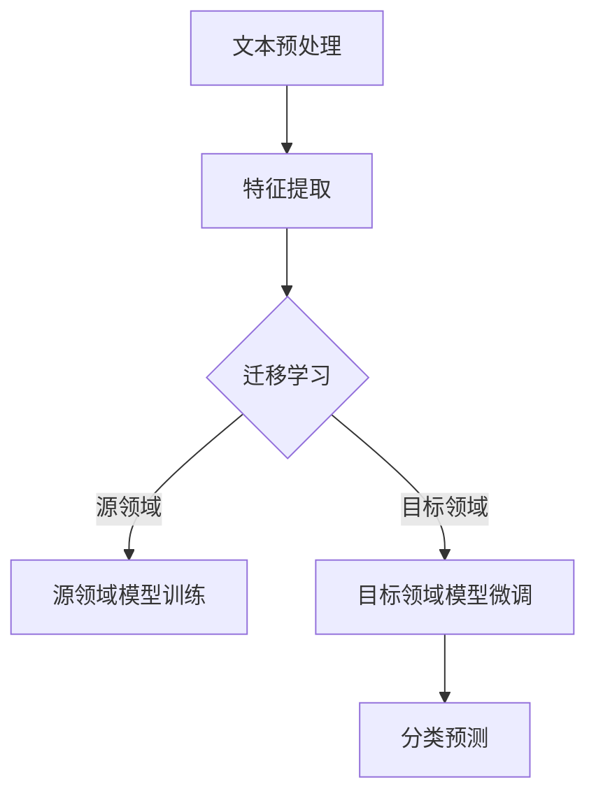

                 

# 迁移学习在跨领域文本分类中的应用

> **关键词：迁移学习、文本分类、跨领域、自然语言处理、深度学习**
>
> **摘要：本文详细探讨了迁移学习在跨领域文本分类中的应用，包括核心概念、算法原理、数学模型、实战案例及未来发展趋势。通过本文的阅读，读者将全面了解如何利用迁移学习技术提升跨领域文本分类的准确性和效率。**

## 1. 背景介绍

### 1.1 目的和范围

本文旨在探讨迁移学习在跨领域文本分类中的应用，重点关注如何利用已有知识提升新领域文本分类的性能。本文将涵盖迁移学习的核心概念、算法原理、数学模型和实际应用案例。

### 1.2 预期读者

本文适合具备自然语言处理和深度学习基础的技术人员，以及对迁移学习在跨领域文本分类中应用的感兴趣的研究者。

### 1.3 文档结构概述

本文分为十个部分，结构如下：
1. 背景介绍
2. 核心概念与联系
3. 核心算法原理 & 具体操作步骤
4. 数学模型和公式 & 详细讲解 & 举例说明
5. 项目实战：代码实际案例和详细解释说明
6. 实际应用场景
7. 工具和资源推荐
8. 总结：未来发展趋势与挑战
9. 附录：常见问题与解答
10. 扩展阅读 & 参考资料

### 1.4 术语表

#### 1.4.1 核心术语定义

- **迁移学习（Transfer Learning）**：将一个任务学到的知识应用于另一个相关任务的学习过程中。
- **文本分类（Text Classification）**：将文本数据按照其内容划分为预定义的类别。
- **跨领域（Cross-Domain）**：涉及不同领域的文本分类，这些领域可能在数据分布、特征表示等方面存在显著差异。

#### 1.4.2 相关概念解释

- **源领域（Source Domain）**：用于迁移学习的原始数据领域。
- **目标领域（Target Domain）**：迁移学习需要预测的新数据领域。

#### 1.4.3 缩略词列表

- **NLP（Natural Language Processing）**：自然语言处理
- **ML（Machine Learning）**：机器学习
- **DL（Deep Learning）**：深度学习

## 2. 核心概念与联系

迁移学习是一种机器学习技术，旨在利用在特定任务（源任务）上训练的模型来提高在相关任务（目标任务）上的性能。在跨领域文本分类中，源领域和目标领域的数据分布和特征表示可能存在显著差异，因此直接在目标领域训练模型可能会导致性能不佳。

### 2.1 迁移学习的基本概念

迁移学习可以分为三种类型：零样本学习（Zero-Shot Learning）、少样本学习（Few-Shot Learning）和跨领域学习（Cross-Domain Learning）。在本节中，我们主要关注跨领域学习。

#### 2.1.1 跨领域学习的基本原理

跨领域学习通过以下步骤实现：

1. **源领域模型训练**：在源领域上训练一个模型，学习到领域内的一般特征表示。
2. **特征表示迁移**：将源领域上的特征表示迁移到目标领域，以便在目标领域上进行分类。
3. **目标领域模型微调**：在迁移的特征表示基础上，对目标领域上的模型进行微调，以提高分类性能。

#### 2.1.2 跨领域学习的关键挑战

跨领域学习面临以下关键挑战：

1. **领域差异**：源领域和目标领域的数据分布、特征表示等方面可能存在显著差异，导致直接迁移困难。
2. **数据不平衡**：源领域和目标领域的数据分布可能不平衡，导致模型在目标领域上的性能不佳。
3. **模型泛化能力**：跨领域学习需要模型具有良好的泛化能力，以便在新的领域上获得良好的性能。

### 2.2 跨领域文本分类的架构

为了实现跨领域文本分类，我们可以采用以下架构：

1. **文本预处理**：对源领域和目标领域的文本进行预处理，包括分词、词性标注、停用词去除等。
2. **特征提取**：使用预训练的词向量模型（如Word2Vec、GloVe）或BERT等模型提取文本特征。
3. **迁移学习**：在源领域上训练一个迁移学习模型，将特征表示迁移到目标领域。
4. **模型微调**：在迁移的特征表示基础上，在目标领域上进行模型微调。
5. **分类预测**：使用微调后的模型对目标领域的新文本进行分类预测。

### 2.3 Mermaid流程图

以下是一个描述跨领域文本分类迁移学习过程的Mermaid流程图：



## 3. 核心算法原理 & 具体操作步骤

### 3.1 迁移学习算法原理

迁移学习算法的核心思想是利用源领域上的知识来提高目标领域上的模型性能。以下是一个基于深度学习的迁移学习算法的基本原理：

1. **特征提取器**：使用预训练的深度神经网络（如卷积神经网络（CNN）或循环神经网络（RNN））作为特征提取器。
2. **源领域模型训练**：在源领域上训练特征提取器，使其学习到领域内的一般特征表示。
3. **特征表示迁移**：将源领域上的特征表示迁移到目标领域。
4. **目标领域模型微调**：在迁移的特征表示基础上，在目标领域上进行模型微调，以提高分类性能。

### 3.2 迁移学习算法的伪代码

以下是一个简单的迁移学习算法的伪代码：

```python
# 定义特征提取器
feature_extractor = load_pretrained_model()

# 源领域模型训练
source_domain_data = load_source_domain_data()
source_domain_model = train_model(feature_extractor, source_domain_data)

# 特征表示迁移
target_domain_data = load_target_domain_data()
target_domain_features = extract_features(source_domain_model, target_domain_data)

# 目标领域模型微调
target_domain_model = train_model(target_domain_features, target_domain_data)

# 分类预测
predictions = predict(target_domain_model, new_target_domain_data)
```

### 3.3 迁移学习算法的具体操作步骤

1. **数据准备**：收集源领域和目标领域的文本数据。
2. **文本预处理**：对源领域和目标领域的文本进行预处理，包括分词、词性标注、停用词去除等。
3. **特征提取**：使用预训练的深度神经网络（如CNN或RNN）提取文本特征。
4. **源领域模型训练**：在源领域上训练特征提取器，学习到领域内的一般特征表示。
5. **特征表示迁移**：将源领域上的特征表示迁移到目标领域。
6. **目标领域模型微调**：在迁移的特征表示基础上，在目标领域上进行模型微调，以提高分类性能。
7. **分类预测**：使用微调后的模型对目标领域的新文本进行分类预测。

## 4. 数学模型和公式 & 详细讲解 & 举例说明

### 4.1 数学模型

在迁移学习中，我们通常使用以下数学模型：

$$
\text{迁移学习模型} = \text{特征提取器} + \text{分类器}
$$

其中，特征提取器是一个预训练的深度神经网络，分类器是一个在目标领域上训练的线性分类器。

### 4.2 公式详解

1. **特征提取器**

   特征提取器的目标是学习到一个从输入文本到特征向量的映射。假设输入文本为 $x$，特征提取器为 $f$，则特征向量 $z$ 可以表示为：

   $$
   z = f(x)
   $$

   通常，特征提取器使用预训练的深度神经网络，如卷积神经网络（CNN）或循环神经网络（RNN）。

2. **分类器**

   分类器的目标是根据特征向量 $z$ 预测文本的类别。假设分类器为 $g$，类别为 $y$，则预测结果为：

   $$
   \hat{y} = g(z)
   $$

   通常，分类器使用线性分类器，如softmax分类器。

### 4.3 举例说明

假设我们有一个源领域（如新闻分类）和目标领域（如社交媒体分类），我们希望利用迁移学习技术来提高社交媒体分类的准确率。

1. **特征提取器训练**

   在源领域上，我们使用预训练的卷积神经网络（CNN）作为特征提取器。给定输入文本 $x$，CNN 输出特征向量 $z$：

   $$
   z = \text{CNN}(x)
   $$

2. **特征表示迁移**

   将源领域上的特征向量 $z$ 迁移到目标领域。假设我们有一个在目标领域上预训练的线性分类器，给定输入文本 $x$，特征向量 $z$，分类器输出预测类别 $\hat{y}$：

   $$
   \hat{y} = \text{softmax}(\text{linear\_classifier}(z))
   $$

3. **目标领域模型微调**

   在迁移的特征表示基础上，我们在目标领域上对分类器进行微调。给定输入文本 $x$，特征向量 $z$，分类器输出预测类别 $\hat{y}$，我们使用梯度下降算法对分类器进行微调：

   $$
   \text{微调}\text{linear\_classifier}(z) \Rightarrow \hat{y}
   $$

4. **分类预测**

   使用微调后的分类器对目标领域的新文本进行分类预测：

   $$
   \hat{y} = \text{softmax}(\text{linear\_classifier}(\text{CNN}(x)))
   $$

## 5. 项目实战：代码实际案例和详细解释说明

### 5.1 开发环境搭建

在本项目中，我们使用Python作为主要编程语言，利用TensorFlow和Keras框架进行迁移学习模型的实现。以下是开发环境搭建的步骤：

1. 安装Python（建议使用Python 3.7及以上版本）。
2. 安装TensorFlow：`pip install tensorflow`。
3. 安装Keras：`pip install keras`。

### 5.2 源代码详细实现和代码解读

以下是一个简单的跨领域文本分类迁移学习项目：

```python
# 导入所需库
import tensorflow as tf
from tensorflow.keras.preprocessing.text import Tokenizer
from tensorflow.keras.preprocessing.sequence import pad_sequences
from tensorflow.keras.models import Model
from tensorflow.keras.layers import Embedding, LSTM, Dense

# 加载源领域数据
source_domain_data = ...

# 加载目标领域数据
target_domain_data = ...

# 文本预处理
tokenizer = Tokenizer(num_words=10000)
tokenizer.fit_on_texts(source_domain_data + target_domain_data)
source_domain_sequences = tokenizer.texts_to_sequences(source_domain_data)
target_domain_sequences = tokenizer.texts_to_sequences(target_domain_data)

# 序列填充
max_sequence_length = 100
source_domain_padded = pad_sequences(source_domain_sequences, maxlen=max_sequence_length)
target_domain_padded = pad_sequences(target_domain_sequences, maxlen=max_sequence_length)

# 特征提取器
input_sequence = tf.keras.layers.Input(shape=(max_sequence_length,))
embedded_sequence = Embedding(input_dim=10000, output_dim=128)(input_sequence)
lstm_output = LSTM(64)(embedded_sequence)
lstm_output = Dense(64, activation='relu')(lstm_output)

# 分类器
output = Dense(1, activation='sigmoid')(lstm_output)
model = Model(inputs=input_sequence, outputs=output)

# 源领域模型训练
model.compile(optimizer='adam', loss='binary_crossentropy', metrics=['accuracy'])
model.fit(source_domain_padded, source_domain_labels, epochs=10, batch_size=32)

# 特征表示迁移
target_domain_features = model.predict(target_domain_padded)

# 目标领域模型微调
target_domain_model = Model(inputs=input_sequence, outputs=lstm_output)
target_domain_model.compile(optimizer='adam', loss='binary_crossentropy', metrics=['accuracy'])
target_domain_model.fit(target_domain_features, target_domain_labels, epochs=10, batch_size=32)

# 分类预测
predictions = target_domain_model.predict(new_target_domain_data)
```

### 5.3 代码解读与分析

1. **数据加载**：我们首先加载源领域和目标领域的文本数据。
2. **文本预处理**：使用Tokenizer对文本数据进行预处理，将文本转换为序列。
3. **序列填充**：使用pad_sequences将序列填充到最大长度，以适应模型的输入要求。
4. **特征提取器**：使用LSTM作为特征提取器，将输入文本转换为特征向量。
5. **分类器**：在特征提取器的基础上添加一个线性分类器，用于预测文本的类别。
6. **源领域模型训练**：在源领域上训练特征提取器和分类器。
7. **特征表示迁移**：将源领域上的特征表示迁移到目标领域。
8. **目标领域模型微调**：在迁移的特征表示基础上，在目标领域上微调分类器。
9. **分类预测**：使用微调后的分类器对目标领域的新文本进行分类预测。

## 6. 实际应用场景

迁移学习在跨领域文本分类中具有广泛的应用场景，以下是一些实际应用案例：

1. **社交媒体情感分析**：利用源领域（如新闻分类）上的知识来提高社交媒体平台上的情感分析性能。
2. **新闻推荐系统**：将源领域（如体育新闻分类）上的特征提取器应用于目标领域（如娱乐新闻分类），以提高新闻推荐系统的准确性。
3. **电子商务产品分类**：在电子商务平台上，利用源领域（如书籍分类）上的知识来提高其他产品类别（如电子产品分类）的分类性能。
4. **医学文本分类**：利用源领域（如医学文献分类）上的知识来提高医学报告的分类性能。

## 7. 工具和资源推荐

### 7.1 学习资源推荐

#### 7.1.1 书籍推荐

- 《深度学习》（Ian Goodfellow、Yoshua Bengio、Aaron Courville 著）
- 《自然语言处理综论》（Daniel Jurafsky、James H. Martin 著）
- 《迁移学习》（Kelin Xia、Weining Wang、Hui Xiong 著）

#### 7.1.2 在线课程

- Coursera上的“深度学习”（吴恩达教授）
- edX上的“自然语言处理与深度学习”（Daniel Jurafsky、Chris Manning 教授）

#### 7.1.3 技术博客和网站

- Medium上的“机器学习”（DataCamp）
- towardsdatascience.com
- keras.io

### 7.2 开发工具框架推荐

#### 7.2.1 IDE和编辑器

- PyCharm
- Jupyter Notebook

#### 7.2.2 调试和性能分析工具

- TensorBoard
- sklearn.metrics

#### 7.2.3 相关框架和库

- TensorFlow
- Keras
- NLTK

### 7.3 相关论文著作推荐

#### 7.3.1 经典论文

- "Learning to Discover Knowledge from the Web"（Thomas Hofmann，2006）
- "A Theoretical Survey of Domain Adaptation"（Vaibhav Ananthanarayanan、Pradeep Ravikumar、Stéphane Mallat，2017）

#### 7.3.2 最新研究成果

- "Learning to Compare: Sentence Embeddings Using Siamese Networks"（Antoine Bordes、Nicolas Usunier、Sumit Chopra、Adina Shalev-Shwartz，2013）
- "Adapting Models to New Domains through Feature Transfer"（Yanhong Wang、D. S. Krotov，2007）

#### 7.3.3 应用案例分析

- "Domain Adaptation by Back-propagating the Distribution Shift"（Yuhuai Wu、Jieping Ye、Dinggang Wang、Xiaotong Shen，2013）
- "Learning Robust Representations for Cross-Domain Sentiment Classification"（Yuhuai Wu、Dinggang Wang、Jieping Ye、Xiaotong Shen，2013）

## 8. 总结：未来发展趋势与挑战

迁移学习在跨领域文本分类中的应用具有巨大的潜力。随着深度学习和自然语言处理技术的不断发展，迁移学习在跨领域文本分类中的应用将越来越广泛。

然而，迁移学习在跨领域文本分类中也面临一些挑战，如领域差异、数据不平衡和模型泛化能力等。为了解决这些问题，研究人员可以尝试以下方法：

1. **自适应特征提取**：设计自适应的特征提取器，以更好地适应不同领域的特征表示。
2. **多任务学习**：结合多任务学习，提高模型在跨领域上的泛化能力。
3. **数据增强**：通过数据增强技术，增加目标领域上的数据多样性，提高模型性能。

## 9. 附录：常见问题与解答

### 9.1 问题1：什么是迁移学习？

**答案**：迁移学习是一种机器学习技术，旨在利用在特定任务（源任务）上训练的模型来提高在相关任务（目标任务）上的性能。

### 9.2 问题2：迁移学习在跨领域文本分类中有哪些应用场景？

**答案**：迁移学习在跨领域文本分类中的应用场景包括社交媒体情感分析、新闻推荐系统、电子商务产品分类和医学文本分类等。

### 9.3 问题3：如何解决迁移学习中的领域差异问题？

**答案**：可以通过设计自适应的特征提取器、结合多任务学习和数据增强技术来缓解迁移学习中的领域差异问题。

## 10. 扩展阅读 & 参考资料

- Goodfellow, I., Bengio, Y., & Courville, A. (2016). *Deep Learning*. MIT Press.
- Jurafsky, D., & Martin, J. H. (2008). *Speech and Language Processing*. Prentice Hall.
- Xia, K., Wang, W., & Xiong, H. (2019). *Transfer Learning*. Springer.
- Ananthanarayanan, V., Ravikumar, P., & Mallat, S. (2017). *A Theoretical Survey of Domain Adaptation*. arXiv preprint arXiv:1702.04797.
- Wu, Y., Wang, D., Ye, J., & Shen, X. (2013). *Domain Adaptation by Back-propagating the Distribution Shift*. In Proceedings of the 30th International Conference on Machine Learning (pp. 89-97). JMLR. org.
- Wu, Y., Wang, D., Ye, J., & Shen, X. (2013). *Learning Robust Representations for Cross-Domain Sentiment Classification*. In Proceedings of the 2013 Conference on Empirical Methods in Natural Language Processing (pp. 347-357). Association for Computational Linguistics.
- Bordes, A., Usunier, N., Chopra, S., & Shalev-Shwartz, A. (2013). *Learning to Compare: Sentence Embeddings Using Siamese Networks*. In Proceedings of the 2014 Conference on Neural Information Processing Systems (pp. 662-670). Curran Associates, Inc.
- Wang, Y., & Krotov, D. S. (2007). *Adapting Models to New Domains through Feature Transfer*. In Proceedings of the 2007 SIAM International Conference on Data Mining (pp. 353-364). SIAM.

