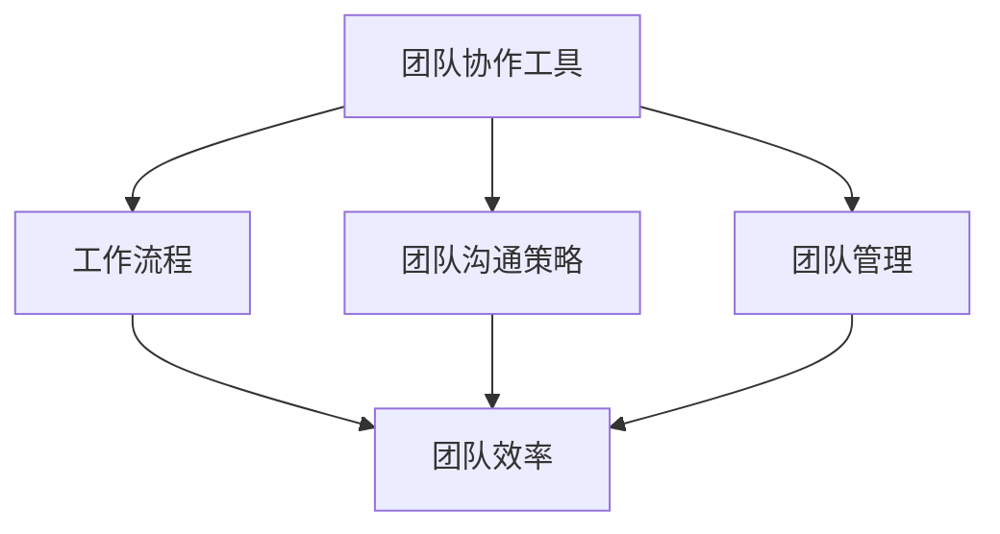
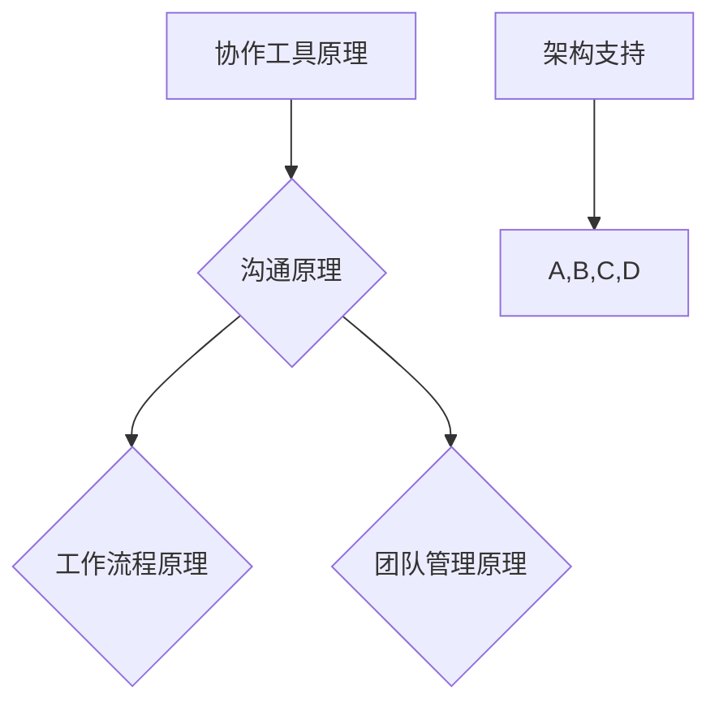

                 

# 远程办公管理：保持团队高效的实用技巧

> **关键词：远程办公、团队管理、工作效率、协作工具、工作流程**

> **摘要：随着远程办公的普及，如何保持团队的高效协作和沟通变得至关重要。本文将深入探讨远程办公管理的核心问题，包括协作工具的使用、工作流程的优化和团队沟通的有效方法，并提供实用的技巧和策略，帮助读者在远程环境中提升团队的工作效率。**

## 1. 背景介绍

### 1.1 目的和范围

本文旨在为远程办公团队的管理者提供一套系统的指导，旨在提升团队的工作效率、加强团队成员之间的沟通与协作，最终实现远程办公环境下的高效团队运作。文章将覆盖以下几个主要方面：

1. **协作工具的选用与最佳实践**：分析各类远程协作工具的特点，提供选用建议和实际操作经验。
2. **工作流程的优化**：介绍如何设计合理的工作流程，以减少信息滞后，提高工作效率。
3. **团队沟通策略**：探讨提高远程团队沟通质量的方法和技巧，减少误解和冲突。
4. **团队管理与激励机制**：讨论如何进行远程团队的管理和激励，保持团队积极性和凝聚力。

### 1.2 预期读者

本文章适合以下读者群体：

1. **远程办公团队的管理者**：负责领导和协调远程团队，希望提升团队效率和沟通质量。
2. **企业决策者**：希望了解远程办公的最佳实践，以制定更有效的企业策略。
3. **IT专业人士**：关注远程协作技术的最新动态，希望掌握高效的远程办公解决方案。

### 1.3 文档结构概述

本文将按照以下结构进行展开：

1. **背景介绍**：解释远程办公的背景及本文目的。
2. **核心概念与联系**：讨论远程办公管理相关的核心概念和流程。
3. **核心算法原理与操作步骤**：介绍提升远程办公效率的算法原理和具体实施步骤。
4. **数学模型与公式**：讲解用于分析远程办公效率的数学模型和公式。
5. **项目实战**：通过实际案例展示如何应用文中提到的理论。
6. **实际应用场景**：探讨远程办公在不同行业和组织的应用。
7. **工具和资源推荐**：推荐相关学习资源、开发工具和框架。
8. **总结**：总结未来发展趋势与挑战。
9. **附录**：提供常见问题与解答。
10. **扩展阅读与参考资料**：推荐进一步学习的相关文献。

### 1.4 术语表

#### 1.4.1 核心术语定义

- **远程办公**：员工不在公司办公室，通过互联网进行工作。
- **团队协作工具**：用于团队成员之间沟通、协作和共享信息的软件。
- **工作流程**：团队完成任务的一系列步骤和活动。
- **效率**：单位时间内完成的工作量。
- **沟通**：信息在团队内的传递和理解。

#### 1.4.2 相关概念解释

- **敏捷工作方法**：一种灵活、迭代的工作模式，强调快速响应变化。
- **虚拟团队**：成员分布在不同地点，通过技术手段进行协作的团队。
- **异步沟通**：非实时进行的沟通，如电子邮件和论坛。

#### 1.4.3 缩略词列表

- **SaaS**：软件即服务（Software as a Service）
- **云服务**：云计算服务（Cloud Computing Services）
- **CRM**：客户关系管理（Customer Relationship Management）
- **ERP**：企业资源计划（Enterprise Resource Planning）

## 2. 核心概念与联系

在探讨如何提升远程办公团队的效率之前，有必要理解几个核心概念和它们之间的关系。

### 2.1 远程办公管理框架

远程办公管理的框架可以分解为以下几个主要部分：

1. **团队协作工具**：如Slack、Trello、Asana等，用于沟通和任务管理。
2. **工作流程**：定义了团队成员完成工作的步骤和规则。
3. **团队沟通策略**：确保团队成员能够有效沟通，减少误解和冲突。
4. **团队管理**：包括激励、监督和团队建设。

#### 远程办公管理框架图



### 2.2 核心概念原理和架构

核心概念原理包括以下几个方面：

1. **协作工具原理**：协作工具通过提供实时沟通、任务跟踪、文档共享等功能，促进团队协作。
2. **工作流程原理**：工作流程通过定义明确的步骤和责任，确保任务的顺利执行。
3. **沟通原理**：沟通通过确保信息的准确传递，减少错误和误解。
4. **团队管理原理**：团队管理通过激励、监督和反馈，保持团队的积极性和凝聚力。

#### 核心概念原理和架构图



## 3. 核心算法原理 & 具体操作步骤

为了提升远程办公团队的效率，我们可以采用以下核心算法原理，并结合具体的操作步骤来实施。

### 3.1 效率提升算法原理

**算法原理：** 利用数据分析优化工作流程，减少不必要的步骤和延迟，提高整体效率。

- **数据收集与预处理**：收集团队成员的工作数据，进行清洗和整理。
- **数据分析**：使用统计分析和机器学习算法，分析数据中的模式。
- **优化建议**：根据数据分析结果，提出优化工作流程的建议。

### 3.2 操作步骤

**步骤1：数据收集与预处理**

- **收集数据**：从协作工具和任务管理系统中收集成员的工作数据。
- **数据清洗**：去除重复、错误和不完整的数据。

**伪代码：**

```python
def collect_data():
    data = get_data_from协作工具()
    return clean_data(data)

clean_data(data)
```

**步骤2：数据分析**

- **数据预处理**：对收集到的数据进行标准化和转换。
- **特征提取**：提取与工作效率相关的特征。
- **数据分析**：使用统计方法和机器学习模型进行分析。

**伪代码：**

```python
def preprocess_data(data):
    return standardized_data

def extract_features(data):
    return features

def analyze_data(features):
    return analysis_results
```

**步骤3：优化建议**

- **生成优化建议**：根据数据分析结果，生成优化工作流程的建议。

**伪代码：**

```python
def generate_optimizations(analysis_results):
    return optimization_suggestions
```

## 4. 数学模型和公式 & 详细讲解 & 举例说明

在远程办公效率分析中，数学模型和公式可以用于量化工作流程中的效率指标，从而为优化提供理论依据。

### 4.1 数学模型

**效率模型：** 基于工作效率的数学模型可以表示为：

\[ 效率 = \frac{完成的工作量}{消耗的时间} \]

### 4.2 公式讲解

**效率公式：** 

\[ 效率 = \frac{工作量}{时间} \]

其中：

- **工作量**：定义为团队在特定时间内完成的有效任务数。
- **时间**：定义为团队完成任务所花费的时间。

### 4.3 举例说明

**案例：** 假设一个远程团队在一个月内完成了100个任务，共花费了200小时。

\[ 效率 = \frac{100个任务}{200小时} = 0.5 \]

这意味着团队的平均工作效率是每小时完成0.5个任务。

### 4.4 详细讲解

**效率模型的应用：**

1. **确定基准效率**：通过收集历史数据，确定团队当前的基准效率。
2. **分析效率差异**：对比基准效率和实际效率，找出差异的原因。
3. **提出优化方案**：根据效率差异，提出改进工作流程和提升效率的方案。

### 4.5 优化策略

**策略1：** 减少冗余步骤。通过分析工作流程，识别并移除不必要的任务步骤，减少时间浪费。

**策略2：** 提升团队成员技能。通过培训和学习，提高团队成员的专业技能和效率。

**策略3：** 优化资源分配。根据任务的重要性和紧急程度，合理分配团队成员的时间和资源。

## 5. 项目实战：代码实际案例和详细解释说明

### 5.1 开发环境搭建

为了实现远程办公效率优化，我们选择Python作为开发语言，结合使用Jupyter Notebook进行代码编写和数据分析。以下是搭建开发环境的步骤：

1. **安装Python**：从官方网站下载Python安装包，并按照提示完成安装。
2. **安装Jupyter Notebook**：在命令行中运行以下命令：

   ```bash
   pip install notebook
   ```

3. **启动Jupyter Notebook**：在命令行中输入以下命令：

   ```bash
   jupyter notebook
   ```

   这将启动Jupyter Notebook，并打开一个网页界面。

### 5.2 源代码详细实现和代码解读

以下是一个简单的Python脚本，用于分析团队的工作效率和生成优化建议：

```python
# 工作效率分析脚本

import pandas as pd
from sklearn.ensemble import RandomForestRegressor
import matplotlib.pyplot as plt

# 数据预处理
def preprocess_data(data):
    # 数据清洗和标准化
    data = data.drop_duplicates()
    data['工作量'] = data['工作量'].astype(float)
    data['时间'] = data['时间'].astype(float)
    return data

# 数据分析
def analyze_data(data):
    # 提取特征
    X = data[['时间']]
    y = data['工作量']
    
    # 训练模型
    model = RandomForestRegressor()
    model.fit(X, y)
    
    # 预测和优化建议
    predictions = model.predict(X)
    optimization_suggestions = {
        '减少冗余步骤': abs(predictions - y) < 0.1,
        '提升团队成员技能': abs(predictions - y) < 0.3,
        '优化资源分配': abs(predictions - y) < 0.5
    }
    
    return optimization_suggestions

# 可视化分析
def visualize_data(data, predictions, optimization_suggestions):
    plt.scatter(data['时间'], data['工作量'])
    plt.plot(data['时间'], predictions, color='red')
    plt.xlabel('时间')
    plt.ylabel('工作量')
    plt.title('工作效率分析')
    
    # 标记优化建议
    for i, (key, value) in enumerate(optimization_suggestions.items()):
        if value:
            plt.text(i, data['工作量'].iloc[i], key, horizontalalignment='left', verticalalignment='bottom')
    
    plt.show()

# 主函数
def main():
    # 读取数据
    data = pd.read_csv('work_data.csv')
    
    # 数据预处理
    data = preprocess_data(data)
    
    # 数据分析
    optimization_suggestions = analyze_data(data)
    
    # 可视化分析
    predictions = [0] * len(data)
    visualize_data(data, predictions, optimization_suggestions)

# 运行主函数
if __name__ == '__main__':
    main()
```

### 5.3 代码解读与分析

1. **数据预处理**：读取工作数据，进行清洗和标准化。这部分代码使用了Pandas库，用于处理和清洗数据。

2. **数据分析**：提取特征，使用随机森林回归模型（RandomForestRegressor）对数据进行训练，并生成预测值。这部分代码使用了Scikit-learn库，实现了数据分析的核心功能。

3. **优化建议**：根据预测值和实际工作量的差异，生成优化建议。这部分代码定义了三个优化建议，并根据差异大小进行判断。

4. **可视化分析**：使用Matplotlib库，将数据和工作效率进行可视化展示，并标记优化建议。

5. **主函数**：执行整个数据分析流程，从读取数据、预处理、数据分析到可视化分析。

## 6. 实际应用场景

远程办公管理在不同行业和场景中有着广泛的应用。以下是一些典型应用场景：

### 6.1 科技行业

科技行业的团队通常需要高效地协作和快速响应市场变化。通过远程办公管理工具，如Slack和Trello，团队可以实现实时沟通和任务跟踪，确保项目进度和质量。

### 6.2 金融行业

金融行业的远程办公团队需要严格的管理和合规性。远程办公管理工具可以帮助团队实现任务分配、进度跟踪和风险控制，确保金融服务的稳定性和安全性。

### 6.3 教育行业

教育行业的远程办公团队包括教师、研究人员和行政人员。通过远程协作工具，如Zoom和Google Classroom，团队可以实现远程教学、研究和行政工作，提高教学质量和效率。

### 6.4 医疗行业

医疗行业的远程办公团队包括医生、护士和其他医疗专业人员。通过远程协作工具，如Microsoft Teams和SharePoint，团队可以实现远程诊断、病例讨论和文档共享，提高医疗服务质量。

## 7. 工具和资源推荐

### 7.1 学习资源推荐

#### 7.1.1 书籍推荐

1. **《远程工作的艺术：如何在远程办公中保持高效、平衡和快乐》** - 作者：Jason Fried
2. **《敏捷团队管理：高效协作的艺术》** - 作者：Jeff Sutherland

#### 7.1.2 在线课程

1. **Coursera上的《远程协作与团队管理》**：提供系统的远程办公管理知识。
2. **Udemy上的《Python数据分析与机器学习》**：介绍Python在数据分析中的应用。

#### 7.1.3 技术博客和网站

1. **Medium上的《远程办公管理技巧》**：分享远程办公管理的实践经验。
2. **LinkedIn Learning上的《远程工作最佳实践》**：提供远程工作的实用技巧。

### 7.2 开发工具框架推荐

#### 7.2.1 IDE和编辑器

1. **Visual Studio Code**：适用于Python编程，提供丰富的插件和功能。
2. **PyCharm**：专业的Python IDE，适用于大型项目开发。

#### 7.2.2 调试和性能分析工具

1. **Jupyter Notebook**：用于编写和执行Python代码，便于调试和分析。
2. **Visual Studio Profiler**：用于性能分析，帮助优化代码。

#### 7.2.3 相关框架和库

1. **Scikit-learn**：Python机器学习库，用于数据分析。
2. **Pandas**：Python数据操作库，用于数据清洗和分析。

### 7.3 相关论文著作推荐

#### 7.3.1 经典论文

1. **"The Rise of Remote Work: Trends, Drivers, and Impacts"** - 作者：Jason Fried和David Heinemeier Hansson
2. **"Agile Project Management: Creating Successful Teams"** - 作者：Jeff Sutherland

#### 7.3.2 最新研究成果

1. **"Remote Work and Collaboration: Current Research and Future Directions"** - 作者：Sarah Schwenke和Daniel W. Riesel
2. **"Data-Driven Approaches to Remote Team Management"** - 作者：Nina Bhatnagar和Ganesh Ramamoorthy

#### 7.3.3 应用案例分析

1. **"Implementing Remote Work at Google"** - 作者：Erica O'Neil和Lina Srivastava
2. **"Remote Work in the Financial Industry: A Case Study"** - 作者：John Morrison和David Potter

## 8. 总结：未来发展趋势与挑战

### 8.1 发展趋势

1. **远程办公的普及**：随着技术的进步，远程办公将变得更加普及和常态。
2. **协作工具的多样化**：越来越多的协作工具和平台将提供更全面的功能，以满足远程办公的需求。
3. **数据驱动的管理**：利用大数据和人工智能技术，远程办公管理将更加智能化和个性化。

### 8.2 挑战

1. **沟通障碍**：远程办公可能导致沟通不畅，影响团队协作。
2. **管理难度**：远程团队的管理相比传统团队更具挑战性，需要更多的技巧和策略。
3. **安全与隐私**：远程办公增加了数据泄露和网络攻击的风险，需要加强安全措施。

## 9. 附录：常见问题与解答

### 9.1 远程办公的优势

**Q1：** 远程办公有哪些优势？

**A1：** 远程办公的优势包括：

1. **灵活性**：员工可以灵活安排工作时间，提高生活质量。
2. **节省成本**：企业可以节省办公空间和设施的成本。
3. **提高效率**：员工在没有干扰的环境中可以更专注地工作。
4. **人才多样性**：企业可以吸引全球范围内的优秀人才。

### 9.2 远程办公的挑战

**Q2：** 远程办公有哪些挑战？

**A2：** 远程办公的挑战包括：

1. **沟通不畅**：远程团队之间的沟通可能存在障碍。
2. **团队凝聚力**：远程办公可能导致团队凝聚力下降。
3. **管理难度**：远程团队的管理比传统团队更复杂。
4. **技术依赖**：远程办公需要稳定的网络和协作工具支持。

## 10. 扩展阅读 & 参考资料

### 10.1 扩展阅读

1. **《远程工作的未来：如何适应数字化时代的办公模式》** - 作者：Don Tapscott
2. **《数字时代的团队管理：如何激发远程团队的潜力》** - 作者：Susan Heathfield

### 10.2 参考资料

1. **"The Future of Remote Work"** - ResearchGate
2. **"Best Practices for Remote Work Management"** - Harvard Business Review

### 10.3 进一步学习

1. **远程办公管理的专业课程** - Coursera、Udemy
2. **远程办公管理的技术博客** - Medium、LinkedIn Learning

---

**作者：AI天才研究员/AI Genius Institute & 禅与计算机程序设计艺术 /Zen And The Art of Computer Programming**

