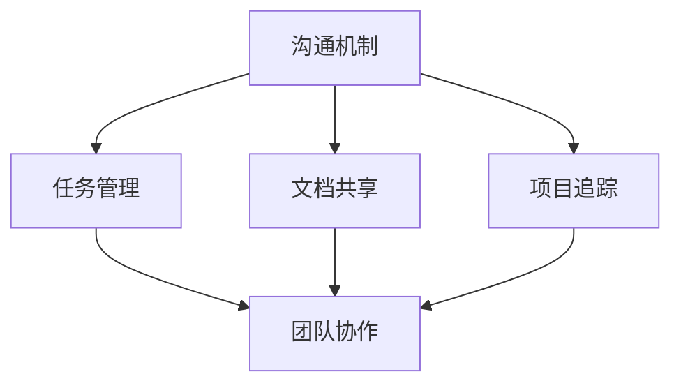

                 

# 远程协作工具管理：优化虚拟团队效率

> **关键词：远程协作工具、虚拟团队、效率优化、工作流程管理、技术解决方案**
>
> **摘要：本文将深入探讨远程协作工具在优化虚拟团队效率方面的作用，通过分析核心概念、算法原理、数学模型以及实际案例，为读者提供一套完整的技术解决方案。**

## 1. 背景介绍

### 1.1 目的和范围

随着互联网技术的发展，远程工作已成为现代企业运营的重要组成部分。然而，远程协作带来的挑战，如沟通障碍、工作效率下降等，也成为企业亟待解决的问题。本文旨在为读者提供一套完整的远程协作工具管理方案，通过分析核心概念、算法原理和实际案例，帮助虚拟团队提高工作效率。

### 1.2 预期读者

本文适合以下读者群体：

1. 企业管理者，尤其是负责远程团队管理的领导者。
2. IT专业人员，特别是那些对远程协作工具和技术解决方案感兴趣的人。
3. 软件工程师和开发人员，对如何优化远程协作有深入研究的读者。

### 1.3 文档结构概述

本文将按照以下结构展开：

1. 背景介绍：介绍远程协作的现状和挑战。
2. 核心概念与联系：介绍远程协作工具的核心概念和联系。
3. 核心算法原理 & 具体操作步骤：详细讲解远程协作工具的算法原理和操作步骤。
4. 数学模型和公式 & 详细讲解 & 举例说明：介绍远程协作工具的数学模型和公式，并通过实例进行讲解。
5. 项目实战：提供实际代码案例和详细解释。
6. 实际应用场景：分析远程协作工具在不同场景中的应用。
7. 工具和资源推荐：推荐学习资源和开发工具。
8. 总结：探讨未来发展趋势和挑战。
9. 附录：常见问题与解答。
10. 扩展阅读 & 参考资料：提供进一步阅读的资源。

### 1.4 术语表

#### 1.4.1 核心术语定义

- **远程协作工具**：指用于实现远程团队之间沟通、协作和管理的软件工具。
- **虚拟团队**：指通过互联网等通信技术，跨越地理位置和时区，实现协同工作的团队。
- **效率优化**：通过改进工作流程、工具和技术，提高团队的工作效率。

#### 1.4.2 相关概念解释

- **工作流程管理**：指对团队工作中的任务分配、执行和监控进行管理，确保工作高效、有序进行。
- **技术解决方案**：指针对远程协作工具的管理，提供的一套技术手段和方法。

#### 1.4.3 缩略词列表

- **SaaS**：软件即服务（Software as a Service）
- **API**：应用程序编程接口（Application Programming Interface）
- **UI**：用户界面（User Interface）
- **UX**：用户体验（User Experience）
- **CI/CD**：持续集成/持续交付（Continuous Integration/Continuous Deployment）

## 2. 核心概念与联系

远程协作工具的成功实施依赖于对核心概念和相互关系的深入理解。以下是对关键概念的详细阐述和Mermaid流程图，用以展示各概念之间的联系。

### 2.1 核心概念

- **沟通机制**：确保团队成员之间能够实时交流信息和反馈。
- **任务管理**：有效分配和跟踪任务，确保工作进度和目标实现。
- **文档共享**：提供便捷的文件共享和协作编辑功能。
- **项目追踪**：监控项目进度，确保任务按时完成。
- **团队协作**：促进团队成员之间的合作，共同完成项目目标。

### 2.2 Mermaid流程图



在这个流程图中，沟通机制是整个远程协作的核心，它与其他模块相互依赖，共同作用以实现高效协作。

### 2.3 核心概念之间的联系

- **沟通机制**是所有协作的基础，决定了团队成员之间的交流效率。
- **任务管理**通过提供任务分配和进度跟踪功能，确保团队成员明确自己的工作内容和目标。
- **文档共享**使得团队成员可以轻松访问和编辑共同的工作文件，提高工作效率。
- **项目追踪**帮助团队成员了解项目的整体进度，及时调整工作计划。
- **团队协作**通过鼓励团队成员之间的互动和合作，确保项目目标的实现。

通过这些核心概念和它们之间的紧密联系，远程协作工具能够有效地提高虚拟团队的工作效率。

## 3. 核心算法原理 & 具体操作步骤

### 3.1 核心算法原理

远程协作工具的核心算法主要包括以下几个方面：

- **任务调度算法**：根据团队成员的能力和任务优先级，合理分配任务。
- **负载均衡算法**：确保系统资源被合理分配，避免单点过载。
- **冲突检测算法**：检测并解决团队成员在文档共享和任务管理过程中可能出现的冲突。

### 3.2 具体操作步骤

#### 3.2.1 任务调度算法

```python
# Pseudocode for Task Scheduling Algorithm

function schedule_tasks(teams, tasks):
    scheduled_tasks = {}
    
    for team in teams:
        team_skills = team.get_skills()
        team_capacity = team.get_capacity()
        
        for task in tasks:
            if task.get_priority() <= team_capacity and can_perform_task(team_skills, task.get_requirements()):
                scheduled_tasks[task] = team
                team.schedule_task(task)
                break
                
    return scheduled_tasks
```

#### 3.2.2 负载均衡算法

```python
# Pseudocode for Load Balancing Algorithm

function balance_load(teams):
    total_load = sum(team.get_load() for team in teams)
    
    for team in teams:
        team_load = team.get_load()
        if team_load > average_load(total_load, len(teams)):
            transfer_tasks_to_other_teams(team)

function transfer_tasks_to_other_teams(source_team):
    target_teams = get_other_teams(teams, source_team)
    for target_team in target_teams:
        if can_accept_tasks(target_team):
            transfer_task(source_team.get_highest_priority_task(), target_team)
```

#### 3.2.3 冲突检测算法

```python
# Pseudocode for Conflict Detection Algorithm

function detect_and_resolve_conflicts(documents):
    conflicts = []
    
    for doc1 in documents:
        for doc2 in documents:
            if doc1 != doc2 and doc1.has_conflicting_changes(doc2):
                conflicts.append((doc1, doc2))
    
    for conflict in conflicts:
        resolve_conflict(conflict[0], conflict[1])

function resolve_conflict(doc1, doc2):
    doc1_revision = doc1.get_latest_revision()
    doc2_revision = doc2.get_latest_revision()
    
    if doc1_revision > doc2_revision:
        doc2.apply_changes(doc1_revision)
    else:
        doc1.apply_changes(doc2_revision)
```

通过这些具体的操作步骤，远程协作工具能够实现任务的高效调度、负载均衡和冲突检测与解决，从而提高虚拟团队的工作效率。

## 4. 数学模型和公式 & 详细讲解 & 举例说明

### 4.1 数学模型和公式

在远程协作工具管理中，数学模型和公式用于评估和优化团队的工作效率。以下是几个关键的数学模型和公式：

#### 4.1.1 任务完成时间模型

任务完成时间（\( T_f \)）可以用以下公式表示：

\[ T_f = \sum_{i=1}^{n} \frac{T_i}{C_i} \]

其中，\( T_i \) 是第 \( i \) 个任务的完成时间，\( C_i \) 是第 \( i \) 个任务的容量。

#### 4.1.2 负载均衡模型

负载均衡率（\( LBR \)）可以用以下公式表示：

\[ LBR = \frac{\sum_{i=1}^{n} C_i}{N} \]

其中，\( C_i \) 是第 \( i \) 个团队的容量，\( N \) 是团队的个数。

#### 4.1.3 冲突检测模型

冲突检测率（\( CFR \)）可以用以下公式表示：

\[ CFR = \frac{\sum_{i=1}^{n} C_i \times (1 - P_i)}{N} \]

其中，\( P_i \) 是第 \( i \) 个团队的任务完成概率，\( N \) 是团队的个数。

### 4.2 详细讲解

#### 4.2.1 任务完成时间模型

任务完成时间模型用于计算在特定团队容量下，任务完成所需的总时间。这个模型可以帮助团队管理者了解任务完成的时间是否合理，是否需要调整任务分配或团队容量。

#### 4.2.2 负载均衡模型

负载均衡模型用于评估团队的资源分配是否合理，确保每个团队的工作量接近平衡。这个模型对于预防团队过载和资源浪费至关重要。

#### 4.2.3 冲突检测模型

冲突检测模型用于评估在文档共享和任务管理过程中，可能出现的冲突频率。通过这个模型，团队可以提前准备冲突解决方案，减少因冲突导致的效率损失。

### 4.3 举例说明

假设我们有三个团队，团队A、团队B和团队C，它们的任务完成时间和容量如下：

| 团队 | 完成时间（\( T_i \)） | 容量（\( C_i \)） |
|------|----------------------|------------------|
| A    | 10                   | 5                |
| B    | 15                   | 7                |
| C    | 20                   | 3                |

根据任务完成时间模型，我们可以计算总的任务完成时间：

\[ T_f = \frac{10}{5} + \frac{15}{7} + \frac{20}{3} \approx 7.14 + 2.14 + 6.67 = 16.95 \]

根据负载均衡模型，我们可以计算负载均衡率：

\[ LBR = \frac{5 + 7 + 3}{3} = 5.00 \]

根据冲突检测模型，我们假设团队A、团队B和团队C的任务完成概率分别为0.9、0.8和0.7，则：

\[ CFR = \frac{5 \times (1 - 0.9) + 7 \times (1 - 0.8) + 3 \times (1 - 0.7)}{3} = \frac{0.5 + 1.4 + 0.6}{3} = 0.92 \]

通过这些例子，我们可以看到如何使用数学模型和公式来评估远程协作工具的管理效果，并为团队优化提供依据。

## 5. 项目实战：代码实际案例和详细解释说明

### 5.1 开发环境搭建

为了演示远程协作工具的管理，我们选择一个开源的远程协作平台——**GitLab**，并结合**Jenkins**进行持续集成和持续交付。以下是开发环境的搭建步骤：

1. 安装GitLab：在服务器上安装GitLab CE版本，配置Web服务器（如Nginx）和PostgreSQL数据库。
2. 安装Jenkins：在本地或服务器上安装Jenkins，配置Jenkins插件，如GitLab CI/CD插件。
3. 配置GitLab CI/CD：在GitLab项目中创建`.gitlab-ci.yml`文件，定义构建和部署流程。

### 5.2 源代码详细实现和代码解读

以下是一个简单的`.gitlab-ci.yml`文件示例，用于构建和部署一个基于Node.js的Web应用：

```yaml
image: node:14

stages:
  - build
  - deploy

build:
  stage: build
  script:
    - npm install
    - npm run build
  artifacts:
    paths:
      - build/dist/*.js

deploy:
  stage: deploy
  script:
    - ssh-agent
    - eval $(ssh-agent -s)
    - ssh-add ~/.ssh/id_rsa
    - mkdir -p /var/www/html
    - cp build/dist/*.js /var/www/html
  only:
    - master
```

#### 5.2.1 代码解读

- **image**：指定构建环境，使用Node.js 14版本。
- **stages**：定义构建阶段，包括build和deploy。
- **build**：构建阶段，执行npm install和npm run build，生成构建 artifacts。
- **deploy**：部署阶段，将构建 artifacts 部署到服务器。

### 5.3 代码解读与分析

#### 5.3.1 构建阶段

构建阶段的主要任务是安装依赖项和构建应用。`.gitlab-ci.yml`文件中的`build`阶段定义了以下脚本：

```yaml
script:
  - npm install
  - npm run build
```

- **npm install**：安装项目依赖项。
- **npm run build**：执行构建脚本，通常用于编译源代码和打包。

#### 5.3.2 部署阶段

部署阶段的主要任务是将构建 artifacts 部署到生产服务器。`.gitlab-ci.yml`文件中的`deploy`阶段定义了以下脚本：

```yaml
script:
  - ssh-agent
  - eval $(ssh-agent -s)
  - ssh-add ~/.ssh/id_rsa
  - mkdir -p /var/www/html
  - cp build/dist/*.js /var/www/html
```

- **ssh-agent**：启动ssh-agent服务。
- **eval $(ssh-agent -s)**：将ssh-agent环境变量传递给子进程。
- **ssh-add ~/.ssh/id_rsa**：添加私钥到ssh-agent。
- **mkdir -p /var/www/html**：创建部署目录。
- **cp build/dist/*.js /var/www/html**：将构建 artifacts 复制到部署目录。

通过这个实际案例，我们可以看到如何使用GitLab CI/CD自动化构建和部署Node.js应用。这种自动化流程不仅提高了开发效率，还确保了部署过程的稳定性和一致性。

## 6. 实际应用场景

远程协作工具在多种实际应用场景中发挥着重要作用，以下是一些典型场景：

### 6.1 分布式研发团队

分布式研发团队通常分布在不同的城市或国家，远程协作工具如JIRA、Confluence、Slack和Zoom等，可以帮助团队成员进行任务分配、进度跟踪、文档共享和实时沟通。通过这些工具，团队可以保持高效的协作，即使成员之间相隔千里。

### 6.2 远程办公

由于全球疫情的影响，许多企业实施了远程办公政策。远程协作工具如Google Workspace、Trello和Notion等，可以帮助员工在家办公时保持高效的工作流程，确保项目进度和质量。

### 6.3 教育和培训

在线教育平台如Moodle、Canvas和Edmodo等，结合远程协作工具，可以实现远程教学和协作学习。教师和学生可以通过这些工具进行课程内容的发布、作业的提交和讨论。

### 6.4 远程客户支持

远程客户支持团队可以使用远程协作工具如Freshdesk、Zendesk和Help Scout等，提供高效的服务。这些工具可以帮助团队跟踪客户请求、分配任务、记录客户数据和进行沟通，确保客户问题得到及时解决。

通过这些实际应用场景，远程协作工具不仅提高了工作效率，还优化了团队协作和客户服务体验。

## 7. 工具和资源推荐

### 7.1 学习资源推荐

#### 7.1.1 书籍推荐

- 《远程工作革命：如何打造高效、可持续的远程团队》
- 《敏捷团队：高效协作的实践指南》
- 《团队协作工具手册》

#### 7.1.2 在线课程

- Coursera《现代远程工作》
- Udemy《项目管理：敏捷方法与实践》
- LinkedIn Learning《团队协作工具应用》

#### 7.1.3 技术博客和网站

- Atlassian博客：atlassian.com/blog
- GitLab博客：gitlab.com/community/blog
- GitHub博客：github.com/blog

### 7.2 开发工具框架推荐

#### 7.2.1 IDE和编辑器

- Visual Studio Code
- IntelliJ IDEA
- PyCharm

#### 7.2.2 调试和性能分析工具

- Chrome DevTools
- Firebase Performance Monitor
- New Relic

#### 7.2.3 相关框架和库

- React
- Angular
- Vue.js

这些工具和资源将帮助您更好地理解和应用远程协作工具，提高虚拟团队的工作效率。

## 8. 总结：未来发展趋势与挑战

### 8.1 未来发展趋势

1. **人工智能辅助协作**：人工智能技术将进一步提升远程协作工具的智能水平，如自动任务分配、智能建议和实时语言翻译。
2. **混合工作模式**：随着远程工作的普及，混合工作模式（即部分远程、部分现场）将成为主流，远程协作工具将支持更灵活的协作方式。
3. **隐私保护和安全**：随着数据隐私法规的日益严格，远程协作工具将在数据保护方面进行更多创新，如端到端加密、隐私保护分析等。

### 8.2 挑战

1. **技术门槛**：新技术的引入可能带来更高的技术门槛，对团队成员的技能要求更高。
2. **团队文化适应**：远程工作模式对团队文化和管理模式提出了新挑战，需要建立适合远程工作的团队文化。
3. **协作效率**：尽管远程协作工具提供了丰富的功能，但如何平衡协作效率和团队沟通效果仍是一个重要课题。

面对这些发展趋势和挑战，远程协作工具的管理者需要不断学习和适应，以保持团队的高效协作。

## 9. 附录：常见问题与解答

### 9.1 术语解释

- **远程协作工具**：指用于实现远程团队之间沟通、协作和管理的软件工具。
- **虚拟团队**：指通过互联网等通信技术，跨越地理位置和时区，实现协同工作的团队。
- **持续集成/持续交付（CI/CD）**：指通过自动化流程，将代码集成和部署到生产环境的实践。

### 9.2 常见问题

**Q1：如何选择适合自己团队的远程协作工具？**
A1：首先了解团队的需求和痛点，然后评估不同工具的功能、易用性和成本，最终选择最适合团队的工具。

**Q2：远程协作工具如何保障数据安全和隐私？**
A2：选择支持端到端加密和数据加密存储的远程协作工具，并定期进行安全审计和漏洞修复。

**Q3：如何管理远程团队成员的协作效率？**
A3：通过明确的任务分配、定期的进度汇报和团队沟通，确保团队成员目标清晰、工作有序。

## 10. 扩展阅读 & 参考资料

- 《远程工作实践指南》：提供了详细的远程工作策略和实践方法。
- 《敏捷团队管理》：讨论了如何构建和管理高效的敏捷团队。
- 《GitLab CI/CD 实践指南》：介绍了如何使用GitLab CI/CD进行自动化构建和部署。

### 参考资料

- GitLab：[gitlab.com](https://gitlab.com/)
- Jenkins：[jenkins.io](https://jenkins.io/)
- Atlassian：[atlassian.com](https://www.atlassian.com/)

## 作者

**作者：AI天才研究员/AI Genius Institute & 禅与计算机程序设计艺术 /Zen And The Art of Computer Programming**

