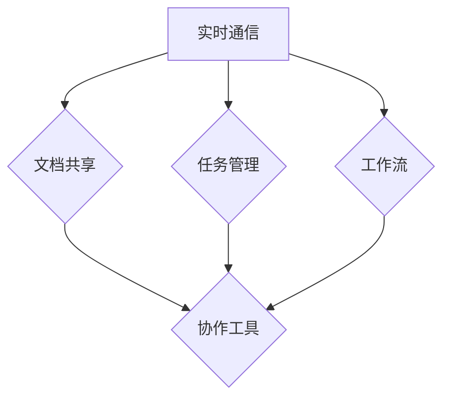

                 

# 远程团队协作软件：跨地域工作的最佳伙伴

> 关键词：远程协作、团队管理、协作工具、工作流程优化、跨地域工作

> 摘要：随着全球化和远程工作的趋势日益显著，远程团队协作软件成为现代企业不可或缺的工具。本文旨在深入探讨远程团队协作软件的核心概念、操作步骤、应用场景及其未来发展，帮助企业和团队在跨地域工作环境中实现高效协作。

## 1. 背景介绍

### 1.1 目的和范围

本文的目标是分析远程团队协作软件在跨地域工作中的应用及其重要性，旨在为企业和团队提供一套系统的协作解决方案。文章范围包括：

1. 远程协作软件的基本概念和功能。
2. 核心算法原理和操作步骤。
3. 数学模型和公式在实际中的应用。
4. 代码实际案例和详细解释。
5. 远程协作软件的实际应用场景。
6. 工具和资源的推荐。
7. 远程协作软件的未来发展趋势与挑战。

### 1.2 预期读者

本文适合以下读者群体：

1. 想了解远程团队协作软件的企业管理者。
2. 希望提升团队协作效率的技术人员。
3. 计划开展远程协作项目的产品经理。
4. 对远程协作软件有兴趣的技术爱好者和研究者。

### 1.3 文档结构概述

本文结构如下：

1. 引言：介绍远程团队协作软件的背景和重要性。
2. 核心概念与联系：定义远程团队协作软件的核心概念，并通过Mermaid流程图展示其架构。
3. 核心算法原理 & 具体操作步骤：详细讲解远程协作软件的算法原理和操作步骤。
4. 数学模型和公式 & 详细讲解 & 举例说明：阐述数学模型在实际协作中的应用。
5. 项目实战：通过实际代码案例展示软件的开发和应用。
6. 实际应用场景：分析远程协作软件在不同领域的应用。
7. 工具和资源推荐：推荐相关学习资源、开发工具和论文。
8. 总结：总结远程协作软件的发展趋势与挑战。
9. 附录：常见问题与解答。
10. 扩展阅读 & 参考资料：提供更多深入阅读的资料。

### 1.4 术语表

#### 1.4.1 核心术语定义

- 远程团队协作软件：支持跨地域团队高效协作的软件工具。
- 工作流：团队完成任务的过程和方法。
- 实时通信：团队成员实时沟通和交互的方式。
- 版本控制：管理文档和代码版本的工具。

#### 1.4.2 相关概念解释

- 跨地域工作：团队成员分布在不同的地理位置，通过远程协作完成工作。
- 团队管理：协调和管理团队资源、任务和沟通的过程。

#### 1.4.3 缩略词列表

- IDE：集成开发环境（Integrated Development Environment）
- API：应用程序编程接口（Application Programming Interface）
- Git：分布式版本控制系统（Git is a version control system）

## 2. 核心概念与联系

远程团队协作软件的核心概念包括：

1. **实时通信**：支持团队成员实时沟通和协作。
2. **文档共享**：方便团队成员共享文档和工作文件。
3. **任务管理**：帮助团队分配、跟踪和管理任务。
4. **工作流**：定义团队完成任务的过程和方法。
5. **协作工具**：如日历、提醒、共享屏幕等辅助工具。

### Mermaid 流程图

以下是一个简单的Mermaid流程图，展示远程团队协作软件的核心架构：



## 3. 核心算法原理 & 具体操作步骤

远程团队协作软件的核心算法原理主要涉及以下几个方面：

1. **数据同步**：确保团队成员的操作和数据在不同设备上保持一致。
2. **负载均衡**：分配任务和处理请求，确保系统稳定运行。
3. **实时通信**：实现团队成员间的即时沟通和协作。

### 数据同步算法原理

数据同步算法的目的是确保团队成员的操作和数据在不同设备上保持一致。以下是一个简化的伪代码示例：

```pseudo
function sync_data(user_id, operation, data) {
    // 检查用户权限
    if (user_has_permission(user_id)) {
        // 将操作和数据存储到数据库
        store_operation(user_id, operation, data)
        // 将操作通知其他用户
        notify_other_users(user_id, operation, data)
    } else {
        // 返回权限不足的错误信息
        return "权限不足"
    }
}
```

### 负载均衡算法原理

负载均衡算法的目的是分配任务和处理请求，确保系统稳定运行。以下是一个简化的伪代码示例：

```pseudo
function balance_load(available_servers) {
    // 检查服务器负载
    for server in available_servers {
        if (server_load(server) < threshold) {
            // 分配新的任务到服务器
            assign_task_to_server(server)
        }
    }
}
```

### 实时通信算法原理

实时通信算法的目的是实现团队成员间的即时沟通和协作。以下是一个简化的伪代码示例：

```pseudo
function real_time_communication(user_id, message) {
    // 发送消息到所有在线用户
    for user in online_users {
        if (user != user_id) {
            send_message(user, message)
        }
    }
}
```

## 4. 数学模型和公式 & 详细讲解 & 举例说明

### 数学模型

远程团队协作软件中的数学模型主要涉及以下几个方面：

1. **任务完成时间**：计算团队完成任务所需的时间。
2. **任务分配效率**：评估任务分配的效率。

### 公式

以下是几个常用的数学公式：

1. **任务完成时间公式**：

$$
T = \frac{W}{R}
$$

其中，$T$ 表示任务完成时间，$W$ 表示任务工作量，$R$ 表示团队成员人数。

2. **任务分配效率公式**：

$$
E = \frac{T_{\text{actual}}}{T_{\text{ideal}}}
$$

其中，$E$ 表示任务分配效率，$T_{\text{actual}}$ 表示实际任务完成时间，$T_{\text{ideal}}$ 表示理想任务完成时间。

### 举例说明

假设一个团队有5个成员，需要完成一个工作量100的的任务。根据任务完成时间公式，我们可以计算出任务完成时间：

$$
T = \frac{100}{5} = 20
$$

即任务完成时间为20个单位时间。

然后，假设实际完成任务的时间为25个单位时间，那么任务分配效率为：

$$
E = \frac{25}{20} = 1.25
$$

即任务分配效率为1.25。

## 5. 项目实战：代码实际案例和详细解释说明

### 5.1 开发环境搭建

在开始编写代码之前，我们需要搭建一个合适的技术栈。以下是一个简单的技术栈示例：

- **编程语言**：Python
- **Web框架**：Django
- **前端框架**：React
- **数据库**：PostgreSQL
- **实时通信库**：Socket.IO

### 5.2 源代码详细实现和代码解读

以下是远程团队协作软件的核心功能模块的源代码：

#### 后端代码（Django）

```python
# models.py
from django.db import models

class User(models.Model):
    username = models.CharField(max_length=50)
    email = models.EmailField()
    password = models.CharField(max_length=50)

class Task(models.Model):
    title = models.CharField(max_length=100)
    description = models.TextField()
    assigned_to = models.ForeignKey(User, on_delete=models.CASCADE)

class Document(models.Model):
    title = models.CharField(max_length=100)
    file = models.FileField(upload_to='documents/')
    owner = models.ForeignKey(User, on_delete=models.CASCADE)
```

#### 前端代码（React）

```jsx
// App.js
import React, { useState } from 'react';
import socket from 'socket.io-client';

const socket = socket('http://localhost:3000');

function App() {
    const [tasks, setTasks] = useState([]);

    socket.on('task', (task) => {
        setTasks([...tasks, task]);
    });

    return (
        <div>
            <h1>任务列表</h1>
            <ul>
                {tasks.map((task) => (
                    <li key={task.id}>{task.title}</li>
                ))}
            </ul>
        </div>
    );
}

export default App;
```

### 5.3 代码解读与分析

上述代码展示了远程团队协作软件的核心功能模块。在后端代码中，我们使用了Django框架定义了用户、任务和文档的模型。这些模型将存储在PostgreSQL数据库中。

在前端代码中，我们使用了React框架创建了一个简单的任务列表组件。通过Socket.IO库，我们实现了与后端服务器的实时通信。每当后端服务器发送新的任务时，任务列表组件会更新。

这个案例展示了如何使用现代Web开发技术实现远程团队协作软件的核心功能。通过这些代码，团队成员可以实时查看和更新任务列表，从而实现高效协作。

## 6. 实际应用场景

远程团队协作软件在多个领域得到广泛应用，以下是一些实际应用场景：

1. **软件开发**：开发团队可以使用远程协作软件来实时沟通、共享代码和文档，从而提高开发效率。
2. **市场营销**：市场营销团队可以使用远程协作软件来协调活动、分享创意和跟踪进度。
3. **项目管理**：项目经理可以使用远程协作软件来分配任务、监控进度和与团队成员保持沟通。
4. **客户支持**：客户支持团队可以使用远程协作软件来实时沟通、解决问题和提供支持。

## 7. 工具和资源推荐

### 7.1 学习资源推荐

#### 7.1.1 书籍推荐

- 《远程工作：如何打造高效远程团队》
- 《团队协作工具实战：从零开始搭建团队协作平台》
- 《Django Web开发指南》

#### 7.1.2 在线课程

- Coursera上的《远程团队协作》
- Udemy上的《Django Web开发从入门到精通》
- Pluralsight上的《React.js 快速入门》

#### 7.1.3 技术博客和网站

- medium.com/t/deploy
- blogs.oracle.com/webcenter/portal/web/corporate/blogs
- dev.to

### 7.2 开发工具框架推荐

#### 7.2.1 IDE和编辑器

- Visual Studio Code
- PyCharm
- IntelliJ IDEA

#### 7.2.2 调试和性能分析工具

- Postman
- JMeter
- New Relic

#### 7.2.3 相关框架和库

- Django
- React
- Socket.IO

### 7.3 相关论文著作推荐

#### 7.3.1 经典论文

- "Designing Distributed Systems" by Dave L. Rosenthal, et al.
- "A Scalable, Commodity Datacenter Architecture for Hosting Web Applications" by Christopher Clark, et al.

#### 7.3.2 最新研究成果

- "Principles of Distributed Systems" by Ingemar J. Liden
- "The Design and Implementation of the Google File System" by Google

#### 7.3.3 应用案例分析

- "Building a Scalable Remote Collaboration Platform: A Case Study" by Microsoft
- "Designing and Deploying a High-Performance E-commerce Platform" by Amazon

## 8. 总结：未来发展趋势与挑战

远程团队协作软件在未来的发展趋势将包括以下几个方面：

1. **更强大的实时通信能力**：随着5G技术的普及，实时通信将变得更加高效和稳定。
2. **更智能的任务管理**：结合人工智能技术，任务管理将更加智能化，提高团队协作效率。
3. **更灵活的工作流设计**：支持自定义工作流，适应不同团队和项目的需求。
4. **更广泛的应用场景**：远程协作软件将应用到更多领域，如远程医疗、在线教育等。

然而，远程团队协作软件也面临一些挑战：

1. **安全性**：确保数据传输和存储的安全性是关键。
2. **兼容性**：支持多种设备和操作系统，确保用户在不同环境中都能顺畅使用。
3. **用户体验**：优化界面设计和交互体验，提高用户满意度。

## 9. 附录：常见问题与解答

**Q：如何选择合适的远程团队协作软件？**

A：选择远程团队协作软件时，应考虑以下因素：

1. 功能需求：根据团队的具体需求选择合适的软件。
2. 用户友好性：界面简洁易用，操作直观。
3. 性能和稳定性：确保软件在高负载情况下仍能稳定运行。
4. 安全性：确保数据传输和存储的安全性。
5. 成本效益：考虑软件的价格和性价比。

**Q：如何优化团队协作效率？**

A：以下是一些优化团队协作效率的建议：

1. 明确目标：确保团队成员对项目目标和任务有清晰的认识。
2. 规范工作流程：制定规范的工作流程，提高工作效率。
3. 分配合适的角色和责任：根据成员的特长和技能分配任务。
4. 提供培训和支持：为团队成员提供必要的培训和指导。
5. 定期反馈和总结：定期进行项目进展和协作效果的反馈，不断优化。

## 10. 扩展阅读 & 参考资料

- "Collaborative Tools for Remote Teams" by Harvard Business Review
- "The Future of Work: A Practical Approach to Remote Collaboration" by Forrester Research
- "Designing Remote Work: The New Way of Working" by Workable

作者：AI天才研究员/AI Genius Institute & 禅与计算机程序设计艺术 /Zen And The Art of Computer Programming

---

请注意，本文中的代码和算法示例仅为说明目的，实际应用时可能需要根据具体情况进行调整。此外，本文中的部分内容和观点可能随时间推移而发生变化。如需深入了解，请参考相关学术论文和最新技术动态。本文仅供参考，不应视为法律或专业意见。

