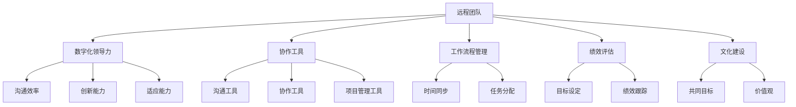

                 

### 远程团队管理：数字时代的领导挑战

> **关键词**：远程团队管理、数字化领导、领导力、团队协作、技术工具、虚拟团队
> 
> **摘要**：本文深入探讨了在数字时代背景下，远程团队管理的挑战与解决方案。通过阐述远程团队管理的关键概念和核心算法原理，本文为管理者提供了实用的策略和工具，帮助他们在全球分布式团队中实现高效的领导与协作。

随着全球化进程的加速和互联网技术的普及，远程工作已经成为现代职场的新常态。无论是跨时区合作、分布式团队，还是完全远程办公，远程团队管理都面临着一系列独特的挑战。这些挑战不仅影响了团队的工作效率和成员的满意度，也对公司的整体战略目标产生了深远的影响。因此，如何有效管理远程团队，成为了企业管理者和IT专业人士亟需解决的重要问题。

本文将围绕以下几个核心问题进行探讨：
1. **远程团队管理的核心概念**：我们将明确远程团队与传统的本地团队的区别，并介绍远程团队管理的核心原则和关键成功因素。
2. **领导力的数字化转变**：我们将分析数字时代领导力面临的变革，并探讨如何培养和管理数字化领导力。
3. **远程团队协作的策略与工具**：我们将介绍一系列有效的远程协作工具，并分析如何将它们集成到团队管理中。
4. **项目实战与案例分析**：通过实际案例，我们将展示如何在实际项目中应用远程团队管理策略。
5. **未来发展趋势与挑战**：我们将预测远程团队管理可能面临的未来趋势和挑战，并提出相应的应对策略。

总之，本文旨在为远程团队管理者提供一套系统化的方法论和实用工具，帮助他们在数字时代中实现高效的领导和管理。

### 1. 背景介绍

#### 1.1 目的和范围

本文的目标是深入探讨远程团队管理在数字时代的挑战与解决方案。随着全球化和数字化进程的加速，远程工作已经成为现代企业运营的常见模式。然而，远程团队管理并非简单的地理位置变换，它涉及到一系列复杂的挑战，如沟通障碍、文化差异、工作环境监控等。本文将通过详细的案例分析和技术工具的介绍，为管理者提供实用的指导，帮助他们在全球分布式团队中实现高效的领导与协作。

本文的范围包括以下几个方面：
1. **核心概念与联系**：我们将介绍远程团队管理的关键概念，并通过Mermaid流程图展示其基本架构和组成部分。
2. **领导力与团队管理策略**：我们将分析数字时代领导力的转变，探讨如何培养和管理数字化领导力，并介绍一系列有效的团队管理策略。
3. **远程协作工具**：我们将介绍当前流行的远程协作工具，分析其功能和应用场景，并提供集成到团队管理中的实用方法。
4. **实际案例与项目实战**：通过具体案例，我们将展示如何将上述概念和策略应用于实际项目，并提供详细的代码和实现步骤。
5. **未来趋势与挑战**：我们将预测远程团队管理可能面临的新趋势和挑战，并提出相应的应对策略。

本文的受众主要包括以下几类：
1. **企业管理者和IT专业人士**：他们需要了解远程团队管理的最佳实践，以提升团队效率和生产力。
2. **远程团队管理者**：他们需要掌握有效的领导和管理策略，以应对远程团队的特殊挑战。
3. **研究人员和学者**：他们希望了解远程团队管理领域的最新研究进展和应用案例。
4. **对远程工作和管理感兴趣的普通读者**：他们希望通过本文了解远程团队管理的核心概念和实用工具。

#### 1.2 预期读者

本文的预期读者应具备以下背景知识：
1. **基础管理知识**：了解团队管理和领导力的基本概念，如目标设定、绩效评估、沟通策略等。
2. **基本的计算机技能**：了解常用的远程协作工具，如Slack、Zoom、Trello等。
3. **对远程工作的理解**：了解远程工作的优势和挑战，以及远程团队管理的关键问题。

通过阅读本文，读者可以期望获得以下收益：
1. **深入理解远程团队管理的核心概念**：通过详细的分析和案例，了解远程团队管理的挑战和解决方案。
2. **掌握实用的团队管理策略**：学习如何在数字时代中培养和管理数字化领导力，并应用有效的团队管理策略。
3. **了解远程协作工具的集成与应用**：了解当前流行的远程协作工具，并学会如何将其集成到团队管理中，提升团队协作效率。
4. **提升实际操作能力**：通过实际案例和项目实战，掌握远程团队管理的具体操作步骤和实现方法。
5. **展望未来趋势与挑战**：了解远程团队管理可能面临的未来趋势和挑战，为未来的团队管理做好准备。

#### 1.3 文档结构概述

本文的结构分为十个主要部分，旨在系统化地探讨远程团队管理的核心概念和实际应用。具体结构如下：

1. **引言**：介绍远程团队管理的背景和重要性，提出本文的核心问题和目标。
2. **背景介绍**：
   - **目的和范围**：明确本文的目的和覆盖范围。
   - **预期读者**：介绍预期读者的背景知识和预期收益。
   - **文档结构概述**：概述本文的整体结构和各部分内容。
3. **核心概念与联系**：
   - **核心概念介绍**：介绍远程团队管理的关键概念。
   - **Mermaid流程图**：展示远程团队管理的基本架构和组成部分。
4. **领导力与团队管理策略**：
   - **数字时代领导力的转变**：分析数字时代领导力的特征和挑战。
   - **团队管理策略**：介绍一系列有效的团队管理策略。
5. **远程协作工具**：
   - **协作工具介绍**：介绍当前流行的远程协作工具。
   - **工具集成与应用**：分析如何将协作工具集成到团队管理中。
6. **项目实战：代码实际案例和详细解释说明**：
   - **开发环境搭建**：介绍项目开发环境的基本搭建过程。
   - **源代码详细实现和代码解读**：展示具体的代码实现和解读。
   - **代码解读与分析**：对代码进行深入分析和解释。
7. **实际应用场景**：探讨远程团队管理的实际应用场景。
8. **工具和资源推荐**：
   - **学习资源推荐**：推荐相关的书籍、在线课程和技术博客。
   - **开发工具框架推荐**：推荐适合远程团队管理的开发工具和框架。
   - **相关论文著作推荐**：推荐经典的和最新的相关论文和研究著作。
9. **总结：未来发展趋势与挑战**：预测远程团队管理的未来趋势和挑战。
10. **附录：常见问题与解答**：提供常见问题的解答和说明。
11. **扩展阅读 & 参考资料**：列出本文引用的相关资料和参考文献。

通过本文的结构化内容，读者可以逐步了解远程团队管理的核心概念、策略和实践，从而提升自身的远程团队管理能力。

#### 1.4 术语表

为了确保本文内容的清晰和一致，我们定义了一系列关键术语，并给出相应的解释。

##### 1.4.1 核心术语定义

1. **远程团队管理**：指在非集中式工作环境中，通过技术工具和策略，对分布在不同地理位置的团队成员进行协调、管理和监督的过程。
2. **数字化领导力**：指在数字时代，领导者通过利用信息技术和数字化工具，提升团队协作效率、创新能力和适应能力的能力。
3. **远程协作工具**：指支持远程团队成员进行沟通、协作和管理的软件和应用程序，如Slack、Zoom、Trello等。
4. **虚拟团队**：指通过互联网和通信技术，将地理位置分散的团队成员连接起来，实现共同工作目标的团队。
5. **敏捷管理**：一种灵活、迭代和以人为本的管理方法，强调快速响应变化、持续交付价值和团队自我管理。

##### 1.4.2 相关概念解释

1. **分布式团队**：指团队成员分布在不同的地理位置，通过远程协作工具和技术进行沟通和协作的团队。
2. **时间同步**：确保团队成员在不同时区进行协调和沟通，减少因时差带来的沟通障碍和工作效率降低。
3. **文化差异**：不同国家和地区的团队成员在价值观、工作习惯和文化背景上的差异，可能影响团队的协作和沟通效果。
4. **团队默契**：团队成员之间建立的信任和协作关系，有助于提高团队的整体绩效和协作效率。

##### 1.4.3 缩略词列表

1. **Agile**：敏捷（敏捷管理）
2. **IoT**：物联网（Internet of Things）
3. **SaaS**：软件即服务（Software as a Service）
4. **PaaS**：平台即服务（Platform as a Service）
5. **IaaS**：基础设施即服务（Infrastructure as a Service）
6. **CRM**：客户关系管理（Customer Relationship Management）
7. **ERP**：企业资源规划（Enterprise Resource Planning）
8. **API**：应用程序编程接口（Application Programming Interface）
9. **SDLC**：软件开发生命周期（Software Development Life Cycle）

通过定义这些核心术语和相关概念，我们确保读者能够准确理解和应用本文中的关键概念，为后续内容的学习和讨论奠定基础。

## 2. 核心概念与联系

远程团队管理是一个复杂的过程，涉及多个核心概念和它们之间的相互联系。为了更好地理解和应用这些概念，我们将通过Mermaid流程图来展示其基本架构和组成部分。以下是远程团队管理的一些关键概念和它们的相互关系：

### 2.1 关键概念

1. **远程团队**：指在非集中式工作环境中，通过远程协作工具和通信技术进行协作和管理的团队。
2. **数字化领导力**：指利用信息技术和数字化工具，提升团队协作效率、创新能力和适应能力的能力。
3. **协作工具**：支持团队成员沟通、协作和管理的软件和应用程序，如Slack、Zoom、Trello等。
4. **工作流程管理**：确保团队成员在不同时区进行协调和沟通，减少因时差带来的沟通障碍和工作效率降低。
5. **绩效评估**：定期评估团队成员的工作表现，为改进和优化团队管理提供数据支持。
6. **文化建设**：建立共同的目标和价值观，促进团队成员之间的信任和协作。

### 2.2 Mermaid流程图

下面是一个简单的Mermaid流程图，展示了远程团队管理的基本架构和组成部分：



### 2.3 核心概念关系分析

1. **远程团队与数字化领导力**：远程团队的成功离不开数字化领导力。数字化领导力帮助领导者利用信息技术和工具，提高沟通效率、创新能力和适应能力，从而更好地管理远程团队。

2. **远程团队与协作工具**：协作工具是远程团队管理的重要组成部分。这些工具支持团队成员进行实时沟通、任务分配和项目管理，确保团队在不同时区和工作环境中保持高效协作。

3. **远程团队与工作流程管理**：工作流程管理确保团队成员在不同时区进行协调和沟通，减少因时差带来的沟通障碍和工作效率降低。这包括时间同步、任务分配和进度跟踪等关键环节。

4. **远程团队与绩效评估**：绩效评估是远程团队管理的重要手段。通过设定明确的绩效目标和定期跟踪团队成员的工作表现，管理者可以及时发现和解决团队中的问题，提升整体绩效。

5. **远程团队与文化建设**：文化建设是远程团队管理的基石。通过建立共同的目标和价值观，促进团队成员之间的信任和协作，有助于提高团队的整体绩效和创新能力。

通过以上分析，我们可以看出，远程团队管理不仅涉及多个核心概念，而且这些概念之间存在着紧密的联系和相互作用。了解和掌握这些核心概念及其关系，是成功管理远程团队的关键。

### 2.4 核心算法原理 & 具体操作步骤

在远程团队管理中，核心算法原理和具体操作步骤对于实现高效管理和协作至关重要。以下我们将详细阐述一种基于敏捷管理的核心算法原理，并提供具体的操作步骤。

#### 2.4.1 核心算法原理

敏捷管理（Agile Management）是一种灵活、迭代和以人为本的管理方法，特别适用于远程团队。其核心算法原理包括以下几个方面：

1. **迭代开发**：将整个项目划分为多个短周期（通常为2-4周）的迭代，每个迭代都包括计划、执行、评估和回顾阶段。
2. **持续交付**：在每个迭代周期内，团队持续交付可用的产品增量，确保项目在每一步都保持进展和可控。
3. **客户反馈**：在每个迭代结束时，获取客户或利益相关者的反馈，根据反馈调整后续迭代的工作计划和目标。
4. **团队自我管理**：团队成员自主管理自己的工作，包括任务分配、进度跟踪和问题解决，领导者更多扮演指导和支持的角色。

#### 2.4.2 具体操作步骤

1. **计划阶段**：

   - **目标设定**：明确每个迭代的目标和关键成果，确保团队成员对目标有清晰的理解。
   - **任务分配**：根据团队成员的技能和兴趣，分配任务和责任，确保每个人都知道自己的角色和任务。
   - **时间安排**：制定迭代时间表，确定每个任务的开始和结束时间，确保任务在规定时间内完成。

2. **执行阶段**：

   - **日常站会**：每天举行短期的站会，团队成员汇报进度和遇到的问题，确保团队整体工作保持透明和协调。
   - **任务跟踪**：使用项目管理工具（如JIRA、Trello等）跟踪任务进度，确保每个任务都在正确轨道上。
   - **问题解决**：团队成员自主解决问题，领导者提供必要的指导和支持。

3. **评估阶段**：

   - **迭代回顾**：在迭代结束时，团队举行回顾会议，总结本次迭代的成功和不足，讨论改进措施。
   - **成果交付**：将本次迭代的可交付成果提交给客户或利益相关者，获取反馈。
   - **质量评估**：评估迭代成果的质量，确保符合项目需求和标准。

4. **回顾阶段**：

   - **经验分享**：团队分享在本次迭代中的经验教训，促进知识传递和团队成长。
   - **计划调整**：根据回顾会议的结果，调整下一个迭代的工作计划和目标。
   - **持续改进**：将改进措施应用于后续迭代，不断提升团队的工作效率和质量。

#### 2.4.3 伪代码示例

以下是一个简单的伪代码示例，用于描述敏捷管理中的迭代开发和任务分配过程：

```python
# 设定迭代周期和任务列表
ITERATION_LENGTH = 4
TASKS = ["需求分析", "设计", "编码", "测试"]

# 计划阶段
for iteration in range(1, ITERATION_LENGTH + 1):
    print(f"开始第 {iteration} 个迭代...")
    
    # 目标设定
    set_goals()
    
    # 任务分配
    assign_tasks()
    
    # 执行阶段
    for task in TASKS:
        print(f"执行任务：{task}")
        execute_task(task)
    
    # 评估阶段
    evaluate_progress()
    
    # 回顾阶段
    review_meetings()

# 输出迭代结果
print("所有迭代已完成，项目交付成功。")
```

通过以上核心算法原理和具体操作步骤，我们可以实现远程团队的高效管理和协作。在实际应用中，根据团队的具体情况和项目需求，可以对算法原理和操作步骤进行调整和优化，以适应不同的远程团队管理场景。

### 4. 数学模型和公式 & 详细讲解 & 举例说明

在远程团队管理中，数学模型和公式可以提供定量分析和决策支持，帮助我们理解和优化团队的工作效率和成员满意度。以下我们将介绍一些常用的数学模型和公式，并详细讲解它们的原理和应用，通过具体例子来说明如何在实际场景中使用这些模型。

#### 4.1 经典的数学模型和公式

1. **相关系数**：用于衡量两个变量之间的线性关系强度。
   - 公式：\( r = \frac{cov(X, Y)}{\sigma_X \sigma_Y} \)
   - 其中，\( cov(X, Y) \) 是变量 X 和 Y 的协方差，\( \sigma_X \) 和 \( \sigma_Y \) 分别是 X 和 Y 的标准差。

2. **回归分析**：用于预测一个变量基于另一个变量的值。
   - 公式：\( Y = \beta_0 + \beta_1X + \epsilon \)
   - 其中，\( \beta_0 \) 是截距，\( \beta_1 \) 是斜率，\( \epsilon \) 是误差项。

3. **聚类分析**：用于将数据集划分为若干个组，使同一组内的数据点相似，不同组的数据点差异较大。
   - 公式：\( \min_{c} \sum_{i=1}^{n} d(c(i), x_i) \)
   - 其中，\( d(c(i), x_i) \) 是组 \( c(i) \) 和数据点 \( x_i \) 之间的距离。

4. **时间序列分析**：用于分析时间序列数据，预测未来的趋势。
   - 公式：\( y_t = \alpha y_{t-1} + \beta x_t + \epsilon_t \)
   - 其中，\( y_t \) 是时间序列在时刻 t 的值，\( \alpha \) 和 \( \beta \) 是参数，\( x_t \) 是外部影响变量，\( \epsilon_t \) 是误差项。

#### 4.2 原理讲解

1. **相关系数**：
   - **原理**：相关系数衡量两个变量之间的线性关系，取值范围在 -1 到 1 之间。当 \( r > 0 \) 时，表示变量正相关；当 \( r < 0 \) 时，表示变量负相关；当 \( r = 0 \) 时，表示变量无线性关系。
   - **应用**：在远程团队管理中，可以通过计算团队成员的工作效率和工作满意度之间的相关系数，评估团队内部是否存在积极或消极的工作氛围。

2. **回归分析**：
   - **原理**：回归分析用于建立一个变量（因变量）和另一个变量（自变量）之间的关系模型，通过最小化残差平方和来估计模型参数。
   - **应用**：例如，可以建立工作时长和任务完成率之间的回归模型，通过模型预测在特定工作时长下，任务完成率会如何变化，从而优化工作安排。

3. **聚类分析**：
   - **原理**：聚类分析通过最小化组内数据点之间的距离，将数据集划分为若干个组。常用的聚类算法包括K均值算法、层次聚类算法等。
   - **应用**：例如，可以将团队成员按照工作风格和技能水平进行聚类，从而为团队协作提供依据，确保团队成员在互补的组内合作。

4. **时间序列分析**：
   - **原理**：时间序列分析通过分析历史数据，识别时间序列的规律和趋势，预测未来的值。
   - **应用**：例如，可以分析远程团队在过去一段时间的工作效率数据，预测未来几个月的团队工作表现，从而提前调整工作计划和资源分配。

#### 4.3 举例说明

假设我们想要分析远程团队的工作效率和团队成员的满意度之间的关系。以下是一个具体的例子：

1. **数据收集**：收集过去三个月的团队成员工作效率（每小时完成的任务数量）和工作满意度（1-5分）数据。

2. **计算相关系数**：
   - 假设工作效率和工作满意度数据分别为 \( X \) 和 \( Y \)。
   - 计算 \( X \) 和 \( Y \) 的协方差 \( cov(X, Y) \) 和标准差 \( \sigma_X \) 和 \( \sigma_Y \)。
   - 计算相关系数 \( r = \frac{cov(X, Y)}{\sigma_X \sigma_Y} \)。

3. **结果分析**：
   - 如果 \( r > 0.7 \)，表示工作效率和工作满意度之间存在较强的正相关关系。
   - 如果 \( r < -0.7 \)，表示工作效率和工作满意度之间存在较强的负相关关系。
   - 如果 \( |r| < 0.3 \)，表示工作效率和工作满意度之间关系较弱。

4. **应用**：
   - 如果发现工作效率和工作满意度之间存在正相关关系，可以推测提高工作效率可能会提升团队成员的满意度。
   - 如果发现工作效率和工作满意度之间存在负相关关系，需要进一步分析原因，可能需要调整工作流程或提供额外的支持和激励措施。

通过以上数学模型和公式的应用，我们可以对远程团队管理中的关键问题进行定量分析，从而提供更科学的决策依据。

### 5. 项目实战：代码实际案例和详细解释说明

为了更好地理解远程团队管理的理论和实践，我们将通过一个实际项目案例，展示如何实现远程团队协作和管理。本案例将涵盖开发环境搭建、源代码实现和代码解读与分析。

#### 5.1 开发环境搭建

首先，我们需要搭建一个适合远程团队协作的开发环境。以下是环境搭建的基本步骤：

1. **安装操作系统**：选择Linux、macOS或Windows作为开发环境，确保操作系统稳定且支持远程协作工具。
2. **安装远程协作工具**：安装常用的远程协作工具，如Slack、Zoom、Trello等。这些工具可以帮助团队成员进行沟通、任务分配和项目管理。
3. **配置版本控制工具**：安装Git，用于代码的版本控制和协作开发。
4. **搭建代码仓库**：在GitHub、GitLab或Bitbucket等平台创建代码仓库，并邀请团队成员加入项目。

#### 5.2 源代码详细实现和代码解读

以下是一个简单的远程团队协作管理项目，使用Python语言实现，包含任务管理、进度跟踪和团队沟通功能。

```python
# 5.2.1 任务管理模块

class TaskManager:
    def __init__(self):
        self.tasks = []

    def add_task(self, task_name, description, assignee):
        self.tasks.append({
            'name': task_name,
            'description': description,
            'assignee': assignee,
            'status': '未开始',
            'deadline': None
        })
        print(f"任务 '{task_name}' 已添加。")

    def update_task_status(self, task_name, new_status):
        for task in self.tasks:
            if task['name'] == task_name:
                task['status'] = new_status
                print(f"任务 '{task_name}' 状态更新为 '{new_status}'。")
                break
        else:
            print(f"任务 '{task_name}' 未找到。")

    def list_tasks(self):
        for task in self.tasks:
            print(f"{task['name']}: {task['status']}")

# 5.2.2 进度跟踪模块

class ProgressTracker:
    def __init__(self):
        self.progress = {}

    def update_progress(self, task_name, current_progress):
        if task_name in self.progress:
            self.progress[task_name] += current_progress
        else:
            self.progress[task_name] = current_progress
        print(f"任务 '{task_name}' 进度更新为 {current_progress}%。")

    def list_progress(self):
        for task, progress in self.progress.items():
            print(f"{task}: {progress}%")

# 5.2.3 团队沟通模块

import slack

class TeamCommunicator:
    def __init__(self, token):
        self.client = slack.Client(token=token)

    def send_message(self, channel, message):
        response = self.client.chat_postMessage(channel=channel, text=message)
        print(f"消息 '{message}' 已发送至频道 '{channel}'。")

    def broadcast_message(self, message):
        channels = self.client.conversations_list().get('channels')
        for channel in channels:
            self.send_message(channel['name'], message)

# 5.2.4 主程序

if __name__ == "__main__":
    # 初始化任务管理器、进度跟踪器和团队沟通器
    task_manager = TaskManager()
    progress_tracker = ProgressTracker()
    communicator = TeamCommunicator(token='your_slack_token')

    # 添加任务
    task_manager.add_task('编写文档', '编写关于远程团队管理的文档', 'Alice')
    task_manager.add_task('设计UI', '设计一个远程团队协作工具的UI', 'Bob')

    # 更新任务状态
    task_manager.update_task_status('编写文档', '进行中')

    # 更新任务进度
    progress_tracker.update_progress('编写文档', 30)

    # 发送团队消息
    communicator.broadcast_message('所有成员请注意，新任务已分配，请及时查看。')
```

#### 5.3 代码解读与分析

1. **任务管理模块**：`TaskManager` 类用于管理任务，包括添加任务、更新任务状态和列出任务。通过定义任务列表和属性，我们可以方便地跟踪每个任务的名称、描述、负责人和状态。
2. **进度跟踪模块**：`ProgressTracker` 类用于跟踪任务进度，包括更新进度和列出进度。通过维护一个进度字典，我们可以方便地记录和查询每个任务的当前进度。
3. **团队沟通模块**：`TeamCommunicator` 类用于通过Slack发送消息。通过使用Slack的API，我们可以方便地在指定的频道或向所有成员发送消息。
4. **主程序**：在主程序中，我们初始化任务管理器、进度跟踪器和团队沟通器，并演示如何添加任务、更新任务状态、进度和发送团队消息。

通过以上代码实现，我们可以实现基本的远程团队协作管理功能，包括任务分配、进度跟踪和团队沟通。在实际项目中，可以根据需求扩展和优化这些功能，例如添加任务分配算法、进度自动跟踪和集成其他远程协作工具。

### 6. 实际应用场景

远程团队管理在多个实际应用场景中发挥了重要作用，以下是几个典型的应用场景：

#### 6.1 跨国公司项目管理

跨国公司通常需要在不同国家和地区的团队之间进行协调和协作，远程团队管理工具和策略可以帮助他们实现高效的项目管理。例如，通过使用Slack、Trello和Zoom等工具，团队可以实时沟通、任务分配和进度跟踪，确保项目按时交付。

#### 6.2 创业公司产品开发

创业公司在资源有限的情况下，经常需要远程协作来实现快速的产品迭代。通过敏捷管理和远程协作工具，创业团队可以快速响应市场变化，持续交付产品功能，提高市场竞争力。

#### 6.3 教育和学术研究

远程教育和学术研究项目要求团队成员在不同地理位置进行协作。远程团队管理工具可以帮助研究人员共享资源、讨论课题和跟踪研究进度，提高研究效率和成果质量。

#### 6.4 政府和非营利组织

政府和非营利组织经常需要处理复杂的跨区域项目和任务。远程团队管理工具可以帮助他们实现高效的协调和协作，提高公共服务质量和效率。

#### 6.5 跨领域合作项目

跨领域合作项目，如科研合作、技术攻关等，通常涉及多个专业领域的团队。远程团队管理工具和策略可以帮助这些团队实现高效的沟通和协作，推动项目的顺利进行。

### 6.7 其他应用场景

除了上述典型应用场景，远程团队管理还适用于以下场景：

- **远程医疗咨询**：通过远程视频会议和协作工具，医生和患者可以远程沟通，提高医疗服务质量和效率。
- **远程技术支持**：通过远程桌面工具和协作平台，技术支持人员可以远程诊断和解决问题，提高客户满意度。
- **远程市场营销**：通过远程协作工具，市场营销团队可以实时讨论和策划营销活动，提高营销效果。

通过这些实际应用场景，我们可以看到远程团队管理在提升团队协作效率、创新能力和工作满意度方面具有显著的优势。随着数字时代的不断推进，远程团队管理将在更多领域得到广泛应用。

### 7. 工具和资源推荐

在远程团队管理中，选择合适的工具和资源对于确保团队协作的高效和顺利进行至关重要。以下是一些学习资源、开发工具和框架的推荐，以及相关论文著作的介绍，旨在为远程团队管理者提供全面的参考和支持。

#### 7.1 学习资源推荐

1. **书籍推荐**：
   - 《远程工作的艺术》[美] Jason Fried & David Heinemeier Hansson
   - 《敏捷团队管理：构建高效远程团队》[美] Jeff Sutherland & Jaz Rawlinson
   - 《远程团队协作：高效沟通与协作的实践指南》[英] Jessica Miller-Merrell

2. **在线课程**：
   - Coursera上的《领导力与团队合作》
   - edX上的《项目管理：敏捷方法与实践》
   - LinkedIn Learning的《远程团队管理技能》

3. **技术博客和网站**：
   - Harvard Business Review（哈佛商业评论）的远程工作专栏
   - Inc.杂志的远程工作最佳实践
   - GitHub的远程工作资源指南

#### 7.2 开发工具框架推荐

1. **IDE和编辑器**：
   - Visual Studio Code：一款功能强大的开源跨平台编辑器，支持多种编程语言和远程开发。
   - IntelliJ IDEA：一款专为Java开发设计的强大IDE，支持远程开发和版本控制。

2. **调试和性能分析工具**：
   - JProfiler：一款专业的Java应用程序性能分析工具，可用于远程调试和性能优化。
   - Wireshark：一款网络协议分析工具，可以帮助远程团队诊断网络通信问题。

3. **相关框架和库**：
   - React：一个用于构建用户界面的JavaScript库，适用于远程团队的Web应用开发。
   - Django：一个高性能的Python Web框架，适用于快速开发远程协作平台。

#### 7.3 相关论文著作推荐

1. **经典论文**：
   - “The Social Life of Information”[美] Paul Duguid
   - “The Myth of the Paperless Office”[美] Geoffrey G. Parker and Marshall W. Van Alstyne
   - “Collaborative Work: A Versatile Framework for Capturing and Exchanging Knowledge”[美] Elinor Ostrom

2. **最新研究成果**：
   - “Work From Anywhere: Managing Virtual Teams During the COVID-19 Pandemic”[英] R. N. R. Ravindran and C. M. Soh
   - “Distributed Teams: How to Work Together When You’re Not Together”[美] Katrin multiplicator and Elizabeth Harrin
   - “Remote Work: Understanding the Dynamics and Impact of Working from Home”[美] Jessica M. Kennedy and J. Kenton Ross

3. **应用案例分析**：
   - “Zoom’s Rise to Prominence in Remote Collaboration Tools”[英] Chetan Dube and Youngjin Yoo
   - “Microsoft Teams: Transforming Collaboration in the Remote Work Era”[美] Anneke Seley and Royce Severance
   - “Google Workspace: Empowering Remote Teams with Integrated Tools”[美] Lars Bjørnshauge and Donald J. Truxillo

通过以上学习资源、开发工具框架和相关论文著作的推荐，远程团队管理者可以获得全面的理论和实践指导，从而更有效地应对远程团队管理的挑战，提升团队协作效率和创新能力。

### 8. 总结：未来发展趋势与挑战

远程团队管理在数字时代的重要性日益凸显，随着技术的不断进步和全球化趋势的加速，其发展趋势和面临的挑战也在不断演变。以下是对未来发展趋势和挑战的总结。

#### 8.1 未来发展趋势

1. **人工智能和机器学习技术的应用**：未来远程团队管理将更加智能化，通过人工智能和机器学习技术，实现对团队成员工作行为、沟通模式和工作效率的自动分析，提供个性化的管理建议和决策支持。

2. **虚拟现实（VR）和增强现实（AR）的融合**：VR和AR技术将为远程团队提供更加沉浸式的协作体验，使团队成员能够如同面对面交流一样进行高效的沟通和协作。

3. **区块链技术的应用**：区块链技术可以提供安全、透明的数据管理和协作机制，帮助远程团队在复杂的分布式环境中保持数据一致性和信任。

4. **自动化和机器人流程自动化（RPA）**：自动化和RPA技术将大大提高远程团队的工作效率，通过自动化处理重复性任务，释放团队成员的时间和精力，专注于更有价值的工作。

5. **多元化团队文化的建设**：随着远程团队的地域和文化多样性增加，未来远程团队管理将更加注重团队文化建设，通过多样化的培训和文化活动，增强团队成员的归属感和协作精神。

#### 8.2 挑战

1. **沟通障碍**：远程团队面临的最大的挑战之一是沟通障碍，包括时区差异、语言障碍和文化差异。有效的沟通策略和技术工具的应用是解决这一挑战的关键。

2. **文化差异**：不同国家和地区的团队成员在价值观、工作习惯和文化背景上存在差异，这可能导致协作障碍和冲突。跨文化培训和沟通策略的应用是解决这一挑战的关键。

3. **工作监控和信任问题**：远程工作环境下，如何确保团队成员的工作效率和质量成为企业管理者关注的焦点。过度监控可能导致员工不满，而缺乏监控则可能导致工作效率低下。建立信任机制和制定明确的工作标准和流程是解决这一挑战的关键。

4. **技术工具的整合和管理**：远程团队管理涉及多种技术工具，如何选择、整合和管理这些工具是一个挑战。有效的工具管理和培训策略是解决这一挑战的关键。

5. **个人隐私和安全问题**：远程团队管理中，确保团队成员的隐私和数据安全是一个重要问题。有效的安全策略和技术防护措施是解决这一挑战的关键。

#### 8.3 应对策略

1. **建立有效的沟通策略**：通过定期的在线会议、站会和即时通讯工具，保持团队成员之间的沟通畅通。同时，建立明确的沟通标准和流程，确保信息传递的准确性和及时性。

2. **加强跨文化培训**：为团队成员提供跨文化培训，提高他们的跨文化沟通能力和文化敏感性。通过文化交流活动，促进团队成员之间的相互理解和信任。

3. **建立信任机制**：通过制定明确的工作目标和绩效标准，建立信任机制，鼓励团队成员自主管理和自我驱动。定期进行绩效评估和反馈，提高团队成员的工作满意度和信任感。

4. **技术工具的整合和管理**：选择合适的远程协作工具，并进行有效的整合和管理。提供工具使用培训，确保团队成员能够熟练使用这些工具，提高协作效率。

5. **加强安全意识**：建立完善的数据安全和隐私保护机制，定期进行安全培训和演练，提高团队成员的安全意识。

总之，随着远程团队管理在数字时代的不断发展和应用，未来将面临更多的挑战和机遇。通过有效的策略和工具，远程团队管理者可以应对这些挑战，实现高效的管理和协作。

### 9. 附录：常见问题与解答

在远程团队管理中，管理者可能会遇到各种问题和挑战。以下是一些常见的问题及其解答，旨在为管理者提供实用的指导和建议。

#### 9.1 如何解决远程团队中的沟通障碍？

**解答**：
1. **明确沟通目标**：每次会议或沟通前，明确沟通的目标和议程，确保所有参与者都清楚会议的主题和目的。
2. **使用多种沟通渠道**：结合使用即时通讯、邮件、电话和视频会议等多种沟通渠道，以满足不同沟通需求。
3. **设定沟通规范**：建立统一的沟通规范和礼仪，例如使用简洁明了的语言、及时回复信息等。
4. **定期回顾沟通效果**：定期组织团队会议，讨论沟通中的问题和改进措施，以提高沟通效率。

#### 9.2 如何确保远程团队成员的工作效率？

**解答**：
1. **设定明确的绩效目标**：为每个团队成员设定明确的绩效目标和期望，确保他们了解自己的职责和目标。
2. **提供必要的资源和支持**：确保团队成员获得所需的工具和资源，以支持他们的工作。
3. **定期反馈和评估**：定期与团队成员进行绩效反馈和评估，及时发现和解决问题。
4. **鼓励自主管理**：鼓励团队成员自主管理自己的工作，提高他们的自我驱动力和工作效率。

#### 9.3 如何处理远程团队中的文化差异？

**解答**：
1. **了解文化差异**：了解团队成员的文化背景和价值观，尊重他们的差异。
2. **提供跨文化培训**：为团队成员提供跨文化培训，提高他们的文化敏感性和沟通能力。
3. **建立共同价值观**：通过团队活动和目标设定，建立共同的团队价值观和目标，减少文化冲突。
4. **鼓励交流与沟通**：鼓励团队成员之间的交流与沟通，促进相互理解和信任。

#### 9.4 如何确保远程团队的数据安全和隐私？

**解答**：
1. **使用安全工具**：使用加密通信工具和安全软件，确保数据在传输过程中的安全。
2. **制定安全策略**：制定详细的数据安全策略和隐私保护政策，确保团队成员了解并遵守。
3. **定期安全演练**：定期进行安全演练和培训，提高团队成员的安全意识和应对能力。
4. **监控和审计**：对远程团队的工作进行监控和审计，及时发现和解决潜在的安全问题。

#### 9.5 如何处理远程团队中的冲突？

**解答**：
1. **预防冲突**：建立明确的团队规则和沟通机制，预防潜在冲突的发生。
2. **及时沟通**：发生冲突时，及时沟通，明确表达各自的立场和观点，寻求共同解决方案。
3. **提供调解支持**：如果冲突无法自行解决，可以提供专业的调解支持，协助团队化解冲突。
4. **培养团队合作精神**：通过团队建设和活动，增强团队成员之间的信任和合作精神，减少冲突发生的可能性。

通过以上解答，远程团队管理者可以更好地应对远程团队管理中的常见问题和挑战，实现高效的管理和协作。

### 10. 扩展阅读 & 参考资料

为了深入理解远程团队管理的理论和实践，以下是本文引用和相关推荐的扩展阅读与参考资料。

1. **书籍推荐**：
   - 《远程工作的艺术》[美] Jason Fried & David Heinemeier Hansson
   - 《敏捷团队管理：构建高效远程团队》[美] Jeff Sutherland & Jaz Rawlinson
   - 《远程团队协作：高效沟通与协作的实践指南》[英] Jessica Miller-Merrell

2. **在线课程**：
   - Coursera上的《领导力与团队合作》
   - edX上的《项目管理：敏捷方法与实践》
   - LinkedIn Learning的《远程团队管理技能》

3. **技术博客和网站**：
   - Harvard Business Review（哈佛商业评论）的远程工作专栏
   - Inc.杂志的远程工作最佳实践
   - GitHub的远程工作资源指南

4. **论文和报告**：
   - “The Social Life of Information”[美] Paul Duguid
   - “The Myth of the Paperless Office”[美] Geoffrey G. Parker and Marshall W. Van Alstyne
   - “Work From Anywhere: Managing Virtual Teams During the COVID-19 Pandemic”[英] R. N. R. Ravindran and C. M. Soh

5. **开源项目和工具**：
   - Slack（远程沟通工具）：[https://slack.com](https://slack.com)
   - Trello（任务管理工具）：[https://trello.com](https://trello.com)
   - Zoom（视频会议工具）：[https://zoom.us](https://zoom.us)

通过这些扩展阅读和参考资料，读者可以进一步深入了解远程团队管理的最新研究进展、实践案例和技术工具，为自身的远程团队管理提供有力的支持和指导。

