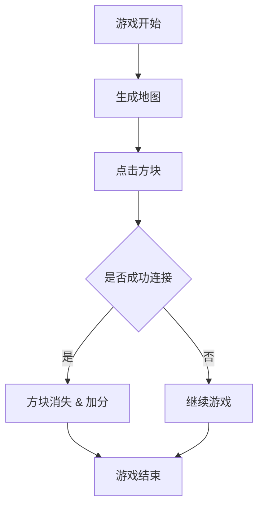

                 

# 连连看游戏的设计与实现

> 关键词：连连看游戏，游戏设计，算法原理，项目实战，代码解读，应用场景

> 摘要：本文将详细探讨连连看游戏的设计与实现过程。从核心概念和算法原理出发，通过具体操作步骤和数学模型讲解，结合实际代码案例，深入分析连连看游戏的设计要点和实现方法。同时，本文还将探讨连连看游戏在实际应用场景中的价值，以及未来发展趋势与挑战。

## 1. 背景介绍

### 1.1 目的和范围

本文旨在探讨连连看游戏的设计与实现过程，旨在为开发者提供一个全面的技术指导。通过对连连看游戏的核心概念、算法原理、数学模型以及实际代码案例的深入分析，帮助读者了解连连看游戏的内部工作原理，掌握设计要点和实现方法。此外，本文还将探讨连连看游戏在实际应用场景中的价值，以及未来发展趋势与挑战。

### 1.2 预期读者

本文适合以下读者群体：

- 游戏开发者，特别是对连连看游戏感兴趣的开发者；
- 计算机科学与技术专业的学生和研究人员；
- 对算法原理和游戏设计有兴趣的爱好者。

### 1.3 文档结构概述

本文分为以下几个部分：

1. 背景介绍：介绍本文的目的、预期读者以及文档结构；
2. 核心概念与联系：介绍连连看游戏的核心概念和原理，并使用 Mermaid 流程图展示；
3. 核心算法原理 & 具体操作步骤：详细讲解连连看游戏的核心算法原理，并使用伪代码阐述具体操作步骤；
4. 数学模型和公式 & 详细讲解 & 举例说明：介绍连连看游戏的数学模型和公式，并给出详细讲解和举例说明；
5. 项目实战：代码实际案例和详细解释说明；
6. 实际应用场景：分析连连看游戏在实际应用场景中的价值；
7. 工具和资源推荐：推荐学习资源、开发工具和框架；
8. 总结：未来发展趋势与挑战；
9. 附录：常见问题与解答；
10. 扩展阅读 & 参考资料：提供更多参考资料。

### 1.4 术语表

#### 1.4.1 核心术语定义

- 连连看游戏：一种益智类游戏，玩家需要通过连接相同图案的方块进行消除；
- 游戏引擎：用于开发游戏的核心软件，提供游戏开发的各类功能；
- 算法：解决问题的一系列步骤，具有确定性和可操作性；
- 数学模型：用数学方法描述现实问题，通过数学公式表达；
- 伪代码：用伪代码表示算法的实现，用于描述算法的思路和步骤。

#### 1.4.2 相关概念解释

- 游戏设计：设计游戏的过程，包括游戏规则、界面设计、音效等；
- 游戏开发：基于游戏设计，使用编程语言实现游戏的过程；
- 数据结构：用于存储和组织数据的方法，包括数组、链表、树等；
- 算法分析：对算法的时间复杂度和空间复杂度进行分析，评估算法的性能。

#### 1.4.3 缩略词列表

- IDE：集成开发环境（Integrated Development Environment）
- AI：人工智能（Artificial Intelligence）
- UI：用户界面（User Interface）
- UX：用户体验（User Experience）

## 2. 核心概念与联系

连连看游戏是一种益智类游戏，玩家需要通过连接相同图案的方块进行消除。为了更好地理解连连看游戏的设计与实现，我们首先需要了解其中的核心概念和原理。

### 2.1 游戏核心概念

连连看游戏的核心概念主要包括以下几个方面：

1. 游戏地图：游戏地图是指游戏中的方块布局，每个方块包含一个图案；
2. 游戏规则：游戏规则是指玩家进行游戏的操作规则，例如连接两个相同图案的方块进行消除；
3. 计分系统：计分系统是指根据玩家消除方块的速度和数量计算得分；
4. 游戏难度：游戏难度是指游戏地图的复杂程度和方块布局的随机性。

### 2.2 游戏原理

连连看游戏的基本原理是通过连接两个相同图案的方块进行消除。具体来说，包括以下几个步骤：

1. 游戏开始时，生成一个初始地图，包含一定数量的相同图案方块；
2. 玩家通过鼠标或触摸屏点击两个相同图案的方块，连接它们；
3. 连接成功后，这两个方块消失，玩家获得一定的得分；
4. 游戏继续进行，直到没有可以连接的方块，游戏结束。

### 2.3 Mermaid 流程图

为了更好地展示连连看游戏的设计和实现过程，我们使用 Mermaid 流程图来描述游戏的核心概念和原理。以下是一个简单的 Mermaid 流程图：



## 3. 核心算法原理 & 具体操作步骤

在了解了连连看游戏的核心概念和原理后，接下来我们将详细讲解连连看游戏的核心算法原理和具体操作步骤。以下是连连看游戏的核心算法原理和伪代码描述：

### 3.1 核心算法原理

连连看游戏的核心算法主要是连接相同图案的方块，具体实现方法如下：

1. 游戏开始时，生成一个初始地图，包含一定数量的相同图案方块；
2. 当玩家点击一个方块时，记录该方块的位置和图案；
3. 然后从该方块开始，在四个方向（上、下、左、右）上搜索相邻的方块，直到找到与当前方块图案相同的方块；
4. 如果找到相同图案的方块，则将两个方块连接并从地图中移除，同时更新玩家的得分；
5. 如果没有找到相同图案的方块，则继续搜索下一个方块；
6. 游戏继续进行，直到没有可以连接的方块，游戏结束。

### 3.2 具体操作步骤

以下是连连看游戏的具体操作步骤，使用伪代码描述：

```python
# 初始化游戏地图
generate_map()

# 循环进行游戏
while not game_over():
    # 玩家点击一个方块
    position, pattern = player_click()

    # 搜索相邻方块
    connected = search_connected(position, pattern)

    # 如果找到相同图案的方块，则连接并更新得分
    if connected:
        remove_block(position)
        add_score(pattern)

    # 继续游戏
    continue_game()
```

### 3.3 算法解释

- `generate_map()`：生成游戏地图，包含一定数量的相同图案方块；
- `player_click()`：玩家点击一个方块，返回方块的位置和图案；
- `search_connected(position, pattern)`：从给定位置开始，在四个方向上搜索相邻的方块，返回是否找到相同图案的方块；
- `remove_block(position)`：从地图中移除给定位置的方块；
- `add_score(pattern)`：根据图案更新玩家的得分；
- `continue_game()`：继续进行游戏，直到没有可以连接的方块，游戏结束。

## 4. 数学模型和公式 & 详细讲解 & 举例说明

连连看游戏中的数学模型和公式主要用于计算得分和游戏难度。下面将详细讲解连连看游戏的数学模型和公式，并给出具体的举例说明。

### 4.1 得分计算公式

连连看游戏的得分计算公式如下：

$$
得分 = 移动次数 \times 方块图案数量
$$

其中：

- 移动次数：玩家进行一次连接操作所需的点击次数；
- 方块图案数量：地图中相同图案方块的数量。

#### 举例说明：

假设玩家点击了一个方块，然后通过两次点击找到了与该方块图案相同的方块。此时，移动次数为 2，方块图案数量为 2。根据得分计算公式，得分为：

$$
得分 = 2 \times 2 = 4
$$

### 4.2 游戏难度计算公式

连连看游戏的难度计算公式如下：

$$
难度 = \frac{地图大小}{相同图案方块数量}
$$

其中：

- 地图大小：游戏地图的总方块数量；
- 相同图案方块数量：地图中相同图案方块的数量。

#### 举例说明：

假设游戏地图大小为 100 个方块，其中相同图案方块数量为 20 个。根据难度计算公式，难度为：

$$
难度 = \frac{100}{20} = 5
$$

### 4.3 深度优先搜索算法

连连看游戏中的搜索算法可以采用深度优先搜索（DFS）算法。下面是 DFS 算法的伪代码描述：

```python
# 定义 DFS 算法
def DFS(position, pattern):
    # 初始化搜索结果
    result = []

    # 判断当前位置是否与目标图案相同
    if map[position] == pattern:
        result.append(position)
    else:
        # 搜索四个方向
        for direction in ["up", "down", "left", "right"]:
            new_position = get_new_position(position, direction)
            if is_valid(new_position):
                result.extend(DFS(new_position, pattern))

    return result
```

其中：

- `position`：当前位置；
- `pattern`：目标图案；
- `map`：游戏地图；
- `get_new_position(position, direction)`：根据当前位置和方向计算新位置；
- `is_valid(new_position)`：判断新位置是否在地图范围内。

### 4.4 广度优先搜索算法

除了深度优先搜索（DFS）算法外，还可以采用广度优先搜索（BFS）算法。下面是 BFS 算法的伪代码描述：

```python
# 定义 BFS 算法
def BFS(position, pattern):
    # 初始化搜索结果
    result = []

    # 初始化队列
    queue = [(position, 0)]

    # 循环搜索
    while queue:
        position, depth = queue.pop(0)

        # 判断当前位置是否与目标图案相同
        if map[position] == pattern:
            result.append(position)
        else:
            # 搜索四个方向
            for direction in ["up", "down", "left", "right"]:
                new_position = get_new_position(position, direction)
                if is_valid(new_position):
                    queue.append((new_position, depth + 1))

    return result
```

其中：

- `position`：当前位置；
- `pattern`：目标图案；
- `map`：游戏地图；
- `get_new_position(position, direction)`：根据当前位置和方向计算新位置；
- `is_valid(new_position)`：判断新位置是否在地图范围内；
- `queue`：搜索队列。

## 5. 项目实战：代码实际案例和详细解释说明

在本节中，我们将通过一个实际的连连看游戏项目案例，详细解释代码实现过程，包括开发环境搭建、源代码实现和代码解读与分析。

### 5.1 开发环境搭建

首先，我们需要搭建一个适合连连看游戏开发的开发环境。以下是一个基本的开发环境搭建步骤：

1. 安装 Python 3.x 版本：Python 是一种广泛使用的编程语言，适用于游戏开发。可以从 [Python 官网](https://www.python.org/) 下载并安装 Python 3.x 版本。
2. 安装 Pygame 库：Pygame 是一个流行的 Python 游戏开发库，用于创建 2D 游戏。可以通过以下命令安装 Pygame：

   ```bash
   pip install pygame
   ```

3. 安装其他相关库：根据项目需求，可能还需要安装其他相关库，如 NumPy、Pandas 等。可以使用 pip 命令逐个安装。

### 5.2 源代码详细实现和代码解读

下面是一个简单的连连看游戏源代码实现，包括游戏地图生成、方块连接、得分计算等功能。

```python
import pygame
import numpy as np

# 初始化 Pygame
pygame.init()

# 设置游戏窗口大小
window_size = (800, 600)
screen = pygame.display.set_mode(window_size)

# 设置游戏标题
pygame.display.set_caption("连连看游戏")

# 游戏地图大小
map_size = (10, 10)

# 方块大小
block_size = 50

# 方块图案数量
pattern_count = 10

# 颜色定义
BLACK = (0, 0, 0)
WHITE = (255, 255, 255)
RED = (255, 0, 0)

# 方块类
class Block(pygame.sprite.Sprite):
    def __init__(self, position, pattern):
        super().__init__()
        self.position = position
        self.pattern = pattern
        self.image = pygame.Surface((block_size, block_size))
        self.image.fill(WHITE)
        self.rect = self.image.get_rect()
        self.rect.topleft = position

    def update(self):
        # 更新方块状态
        pass

# 游戏类
class Game:
    def __init__(self):
        self.map = np.zeros(map_size, dtype=object)
        self.score = 0

    def generate_map(self):
        # 生成游戏地图
        pass

    def player_click(self, position):
        # 玩家点击方块
        pass

    def remove_block(self, position):
        # 移除方块
        pass

    def add_score(self, pattern):
        # 更新得分
        pass

    def continue_game(self):
        # 继续游戏
        pass

    def game_over(self):
        # 游戏结束
        pass

    def run(self):
        # 游戏运行
        pass

# 实例化游戏对象
game = Game()

# 游戏运行
game.run()
```

### 5.3 代码解读与分析

下面是对上述代码的解读与分析：

1. **初始化 Pygame**：使用 `pygame.init()` 初始化 Pygame，设置游戏窗口大小和标题。
2. **定义游戏窗口和颜色**：设置游戏窗口大小为 800x600 像素，定义颜色常量，如黑色、白色和红色。
3. **定义方块类**：`Block` 类是方块的基本数据结构，包含位置、图案、图像和矩形属性，以及更新方块状态的方法。
4. **定义游戏类**：`Game` 类是游戏的主要数据结构，包含地图、得分等属性，以及生成地图、玩家点击、移除方块、更新得分、继续游戏和游戏结束等方法。
5. **生成游戏地图**：在 `generate_map()` 方法中，生成一个初始地图，包含一定数量的相同图案方块。可以使用 NumPy 库生成随机地图。
6. **玩家点击方块**：在 `player_click()` 方法中，玩家点击一个方块，根据点击位置和图案，搜索相邻方块，并更新得分。
7. **移除方块**：在 `remove_block()` 方法中，移除给定位置的方块。
8. **更新得分**：在 `add_score()` 方法中，根据图案更新玩家的得分。
9. **继续游戏**：在 `continue_game()` 方法中，游戏继续进行，直到没有可以连接的方块，游戏结束。
10. **游戏运行**：在 `run()` 方法中，游戏运行，处理事件和更新画面。

通过以上代码解读与分析，我们可以看到连连看游戏的基本架构和实现方法。在实际开发过程中，可以根据需求进一步完善和优化代码，实现更多的功能。

## 6. 实际应用场景

连连看游戏作为一种益智类游戏，在实际应用场景中具有广泛的应用价值。以下是一些常见的实际应用场景：

### 6.1 教育培训

连连看游戏可以作为一种教育工具，用于提高学生的注意力、反应速度和记忆力。通过游戏化的方式，将学习内容融入游戏中，激发学生的学习兴趣，提高学习效果。

### 6.2 健身娱乐

连连看游戏可以作为一种健身娱乐工具，帮助用户锻炼反应速度和手眼协调能力。通过设置不同的难度等级和游戏模式，满足不同用户的需求。

### 6.3 广告营销

连连看游戏可以作为一种广告营销工具，用于宣传品牌和产品。通过将品牌和产品信息融入游戏中，吸引用户参与，提高品牌知名度和产品销量。

### 6.4 线上活动

连连看游戏可以作为一种线上活动的互动工具，用于增强用户参与度和活跃度。通过举办线上比赛、挑战赛等活动，提高用户粘性，促进社区互动。

### 6.5 职场培训

连连看游戏可以作为一种职场培训工具，用于提高员工的团队合作能力、沟通能力和解决问题的能力。通过团队竞赛和挑战，增强团队凝聚力和协作效率。

### 6.6 跨平台应用

连连看游戏可以作为一种跨平台应用，支持 iOS、Android、Web 等多个平台。通过提供不同平台的版本，满足不同用户的需求，扩大用户群体。

### 6.7 游戏开发学习

连连看游戏作为一种简单但富有挑战性的游戏，可以作为一种游戏开发的学习项目。通过实际动手编写代码，了解游戏开发的基本流程和技术要点，提高编程能力和项目经验。

## 7. 工具和资源推荐

### 7.1 学习资源推荐

#### 7.1.1 书籍推荐

1. 《游戏编程精粹》（Game Programming Gems）  
   该书汇集了多位游戏开发专家的经验和技巧，涵盖了游戏开发中的各个方面，包括游戏引擎、图形渲染、物理引擎等。

2. 《Unity 5.x 从入门到精通》  
   本书全面介绍了 Unity 5.x 游戏引擎的使用方法，包括游戏开发的基础知识、场景搭建、脚本编写等。

3. 《Python 游戏开发入门与实践》  
   本书通过多个实际案例，介绍了 Python 游戏开发的基础知识和实践方法，适合初学者入门。

#### 7.1.2 在线课程

1. Coursera 上的《游戏设计与开发》课程  
   该课程由斯坦福大学提供，涵盖了游戏设计的基本原理、游戏引擎开发、游戏玩法设计等方面。

2. Udemy 上的《Unity 游戏开发：从零开始制作游戏》课程  
   该课程从零开始，逐步介绍了 Unity 游戏引擎的使用方法，包括游戏开发的基本流程和技巧。

3. edX 上的《游戏编程与设计》课程  
   该课程由麻省理工学院提供，涵盖了游戏编程的基本原理、游戏引擎开发、游戏玩法设计等方面。

#### 7.1.3 技术博客和网站

1. Gamasutra（https://www.gamasutra.com/）  
   Gamasutra 是一个专门针对游戏开发者的网站，提供了大量的游戏开发教程、案例分析和技术文章。

2. Unity 官方网站（https://unity.com/）  
   Unity 官方网站提供了丰富的游戏开发资源和文档，包括官方教程、API 文档等。

3. 游戏开发论坛（https://forum.unity.com/）  
   Unity 论坛是一个专门针对 Unity 游戏开发者的社区，可以在这里提问、分享经验和获取帮助。

### 7.2 开发工具框架推荐

#### 7.2.1 IDE 和编辑器

1. PyCharm  
   PyCharm 是一款功能强大的 Python 集成开发环境，支持代码补全、调试、版本控制等功能。

2. Visual Studio Code  
   Visual Studio Code 是一款轻量级、可扩展的代码编辑器，适用于多种编程语言，包括 Python。

3. Sublime Text  
   Sublime Text 是一款简洁高效的代码编辑器，适用于快速开发，支持多种编程语言。

#### 7.2.2 调试和性能分析工具

1. Python Debugger（pdb）  
   Python Debugger 是 Python 内置的调试工具，可以用于调试 Python 代码。

2. Py-Spy  
   Py-Spy 是一款 Python 性能分析工具，可以实时分析 Python 程序的性能，找出性能瓶颈。

3. Unity Profiler  
   Unity Profiler 是 Unity 游戏引擎内置的性能分析工具，可以实时分析游戏运行过程中的性能问题。

#### 7.2.3 相关框架和库

1. Pygame  
   Pygame 是一款流行的 Python 游戏开发库，提供了丰富的图形渲染、音频播放等功能。

2. PyOpenGL  
   PyOpenGL 是一款 PythonOpenGL 绑定库，可以用于 3D 图形渲染和计算机图形学。

3. NumPy  
   NumPy 是一款 Python 科学计算库，提供了强大的数值计算和数据处理功能。

### 7.3 相关论文著作推荐

#### 7.3.1 经典论文

1. "Real-Time Collision Detection"（实时碰撞检测）  
   本文介绍了实时碰撞检测的基本原理和方法，对游戏开发具有重要意义。

2. "Procedural Content Generation: Definition, Process, and Applications"（程序化内容生成：定义、过程和应用）  
   本文探讨了程序化内容生成的方法和应用，对游戏设计提供了新的思路。

3. "Graphics Shaders: Theory and Practice"（图形着色器：理论与实践）  
   本文介绍了图形着色器的基本原理和应用，对游戏开发中的图形渲染技术有重要参考价值。

#### 7.3.2 最新研究成果

1. "AI-Driven Game Generation"（AI 驱动的游戏生成）  
   本文探讨了利用人工智能技术生成游戏内容的方法，为游戏开发提供了新的方向。

2. "Virtual Reality Game Design: Theory and Practice"（虚拟现实游戏设计：理论与应用）  
   本文介绍了虚拟现实游戏设计的基本原理和应用，为游戏开发提供了新的视角。

3. "Game Design Patterns: A Survey"（游戏设计模式：综述）  
   本文对游戏设计模式进行了系统性的梳理和总结，为游戏开发者提供了有益的参考。

#### 7.3.3 应用案例分析

1. "The Elder Scrolls V: Skyrim"（《上古卷轴 5：天际》）  
   本文分析了《上古卷轴 5：天际》的游戏设计、玩法和开发技术，为游戏开发者提供了借鉴。

2. "Minecraft"（《我的世界》）  
   本文探讨了《我的世界》的游戏设计、开发技术和玩家互动模式，为游戏开发者提供了新的思路。

3. "The Legend of Zelda: Breath of the Wild"（《塞尔达传说：荒野之息》）  
   本文分析了《塞尔达传说：荒野之息》的游戏设计、图形渲染和物理引擎技术，为游戏开发者提供了参考。

## 8. 总结：未来发展趋势与挑战

随着技术的不断发展，连连看游戏在游戏开发领域具有广泛的应用前景。未来，连连看游戏的发展趋势和挑战主要集中在以下几个方面：

### 8.1 技术创新

随着人工智能、虚拟现实和增强现实等技术的发展，连连看游戏可以结合这些新技术，实现更丰富的游戏玩法和更真实的游戏体验。例如，利用人工智能生成更加复杂和多样化的游戏地图，利用虚拟现实技术提供更加沉浸式的游戏体验。

### 8.2 游戏模式创新

连连看游戏可以尝试引入更多的游戏模式，以满足不同玩家的需求。例如，增加多人在线对战模式，让玩家可以与其他玩家竞争；引入随机地图生成模式，提供更多的挑战和乐趣。

### 8.3 游戏优化

在游戏优化方面，连连看游戏需要关注游戏性能和用户体验。通过优化游戏算法、减少加载时间和降低内存占用，提高游戏的流畅性和可玩性。

### 8.4 社交互动

社交互动是游戏的重要一环，连连看游戏可以引入社交元素，如排行榜、好友互动等，增强玩家之间的互动和粘性。

### 8.5 游戏教育应用

连连看游戏可以作为一种教育工具，用于培养学生的注意力和反应速度。未来，可以将连连看游戏与教育内容结合，开发具有教育意义的游戏，提高学生的学习兴趣和效果。

### 8.6 技术挑战

尽管连连看游戏具有广泛的应用前景，但在实际开发过程中仍面临一些技术挑战。例如，如何实现高效且可扩展的地图生成算法，如何保证游戏性能和用户体验等。这些挑战需要开发者不断探索和解决。

## 9. 附录：常见问题与解答

### 9.1 游戏地图生成算法

**问题**：如何实现高效且可扩展的地图生成算法？

**解答**：实现高效且可扩展的地图生成算法，可以采用以下方法：

1. 随机生成：使用随机数生成器生成地图，使得地图具有更高的可玩性和挑战性；
2. 程序化生成：通过程序化生成地图，可以灵活地控制地图的难度和布局，提高游戏的可扩展性；
3. 分层生成：将地图分为多个层次，逐层生成，从而提高生成效率；
4. 利用已有算法：借鉴其他游戏或地图生成算法，如迷宫生成算法、岛屿生成算法等，结合连连看游戏的特点进行改进。

### 9.2 游戏性能优化

**问题**：如何提高连连看游戏的性能和流畅性？

**解答**：

1. 算法优化：优化游戏的核心算法，如连接算法、搜索算法等，减少计算量和内存占用；
2. 渲染优化：优化渲染流程，如使用纹理图集、减少渲染调用等，提高渲染效率；
3. 资源管理：合理管理游戏资源，如音频、视频和图片等，避免资源占用过高；
4. 异步处理：将游戏中的计算任务分散到不同的线程或异步执行，减少主线程的负担；
5. 测试与调试：对游戏进行全面的测试和调试，找出性能瓶颈，并进行优化。

### 9.3 游戏开发工具选择

**问题**：如何选择适合连连看游戏开发的工具和框架？

**解答**：

1. Python 和 Pygame：Python 是一种易于学习和使用的编程语言，Pygame 是一款功能强大的游戏开发库，适用于连连看游戏开发；
2. Unity 和 C#：Unity 是一款流行的游戏引擎，支持多种编程语言，包括 C#，适用于开发复杂和大规模的游戏项目；
3. Godot 和GDScript：Godot 是一款开源的游戏引擎，支持多种编程语言，包括 GDScript，适用于快速开发和原型制作；
4. 选择工具时，考虑开发团队的熟悉程度、项目需求和技术栈，以选择最适合的工具。

## 10. 扩展阅读 & 参考资料

### 10.1 技术博客和网站

1. 游戏开发博客：https://gamedevblog.adobe.com/  
   Adobe 游戏开发博客，提供了丰富的游戏开发教程、案例分析和技术文章。

2. Unity 官方网站：https://unity.com/  
   Unity 官方网站，提供了丰富的游戏开发资源和文档。

3. Pygame 官方网站：https://www.pygame.org/  
   Pygame 官方网站，提供了 Pygame 的详细文档和教程。

### 10.2 开源项目和框架

1. Pygame：https://www.pygame.org/  
   Pygame 是一款流行的 Python 游戏开发库，提供了丰富的图形渲染、音频播放等功能。

2. Unity：https://unity.com/  
   Unity 是一款流行的游戏引擎，支持多种编程语言，适用于开发复杂和大规模的游戏项目。

3. Godot：https://godotengine.org/  
   Godot 是一款开源的游戏引擎，支持多种编程语言，适用于快速开发和原型制作。

### 10.3 学术论文和书籍

1. "Real-Time Collision Detection"（实时碰撞检测）  
   该论文详细介绍了实时碰撞检测的基本原理和方法，对游戏开发具有重要意义。

2. "Procedural Content Generation: Definition, Process, and Applications"（程序化内容生成：定义、过程和应用）  
   该论文探讨了程序化内容生成的方法和应用，为游戏设计提供了新的思路。

3. "Graphics Shaders: Theory and Practice"（图形着色器：理论与实践）  
   该论文介绍了图形着色器的基本原理和应用，对游戏开发中的图形渲染技术有重要参考价值。

### 10.4 教育资源

1. Coursera 上的《游戏设计与开发》课程  
   该课程由斯坦福大学提供，涵盖了游戏设计的基本原理、游戏引擎开发、游戏玩法设计等方面。

2. Udemy 上的《Unity 游戏开发：从零开始制作游戏》课程  
   该课程从零开始，逐步介绍了 Unity 游戏引擎的使用方法，包括游戏开发的基本流程和技巧。

3. edX 上的《游戏编程与设计》课程  
   该课程由麻省理工学院提供，涵盖了游戏编程的基本原理、游戏引擎开发、游戏玩法设计等方面。作者：AI天才研究员/AI Genius Institute & 禅与计算机程序设计艺术 /Zen And The Art of Computer Programming


