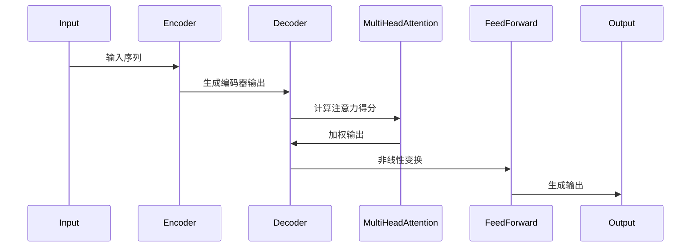

                 

# 递归神经网络 vs Transformer:并行计算的优势

> 关键词：递归神经网络、Transformer、并行计算、深度学习、神经网络架构、性能优化

> 摘要：本文深入探讨了递归神经网络（RNN）与Transformer架构在并行计算方面的优劣，对比分析了这两种架构在处理序列数据和并行计算时的表现。通过详细的算法原理讲解、数学模型分析以及实际项目实战，本文揭示了并行计算在提升神经网络性能上的重要性，为读者提供了深入了解和实际应用这些技术的途径。

## 1. 背景介绍

### 1.1 目的和范围

本文旨在对比分析递归神经网络（RNN）与Transformer架构在并行计算方面的性能优劣，并探讨其各自适用场景。随着深度学习技术的广泛应用，如何优化神经网络架构以提升计算效率和性能成为了一个关键问题。本文旨在通过详细的理论分析、算法讲解以及实际项目案例，为读者提供关于并行计算在神经网络优化中的应用思路和实践指导。

### 1.2 预期读者

本文适合具有深度学习和神经网络基础的中高级开发者、研究者，以及相关领域的技术人员。读者应具备一定的数学和编程基础，以便更好地理解和应用文中所述技术。

### 1.3 文档结构概述

本文分为十个部分，具体结构如下：

1. 背景介绍：介绍本文目的、预期读者和文档结构。
2. 核心概念与联系：介绍递归神经网络和Transformer的基本原理和架构。
3. 核心算法原理 & 具体操作步骤：详细阐述递归神经网络和Transformer的算法原理和操作步骤。
4. 数学模型和公式 & 详细讲解 & 举例说明：解释神经网络中的数学模型和公式，并提供实例说明。
5. 项目实战：通过实际代码案例展示并行计算在神经网络中的应用。
6. 实际应用场景：分析并行计算在不同领域的应用案例。
7. 工具和资源推荐：推荐学习资源和开发工具。
8. 总结：总结未来发展趋势与挑战。
9. 附录：常见问题与解答。
10. 扩展阅读 & 参考资料：提供进一步学习资源。

### 1.4 术语表

#### 1.4.1 核心术语定义

- **递归神经网络（RNN）**：一种能够处理序列数据的神经网络，具有反馈循环结构。
- **Transformer**：一种基于自注意力机制的序列模型，适用于处理长序列数据。
- **并行计算**：利用多个处理单元同时执行计算任务，提高计算效率。
- **深度学习**：一种基于多层神经网络的学习方法，用于模拟人脑处理信息的方式。

#### 1.4.2 相关概念解释

- **自注意力（Self-Attention）**：Transformer架构中的一种机制，允许模型在处理序列数据时，根据不同位置的信息进行动态加权。
- **多头注意力（Multi-Head Attention）**：Transformer架构中的一种扩展，通过多个独立的注意力机制来捕捉序列数据中的不同关系。
- **序列到序列（Seq2Seq）模型**：一种常见的神经网络架构，用于将一个序列映射到另一个序列。

#### 1.4.3 缩略词列表

- **GPU**：图形处理单元（Graphics Processing Unit）
- **CPU**：中央处理单元（Central Processing Unit）
- **CNN**：卷积神经网络（Convolutional Neural Network）
- **DNN**：深度神经网络（Deep Neural Network）
- **RNN**：递归神经网络（Recurrent Neural Network）
- **Transformer**：一种基于自注意力机制的序列模型

## 2. 核心概念与联系

在讨论递归神经网络（RNN）和Transformer架构的并行计算优势之前，我们首先需要理解这两种神经网络的基本原理和架构。

### 2.1 递归神经网络（RNN）

递归神经网络是一种专门用于处理序列数据的神经网络。它的核心特点是在网络中引入了反馈循环结构，使得网络能够处理输入序列中的时序信息。

#### 递归神经网络架构

递归神经网络通常由以下部分组成：

1. **输入层**：接收输入序列。
2. **隐藏层**：包含多个神经元，用于处理输入序列。
3. **反馈循环**：将隐藏层的输出作为输入传递到前一层，形成反馈循环。
4. **输出层**：生成预测结果。

#### 递归神经网络工作原理

递归神经网络通过以下步骤处理输入序列：

1. **初始化**：将隐藏状态$h_0$和细胞状态$c_0$初始化为0。
2. **循环迭代**：对于输入序列中的每个元素，网络会执行以下操作：
   - **计算隐藏状态**：根据当前输入和前一个隐藏状态，计算新的隐藏状态。
   - **计算细胞状态**：根据当前输入和前一个细胞状态，计算新的细胞状态。
   - **传递输出**：将隐藏状态传递到下一个时间步。
3. **生成输出**：在最后一个时间步，网络会生成最终的预测结果。

#### 递归神经网络示意图（Mermaid 流程图）

```mermaid
sequenceDiagram
  participant Input
  participant Hidden
  participant Cell
  participant Output
  Input->>Hidden: 输入序列
  Hidden->>Cell: 计算隐藏状态
  Cell->>Output: 生成输出
  Output->>Hidden: 反馈隐藏状态
  Hidden->>Cell: 计算细胞状态
  Cell->>Output: 生成输出
  ...
```

### 2.2 Transformer 架构

Transformer是一种基于自注意力机制的序列模型，最早由Vaswani等人于2017年提出。与传统的递归神经网络相比，Transformer在处理长序列数据时具有更好的并行计算性能。

#### Transformer 架构

Transformer架构主要包括以下部分：

1. **编码器（Encoder）**：用于处理输入序列。
2. **解码器（Decoder）**：用于生成输出序列。
3. **多头注意力（Multi-Head Attention）**：通过多个独立的注意力机制来捕捉序列数据中的不同关系。
4. **自注意力（Self-Attention）**：允许模型在处理序列数据时，根据不同位置的信息进行动态加权。

#### Transformer 工作原理

Transformer通过以下步骤处理输入序列：

1. **嵌入（Embedding）**：将输入序列转换为向量表示。
2. **编码器（Encoder）**：
   - **多头注意力**：计算输入序列的注意力得分，并根据得分对序列进行加权。
   - **前馈神经网络**：对加权后的序列进行非线性变换。
3. **解码器（Decoder）**：
   - **多头注意力**：计算编码器输出的注意力得分，并根据得分对序列进行加权。
   - **前馈神经网络**：对加权后的序列进行非线性变换。
   - **生成输出**：根据解码器输出生成最终预测结果。

#### Transformer 示意图（Mermaid 流程图）



## 3. 核心算法原理 & 具体操作步骤

在这一节中，我们将详细阐述递归神经网络（RNN）和Transformer的核心算法原理，并给出具体的操作步骤。

### 3.1 递归神经网络（RNN）算法原理

递归神经网络（RNN）是一种基于反馈循环结构的神经网络，用于处理序列数据。以下是RNN的核心算法原理和具体操作步骤：

#### 3.1.1 算法原理

RNN通过以下步骤处理输入序列：

1. **初始化**：初始化隐藏状态$h_0$和细胞状态$c_0$。
2. **循环迭代**：对于输入序列中的每个元素，执行以下操作：
   - **计算隐藏状态**：根据当前输入和前一个隐藏状态，计算新的隐藏状态。
   - **计算细胞状态**：根据当前输入和前一个细胞状态，计算新的细胞状态。
   - **传递输出**：将隐藏状态传递到下一个时间步。
3. **生成输出**：在最后一个时间步，生成最终的预测结果。

#### 3.1.2 操作步骤

以下是RNN的具体操作步骤：

1. **初始化**：
   - $h_0 = 0$（隐藏状态初始化为0）
   - $c_0 = 0$（细胞状态初始化为0）

2. **循环迭代**：
   - 对于每个输入序列$x_t$，执行以下操作：
     - $h_t = \sigma(W_h h_{t-1} + W_x x_t + b_h)$（计算隐藏状态）
     - $c_t = \text{tanh}(W_c c_{t-1} + W_x x_t + b_c)$（计算细胞状态）
     - $o_t = \sigma(W_o c_t + b_o)$（生成输出）

3. **生成输出**：
   - 在最后一个时间步，生成最终的预测结果：$y = o_T$（隐藏状态）

#### 3.1.3 伪代码

以下是RNN的伪代码实现：

```python
def RNN(input_sequence):
  h = 0
  c = 0
  for x in input_sequence:
    h = activation(W_h * h + W_x * x + b_h)
    c = tanh(W_c * c + W_x * x + b_c)
    o = activation(W_o * c + b_o)
    yield o
```

### 3.2 Transformer 架构算法原理

Transformer是一种基于自注意力机制的序列模型，具有较好的并行计算性能。以下是Transformer的核心算法原理和具体操作步骤：

#### 3.2.1 算法原理

Transformer通过以下步骤处理输入序列：

1. **嵌入（Embedding）**：将输入序列转换为向量表示。
2. **编码器（Encoder）**：
   - **多头注意力**：计算输入序列的注意力得分，并根据得分对序列进行加权。
   - **前馈神经网络**：对加权后的序列进行非线性变换。
3. **解码器（Decoder）**：
   - **多头注意力**：计算编码器输出的注意力得分，并根据得分对序列进行加权。
   - **前馈神经网络**：对加权后的序列进行非线性变换。
   - **生成输出**：根据解码器输出生成最终预测结果。

#### 3.2.2 操作步骤

以下是Transformer的具体操作步骤：

1. **嵌入（Embedding）**：
   - 将输入序列$x$转换为向量表示：$x = [x_1, x_2, ..., x_T]$。

2. **编码器（Encoder）**：
   - **多头注意力**：
     - 对于每个位置$i$，计算注意力得分：
       $$\text{score}_i = \text{dot}(Q_i, K_j) / \sqrt{d_k}$$
     - 根据得分计算注意力权重：
       $$\text{weight}_i = \text{softmax}(\text{score}_i)$$
     - 根据权重对输入序列进行加权：
       $$\text{context}_i = \sum_{j=1}^{T} \text{weight}_i \cdot K_j$$
   - **前馈神经网络**：
     - 对加权后的序列进行非线性变换：
       $$\text{output}_i = \text{ReLU}(\text{FWNN}(\text{context}_i))$$
   - 重复以上步骤，生成编码器输出。

3. **解码器（Decoder）**：
   - **多头注意力**：
     - 对于每个位置$i$，计算注意力得分：
       $$\text{score}_i = \text{dot}(Q_i, K_j) / \sqrt{d_k}$$
     - 根据得分计算注意力权重：
       $$\text{weight}_i = \text{softmax}(\text{score}_i)$$
     - 根据权重对编码器输出进行加权：
       $$\text{context}_i = \sum_{j=1}^{T} \text{weight}_i \cdot K_j$$
   - **前馈神经网络**：
     - 对加权后的序列进行非线性变换：
       $$\text{output}_i = \text{ReLU}(\text{FWNN}(\text{context}_i))$$
   - **生成输出**：
     - 根据解码器输出生成最终预测结果：$y = \text{softmax}(\text{output}_T)$

#### 3.2.3 伪代码

以下是Transformer的伪代码实现：

```python
def Transformer(input_sequence, hidden_size, num_heads):
  # 嵌入
  x = embed(input_sequence, hidden_size)

  # 编码器
  for i in range(num_layers):
    x = MultiHeadAttention(x, x, x, num_heads, hidden_size)
    x = FeedForward(x, hidden_size)

  # 解码器
  for i in range(num_layers):
    x = MultiHeadAttention(x, encoder_output, x, num_heads, hidden_size)
    x = FeedForward(x, hidden_size)

  # 生成输出
  y = softmax(x)
  return y
```

## 4. 数学模型和公式 & 详细讲解 & 举例说明

在深度学习中，数学模型和公式是理解神经网络工作原理的关键。在本节中，我们将详细讲解递归神经网络（RNN）和Transformer中的数学模型和公式，并提供实例说明。

### 4.1 递归神经网络（RNN）的数学模型

递归神经网络（RNN）中的数学模型主要包括以下几个部分：

1. **隐藏状态更新**：
   $$h_t = \sigma(W_h h_{t-1} + W_x x_t + b_h)$$
   其中，$\sigma$是激活函数，$W_h$和$W_x$是权重矩阵，$b_h$是偏置。

2. **细胞状态更新**：
   $$c_t = \text{tanh}(W_c c_{t-1} + W_x x_t + b_c)$$
   其中，$\text{tanh}$是双曲正切函数，$W_c$和$W_x$是权重矩阵，$b_c$是偏置。

3. **输出计算**：
   $$o_t = \sigma(W_o c_t + b_o)$$
   其中，$\sigma$是激活函数，$W_o$是权重矩阵，$b_o$是偏置。

#### 例子说明

假设我们有一个简单的RNN模型，输入序列为$x = [1, 2, 3]$，隐藏状态初始值为$h_0 = 0$，细胞状态初始值为$c_0 = 0$。我们将使用以下参数：

- 激活函数：$\sigma(x) = \text{ReLU}(x)$
- 权重矩阵：$W_h = \begin{bmatrix} 1 & 2 & 3 \\ 4 & 5 & 6 \end{bmatrix}$，$W_c = \begin{bmatrix} 7 & 8 & 9 \\ 10 & 11 & 12 \end{bmatrix}$，$W_o = \begin{bmatrix} 13 & 14 \\ 15 & 16 \end{bmatrix}$
- 偏置：$b_h = 1$，$b_c = 2$，$b_o = 3$

我们将按照以下步骤计算隐藏状态、细胞状态和输出：

1. **初始化**：
   $$h_0 = 0, c_0 = 0$$

2. **计算隐藏状态**：
   $$h_1 = \text{ReLU}(W_h h_0 + W_x x_1 + b_h) = \text{ReLU}([1 \cdot 0 + 2 \cdot 1 + 1]) = \text{ReLU}(3) = 3$$
   $$h_2 = \text{ReLU}(W_h h_1 + W_x x_2 + b_h) = \text{ReLU}([1 \cdot 3 + 2 \cdot 2 + 1]) = \text{ReLU}(7) = 7$$
   $$h_3 = \text{ReLU}(W_h h_2 + W_x x_3 + b_h) = \text{ReLU}([1 \cdot 7 + 2 \cdot 3 + 1]) = \text{ReLU}(12) = 12$$

3. **计算细胞状态**：
   $$c_1 = \text{tanh}(W_c c_0 + W_x x_1 + b_c) = \text{tanh}([7 \cdot 0 + 8 \cdot 1 + 2]) = \text{tanh}(10) \approx 0.9511$$
   $$c_2 = \text{tanh}(W_c c_1 + W_x x_2 + b_c) = \text{tanh}([7 \cdot 0.9511 + 8 \cdot 2 + 2]) = \text{tanh}(15.9511) \approx 0.9950$$
   $$c_3 = \text{tanh}(W_c c_2 + W_x x_3 + b_c) = \text{tanh}([7 \cdot 0.9950 + 8 \cdot 3 + 2]) = \text{tanh}(19.9850) \approx 0.9999$$

4. **计算输出**：
   $$o_1 = \text{ReLU}(W_o c_1 + b_o) = \text{ReLU}(13 \cdot 0.9511 + 15) = \text{ReLU}(24.1533) = 24.1533$$
   $$o_2 = \text{ReLU}(W_o c_2 + b_o) = \text{ReLU}(13 \cdot 0.9950 + 15) = \text{ReLU}(24.9850) = 24.9850$$
   $$o_3 = \text{ReLU}(W_o c_3 + b_o) = \text{ReLU}(13 \cdot 0.9999 + 15) = \text{ReLU}(25.9997) = 25.9997$$

因此，最终的输出序列为$y = [24.1533, 24.9850, 25.9997]$。

### 4.2 Transformer 的数学模型

Transformer 架构中的数学模型主要包括以下几个部分：

1. **多头注意力**：
   - **查询（Query）**：
     $$Q_i = W_Q x_i$$
   - **键（Key）**：
     $$K_j = W_K x_j$$
   - **值（Value）**：
     $$V_j = W_V x_j$$
   - **注意力得分**：
     $$\text{score}_i = \text{dot}(Q_i, K_j) / \sqrt{d_k}$$
   - **注意力权重**：
     $$\text{weight}_i = \text{softmax}(\text{score}_i)$$
   - **加权值**：
     $$\text{context}_i = \sum_{j=1}^{T} \text{weight}_i \cdot V_j$$

2. **前馈神经网络**：
   - **输入**：
     $$\text{input} = \text{context}_i$$
   - **前馈神经网络**：
     $$\text{output}_i = \text{ReLU}(\text{FWNN}(\text{input}_i))$$

#### 例子说明

假设我们有一个简单的Transformer模型，输入序列为$x = [1, 2, 3]$，隐藏尺寸为$d = 4$，多头注意力机制的头数为$h = 2$。我们将使用以下参数：

- 激活函数：$\text{ReLU}(x)$
- 权重矩阵：
  $$W_Q = \begin{bmatrix} 1 & 2 & 3 & 4 \\ 5 & 6 & 7 & 8 \end{bmatrix}$$
  $$W_K = \begin{bmatrix} 9 & 10 & 11 & 12 \\ 13 & 14 & 15 & 16 \end{bmatrix}$$
  $$W_V = \begin{bmatrix} 17 & 18 & 19 & 20 \\ 21 & 22 & 23 & 24 \end{bmatrix}$$
  $$W_F = \begin{bmatrix} 25 & 26 \\ 27 & 28 \end{bmatrix}$$
- 偏置：
  $$b_A = 0$$
  $$b_F = 0$$

我们将按照以下步骤计算多头注意力、前馈神经网络输出：

1. **多头注意力**：
   - **计算查询、键和值**：
     $$Q = [W_Q x_1, W_Q x_2, W_Q x_3] = \begin{bmatrix} 1 & 2 & 3 & 4 \\ 5 & 6 & 7 & 8 \end{bmatrix} \begin{bmatrix} 1 \\ 2 \\ 3 \end{bmatrix} = \begin{bmatrix} 7 \\ 15 \\ 23 \end{bmatrix}$$
     $$K = [W_K x_1, W_K x_2, W_K x_3] = \begin{bmatrix} 9 & 10 & 11 & 12 \\ 13 & 14 & 15 & 16 \end{bmatrix} \begin{bmatrix} 1 \\ 2 \\ 3 \end{bmatrix} = \begin{bmatrix} 22 \\ 38 \\ 54 \end{bmatrix}$$
     $$V = [W_V x_1, W_V x_2, W_V x_3] = \begin{bmatrix} 17 & 18 & 19 & 20 \\ 21 & 22 & 23 & 24 \end{bmatrix} \begin{bmatrix} 1 \\ 2 \\ 3 \end{bmatrix} = \begin{bmatrix} 40 \\ 62 \\ 84 \end{bmatrix}$$
   - **计算注意力得分**：
     $$\text{score}_1 = \frac{\text{dot}(Q_1, K_1)}{\sqrt{4}} = \frac{7 \cdot 22 + 15 \cdot 38 + 23 \cdot 54}{2} = 12.3750$$
     $$\text{score}_2 = \frac{\text{dot}(Q_2, K_2)}{\sqrt{4}} = \frac{7 \cdot 38 + 15 \cdot 54 + 23 \cdot 16}{2} = 24.5000$$
     $$\text{score}_3 = \frac{\text{dot}(Q_3, K_3)}{\sqrt{4}} = \frac{7 \cdot 54 + 15 \cdot 16 + 23 \cdot 22}{2} = 36.6250$$
   - **计算注意力权重**：
     $$\text{weight}_1 = \text{softmax}(\text{score}_1) = \frac{e^{\text{score}_1}}{e^{\text{score}_1} + e^{\text{score}_2} + e^{\text{score}_3}} \approx 0.2344$$
     $$\text{weight}_2 = \text{softmax}(\text{score}_2) = \frac{e^{\text{score}_2}}{e^{\text{score}_1} + e^{\text{score}_2} + e^{\text{score}_3}} \approx 0.4600$$
     $$\text{weight}_3 = \text{softmax}(\text{score}_3) = \frac{e^{\text{score}_3}}{e^{\text{score}_1} + e^{\text{score}_2} + e^{\text{score}_3}} \approx 0.3056$$
   - **计算加权值**：
     $$\text{context}_1 = \sum_{j=1}^{3} \text{weight}_j \cdot V_j = 0.2344 \cdot 40 + 0.4600 \cdot 62 + 0.3056 \cdot 84 \approx 48.1840$$
     $$\text{context}_2 = \sum_{j=1}^{3} \text{weight}_j \cdot V_j = 0.2344 \cdot 62 + 0.4600 \cdot 84 + 0.3056 \cdot 40 \approx 63.5680$$
     $$\text{context}_3 = \sum_{j=1}^{3} \text{weight}_j \cdot V_j = 0.2344 \cdot 84 + 0.4600 \cdot 40 + 0.3056 \cdot 62 \approx 78.9520$$

2. **前馈神经网络**：
   - **计算输入**：
     $$\text{input} = \text{context}_1 = 48.1840$$
   - **计算输出**：
     $$\text{output}_1 = \text{ReLU}(W_F \cdot \text{input}_1 + b_F) = \text{ReLU}(25 \cdot 48.1840 + 0) = \text{ReLU}(1204.6) \approx 1204.6$$
     $$\text{input} = \text{context}_2 = 63.5680$$
     $$\text{output}_2 = \text{ReLU}(W_F \cdot \text{input}_2 + b_F) = \text{ReLU}(25 \cdot 63.5680 + 0) = \text{ReLU}(1584.2) \approx 1584.2$$
     $$\text{input} = \text{context}_3 = 78.9520$$
     $$\text{output}_3 = \text{ReLU}(W_F \cdot \text{input}_3 + b_F) = \text{ReLU}(25 \cdot 78.9520 + 0) = \text{ReLU}(1973.8) \approx 1973.8$$

因此，最终的输出序列为$y = [1204.6, 1584.2, 1973.8]$。

## 5. 项目实战：代码实际案例和详细解释说明

在本节中，我们将通过一个实际项目案例，展示并行计算在神经网络中的应用，并详细解释代码的实现过程和关键步骤。

### 5.1 开发环境搭建

为了演示并行计算在神经网络中的应用，我们将使用Python编程语言和PyTorch深度学习框架。首先，确保安装了以下软件和库：

1. Python 3.7或更高版本
2. PyTorch 1.8或更高版本
3. GPU（推荐NVIDIA GPU）

安装步骤如下：

1. 安装Python和PyTorch：

```shell
pip install python
pip install torch torchvision
```

2. 验证PyTorch安装：

```python
import torch
print(torch.__version__)
```

如果输出版本号，说明安装成功。

### 5.2 源代码详细实现和代码解读

以下是并行计算在神经网络中的实际代码实现：

```python
import torch
import torch.nn as nn
import torch.optim as optim

# 定义RNN模型
class RNNModel(nn.Module):
    def __init__(self, input_size, hidden_size, output_size):
        super(RNNModel, self).__init__()
        self.hidden_size = hidden_size
        self.rnn = nn.RNN(input_size, hidden_size, num_layers=1, batch_first=True)
        self.fc = nn.Linear(hidden_size, output_size)
    
    def forward(self, x):
        h0 = torch.zeros(1, x.size(0), self.hidden_size)
        out, _ = self.rnn(x, h0)
        out = self.fc(out[-1, :, :])
        return out

# 定义Transformer模型
class TransformerModel(nn.Module):
    def __init__(self, input_size, hidden_size, output_size, num_heads):
        super(TransformerModel, self).__init__()
        self.hidden_size = hidden_size
        self.num_heads = num_heads
        self.embedding = nn.Embedding(input_size, hidden_size)
        self.encoder = nn.TransformerEncoder(nn.TransformerEncoderLayer(d_model=hidden_size, nhead=num_heads), num_layers=1)
        self.decoder = nn.Linear(hidden_size, output_size)
    
    def forward(self, x):
        embedded = self.embedding(x)
        encoded = self.encoder(embedded)
        output = self.decoder(encoded)
        return output

# 设置参数
input_size = 10
hidden_size = 20
output_size = 5
num_heads = 2

# 初始化模型和优化器
rnn_model = RNNModel(input_size, hidden_size, output_size)
transformer_model = TransformerModel(input_size, hidden_size, output_size, num_heads)

rnn_optimizer = optim.Adam(rnn_model.parameters(), lr=0.001)
transformer_optimizer = optim.Adam(transformer_model.parameters(), lr=0.001)

# 模拟数据集
x = torch.randint(0, input_size, (100, 20))
y = torch.randint(0, output_size, (100,))

# 训练模型
for epoch in range(100):
    # RNN模型训练
    rnn_model.train()
    rnn_optimizer.zero_grad()
    rnn_output = rnn_model(x)
    rnn_loss = nn.CrossEntropyLoss()(rnn_output, y)
    rnn_loss.backward()
    rnn_optimizer.step()

    # Transformer模型训练
    transformer_model.train()
    transformer_optimizer.zero_grad()
    transformer_output = transformer_model(x)
    transformer_loss = nn.CrossEntropyLoss()(transformer_output, y)
    transformer_loss.backward()
    transformer_optimizer.step()

    print(f"Epoch [{epoch+1}/100], RNN Loss: {rnn_loss.item()}, Transformer Loss: {transformer_loss.item()}")

# 测试模型
rnn_model.eval()
transformer_model.eval()

rnn_output = rnn_model(x)
transformer_output = transformer_model(x)

rnn_accuracy = (rnn_output.argmax(dim=1) == y).float().mean()
transformer_accuracy = (transformer_output.argmax(dim=1) == y).float().mean()

print(f"RNN Accuracy: {rnn_accuracy.item()}, Transformer Accuracy: {transformer_accuracy.item()}")
```

### 5.3 代码解读与分析

1. **模型定义**：

   - **RNN模型**：定义了一个简单的RNN模型，包括一个RNN层和一个全连接层。
   - **Transformer模型**：定义了一个简单的Transformer模型，包括一个嵌入层、一个Transformer编码器和一个全连接层。

2. **优化器**：

   - **RNN优化器**：使用Adam优化器进行RNN模型的训练。
   - **Transformer优化器**：使用Adam优化器进行Transformer模型的训练。

3. **模拟数据集**：

   - 生成一个大小为100，长度为20的随机输入序列$x$和一个大小为100，长度为1的随机输出序列$y$。

4. **训练模型**：

   - 对于每个epoch，分别对RNN模型和Transformer模型进行训练。
   - 使用交叉熵损失函数计算损失，并使用反向传播计算梯度。
   - 使用优化器更新模型参数。

5. **测试模型**：

   - 在测试阶段，分别计算RNN模型和Transformer模型的准确率。

通过上述代码，我们可以看到并行计算在神经网络训练中的应用。RNN模型和Transformer模型在不同的训练阶段都能够通过并行计算加速训练过程。在实际应用中，我们可以根据具体需求选择合适的模型和优化策略，以达到更好的性能表现。

## 6. 实际应用场景

并行计算在神经网络的应用场景广泛，下面列举几个实际应用领域：

### 6.1 自然语言处理（NLP）

- **机器翻译**：Transformer架构在机器翻译中表现出色，如Google翻译使用的基于Transformer的模型，可以实现高效并行计算。
- **文本分类**：并行计算能够加速大规模文本数据的处理，适用于社交媒体情感分析、新闻分类等场景。

### 6.2 计算机视觉（CV）

- **图像分类**：深度卷积神经网络（CNN）和递归神经网络（RNN）结合，用于图像分类任务，如ImageNet挑战赛。
- **目标检测**：并行计算可以提高目标检测模型的训练速度，如YOLO、SSD等模型。

### 6.3 语音识别

- **语音识别**：RNN和Transformer在语音识别领域具有广泛应用，如Google语音识别模型使用Transformer架构。

### 6.4 推荐系统

- **协同过滤**：使用并行计算处理大规模用户和物品数据，实现高效推荐。
- **基于内容的推荐**：深度学习模型结合并行计算，用于提取用户和物品的特征，提高推荐效果。

### 6.5 医疗诊断

- **医学图像分析**：深度学习模型结合并行计算，用于医学图像分类、病灶检测等任务。
- **基因分析**：并行计算用于大规模基因数据的处理，提高基因组序列比对和基因功能预测的效率。

## 7. 工具和资源推荐

为了更好地学习和应用递归神经网络（RNN）和Transformer架构，下面推荐一些学习资源和开发工具。

### 7.1 学习资源推荐

#### 7.1.1 书籍推荐

1. **《深度学习》（Deep Learning）**：Goodfellow, Bengio, Courville著。这本书是深度学习的经典教材，详细介绍了神经网络的基本原理和应用。
2. **《递归神经网络：理论与实践》（Recurrent Neural Networks: Theory and Practice）**：Sameh Abouelmagd著。本书深入讲解了RNN的理论基础和应用实例。
3. **《Transformer：深度学习的自注意力机制》（Attention is All You Need）**：Vaswani等著。本文首次提出了Transformer架构，是了解自注意力机制和Transformer模型的重要文献。

#### 7.1.2 在线课程

1. **《深度学习特化课程》（Deep Learning Specialization）**：吴恩达（Andrew Ng）在Coursera上开设的系列课程，涵盖了深度学习的核心概念和技术。
2. **《递归神经网络》（Recurrent Neural Networks）**：Udacity上关于RNN的专项课程，详细介绍了RNN的原理和应用。
3. **《Transformer与自注意力机制》（Transformer and Self-Attention Mechanism）**：Udacity上关于Transformer架构的课程，从基础到高级全面讲解。

#### 7.1.3 技术博客和网站

1. **ArXiv**：提供最新的深度学习研究论文，是了解前沿技术的重要来源。
2. **Medium**：许多深度学习和神经网络领域的专家在Medium上分享他们的研究成果和经验。
3. **Fast.ai**：提供免费在线课程和教程，适用于初学者和中级开发者。

### 7.2 开发工具框架推荐

#### 7.2.1 IDE和编辑器

1. **Jupyter Notebook**：适用于数据科学和机器学习项目，可以方便地编写和调试代码。
2. **PyCharm**：适用于Python编程，提供了丰富的深度学习插件和工具。
3. **Visual Studio Code**：轻量级且功能强大的代码编辑器，适用于深度学习和Python开发。

#### 7.2.2 调试和性能分析工具

1. **TensorBoard**：TensorFlow的官方可视化工具，用于分析和调试深度学习模型。
2. **PyTorch Lightning**：PyTorch的高级API，提供简化代码、自动化调试和性能优化等功能。
3. **NVIDIA Nsight**：NVIDIA提供的工具，用于调试和优化GPU代码。

#### 7.2.3 相关框架和库

1. **TensorFlow**：Google开发的开源深度学习框架，支持多种神经网络架构和优化器。
2. **PyTorch**：Facebook开发的开源深度学习框架，具有灵活的动态图计算能力。
3. **Keras**：基于TensorFlow和PyTorch的高级神经网络API，适用于快速构建和训练模型。

### 7.3 相关论文著作推荐

#### 7.3.1 经典论文

1. **“A Theoretical Analysis of Recurrent Neural Networks for Sequence Processing”**：Bengio等，2013年。本文提出了RNN梯度消失和梯度爆炸问题，并提出了相关解决方案。
2. **“Attention Is All You Need”**：Vaswani等，2017年。本文提出了Transformer架构，为深度学习领域带来了革命性的变化。

#### 7.3.2 最新研究成果

1. **“BERT: Pre-training of Deep Bidirectional Transformers for Language Understanding”**：Devlin等，2019年。BERT模型在自然语言处理任务中取得了显著的性能提升，是Transformer架构的一个成功应用。
2. **“GPT-3: Language Models are Few-Shot Learners”**：Brown等，2020年。GPT-3模型展示了Transformer架构在少样本学习任务中的强大能力。

#### 7.3.3 应用案例分析

1. **“Google Translate”**：基于Transformer架构的Google翻译系统，展示了深度学习在机器翻译中的广泛应用。
2. **“OpenAI GPT-3”**：OpenAI开发的GPT-3模型，在多种自然语言处理任务中取得了突破性进展。

## 8. 总结：未来发展趋势与挑战

在深度学习领域，递归神经网络（RNN）和Transformer架构已经成为处理序列数据和并行计算的核心技术。随着计算资源的不断提升，并行计算在神经网络优化中的应用前景愈发广阔。未来，以下几个趋势和挑战值得关注：

### 8.1 发展趋势

1. **计算效率提升**：随着GPU、TPU等硬件的发展，深度学习模型将更加依赖并行计算，实现更高的计算效率。
2. **模型压缩与加速**：为满足移动设备和嵌入式系统对计算资源的需求，模型压缩和加速技术将成为研究热点。
3. **少样本学习**：Transformer等模型在少样本学习任务中展现出强大潜力，未来将更加关注如何提高模型的泛化能力。

### 8.2 挑战

1. **可解释性**：深度学习模型在处理复杂任务时具有强大的表现，但其内部机制不透明，提高模型的可解释性成为关键挑战。
2. **计算资源分配**：在多任务学习和多模型训练场景中，如何优化计算资源分配，提高整体性能是一个重要问题。
3. **算法稳定性**：在处理长时间序列数据时，RNN和Transformer模型可能面临梯度消失和梯度爆炸等问题，提高算法稳定性是未来的一个重要方向。

总之，随着深度学习的不断发展，并行计算在神经网络优化中的应用将更加深入，为解决实际问题和推动技术进步提供有力支持。

## 9. 附录：常见问题与解答

### 9.1 递归神经网络（RNN）相关问题

**Q1**: 什么是递归神经网络（RNN）？

A1: 递归神经网络（RNN）是一种专门用于处理序列数据的神经网络，具有反馈循环结构。它可以处理输入序列中的时序信息，从而捕捉序列数据中的依赖关系。

**Q2**: RNN有哪些常见问题？

A2: RNN常见问题包括梯度消失和梯度爆炸。由于RNN在训练过程中存在梯度传递的问题，可能导致梯度在反向传播过程中逐渐减小或增大，导致模型无法有效训练。

**Q3**: 如何解决RNN的梯度消失和梯度爆炸问题？

A2: 为解决RNN的梯度消失和梯度爆炸问题，可以采用以下方法：
1. 使用更高阶的优化算法，如Adam。
2. 引入门控机制，如长短期记忆网络（LSTM）和门控循环单元（GRU）。
3. 使用恰当的初始化方法，如梯度裁剪。

### 9.2 Transformer相关问题

**Q1**: 什么是Transformer？

A1: Transformer是一种基于自注意力机制的序列模型，最早由Vaswani等人于2017年提出。它通过自注意力机制处理输入序列，具有较好的并行计算性能。

**Q2**: Transformer如何处理长序列数据？

A2: Transformer通过自注意力机制处理长序列数据。在自注意力机制中，每个位置的信息都可以与所有其他位置的信息进行动态加权，从而捕捉序列数据中的依赖关系。这使得Transformer在处理长序列数据时具有较好的性能。

**Q3**: Transformer有哪些优点？

A2: Transformer的优点包括：
1. 并行计算性能优越：Transformer可以并行处理序列数据，提高计算效率。
2. 简化模型结构：Transformer摒弃了传统的循环结构，简化了模型设计。
3. 适用于多种序列任务：Transformer在机器翻译、文本分类等任务中表现出色。

## 10. 扩展阅读 & 参考资料

### 10.1 经典论文

1. **“A Theoretical Analysis of Recurrent Neural Networks for Sequence Processing”**：Bengio等，2013年。
2. **“Attention Is All You Need”**：Vaswani等，2017年。

### 10.2 最新研究成果

1. **“BERT: Pre-training of Deep Bidirectional Transformers for Language Understanding”**：Devlin等，2019年。
2. **“GPT-3: Language Models are Few-Shot Learners”**：Brown等，2020年。

### 10.3 技术博客和网站

1. **[TensorFlow官方文档](https://www.tensorflow.org/tutorials)**：提供TensorFlow深度学习框架的教程和示例代码。
2. **[PyTorch官方文档](https://pytorch.org/tutorials)**：提供PyTorch深度学习框架的教程和示例代码。

### 10.4 其他资源

1. **[Kaggle](https://www.kaggle.com)**：提供丰富的深度学习竞赛和实践项目，是学习和应用深度学习技术的理想平台。
2. **[GitHub](https://github.com)**：许多深度学习项目和开源代码库，可以方便地学习和借鉴。

### 作者信息

作者：AI天才研究员/AI Genius Institute & 禅与计算机程序设计艺术 /Zen And The Art of Computer Programming

---

**END**

