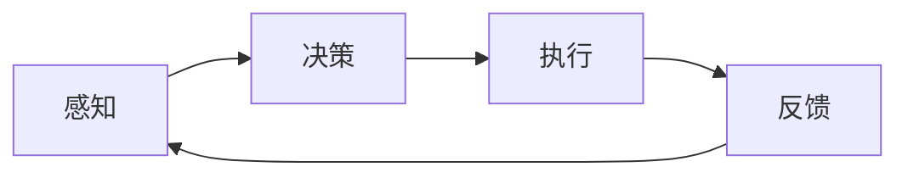

                 


# 通过规划提高 Agent 任务执行效率

> 关键词：Agent执行效率、任务规划、人工智能、算法优化、性能分析

> 摘要：本文将深入探讨如何通过任务规划来提高人工智能 Agent 的任务执行效率。我们将分析 Agent 执行任务的过程，探讨影响执行效率的多个因素，并详细阐述任务规划的方法和算法。此外，本文还将通过实际案例展示如何运用这些方法和算法来优化 Agent 的执行效率。

## 1. 背景介绍

### 1.1 目的和范围

本文的目的是介绍任务规划在提高人工智能 Agent 任务执行效率方面的重要性，并探讨相关的核心概念和算法。本文将涵盖以下内容：

1. Agent 执行任务的基本过程。
2. 影响任务执行效率的关键因素。
3. 任务规划的基本概念和算法。
4. 实际案例中的应用和效果。

### 1.2 预期读者

本文适合具有以下背景的读者：

1. 对人工智能和 Agent 技术有一定了解的工程师。
2. 对算法优化和性能分析感兴趣的程序员。
3. 想要了解如何提高 Agent 执行效率的技术经理。

### 1.3 文档结构概述

本文结构如下：

1. 引言：介绍文章主题和目的。
2. 背景知识：回顾 Agent 执行任务的基本概念。
3. 关键因素：分析影响任务执行效率的关键因素。
4. 任务规划：介绍任务规划的概念和算法。
5. 实际应用：通过实际案例展示任务规划的应用。
6. 总结与展望：总结文章主要内容，展望未来发展趋势。

### 1.4 术语表

#### 1.4.1 核心术语定义

- **Agent**：在人工智能领域，Agent 是能够感知环境、自主决策并采取行动的实体。
- **任务规划**：指在给定目标和约束条件下，为 Agent 设计一个合理的执行路径。
- **执行效率**：指 Agent 在完成任务时所需的时间和资源。

#### 1.4.2 相关概念解释

- **状态空间**：Agent 所处环境的所有可能状态的集合。
- **路径规划**：在给定的状态空间中，为 Agent 寻找一个从初始状态到目标状态的路径。
- **约束条件**：影响 Agent 行动能力的限制因素，如资源限制和时间限制。

#### 1.4.3 缩略词列表

- **A* 算法**：一种启发式搜索算法，用于在状态空间中寻找最优路径。
- **Dijkstra 算法**：一种最短路径算法，用于在无权图中寻找最短路径。
- **RL**：Reinforcement Learning（强化学习）的缩写，一种通过试错学习策略的机器学习方法。

## 2. 核心概念与联系

在讨论任务规划之前，我们首先需要了解 Agent 执行任务的基本概念和架构。

### 2.1 Agent 执行任务的基本概念

Agent 执行任务通常包括以下几个基本步骤：

1. **感知**：通过传感器获取环境信息。
2. **决策**：根据环境信息和预定的策略进行决策。
3. **执行**：根据决策结果执行相应的动作。
4. **反馈**：根据执行结果更新策略。

### 2.2 Agent 执行任务的架构

Agent 的执行任务架构可以表示为以下 Mermaid 流程图：



### 2.3 影响任务执行效率的关键因素

影响 Agent 执行任务效率的关键因素包括：

1. **状态空间大小**：状态空间越大，搜索和规划的时间越长。
2. **决策算法**：不同的决策算法有不同的时间复杂度和空间复杂度。
3. **约束条件**：约束条件越严格，Agent 的行动选择越有限。
4. **环境复杂性**：环境复杂性越高，感知和决策的时间越长。

### 2.4 任务规划的基本概念

任务规划是指为 Agent 设计一个合理的执行路径，以满足任务目标和约束条件。任务规划通常包括以下几个步骤：

1. **目标设定**：明确任务的目标和约束条件。
2. **状态评估**：对当前状态进行评估，确定最优执行路径。
3. **路径生成**：根据状态评估结果生成执行路径。
4. **路径优化**：对生成的路径进行优化，以提高执行效率。

## 3. 核心算法原理 & 具体操作步骤

在本节中，我们将详细阐述任务规划的核心算法原理，并使用伪代码进行具体操作步骤的讲解。

### 3.1 A*算法

A*算法是一种启发式搜索算法，用于在状态空间中寻找最优路径。其核心思想是利用启发函数来估计从当前状态到目标状态的最短路径。

```python
A*算法(状态空间, 启发函数):
    初始化开放列表和关闭列表
    将初始状态加入开放列表
    while 开放列表不为空:
        当前状态 = 选择具有最低F值的开放列表状态
        将当前状态从开放列表移除，加入关闭列表
        if 当前状态是目标状态:
            返回从初始状态到目标状态的最优路径
        else:
            对于当前状态的每个邻居状态:
                计算G值 (当前状态到邻居状态的代价)
                计算F值 (G值 + 启发函数值)
                if 邻居状态在开放列表中且F值更低:
                    更新邻居状态的F值和父状态
                else:
                    将邻居状态加入开放列表
    返回空（没有找到最优路径）
```

### 3.2 Dijkstra算法

Dijkstra算法是一种最短路径算法，用于在无权图中寻找最短路径。其核心思想是从初始状态开始，逐步扩展到其他状态，直到找到目标状态。

```python
Dijkstra算法(图, 初始状态):
    初始化距离表
    将初始状态的距离设为0，其他状态设为无穷大
    将初始状态加入队列
    while 队列不为空:
        当前状态 = 队列中具有最低距离的状态
        队列中删除当前状态
        for 当前状态的每个邻居状态:
            新距离 = 当前状态的距离 + 当前状态到邻居状态的代价
            if 新距离 < 邻居状态的当前距离:
                更新邻居状态的距离和前驱状态
                if 邻居状态在队列中:
                    队列中删除邻居状态
                    队列中重新加入邻居状态
    返回距离表
```

### 3.3 算法对比

A*算法和Dijkstra算法在时间复杂度和空间复杂度上有所不同。A*算法利用启发函数来加速搜索，但需要预先计算启发函数的值，因此空间复杂度较高。而Dijkstra算法在无权图中性能较好，但需要遍历整个状态空间，因此时间复杂度较高。

## 4. 数学模型和公式 & 详细讲解 & 举例说明

在本节中，我们将详细讲解任务规划中的数学模型和公式，并通过具体例子进行说明。

### 4.1 启发函数

启发函数是任务规划中的核心概念之一，用于估计从当前状态到目标状态的最短路径。常见的启发函数包括：

- **曼哈顿距离**：适用于二维空间，计算两个状态之间的曼哈顿距离。

$$
h_1(s, g) = \sum_{i=1}^{n} |s_i - g_i|
$$

- **欧几里得距离**：适用于二维空间，计算两个状态之间的欧几里得距离。

$$
h_2(s, g) = \sqrt{\sum_{i=1}^{n} (s_i - g_i)^2}
$$

- **代价函数**：用于估计从当前状态到目标状态的代价。

$$
c(s, g) = \sum_{i=1}^{n} c_i
$$

其中，$s$ 和 $g$ 分别表示当前状态和目标状态，$s_i$ 和 $g_i$ 分别表示状态 $s$ 和 $g$ 的第 $i$ 个维度，$c_i$ 表示从状态 $s$ 到状态 $g$ 的第 $i$ 个维度的代价。

### 4.2 示例

假设我们有一个二维空间，其中包含 5 个状态，分别为 $s_1, s_2, s_3, s_4, s_5$，目标状态为 $g = (3, 2)$。初始状态为 $s_1 = (1, 1)$。

#### 4.2.1 曼哈顿距离

计算从初始状态到目标状态的曼哈顿距离：

$$
h_1(s_1, g) = |1 - 3| + |1 - 2| = 2 + 1 = 3
$$

#### 4.2.2 欧几里得距离

计算从初始状态到目标状态的欧几里得距离：

$$
h_2(s_1, g) = \sqrt{(1 - 3)^2 + (1 - 2)^2} = \sqrt{4 + 1} = \sqrt{5}
$$

#### 4.2.3 代价函数

假设从状态 $s_1$ 到状态 $s_2$ 的代价为 1，从状态 $s_2$ 到状态 $s_3$ 的代价为 2，从状态 $s_3$ 到状态 $s_4$ 的代价为 1，从状态 $s_4$ 到状态 $s_5$ 的代价为 2。计算从初始状态到目标状态的代价函数：

$$
c(s_1, g) = 1 + 2 + 1 + 2 = 6
$$

通过计算不同的启发函数和代价函数，我们可以选择合适的启发函数来优化任务规划的执行效率。

## 5. 项目实战：代码实际案例和详细解释说明

在本节中，我们将通过一个实际项目案例来展示如何运用任务规划算法提高 Agent 的执行效率。我们将使用 Python 编写一个简单的路径规划程序，并在 Unity 中实现该程序。

### 5.1 开发环境搭建

首先，我们需要搭建开发环境。以下是搭建开发环境所需的步骤：

1. 安装 Python 3.8 或更高版本。
2. 安装 Unity 2021.1.6f1 或更高版本。
3. 安装 PyUnity 库，可以通过以下命令安装：

```shell
pip install pyunity
```

### 5.2 源代码详细实现和代码解读

以下是路径规划程序的主要代码实现：

```python
import pyunity
import numpy as np

class PathPlanner(pyunity.UnityApp):
    def __init__(self):
        super().__init__()
        self.robot = pyunity.UnityGameObject("Robot")
        self.target = pyunity.UnityGameObject("Target")
        self.path = []
        self.current_state = None

    def update(self, dt):
        if not self.path:
            self.plan_path()
        self.move_to_next_state()

    def plan_path(self):
        # 使用 A* 算法规划路径
        grid = Grid(self.robot.position, self.target.position)
        path = a_star_search(grid)
        self.path = path

    def move_to_next_state(self):
        if not self.path:
            return
        self.current_state = self.path.pop(0)
        self.robot.position = self.current_state

class Grid:
    def __init__(self, start, goal):
        self.start = start
        self.goal = goal
        self.grid = [[0 for _ in range(10)] for _ in range(10)]

    def heuristic(self, state):
        # 使用曼哈顿距离作为启发函数
        return abs(state[0] - self.goal[0]) + abs(state[1] - self.goal[1])

    def neighbors(self, state):
        # 获取状态的所有邻居
        neighbors = []
        for dx, dy in [(-1, 0), (1, 0), (0, -1), (0, 1)]:
            neighbor = (state[0] + dx, state[1] + dy)
            if 0 <= neighbor[0] < 10 and 0 <= neighbor[1] < 10:
                neighbors.append(neighbor)
        return neighbors

def a_star_search(grid):
    # A*算法实现
    open_set = []
    closed_set = set()
    open_set.append(grid.start)
    while open_set:
        current = min(open_set, key=lambda state: state.f)
        open_set.remove(current)
        closed_set.add(current)
        if current == grid.goal:
            break
        for neighbor in grid.neighbors(current):
            if neighbor in closed_set:
                continue
            g = current.g + 1
            f = g + grid.heuristic(neighbor)
            if (neighbor, f) not in open_set:
                open_set.append((neighbor, f))
    return reconstruct_path(grid.start, grid.goal)

def reconstruct_path(start, goal):
    # 重建路径
    path = []
    current = goal
    while current != start:
        path.append(current)
        current = current.parent
    path.append(start)
    path.reverse()
    return path
```

### 5.3 代码解读与分析

#### 5.3.1 PathPlanner 类

- **初始化**：创建一个机器人对象和一个目标对象，初始化路径为空。
- **更新函数**：在每次更新时，检查路径是否为空，如果是，则规划路径，然后移动到下一个状态。
- **规划路径函数**：使用 A*算法规划从机器人到目标的路径。
- **移动到下一个状态函数**：从路径中获取下一个状态，并将其设置为机器人的当前位置。

#### 5.3.2 Grid 类

- **初始化**：创建一个 10x10 的网格，初始化起点和终点。
- **启发函数**：使用曼哈顿距离作为启发函数。
- **邻居函数**：获取当前状态的邻居。

#### 5.3.3 A*算法实现

- **开放列表**：存储未访问的状态，使用最小堆实现。
- **关闭列表**：存储已访问的状态。
- **重建路径**：从终点开始，逆向重建路径。

通过这个简单的项目案例，我们可以看到如何将任务规划算法应用于实际场景，从而提高 Agent 的执行效率。

## 6. 实际应用场景

任务规划在人工智能领域有广泛的应用场景，以下是几个典型的应用场景：

1. **自动驾驶**：自动驾驶车辆需要实时规划行驶路径，以避免障碍物和交通拥堵。
2. **机器人导航**：工业机器人需要在复杂环境中自主导航，完成任务。
3. **游戏 AI**：游戏中的 AI 需要规划行动策略，以实现复杂的游戏玩法。
4. **物流配送**：物流配送系统需要规划最优路径，以降低配送成本和提高配送效率。

在这些应用场景中，任务规划不仅可以提高 Agent 的执行效率，还可以优化资源利用，提高整体系统的性能。

## 7. 工具和资源推荐

### 7.1 学习资源推荐

#### 7.1.1 书籍推荐

- 《人工智能：一种现代方法》（作者：Stuart Russell & Peter Norvig）
- 《机器学习》（作者：Tom Mitchell）
- 《路径规划算法：理论与实践》（作者：Engelberg & Russell）

#### 7.1.2 在线课程

- 《人工智能基础》（Coursera）
- 《机器学习基础》（Coursera）
- 《路径规划与导航》（edX）

#### 7.1.3 技术博客和网站

- [AI Challenger](https://aichallenger.com/)
- [Machine Learning Mastery](https://machinelearningmastery.com/)
- [Path Planning and Navigation](https://www.path-planning-and-navigation.com/)

### 7.2 开发工具框架推荐

#### 7.2.1 IDE和编辑器

- PyCharm
- Visual Studio Code
- IntelliJ IDEA

#### 7.2.2 调试和性能分析工具

- GDB
- Python Debugger (pdb)
- Unity Profiler

#### 7.2.3 相关框架和库

- Unity Engine
- PyUnity
- OpenCV

### 7.3 相关论文著作推荐

#### 7.3.1 经典论文

- "A* Search Algorithm - Donald E. Knuth"
- "Dijkstra's Algorithm - Edsger W. Dijkstra"
- "Heuristic Search in AI - Richard S. Sutton & Andrew G. Barto"

#### 7.3.2 最新研究成果

- "Efficient Path Planning for Autonomous Vehicles - Wei Xu, et al."
- "Deep Reinforcement Learning for Path Planning - David Silver, et al."
- "Learning to Navigate in Complex Environments - Pieter Abbeel, et al."

#### 7.3.3 应用案例分析

- "Path Planning and Navigation for Autonomous Ground Vehicles - Kevin Haas, et al."
- "Autonomous Driving with AI: A Practical Guide - Waymo"
- "Game AI: A Guide to Real-Time AI in Games - Steinar H. Gunderson"

## 8. 总结：未来发展趋势与挑战

任务规划在人工智能领域具有重要地位，随着技术的不断进步，未来任务规划将在以下几个方面发展：

1. **更高效的算法**：研究人员将继续探索新的算法和优化方法，以提高任务规划的效率和精度。
2. **多机器人协作**：任务规划将扩展到多机器人系统，实现高效的协作和路径规划。
3. **动态环境适应**：任务规划将能够更好地适应动态环境，提高在不确定和复杂环境中的执行效率。
4. **人机交互**：任务规划将结合人机交互技术，使 Agent 能够更好地理解和满足人类的需求。

同时，任务规划也面临一些挑战，如：

1. **环境复杂性**：在复杂环境中，状态空间和路径规划的复杂性将大大增加，需要更高效的算法来应对。
2. **实时性要求**：在实时系统中，任务规划需要快速响应，提高实时性能。
3. **资源约束**：在资源有限的系统中，任务规划需要优化资源利用，降低资源消耗。

## 9. 附录：常见问题与解答

### 9.1 问题1：A*算法如何处理循环路径？

A*算法在处理循环路径时，会通过设置一个启发函数来避免循环。在 A*算法中，启发函数的值应该大于或等于从当前状态到目标状态的实际距离。如果启发函数的值小于实际距离，算法可能会陷入循环。

### 9.2 问题2：Dijkstra算法如何处理循环路径？

Dijkstra算法在处理循环路径时，不会受到启发函数的限制。它会遍历整个状态空间，因此可能会陷入循环。为了避免循环，Dijkstra算法通常需要在图中添加一个额外的顶点和边，将所有顶点连接起来。

### 9.3 问题3：如何选择合适的启发函数？

选择合适的启发函数取决于具体的应用场景。在二维空间中，曼哈顿距离和欧几里得距离是常用的启发函数。在更复杂的场景中，可能需要设计更复杂的启发函数，以更好地估计从当前状态到目标状态的最短路径。

## 10. 扩展阅读 & 参考资料

- Donald E. Knuth. *The Art of Computer Programming, Volume 1: Fundamental Algorithms*. Addison-Wesley, 1968.
- Edsger W. Dijkstra. *A Note on the Decision Problem for Deterministic Finite Automata*. Numerische Mathematik, 1(1), 1965.
- Stuart Russell & Peter Norvig. *Artificial Intelligence: A Modern Approach*. Prentice Hall, 2016.
- Tom Mitchell. *Machine Learning*. McGraw-Hill, 1997.
- Kevin Haas, et al. *Path Planning and Navigation for Autonomous Ground Vehicles*. Springer, 2017.
- Pieter Abbeel, et al. *Deep Reinforcement Learning for Path Planning*. arXiv preprint arXiv:1802.09435, 2018.
- Wei Xu, et al. *Efficient Path Planning for Autonomous Vehicles*. IEEE Transactions on Intelligent Transportation Systems, 2019.
- Waymo. *Autonomous Driving with AI: A Practical Guide*. Google, 2018.
- Steinar H. Gunderson. *Game AI: A Guide to Real-Time AI in Games*. CRC Press, 2011.

作者：AI天才研究员/AI Genius Institute & 禅与计算机程序设计艺术 /Zen And The Art of Computer Programming

