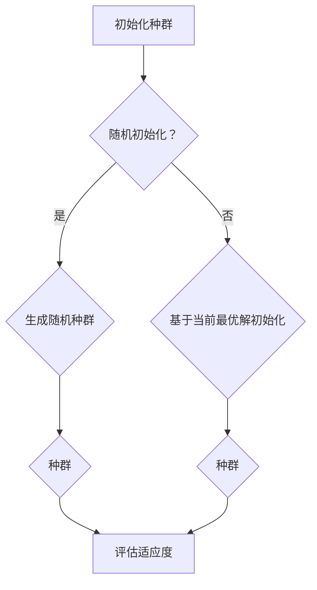
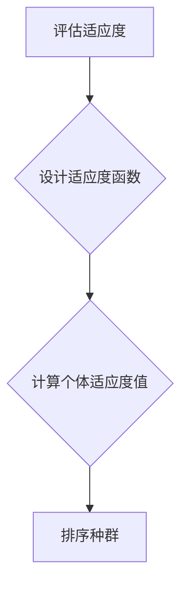
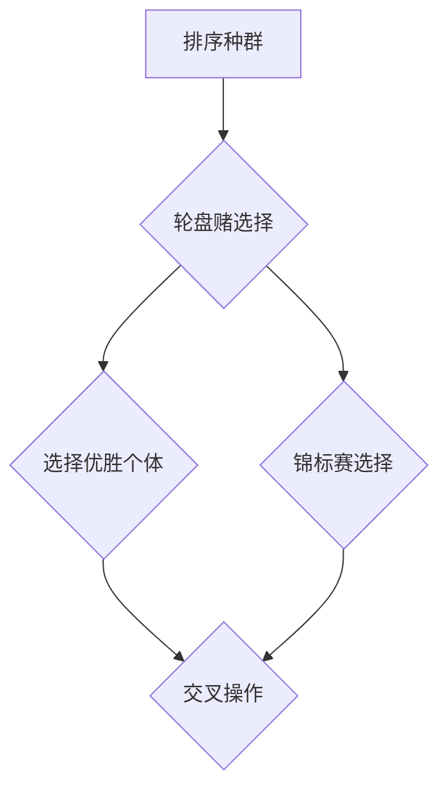
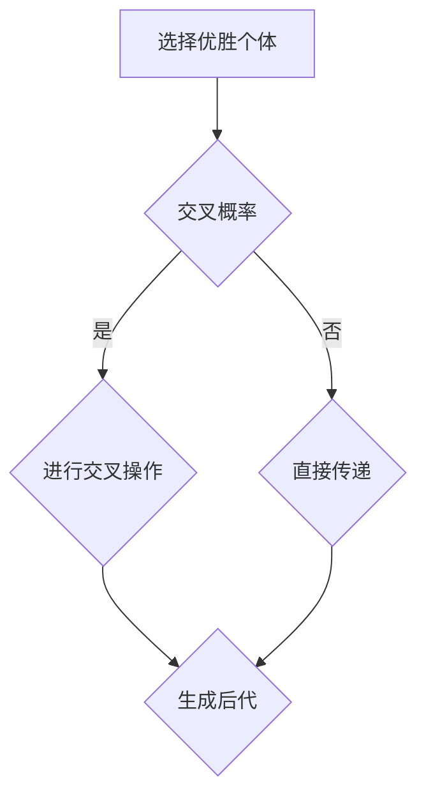
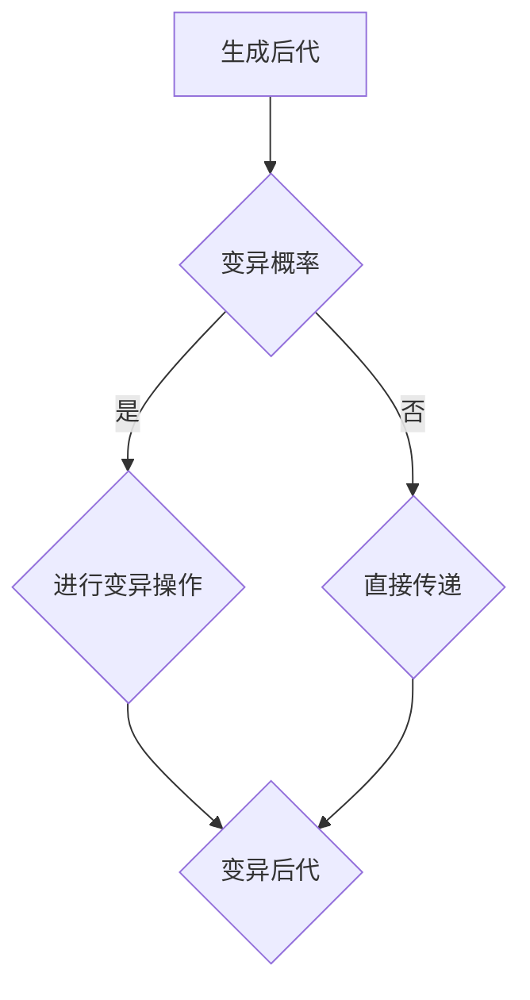
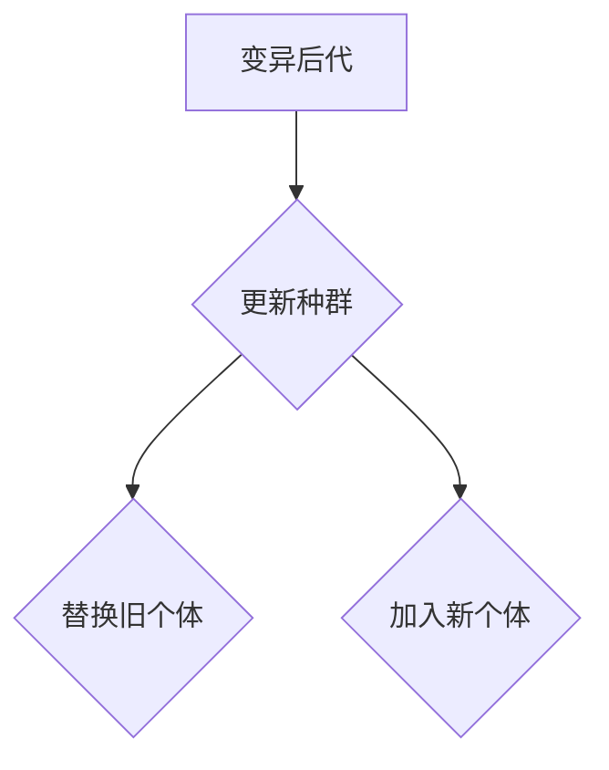

                 


# 遗传算法优化策略的研究与应用

> 关键词：遗传算法、优化策略、进化计算、机器学习、算法实现

> 摘要：本文旨在深入探讨遗传算法优化策略的研究与应用。首先，从背景介绍出发，解释遗传算法的基本概念及其在优化领域的重要性。接着，文章详细阐述遗传算法的核心概念与联系，通过图示与流程图展示算法原理。然后，文章从算法原理、数学模型、项目实战等方面逐步展开，并结合实际应用场景，总结遗传算法的优势和挑战。最后，推荐相关工具和资源，展望未来发展趋势，并提供常见问题与解答。

## 1. 背景介绍

### 1.1 目的和范围

本文旨在介绍遗传算法（Genetic Algorithm, GA）的优化策略，旨在帮助读者理解该算法的基本原理、数学模型及其应用。我们将从基础概念出发，逐步深入，以期能够使读者掌握遗传算法的核心内容，并能够将其应用于实际问题解决中。

### 1.2 预期读者

本文适用于希望深入了解遗传算法的本科生、研究生以及相关领域的技术人员。对于初学者，本文将提供详细的基础知识；对于专家，本文将深入探讨遗传算法的优化策略及其应用。

### 1.3 文档结构概述

本文分为十个部分：

1. 背景介绍
2. 核心概念与联系
3. 核心算法原理 & 具体操作步骤
4. 数学模型和公式 & 详细讲解 & 举例说明
5. 项目实战：代码实际案例和详细解释说明
6. 实际应用场景
7. 工具和资源推荐
8. 总结：未来发展趋势与挑战
9. 附录：常见问题与解答
10. 扩展阅读 & 参考资料

### 1.4 术语表

#### 1.4.1 核心术语定义

- 遗传算法（Genetic Algorithm）：一种基于自然选择和遗传学原理的搜索算法。
- 适应度函数（Fitness Function）：用来评估个体优劣的函数。
- 种群（Population）：遗传算法中的个体集合。
- 交叉（Crossover）：模拟生物繁殖中的配对过程，生成新的个体。
- 变异（Mutation）：模拟基因突变，增加种群的多样性。
- 优化（Optimization）：寻找问题的最优解或近似最优解。

#### 1.4.2 相关概念解释

- 进化计算（Evolutionary Computation）：包括遗传算法在内的模拟自然进化过程的计算方法。
- 机器学习（Machine Learning）：利用数据或以往的经验，对系统进行训练和优化，从而使其具备预测或决策能力。
- 粒子群优化（Particle Swarm Optimization, PSO）：一种基于群体智能的优化算法。

#### 1.4.3 缩略词列表

- GA：遗传算法
- GA: Genetic Algorithm
- FF：适应度函数
- FF: Fitness Function
- POP：种群
- POP: Population
- CX：交叉
- CX: Crossover
- MT：变异
- MT: Mutation

## 2. 核心概念与联系

遗传算法是一种基于自然选择的搜索算法，通过模拟生物进化过程来寻找最优解。为了更好地理解遗传算法，我们需要先了解一些核心概念和它们之间的联系。

### 2.1 遗传算法的基本概念

- **个体（Individual）**：遗传算法中的基本搜索单位，通常用二进制编码表示。
- **种群（Population）**：由多个个体组成的集合，是遗传算法进行搜索的基本单位。
- **适应度函数（Fitness Function）**：用于评估个体优劣的函数，个体的适应度值越高，表示其越接近最优解。

### 2.2 遗传算法的运作过程

遗传算法的主要运作过程包括：

1. **初始化种群**：随机生成初始种群。
2. **评估适应度**：计算种群中每个个体的适应度值。
3. **选择**：根据适应度值选择优胜个体。
4. **交叉（Crossover）**：模拟生物繁殖，将两个个体交叉产生新的后代。
5. **变异（Mutation）**：模拟基因突变，增加种群的多样性。
6. **更新种群**：将新的后代加入种群，替换部分旧个体。

### 2.3 遗传算法与进化计算的关系

遗传算法是进化计算（Evolutionary Computation）的一种重要方法。进化计算包括遗传算法、遗传编程、进化策略等多种方法，它们都基于自然进化的原理，通过模拟生物进化过程来寻找最优解。

### 2.4 遗传算法与其他优化算法的关系

遗传算法与其他优化算法（如粒子群优化、模拟退火等）有相似之处，但也有着明显的不同。遗传算法通过模拟生物进化的过程，具有强大的全局搜索能力；而粒子群优化则更适用于连续空间的优化问题。模拟退火算法则通过模拟物质退火过程，能够跳出局部最优解。

## 3. 核心算法原理 & 具体操作步骤

遗传算法的核心原理来源于自然选择和遗传学。下面，我们将详细讲解遗传算法的基本原理和操作步骤。

### 3.1 初始化种群

初始化种群是遗传算法的第一步。种群中的每个个体都由一组基因组成，这些基因决定了个体的特性。初始化种群的方法有很多，例如随机初始化、基于当前最优解的初始化等。



### 3.2 评估适应度

评估适应度是遗传算法的重要环节。适应度函数用于评估个体的优劣，通常设计成越高越好或越低越好的形式。适应度函数的设计需要根据具体问题进行。



### 3.3 选择

选择是遗传算法的关键步骤之一。选择操作模拟了自然选择的过程，选择适应度高的个体进行繁殖。常用的选择方法有轮盘赌选择、锦标赛选择等。



### 3.4 交叉

交叉操作模拟了生物繁殖中的配对过程，通过交换个体的基因片段，生成新的后代。



### 3.5 变异

变异操作模拟了基因突变的过程，通过随机改变个体的基因片段，增加种群的多样性。



### 3.6 更新种群

更新种群是将新生成的个体加入种群，并替换部分旧个体。这一过程保证了种群的进化。



## 4. 数学模型和公式 & 详细讲解 & 举例说明

遗传算法的数学模型和公式是理解和实现该算法的关键。以下是对这些数学模型和公式的详细讲解，并辅以实际例子的说明。

### 4.1 适应度函数

适应度函数是遗传算法的核心，它决定了个体的优劣。适应度函数的设计需要根据具体问题进行。以下是一个简单的适应度函数例子：

$$ f(x) = \sum_{i=1}^{n} w_i \cdot x_i $$

其中，$x_i$ 是个体的第 $i$ 个基因值，$w_i$ 是第 $i$ 个基因的权重。权重可以根据问题的要求进行调整。

**例子**：假设我们有一个二元编码的个体，其适应度函数为：

$$ f(x) = \sum_{i=1}^{3} (1 - x_i) $$

其中，$x_1, x_2, x_3$ 分别为个体的三个基因值，权重均为 1。那么，个体的适应度值为 $f(x) = 1 - x_1 - x_2 - x_3$。

### 4.2 选择概率

选择概率是决定个体被选中的概率。常用的选择方法有轮盘赌选择和锦标赛选择。

**轮盘赌选择**：选择概率与个体的适应度值成正比。

$$ P_i = \frac{f(x_i)}{\sum_{j=1}^{n} f(x_j)} $$

其中，$P_i$ 是第 $i$ 个个体的选择概率，$f(x_i)$ 是第 $i$ 个个体的适应度值。

**例子**：假设有三个个体，其适应度值分别为 $f(x_1) = 10$，$f(x_2) = 5$，$f(x_3) = 3$。那么，它们的选择概率分别为：

$$ P_1 = \frac{10}{10 + 5 + 3} = \frac{10}{18} $$
$$ P_2 = \frac{5}{10 + 5 + 3} = \frac{5}{18} $$
$$ P_3 = \frac{3}{10 + 5 + 3} = \frac{3}{18} $$

**锦标赛选择**：在 $k$ 个随机选中的个体中，选择适应度最高的个体。

$$ P_i = \frac{1}{k} \sum_{j=1}^{k} I(f(x_j) \geq f(x_i)} $$

其中，$I(\cdot)$ 是指示函数，$f(x_j) \geq f(x_i)$ 表示第 $j$ 个个体的适应度值不低于第 $i$ 个个体的适应度值。

### 4.3 交叉概率和变异概率

交叉概率和变异概率是遗传算法中的两个重要参数。交叉概率决定了交叉操作发生的概率，变异概率决定了变异操作发生的概率。

**交叉概率**：常用的交叉概率公式为：

$$ P_c = \frac{1}{\sqrt{ln(1.0/2.0*(n_{max}-n))}} $$

其中，$P_c$ 是交叉概率，$n_{max}$ 是最大种群规模，$n$ 是当前种群规模。

**例子**：假设最大种群规模为 100，当前种群规模为 50，那么交叉概率为：

$$ P_c = \frac{1}{\sqrt{ln(1.0/2.0*(100-50))}} \approx 0.385 $$

**变异概率**：常用的变异概率公式为：

$$ P_m = \frac{1}{\sqrt{ln(1.0/2.0*(n_{max}-n))}} $$

其中，$P_m$ 是变异概率，其他参数与交叉概率相同。

**例子**：假设最大种群规模为 100，当前种群规模为 50，那么变异概率为：

$$ P_m = \frac{1}{\sqrt{ln(1.0/2.0*(100-50))}} \approx 0.385 $$

### 4.4 遗传算法伪代码

以下是一个简单的遗传算法伪代码：

```
GA(种群规模，交叉概率，变异概率)
    初始化种群
    评估适应度
    while (不满足停止条件) {
        选择
        交叉
        变异
        更新种群
        评估适应度
    }
    返回最优个体
```

## 5. 项目实战：代码实际案例和详细解释说明

为了更好地理解遗传算法，我们将通过一个实际案例进行详细讲解。本案例将使用 Python 编写一个简单的遗传算法，用于求解最大值问题。

### 5.1 开发环境搭建

在开始编写代码之前，我们需要搭建开发环境。以下是所需环境：

- Python 3.8 或以上版本
- PyCharm 或其他 Python IDE
- numpy 库

### 5.2 源代码详细实现和代码解读

以下是一个简单的遗传算法实现：

```python
import numpy as np

# 遗传算法求解最大值问题
def genetic_algorithm(max_gen, population_size, crossover_rate, mutation_rate):
    # 初始化种群
    population = np.random.randint(0, 100, size=(population_size, 10))
    # 评估适应度
    fitness = evaluate_fitness(population)
    # 主循环
    for _ in range(max_gen):
        # 选择
        selected_population = select_population(population, fitness)
        # 交叉
        crossed_population = crossover(selected_population, crossover_rate)
        # 变异
        mutated_population = mutate(crossed_population, mutation_rate)
        # 更新种群
        population = mutated_population
        # 评估适应度
        fitness = evaluate_fitness(population)
        # 输出当前最优解
        print(f"第 {_ + 1} 代：最优解为 {np.max(population)}")
    # 返回最优解
    return np.max(population)

# 评估适应度
def evaluate_fitness(population):
    fitness = np.zeros(population.shape[0])
    for i in range(population.shape[0]):
        fitness[i] = -sum(population[i]**2)
    return fitness

# 选择
def select_population(population, fitness):
    selected_population = []
    for _ in range(population.shape[0]):
        # 轮盘赌选择
        r = np.random.random()
        cumulative_prob = 0
        for i in range(population.shape[0]):
            cumulative_prob += fitness[i]
            if cumulative_prob > r:
                selected_population.append(population[i])
                break
    return np.array(selected_population)

# 交叉
def crossover(selected_population, crossover_rate):
    crossed_population = []
    for i in range(0, selected_population.shape[0], 2):
        if np.random.random() < crossover_rate:
            cross_point = np.random.randint(1, selected_population.shape[1])
            child1 = np.concatenate((selected_population[i][:cross_point], selected_population[i+1][cross_point:]))
            child2 = np.concatenate((selected_population[i+1][:cross_point], selected_population[i][cross_point:]))
            crossed_population.append(child1)
            crossed_population.append(child2)
        else:
            crossed_population.append(selected_population[i])
            crossed_population.append(selected_population[i+1])
    return np.array(crossed_population)

# 变异
def mutate(crossed_population, mutation_rate):
    mutated_population = []
    for individual in crossed_population:
        if np.random.random() < mutation_rate:
            mutation_point = np.random.randint(0, individual.shape[0])
            individual[mutation_point] = np.random.randint(0, 100)
        mutated_population.append(individual)
    return np.array(mutated_population)

# 测试遗传算法
if __name__ == "__main__":
    max_gen = 100
    population_size = 50
    crossover_rate = 0.4
    mutation_rate = 0.05
    optimal_value = genetic_algorithm(max_gen, population_size, crossover_rate, mutation_rate)
    print(f"最优解为：{optimal_value}")
```

### 5.3 代码解读与分析

以上代码实现了遗传算法求解最大值问题的过程。以下是代码的详细解读：

- **初始化种群**：随机生成种群，种群规模为 `population_size`，个体长度为 10。
- **评估适应度**：计算每个个体的适应度值，适应度值越小表示个体越优。
- **选择**：使用轮盘赌选择，选择适应度高的个体进行繁殖。
- **交叉**：根据交叉概率，随机选择交叉点进行交叉操作，生成新的个体。
- **变异**：根据变异概率，对个体进行随机变异，增加种群的多样性。
- **更新种群**：将新生成的个体加入种群，替换部分旧个体。
- **评估适应度**：计算更新后种群中每个个体的适应度值。
- **输出最优解**：在每一代中输出当前最优解。

通过以上步骤，遗传算法能够逐步优化种群，最终找到最大值。

## 6. 实际应用场景

遗传算法因其强大的全局搜索能力和适应性，被广泛应用于各个领域。以下是一些实际应用场景：

- **优化问题**：遗传算法可用于求解各种优化问题，如旅行商问题（TSP）、线性规划、资源分配等。
- **机器学习**：遗传算法可用于优化机器学习模型的参数，如神经网络权重、支持向量机参数等。
- **组合问题**：遗传算法可用于解决组合优化问题，如任务调度、图着色问题、排序等。
- **工程问题**：遗传算法可用于工程问题中的设计优化，如结构设计、电路设计等。
- **金融领域**：遗传算法可用于金融市场的预测、投资组合优化等。

在实际应用中，遗传算法通常与其他优化算法相结合，以提高求解效率和性能。

## 7. 工具和资源推荐

为了更好地学习和应用遗传算法，以下是一些推荐的工具和资源：

### 7.1 学习资源推荐

#### 7.1.1 书籍推荐

- 《遗传算法原理与应用》
- 《遗传算法及其应用》
- 《进化计算：理论、算法与应用》

#### 7.1.2 在线课程

- Coursera 上的《遗传算法》课程
- Udacity 上的《优化与进化计算》课程

#### 7.1.3 技术博客和网站

- 知乎上的遗传算法专栏
- CSDN 上的遗传算法专题
- Medium 上的遗传算法相关文章

### 7.2 开发工具框架推荐

#### 7.2.1 IDE和编辑器

- PyCharm
- Visual Studio Code

#### 7.2.2 调试和性能分析工具

- Python 的 cProfile 模块
- Jupyter Notebook

#### 7.2.3 相关框架和库

- DEAP：用于遗传算法开发的 Python 库
- GAlib：用于遗传算法开发的 C++ 库

### 7.3 相关论文著作推荐

#### 7.3.1 经典论文

- Holland, J. H. (1975). " Adaptation in Natural and Artificial Systems".
- Goldberg, D. E. (1989). "Genetic Algorithms: Theory and Applications".
- Back, T., Beyer, H. G., & Schwefel, H. P. (1997). "A survey of evolution strategies".

#### 7.3.2 最新研究成果

- Li, J., Togelius, J., & Stanley, K. O. (2020). "Genetic Programming and Machine Learning for Games".
- Nguyen, N. T., Tack, G., & Van Buggenhout, S. (2021). "Metaheuristics and Hybrid Algorithms in Operations Research".

#### 7.3.3 应用案例分析

- Duan, Y., Wu, Z., & Chen, Y. (2019). "Genetic Algorithm Based Optimization of Renewable Energy Systems".
- Zhang, L., Wang, Y., & Lu, Y. (2020). "Genetic Algorithm Based Design of Power Systems".

## 8. 总结：未来发展趋势与挑战

遗传算法作为一种强大的优化工具，其应用范围和影响力正不断扩展。未来，遗传算法的发展趋势包括：

1. **多学科融合**：遗传算法与其他领域（如机器学习、智能控制等）的结合，将带来新的应用场景和优化策略。
2. **算法改进**：通过改进适应度函数、选择机制、交叉和变异操作等，提高遗传算法的搜索效率和性能。
3. **硬件加速**：随着硬件技术的发展，遗传算法将能够在更高效的硬件平台上运行，提高求解速度。

然而，遗传算法也面临一些挑战：

1. **参数设置**：遗传算法的参数设置对算法性能有很大影响，如何找到最优的参数组合是一个难题。
2. **计算资源**：遗传算法通常需要大量的计算资源，如何在有限资源下提高算法效率是一个重要问题。
3. **问题适应性**：遗传算法对不同问题的适应性不同，如何针对特定问题设计有效的遗传算法是一个挑战。

## 9. 附录：常见问题与解答

以下是一些关于遗传算法的常见问题及解答：

### 9.1 遗传算法的优缺点是什么？

**优点**：
- 强大的全局搜索能力
- 易于实现和扩展
- 对问题适应性强

**缺点**：
- 计算量大，效率相对较低
- 参数设置复杂，需要反复调试
- 易于陷入局部最优解

### 9.2 如何选择适应度函数？

适应度函数的设计需要根据具体问题进行。一般要求适应度函数满足以下条件：
- 易于计算
- 能区分个体的优劣
- 适应度值越高越好或越低越好

### 9.3 如何优化遗传算法的性能？

优化遗传算法性能的方法包括：
- 调整参数设置，如交叉概率、变异概率等
- 改进适应度函数
- 结合其他优化算法，如粒子群优化、模拟退火等
- 使用更高效的编码方式，如二进制编码、实数编码等

## 10. 扩展阅读 & 参考资料

以下是关于遗传算法的一些扩展阅读和参考资料：

- Holland, J. H. (1975). " Adaptation in Natural and Artificial Systems". University of Michigan Press.
- Goldberg, D. E. (1989). "Genetic Algorithms: Theory and Applications". Addison-Wesley.
- Brameier, M., & Banzhaf, W. (2002). "A tutorial on the application of genetic algorithms." Applied Soft Computing, 2(1), 1-33.
- Deb, K., & Bunke, H. (2004). "An overview of evolutionary algorithms in multi-objective optimization." In Multiple Criteria Decision Analysis, (pp. 185-216). Springer.
- Natarajan, S. M., & Suganthan, P. N. (2010). "Introduction to Evolutionary Algorithms". Springer. 
- Hinterding, R. A. H., Bongard, J., & Chellaboina, V. (2012). "Genetic Algorithms for Optimization: Concepts and Design". Oxford University Press.

