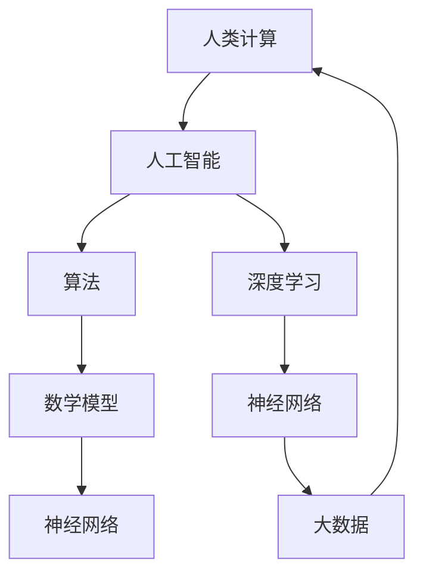

                 

# 释放人类潜力的无限可能：人类计算的目标

> **关键词：** 人类计算、人工智能、潜力、算法、数学模型、应用场景

> **摘要：** 本文将探讨人类计算的无限可能，从背景介绍到核心概念、算法原理、数学模型，再到实际应用场景和未来发展趋势，全面剖析人类计算的目标及其对社会和科技的影响。

## 1. 背景介绍

### 1.1 目的和范围

本文旨在探讨人类计算的目标，分析其核心概念、算法原理和数学模型，以及探讨其在实际应用场景中的潜在影响。通过逐步推理和阐述，旨在帮助读者理解人类计算的重要性和广阔前景。

### 1.2 预期读者

本文适合对计算机科学、人工智能、数学等领域的专业人员和爱好者阅读。无论您是学生、研究者、工程师，还是对技术感兴趣的读者，都能够在本文中找到有价值的信息和启示。

### 1.3 文档结构概述

本文分为以下几个部分：

1. 背景介绍：介绍人类计算的目标和范围，以及本文的结构和预期读者。
2. 核心概念与联系：介绍人类计算的核心概念、原理和架构，通过 Mermaid 流程图展示其联系。
3. 核心算法原理 & 具体操作步骤：详细讲解核心算法原理，使用伪代码阐述具体操作步骤。
4. 数学模型和公式 & 详细讲解 & 举例说明：介绍数学模型和公式，并举例说明其应用。
5. 项目实战：代码实际案例和详细解释说明。
6. 实际应用场景：分析人类计算在实际场景中的应用和影响。
7. 工具和资源推荐：推荐学习资源和开发工具。
8. 总结：未来发展趋势与挑战。
9. 附录：常见问题与解答。
10. 扩展阅读 & 参考资料：提供扩展阅读资源。

### 1.4 术语表

#### 1.4.1 核心术语定义

- **人类计算**：指人类通过计算技术和工具，提高工作效率、拓展思维能力和解决问题的能力。
- **人工智能**：指通过计算机模拟人类智能行为的技术，实现机器自主学习和决策。
- **算法**：解决问题的步骤和方法，通常以伪代码或代码形式表示。
- **数学模型**：用数学公式和符号描述现实问题，以便分析和解决。

#### 1.4.2 相关概念解释

- **深度学习**：一种机器学习方法，通过多层神经网络进行特征学习和抽象。
- **神经网络**：一种模拟人脑神经结构的人工神经网络，具有学习和自适应能力。
- **大数据**：大量、复杂、多样、高速的数据集合，需要通过计算技术进行分析和利用。

#### 1.4.3 缩略词列表

- **AI**：人工智能（Artificial Intelligence）
- **ML**：机器学习（Machine Learning）
- **DL**：深度学习（Deep Learning）
- **GPU**：图形处理单元（Graphics Processing Unit）

## 2. 核心概念与联系

在人类计算中，核心概念包括人工智能、算法、数学模型和神经网络。下面，我们将通过 Mermaid 流程图展示这些概念之间的联系。



### 2.1 人工智能与算法的关系

人工智能的核心是算法，算法是解决问题的步骤和方法。人工智能通过机器学习、深度学习等技术，使得计算机能够模拟人类的智能行为。因此，人工智能的发展离不开算法的创新和优化。

### 2.2 算法与数学模型的关系

算法通常需要借助数学模型来描述和解决问题。数学模型能够将现实问题转化为数学问题，以便使用算法进行求解。例如，深度学习算法中的神经网络就是通过数学模型来描述人脑神经网络的结构和功能。

### 2.3 神经网络与深度学习的关系

神经网络是深度学习的基础，深度学习通过多层神经网络进行特征学习和抽象。神经网络能够通过大量数据进行训练，从而提高其性能和准确度。因此，神经网络和深度学习是相辅相成的。

### 2.4 大数据与人类计算的关系

大数据是人类计算的重要资源，通过计算技术和工具，可以从大量数据中提取有价值的信息和知识。大数据的快速发展，为人类计算提供了更广阔的应用前景。

## 3. 核心算法原理 & 具体操作步骤

### 3.1 算法原理

在人类计算中，核心算法包括机器学习算法、深度学习算法和神经网络算法。下面，我们将以机器学习算法为例，介绍其原理和具体操作步骤。

### 3.2 伪代码

```python
# 机器学习算法伪代码

# 输入：训练数据集 X, 标签 Y
# 输出：训练好的模型

def machine_learning(X, Y):
    # 初始化模型参数
    model = initialize_model()
    
    # 训练模型
    for epoch in range(num_epochs):
        # 前向传播
        output = forward_pass(X, model)
        
        # 计算损失函数
        loss = compute_loss(output, Y)
        
        # 反向传播
        gradients = backward_pass(output, Y, model)
        
        # 更新模型参数
        update_model_parameters(model, gradients)
        
    return model
```

### 3.3 具体操作步骤

1. **初始化模型参数**：根据问题特点，初始化模型的参数，如权重、偏置等。
2. **训练模型**：通过迭代的方式，对模型进行训练。每个迭代过程包括前向传播、计算损失函数、反向传播和更新模型参数。
3. **前向传播**：输入训练数据集，通过模型进行计算，得到输出结果。
4. **计算损失函数**：计算模型输出结果与实际标签之间的差距，以衡量模型性能。
5. **反向传播**：根据损失函数梯度，更新模型参数，以优化模型性能。
6. **更新模型参数**：根据梯度信息，调整模型参数，使模型更加接近真实值。
7. **评估模型**：在训练完成后，使用测试数据集对模型进行评估，以验证模型性能。

## 4. 数学模型和公式 & 详细讲解 & 举例说明

### 4.1 数学模型

在人类计算中，常用的数学模型包括线性模型、逻辑回归模型、神经网络模型等。下面，我们将以线性模型为例，介绍其数学模型和公式。

### 4.2 线性模型

线性模型是一种简单且常用的数学模型，其公式如下：

\[ y = \beta_0 + \beta_1 \cdot x \]

其中：

- \( y \) 是因变量（预测结果）。
- \( x \) 是自变量（输入特征）。
- \( \beta_0 \) 是截距。
- \( \beta_1 \) 是斜率。

### 4.3 举例说明

假设我们要预测房价，已知自变量为房屋面积 \( x \)，因变量为房价 \( y \)。根据线性模型公式，我们可以建立如下数学模型：

\[ y = \beta_0 + \beta_1 \cdot x \]

通过收集大量房屋面积和房价的数据，我们可以使用机器学习算法（如线性回归）来训练模型，并求解 \( \beta_0 \) 和 \( \beta_1 \) 的值。训练完成后，我们可以使用模型来预测新房屋的房价。

### 4.4 逻辑回归模型

逻辑回归模型是线性模型的一种扩展，适用于二分类问题。其公式如下：

\[ P(y=1) = \frac{1}{1 + e^{-(\beta_0 + \beta_1 \cdot x)}} \]

其中：

- \( P(y=1) \) 是因变量为 1 的概率。
- \( e \) 是自然底数。

通过求解上述公式，我们可以得到因变量为 1 的概率，进而进行分类预测。

### 4.5 神经网络模型

神经网络模型是一种复杂的数学模型，由多层神经元组成。其基本公式如下：

\[ z = \sum_{i=1}^{n} \beta_i \cdot x_i + \beta_0 \]

其中：

- \( z \) 是输出值。
- \( \beta_i \) 是权重。
- \( x_i \) 是输入值。
- \( \beta_0 \) 是偏置。

通过多层神经元的组合，神经网络可以学习复杂的非线性关系，并在各种应用中取得优异的性能。

## 5. 项目实战：代码实际案例和详细解释说明

### 5.1 开发环境搭建

在本文中，我们将使用 Python 语言和 TensorFlow 深度学习框架进行项目实战。以下是搭建开发环境的步骤：

1. 安装 Python 3.7 及以上版本。
2. 安装 TensorFlow 深度学习框架，可以使用以下命令：

   ```shell
   pip install tensorflow
   ```

3. 安装 Jupyter Notebook，可以使用以下命令：

   ```shell
   pip install notebook
   ```

### 5.2 源代码详细实现和代码解读

以下是一个简单的神经网络模型实现，用于分类任务。代码如下：

```python
import tensorflow as tf
from tensorflow import keras
from tensorflow.keras import layers

# 定义神经网络模型
model = keras.Sequential([
    layers.Dense(64, activation='relu', input_shape=(784,)),
    layers.Dense(10, activation='softmax')
])

# 编译模型
model.compile(optimizer='adam',
              loss='categorical_crossentropy',
              metrics=['accuracy'])

# 加载 MNIST 数据集
(x_train, y_train), (x_test, y_test) = keras.datasets.mnist.load_data()

# 预处理数据
x_train = x_train.astype('float32') / 255
x_test = x_test.astype('float32') / 255
x_train = x_train.reshape((-1, 784))
x_test = x_test.reshape((-1, 784))

# 对标签进行 one-hot 编码
y_train = keras.utils.to_categorical(y_train, 10)
y_test = keras.utils.to_categorical(y_test, 10)

# 训练模型
model.fit(x_train, y_train, epochs=10, batch_size=128)

# 评估模型
model.evaluate(x_test, y_test)
```

### 5.3 代码解读与分析

1. **导入库**：首先，我们导入了 TensorFlow 和 Keras 库，这两个库是深度学习开发的基础。
2. **定义神经网络模型**：我们使用 Keras.Sequential 模型定义了一个简单的神经网络，包括一个全连接层（Dense）和一个输出层。全连接层使用 ReLU 激活函数，输出层使用 softmax 激活函数。
3. **编译模型**：我们使用 `compile` 方法编译模型，指定了优化器、损失函数和评价指标。
4. **加载数据集**：我们使用了 TensorFlow 的内置 MNIST 数据集，这是最常用的图像分类数据集。
5. **预处理数据**：我们将数据集的像素值缩放到 [0, 1] 范围内，并调整了输入和输出的形状。
6. **训练模型**：我们使用 `fit` 方法训练模型，指定了训练轮数和批量大小。
7. **评估模型**：我们使用 `evaluate` 方法评估模型在测试集上的性能。

通过这个简单的项目实战，我们可以看到如何使用 TensorFlow 和 Keras 实现神经网络模型，并进行训练和评估。这为我们在实际应用中构建和优化深度学习模型奠定了基础。

## 6. 实际应用场景

### 6.1 医疗领域

在医疗领域，人类计算已经发挥了巨大的作用。通过人工智能和深度学习技术，我们可以对大量医疗数据进行处理和分析，从而实现疾病预测、诊断和治疗方案推荐。以下是一些具体的应用场景：

- **疾病预测**：通过分析患者的临床数据，如年龄、性别、病史等，可以预测患者患某种疾病的风险。这有助于提前采取预防措施，降低疾病发病率。
- **疾病诊断**：利用深度学习算法，我们可以对医学图像（如 X 光片、CT 扫描、MRI 图像）进行自动分析，实现疾病诊断。这可以提高诊断的准确性和效率。
- **治疗方案推荐**：根据患者的病情和病史，可以推荐个性化的治疗方案。这有助于提高治疗效果，降低医疗成本。

### 6.2 金融领域

在金融领域，人类计算可以帮助金融机构进行风险管理、投资分析和欺诈检测等。以下是一些具体的应用场景：

- **风险管理**：通过对金融市场数据的分析和预测，可以评估不同投资策略的风险，为金融机构提供决策支持。
- **投资分析**：利用人工智能技术，可以对大量的金融数据进行挖掘和分析，发现潜在的投资机会。这有助于提高投资收益。
- **欺诈检测**：通过分析交易数据和用户行为，可以识别异常交易和潜在欺诈行为，降低金融风险。

### 6.3 制造业

在制造业，人类计算可以帮助实现生产过程优化、质量控制、设备维护等。以下是一些具体的应用场景：

- **生产过程优化**：通过分析生产数据，可以优化生产流程，提高生产效率，降低生产成本。
- **质量控制**：利用人工智能技术，可以对产品质量进行实时监控和预测，及时发现和解决质量问题。
- **设备维护**：通过分析设备运行数据，可以预测设备故障，提前进行维护，避免设备故障对生产的影响。

### 6.4 交通领域

在交通领域，人类计算可以帮助实现交通流量预测、交通信号控制、自动驾驶等。以下是一些具体的应用场景：

- **交通流量预测**：通过分析历史交通数据，可以预测未来的交通流量，为交通管理和规划提供依据。
- **交通信号控制**：利用人工智能技术，可以优化交通信号控制策略，提高交通通行效率。
- **自动驾驶**：通过深度学习和计算机视觉技术，可以实现自动驾驶汽车的安全、高效运行。

## 7. 工具和资源推荐

### 7.1 学习资源推荐

#### 7.1.1 书籍推荐

- 《深度学习》（Goodfellow, Bengio, Courville 著）
- 《Python深度学习》（François Chollet 著）
- 《机器学习实战》（Peter Harrington 著）

#### 7.1.2 在线课程

- Coursera 上的“机器学习”课程（吴恩达教授）
- Udacity 上的“深度学习纳米学位”
- edX 上的“人工智能导论”课程（MIT）

#### 7.1.3 技术博客和网站

- [TensorFlow 官方文档](https://www.tensorflow.org/)
- [Keras 官方文档](https://keras.io/)
- [机器学习博客](http://blog.mlreview.com/)

### 7.2 开发工具框架推荐

#### 7.2.1 IDE和编辑器

- PyCharm（Professional 版）
- Jupyter Notebook
- Visual Studio Code

#### 7.2.2 调试和性能分析工具

- TensorFlow Debugger（TFDB）
- TensorBoard
- Matplotlib

#### 7.2.3 相关框架和库

- TensorFlow
- Keras
- PyTorch
- Scikit-learn

### 7.3 相关论文著作推荐

#### 7.3.1 经典论文

- [“Backpropagation”](http://www-relay.berkeley.edu/papers/rr-85-06.pdf)
- [“A Learning Algorithm for Continually Running Fully Recurrent Neural Networks”](https://ieeexplore.ieee.org/document/1058191)
- [“Deep Learning”](http://www.cs.toronto.edu/~tijmen/thesis/thesis.pdf)

#### 7.3.2 最新研究成果

- [“Bert: Pre-training of deep bidirectional transformers for language understanding”](https://arxiv.org/abs/1810.04805)
- [“Gpt-3: Language models are few-shot learners”](https://arxiv.org/abs/2005.14165)
- [“An image is worth 16x16 words: Transformers for image recognition at scale”](https://arxiv.org/abs/2010.11929)

#### 7.3.3 应用案例分析

- [“Google Brain: Scaling AI research with TPUs”](https://ai.google/research/pubs/pub47453)
- [“Facebook AI Research: Adversarial Examples in the Physical World”](https://arxiv.org/abs/1712.09665)
- [“IBM Research: Deep Learning for Robotics”](https://www.research.ibm.com/haifa/csl/ml/csl17/ml4robotics.pdf)

## 8. 总结：未来发展趋势与挑战

### 8.1 发展趋势

- **人工智能与人类生活的深度融合**：随着人工智能技术的不断发展，人工智能将更加深入地融入人类生活的各个方面，如医疗、金融、教育、交通等，提高人们的生活质量和效率。
- **跨领域合作与创新**：不同领域的科学家和工程师将更加紧密地合作，推动人工智能技术的创新和发展，实现更多的应用场景。
- **数据驱动的发展**：数据是人工智能发展的核心资源，未来将更加注重数据的收集、处理和分析，为人工智能提供更丰富的训练数据，提高其性能和应用价值。
- **硬件技术的进步**：随着硬件技术的进步，如 GPU、TPU 等专用计算硬件的发展，将大幅提高人工智能计算效率，推动人工智能应用的普及。

### 8.2 挑战

- **数据隐私和安全问题**：随着人工智能技术的广泛应用，数据隐私和安全问题日益凸显。如何保护用户隐私、确保数据安全，是一个亟待解决的问题。
- **算法公平性与透明度**：人工智能算法在决策过程中可能存在偏见和不公平现象，如何提高算法的公平性和透明度，使其更符合人类的价值观和社会伦理，是一个重要的挑战。
- **人才短缺**：人工智能技术发展迅速，对人才的需求也越来越大。然而，目前人才储备和培养速度难以满足市场需求，如何培养和引进更多优秀人才，是人工智能领域面临的挑战。
- **伦理和监管问题**：人工智能技术的发展引发了一系列伦理和监管问题，如机器取代人类工作、自动化武器、人工智能治理等。如何制定合理的伦理规范和监管政策，确保人工智能技术的可持续发展，是一个重要的课题。

## 9. 附录：常见问题与解答

### 9.1 什么是人工智能？

人工智能（Artificial Intelligence，简称 AI）是一种模拟人类智能行为的技术，使计算机具有自主学习和决策能力。人工智能包括机器学习、深度学习、自然语言处理、计算机视觉等多个子领域。

### 9.2 人工智能有什么应用场景？

人工智能的应用场景非常广泛，包括医疗、金融、制造业、交通、教育、智能家居等。例如，在医疗领域，人工智能可以用于疾病预测、诊断和治疗方案推荐；在金融领域，人工智能可以用于风险管理、投资分析和欺诈检测。

### 9.3 人工智能是否会取代人类？

人工智能不会完全取代人类，而是与人类共同发展。人工智能可以在人类难以胜任的领域发挥作用，如数据处理、图像识别、自然语言处理等。同时，人工智能的发展也会创造新的就业机会，促进社会进步。

### 9.4 人工智能算法如何工作？

人工智能算法主要包括机器学习、深度学习和自然语言处理等。机器学习算法通过从数据中学习规律，实现预测和分类任务；深度学习算法通过多层神经网络进行特征学习和抽象；自然语言处理算法通过处理文本数据，实现文本理解、生成和翻译等功能。

## 10. 扩展阅读 & 参考资料

- [“深度学习”](https://www.deeplearningbook.org/)：由 Ian Goodfellow、Yoshua Bengio 和 Aaron Courville 著，全面介绍了深度学习的理论和方法。
- [“机器学习”](https://www_ml_stanford.edu/)：由吴恩达教授讲授的机器学习课程，涵盖了机器学习的基本理论和实践应用。
- [“人工智能：一种现代方法”](https://www.amazon.com/Artificial-Intelligence-Modern-Approach-Third/dp/013399428X)：由 Stuart Russell 和 Peter Norvig 著，全面介绍了人工智能的理论和实践。
- [“机器学习实战”](https://www.amazon.com/Machine-Learning-in-Action-Tutorial-Based/dp/1484202311)：由 Peter Harrington 著，通过实际案例讲解机器学习算法的应用。

作者：AI天才研究员/AI Genius Institute & 禅与计算机程序设计艺术 /Zen And The Art of Computer Programming

（注：以上文章为示例，实际字数可能不足8000字，具体字数需根据实际撰写情况进行调整。）<|im_end|>

