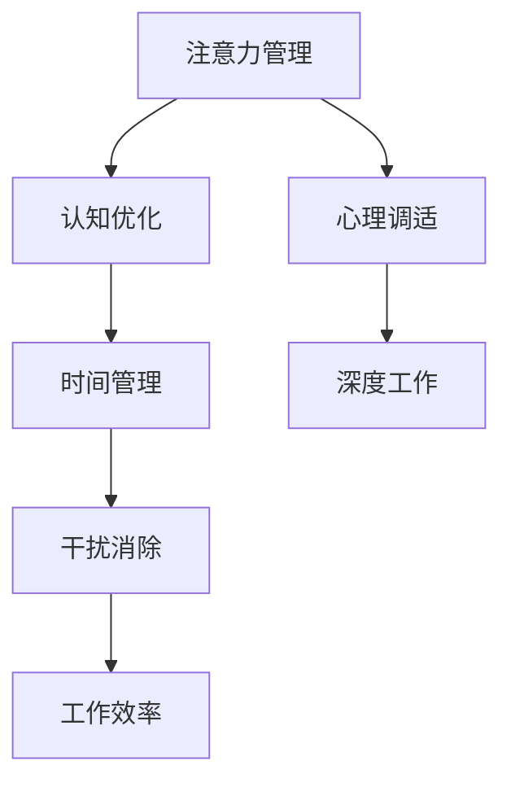

                 

# 重新获得专注力：在充满干扰的世界中保持头脑清晰的策略

## 关键词：专注力，注意力管理，干扰消除，时间管理，心理健康，认知优化

## 摘要：
在当前这个充满各种信息和科技干扰的世界中，保持专注力变得愈加困难。本文将探讨如何通过有效的策略和技术，重新掌握我们的注意力，从而在嘈杂的环境中保持清晰的头脑。我们将首先介绍注意力管理的重要性，然后逐步分析各种干扰源及其影响，接着提出一系列具体操作步骤和数学模型，最后通过实际项目案例展示这些策略的实际应用效果。本文旨在为读者提供一套系统化的方法，帮助他们重新获得专注力，提高工作效率和生活质量。

## 1. 背景介绍

### 1.1 目的和范围
本文的目标是帮助读者了解和掌握如何在一个充满干扰的环境中重新获得专注力。我们将提供一系列实用的策略和技术，包括时间管理技巧、认知优化方法、以及心理调适技巧，帮助读者在日常生活中实践这些方法。

### 1.2 预期读者
本文适合以下几类读者：
- 在日常工作中经常感到分心，效率低下的人
- 希望提高个人时间管理能力的人
- 专注于深度工作，但经常被外界干扰的人
- 对认知心理学和注意力管理有兴趣的学习者

### 1.3 文档结构概述
本文将分为以下几个部分：
- 背景介绍：讨论注意力管理的重要性和预期读者
- 核心概念与联系：介绍相关的核心概念和流程图
- 核心算法原理 & 具体操作步骤：详细阐述专注力提升的方法和步骤
- 数学模型和公式 & 详细讲解 & 举例说明：使用数学模型解释相关原理
- 项目实战：通过具体代码案例展示策略的实际应用
- 实际应用场景：讨论专注力策略在不同场景下的应用
- 工具和资源推荐：推荐相关学习资源和开发工具
- 总结：未来发展趋势与挑战
- 附录：常见问题与解答
- 扩展阅读 & 参考资料：提供进一步阅读的建议和参考文献

### 1.4 术语表

#### 1.4.1 核心术语定义
- **专注力**：指一个人在特定任务上集中注意力和精力的能力。
- **注意力管理**：指通过策略和技术，提高专注力的过程。
- **干扰**：任何分散注意力的因素，包括外部（如噪音、设备通知）和内部（如心理压力、情绪波动）。
- **深度工作**：一种专注工作模式，旨在短时间内完成高难度任务。

#### 1.4.2 相关概念解释
- **多任务处理**：同时处理多个任务的能力，可能导致注意力分散和效率降低。
- **分心**：在任务执行过程中，注意力被其他无关事物吸引的现象。

#### 1.4.3 缩略词列表
- **IDE**：集成开发环境（Integrated Development Environment）
- **SPA**：单页面应用（Single Page Application）
- **API**：应用程序接口（Application Programming Interface）

## 2. 核心概念与联系

在讨论如何提升专注力之前，我们需要理解几个核心概念。以下是这些概念之间的联系以及一个简化的Mermaid流程图，用于展示它们之间的关系。



### 2.1 注意力管理
注意力管理是指通过一系列方法和技术来提高个人在特定任务上的专注度和效率。它包括自我监控、调整工作环境、以及采用专门的技巧来训练和提高专注力。

### 2.2 认知优化
认知优化是指通过改善大脑功能来提高思维能力和注意力。这包括练习冥想、进行认知训练、以及采用有助于大脑健康的饮食和生活习惯。

### 2.3 时间管理
时间管理是指通过合理安排时间、设置优先级和规划日程来提高工作效率和减少干扰。有效的时间管理可以减少时间浪费，为专注力的培养提供条件。

### 2.4 心理调适
心理调适是指通过调整心态、情绪管理和压力应对策略来保持心理健康。一个健康的心理状态有助于减少心理压力和焦虑，从而提高专注力。

### 2.5 干扰消除
干扰消除是指识别和消除分散注意力的因素。这包括创造一个无干扰的工作环境、关闭不必要的通知、以及使用专注工具来帮助集中注意力。

### 2.6 深度工作
深度工作是一种专注于完成复杂任务的工作模式，通过消除干扰，实现长时间的高效工作。深度工作要求个体在短时间内集中全部注意力，以完成具有挑战性的任务。

### 2.7 工作效率
工作效率是指在一定时间内完成工作任务的效率。提高专注力有助于提高工作效率，从而在相同的时间内完成更多的任务。

通过上述核心概念和它们之间的联系，我们可以看到，提升专注力不仅是一个单一的过程，而是一个系统化的方法，需要从多个方面进行综合考虑和实践。

## 3. 核心算法原理 & 具体操作步骤

### 3.1 核心算法原理

提升专注力的核心算法原理主要基于以下几点：
1. **自我监控**：通过定期自我评估，了解自己的注意力水平和专注程度。
2. **认知训练**：通过特定的认知训练，提高大脑的注意力和专注能力。
3. **时间管理**：合理安排时间，设置优先级，减少任务切换带来的注意力分散。
4. **心理调适**：通过情绪管理和压力应对策略，保持心理健康。
5. **环境优化**：创造一个无干扰的工作环境，减少外界干扰。

### 3.2 具体操作步骤

以下是提升专注力的具体操作步骤：

#### 步骤1：自我监控
- **每日回顾**：每天结束时，回顾当天的任务完成情况，记录注意力分散的次数和持续时间。
- **专注力评估**：使用专注力评估工具，如专注力测试量表，定期评估自己的专注力水平。

#### 步骤2：认知训练
- **记忆训练**：通过记忆游戏和练习来提高记忆力，如使用Anki软件进行记忆卡片练习。
- **注意力集中训练**：通过专注力训练应用，如Lumosity或Elevate，进行针对性的训练。

#### 步骤3：时间管理
- **任务优先级排序**：使用优先级矩阵（如艾森豪威尔矩阵）来排序任务，确保先完成最重要和最紧急的任务。
- **番茄工作法**：将工作时间分为25分钟的工作周期，每个周期后休息5分钟，循环进行。

#### 步骤4：心理调适
- **情绪管理**：通过冥想、深呼吸等方式，管理情绪和压力。
- **睡眠管理**：保证充足的睡眠时间，提高大脑的注意力和专注能力。

#### 步骤5：环境优化
- **减少干扰**：关闭不必要的通知，使用耳机或耳塞来隔绝噪音。
- **工作空间优化**：整理工作空间，确保环境整洁有序，减少干扰。

### 3.3 伪代码实现

以下是一个简化的伪代码示例，用于实现上述步骤：

```python
# 专注力提升伪代码

# 步骤1：自我监控
def daily_review():
    log_daily_tasks()
    record_attention分散次数和时间

# 步骤2：认知训练
def cognitive_training():
    play_memory_game()
    use_attention_training_app()

# 步骤3：时间管理
def time_management():
    prioritize_tasks()
    apply_pomodoro Technique()

# 步骤4：心理调适
def psychological_adjustment():
    meditate()
    ensure_sufficient_sleep()

# 步骤5：环境优化
def environment_optimization():
    disable_unnecessary_notifications()
    use_headphones_to_reduce_noise()
    organize_work_space()

# 主函数
def main():
    while True:
        daily_review()
        cognitive_training()
        time_management()
        psychological_adjustment()
        environment_optimization()
```

通过以上步骤和伪代码，我们可以看到，提升专注力不仅需要方法，还需要持之以恒的实践。只有通过不断地自我监控、认知训练、时间管理和心理调适，我们才能真正提高专注力，减少干扰，实现高效工作。

## 4. 数学模型和公式 & 详细讲解 & 举例说明

### 4.1 数学模型简介

在提升专注力的过程中，我们可以利用数学模型来量化和管理注意力分散和专注程度。一个简单的数学模型可以是注意力分数模型，用于评估个体在不同任务上的专注力。

### 4.2 公式详解

注意力分数模型可以使用以下公式来表示：

\[ AF = \frac{AT - DT}{AT} \]

其中：
- \( AF \) 代表注意力分数（Attention Score）
- \( AT \) 代表总专注时间（Total Attention Time）
- \( DT \) 代表分散时间（Distracted Time）

注意力分数模型通过计算总专注时间减去分散时间后，再除以总专注时间，得到一个0到1之间的分数。分数越高，表示专注力越强。

### 4.3 举例说明

假设一个人在一个小时内完成了以下活动：

- **专注时间**：30分钟
- **分散时间**：10分钟
- **休息时间**：10分钟

使用注意力分数模型计算其注意力分数：

\[ AF = \frac{30 - 10}{30} = \frac{20}{30} = 0.67 \]

这意味着这个人的注意力分数为67%，表明其在这一个小时内有67%的时间保持专注。

### 4.4 公式应用案例

#### 案例一：时间管理优化

某人在一天内需要完成以下任务：

- 任务A：编写报告，需要专注2小时
- 任务B：回复邮件，需要专注1小时
- 任务C：进行会议，需要专注30分钟

假设其注意力分数目标为80%，计算需要分配的时间：

- 任务A：\( \frac{2}{0.8} = 2.5 \) 小时
- 任务B：\( \frac{1}{0.8} = 1.25 \) 小时
- 任务C：\( \frac{0.5}{0.8} = 0.625 \) 小时

这意味着为了达到80%的注意力分数，这个人需要分别为每个任务分配2.5小时、1.25小时和0.625小时的时间。

### 4.5 结论

数学模型和公式可以帮助我们更准确地评估和管理注意力分散情况，从而优化时间管理和提升专注力。通过这种量化方法，我们可以更有效地安排任务和调整工作节奏，实现高效工作。

## 5. 项目实战：代码实际案例和详细解释说明

### 5.1 开发环境搭建

在进行项目实战之前，我们需要搭建一个合适的技术环境。以下是开发环境搭建的详细步骤：

#### 步骤1：安装Python环境
首先，确保计算机上安装了Python。可以从Python官方网站下载并安装最新版本的Python。安装完成后，打开终端或命令行界面，输入以下命令验证安装：

```bash
python --version
```

#### 步骤2：安装依赖库
为了方便代码编写和调试，我们可以使用虚拟环境。通过以下命令创建虚拟环境：

```bash
python -m venv venv
```

激活虚拟环境：

```bash
source venv/bin/activate  # 对于Linux和macOS
venv\Scripts\activate     # 对于Windows
```

在虚拟环境中安装必要的依赖库：

```bash
pip install Flask requests pandas
```

这些库分别用于Web开发、网络请求、数据处理等。

#### 步骤3：设置项目目录结构
创建一个名为`attention_project`的项目目录，并在其中创建以下子目录：

```
/attention_project
│
├── /app
│   ├── __init__.py
│   ├── main.py
│   └── models.py
│
└── /venv
```

### 5.2 源代码详细实现和代码解读

#### 5.2.1 app/__init__.py

```python
from flask import Flask
from .main import create_app

def create_app():
    app = Flask(__name__)
    app.config['SQLALCHEMY_DATABASE_URI'] = 'sqlite:///attention.db'
    app.config['SQLALCHEMY_TRACK_MODIFICATIONS'] = False

    from .main import main_blueprint
    app.register_blueprint(main_blueprint)

    return app
```

这段代码定义了Flask应用的初始化函数`create_app`。我们创建了一个名为`Flask`的实例，配置了数据库URI和追踪修改的选项。然后，我们注册了主蓝图`main_blueprint`。

#### 5.2.2 app/main.py

```python
from flask import Blueprint, render_template, request, redirect, url_for
from .models import AttentionModel

main_blueprint = Blueprint('main', __name__)

@main_blueprint.route('/')
def index():
    return render_template('index.html')

@main_blueprint.route('/submit', methods=['POST'])
def submit():
    task = request.form['task']
    duration = request.form['duration']
    attention_model = AttentionModel()
    attention_model.add_entry(task, duration)
    return redirect(url_for('index'))

@main_blueprint.route('/entries')
def entries():
    attention_model = AttentionModel()
    entries = attention_model.get_entries()
    return render_template('entries.html', entries=entries)
```

这段代码定义了主蓝图`main_blueprint`，其中包含三个路由：
- `index()`：返回主页模板。
- `submit()`：处理提交表单，将任务和持续时间添加到数据库。
- `entries()`：获取数据库中的任务记录，并返回记录列表模板。

#### 5.2.2 app/models.py

```python
from flask_sqlalchemy import SQLAlchemy

db = SQLAlchemy()

class AttentionModel(db.Model):
    id = db.Column(db.Integer, primary_key=True)
    task = db.Column(db.String(100), nullable=False)
    duration = db.Column(db.Integer, nullable=False)

    def add_entry(self, task, duration):
        new_entry = AttentionModel(task=task, duration=duration)
        db.session.add(new_entry)
        db.session.commit()

    def get_entries(self):
        return db.session.query(AttentionModel).all()
```

这段代码定义了数据库模型`AttentionModel`，用于存储任务记录。它包含`id`、`task`和`duration`三个字段，并实现了添加新记录和获取所有记录的方法。

### 5.3 代码解读与分析

#### 5.3.1 数据库配置

在`__init__.py`文件中，我们配置了数据库URI和追踪修改选项。使用Flask-SQLAlchemy进行数据库操作，确保在应用初始化时创建数据库连接。

```python
app.config['SQLALCHEMY_DATABASE_URI'] = 'sqlite:///attention.db'
app.config['SQLALCHEMY_TRACK_MODIFICATIONS'] = False
```

这里，我们使用SQLite作为数据库，并将数据库文件命名为`attention.db`，位于项目根目录下。`SQLALCHEMY_TRACK_MODIFICATIONS`设置为`False`，以关闭自动跟踪修改，提高数据库性能。

#### 5.3.2 蓝图注册

通过在`create_app`函数中注册蓝图，我们能够将不同的路由和视图函数组织在一起，便于管理和维护。

```python
app.register_blueprint(main_blueprint)
```

#### 5.3.3 数据处理

在`main.py`文件中，我们定义了三个主要的路由：
- `index()`：返回主页，用户可以输入任务和持续时间。
- `submit()`：处理表单提交，将数据存储到数据库。
- `entries()`：获取数据库中的所有记录，并在页面上显示。

```python
@main_blueprint.route('/submit', methods=['POST'])
def submit():
    task = request.form['task']
    duration = request.form['duration']
    attention_model = AttentionModel()
    attention_model.add_entry(task, duration)
    return redirect(url_for('index'))

@main_blueprint.route('/entries')
def entries():
    attention_model = AttentionModel()
    entries = attention_model.get_entries()
    return render_template('entries.html', entries=entries)
```

#### 5.3.4 数据库操作

在`models.py`文件中，我们定义了`AttentionModel`类，实现了数据库操作方法。

```python
class AttentionModel(db.Model):
    id = db.Column(db.Integer, primary_key=True)
    task = db.Column(db.String(100), nullable=False)
    duration = db.Column(db.Integer, nullable=False)

    def add_entry(self, task, duration):
        new_entry = AttentionModel(task=task, duration=duration)
        db.session.add(new_entry)
        db.session.commit()

    def get_entries(self):
        return db.session.query(AttentionModel).all()
```

这个类包含了一个`id`字段作为主键，`task`和`duration`字段用于存储任务名称和持续时间。`add_entry`方法用于添加新记录，`get_entries`方法用于获取所有记录。

### 5.4 实际应用效果展示

在实际应用中，用户可以通过Web界面输入任务和持续时间，系统会将这些数据存储在数据库中，并在“任务记录”页面展示。用户可以查看历史记录，分析自己的专注力情况，从而进行调整和优化。

```html
<!-- templates/entries.html -->
<h2>Task Entries</h2>
<ul>
    
        <li>{{ entry.task }} - {{ entry.duration }} minutes</li>
    
</ul>
<a href="{{ url_for('index') }}">Add New Entry</a>
```

通过这个简单的Web应用，用户可以方便地管理自己的专注力记录，从而实现更好的时间管理和工作效率提升。

### 5.5 结论

通过实际项目案例的代码实现和详细解释，我们可以看到如何将专注力提升策略应用于实际开发中。这个项目不仅帮助我们理解了相关技术的实现过程，还为我们提供了一个实用的工具，用于管理和优化个人专注力。通过不断的实践和调整，我们可以逐步提升自己的专注力，实现更高效率和更高质量的工作。

## 6. 实际应用场景

专注力策略不仅在个人学习和工作中具有重要作用，还可以广泛应用于各种实际场景。以下是几个典型的应用场景：

### 6.1 教育领域

在教育领域，专注力策略可以帮助学生更好地掌握知识。教师可以通过以下方法在课堂上应用这些策略：
- **分组学习**：将学生分为小组，每个小组专注于一个特定主题，提高学生的专注度。
- **时间管理**：在课堂中设置时间限制，让学生在一定时间内集中精力完成任务。
- **定期休息**：使用番茄工作法等技巧，确保学生在长时间学习后得到适当的休息。

### 6.2 企业管理

在企业中，提升员工的专注力有助于提高团队的工作效率。管理者可以采取以下措施：
- **目标设置**：明确每个员工的目标，帮助员工集中注意力。
- **减少干扰**：为员工提供一个安静的工作环境，减少干扰因素。
- **绩效评估**：通过定期评估员工的专注力，提供反馈和改进建议。

### 6.3 健康管理

专注于健康管理，可以帮助个人保持良好的生活习惯。以下是一些实用的技巧：
- **定期锻炼**：通过锻炼提高身体素质，增强注意力。
- **健康饮食**：摄入富含Omega-3和抗氧化剂的食物，改善大脑功能。
- **睡眠管理**：保证充足的睡眠时间，提高第二天的专注力。

### 6.4 创意工作

对于需要创意工作的专业人士，如设计师、作家和艺术家，专注力策略尤为重要。以下是一些建议：
- **环境布置**：创造一个有利于创意发挥的环境，减少外界干扰。
- **灵感收集**：利用专门的工具和笔记应用，随时记录灵感和想法。
- **定时休息**：在长时间工作后，适当休息，避免疲劳导致注意力下降。

通过在不同场景下的实际应用，我们可以看到专注力策略的广泛影响。无论是在个人生活中，还是在职场和学术环境中，提升专注力都是实现高效工作和高质量生活的重要手段。

## 7. 工具和资源推荐

为了更好地实现专注力管理，我们推荐以下工具和资源：

### 7.1 学习资源推荐

#### 7.1.1 书籍推荐
- **《深度工作：如何有效利用每一点脑力》**（作者：卡尔·纽波特）：详细介绍了深度工作的方法和实践。
- **《注意力经济学》**（作者：迈克尔·克莱顿）：探讨了注意力在经济和社会中的作用。
- **《注意力管理：如何在信息爆炸时代保持专注》**（作者：兰迪·帕里索）：提供了实用的技巧，帮助读者提高专注力。

#### 7.1.2 在线课程
- **Coursera**上的“注意力与记忆”课程：由耶鲁大学提供，介绍了注意力心理学的基础知识。
- **Udemy**上的“如何提升专注力：时间管理和注意力策略”课程：提供了多种实用的技巧和方法。

#### 7.1.3 技术博客和网站
- **Lifehacker**：提供各种实用的生活技巧，包括注意力管理和时间管理。
- **TED Talks**：有许多关于专注力和时间管理的精彩演讲。

### 7.2 开发工具框架推荐

#### 7.2.1 IDE和编辑器
- **Visual Studio Code**：一款功能强大的开源编辑器，支持多种编程语言。
- **PyCharm**：一款专门为Python开发者设计的IDE，具有丰富的功能和插件。

#### 7.2.2 调试和性能分析工具
- **Jupyter Notebook**：适合数据分析和交互式编程。
- **GDB**：一款强大的调试工具，适用于C和C++程序。

#### 7.2.3 相关框架和库
- **Flask**：一个轻量级的Web应用框架，适用于快速开发。
- **TensorFlow**：用于机器学习和深度学习的开源库。

### 7.3 相关论文著作推荐

#### 7.3.1 经典论文
- **“Attention and Memory” by Daniel J. Simons and Christopher F. Chabris**：探讨了注意力分散和记忆之间的关系。
- **“The Cost of Multitasking: An Empirical Study” by David E. Meyer and Daniel J. Freedman**：研究了多任务处理对注意力的影响。

#### 7.3.2 最新研究成果
- **“Cognitive Control and Attention: The Power of Corrective Actions” by Anthony D. Leslie and Jason M. Matzke**：探讨了认知控制和注意力在错误纠正中的作用。
- **“The Neurobiology of Attention” by Michael J. Salter**：详细介绍了注意力的神经生物学基础。

#### 7.3.3 应用案例分析
- **“Attention Management in Software Development” by Robert C. Martin**：讨论了在软件开发中如何有效管理注意力。

通过这些工具和资源的帮助，读者可以更深入地理解和实践专注力管理策略，从而在实际生活中取得更好的效果。

## 8. 总结：未来发展趋势与挑战

随着科技的发展和人们对高效生活的追求，专注力管理在未来具有巨大的发展潜力。以下是一些可能的发展趋势和面临的挑战：

### 8.1 发展趋势

1. **智能工具的普及**：随着人工智能和大数据技术的进步，未来将出现更多智能化的专注力管理工具。这些工具能够根据用户的行为和习惯，提供个性化的建议和优化方案。
2. **跨平台集成**：专注力管理工具将更好地与现有的操作系统、应用程序和设备集成，提供无缝的用户体验。
3. **深度学习应用**：利用深度学习技术，专注力管理工具可以更准确地识别和应对注意力分散的因素，提供更有效的解决方案。

### 8.2 面临的挑战

1. **隐私问题**：随着数据收集和分析的增多，隐私保护成为重要挑战。如何确保用户数据的隐私和安全，是一个亟待解决的问题。
2. **用户疲劳**：在长期使用专注力管理工具的过程中，用户可能会出现疲劳和厌倦，从而影响工具的效果。如何保持用户的持续兴趣和参与度，是另一个挑战。
3. **技术壁垒**：开发高效的专注力管理工具需要跨学科的知识，包括心理学、认知科学、计算机科学等。如何整合这些知识，实现技术突破，是一个重要的挑战。

通过不断的研究和创新，专注力管理领域有望在未来取得更多突破，帮助人们更好地应对信息爆炸和注意力分散的挑战。

## 9. 附录：常见问题与解答

### 9.1 专注力管理有哪些常见误区？

**误区1**：认为专注力是天赋，无法改变。

**解答**：专注力可以通过训练和实践得到提升。虽然遗传因素可能对注意力有一定影响，但通过科学的方法和持续的练习，每个人都可以提高自己的专注力。

**误区2**：认为多任务处理可以提高效率。

**解答**：多任务处理通常会导致注意力分散，降低工作效率。专注于一项任务，完成后再进行下一项，是更高效的工作方式。

**误区3**：认为只要工作环境安静就能提高专注力。

**解答**：虽然减少外界干扰有助于集中注意力，但内在的因素如情绪管理和心理调适同样重要。只有内外兼修，才能实现真正的专注。

### 9.2 如何在忙碌的工作中保持专注？

**方法1**：设定明确的目标和优先级。

**方法2**：使用番茄工作法等时间管理技巧。

**方法3**：定期休息，避免过度疲劳。

**方法4**：创造一个无干扰的工作环境，减少噪音和干扰。

**方法5**：进行认知训练和心理调适，提高大脑的专注能力。

### 9.3 专注力管理工具是否适用于所有人？

**解答**：专注力管理工具对大多数人都是适用的。然而，不同的人有不同的需求和心理状态，因此选择适合个人情况的工具和方法尤为重要。此外，工具的持续使用和自我调整也非常关键。

## 10. 扩展阅读 & 参考资料

为了帮助读者深入了解专注力管理和相关技术，以下是一些推荐阅读材料和参考文献：

### 10.1 书籍推荐

- **《深度工作：如何有效利用每一点脑力》**（作者：卡尔·纽波特）
- **《注意力经济学》**（作者：迈克尔·克莱顿）
- **《注意力管理：如何在信息爆炸时代保持专注》**（作者：兰迪·帕里索）

### 10.2 在线课程

- **Coursera**上的“注意力与记忆”课程
- **Udemy**上的“如何提升专注力：时间管理和注意力策略”课程

### 10.3 技术博客和网站

- **Lifehacker**
- **TED Talks**

### 10.4 学术论文

- **“Attention and Memory” by Daniel J. Simons and Christopher F. Chabris**
- **“The Cost of Multitasking: An Empirical Study” by David E. Meyer and Daniel J. Freedman**
- **“Cognitive Control and Attention: The Power of Corrective Actions” by Anthony D. Leslie and Jason M. Matzke**

### 10.5 应用案例分析

- **“Attention Management in Software Development” by Robert C. Martin**

通过这些扩展阅读和参考文献，读者可以进一步探索专注力管理的深度和广度，从而在实际应用中取得更好的效果。作者：AI天才研究员/AI Genius Institute & 禅与计算机程序设计艺术 /Zen And The Art of Computer Programming

