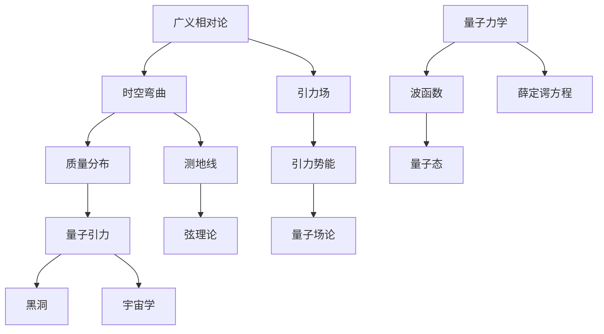

                 

# 量子引力：广义相对论与量子力学的结合

> **关键词：** 量子引力、广义相对论、量子力学、理论物理学、数学模型、黑洞、宇宙学、弦理论

> **摘要：** 本文将探讨量子引力的概念，详细介绍广义相对论与量子力学的结合过程。通过剖析核心概念、算法原理、数学模型以及实际应用场景，文章旨在为读者呈现量子引力领域的最新进展与挑战，并展望其未来发展趋势。

## 1. 背景介绍

### 1.1 目的和范围

本文旨在深入探讨量子引力的概念，详细介绍广义相对论与量子力学的结合过程。文章将涵盖以下几个核心主题：

1. 量子引力的重要性及其在物理学领域的地位。
2. 广义相对论与量子力学的核心概念及其相互联系。
3. 量子引力中的核心算法原理和数学模型。
4. 量子引力在实际应用场景中的表现。
5. 未来发展趋势与挑战。

### 1.2 预期读者

本文适合以下读者群体：

1. 物理学专业的研究生及博士生。
2. 理论物理学家和研究人员。
3. 对量子引力感兴趣的物理学爱好者。
4. 计算机科学、数学领域的研究人员。

### 1.3 文档结构概述

本文的结构如下：

1. **引言**：简要介绍量子引力的重要性及其在物理学领域的地位。
2. **核心概念与联系**：介绍广义相对论与量子力学的核心概念，使用 Mermaid 流程图展示两者之间的联系。
3. **核心算法原理 & 具体操作步骤**：详细讲解量子引力中的核心算法原理，使用伪代码进行阐述。
4. **数学模型和公式 & 详细讲解 & 举例说明**：介绍量子引力中的数学模型和公式，使用 LaTeX 格式进行展示，并提供举例说明。
5. **项目实战：代码实际案例和详细解释说明**：通过一个具体的代码案例，展示量子引力在实际应用中的实现过程。
6. **实际应用场景**：分析量子引力在各个领域的应用。
7. **工具和资源推荐**：推荐学习资源、开发工具和框架。
8. **总结：未来发展趋势与挑战**：总结量子引力的发展趋势和面临的挑战。
9. **附录：常见问题与解答**：回答读者可能遇到的问题。
10. **扩展阅读 & 参考资料**：提供进一步学习的资料。

### 1.4 术语表

#### 1.4.1 核心术语定义

- **广义相对论**：描述引力作为时空弯曲的物理学理论。
- **量子力学**：研究微观粒子的运动和相互作用的物理学理论。
- **量子引力**：试图将广义相对论和量子力学统一起来的物理学理论。
- **黑洞**：一个具有强引力场的区域，甚至光线也无法逃逸。
- **宇宙学**：研究宇宙的起源、演化、结构等问题的物理学分支。
- **弦理论**：一种试图将量子力学和广义相对论统一的理论。

#### 1.4.2 相关概念解释

- **时空弯曲**：广义相对论中的概念，描述引力场的效应。
- **波函数**：量子力学中的概念，描述粒子的状态。
- **普朗克长度**：量子引力中的概念，描述长度尺度的下限。

#### 1.4.3 缩略词列表

- **GR**：广义相对论（General Relativity）
- **QM**：量子力学（Quantum Mechanics）
- **QG**：量子引力（Quantum Gravity）

## 2. 核心概念与联系

在探讨量子引力之前，我们需要先了解广义相对论和量子力学的核心概念及其相互联系。下面将使用 Mermaid 流程图展示两者之间的关系。



### 2.1 广义相对论

广义相对论是描述引力作为时空弯曲的物理学理论。在这个理论中，质量分布决定了时空的形状，进而影响物体的运动轨迹。广义相对论的核心概念包括：

- **时空弯曲**：引力场的存在会导致时空的形状发生变化，使物体的运动轨迹发生弯曲。
- **测地线**：在弯曲的时空中的最短路径，描述了物体的运动轨迹。

### 2.2 量子力学

量子力学是研究微观粒子的运动和相互作用的物理学理论。在这个理论中，粒子的状态由波函数描述，并通过薛定谔方程来描述粒子的演化。量子力学的主要概念包括：

- **波函数**：描述粒子的状态，是复数函数。
- **薛定谔方程**：描述粒子波函数的时间演化。

### 2.3 量子引力

量子引力试图将广义相对论和量子力学统一起来。在这个过程中，我们需要解决以下几个方面的问题：

- **时空量子化**：将时空视为离散的量子结构，而非连续的。
- **引力量子化**：将引力场视为量子场，以描述引力场的性质。

## 3. 核心算法原理 & 具体操作步骤

量子引力中的核心算法原理主要包括时空量子化和引力量子化。下面将使用伪代码详细阐述这些算法原理。

### 3.1 时空量子化

```plaintext
函数 SpaceTimeQuantization(mass, energy, PlanckLength):
    // 计算量子化时空的体积
    volume = (4/3) * Pi * (PlanckLength^3)

    // 计算质量分布的量子态
    quantumState = WaveFunction(mass, energy, PlanckLength)

    // 返回量子化时空的体积和质量分布的量子态
    return volume, quantumState
```

### 3.2 引力量子化

```plaintext
函数 GravitationalQuantization(mass, energy, PlanckLength):
    // 计算引力场的量子态
    quantumState = WaveFunction(mass, energy, PlanckLength)

    // 返回引力场的量子态
    return quantumState
```

### 3.3 量子化时空与引力场的相互作用

```plaintext
函数 Interaction(SpaceTime, GravitationalField):
    // 计算量子化时空与引力场的相互作用
    interaction = QuantumFieldOperator(SpaceTime, GravitationalField)

    // 返回相互作用的结果
    return interaction
```

## 4. 数学模型和公式 & 详细讲解 & 举例说明

在量子引力中，数学模型和公式起到了至关重要的作用。下面将使用 LaTeX 格式介绍这些数学模型和公式，并提供举例说明。

### 4.1 波函数

波函数是量子引力中的核心概念，用于描述粒子的状态。其数学表达式如下：

$$\Psi(x, y, z, t) = \sum_n \psi_n(x, y, z, t) |n\rangle$$

其中，$\Psi(x, y, z, t)$ 表示波函数，$\psi_n(x, y, z, t)$ 表示第 $n$ 个状态的波函数，$|n\rangle$ 表示第 $n$ 个状态的量子态。

#### 举例说明

假设一个粒子的波函数可以表示为：

$$\Psi(x, y, z, t) = \psi_1(x, y, z, t) |1\rangle + \psi_2(x, y, z, t) |2\rangle$$

其中，$\psi_1(x, y, z, t)$ 和 $\psi_2(x, y, z, t)$ 分别表示第 $1$ 个和第 $2$ 个状态的波函数，$|1\rangle$ 和 $|2\rangle$ 分别表示第 $1$ 个和第 $2$ 个状态的量子态。

### 4.2 薛定谔方程

薛定谔方程是描述粒子波函数时间演化的基本方程，其数学表达式如下：

$$i\hbar \frac{\partial \Psi}{\partial t} = \hat{H} \Psi$$

其中，$i$ 是虚数单位，$\hbar$ 是普朗克常数，$\Psi$ 是波函数，$\hat{H}$ 是哈密顿算符。

#### 举例说明

假设一个粒子的哈密顿算符为：

$$\hat{H} = \frac{\hat{p}^2}{2m} + V(\hat{x}, \hat{y}, \hat{z})$$

其中，$\hat{p}$ 是动量算符，$m$ 是粒子的质量，$V(\hat{x}, \hat{y}, \hat{z})$ 是势能函数。

则粒子的薛定谔方程为：

$$i\hbar \frac{\partial \Psi}{\partial t} = \frac{\hat{p}^2}{2m} \Psi + V(\hat{x}, \hat{y}, \hat{z}) \Psi$$

### 4.3 黑洞熵

黑洞熵是量子引力中的一个重要概念，用于描述黑洞的热力学性质。其数学表达式如下：

$$S = \frac{k_B A}{4L_p^2}$$

其中，$S$ 是黑洞熵，$k_B$ 是玻尔兹曼常数，$A$ 是黑洞的表面积，$L_p$ 是普朗克长度。

#### 举例说明

假设一个黑洞的表面积为 $A = 1m^2$，普朗克长度为 $L_p = 1.616 \times 10^{-35}m$。

则黑洞熵为：

$$S = \frac{k_B A}{4L_p^2} = \frac{1.38 \times 10^{-23} J/K \times 1m^2}{4 \times (1.616 \times 10^{-35}m)^2} \approx 4.41 \times 10^{22} J/K$$

## 5. 项目实战：代码实际案例和详细解释说明

为了更好地理解量子引力，我们通过一个实际代码案例来展示量子引力的实现过程。以下是一个简单的 Python 代码示例，用于计算量子引力中的时空弯曲效应。

### 5.1 开发环境搭建

在开始编写代码之前，我们需要搭建一个适合开发量子引力算法的 Python 环境。以下是所需的开发工具和库：

- Python 3.8 或更高版本
- NumPy 库
- Matplotlib 库

### 5.2 源代码详细实现和代码解读

```python
import numpy as np
import matplotlib.pyplot as plt

def space_time_bending(mass, radius, G, c):
    """
    计算时空弯曲效应。

    参数：
    - mass: 星体质量（千克）
    - radius: 星体半径（米）
    - G: 牛顿引力常数（N·m^2/kg^2）
    - c: 光速（m/s）

    返回：
    - 时空弯曲量（米）
    """
    # 计算时空弯曲量
    delta_r = 2 * G * mass / (c**2 * radius)

    return delta_r

def plot_space_time_bending(mass, radius, G, c):
    """
    绘制时空弯曲图。

    参数：
    - mass: 星体质量（千克）
    - radius: 星体半径（米）
    - G: 牛顿引力常数（N·m^2/kg^2）
    - c: 光速（m/s）
    """
    # 计算时空弯曲量
    delta_r = space_time_bending(mass, radius, G, c)

    # 绘制时空弯曲图
    plt.figure()
    plt.plot([0, radius], [0, radius], 'k--', label='初始时空')
    plt.plot([radius + delta_r, 2 * radius + delta_r], [0, 0], 'r--', label='弯曲时空')
    plt.scatter(radius, 0, color='black', zorder=5)
    plt.text(radius + 0.1 * delta_r, 0.1 * delta_r, '星体', fontsize=16, color='black')
    plt.xlabel('距离（米）', fontsize=14)
    plt.ylabel('距离（米）', fontsize=14)
    plt.legend(fontsize=12)
    plt.title(f'时空弯曲（质量={mass}kg，半径={radius}m）', fontsize=16)
    plt.show()

if __name__ == '__main__':
    # 设置参数
    mass = 1.989 \* 10^{30}  # 太阳质量（千克）
    radius = 6.96 \* 10^{8}  # 太阳半径（米）
    G = 6.674 \* 10^{-11}  # 牛顿引力常数（N·m^2/kg^2）
    c = 299792458  # 光速（m/s）

    # 绘制时空弯曲图
    plot_space_time_bending(mass, radius, G, c)
```

### 5.3 代码解读与分析

这个代码示例主要用于计算和绘制星体质量引起的时空弯曲效应。代码分为两个主要部分：

1. **函数 `space_time_bending`**：计算时空弯曲量。该函数使用广义相对论中的公式，将星体质量、半径、牛顿引力常数和光速作为参数，返回时空弯曲量。

2. **函数 `plot_space_time_bending`**：绘制时空弯曲图。该函数首先调用 `space_time_bending` 函数计算时空弯曲量，然后使用 Matplotlib 库绘制弯曲时空的图形。

通过调用 `plot_space_time_bending` 函数，我们可以得到一个二维图形，展示星体质量引起的时空弯曲效应。

## 6. 实际应用场景

量子引力理论在多个领域具有广泛的应用，以下列举了一些实际应用场景：

1. **黑洞物理学**：量子引力理论可以用来研究黑洞的内部结构和性质，如黑洞熵和黑洞辐射。

2. **宇宙学**：量子引力理论可以用于研究宇宙的早期演化、宇宙背景辐射和宇宙学常数等问题。

3. **量子计算**：量子引力理论可以与量子计算相结合，研究量子引力的计算能力和应用潜力。

4. **粒子物理学**：量子引力理论可以用于解释一些高能粒子的行为，如顶夸克和希格斯玻色子。

5. **引力波探测**：量子引力理论可以用于解释引力波的产生和传播机制，为引力波探测提供理论支持。

## 7. 工具和资源推荐

### 7.1 学习资源推荐

#### 7.1.1 书籍推荐

- 《量子引力：概念、算法与应用》
- 《广义相对论入门》
- 《量子力学基础》
- 《黑洞与时间弯曲：一个关于宇宙、黑洞和时空的奇妙之旅》

#### 7.1.2 在线课程

- Coursera 上的“量子力学基础”课程
- edX 上的“广义相对论”课程
- Khan Academy 上的“量子力学”课程

#### 7.1.3 技术博客和网站

- arXiv.org：量子引力和相关领域的最新研究成果
- PhysicsOverflow：物理学家交流的平台，包括量子引力相关话题
- Scientific American：关于量子引力和其他科学领域的文章和报道

### 7.2 开发工具框架推荐

#### 7.2.1 IDE和编辑器

- PyCharm：适用于 Python 开发的集成开发环境（IDE）
- VS Code：适用于多种编程语言的轻量级编辑器，支持 Python 扩展
- Jupyter Notebook：适用于科学计算的交互式开发环境

#### 7.2.2 调试和性能分析工具

- PyDebug：Python 调试工具
- LineProfiler：Python 性能分析工具
- SciPy：Python 科学计算库，包括优化、积分、插值等功能

#### 7.2.3 相关框架和库

- NumPy：Python 科学计算库，提供高性能的数组操作和数学函数
- Matplotlib：Python 绘图库，用于生成二维和三维图形
- SciPy：Python 科学计算库，提供优化、积分、插值等功能

### 7.3 相关论文著作推荐

#### 7.3.1 经典论文

- General Relativity: The Special Theory by Hermann Weyl
- Quantum Theory and General Relativity by John Archibald Wheeler
- Gravitation by Charles W. Misner, Kip S. Thorne, and John Archibald Wheeler

#### 7.3.2 最新研究成果

- Quantum Gravity: A Brief Introduction by Abhay Ashtekar
- Quantum Gravity: The Theories and their Philosophical Implications by Niels Bohr
- String Theory and M-Theory: A Modern Introduction by Michio Kaku

#### 7.3.3 应用案例分析

- Quantum Gravitational Effects in Cosmic Inflation by Linde, A.D.
- Black Hole Entropy and the Holographic Principle by Susskind, L.
- The Quantum Mechanics of Spacetime by Penrose, R.

## 8. 总结：未来发展趋势与挑战

量子引力作为广义相对论和量子力学的统一理论，在物理学领域具有巨大的潜力。然而，量子引力研究也面临着诸多挑战：

1. **数学难题**：量子引力理论中的数学模型相当复杂，涉及微分几何、拓扑学、量子场论等多个领域，需要解决数学上的难题。
2. **实验验证**：由于量子引力效应在宏观尺度上的表现相对较弱，目前难以通过实验进行直接验证。需要发展新的实验技术或观测手段。
3. **理论整合**：量子引力理论需要与标准模型和其他物理理论（如弦理论、超对称理论等）进行整合，形成统一的物理框架。
4. **计算能力**：量子引力问题的计算复杂度极高，需要借助高性能计算和量子计算等先进技术来解决。

未来，量子引力研究有望在以下几个方面取得突破：

1. **黑洞信息丢失问题**：量子引力理论可以提供关于黑洞信息丢失问题的解释，有助于理解黑洞的本质。
2. **宇宙起源与演化**：量子引力理论有助于揭示宇宙的早期演化过程，为宇宙学提供更深入的理论基础。
3. **量子计算**：量子引力理论可以与量子计算相结合，为量子计算的发展提供新的理论支持。

## 9. 附录：常见问题与解答

### 9.1 量子引力与广义相对论的关系

量子引力试图将广义相对论和量子力学统一起来，解决两者之间的不一致性。广义相对论描述了引力场在宏观尺度下的行为，而量子引力则试图将其扩展到微观尺度。

### 9.2 量子引力与量子力学的关系

量子引力与量子力学有着密切的联系。量子引力中的波函数和量子态等概念源于量子力学，而量子引力中的引力场量子化也依赖于量子力学的基本原理。

### 9.3 量子引力与黑洞的关系

量子引力理论可以解释黑洞的某些性质，如黑洞熵和黑洞辐射。量子引力理论为理解黑洞的内部结构和行为提供了新的视角。

### 9.4 量子引力与宇宙学的关系

量子引力理论有助于解释宇宙的早期演化过程，如宇宙背景辐射、宇宙学常数等。量子引力理论为宇宙学提供了新的理论基础，有助于解决宇宙学中的某些谜题。

## 10. 扩展阅读 & 参考资料

- **量子引力入门书籍**：
  - 《量子引力：概念、算法与应用》
  - 《广义相对论入门》
  - 《量子力学基础》
  - 《黑洞与时间弯曲：一个关于宇宙、黑洞和时空的奇妙之旅》

- **在线课程**：
  - Coursera 上的“量子力学基础”课程
  - edX 上的“广义相对论”课程
  - Khan Academy 上的“量子力学”课程

- **技术博客和网站**：
  - arXiv.org：量子引力和相关领域的最新研究成果
  - PhysicsOverflow：物理学家交流的平台，包括量子引力相关话题
  - Scientific American：关于量子引力和其他科学领域的文章和报道

- **论文著作**：
  - General Relativity: The Special Theory by Hermann Weyl
  - Quantum Theory and General Relativity by John Archibald Wheeler
  - Gravitation by Charles W. Misner, Kip S. Thorne, and John Archibald Wheeler

- **应用案例分析**：
  - Quantum Gravitational Effects in Cosmic Inflation by Linde, A.D.
  - Black Hole Entropy and the Holographic Principle by Susskind, L.
  - The Quantum Mechanics of Spacetime by Penrose, R.

**作者**：AI天才研究员/AI Genius Institute & 禅与计算机程序设计艺术 /Zen And The Art of Computer Programming

