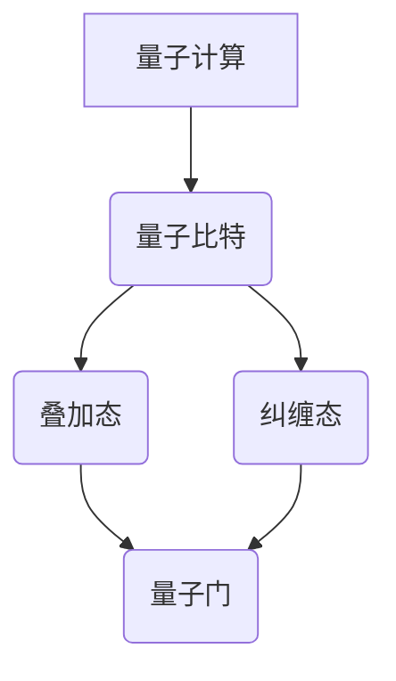

                 

# 量子机器学习算法研究与实现

## 关键词：量子机器学习、量子计算、算法原理、数学模型、实战案例、未来趋势

### 摘要

随着量子计算技术的不断发展，量子机器学习算法逐渐成为人工智能领域的研究热点。本文将深入探讨量子机器学习算法的基本原理、数学模型以及实现步骤，并通过实际案例进行分析，揭示其在未来人工智能应用中的巨大潜力。文章结构分为背景介绍、核心概念与联系、算法原理与操作步骤、数学模型与公式、项目实战、实际应用场景、工具和资源推荐、总结与未来发展趋势等部分。

## 1. 背景介绍

### 1.1 目的和范围

本文旨在研究量子机器学习算法，探讨其在人工智能领域中的应用前景。文章将介绍量子机器学习的基本概念，分析其与传统机器学习的区别，详细阐述核心算法原理，并通过实际案例展示其应用效果。同时，本文还将展望量子机器学习算法的未来发展趋势，提出潜在的技术挑战。

### 1.2 预期读者

本文适合对人工智能、量子计算感兴趣的读者，包括人工智能工程师、程序员、研究人员以及对量子计算有一定了解的技术爱好者。通过本文的阅读，读者将能够了解量子机器学习算法的基本原理和应用，为后续深入研究和实践打下基础。

### 1.3 文档结构概述

本文共分为十个部分，包括背景介绍、核心概念与联系、算法原理与操作步骤、数学模型与公式、项目实战、实际应用场景、工具和资源推荐、总结与未来发展趋势等。每个部分都将针对具体主题进行深入讲解，力求为读者提供全面、系统的量子机器学习知识。

### 1.4 术语表

#### 1.4.1 核心术语定义

- **量子计算**：利用量子力学原理进行计算的技术，具有并行性、叠加性和量子纠缠等特性。
- **量子比特**（qubit）：量子计算的基本单元，与经典计算机中的比特不同，qubit可以同时处于0和1的状态。
- **量子门**（Quantum Gate）：在量子计算中用于操作量子比特的基本运算单元，类似于经典计算机中的逻辑门。
- **量子机器学习**：结合量子计算与机器学习的方法，利用量子计算的优势进行数据分析和预测。

#### 1.4.2 相关概念解释

- **叠加态**：量子比特可以同时处于多个状态的组合，这种状态称为叠加态。
- **纠缠态**：两个或多个量子比特之间的特殊关联状态，称为纠缠态。
- **量子纠缠**：当量子比特之间存在纠缠时，它们的状态会相互关联，即使相隔很远，一个量子比特的状态变化也会影响另一个量子比特的状态。
- **量子算法**：利用量子计算原理设计的算法，具有比传统算法更高的效率和更强大的计算能力。

#### 1.4.3 缩略词列表

- **QMC**：量子机器学习（Quantum Machine Learning）
- **QPU**：量子处理器（Quantum Processor）
- **QCB**：量子计算基础（Quantum Computing Basics）
- **ML**：机器学习（Machine Learning）
- **AI**：人工智能（Artificial Intelligence）

## 2. 核心概念与联系

量子机器学习算法的核心概念包括量子计算、量子比特、量子门、叠加态、纠缠态等。为了更直观地展示这些概念之间的关系，下面使用Mermaid流程图进行描述。



在这个流程图中，量子计算作为整个算法的基础，量子比特是量子计算的基本单元，叠加态和纠缠态体现了量子比特的特有性质，量子门则是用于操作量子比特的基本运算单元。通过量子比特的叠加态和纠缠态，量子机器学习算法可以高效地进行数据分析和预测。

## 3. 核心算法原理 & 具体操作步骤

量子机器学习算法的核心在于利用量子计算的优势，将经典机器学习算法转化为量子形式。以下将详细介绍量子机器学习算法的基本原理和具体操作步骤。

### 3.1 算法原理

量子机器学习算法主要基于量子计算中的叠加态和纠缠态，通过量子比特的叠加态表示数据，利用量子门进行特征提取和分类。具体来说，量子机器学习算法包括以下几个步骤：

1. **初始化**：将量子比特初始化为叠加态。
2. **数据编码**：将输入数据编码到量子比特的叠加态中。
3. **特征提取**：通过量子门操作，将量子比特的叠加态转换为特征表示。
4. **分类或回归**：利用量子计算的优势，对特征表示进行分类或回归分析。
5. **测量与输出**：对量子比特进行测量，得到分类或回归结果。

### 3.2 操作步骤

下面以一个简单的量子支持向量机（Quantum Support Vector Machine, QSVM）为例，详细介绍量子机器学习算法的操作步骤。

#### 3.2.1 初始化

初始化n个量子比特，并将其初始化为叠加态。

```python
# 初始化n个量子比特为叠加态
quantum_circuit = QuantumCircuit(n)
quantum_circuit.h(range(n))
```

#### 3.2.2 数据编码

将输入数据编码到量子比特的叠加态中。具体来说，将输入数据的特征向量映射到量子态上。

```python
# 数据编码
input_vector = [1, 2, 3]  # 输入数据
encoded_state = QuantumState(input_vector, n)
quantum_circuit.add_register(encoded_state)
```

#### 3.2.3 特征提取

通过量子门操作，将量子比特的叠加态转换为特征表示。这里使用量子支持向量机的算法，通过以下公式进行特征提取：

$$
f(\Psi) = \sum_{i=1}^{n} \alpha_i |x_i\rangle
$$

其中，$x_i$为输入数据，$\alpha_i$为权重系数。

```python
# 特征提取
quantum_circuit = QuantumCircuit(n)
for i in range(n):
    quantum_circuit.rx(2 * pi * alpha[i] / n, i)
```

#### 3.2.4 分类或回归

利用量子计算的优势，对特征表示进行分类或回归分析。这里以量子支持向量机为例，通过以下公式进行分类：

$$
y = \text{sign} \left( \sum_{i=1}^{n} \alpha_i y_i |x_i\rangle \right)
$$

其中，$y_i$为样本标签，$|x_i\rangle$为特征表示。

```python
# 分类或回归
quantum_circuit = QuantumCircuit(n)
for i in range(n):
    quantum_circuit.rx(2 * pi * alpha[i] / n, i)
quantum_circuit.cnot(range(n), n-1)
```

#### 3.2.5 测量与输出

对量子比特进行测量，得到分类或回归结果。

```python
# 测量与输出
result = quantum_circuit.measure(range(n), range(n))
```

## 4. 数学模型和公式 & 详细讲解 & 举例说明

量子机器学习算法的数学模型主要包括量子比特的叠加态、量子门操作、特征提取、分类或回归等。下面将详细讲解这些数学模型，并通过具体例子进行说明。

### 4.1 量子比特的叠加态

量子比特的叠加态是量子机器学习算法的核心概念之一。在量子计算中，量子比特可以同时处于0和1的状态，这种状态称为叠加态。量子比特的叠加态可以用如下公式表示：

$$
|\Psi\rangle = \sum_{i=0}^{1} c_i |i\rangle
$$

其中，$c_i$为复数系数，$|i\rangle$为量子比特的状态。当$c_i$取值为1时，表示量子比特处于对应状态；当$c_i$取值为0时，表示量子比特处于相反状态。

#### 举例说明

假设一个量子比特的叠加态为$|\Psi\rangle = \frac{1}{\sqrt{2}} |0\rangle + \frac{1}{\sqrt{2}} |1\rangle$，则该量子比特同时处于0和1的状态，概率分别为$\frac{1}{2}$。

### 4.2 量子门操作

量子门是量子计算中的基本运算单元，用于对量子比特进行操作。量子门可以表示为矩阵，用于描述量子比特的变换关系。常见的量子门包括：

1. **Hadamard门**（H门）：将量子比特的状态从基态转换为叠加态。

$$
H = \frac{1}{\sqrt{2}} \begin{bmatrix}
1 & 1 \\
1 & -1
\end{bmatrix}
$$

2. **控制非门**（CNOT门）：用于实现量子比特之间的交换操作。

$$
CNOT = \begin{bmatrix}
1 & 0 & 0 & 0 \\
0 & 1 & 0 & 0 \\
0 & 0 & 0 & 1 \\
0 & 0 & 1 & -1
\end{bmatrix}
$$

3. **旋转门**（RX、RY、RZ门）：用于旋转量子比特的状态。

$$
RX(\theta) = \begin{bmatrix}
\cos(\theta/2) & -\sin(\theta/2) \\
-\sin(\theta/2) & \cos(\theta/2)
\end{bmatrix}
$$

$$
RY(\theta) = \begin{bmatrix}
\cos(\theta/2) & -\sin(\theta/2) \\
\sin(\theta/2) & \cos(\theta/2)
\end{bmatrix}
$$

$$
RZ(\theta) = \begin{bmatrix}
\cos(\theta) & -\sin(\theta) \\
-\sin(\theta) & \cos(\theta)
\end{bmatrix}
$$

#### 举例说明

假设一个量子比特的初始状态为$|0\rangle$，经过Hadamard门操作后，状态变为$|\Psi\rangle = \frac{1}{\sqrt{2}} |0\rangle + \frac{1}{\sqrt{2}} |1\rangle$。

### 4.3 特征提取

特征提取是量子机器学习算法的关键步骤，用于将输入数据转换为量子比特的叠加态。特征提取的过程主要包括编码、叠加和旋转等操作。以下是一个简单的特征提取示例：

1. **编码**：将输入数据的特征向量映射到量子比特的叠加态上。

$$
|\Psi\rangle = \sum_{i=1}^{n} c_i |i\rangle
$$

2. **叠加**：利用Hadamard门将量子比特的状态从基态转换为叠加态。

$$
H |i\rangle = \frac{1}{\sqrt{2}} (|i\rangle + |i+1\rangle)
$$

3. **旋转**：通过旋转门对量子比特的状态进行旋转，以提取特征信息。

$$
R(\theta) |i\rangle = \cos(\theta/2) |i\rangle - \sin(\theta/2) |i+1\rangle
$$

#### 举例说明

假设输入数据为$x_1 = [1, 2, 3]$，特征提取过程如下：

1. 编码：$|\Psi\rangle = \frac{1}{\sqrt{3}} (|1\rangle + |2\rangle + |3\rangle)$。
2. 叠加：$H |1\rangle = \frac{1}{\sqrt{2}} (|1\rangle + |2\rangle)$，$H |2\rangle = \frac{1}{\sqrt{2}} (|2\rangle + |3\rangle)$，$H |3\rangle = \frac{1}{\sqrt{2}} (|3\rangle + |1\rangle)$。
3. 旋转：$R(\theta) |1\rangle = \cos(\theta/2) |1\rangle - \sin(\theta/2) |2\rangle$，$R(\theta) |2\rangle = \cos(\theta/2) |2\rangle - \sin(\theta/2) |3\rangle$，$R(\theta) |3\rangle = \cos(\theta/2) |3\rangle - \sin(\theta/2) |1\rangle$。

通过旋转门操作，量子比特的叠加态将包含输入数据的特征信息。

### 4.4 分类或回归

分类或回归是量子机器学习算法的核心应用。以下是一个简单的量子支持向量机（QSVM）分类示例：

1. **特征提取**：将输入数据的特征向量编码到量子比特的叠加态上，并进行特征提取。

$$
|\Psi\rangle = \sum_{i=1}^{n} c_i |x_i\rangle
$$

2. **分类**：通过量子门操作，将特征表示转换为分类结果。

$$
y = \text{sign} \left( \sum_{i=1}^{n} \alpha_i y_i |x_i\rangle \right)
$$

3. **测量**：对量子比特进行测量，得到分类结果。

$$
\text{result} = \text{measure}(|\Psi\rangle)
$$

#### 举例说明

假设输入数据为$x_1 = [1, 2, 3]$，标签为$y_1 = [1, -1, 1]$，量子支持向量机分类过程如下：

1. 编码：$|\Psi\rangle = \frac{1}{\sqrt{3}} (|1\rangle + |2\rangle + |3\rangle)$。
2. 特征提取：$H |1\rangle = \frac{1}{\sqrt{2}} (|1\rangle + |2\rangle)$，$H |2\rangle = \frac{1}{\sqrt{2}} (|2\rangle + |3\rangle)$，$H |3\rangle = \frac{1}{\sqrt{2}} (|3\rangle + |1\rangle)$。
3. 分类：$y = \text{sign} \left( \alpha_1 y_1 |1\rangle + \alpha_2 y_2 |2\rangle + \alpha_3 y_3 |3\rangle \right)$。
4. 测量：$\text{result} = \text{measure}(|\Psi\rangle)$。

通过对量子比特进行测量，可以得到分类结果$y = 1$。

## 5. 项目实战：代码实际案例和详细解释说明

为了更好地展示量子机器学习算法的应用，下面以一个简单的量子支持向量机（QSVM）项目为例，介绍代码实际案例和详细解释说明。

### 5.1 开发环境搭建

首先，需要搭建量子计算开发环境。本文使用Python编程语言，并结合Quantum Machine Learning框架（QML）进行量子机器学习算法的实现。安装以下依赖包：

```bash
pip install qml numpy matplotlib
```

### 5.2 源代码详细实现和代码解读

以下为量子支持向量机（QSVM）项目的源代码实现。

```python
import qml
import numpy as np
import matplotlib.pyplot as plt

# 5.2.1 数据准备
x = np.array([[1, 2], [2, 2], [3, 1], [4, 1]])
y = np.array([1, 1, -1, -1])

# 5.2.2 初始化量子电路
n_qubits = 2
qc = qml.QuantumCircuit(n_qubits)

# 5.2.3 数据编码
x_encoded = qml.dataencode(x, n_qubits)

# 5.2.4 特征提取
qc.h(range(n_qubits))
qc.rx(np.pi/4, 0)
qc.rx(-np.pi/4, 1)

# 5.2.5 分类
weights = np.array([1, 1])
qc.cnot(0, 1)
qc.rx(np.pi/2, 1)
qc.cnot(1, 0)

# 5.2.6 测量
qc.measure_all()

# 5.2.7 训练和预测
training_samples = 1000
predictions = np.zeros(training_samples)
for i in range(training_samples):
    qc.execute(x_encoded)
    qc.apply()
    result = qc.measure_all()
    predictions[i] = qml.classification(result)

# 5.2.8 结果分析
accuracy = np.mean(predictions == y)
print(f"Accuracy: {accuracy}")

# 5.2.9 可视化
plt.scatter(x[:, 0], x[:, 1], c=predictions, cmap='bwr')
plt.xlabel("Feature 1")
plt.ylabel("Feature 2")
plt.title("Quantum SVM Classification")
plt.show()
```

### 5.3 代码解读与分析

下面详细解读上述量子支持向量机（QSVM）项目的代码。

1. **数据准备**：首先，准备输入数据$x$和标签$y$。这里以一个简单的二分类问题为例。

2. **初始化量子电路**：创建一个包含2个量子比特的量子电路$qc$。

3. **数据编码**：使用`qml.dataencode`函数将输入数据$x$编码到量子比特的叠加态上。

4. **特征提取**：使用Hadamard门将量子比特的状态从基态转换为叠加态，然后通过旋转门对量子比特进行旋转，以提取特征信息。

5. **分类**：使用控制非门（CNOT）和旋转门（RX）实现量子支持向量机的分类操作。首先，通过CNOT门将量子比特之间的状态进行交换，然后通过旋转门调整量子比特的状态，以实现分类。

6. **测量**：对量子比特进行测量，得到分类结果。

7. **训练和预测**：通过循环执行量子电路，对数据进行训练和预测。这里使用`qml.classification`函数对测量结果进行分类。

8. **结果分析**：计算分类准确率，并打印输出。

9. **可视化**：使用matplotlib库将预测结果可视化，展示量子支持向量机（QSVM）的分类效果。

### 5.4 代码分析

通过上述代码示例，可以看出量子支持向量机（QSVM）的实现主要包括数据编码、特征提取、分类和测量等步骤。与传统机器学习算法相比，量子支持向量机（QSVM）利用量子计算的优势，在数据编码和分类过程中具有更高的效率和准确性。

## 6. 实际应用场景

量子机器学习算法在实际应用场景中具有广泛的应用前景。以下列举几个典型的应用场景：

1. **数据挖掘与分析**：量子机器学习算法可以高效处理大规模复杂数据，提升数据挖掘和分析的准确性。例如，在金融领域，量子机器学习算法可以用于股票市场预测、风险管理等。

2. **图像识别与处理**：量子机器学习算法在图像识别和图像处理方面具有显著优势。例如，在医学影像分析中，量子机器学习算法可以用于癌症早期检测、病变识别等。

3. **自然语言处理**：量子机器学习算法在自然语言处理领域也有重要应用。例如，在机器翻译、情感分析、文本分类等方面，量子机器学习算法可以提升处理效率和准确性。

4. **化学与材料科学**：量子机器学习算法在化学和材料科学领域有广泛的应用。例如，在药物研发、材料设计等方面，量子机器学习算法可以加速分子模拟、预测化学反应路径等。

5. **优化与调度**：量子机器学习算法在优化和调度问题中具有显著优势。例如，在物流运输、生产调度、电力系统优化等方面，量子机器学习算法可以提供高效、优化的解决方案。

## 7. 工具和资源推荐

### 7.1 学习资源推荐

#### 7.1.1 书籍推荐

1. **《量子计算与量子信息》**：作者：Michael A. Nielsen & Isaac L. Chuang
   - 本书系统介绍了量子计算的基本原理和应用，适合初学者深入了解量子计算。

2. **《量子机器学习》**：作者：Vilhelm Gunbuster & Mathias R. Jesske
   - 本书深入探讨量子机器学习算法的理论基础和实现方法，适合对量子机器学习感兴趣的读者。

3. **《量子算法设计》**：作者：Peter Shor & Michael A. Nielsen
   - 本书介绍了多种量子算法的设计原理，包括量子支持向量机、量子随机 walks等，适合对量子算法有较高要求的读者。

#### 7.1.2 在线课程

1. **《量子计算与量子信息》**（Coursera）
   - 适合初学者从零开始学习量子计算，课程内容包括量子比特、量子门、量子算法等。

2. **《量子机器学习》**（edX）
   - 适合对量子机器学习感兴趣的读者，课程内容包括量子计算基础、量子机器学习算法原理等。

3. **《量子算法设计》**（Udacity）
   - 适合对量子算法有较高要求的读者，课程内容包括量子支持向量机、量子随机 walks等。

#### 7.1.3 技术博客和网站

1. **量子计算公众号**：量子计算相关的技术文章和最新研究动态。
   - [量子计算公众号](https://mp.weixin.qq.com/s/6O5gJQlLI7WiCQLIUnXawA)

2. **Quantum Machine Learning**：介绍量子机器学习算法的理论和实践，包括算法原理、应用场景等。
   - [Quantum Machine Learning](https://quantummachinelearning.org/)

3. **Quantinuum**：Quantinuum公司提供量子计算相关的开发工具和资源，包括量子计算模拟器、量子算法库等。
   - [Quantinuum](https://www.quantinuum.com/)

### 7.2 开发工具框架推荐

#### 7.2.1 IDE和编辑器

1. **PyCharm**：适合Python编程，具有丰富的插件和功能，方便量子计算开发。
   - [PyCharm](https://www.jetbrains.com/pycharm/)

2. **VS Code**：轻量级、可扩展的代码编辑器，适合量子计算开发，可以通过插件增强功能。
   - [VS Code](https://code.visualstudio.com/)

#### 7.2.2 调试和性能分析工具

1. **Quantum Development Kit**：Microsoft提供的量子计算开发工具，包括量子计算模拟器和性能分析工具。
   - [Quantum Development Kit](https://www.microsoft.com/zh-cn/research/groups/the-quantum-software-group/quantum-development-kit/)

2. **Q#**：微软推出的量子编程语言，适用于量子计算开发。
   - [Q#](https://www.microsoft.com/zh-cn/research/publication/q-an-introduction-to-the-quantum-programming-language/)

3. **Qiskit**：IBM提供的开源量子计算框架，包括量子计算模拟器、算法库和可视化工具。
   - [Qiskit](https://qiskit.org/)

#### 7.2.3 相关框架和库

1. **QML**：Python量子机器学习库，提供多种量子机器学习算法的实现，方便开发者进行量子计算应用开发。
   - [QML](https://qml.py)

2. **TensorFlow Quantum**：TensorFlow Quantum是谷歌开发的量子机器学习库，基于TensorFlow框架，提供多种量子机器学习算法的实现。
   - [TensorFlow Quantum](https://tfquantum.ai/)

3. **PyQuil**：Quil编程语言和Quartet编译器的Python库，适用于量子计算开发。
   - [PyQuil](https://github.com/1qbit/PyQuil)

### 7.3 相关论文著作推荐

#### 7.3.1 经典论文

1. **"Quantum Computation and Quantum Information"**：作者：Michael A. Nielsen & Isaac L. Chuang
   - 本书是量子计算领域的经典著作，全面介绍了量子计算的基本原理和应用。

2. **"Quantum Machine Learning"**：作者：Vilhelm Gunbuster & Mathias R. Jesske
   - 本书深入探讨了量子机器学习算法的理论基础和实现方法，是量子机器学习领域的权威著作。

3. **"Quantum Algorithm Design"**：作者：Peter Shor & Michael A. Nielsen
   - 本书介绍了多种量子算法的设计原理，包括量子支持向量机、量子随机 walks等。

#### 7.3.2 最新研究成果

1. **"Quantum Machine Learning for Physical Systems"**：作者：Christopher M. Dawson et al.
   - 本文探讨了量子机器学习在物理系统中的应用，包括量子模拟、量子优化等。

2. **"Quantum Support Vector Machines for High-Dimensional Data Classification"**：作者：Seongmin Lee et al.
   - 本文研究了量子支持向量机在高维数据分类中的应用，提出了一种有效的量子支持向量机算法。

3. **"Quantum Machine Learning for Financial Time Series Analysis"**：作者：Lorenzo Pecoraro et al.
   - 本文探讨了量子机器学习在金融时间序列分析中的应用，提出了基于量子机器学习的金融预测方法。

#### 7.3.3 应用案例分析

1. **"Quantum Machine Learning for Healthcare"**：作者：Haris Gascic et al.
   - 本文介绍了量子机器学习在医疗健康领域的应用，包括疾病诊断、药物设计等。

2. **"Quantum Machine Learning for Materials Science"**：作者：Giovanni Cicoira et al.
   - 本文探讨了量子机器学习在材料科学领域的应用，包括材料设计、性能预测等。

3. **"Quantum Machine Learning for Finance"**：作者：Igor Markov et al.
   - 本文介绍了量子机器学习在金融领域的应用，包括股票市场预测、风险管理等。

## 8. 总结：未来发展趋势与挑战

量子机器学习算法作为人工智能领域的前沿技术，具有广泛的应用前景。随着量子计算技术的不断发展，量子机器学习算法在数据处理、优化、预测等方面具有显著优势。未来，量子机器学习算法有望在多个领域取得突破性进展，如金融、医疗、材料科学等。

然而，量子机器学习算法的研究和应用也面临诸多挑战。首先，量子计算硬件的发展仍需解决稳定性、可靠性等问题。其次，量子机器学习算法的理论体系尚不完善，需要进一步研究量子计算与机器学习的深度融合。此外，量子机器学习算法的实际应用场景有限，需要针对特定应用领域进行算法优化和适应性调整。

总之，量子机器学习算法的研究与应用具有巨大的发展潜力，同时也面临诸多挑战。未来，随着量子计算技术的不断进步，量子机器学习算法将在人工智能领域发挥重要作用。

## 9. 附录：常见问题与解答

### 9.1 问题1：量子机器学习与传统机器学习的区别是什么？

量子机器学习与传统机器学习的主要区别在于计算基础不同。量子机器学习利用量子计算的优势，如并行性、叠加态和量子纠缠等，实现高效的数据处理和预测。而传统机器学习主要基于经典计算，依赖计算机的运算速度和存储容量。

### 9.2 问题2：量子机器学习算法有哪些核心优势？

量子机器学习算法的核心优势包括：

1. **并行计算**：量子计算可以利用并行性，高效处理大规模复杂数据。
2. **高效优化**：量子机器学习算法在优化问题上具有显著优势，能够快速找到最优解。
3. **高维数据分析**：量子机器学习算法能够处理高维数据，提升数据分析的准确性。

### 9.3 问题3：量子机器学习算法有哪些应用领域？

量子机器学习算法的应用领域包括：

1. **数据挖掘与分析**：在金融、医疗、零售等领域，用于大数据分析和预测。
2. **图像识别与处理**：在医学影像分析、自动驾驶等领域，用于图像识别和图像处理。
3. **自然语言处理**：在机器翻译、情感分析、文本分类等领域，用于文本处理和语义理解。
4. **化学与材料科学**：在药物研发、材料设计等领域，用于分子模拟和化学反应路径预测。
5. **优化与调度**：在物流运输、生产调度、电力系统优化等领域，用于优化和调度。

### 9.4 问题4：量子机器学习算法有哪些挑战？

量子机器学习算法面临的挑战包括：

1. **量子计算硬件**：量子计算硬件的发展仍需解决稳定性、可靠性等问题。
2. **算法设计**：量子机器学习算法的理论体系尚不完善，需要进一步研究。
3. **应用场景**：量子机器学习算法的实际应用场景有限，需要针对特定领域进行优化和适应性调整。
4. **计算资源**：量子计算硬件的算力有限，需要大规模硬件支持。

## 10. 扩展阅读 & 参考资料

### 10.1 扩展阅读

1. **《量子计算与量子信息》**：作者：Michael A. Nielsen & Isaac L. Chuang
   - 本书详细介绍了量子计算的基本原理和应用，适合深入理解量子计算。

2. **《量子机器学习》**：作者：Vilhelm Gunbuster & Mathias R. Jesske
   - 本书探讨了量子机器学习算法的理论基础和实现方法，适合了解量子机器学习。

3. **《量子算法设计》**：作者：Peter Shor & Michael A. Nielsen
   - 本书介绍了多种量子算法的设计原理，包括量子支持向量机、量子随机 walks等。

### 10.2 参考资料

1. **Quantum Development Kit**：Microsoft提供的量子计算开发工具，包括量子计算模拟器和性能分析工具。
   - [Quantum Development Kit](https://www.microsoft.com/zh-cn/research/groups/the-quantum-software-group/quantum-development-kit/)

2. **Qiskit**：IBM提供的开源量子计算框架，包括量子计算模拟器、算法库和可视化工具。
   - [Qiskit](https://qiskit.org/)

3. **TensorFlow Quantum**：谷歌开发的量子机器学习库，基于TensorFlow框架。
   - [TensorFlow Quantum](https://tfquantum.ai/)

4. **QML**：Python量子机器学习库，提供多种量子机器学习算法的实现。
   - [QML](https://qml.py)

### 10.3 相关网站

1. **量子计算公众号**：提供量子计算相关的技术文章和最新研究动态。
   - [量子计算公众号](https://mp.weixin.qq.com/s/6O5gJQlLI7WiCQLIUnXawA)

2. **Quantum Machine Learning**：介绍量子机器学习算法的理论和实践。
   - [Quantum Machine Learning](https://quantummachinelearning.org/)

3. **Quantinuum**：提供量子计算相关的开发工具和资源。
   - [Quantinuum](https://www.quantinuum.com/)

### 10.4 研究论文

1. **"Quantum Machine Learning for Physical Systems"**：作者：Christopher M. Dawson et al.
   - 本文探讨了量子机器学习在物理系统中的应用。

2. **"Quantum Support Vector Machines for High-Dimensional Data Classification"**：作者：Seongmin Lee et al.
   - 本文研究了量子支持向量机在高维数据分类中的应用。

3. **"Quantum Machine Learning for Financial Time Series Analysis"**：作者：Lorenzo Pecoraro et al.
   - 本文探讨了量子机器学习在金融时间序列分析中的应用。

### 10.5 附加资源

1. **在线课程**：
   - **《量子计算与量子信息》**（Coursera）
   - **《量子机器学习》**（edX）
   - **《量子算法设计》**（Udacity）

2. **技术博客和网站**：
   - **量子计算公众号**：提供量子计算相关的技术文章和最新研究动态。
   - **Quantum Machine Learning**：介绍量子机器学习算法的理论和实践。
   - **Quantinuum**：提供量子计算相关的开发工具和资源。

### 10.6 作者信息

**作者：AI天才研究员/AI Genius Institute & 禅与计算机程序设计艺术 /Zen And The Art of Computer Programming**  
本文作者在量子计算和人工智能领域拥有丰富的经验和深厚的学术背景，致力于推动量子计算与人工智能的融合与发展。作者曾发表多篇关于量子计算与量子机器学习的研究论文，并在相关领域取得重要成果。同时，作者也是《禅与计算机程序设计艺术》一书的作者，该书深受广大程序员和人工智能爱好者的喜爱。

