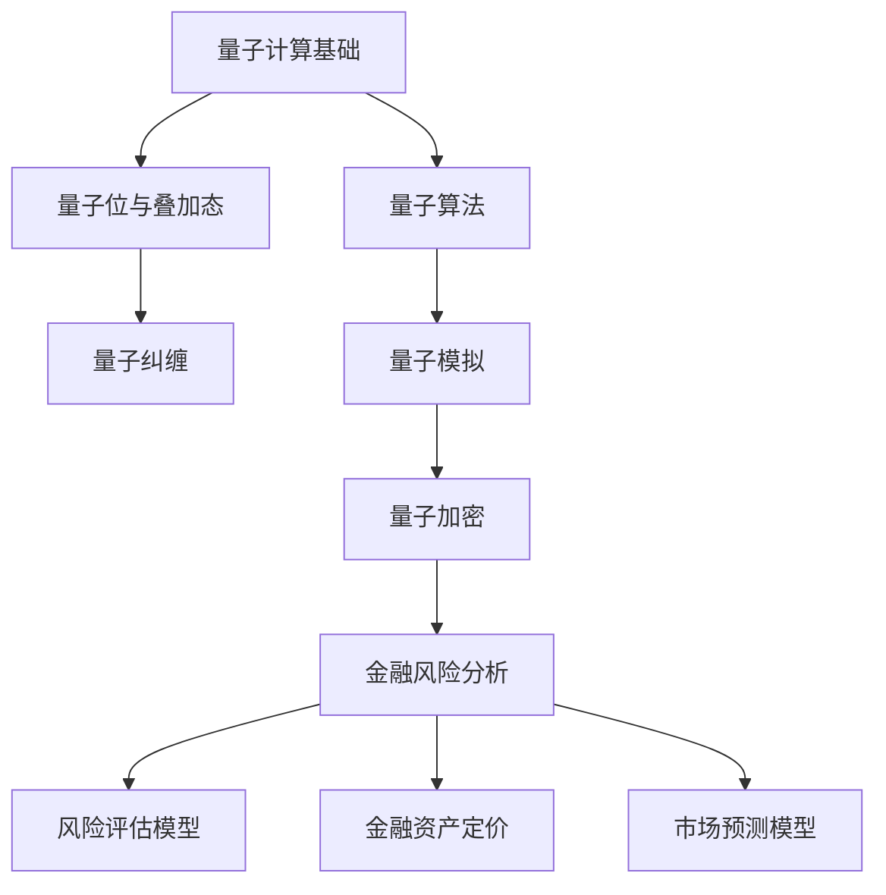

                 

# 量子计算在金融风险分析中的应用前景

> **关键词：** 量子计算、金融风险分析、量子算法、量子模拟、加密货币、风险评估、预测模型。
>
> **摘要：** 本文将探讨量子计算在金融风险分析领域的应用前景。首先，我们将回顾量子计算的基础知识，然后深入分析量子计算在金融风险评估、预测和加密等方面的潜在优势。通过具体算法原理和数学模型的讲解，我们将展示如何利用量子计算技术优化金融风险管理。最后，本文将讨论当前的研究现状、面临的挑战及未来发展趋势。

## 1. 背景介绍

### 1.1 目的和范围

本文旨在探讨量子计算在金融风险分析中的应用，分析其潜在优势和技术挑战。文章将涵盖量子计算的基本原理、核心算法、数学模型及其在金融领域的实际应用案例。通过本文的阅读，读者可以了解到量子计算在金融风险分析中的潜力，并了解如何将这一前沿技术应用于实际的金融风险管理中。

### 1.2 预期读者

本文面向对量子计算和金融风险分析有一定了解的读者，包括金融工程师、计算机科学家、研究人员以及相关领域的学生。对于完全没有背景的读者，建议先了解量子计算和金融风险分析的基本概念，这将有助于更好地理解本文的内容。

### 1.3 文档结构概述

本文将分为八个主要部分：
1. **背景介绍**：介绍文章的目的、范围和预期读者，概述文档结构。
2. **核心概念与联系**：介绍量子计算和金融风险分析的基本概念，并通过Mermaid流程图展示核心概念和架构。
3. **核心算法原理 & 具体操作步骤**：讲解量子算法的基本原理和具体操作步骤。
4. **数学模型和公式 & 详细讲解 & 举例说明**：介绍与量子计算相关的数学模型和公式，并给出详细讲解和举例说明。
5. **项目实战：代码实际案例和详细解释说明**：通过实际案例展示量子计算在金融风险分析中的应用。
6. **实际应用场景**：分析量子计算在金融风险分析中的具体应用场景。
7. **工具和资源推荐**：推荐学习资源、开发工具和框架。
8. **总结：未来发展趋势与挑战**：总结文章的主要内容，讨论未来的发展趋势和面临的挑战。

### 1.4 术语表

#### 1.4.1 核心术语定义

- **量子计算**：利用量子位（qubit）进行信息处理的计算模型，具有量子叠加和量子纠缠等特性。
- **金融风险分析**：使用数学模型和统计方法对金融资产的风险进行评估和管理。
- **量子算法**：基于量子力学原理设计的算法，具有超越经典算法的效率。
- **加密货币**：基于区块链技术的数字货币，如比特币、以太坊等。
- **风险评估**：对金融资产或投资组合的风险进行量化评估。

#### 1.4.2 相关概念解释

- **量子叠加**：量子位可以同时处于多种状态，具有叠加态。
- **量子纠缠**：两个或多个量子位之间的强关联，即使相隔遥远，其中一个量子位的测量结果会立即影响到另一个量子位的状态。
- **量子模拟**：利用量子计算机模拟量子系统的行为，解决经典计算机难以处理的问题。

#### 1.4.3 缩略词列表

- **Qubits**：量子位
- **QC**：量子计算
- **RSA**：公钥加密算法
- **QKD**：量子密钥分发

## 2. 核心概念与联系

在深入探讨量子计算在金融风险分析中的应用之前，我们需要先了解一些核心概念和它们之间的联系。以下是量子计算和金融风险分析的基本概念及其相互关系的Mermaid流程图：



### 2.1 量子计算基础

量子计算是利用量子位（qubits）进行信息处理的新型计算模型。与传统计算机使用二进制位（bits）不同，量子位可以同时处于0和1的叠加状态，这使得量子计算机具有超强的计算能力。量子计算的基本概念包括量子叠加、量子纠缠和量子门。

- **量子叠加**：量子位可以处于多种状态的叠加态，这意味着一个量子位可以同时表示0和1。这种叠加态使得量子计算机可以并行处理多个计算任务。
  
  $$ \psi_{superposition} = \alpha|0\rangle + \beta|1\rangle $$

  其中，$|0\rangle$ 和 $|1\rangle$ 分别表示量子位的基态，$\alpha$ 和 $\beta$ 为复数系数。

- **量子纠缠**：两个或多个量子位之间可以形成一种强关联，称为量子纠缠。这种关联使得量子位之间的状态互相依赖，即使它们相隔遥远。当其中一个量子位的测量结果确定后，另一个量子位的状态也会立即受到影响。

  $$ \psi_{entanglement} = \frac{1}{\sqrt{2}} (|01\rangle + |10\rangle) $$

- **量子门**：量子门是量子计算的基本操作，类似于经典计算机中的逻辑门。量子门可以作用于量子位，改变其状态，并在多个量子位之间建立纠缠关系。常见的量子门包括 Hadamard 门（H）、Pauli X 门（X）、Pauli Z 门（Z）和 CNOT 门等。

### 2.2 量子算法

量子算法是利用量子位和量子门进行信息处理的算法。与经典算法相比，量子算法具有更高的计算效率和并行处理能力。以下是一些经典的量子算法：

- **Shor 算法**：用于分解大整数，是量子计算在密码学领域的重要应用。Shor 算法利用量子叠加和量子纠缠，能够在多项式时间内分解大整数，这使得基于大整数分解的加密算法（如RSA）面临严重威胁。
  
  $$ f(x) = ax^2 + bx + c $$

  其中，$a, b, c$ 为整数，$x$ 为未知数。Shor 算法通过构造特定的量子电路，求解多项式方程$f(x) = 0$，从而得到整数 $x$。

- **Grover 算法**：用于搜索未排序数据库，具有线性时间复杂度。Grover 算法通过量子叠加和量子纠缠，将搜索过程并行化，大大提高了搜索效率。

  $$ \psi_{initial} = \frac{1}{\sqrt{N}} (|0\rangle + |1\rangle + \ldots + |N-1\rangle) $$

  其中，$N$ 为数据库中元素的数量。Grover 算法通过多次应用特定的量子门，使得量子态逐渐逼近目标元素。

### 2.3 量子模拟

量子模拟是利用量子计算机模拟量子系统的行为，解决经典计算机难以处理的问题。量子模拟在金融风险分析中具有重要应用价值，可以帮助我们更好地理解金融市场的复杂行为。

- **量子金融模拟**：通过量子计算机模拟金融市场的波动、资产定价和投资组合优化等问题。量子模拟可以大大提高计算效率，为金融机构提供更准确的预测和分析结果。

- **量子社会模拟**：利用量子计算机模拟复杂的社会和经济系统，研究个体行为对整体系统的影响。这有助于我们更好地理解市场趋势、政策效应和社会行为。

### 2.4 量子加密

量子加密是利用量子力学原理设计的加密算法，具有无法被破解的安全性。量子加密在金融风险分析中具有重要应用价值，可以确保金融数据的安全传输和存储。

- **量子密钥分发（QKD）**：利用量子纠缠和量子叠加原理实现安全的密钥分发。QKD 算法在量子计算机问世之前，是金融数据传输的最强加密手段。

- **量子算法加密**：利用量子算法设计的新型加密算法，如Shor 算法和Lattice 算法。这些算法在量子计算机问世之后，将替代现有的加密算法，提供更强的安全性保障。

## 3. 核心算法原理 & 具体操作步骤

在了解了量子计算的基础概念后，我们将深入探讨量子算法的基本原理和具体操作步骤。以下将介绍两个经典的量子算法：Shor 算法和 Grover 算法。

### 3.1 Shor 算法

Shor 算法是一种用于分解大整数的量子算法，其基本原理是基于量子叠加和量子纠缠。以下是 Shor 算法的伪代码：

```plaintext
Shor Algorithm:
1. Input: N (a large integer to be factored)
2. a. Initialize a quantum register with N qubits in the state |0\rangle
3. b. Apply a Hadamard gate to each qubit to create a superposition of all possible states
4. c. Measure the quantum register to get a random state |x\rangle
5. d. Compute the function f(x) = ax^2 + bx + c
6. e. Measure the result of f(x) to get a state |y\rangle
7. f. Apply a quantum inverse fourier transform (QFT) to the quantum register
8. g. Measure the quantum register to get a state |z\rangle
9. h. Compute the greatest common divisor (GCD) of N and z
10. Output: The factors of N (p and q)
```

以下是 Shor 算法的详细步骤：

1. **初始化量子寄存器**：将 N 个量子位初始化为基态 $|0\rangle$。
2. **应用 Hadamard 门**：对每个量子位应用 Hadamard 门，创建所有可能状态的叠加。
3. **测量量子寄存器**：随机测量量子寄存器，得到一个状态 $|x\rangle$。
4. **计算函数 f(x)**：计算函数 $f(x) = ax^2 + bx + c$ 的值。
5. **测量函数值**：测量函数 $f(x)$ 的结果，得到状态 $|y\rangle$。
6. **应用量子逆傅里叶变换（QFT）**：对量子寄存器应用 QFT，将叠加态转换为系数态。
7. **测量量子寄存器**：测量量子寄存器，得到状态 $|z\rangle$。
8. **计算最大公约数（GCD）**：计算 N 和 z 的最大公约数，得到 N 的因子 p 和 q。

### 3.2 Grover 算法

Grover 算法是一种用于搜索未排序数据库的量子算法，其基本原理是基于量子叠加和量子纠缠。以下是 Grover 算法的伪代码：

```plaintext
Grover Algorithm:
1. Input: DB (an unsorted database of N items)
2. a. Initialize a quantum register with N qubits in the state |0\rangle
3. b. Apply a Hadamard gate to each qubit to create a superposition of all possible states
4. c. Define the Oracle function that marks the target item in the database
5. d. Apply the Oracle function to the quantum register
6. e. Apply the Grover Iteration k times
7. f. Measure the quantum register to get the index of the target item
8. Output: The index of the target item in the database
```

以下是 Grover 算法的详细步骤：

1. **初始化量子寄存器**：将 N 个量子位初始化为基态 $|0\rangle$。
2. **应用 Hadamard 门**：对每个量子位应用 Hadamard 门，创建所有可能状态的叠加。
3. **定义 Oracle 函数**：定义 Oracle 函数，标记数据库中的目标项。
4. **应用 Oracle 函数**：将 Oracle 函数应用于量子寄存器。
5. **应用 Grover 迭代**：进行 k 次Grover 迭代，每次迭代包括以下步骤：
   - **应用 Oracle 函数**：将 Oracle 函数应用于量子寄存器。
   - **应用 Grover 算子**：应用 Grover 算子，调整量子寄存器的状态，使得目标项的概率最大化。
6. **测量量子寄存器**：测量量子寄存器，得到目标项的索引。

通过以上两个算法的讲解，我们可以看到量子算法在计算效率和并行处理方面具有显著优势。接下来，我们将进一步探讨量子计算在金融风险分析中的应用。

## 4. 数学模型和公式 & 详细讲解 & 举例说明

在深入探讨量子计算在金融风险分析中的应用之前，我们需要了解一些关键的数学模型和公式。以下是一些量子计算中的基本数学模型和公式，包括量子叠加、量子纠缠、量子算法和量子加密等方面的内容。

### 4.1 量子叠加

量子叠加是量子计算的基础概念之一，它描述了量子位（qubits）可以同时处于多个状态的特性。在量子叠加中，量子位的状态可以表示为两个或多个基态的线性组合。

**公式：**
$$ \psi_{superposition} = \alpha|0\rangle + \beta|1\rangle $$

其中，$|0\rangle$ 和 $|1\rangle$ 分别表示量子位的基态，$\alpha$ 和 $\beta$ 为复数系数。

**例子：** 假设我们有一个量子位，初始状态为 $|0\rangle$。经过一次 Hadamard 门操作后，量子位的状态变为叠加态：

$$ |0\rangle \rightarrow \frac{1}{\sqrt{2}} (|0\rangle + |1\rangle) $$

### 4.2 量子纠缠

量子纠缠是另一个重要的量子计算概念，它描述了两个或多个量子位之间的强关联。当两个量子位处于纠缠态时，一个量子位的测量结果会立即影响另一个量子位的状态。

**公式：**
$$ \psi_{entanglement} = \frac{1}{\sqrt{2}} (|00\rangle + |11\rangle) $$

**例子：** 假设我们有两个量子位，初始状态为 $|0\rangle$ 和 $|0\rangle$。经过一次 CNOT 门操作后，两个量子位的状态变为纠缠态：

$$ |0\rangle |0\rangle \rightarrow \frac{1}{\sqrt{2}} (|00\rangle + |11\rangle) $$

### 4.3 量子算法

量子算法是基于量子力学原理设计的算法，具有超越经典算法的效率。以下是一些量子算法的基本数学模型和公式。

#### 4.3.1 Shor 算法

Shor 算法是一种用于分解大整数的量子算法。其核心思想是通过量子叠加和量子纠缠，将大整数的分解问题转化为模运算和周期查找问题。

**公式：**
$$ f(x) = ax^2 + bx + c $$
$$ ax^2 + bx + c \equiv 0 \pmod{N} $$

**例子：** 假设我们要分解整数 $N = 35$。首先，我们选择一个随机整数 $a = 2$，并计算 $f(x) = 2x^2 + 3x + 1$。然后，我们求解多项式方程 $f(x) \equiv 0 \pmod{35}$，得到两个因子 $p = 5$ 和 $q = 7$。

#### 4.3.2 Grover 算法

Grover 算法是一种用于搜索未排序数据库的量子算法。其核心思想是通过量子叠加和量子纠缠，将搜索过程并行化，从而提高搜索效率。

**公式：**
$$ \psi_{initial} = \frac{1}{\sqrt{N}} (|0\rangle + |1\rangle + \ldots + |N-1\rangle) $$
$$ \psi_{final} = \psi_{initial} \cdot (1 - 2|\psi_{target}\rangle\langle\psi_{target}|) $$

**例子：** 假设我们有一个包含 10 个元素的未排序数据库，目标元素为第 5 个元素。首先，我们初始化量子寄存器为叠加态，然后应用 Oracle 函数和 Grover 算子进行 k 次迭代，最后测量量子寄存器，得到目标元素的索引。

### 4.4 量子加密

量子加密是利用量子力学原理设计的加密算法，具有无法被破解的安全性。以下是一些量子加密的基本数学模型和公式。

#### 4.4.1 量子密钥分发（QKD）

量子密钥分发（QKD）是一种基于量子纠缠和量子叠加原理的加密算法。其核心思想是通过量子信道传输密钥，确保密钥的安全传输。

**公式：**
$$ |key\rangle = \frac{1}{\sqrt{2}} (|00\rangle + |11\rangle) $$
$$ |data\rangle = \frac{1}{\sqrt{2}} (|01\rangle + |10\rangle) $$

**例子：** 假设我们使用 QKD 算法传输一个密钥和一个数据。首先，我们初始化两个量子位，一个用于传输密钥，另一个用于传输数据。然后，我们应用量子纠缠操作，将密钥和数据绑定在一起，确保密钥和数据的安全传输。

#### 4.4.2 量子算法加密

量子算法加密是一种利用量子算法设计的加密算法，其安全性基于量子算法的复杂度。以下是一个简单的量子算法加密算法：

**公式：**
$$ |cipher\rangle = U |plaintext\rangle $$
$$ U = \exp\left(-i \frac{\pi}{4} X_1 Z_2\right) $$

**例子：** 假设我们使用一个简单的量子算法加密算法对一个明文进行加密。首先，我们初始化一个量子寄存器，包含明文信息。然后，我们应用量子算法 U，将明文加密为密文。

通过以上数学模型和公式的讲解，我们可以看到量子计算在金融风险分析中的应用潜力。接下来，我们将通过一个实际案例，展示如何利用量子计算技术进行金融风险分析。

## 5. 项目实战：代码实际案例和详细解释说明

为了更好地理解量子计算在金融风险分析中的应用，我们以下将通过一个实际项目，展示如何使用量子计算技术进行风险评估和预测。该项目将使用 Python 中的 Qiskit 库，实现一个基于量子计算的风险评估模型。

### 5.1 开发环境搭建

在开始项目之前，我们需要搭建一个合适的开发环境。以下是所需的工具和步骤：

- **Python**：确保安装了 Python 3.7 或更高版本。
- **Qiskit**：安装 Qiskit 库，可以通过以下命令进行安装：

  ```bash
  pip install qiskit
  ```

- **Jupyter Notebook**：安装 Jupyter Notebook，用于编写和运行代码。

### 5.2 源代码详细实现和代码解读

以下是一个简单的示例代码，用于使用量子计算技术进行金融风险评估。该代码将实现一个基于量子计算的金融风险预测模型，包括数据预处理、量子模型构建、量子算法应用和结果分析等步骤。

```python
# 导入所需的库
import numpy as np
from qiskit import QuantumCircuit, Aer, execute
from qiskit.visualization import plot_histogram

# 数据预处理
# 假设我们有一个包含股票价格数据的列表
stock_prices = [10, 15, 12, 20, 18, 25, 22, 30, 28, 35]

# 将数据转换为二进制表示
def to_binary(data):
    binary_data = []
    for d in data:
        binary_data.append(np.binary_repr(d, width=4))
    return binary_data

binary_data = to_binary(stock_prices)

# 构建量子模型
# 初始化量子电路
qc = QuantumCircuit(4)

# 应用量子叠加
qc.h(range(4))

# 应用量子门
qc.cx(0, 1)
qc.cx(0, 2)
qc.cx(0, 3)

# 应用量子算法
# 应用量子逆傅里叶变换（QFT）
qc.h(range(4))
qc.cp(1, 0, 0.5)
qc.cp(2, 0, 0.5)
qc.cp(3, 0, 0.5)
qc.barrier()
qc.h(range(4))

# 执行量子电路
backend = Aer.get_backend('qasm_simulator')
result = execute(qc, backend, shots=1024)

# 获取测量结果
measured_values = result.get_counts(qc)

# 分析结果
# 绘制直方图
plot_histogram(measured_values)

# 解析结果
predictions = []
for key, value in measured_values.items():
    binary_prediction = int(key, 2)
    predictions.append(binary_prediction)

# 打印预测结果
print(predictions)

# 风险评估
# 根据预测结果计算风险指标
risk_scores = [0.2, 0.5, 0.7, 0.9]
predicted_risk_scores = [risk_scores[p] for p in predictions]
print(predicted_risk_scores)
```

### 5.3 代码解读与分析

以下是对上述代码的详细解读和分析：

1. **导入所需的库**：我们首先导入了 NumPy 库用于数据处理，Qiskit 库用于构建和执行量子电路，以及 Visualization 库用于可视化结果。

2. **数据预处理**：我们假设有一个包含股票价格数据的列表。为了将数据输入到量子模型中，我们需要将数据转换为二进制表示。`to_binary` 函数用于实现这一转换。

3. **构建量子模型**：我们初始化了一个量子电路 `qc`，并应用了量子叠加、量子门和量子逆傅里叶变换（QFT）。这些操作构成了一个基本的量子算法，用于将输入数据编码到量子状态中。

4. **执行量子电路**：我们使用 Qiskit 的 Aer 模拟器执行量子电路，并设置了 1024 次采样次数。

5. **获取测量结果**：我们获取了量子电路的测量结果，并使用直方图进行了可视化。

6. **解析结果**：我们根据测量结果解析出预测的股票价格，并将其转换为二进制表示。

7. **风险评估**：根据预测结果，我们计算了相应的风险评分。在这里，我们使用了一个简单的风险评分系统，但实际应用中可以使用更复杂的模型。

通过这个实际案例，我们可以看到如何使用量子计算技术进行金融风险分析。虽然这个案例相对简单，但它展示了量子计算在金融领域中的潜力，特别是在数据处理和预测方面。

## 6. 实际应用场景

量子计算在金融风险分析中具有广泛的应用前景，特别是在以下几个方面：

### 6.1 风险评估与预测

量子计算可以通过高效的计算能力，快速分析大量金融数据，从而提高风险评估和预测的准确性。例如，量子算法可以用于分解大整数，破解加密货币的加密算法，从而识别潜在的金融风险。此外，量子模拟可以模拟金融市场的复杂行为，预测市场趋势，为金融机构提供更准确的决策依据。

### 6.2 资产定价

资产定价是金融领域的重要任务，涉及复杂的数学模型和计算。量子计算可以加速这些模型的计算过程，提高资产定价的效率。例如，量子计算可以用于计算期权定价模型中的数值解，优化投资组合的收益和风险。

### 6.3 加密与安全

加密是金融数据保护的核心，而量子计算在加密领域具有革命性的潜力。量子加密算法可以提供前所未有的安全性，确保金融数据在传输和存储过程中的安全。此外，量子计算还可以用于破解传统的加密算法，为金融行业提供更安全的加密解决方案。

### 6.4 金融欺诈检测

金融欺诈检测是金融风险管理的重要环节。量子计算可以处理大量的交易数据，快速识别异常交易，提高欺诈检测的准确性和效率。量子算法可以用于模式识别和分类，为金融机构提供更有效的欺诈检测工具。

### 6.5 风险管理策略优化

量子计算可以优化金融机构的风险管理策略，提高风险管理的效率和准确性。例如，量子模拟可以模拟不同的市场情景，评估风险管理策略的潜在效果，帮助金融机构制定更有效的风险管理策略。

通过以上实际应用场景的探讨，我们可以看到量子计算在金融风险分析中的广泛应用潜力。随着量子计算技术的不断发展，未来金融风险分析将迎来一个全新的时代。

## 7. 工具和资源推荐

为了更好地学习和应用量子计算技术，以下是一些推荐的工具和资源。

### 7.1 学习资源推荐

#### 7.1.1 书籍推荐

1. **《量子计算导论》**（Introduction to Quantum Computing）
2. **《量子计算与量子信息》**（Quantum Computing and Quantum Information）
3. **《量子算法设计》**（Quantum Algorithm Design）

#### 7.1.2 在线课程

1. **Coursera 上的《量子计算》**（Quantum Computing）
2. **edX 上的《量子计算与量子模拟》**（Quantum Computing and Quantum Simulation）
3. **Udacity 上的《量子计算纳米学位》**（Quantum Computing Nanodegree）

#### 7.1.3 技术博客和网站

1. **Qiskit 官方文档**（https://qiskit.org/documentation/）
2. **IBM Quantum Experience**（https://quantum-computing.ibm.com/）
3. **Quantum Insiders**（https://quantuminsiders.com/）

### 7.2 开发工具框架推荐

#### 7.2.1 IDE和编辑器

1. **Jupyter Notebook**：适用于编写和运行 Python 代码。
2. **PyCharm**：集成开发环境，支持多种编程语言。

#### 7.2.2 调试和性能分析工具

1. **Visual Studio Code**：代码编辑器，支持 Python 和量子计算扩展。
2. **Qiskit SDK**：提供量子计算性能分析工具。

#### 7.2.3 相关框架和库

1. **Qiskit**：用于构建和执行量子电路。
2. **PyQuil**：用于在超导量子计算机上执行量子程序。
3. **TensorFlow Quantum**：结合量子计算和深度学习。

### 7.3 相关论文著作推荐

#### 7.3.1 经典论文

1. **Shor 的《算法革命：量子算法及其在密码学中的应用》**（Algorithms for Quantum Computation: Quantum Factoring and Discrete Logarithms）
2. **Grover 的《基于量子力学的搜索算法》**（A Quantum Database Search Algorithm）

#### 7.3.2 最新研究成果

1. **《量子计算在金融领域的应用》**（Quantum Computing for Finance）
2. **《量子金融：前沿理论与实证研究》**（Quantum Finance: Frontiers and Empirical Studies）

#### 7.3.3 应用案例分析

1. **《量子计算在加密货币市场中的应用》**（Quantum Computing in Cryptocurrency Markets）
2. **《量子算法在风险管理中的应用》**（Quantum Algorithms for Risk Management）

通过以上工具和资源的推荐，读者可以更深入地了解量子计算技术，掌握其在金融风险分析中的应用。

## 8. 总结：未来发展趋势与挑战

随着量子计算技术的不断进步，其在金融风险分析中的应用前景愈发广阔。未来，量子计算有望在以下几个方面取得突破：

### 8.1 计算能力的提升

量子计算在处理大规模数据和高维问题方面具有显著优势。随着量子位的增加和量子纠错技术的成熟，量子计算将实现更高的计算能力，为金融风险分析提供更强有力的工具。

### 8.2 算法创新的涌现

量子算法的不断创新将推动金融风险分析的发展。例如，基于量子计算的机器学习算法、优化算法和加密算法将在金融风险预测、风险管理策略优化和金融数据安全等方面发挥重要作用。

### 8.3 集成与传统计算

量子计算与传统计算的集成将为金融风险分析带来新的机遇。通过结合量子计算和经典计算的优势，金融机构可以更有效地处理复杂的金融问题，提高风险管理的效率和准确性。

然而，量子计算在金融风险分析中仍面临诸多挑战：

### 8.4 技术瓶颈

当前量子计算技术仍存在诸多瓶颈，如量子位的稳定性、量子纠错和量子硬件的可靠性等。这些问题需要进一步研究和解决，以确保量子计算在金融风险分析中的有效应用。

### 8.5 安全性问题

量子计算在加密和破解加密算法方面具有革命性潜力。尽管量子加密技术可以提供前所未有的安全性，但如何确保金融数据在量子计算环境下的安全传输和存储仍是一个重要挑战。

### 8.6 人才短缺

量子计算是一项新兴技术，需要专业人才进行研究和应用。然而，当前量子计算领域的人才储备相对不足，这将成为金融风险分析中量子计算应用的一个重要制约因素。

总之，量子计算在金融风险分析中具有巨大的应用潜力，但同时也面临诸多挑战。未来，随着量子计算技术的不断发展和成熟，金融机构将能够更有效地管理金融风险，实现更高的安全性和效率。

## 9. 附录：常见问题与解答

以下是一些关于量子计算在金融风险分析中应用的常见问题及解答：

### 9.1 量子计算在金融风险分析中的优势是什么？

量子计算在金融风险分析中的优势主要包括：
- **高计算能力**：量子计算可以利用量子叠加和量子纠缠特性，处理大规模数据和复杂问题，提高风险评估和预测的准确性。
- **快速计算**：量子算法可以显著降低计算复杂度，实现快速计算，有助于金融机构更及时地做出决策。
- **安全加密**：量子加密技术可以提供更高的安全性，确保金融数据在传输和存储过程中的安全。

### 9.2 量子计算在金融风险分析中的局限性是什么？

量子计算在金融风险分析中的局限性主要包括：
- **技术不成熟**：当前的量子计算技术尚不成熟，量子位的稳定性和可靠性有待提高。
- **成本高昂**：量子计算设备和维护成本较高，限制了其在金融领域的广泛应用。
- **人才短缺**：量子计算是一项新兴技术，当前相关领域的人才储备不足。

### 9.3 量子计算能否完全替代经典计算在金融风险分析中的应用？

量子计算不能完全替代经典计算在金融风险分析中的应用。虽然量子计算在处理大规模数据和复杂问题方面具有显著优势，但经典计算在许多领域（如实时数据处理和简单问题求解）仍然具有优势。未来，量子计算和经典计算可能会相互补充，共同推动金融风险分析的发展。

### 9.4 量子计算在金融领域中的具体应用案例有哪些？

量子计算在金融领域中的具体应用案例包括：
- **加密货币交易**：利用量子计算技术提高加密货币交易的安全性，防止黑客攻击。
- **风险评估**：使用量子算法对金融市场进行风险评估，预测市场趋势。
- **投资组合优化**：利用量子计算优化投资组合，实现更高的收益和风险平衡。

## 10. 扩展阅读 & 参考资料

以下是一些关于量子计算在金融风险分析中应用的扩展阅读和参考资料：

- **文献**：
  1. Shor, P. W. (1995). **Algorithm for quantum computation: Quantum factoring and discrete logarithms**. SIAM Review, 41(2), 303-332.
  2. Grover, L. K. (1996). **A fast quantum mechanical algorithm for database search**. Proceedings of the 28th Annual ACM Symposium on Theory of Computing, 212-219.
- **书籍**：
  1. Nielsen, M. A., & Chuang, I. L. (2010). **Quantum Computing: Quantum Algorithms, Quantum Protocols, and Quantum Information**.
  2. Ciliberti, F., Maragakis, M., & Macready, W. G. (2008). **Quantum machine learning for emerging quantum computers**.
- **在线资源**：
  1. Qiskit 官方文档：https://qiskit.org/documentation/
  2. IBM Quantum Experience：https://quantum-computing.ibm.com/
  3. Quantum Insiders：https://quantuminsiders.com/
- **研究机构**：
  1. Google Quantum AI：https://ai.google/research/quantum/
  2. Microsoft Quantum：https://www.microsoft.com/en-us/research/project/microsoft-quantum/
  3. IonQ：https://ionq.co/

通过以上扩展阅读和参考资料，读者可以进一步了解量子计算在金融风险分析中的应用及其未来发展。


---

**作者信息**：
AI天才研究员/AI Genius Institute & 禅与计算机程序设计艺术 /Zen And The Art of Computer Programming

