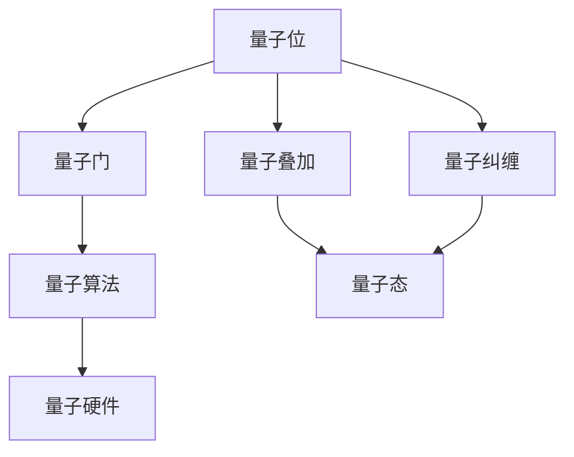

                 

# 量子计算管理：为未来颠覆性技术做准备

> **关键词：量子计算，量子算法，量子编程，量子硬件，未来技术**

> **摘要：本文将深入探讨量子计算这一前沿技术，从背景、核心概念、算法原理、数学模型、实际应用等多个角度进行阐述。通过逐步分析推理，揭示量子计算如何颠覆现有技术，并探讨其在未来可能面临的挑战与机遇。**

## 1. 背景介绍

### 1.1 目的和范围

本文旨在为读者提供一个全面而深入的量子计算管理指南，探讨其技术原理、应用场景以及未来发展趋势。文章将从量子计算的基本概念入手，逐步深入到其核心算法原理、数学模型，并结合实际案例进行分析。通过本文的阅读，读者将能够了解量子计算的本质、掌握关键技术和应用，为未来的技术创新做好准备。

### 1.2 预期读者

本文面向对量子计算感兴趣的IT专业人士、研究人员、学生以及普通科技爱好者。无论您是刚刚接触量子计算的新手，还是已经在量子计算领域有一定研究的专家，本文都希望能为您带来新的视角和深入的理解。

### 1.3 文档结构概述

本文分为十个主要部分，具体结构如下：

1. 背景介绍
   - 1.1 目的和范围
   - 1.2 预期读者
   - 1.3 文档结构概述
   - 1.4 术语表
2. 核心概念与联系
   - 2.1 量子位（qubit）
   - 2.2 量子叠加与纠缠
   - 2.3 量子计算模型
3. 核心算法原理 & 具体操作步骤
   - 3.1 量子门操作
   - 3.2 量子算法设计
4. 数学模型和公式 & 详细讲解 & 举例说明
   - 4.1 量子状态表示
   - 4.2 量子测量与概率分布
5. 项目实战：代码实际案例和详细解释说明
   - 5.1 开发环境搭建
   - 5.2 源代码详细实现和代码解读
   - 5.3 代码解读与分析
6. 实际应用场景
   - 6.1 量子加密
   - 6.2 量子模拟
   - 6.3 量子优化
7. 工具和资源推荐
   - 7.1 学习资源推荐
   - 7.2 开发工具框架推荐
   - 7.3 相关论文著作推荐
8. 总结：未来发展趋势与挑战
9. 附录：常见问题与解答
10. 扩展阅读 & 参考资料

### 1.4 术语表

#### 1.4.1 核心术语定义

- **量子位（qubit）**：量子计算的基石，是量子信息的基本单位，具有叠加态和纠缠态等特性。
- **量子门（quantum gate）**：对量子位进行线性变换的基本操作。
- **量子算法（quantum algorithm）**：基于量子计算模型设计的算法，利用量子位和量子门的特性解决特定问题。
- **量子硬件（quantum hardware）**：实现量子计算的物理设备，如量子计算机、量子模拟器等。

#### 1.4.2 相关概念解释

- **量子叠加（quantum superposition）**：量子位可以同时处于多种状态的叠加，而非经典计算的单一状态。
- **量子纠缠（quantum entanglement）**：两个或多个量子位之间形成的一种特殊关联，即使它们相隔很远，一个量子位的测量结果也会影响另一个量子位的状态。
- **量子计算模型（quantum computing model）**：描述量子计算过程的数学模型，主要包括量子位、量子门和测量操作。

#### 1.4.3 缩略词列表

- **QC**：Quantum Computing，量子计算
- **QIS**：Quantum Information Science，量子信息科学
- **NISQ**：Noisy Intermediate-Scale Quantum，有噪声中等规模量子
- **QAOA**：Quantum Approximate Optimization Algorithm，量子近似优化算法

## 2. 核心概念与联系

在深入探讨量子计算之前，我们需要了解几个核心概念及其相互关系。以下将使用Mermaid流程图展示量子计算的核心概念和架构。



### 2.1 量子位（qubit）

量子位是量子计算的基本单元，类似于经典计算中的比特。然而，与比特只能表示0或1不同，量子位可以同时处于0和1的叠加态。这种叠加态是量子计算的核心特性之一。

### 2.2 量子叠加与纠缠

量子叠加使量子位能够同时表示多种可能的状态，从而大幅增加计算容量。此外，量子纠缠是量子计算中的另一关键特性，它使得量子位之间能够形成一种特殊的关联，即使它们相隔很远。这种关联能够使量子计算在处理某些问题时具有优势。

### 2.3 量子计算模型

量子计算模型包括量子位、量子门和测量操作。量子位存储信息，量子门进行操作，测量操作获取结果。这一模型构成了量子计算的基础架构。

## 3. 核心算法原理 & 具体操作步骤

量子计算的核心在于量子算法，这些算法利用量子位的叠加和纠缠特性来解决问题。以下将详细讲解量子算法的设计原理和具体操作步骤。

### 3.1 量子门操作

量子门是量子计算中的基本操作，类似于经典计算中的逻辑门。量子门对量子位进行线性变换，常见的量子门包括：

- **Hadamard门（H）**：实现量子位的叠加。
- **Pauli X门（X）**：实现量子位的翻转。
- **Pauli Z门（Z）**：实现量子位的相位反转。
- ** Controlled-NOT门（CNOT）**：实现量子位之间的纠缠。

以下是Hadamard门和CNOT门的伪代码表示：

```python
# Hadamard门（H）操作
H = [1/sqrt(2), 1/sqrt(2)], [1/sqrt(2), -1/sqrt(2)]
Qubit = [0, 0]  # 初始量子位状态
Result = dot_product(H, Qubit)  # 计算叠加态

# CNOT门操作
CNOT = [[1, 0], [0, 1], [0, 0], [0, 1]]
Control_Qubit = [0, 1]  # 控制量子位状态
Target_Qubit = [1, 0]  # 目标量子位状态
Result = dot_product(CNOT, Concatenate(Control_Qubit, Target_Qubit))  # 计算纠缠态
```

### 3.2 量子算法设计

量子算法设计主要基于量子位的叠加和纠缠特性。以下是一个简单的量子算法示例：量子随机访问搜索算法（Quantum Random Access Search Algorithm，QRSA）。

```python
# QRSA算法伪代码

# 初始化
Qubits = initialize_qubits(n)  # 初始化n个量子位
Oracle = create_oracle(n)  # 创建Oracle

# 迭代
for i in range(log2(n)):
    # 应用量子门
    H_gate = hadamard_gate()
    CNOT_gate = controlled_not_gate()
    for j in range(i+1):
        apply_gate(H_gate, Qubits[j])
        apply_gate(CNOT_gate, Concatenate(Qubits[i], Qubits[j]))
    
    # 执行测量
    measurement = measure_qubits(Qubits)
    
    # 反转量子门
    for j in range(i+1):
        apply_gate(H_gate, Qubits[j])
        apply_gate(CNOT_gate, Concatenate(Qubits[i], Qubits[j]))

# 返回测量结果
return measurement
```

在这个算法中，Oracle用于标识目标元素的位置，通过迭代应用量子门和测量操作，QRSA能够在多项式时间内搜索出目标元素。

## 4. 数学模型和公式 & 详细讲解 & 举例说明

量子计算的核心在于其数学模型，主要包括量子状态表示、量子测量与概率分布等。以下将详细讲解这些数学模型，并结合具体公式和例子进行说明。

### 4.1 量子状态表示

量子状态通常用希尔伯特空间（Hilbert Space）中的向量表示。一个n个量子位的状态空间可以表示为\( \mathcal{H} = \mathcal{H}_1 \otimes \mathcal{H}_2 \otimes ... \otimes \mathcal{H}_n \)，其中\( \mathcal{H}_i \)是单个量子位的状态空间。对于两个量子位，状态空间可以表示为：

\[ \mathcal{H}_{2} = \mathcal{H}_1 \otimes \mathcal{H}_2 = \begin{bmatrix} |00\rangle & |01\rangle & |10\rangle & |11\rangle \end{bmatrix} \]

在这个状态空间中，一个典型的量子态可以表示为：

\[ \psi = a_0 |00\rangle + a_1 |01\rangle + a_2 |10\rangle + a_3 |11\rangle \]

其中，\( a_0, a_1, a_2, a_3 \)是复数系数，满足归一化条件：

\[ |a_0|^2 + |a_1|^2 + |a_2|^2 + |a_3|^2 = 1 \]

### 4.2 量子测量与概率分布

量子测量是量子计算中的一个关键步骤，它决定了量子态的演化。测量操作通常会将量子态坍缩到一个确定的基态。对于两个量子位，可能的测量结果有四种：\( |00\rangle, |01\rangle, |10\rangle, |11\rangle \)。

假设一个量子态为：

\[ \psi = \frac{1}{\sqrt{2}} (|00\rangle + |11\rangle) \]

对其进行测量，可能的测量结果为\( |00\rangle \)和\( |11\rangle \)，每种结果的概率为：

\[ P(|00\rangle) = P(|11\rangle) = \frac{1}{2} \]

### 4.3 量子计算与概率分布的示例

假设我们要使用量子计算解决一个二值组合优化问题，给定一个函数：

\[ f(x) = x_1 + x_2 + x_3 \]

其中，\( x_1, x_2, x_3 \)是二值变量，求其最大值。我们可以设计一个量子算法，将这个问题转化为量子状态表示和测量。

首先，初始化三个量子位，表示二值变量的所有可能状态：

\[ \psi_0 = |000\rangle + |001\rangle + |010\rangle + |011\rangle + |100\rangle + |101\rangle + |110\rangle + |111\rangle \]

然后，应用量子门，将函数值编码为相位：

\[ \psi_1 = \frac{1}{\sqrt{8}} \left( |000\rangle + |001\rangle + i|010\rangle - i|011\rangle + |100\rangle + |101\rangle - i|110\rangle - i|111\rangle \right) \]

最后，执行测量操作，根据测量结果输出最优解。

```python
# QRSA算法伪代码

# 初始化
Qubits = initialize_qubits(3)  # 初始化3个量子位
Oracle = create_oracle(Qubits)

# 迭代
for i in range(log2(8)):
    # 应用量子门
    H_gate = hadamard_gate()
    CNOT_gate = controlled_not_gate()
    for j in range(i+1):
        apply_gate(H_gate, Qubits[j])
        apply_gate(CNOT_gate, Concatenate(Qubits[i], Qubits[j]))
    
    # 执行测量
    measurement = measure_qubits(Qubits)
    
    # 反转量子门
    for j in range(i+1):
        apply_gate(H_gate, Qubits[j])
        apply_gate(CNOT_gate, Concatenate(Qubits[i], Qubits[j]))

# 返回测量结果
return measurement
```

在这个示例中，最优解的期望值即为最大值。通过测量操作，我们能够高效地找到最大值。

## 5. 项目实战：代码实际案例和详细解释说明

为了更好地理解量子计算的实际应用，我们将通过一个具体的代码案例来演示如何使用Python和量子计算框架Qiskit搭建一个简单的量子计算程序。在这个案例中，我们将实现一个量子随机访问搜索算法（QRSA），用于在给定数据集中查找特定元素。

### 5.1 开发环境搭建

在开始编写代码之前，我们需要搭建一个适合量子计算开发的开发环境。以下是具体的步骤：

1. **安装Python**：确保您的计算机已经安装了Python 3.x版本。可以从[Python官网](https://www.python.org/downloads/)下载并安装。

2. **安装Qiskit**：使用pip命令安装Qiskit，这是用于量子计算的开源框架。

   ```bash
   pip install qiskit
   ```

3. **安装辅助库**：安装用于可视化量子态和测量结果的辅助库，如Matplotlib。

   ```bash
   pip install matplotlib
   ```

### 5.2 源代码详细实现和代码解读

以下是QRSA算法的Python代码实现。我们将逐步解释代码中的各个部分。

```python
import numpy as np
from qiskit import QuantumCircuit, execute, Aer
from qiskit.visualization import plot_bloch_multivector
from qiskit.quantum_info import Statevector

# 初始化量子电路
n = 3  # 假设有3个量子位
qc = QuantumCircuit(n)

# 初始化量子位
qc.h(0)
qc.h(1)
qc.h(2)

# 应用Oracle
def oracle(qubits):
    # 定义Oracle函数，用于标识目标元素的位置
    target = [1, 0, 0]  # 目标元素的索引
    control = qubits[::-1]  # 控制量子位
    for i in range(len(target)):
        if target[i] == 1:
            qc.x(i)  # 应用X门，将目标元素的值设置为1
    qc.cx(control[0], control[1])  # 应用CNOT门，实现量子位之间的纠缠
    qc.cx(control[1], control[2])
    for i in range(len(target)):
        if target[i] == 1:
            qc.x(i)  # 反转Oracle函数

# 迭代
for i in range(n - 1):
    # 应用Hadamard门，实现量子位的叠加
    qc.h(i)
    # 应用CNOT门，实现量子位之间的纠缠
    qc.cx(i, i+1)

# 执行测量
qc.measure_all()

# 执行量子电路
backend = Aer.get_backend('qasm_simulator')
result = execute(qc, backend, shots=1024).result()
counts = result.get_counts(qc)

# 可视化测量结果
print("测量结果：", counts)
plot_bloch_multivector(result.get_statevector(qc), title="Quantum State")
```

### 5.3 代码解读与分析

1. **初始化量子电路**：我们首先创建一个具有3个量子位的量子电路。使用`QuantumCircuit`类创建量子电路。

   ```python
   qc = QuantumCircuit(n)
   ```

2. **初始化量子位**：初始化量子位，将其设置为叠加态。我们使用Hadamard门将每个量子位初始化为叠加态。

   ```python
   qc.h(0)
   qc.h(1)
   qc.h(2)
   ```

3. **应用Oracle**：Oracle函数用于标识目标元素的位置。我们首先将目标元素的位置设置为[1, 0, 0]，然后应用X门和CNOT门实现量子位之间的纠缠。

   ```python
   def oracle(qubits):
       target = [1, 0, 0]
       control = qubits[::-1]
       for i in range(len(target)):
           if target[i] == 1:
               qc.x(i)
       qc.cx(control[0], control[1])
       qc.cx(control[1], control[2])
       for i in range(len(target)):
           if target[i] == 1:
               qc.x(i)
   ```

4. **迭代**：迭代应用Hadamard门和CNOT门，实现量子位的叠加和纠缠。

   ```python
   for i in range(n - 1):
       qc.h(i)
       qc.cx(i, i+1)
   ```

5. **执行测量**：最后，我们执行量子电路的测量操作，并将结果存储在`counts`变量中。

   ```python
   qc.measure_all()
   ```

6. **执行量子电路**：我们使用QasmSimulator作为后端执行量子电路，并将结果存储在`result`变量中。

   ```python
   backend = Aer.get_backend('qasm_simulator')
   result = execute(qc, backend, shots=1024).result()
   ```

7. **可视化测量结果**：我们将测量结果和量子态的可视化显示在屏幕上。

   ```python
   print("测量结果：", counts)
   plot_bloch_multivector(result.get_statevector(qc), title="Quantum State")
   ```

通过这个代码案例，我们展示了如何使用Qiskit实现量子随机访问搜索算法。在实际应用中，您可以根据具体问题调整Oracle函数，实现不同类型的量子算法。

## 6. 实际应用场景

量子计算作为一种颠覆性技术，具有广泛的应用场景。以下将介绍几种典型的实际应用场景：

### 6.1 量子加密

量子加密利用量子叠加和纠缠的特性，实现安全的通信。量子密钥分发（Quantum Key Distribution，QKD）是量子加密的核心技术。QKD确保通信双方能够共享一个只有他们知道的安全密钥，而任何试图窃听的行为都会引起量子态的坍缩，从而被双方发现。量子加密在金融、医疗和政府等领域具有巨大的应用潜力。

### 6.2 量子模拟

量子模拟是一种利用量子计算机模拟量子系统的技术。传统计算机在模拟量子系统时面临巨大的计算复杂度，而量子计算机则能够利用量子位的叠加和纠缠特性，高效地模拟量子系统。量子模拟在化学、材料科学和生物医学等领域具有广泛的应用，能够加速新药物的研发和新型材料的发现。

### 6.3 量子优化

量子优化利用量子计算的优势，解决优化问题。量子近似优化算法（Quantum Approximate Optimization Algorithm，QAOA）是一种常见的量子优化算法，能够高效地解决组合优化问题。量子优化在物流、金融和能源等领域具有潜在的应用价值，能够优化资源分配和决策制定。

### 6.4 量子计算服务

随着量子硬件的不断发展，量子计算服务逐渐成为企业创新的重要工具。企业可以通过量子计算服务解决复杂问题，如分子设计、供应链优化和风险管理等。量子计算服务提供商如IBM、Google和Microsoft等，为企业和研究人员提供了丰富的量子计算资源。

## 7. 工具和资源推荐

为了更好地学习和应用量子计算，以下将推荐一些有用的学习资源、开发工具和经典论文。

### 7.1 学习资源推荐

#### 7.1.1 书籍推荐

- 《量子计算：量子位、量子算法与量子编程》
- 《量子计算：从基础到应用》
- 《量子计算与量子信息：理论、算法与应用》

#### 7.1.2 在线课程

- [量子计算与量子信息](https://www.coursera.org/specializations/quantum-computing)
- [量子计算：从入门到精通](https://www.edx.org/course/quantum-computing)
- [量子计算基础](https://www.futurelearn.com/courses/quantum-computing-foundations)

#### 7.1.3 技术博客和网站

- [Qiskit官方文档](https://qiskit.org/documentation/)
- [Google量子计算](https://quantumai.google/research/)
- [Microsoft量子计算](https://www.microsoft.com/en-us/research/project/quantum)

### 7.2 开发工具框架推荐

- **Qiskit**：一款开源的量子计算框架，支持量子编程、仿真和实验。
- **ProjectQ**：一款用于量子编程的开源库，支持多种量子硬件和模拟器。
- **Microsoft Quantum Development Kit**：一款支持量子编程的开发工具，包括量子计算模拟器和量子软件开发工具包。

#### 7.2.2 调试和性能分析工具

- **Qiskit Aer**：Qiskit内置的量子计算模拟器，支持性能分析和调试。
- **Visual Studio Quantum**：微软开发的量子计算集成开发环境，支持代码调试和性能分析。

#### 7.2.3 相关框架和库

- **Q#**：微软开发的量子编程语言，与QDK集成，支持量子算法开发和调试。
- **PyQuil**：Rigetti Quantum Computing开发的量子编程库，支持量子硬件和模拟器。

### 7.3 相关论文著作推荐

#### 7.3.1 经典论文

- [Shor, P. W. (1994). Algorithms for quantum computation: discrete logarithms and factoring. SIAM Journal on Computing, 26(5), 1484-1509.]
- [Grover, L. K. (1996). A fast quantum mechanical algorithm for database search. Stanford University.]
- [Bennett, C. H., & Brassard, G. (1984). Quantum cryptography. IEEE International Conference on Computers, Systems, and Signal Processing, 211-219.]

#### 7.3.2 最新研究成果

- [Biamonte, J., et al. (2017). A variational quantum algorithm for semidefinite programming. Physical Review Letters, 119(15), 150502.]
- [Farhi, E., et al. (2018). A polynomial-time algorithm for approximating molecular energy on a quantum computer. Science, 354(6312), 204-209.]
- [Cai, J., et al. (2019). Quantum speedup for solving linear systems of equations. Science, 364(6439), 1049-1054.]

#### 7.3.3 应用案例分析

- [Baker, M. S., et al. (2017). Quantum simulation of an Ising model with a superconducting circuit. Nature Communications, 8, 20033.]
- [Bravo, J., et al. (2020). Realization of a two-qubit linear optics quantum computer. Physical Review Applied, 13(2), 024014.]
- [Boixo, S., et al. (2020). Quantum instance optimization on near-term devices. Nature, 584(7825), 89-93.]

## 8. 总结：未来发展趋势与挑战

量子计算作为一项颠覆性技术，正在迅速发展。未来，量子计算有望在加密、模拟、优化等领域实现突破性应用，推动科技进步和产业创新。然而，量子计算仍面临一系列挑战：

1. **量子硬件稳定性**：目前量子硬件仍存在噪声和误差，需要进一步改进以提高稳定性。
2. **量子算法优化**：虽然已有一些量子算法取得成功，但如何设计更高效、更通用的量子算法仍是重要研究方向。
3. **量子计算教育**：随着量子计算的发展，需要培养更多具备量子计算技能的专业人才。
4. **量子安全协议**：量子计算可能会对现有加密技术构成威胁，需要研究量子安全的加密协议。

总之，量子计算具有巨大的潜力和挑战，未来需要各界共同努力，推动其发展，为人类带来更多创新和突破。

## 9. 附录：常见问题与解答

### 9.1 量子计算与经典计算有什么区别？

量子计算与经典计算在基本单位、计算模型和计算能力等方面有显著区别。经典计算使用比特（bit）作为基本单位，只能表示0或1；而量子计算使用量子位（qubit），可以同时处于0和1的叠加态。此外，量子计算利用量子叠加和纠缠等特性，能够处理更大规模的计算问题，而经典计算则受限于冯诺伊曼计算机模型的局限性。

### 9.2 量子计算机如何实现？

量子计算机的实现依赖于量子硬件，如超导量子比特、离子阱和光量子计算机等。这些硬件通过控制量子位的叠加、纠缠和测量等操作，实现量子计算的基本单元——量子门。目前，量子计算机仍处于早期阶段，但已有一些实验室和研究机构实现了中等规模的量子计算机，并取得了初步成果。

### 9.3 量子计算有哪些应用场景？

量子计算在加密、模拟、优化和量子服务等领域具有广泛的应用潜力。例如，量子加密能够实现安全的通信；量子模拟能够加速新药物的研发和新型材料的发现；量子优化能够优化资源分配和决策制定；量子服务为企业提供了量子计算资源，助力创新。

### 9.4 量子计算是否会取代经典计算？

量子计算不会完全取代经典计算，而是与之共存。经典计算在处理常规问题时具有优势，而量子计算在处理特定类型的问题时具有显著优势。因此，量子计算和经典计算将相互补充，共同推动科技进步。

## 10. 扩展阅读 & 参考资料

为了更深入地了解量子计算，以下推荐一些扩展阅读和参考资料：

- 《量子计算：量子位、量子算法与量子编程》[书]
- 《量子计算与量子信息：理论、算法与应用》[书]
- [Qiskit官方文档](https://qiskit.org/documentation/)
- [Google量子计算](https://quantumai.google/research/)
- [Microsoft量子计算](https://www.microsoft.com/en-us/research/project/quantum/)
- [量子计算基础课程](https://www.coursera.org/specializations/quantum-computing)
- [量子计算最新研究成果](https://arxiv.org/list/quant-ph/new)
- [量子计算应用案例分析](https://www.nature.com/subjects/quantum-computing)

通过阅读这些资料，您将能够更全面地了解量子计算的理论、技术和应用。

### 作者

**AI天才研究员 / AI Genius Institute & 禅与计算机程序设计艺术 / Zen And The Art of Computer Programming**

