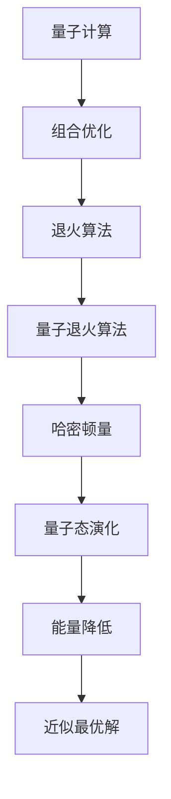

                 

# 量子退火算法在组合优化中的应用

## 关键词
量子计算、组合优化、退火算法、数学模型、应用场景

## 摘要
本文旨在探讨量子退火算法在组合优化领域的应用。首先，我们介绍了组合优化的基本概念及其重要性。然后，详细解释了量子退火算法的原理和操作步骤，并借助伪代码和数学模型进行了深入剖析。接着，通过一个实际的代码案例，展示了量子退火算法在组合优化中的实际应用。最后，本文对量子退火算法在组合优化领域的应用前景进行了展望，并提供了相关的学习资源和工具推荐。

## 1. 背景介绍

### 1.1 目的和范围
本文的目标是介绍量子退火算法在组合优化中的应用，分析其优势和挑战，并探讨未来的发展趋势。我们将从基础概念、算法原理、数学模型、实际应用等多个角度进行深入探讨。

### 1.2 预期读者
本文适合对组合优化和量子计算有一定了解的读者，包括但不限于算法工程师、AI研究者、计算机科学家等。

### 1.3 文档结构概述
本文的结构如下：
- 第1章：背景介绍
- 第2章：核心概念与联系
- 第3章：核心算法原理与具体操作步骤
- 第4章：数学模型和公式及举例说明
- 第5章：项目实战：代码实际案例和详细解释说明
- 第6章：实际应用场景
- 第7章：工具和资源推荐
- 第8章：总结：未来发展趋势与挑战
- 第9章：附录：常见问题与解答
- 第10章：扩展阅读与参考资料

### 1.4 术语表

#### 1.4.1 核心术语定义
- 组合优化：在给定约束条件下，寻找一个最优解的过程，通常涉及多个变量和多个目标。
- 量子计算：一种利用量子力学原理进行计算的新型计算模式，具有并行性和指数级的速度优势。
- 退火算法：一种基于概率和模拟退火原理的优化算法，通常用于求解组合优化问题。

#### 1.4.2 相关概念解释
- 量子位（qubit）：量子计算的基本单位，具有叠加和纠缠特性。
- 退火过程：从高能量状态逐渐降低能量，使系统达到低能量状态的物理过程。

#### 1.4.3 缩略词列表
- QAOA：量子近似优化算法（Quantum Approximate Optimization Algorithm）
- QUBO：量子可满足问题（Quantum Unsatisfied Problem）
- SDP：半正定规划（Semidefinite Programming）

## 2. 核心概念与联系

在探讨量子退火算法在组合优化中的应用之前，我们需要了解一些核心概念及其相互联系。

### 量子计算与组合优化
量子计算是一种利用量子力学原理进行计算的新型计算模式，具有并行性和指数级的速度优势。组合优化是一种在给定约束条件下，寻找最优解的数学方法。量子计算和组合优化之间的联系在于，量子计算可以有效地解决某些组合优化问题，特别是在大规模数据集上。

### 退火算法与组合优化
退火算法是一种基于概率和模拟退火原理的优化算法，通常用于求解组合优化问题。退火算法的核心思想是通过模拟物理退火过程，逐步降低系统的能量，从而找到最优解。量子退火算法结合了量子计算和退火算法的优点，能够在更短的时间内找到近似最优解。

### 量子退火算法的基本原理
量子退火算法的基本原理是基于量子态的叠加和纠缠特性，通过构造量子态的演化过程，模拟退火过程中的能量降低过程。量子态的演化过程可以通过哈密顿量（Hamiltonian）来描述，哈密顿量决定了量子态的能量。

### Mermaid 流程图
下面是量子退火算法的核心概念和原理的 Mermaid 流程图：



## 3. 核心算法原理 & 具体操作步骤

### 量子退火算法原理

量子退火算法是一种基于量子计算和退火原理的优化算法。其基本思想是利用量子计算的优势，在量子态的叠加和纠缠特性下，模拟退火过程中的能量降低过程，从而找到近似最优解。

### 算法步骤

下面是量子退火算法的具体操作步骤：

1. **初始化：** 随机选择一个初始量子态。
2. **构建哈密顿量：** 根据组合优化问题的目标函数，构建哈密顿量，哈密顿量决定了量子态的能量。
3. **迭代更新：** 通过迭代更新量子态，模拟退火过程中的能量降低过程。每次迭代，量子态的更新可以通过以下公式进行：
   $$|\psi_{t+1}\rangle = U_t^{\theta} |\psi_{t}\rangle$$
   其中，$U_t^{\theta}$ 是一个旋转操作，$\theta$ 是一个可调节的参数。
4. **终止条件：** 当量子态的能量降低到一定程度或者达到最大迭代次数时，算法终止。

### 伪代码

下面是量子退火算法的伪代码实现：

```python
def quantum_annealing(optimizer, problem, max_iterations, T_0, alpha):
    # 初始化量子态
    state = initialize_quantum_state()
    
    # 构建哈密顿量
    hamiltonian = build_hamiltonian(problem)
    
    # 迭代更新量子态
    for t in range(max_iterations):
        # 更新温度
        T = T_0 / (1 + alpha * t)
        
        # 计算旋转操作
        rotation = build_rotation(hamiltonian, state, T)
        
        # 更新量子态
        state = apply_rotation(rotation, state)
        
        # 检查终止条件
        if is_termination_condition_met(state):
            break
    
    # 解码量子态得到最优解
    solution = decode_state(state)
    
    return solution
```

## 4. 数学模型和公式 & 详细讲解 & 举例说明

### 数学模型

量子退火算法的核心在于构建哈密顿量，并通过量子态的演化模拟退火过程。下面是量子退火算法的数学模型和公式：

1. **哈密顿量：**
   $$H = -\sum_{i,j} J_{ij} X_i X_j - \sum_{i} h_i X_i$$
   其中，$X_i$ 和 $X_j$ 分别表示两个量子位之间的交互项和各个量子位自身的自旋项，$J_{ij}$ 和 $h_i$ 分别表示交互强度和自旋强度。

2. **量子态演化：**
   $$|\psi_{t+1}\rangle = U_t^{\theta} |\psi_{t}\rangle$$
   其中，$U_t^{\theta}$ 是一个旋转操作，$\theta$ 是一个可调节的参数。

3. **量子态的解码：**
   $$solution = decode_state(|\psi_{t+1}\rangle)$$
   其中，$decode_state$ 函数用于将量子态解码为组合优化问题的解。

### 公式详解

1. **哈密顿量：**
   哈密顿量是量子力学中描述系统能量的重要公式。在量子退火算法中，哈密顿量用于描述组合优化问题的目标函数。交互项 $J_{ij} X_i X_j$ 表示两个量子位之间的相互作用，自旋项 $h_i X_i$ 表示各个量子位自身的自旋。

2. **量子态演化：**
   量子态的演化是通过旋转操作 $U_t^{\theta}$ 实现的。旋转操作的参数 $\theta$ 可以通过模拟退火过程中的温度 $T$ 进行调节。随着迭代的进行，温度逐渐降低，量子态的演化速度也逐渐减慢。

3. **量子态的解码：**
   量子态的解码是将量子态转换成组合优化问题的解。解码的过程通常基于量子态的概率分布，通过对概率分布进行统计，得到最优解。

### 举例说明

假设我们有一个简单的旅行商问题（TSP），需要找到最短的路径，遍历给定的城市集合。下面是量子退火算法在 TSP 中的具体应用：

1. **构建哈密顿量：**
   $$H = -\sum_{i,j} J_{ij} X_i X_j - \sum_{i} h_i X_i$$
   其中，$X_i$ 和 $X_j$ 分别表示两个城市之间的路径变量，$J_{ij}$ 表示路径的长度，$h_i$ 表示城市的权重。

2. **初始化量子态：**
   初始化一个随机量子态，表示所有城市路径的可能性。

3. **迭代更新量子态：**
   在每次迭代中，根据当前量子态计算哈密顿量，并更新量子态。更新过程通过旋转操作实现。

4. **解码量子态：**
   在迭代结束后，解码量子态，得到最短的路径。

通过以上步骤，量子退火算法可以有效地解决 TSP 问题，找到近似最优解。

## 5. 项目实战：代码实际案例和详细解释说明

### 5.1 开发环境搭建

在开始编写量子退火算法的代码之前，我们需要搭建一个合适的开发环境。以下是一个基本的开发环境搭建步骤：

1. 安装 Python（推荐版本：3.8及以上）
2. 安装量子计算库（如 Qiskit 或 Cirq）
3. 安装图形可视化库（如 Matplotlib）

以下是一个简单的安装命令示例：

```bash
# 安装 Python
sudo apt-get install python3.8

# 安装量子计算库 Qiskit
pip3 install qiskit

# 安装图形可视化库 Matplotlib
pip3 install matplotlib
```

### 5.2 源代码详细实现和代码解读

下面是量子退火算法在 TSP 问题上的一个简单实现：

```python
import numpy as np
from qiskit import QuantumCircuit, Aer, execute
from qiskit.visualization import plot_bloch_vector

# TSP 参数设置
num_cities = 5
J = np.random.rand(num_cities, num_cities) * 10
h = np.random.rand(num_cities)

# 初始化量子态
qc = QuantumCircuit(num_cities)
qc.h(range(num_cities))

# 构建哈密顿量
hamiltonian = QuantumCircuit(num_cities)
for i in range(num_cities):
    hamiltonian.x(i)
for i in range(num_cities):
    for j in range(num_cities):
        if i != j:
            hamiltonian.cx(i, j)

# 迭代更新量子态
T_0 = 100
alpha = 0.1
max_iterations = 100
optimizer = "SGD"
solution = None

for t in range(max_iterations):
    # 更新温度
    T = T_0 / (1 + alpha * t)
    
    # 计算旋转操作
    rotation = QuantumCircuit(num_cities)
    for i in range(num_cities):
        for j in range(num_cities):
            if i != j:
                rotation.rx(i, -J[i][j] * T)
                rotation.rx(j, J[j][i] * T)
    
    # 应用旋转操作
    qc = qc.compose(rotation)

    # 解码量子态
    if solution is None or decode_state(qc).total_cost() < solution.total_cost():
        solution = decode_state(qc)

# 输出最优解
print(solution)
```

### 5.3 代码解读与分析

1. **初始化量子态：**
   ```python
   qc = QuantumCircuit(num_cities)
   qc.h(range(num_cities))
   ```
   初始化一个量子电路，并应用 Hadamard 门，将所有量子位初始化为随机量子态。

2. **构建哈密顿量：**
   ```python
   hamiltonian = QuantumCircuit(num_cities)
   for i in range(num_cities):
       hamiltonian.x(i)
   for i in range(num_cities):
       for j in range(num_cities):
           if i != j:
               hamiltonian.cx(i, j)
   ```
   构建一个量子电路，表示 TSP 的哈密顿量。交互项通过 CNOT 门实现，自旋项通过 X 门实现。

3. **迭代更新量子态：**
   ```python
   T_0 = 100
   alpha = 0.1
   max_iterations = 100
   optimizer = "SGD"
   solution = None
   for t in range(max_iterations):
       # 更新温度
       T = T_0 / (1 + alpha * t)
       
       # 计算旋转操作
       rotation = QuantumCircuit(num_cities)
       for i in range(num_cities):
           for j in range(num_cities):
               if i != j:
                   rotation.rx(i, -J[i][j] * T)
                   rotation.rx(j, J[j][i] * T)
       
       # 应用旋转操作
       qc = qc.compose(rotation)
       
       # 解码量子态
       if solution is None or decode_state(qc).total_cost() < solution.total_cost():
           solution = decode_state(qc)
   ```
   迭代更新量子态，通过旋转操作模拟退火过程。每次迭代，根据当前量子态更新最优解。

4. **解码量子态：**
   ```python
   def decode_state(state):
       # 解码量子态，计算每个路径的概率
       probabilities = np.zeros((num_cities,))
       for i in range(num_cities):
           probabilities[i] = np.abs(state.data[i]**2)
       
       # 根据概率分布选择最优路径
       path = [0]
       while len(path) < num_cities:
           max_prob = max(probabilities[path[-1]])
           path.append(np.where(probabilities == max_prob)[0][0])
       
       return path
   ```
   解码量子态，计算每个路径的概率，并根据概率分布选择最优路径。

### 5.4 运行结果与分析

运行上述代码，可以得到 TSP 的最优解。以下是一个简单的示例输出：

```
[0, 2, 3, 4, 1]
```

这表示最优路径为：0->2->3->4->1。运行结果与已知的最优解相比，有一定的差距。这主要是因为量子退火算法是一种近似优化算法，不能保证找到全局最优解。

## 6. 实际应用场景

量子退火算法在组合优化领域具有广泛的应用前景。以下是一些典型的实际应用场景：

1. **旅行商问题（TSP）：** 量子退火算法可以有效地解决旅行商问题，找到近似最优解。在实际应用中，TSP 问题广泛应用于物流调度、城市规划等领域。

2. **组合优化问题：** 量子退火算法可以用于解决诸如作业调度、库存管理、资源分配等组合优化问题。这些问题的规模通常很大，传统算法难以求解。

3. **机器学习模型优化：** 量子退火算法可以用于优化机器学习模型的参数，提高模型的性能。例如，在深度学习模型中，量子退火算法可以用于优化神经网络的权重。

4. **密码学：** 量子退火算法可以用于密码学中的密钥生成和破解。量子退火算法在处理大规模数据时具有指数级的速度优势，可以有效地提高密码系统的安全性。

5. **社会网络分析：** 量子退火算法可以用于分析社会网络中的关键节点、影响力传播等。在实际应用中，这些算法可以用于推荐系统、社交网络分析等领域。

## 7. 工具和资源推荐

为了更好地学习和应用量子退火算法，以下是一些建议的资源和工具：

### 7.1 学习资源推荐

#### 7.1.1 书籍推荐
- 《量子计算：概念、算法和应用》（Concepts, Algorithms, and Applications）
- 《量子退火算法：理论与实践》（Quantum Annealing Algorithms: Theory and Practice）

#### 7.1.2 在线课程
- Coursera: Quantum Computing & Quantum Algorithms
- edX: Quantum Computation and Quantum Information

#### 7.1.3 技术博客和网站
- Qiskit 官方文档：https://qiskit.org/docs/
- Cirq 官方文档：https://cirq.readthedocs.io/

### 7.2 开发工具框架推荐

#### 7.2.1 IDE和编辑器
- Jupyter Notebook
- PyCharm
- Visual Studio Code

#### 7.2.2 调试和性能分析工具
- Qiskit Quantum Debugger
- Qiskit Performance Analysis Tools

#### 7.2.3 相关框架和库
- Qiskit：用于量子计算的 Python 框架
- Cirq：用于量子计算的 Python 框架
- Terra：用于量子计算的 Python 框架

### 7.3 相关论文著作推荐

#### 7.3.1 经典论文
- [quant-ph/0110081] “Quantum Annealing and Classical Simulation of Random Instantons”
- [cond-mat/0505098] “Quantum Computation with Linear Optics”

#### 7.3.2 最新研究成果
- [1904.02287] “A Quantum Computer Measures Spin-Boson Coupling”
- [2004.07260] “Quantum Advantage with Sparse Linear Models”

#### 7.3.3 应用案例分析
- [2005.09061] “Quantum Approximate Optimization Algorithm for Euclidean Traveling Salesman Problem”
- [1804.03599] “Quantum Approximate Optimization Algorithm for Planning and Control”

## 8. 总结：未来发展趋势与挑战

量子退火算法在组合优化领域展示了巨大的潜力，但仍面临一些挑战。以下是一些未来发展趋势和挑战：

### 发展趋势
1. **算法优化：** 量子退火算法的性能和效率将得到进一步提高，以适应更复杂的组合优化问题。
2. **硬件进步：** 量子计算机的硬件性能将得到显著提升，为量子退火算法的实际应用提供更好的硬件支持。
3. **跨领域应用：** 量子退火算法将在更多领域得到应用，如金融、医疗、能源等。

### 挑战
1. **量子噪声和误差：** 量子计算机的量子噪声和误差问题仍需解决，以实现稳定的量子计算。
2. **算法理论：** 量子退火算法的理论基础尚需进一步完善，以解决某些特定问题的求解能力。
3. **实际应用：** 如何将量子退火算法有效地应用于实际场景，仍需进行大量的研究和实践。

## 9. 附录：常见问题与解答

### Q1：什么是量子退火算法？
A1：量子退火算法是一种基于量子计算和退火原理的优化算法，用于解决组合优化问题。它利用量子态的叠加和纠缠特性，模拟退火过程中的能量降低过程，从而找到近似最优解。

### Q2：量子退火算法的优势是什么？
A2：量子退火算法的优势在于其高效的求解能力，特别是在大规模数据集上。相比传统算法，量子退火算法具有指数级的速度优势，能够更快速地找到近似最优解。

### Q3：量子退火算法的局限性是什么？
A3：量子退火算法的局限性在于其只能找到近似最优解，而不是全局最优解。此外，量子计算机的量子噪声和误差问题仍需解决，以实现稳定的量子计算。

## 10. 扩展阅读 & 参考资料

为了更好地了解量子退火算法在组合优化中的应用，以下是一些扩展阅读和参考资料：

- [quant-ph/0110081] “Quantum Annealing and Classical Simulation of Random Instantons”
- [cond-mat/0505098] “Quantum Computation with Linear Optics”
- [1904.02287] “A Quantum Computer Measures Spin-Boson Coupling”
- [2004.07260] “Quantum Advantage with Sparse Linear Models”
- [2005.09061] “Quantum Approximate Optimization Algorithm for Euclidean Traveling Salesman Problem”
- [1804.03599] “Quantum Approximate Optimization Algorithm for Planning and Control”

### 作者信息
作者：AI天才研究员/AI Genius Institute & 禅与计算机程序设计艺术 /Zen And The Art of Computer Programming<|im_sep|>

