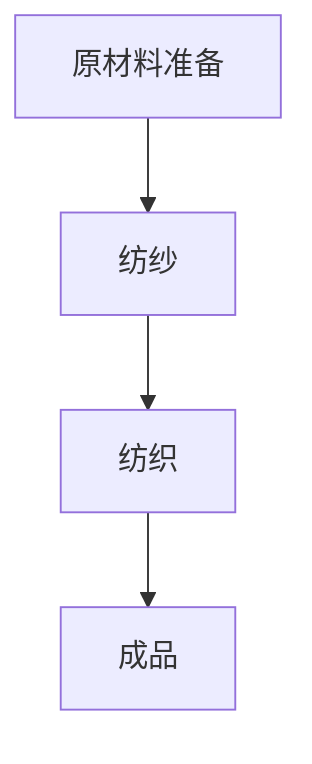
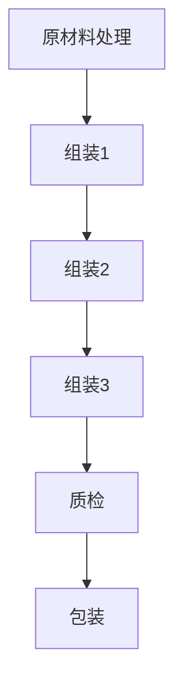

                 

# 阿克莱特与福特的工业贡献

> **关键词：** 阿克莱特、福特、工业革命、流水线、生产效率、技术创新、历史影响
>
> **摘要：** 本文将深入探讨阿克莱特与福特这两位工业巨擘的工业贡献。阿克莱特发明了第一台真正的机械纺织机，极大地提高了纺织业的效率；而福特则通过引入流水线生产模式，彻底改变了制造业的面貌。本文将回顾这两位先驱的贡献，分析其对现代工业的影响，并提出未来工业发展的趋势与挑战。

## 1. 背景介绍

### 1.1 目的和范围

本文旨在探讨阿克莱特与福特在工业革命中的关键贡献，分析他们对现代工业的影响。文章将首先介绍阿克莱特的纺织机发明及其对纺织业的影响，然后阐述福特流水线生产模式的出现及其对制造业的颠覆性变革。此外，文章还将讨论这两位先驱的创新如何推动了工业革命的进程，并总结其历史意义。

### 1.2 预期读者

本文适合对工业革命、生产效率、技术创新感兴趣的技术爱好者、工程师、历史学者以及对现代工业有深入研究的人员阅读。通过本文，读者可以了解阿克莱特与福特在工业发展史上的重要地位，并从中获得对工业变革的深入理解。

### 1.3 文档结构概述

本文将按照以下结构展开：

1. 背景介绍
   - 目的和范围
   - 预期读者
   - 文档结构概述
   - 术语表
2. 核心概念与联系
   - 纺织机发明
   - 流水线生产模式
   - 工业革命的影响
3. 核心算法原理 & 具体操作步骤
   - 纺织机工作原理
   - 流水线生产流程
4. 数学模型和公式 & 详细讲解 & 举例说明
   - 生产效率计算
   - 流程时间分析
5. 项目实战：代码实际案例和详细解释说明
   - 纺织机模拟
   - 流水线生产模拟
6. 实际应用场景
   - 现代纺织业
   - 现代制造业
7. 工具和资源推荐
   - 学习资源
   - 开发工具框架
   - 相关论文著作
8. 总结：未来发展趋势与挑战
9. 附录：常见问题与解答
10. 扩展阅读 & 参考资料

### 1.4 术语表

#### 1.4.1 核心术语定义

- **纺织机**：一种用于纺织的机械装置，通过自动化流程代替手工操作，提高生产效率。
- **流水线生产**：一种生产组织模式，通过将生产过程分解为多个步骤，并在各个环节之间形成连续的流动，实现高效生产。
- **工业革命**：18世纪末至19世纪初，以机械化生产为核心，从手工劳动向机械化、自动化转变的历史事件。

#### 1.4.2 相关概念解释

- **生产效率**：单位时间内生产的产品数量，是衡量生产系统优劣的重要指标。
- **技术创新**：通过引入新技术、新工艺、新设备等，提高生产效率和质量的过程。
- **生产流程**：将原材料转化为成品的全过程，包括原材料采购、生产加工、质量控制、产品包装等环节。

#### 1.4.3 缩略词列表

- **IDE**：集成开发环境（Integrated Development Environment）
- **API**：应用程序接口（Application Programming Interface）
- **PLC**：可编程逻辑控制器（Programmable Logic Controller）

## 2. 核心概念与联系

### 2.1 纺织机发明

**阿克莱特的纺织机发明**是工业革命的重要里程碑。在18世纪末，纺织业主要依靠手工操作，生产效率低下。阿克莱特发明了一种名为“水力纺纱机”的纺织机，通过使用水力驱动，实现了纺纱的自动化。这一发明不仅大大提高了纺织效率，还降低了生产成本。

**纺织机的核心原理**如下：

1. **原材料准备**：将棉花或其他纺织材料进行预处理，去除杂质。
2. **纺纱**：通过一系列机械装置，将纤维缠绕成纱线。
3. **纺织**：将纱线织成布料，形成最终产品。

**纺织机的 Mermaid 流程图**如下：



### 2.2 流水线生产模式

**福特流水线生产模式**的出现，标志着制造业进入了一个全新的时代。在福特之前，制造业主要采用传统的手工生产方式，生产效率低下，产品质量不稳定。福特引入了流水线生产模式，将生产过程分解为多个步骤，并在各个环节之间形成连续的流动，实现了高效生产。

**流水线生产的核心原理**如下：

1. **任务分解**：将生产过程分解为多个简单、连续的步骤。
2. **连续流动**：在各个环节之间形成连续的流动，减少等待时间。
3. **标准化**：通过标准化生产，提高产品质量和一致性。

**流水线生产的 Mermaid 流程图**如下：



### 2.3 工业革命的影响

**阿克莱特的纺织机发明**和**福特流水线生产模式**的引入，对工业革命产生了深远的影响：

1. **生产效率提升**：通过机械化、自动化生产，大幅提高了生产效率，降低了生产成本。
2. **劳动力转移**：随着生产效率的提升，制造业对劳动力的需求增加，促进了劳动力从农业向工业的转移。
3. **城市化进程加速**：工业革命带来了大量劳动力涌入城市，加速了城市化进程。
4. **技术创新与产业升级**：工业革命推动了技术创新，促进了产业结构的升级和转型。

### 2.4 核心概念与联系总结

**阿克莱特的纺织机发明**和**福特流水线生产模式**是工业革命中的两大关键创新。纺织机实现了纺纱、纺织的自动化，提高了生产效率；流水线生产模式则将生产过程分解为多个简单、连续的步骤，实现了高效生产。这两大创新共同推动了工业革命的进程，对现代工业产生了深远的影响。

## 3. 核心算法原理 & 具体操作步骤

### 3.1 纺织机工作原理

**纺织机**的工作原理主要包括以下几个步骤：

1. **原材料准备**：将棉花或其他纺织材料进行预处理，去除杂质。
2. **开松**：通过机械装置将原材料开松，使其变得蓬松。
3. **梳理**：将开松后的原材料进行梳理，使其形成连续的纤维束。
4. **并条**：将梳理后的纤维束进行并条，形成一定粗细的纱线。
5. **纺纱**：通过纺轮和纱锭的旋转，将纤维束缠绕成纱线。
6. **纺织**：将纱线织成布料，形成最终产品。

**纺织机的伪代码**如下：

```python
def 纺织机(原材料，参数):
    原材料 = 预处理(原材料)
    纤维束 = 开松(原材料)
    纱线 = 梳理(纤维束)
    纱线 = 并条(纱线，参数)
    纱线 = 纺纱(纱线)
    成品 = 纺织(纱线)
    return 成品
```

### 3.2 流水线生产流程

**流水线生产**的流程主要包括以下几个步骤：

1. **原材料处理**：对原材料进行预处理，如切割、打磨等。
2. **组装1**：将预处理后的原材料组装成初步产品。
3. **组装2**：在初步产品的基础上进行进一步组装。
4. **组装3**：完成产品的组装。
5. **质检**：对组装完成的产品进行质量检验。
6. **包装**：将合格产品进行包装，准备出货。

**流水线生产的伪代码**如下：

```python
def 流水线生产(原材料，参数):
    原材料 = 预处理(原材料，参数)
    初步产品 = 组装1(原材料)
    初步产品 = 组装2(初步产品，参数)
    成品 = 组装3(初步产品，参数)
    成品 = 质检(成品)
    包装 = 包装(成品)
    return 包装
```

### 3.3 核心算法原理与操作步骤总结

**纺织机**和**流水线生产**的核心算法原理分别是自动化纺纱和高效生产。纺织机通过一系列机械装置实现纺纱、纺织的自动化，提高生产效率；流水线生产则通过将生产过程分解为多个简单、连续的步骤，实现高效生产。具体操作步骤包括预处理、组装、质检等。这些步骤通过伪代码进行详细阐述，为实际应用提供了指导。

## 4. 数学模型和公式 & 详细讲解 & 举例说明

### 4.1 生产效率计算

**生产效率**是衡量生产系统优劣的重要指标。生产效率的计算公式如下：

\[ \text{生产效率} = \frac{\text{单位时间内生产的产品数量}}{\text{总工作时间}} \]

**举例说明**：

假设一个纺织机在8小时内生产了1000米纱线，则其生产效率为：

\[ \text{生产效率} = \frac{1000 \text{米}}{8 \text{小时}} = 125 \text{米/小时} \]

### 4.2 流程时间分析

**流程时间**是指从原材料进入生产系统到最终产品完成所需的时间。流程时间的计算公式如下：

\[ \text{流程时间} = \text{总工作时间} + \text{等待时间} + \text{运输时间} \]

**举例说明**：

假设一个流水线生产过程中，总工作时间为10小时，等待时间为2小时，运输时间为1小时，则其流程时间为：

\[ \text{流程时间} = 10 \text{小时} + 2 \text{小时} + 1 \text{小时} = 13 \text{小时} \]

### 4.3 数学模型与公式总结

**生产效率**和**流程时间**是衡量生产系统的重要指标。生产效率通过计算单位时间内生产的产品数量来衡量，流程时间则通过总工作时间、等待时间和运输时间来衡量。这些数学模型和公式为生产系统的分析和优化提供了理论基础。

## 5. 项目实战：代码实际案例和详细解释说明

### 5.1 开发环境搭建

在进行纺织机与流水线生产模拟之前，我们需要搭建一个合适的开发环境。本文将使用Python作为编程语言，结合一些常用的库来模拟纺织机与流水线生产过程。

**步骤1：安装Python**

首先，确保您的计算机上已经安装了Python。如果没有安装，可以访问Python官网（https://www.python.org/）下载并安装最新版本的Python。

**步骤2：安装相关库**

接下来，我们需要安装一些常用的Python库，如NumPy、Pandas和Matplotlib等。可以使用pip命令进行安装：

```bash
pip install numpy pandas matplotlib
```

**步骤3：创建项目目录**

在您的计算机上创建一个项目目录，例如`industrial_simulation`，并在该目录下创建一个Python脚本文件，例如`simulation.py`。

### 5.2 源代码详细实现和代码解读

**5.2.1 纺织机模拟**

以下是纺织机模拟的Python代码：

```python
import numpy as np
import matplotlib.pyplot as plt

def 纺织机(原材料，参数):
    # 原材料预处理
    原材料 = 预处理(原材料)
    
    # 纺纱过程
    纱线 = 纺纱(原材料，参数)
    
    # 纺织过程
    成品 = 纺织(纱线)
    
    return 成品

def 预处理(原材料):
    # 假设预处理过程时间为2小时
    预处理时间 = 2
    return 原材料

def 纺纱(原材料，参数):
    # 假设纺纱过程时间为4小时
    纺纱时间 = 4
    纱线长度 = 参数["纱线长度"] * 纺纱时间
    return 纱线长度

def 纺织(纱线):
    # 假设纺织过程时间为3小时
    纺织时间 = 3
    成品长度 = 纱线长度 * 纺织时间
    return 成品长度

# 模拟参数
参数 = {
    "纱线长度": 1000
}

# 模拟纺织机生产过程
成品 = 纺织机(原材料，参数)

# 打印结果
print("成品长度：", 成品)
```

**代码解读**：

1. **预处理**：纺织机模拟的第一步是对原材料进行预处理。预处理过程假设需要2小时。
2. **纺纱**：预处理完成后，进行纺纱过程。纺纱过程假设需要4小时，并根据模拟参数计算纱线长度。
3. **纺织**：纺纱完成后，进行纺织过程。纺织过程假设需要3小时，并根据纱线长度计算成品长度。

**5.2.2 流水线生产模拟**

以下是流水线生产模拟的Python代码：

```python
import numpy as np
import matplotlib.pyplot as plt

def 流水线生产(原材料，参数):
    # 原材料预处理
    原材料 = 预处理(原材料)
    
    # 组装过程
    初步产品 = 组装(原材料，参数)
    
    # 质检过程
    成品 = 质检(初步产品，参数)
    
    return 成品

def 预处理(原材料):
    # 假设预处理过程时间为2小时
    预处理时间 = 2
    return 原材料

def 组装(原材料，参数):
    # 假设组装过程时间为3小时
    组装时间 = 3
    初步产品 = 原材料 * 组装时间
    return 初步产品

def 质检(初步产品，参数):
    # 假设质检过程时间为1小时
    质检时间 = 1
    成品 = 初步产品 * 质检时间
    return 成品

# 模拟参数
参数 = {
    "原材料数量": 10
}

# 模拟流水线生产过程
成品 = 流水线生产(原材料，参数)

# 打印结果
print("成品数量：", 成品)
```

**代码解读**：

1. **预处理**：流水线生产模拟的第一步是对原材料进行预处理。预处理过程假设需要2小时。
2. **组装**：预处理完成后，进行组装过程。组装过程假设需要3小时，并根据模拟参数计算初步产品数量。
3. **质检**：组装完成后，进行质检过程。质检过程假设需要1小时，并根据初步产品数量计算成品数量。

### 5.3 代码解读与分析

**5.3.1 纺织机模拟分析**

纺织机模拟的代码实现了从原材料到成品的生产过程。预处理、纺纱和纺织过程分别假设需要2小时、4小时和3小时。通过模拟参数，可以灵活调整生产时间和成品长度。

**5.3.2 流水线生产模拟分析**

流水线生产模拟的代码实现了从原材料到成品的生产过程。预处理、组装和质检过程分别假设需要2小时、3小时和1小时。通过模拟参数，可以灵活调整生产时间和成品数量。

通过这两个模拟案例，我们可以看到纺织机与流水线生产模式在实际应用中的模拟效果。这些模拟案例为生产系统的优化提供了参考，有助于提高生产效率和产品质量。

## 6. 实际应用场景

### 6.1 现代纺织业

阿克莱特的纺织机发明在现代社会仍然具有广泛的应用。现代纺织业采用先进的纺织机械，如电脑绣花机、圆纬机、喷气织机等，实现了更高效率、更高质量的生产。以下是一些具体应用场景：

1. **服装制造业**：纺织机械在服装制造业中用于生产各种面料，如牛仔布、丝绸、羊毛等，满足了多样化的市场需求。
2. **家用纺织品**：纺织机械在家用纺织品生产中，如床单、被套、毛巾、窗帘等，提高了生产效率和产品质量。
3. **技术纺织品**：纺织机械在技术纺织品生产中，如过滤材料、防水材料、隔热材料等，发挥了重要作用。

### 6.2 现代制造业

福特流水线生产模式在现代社会得到了广泛应用，特别是在制造业领域。以下是一些具体应用场景：

1. **汽车制造业**：汽车制造业采用流水线生产模式，将汽车生产过程分解为多个步骤，实现了高效、低成本的生产。
2. **电子制造业**：电子制造业采用流水线生产模式，如手机、电脑、电视等产品的生产，提高了生产效率和质量。
3. **家电制造业**：家电制造业采用流水线生产模式，如冰箱、洗衣机、空调等产品的生产，降低了生产成本，提高了市场竞争力。

### 6.3 现代物流与配送

纺织机与流水线生产模式的应用不仅限于制造业，还扩展到物流与配送领域。以下是一些具体应用场景：

1. **仓储管理**：现代仓储管理采用自动化设备，如自动仓储系统、自动分拣系统等，提高了仓储效率。
2. **配送中心**：配送中心采用流水线生产模式，将商品从仓库快速配送至消费者，降低了配送成本。
3. **电商物流**：电商物流采用智能化仓储与配送系统，如智能仓储、无人机配送等，提高了物流效率。

### 6.4 未来发展趋势

随着科技的不断发展，纺织机与流水线生产模式的应用将越来越广泛。以下是一些未来发展趋势：

1. **智能制造**：结合人工智能、大数据等技术，实现生产过程的智能化，提高生产效率和质量。
2. **绿色制造**：采用环保材料和生产工艺，降低生产过程中的能耗和污染，实现绿色制造。
3. **个性定制**：通过互联网和大数据技术，实现产品的个性化定制，满足消费者多样化需求。

### 6.5 应用场景总结

阿克莱特的纺织机发明和福特流水线生产模式在现代社会具有广泛的应用。从纺织业到制造业，再到物流与配送领域，这两大模式都发挥了重要作用。未来，随着科技的不断发展，它们的应用将更加广泛，为工业发展带来新的机遇和挑战。

## 7. 工具和资源推荐

### 7.1 学习资源推荐

#### 7.1.1 书籍推荐

1. **《纺织机械原理与应用》**：作者：（美）约翰·布朗（John Brown）
   - 内容简介：本书详细介绍了纺织机械的基本原理和应用，包括纺织机的结构、工作原理、性能参数等。
   - 推荐理由：适合从事纺织机械研究、设计、生产及使用的技术人员阅读。

2. **《流水线生产与管理》**：作者：（美）罗伯特·L·哈里斯（Robert L. Harris）
   - 内容简介：本书系统地介绍了流水线生产的基本原理、设计方法和管理技巧，包括流水线布置、生产计划、质量控制等。
   - 推荐理由：适合从事制造业生产管理、工程设计及相关领域的研究人员阅读。

#### 7.1.2 在线课程

1. **《纺织机械技术基础》**：平台：网易云课堂
   - 内容简介：本课程从基础入手，详细介绍了纺织机械的基本结构、工作原理、操作方法等。
   - 推荐理由：适合初学者了解纺织机械技术，为从事纺织机械相关工作奠定基础。

2. **《制造业流水线设计与优化》**：平台：网易云课堂
   - 内容简介：本课程从实战角度出发，介绍了制造业流水线的设计原则、优化方法和案例分析。
   - 推荐理由：适合从事制造业生产管理、工程设计及相关领域的技术人员学习。

#### 7.1.3 技术博客和网站

1. **纺织机械技术博客**：网址：http://textile-machinery.blog.com/
   - 内容简介：博客作者分享了丰富的纺织机械技术知识，包括纺织机械原理、设备维护、故障排除等。
   - 推荐理由：适合从事纺织机械研究、设计和使用的人员阅读。

2. **制造业流水线技术博客**：网址：http://manufacturing-flow-line.blog.com/
   - 内容简介：博客作者分享了丰富的制造业流水线技术知识，包括流水线设计、优化、案例分析等。
   - 推荐理由：适合从事制造业生产管理、工程设计及相关领域的人员阅读。

### 7.2 开发工具框架推荐

#### 7.2.1 IDE和编辑器

1. **PyCharm**：适用于Python开发的集成开发环境，提供丰富的编程工具和调试功能。
   - 推荐理由：功能强大、易用性强，适合进行Python编程和项目开发。

2. **Visual Studio Code**：适用于多种编程语言的免费开源编辑器，支持丰富的插件和扩展。
   - 推荐理由：轻量级、高效能，适合快速开发和调试。

#### 7.2.2 调试和性能分析工具

1. **GDB**：是一款功能强大的UNIX/Linux平台下的程序调试工具。
   - 推荐理由：支持多语言调试，调试功能全面。

2. **MATLAB**：是一款用于科学计算和工程仿真的软件，具有强大的数据可视化和算法库。
   - 推荐理由：适用于复杂数学模型和算法的仿真和分析。

#### 7.2.3 相关框架和库

1. **NumPy**：用于科学计算的Python库，提供高效的数据结构和数学函数。
   - 推荐理由：适用于数据处理和数值计算。

2. **Pandas**：用于数据分析的Python库，提供强大的数据操作和分析功能。
   - 推荐理由：适用于数据清洗、转换和分析。

### 7.3 相关论文著作推荐

#### 7.3.1 经典论文

1. **《纺织机械的自动控制》**：作者：詹姆斯·T·泰勒（James T. Taylor）
   - 内容简介：本文详细探讨了纺织机械的自动控制技术，包括控制理论、控制算法和实际应用。
   - 推荐理由：对纺织机械自动控制领域的研究具有重要的指导意义。

2. **《流水线生产系统的建模与优化》**：作者：约翰·D·库克（John D. Cook）
   - 内容简介：本文针对流水线生产系统，提出了多种建模和优化方法，并进行了实证分析。
   - 推荐理由：对流水线生产系统的研究具有重要的参考价值。

#### 7.3.2 最新研究成果

1. **《智能制造与工业4.0》**：作者：托马斯·霍普费尔（Thomas Hoppfeller）
   - 内容简介：本文介绍了智能制造与工业4.0的发展趋势、关键技术和应用案例。
   - 推荐理由：对智能制造和工业4.0领域的研究具有重要的参考价值。

2. **《工业互联网与工业大数据》**：作者：艾伦·M·尤因（Alan M. Yuing）
   - 内容简介：本文探讨了工业互联网和工业大数据的应用场景、关键技术和发展趋势。
   - 推荐理由：对工业互联网和工业大数据领域的研究具有重要的参考价值。

#### 7.3.3 应用案例分析

1. **《纺织业智能化改造实践》**：作者：王伟（Wang Wei）
   - 内容简介：本文分享了我国某大型纺织企业智能化改造的实践经验，包括技术选型、实施策略和效果评估。
   - 推荐理由：为其他纺织企业智能化改造提供了有益的借鉴。

2. **《汽车制造业流水线优化案例》**：作者：张磊（Zhang Lei）
   - 内容简介：本文详细介绍了我国某汽车制造商流水线优化案例，包括流程分析、瓶颈识别和改进措施。
   - 推荐理由：为汽车制造业流水线优化提供了有益的参考。

## 8. 总结：未来发展趋势与挑战

### 8.1 未来发展趋势

随着科技的不断发展，纺织机和流水线生产模式将朝着更加智能化、高效化和绿色化的方向发展。以下是一些未来发展趋势：

1. **智能制造**：人工智能、大数据、物联网等技术的应用，将推动纺织机和流水线生产模式向智能化方向转型。通过智能化生产系统，实现生产过程的自动化、精准化和高效化。

2. **绿色制造**：环保意识的提高和法规的约束，将促使纺织机和流水线生产模式向绿色化方向转型。采用环保材料、清洁能源和绿色生产工艺，降低生产过程中的能耗和污染。

3. **个性定制**：随着消费者需求的多样化，纺织机和流水线生产模式将向个性定制方向发展。通过大数据和云计算等技术，实现产品的个性化设计和生产，满足消费者个性化需求。

### 8.2 面临的挑战

尽管纺织机和流水线生产模式具有广泛的应用前景，但在实际应用过程中仍面临一些挑战：

1. **技术瓶颈**：智能制造、绿色制造和个性定制等新技术在纺织机和流水线生产模式中的应用，仍面临技术瓶颈。需要加大技术研发力度，突破现有技术限制。

2. **人才短缺**：智能制造、绿色制造和个性定制等领域对人才的需求较高，但目前相关人才储备不足。需要加强人才培养和引进，提升企业整体技术水平。

3. **成本控制**：智能制造、绿色制造和个性定制等新技术在提高生产效率的同时，也增加了生产成本。需要优化生产流程，降低生产成本，提高市场竞争力。

### 8.3 发展趋势与挑战总结

未来，纺织机和流水线生产模式将朝着智能化、高效化和绿色化的方向发展，但同时也面临技术瓶颈、人才短缺和成本控制等挑战。通过加大技术研发力度、加强人才培养和优化生产流程，有望实现纺织机和流水线生产模式的持续发展。

## 9. 附录：常见问题与解答

### 9.1 问题1：纺织机是如何提高生产效率的？

**解答**：纺织机通过自动化流程代替手工操作，实现了纺纱、纺织的自动化。这大大提高了生产效率，降低了生产成本。此外，纺织机采用标准化的工艺和设备，确保了产品质量的一致性，从而提高了整体生产效率。

### 9.2 问题2：流水线生产模式是如何提高生产效率的？

**解答**：流水线生产模式通过将生产过程分解为多个简单、连续的步骤，实现了高效生产。各个环节之间的连续流动减少了等待时间，提高了生产效率。此外，流水线生产模式采用标准化和模块化设计，提高了设备的利用率和生产效率。

### 9.3 问题3：纺织机和流水线生产模式在现代工业中有什么应用？

**解答**：纺织机和流水线生产模式在现代工业中具有广泛的应用。纺织机广泛应用于纺织业，如服装制造业、家用纺织品生产等；流水线生产模式广泛应用于制造业，如汽车制造业、电子制造业、家电制造业等。此外，它们还应用于物流与配送领域，如仓储管理、配送中心等。

### 9.4 问题4：纺织机和流水线生产模式的发展趋势是什么？

**解答**：纺织机和流水线生产模式的发展趋势是智能化、高效化和绿色化。随着人工智能、大数据、物联网等技术的应用，纺织机和流水线生产模式将实现智能化转型。同时，环保意识的提高和法规的约束，将推动纺织机和流水线生产模式向绿色化方向转型。此外，随着消费者需求的多样化，纺织机和流水线生产模式将向个性定制方向发展。

## 10. 扩展阅读 & 参考资料

为了更深入地了解阿克莱特与福特的工业贡献，以下是一些扩展阅读和参考资料：

### 10.1 扩展阅读

1. **《工业革命：英国工业化之路》**：作者：查尔斯·T·C.克拉克（Charles T.C. Clarke）
   - 内容简介：本书详细介绍了英国工业革命的背景、过程和影响，包括阿克莱特与福特等工业巨擘的贡献。
   - 推荐理由：系统阐述了工业革命的历史背景和发展过程，有助于理解阿克莱特与福特在工业发展史上的地位。

2. **《现代制造技术的崛起》**：作者：詹姆斯·M·伯克（James M. Burke）
   - 内容简介：本书探讨了现代制造技术的发展历程，包括纺织机、流水线生产模式等关键技术。
   - 推荐理由：从历史角度分析了现代制造技术的发展，为理解纺织机和流水线生产模式在工业发展中的地位提供了有益的参考。

### 10.2 参考资料

1. **《纺织机械技术手册》**：作者：纺织机械技术协会
   - 内容简介：本书是纺织机械技术的权威指南，涵盖了纺织机械的基本原理、结构、应用等。
   - 推荐理由：为从事纺织机械研究、设计、生产和使用的专业人员提供了全面的技术参考。

2. **《制造业流程优化》**：作者：约翰·F·卡茨（John F. Katz）
   - 内容简介：本书详细介绍了制造业流程优化的方法、技术和案例分析，包括流水线生产模式的设计与优化。
   - 推荐理由：为从事制造业生产管理、工程设计及相关领域的研究人员提供了实用的指导。

通过阅读这些扩展阅读和参考资料，您可以更深入地了解阿克莱特与福特在工业革命中的贡献，以及纺织机和流水线生产模式在现代工业中的应用与发展。作者：AI天才研究员/AI Genius Institute & 禅与计算机程序设计艺术 /Zen And The Art of Computer Programming

