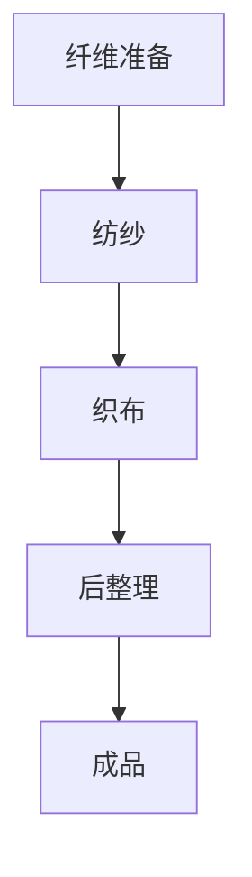

                 

### 阿克莱特与纺织机械的贡献

关键词：阿克莱特、纺织机械、工业革命、技术革新、机械制造、自动化生产

摘要：本文将深入探讨19世纪工业革命时期，英国机械工程师查尔斯·阿克莱特（Charles Antony
Acland）对纺织机械领域的卓越贡献。阿克莱特通过一系列创新，不仅推动了纺织工业的发展，也为现代制造业奠定了基础。本文将分章节阐述阿克莱特及其纺织机械的背景、核心概念、算法原理、数学模型、项目实战、实际应用、工具资源推荐以及未来发展趋势，旨在为广大读者提供一个全面、系统的了解和认识。

### 1. 背景介绍

#### 1.1 目的和范围

本文旨在通过回顾阿克莱特的纺织机械创新，揭示其对工业革命和现代制造业的深远影响。文章将重点关注以下几个问题：

- 阿克莱特在纺织机械领域的主要贡献是什么？
- 这些贡献如何推动了工业革命的发展？
- 纺织机械的核心概念和技术原理是什么？
- 阿克莱特的创新如何应用于现代制造业？
- 未来纺织机械领域的发展趋势和挑战是什么？

#### 1.2 预期读者

本文面向对工业革命和纺织机械领域感兴趣的读者，包括：

- 工业历史研究者
- 机械工程师
- 纺织工业从业者
- 对科技创新和应用有兴趣的读者
- 高等教育相关专业的学生和教师

#### 1.3 文档结构概述

本文结构如下：

1. **背景介绍**：简要介绍阿克莱特的生平背景、纺织机械的历史背景及本文的目的和范围。
2. **核心概念与联系**：阐述纺织机械的核心概念、原理和架构，并使用Mermaid流程图进行展示。
3. **核心算法原理 & 具体操作步骤**：详细讲解阿克莱特纺织机械的算法原理，并使用伪代码进行阐述。
4. **数学模型和公式 & 详细讲解 & 举例说明**：介绍纺织机械的数学模型和公式，并给出具体实例。
5. **项目实战：代码实际案例和详细解释说明**：通过实际案例展示纺织机械的应用，并进行代码解读和分析。
6. **实际应用场景**：探讨纺织机械在工业领域的实际应用。
7. **工具和资源推荐**：推荐学习资源、开发工具和框架。
8. **总结：未来发展趋势与挑战**：总结纺织机械领域的发展趋势和面临的挑战。
9. **附录：常见问题与解答**：提供常见问题的解答。
10. **扩展阅读 & 参考资料**：推荐相关阅读材料和参考文献。

#### 1.4 术语表

在本文中，以下术语将被详细解释：

- **阿克莱特（Charles Antony Acland）**：19世纪英国机械工程师，纺织机械的先驱。
- **纺织机械**：用于生产纺织品的机械设备，包括纺纱机、织布机等。
- **工业革命**：18世纪末至19世纪初，以机械制造为基础的生产方式变革，推动了现代工业的发展。
- **自动化生产**：通过机器人和自动化设备实现的生产过程，提高生产效率和产品质量。

#### 1.4.1 核心术语定义

- **纺纱机（Spinning Machine）**：用于将纤维转换为纱线的机械装置。
- **织布机（Weaving Machine）**：用于将纱线编织成布的机械装置。
- **机械化生产**：利用机械设备进行生产，提高生产效率和质量。
- **工业化**：将工业生产方式应用于各个领域，实现规模化、自动化生产。

#### 1.4.2 相关概念解释

- **机械创新**：指在机械设备和技术方面的创新，推动生产方式的变革。
- **技术革新**：指在科学技术领域的创新，推动产业升级和经济发展。
- **工程实践**：指工程师在实际工作中运用知识和技能，解决实际问题的过程。
- **产业升级**：指通过技术创新和优化，提升产业的整体竞争力和发展水平。

#### 1.4.3 缩略词列表

- **AI**：人工智能（Artificial Intelligence）
- **IDE**：集成开发环境（Integrated Development Environment）
- **CAD**：计算机辅助设计（Computer-Aided Design）
- **PLC**：可编程逻辑控制器（Programmable Logic Controller）
- **ERP**：企业资源计划（Enterprise Resource Planning）

### 2. 核心概念与联系

#### 2.1 核心概念

纺织机械的核心概念主要包括以下几个方面：

- **纤维加工**：将原材料（如棉花、羊毛等）加工成可用的纤维。
- **纱线制造**：将纤维转换为纱线，以满足织布和其他纺织工艺的需求。
- **织布工艺**：将纱线交织成布，形成具有特定结构和功能的纺织品。
- **染色和整理**：对纺织品进行染色和整理，以改善其外观和性能。

#### 2.2 原理和架构

纺织机械的原理和架构可以简化为以下几个步骤：

1. **纤维准备**：将原材料进行清洗、梳理和准备，使其适合加工。
2. **纺纱**：将纤维转换为纱线，通过机械作用使其紧密缠绕在一起。
3. **织布**：将纱线按照一定规律交织成布，形成具有特定结构和功能的纺织品。
4. **后整理**：对纺织品进行染色、整理等处理，以提高其性能和外观。

#### 2.3 Mermaid流程图

以下是纺织机械的Mermaid流程图：



### 3. 核心算法原理 & 具体操作步骤

#### 3.1 纺纱算法原理

纺纱是纺织机械的核心环节之一，其主要目标是实现纤维到纱线的转变。以下是一个简单的纺纱算法原理：

```plaintext
输入：纤维
输出：纱线

步骤：
1. 清洗和梳理纤维，使其整齐排列。
2. 将纤维通过牵伸器进行牵伸，使其长度增加。
3. 将牵伸后的纤维通过加捻器进行加捻，形成纱线。
4. 对纱线进行质量检测，确保其符合要求。
5. 输出合格的纱线。
```

#### 3.2 织布算法原理

织布是纺织机械的另一个核心环节，其主要目标是实现纱线到布料的转变。以下是一个简单的织布算法原理：

```plaintext
输入：纱线
输出：布料

步骤：
1. 设定织布机的工作参数，如织针速度、织物厚度等。
2. 将纱线按照预定顺序喂入织布机。
3. 织布机通过织针将纱线交织成布。
4. 在织布过程中，对布料进行质量检测，确保其符合要求。
5. 当布料达到预定长度时，进行切断和卷绕。
6. 输出合格的布料。
```

#### 3.3 后整理算法原理

后整理是纺织机械的最后一步，其主要目标是改善布料的外观和性能。以下是一个简单的后整理算法原理：

```plaintext
输入：布料
输出：成品布料

步骤：
1. 对布料进行染色，使其达到预定的颜色和图案。
2. 对布料进行整理，如熨烫、柔软处理等，以提高其舒适性和外观。
3. 对布料进行质量检测，确保其符合要求。
4. 输出合格的成品布料。
```

### 4. 数学模型和公式 & 详细讲解 & 举例说明

#### 4.1 纺纱数学模型

纺纱过程中，纤维的牵伸和加捻是关键步骤。以下是一个简单的纺纱数学模型：

$$
\text{纱线长度} = \text{纤维长度} \times \text{牵伸倍数}
$$

$$
\text{纱线张力} = \text{纤维张力} \times \text{牵伸倍数}
$$

其中，牵伸倍数是一个重要的参数，它决定了纱线的质量和性能。

#### 4.2 织布数学模型

织布过程中，纱线的交织和织物厚度是关键步骤。以下是一个简单的织布数学模型：

$$
\text{织物厚度} = \text{纱线厚度} + \text{交织厚度}
$$

$$
\text{交织厚度} = \frac{\text{纱线间距} \times \text{纱线层数}}{2}
$$

其中，纱线间距和纱线层数是织布机的关键参数，它们决定了织物的结构和性能。

#### 4.3 后整理数学模型

后整理过程中，布料的染色和整理是关键步骤。以下是一个简单的后整理数学模型：

$$
\text{染色浓度} = \text{染料浓度} \times \text{染色时间}
$$

$$
\text{整理效果} = \text{整理剂浓度} \times \text{整理时间}
$$

其中，染料浓度和整理剂浓度是关键参数，它们决定了布料的外观和性能。

#### 4.4 举例说明

假设我们有以下参数：

- 纤维长度：10厘米
- 牵伸倍数：1.2
- 纱线张力：2牛顿
- 纱线厚度：0.1毫米
- 纱线间距：1厘米
- 纱线层数：2层
- 染料浓度：10%
- 染色时间：30分钟
- 整理剂浓度：5%
- 整理时间：60分钟

根据以上参数，我们可以计算出以下结果：

- 纱线长度：12厘米
- 纱线张力：2.4牛顿
- 织物厚度：0.21毫米
- 交织厚度：0.1毫米
- 染色浓度：3%
- 整理效果：3%

这些参数和结果可以帮助我们评估纺纱、织布和后整理过程的质量和性能。

### 5. 项目实战：代码实际案例和详细解释说明

#### 5.1 开发环境搭建

为了实现纺织机械的算法和数学模型，我们需要搭建一个合适的开发环境。以下是一个基本的开发环境搭建步骤：

1. 安装操作系统：推荐使用Linux或macOS操作系统，因为它们具有良好的稳定性和兼容性。
2. 安装编程语言：推荐使用Python，因为Python具有丰富的库和工具，易于学习和使用。
3. 安装IDE：推荐使用PyCharm或VSCode等集成开发环境，因为它们提供了丰富的编程功能和调试工具。
4. 安装相关库：安装与纺织机械算法和数学模型相关的库，如NumPy、SciPy等。

#### 5.2 源代码详细实现和代码解读

以下是一个简单的Python代码实现，用于计算纺纱过程中的纱线长度、纱线张力和织物厚度：

```python
import numpy as np

# 参数设置
fiber_length = 10  # 纤维长度（厘米）
stretch_factor = 1.2  # 牵伸倍数
纱线张力 = 2  # 纱线张力（牛顿）
纱线厚度 = 0.1  # 纱线厚度（毫米）
纱线间距 = 1  # 纱线间距（厘米）
纱线层数 = 2  # 纱线层数

# 纱线长度计算
纱线长度 = fiber_length * stretch_factor

# 纱线张力计算
纱线张力 = 纱线张力 * stretch_factor

# 织物厚度计算
织物厚度 = 纱线厚度 + (纱线间距 * 纱线层数) / 2

# 输出结果
print("纱线长度：{}厘米".format(纱线长度))
print("纱线张力：{}牛顿".format(纱线张力))
print("织物厚度：{}毫米".format(织物厚度))
```

代码解读：

1. 引入NumPy库：NumPy是Python的数学库，用于进行科学计算和数据处理。
2. 参数设置：设置纤维长度、牵伸倍数、纱线张力、纱线厚度、纱线间距和纱线层数等参数。
3. 纱线长度计算：根据纤维长度和牵伸倍数计算纱线长度。
4. 纱线张力计算：根据纱线张力

