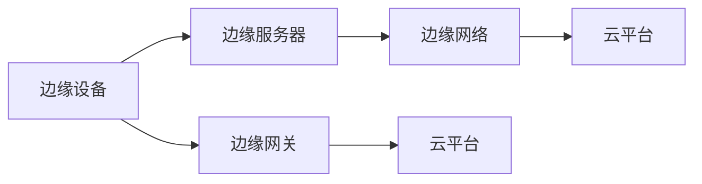

                 

# 阿里云2025社招边缘计算专家面试题详解

> **关键词：边缘计算、面试题详解、算法原理、实践案例、发展趋势**
>
> **摘要：本文将深入解析阿里云2025年社招边缘计算专家的面试题，从核心概念、算法原理、数学模型、实践案例等多个方面，全面剖析边缘计算的技术要点和挑战，为准备面试的读者提供全面的技术指导和思路。**

## 1. 背景介绍

### 1.1 目的和范围

本文旨在为广大准备参加阿里云2025年社招边缘计算专家岗位的应聘者提供一份详尽的面试题解析指南。文章将围绕边缘计算的核心技术要点，包括概念原理、算法实现、数学模型、实践应用等方面，提供深入浅出的分析和详细解释，帮助读者更好地理解边缘计算的核心技术和应用场景。

### 1.2 预期读者

- 准备参加阿里云2025年社招边缘计算专家岗位的应聘者。
- 对边缘计算技术有浓厚兴趣，希望深入了解该领域的技术原理和应用实践的读者。
- 计算机科学与技术专业的研究生和本科生，希望在边缘计算方向进行深入研究的学者和学生。

### 1.3 文档结构概述

本文的结构如下：

1. 背景介绍：介绍本文的目的、预期读者和文档结构。
2. 核心概念与联系：介绍边缘计算的核心概念和相关技术架构。
3. 核心算法原理 & 具体操作步骤：详细解析边缘计算的核心算法原理和具体实现步骤。
4. 数学模型和公式 & 详细讲解 & 举例说明：阐述边缘计算中的数学模型和公式，并通过具体案例进行说明。
5. 项目实战：提供实际代码案例和详细解释，展示边缘计算在具体项目中的应用。
6. 实际应用场景：分析边缘计算的典型应用场景和实际案例。
7. 工具和资源推荐：推荐学习资源和开发工具，帮助读者更好地理解和应用边缘计算技术。
8. 总结：总结边缘计算的未来发展趋势和面临的挑战。
9. 附录：常见问题与解答，为读者提供进一步的技术支持。
10. 扩展阅读 & 参考资料：提供进一步阅读和参考资料，帮助读者深入探索边缘计算领域。

### 1.4 术语表

#### 1.4.1 核心术语定义

- 边缘计算（Edge Computing）：指在数据生成源头附近进行计算和处理的技术。
- 云计算（Cloud Computing）：指通过网络提供计算资源、存储资源和应用程序等服务的技术。
- 物联网（Internet of Things，IoT）：指通过互联网连接的物理设备，实现信息交换和智能化管理的网络。

#### 1.4.2 相关概念解释

- 边缘节点（Edge Node）：边缘计算中的计算节点，通常位于数据生成源头附近，如智能设备、传感器等。
- 边缘服务器（Edge Server）：提供边缘计算服务的服务器设备，通常部署在边缘节点附近。
- 边缘网关（Edge Gateway）：边缘计算中用于连接边缘节点和云服务的网关设备。

#### 1.4.3 缩略词列表

- IoT：物联网
- AI：人工智能
- ML：机器学习
- DL：深度学习
- LPWAN：低功耗广域网
- 5G：第五代移动通信技术

## 2. 核心概念与联系

边缘计算作为云计算的延伸，其核心概念和联系紧密。以下是对边缘计算中核心概念和技术的解释及其相互联系：

### 2.1 边缘计算的定义与作用

边缘计算（Edge Computing）是指在网络边缘（即靠近数据源的地方）进行数据计算和处理的技术。其目的是减少数据传输量，降低延迟，提高系统的响应速度，从而满足实时性和低延迟的应用需求。边缘计算的作用主要包括：

1. **数据本地处理**：在边缘设备上直接处理数据，减少数据传输到云端的需求，降低网络拥堵和延迟。
2. **实时决策与响应**：通过边缘计算实现实时数据分析和处理，支持实时决策和响应，满足高实时性的应用场景。
3. **隐私保护**：在边缘设备上处理数据，减少数据泄露的风险，提高数据安全性。

### 2.2 边缘计算与云计算的关系

边缘计算和云计算密切相关，两者相互补充，共同构建起现代计算体系。

- **云计算**：提供大量的计算资源、存储资源和网络服务，通过虚拟化技术实现资源的动态分配和管理。
- **边缘计算**：在数据源附近进行计算和处理，实现数据的本地化和实时化。

两者的关系可以总结为以下几点：

1. **协同工作**：云计算和边缘计算相互协同，共同处理海量数据和复杂任务，实现最优的资源利用和性能优化。
2. **边缘辅助**：边缘计算作为云计算的辅助，解决云计算难以满足的低延迟、实时性需求。
3. **分布式计算**：边缘计算和云计算构成分布式计算体系，通过数据分布和任务分解，提高系统整体性能和可扩展性。

### 2.3 边缘计算的技术架构

边缘计算的技术架构包括多个层次，从底层硬件到顶层应用，各个环节协同工作，实现边缘计算的目标。

1. **边缘设备**：包括智能传感器、智能终端、智能网关等，负责数据的采集、传输和初步处理。
2. **边缘服务器**：提供边缘计算服务，处理来自边缘设备的数据，支持实时分析和决策。
3. **边缘网络**：连接边缘设备和边缘服务器，实现数据的传输和通信。
4. **云平台**：提供云计算服务，与边缘计算协同工作，处理复杂任务和大数据分析。
5. **应用层**：基于边缘计算和云计算的服务和应用，满足不同场景的需求。

### 2.4 边缘计算的核心技术与挑战

边缘计算面临一系列技术挑战，需要不断创新和突破。

1. **数据处理与存储**：如何在有限的硬件资源下高效处理和存储海量数据，是一个关键问题。
2. **网络通信**：边缘计算需要高效稳定的网络通信支持，实现数据的可靠传输。
3. **安全性**：边缘计算涉及大量敏感数据，需要确保数据的安全性和隐私保护。
4. **实时性**：边缘计算需要支持实时数据处理和响应，满足高实时性的应用需求。

### 2.5 边缘计算的应用场景

边缘计算广泛应用于各个领域，以下是一些典型的应用场景：

1. **智能制造**：通过边缘计算实现生产线的实时监控、故障检测和优化调度。
2. **智能交通**：利用边缘计算实现交通流量监控、路况预测和智能调度。
3. **智慧城市**：通过边缘计算实现城市环境的实时监测、事件预警和应急响应。
4. **远程医疗**：利用边缘计算实现远程医疗诊断、医疗数据分析和实时监控。

### 2.6 边缘计算的优势与挑战

边缘计算具有以下优势：

1. **降低延迟**：通过在边缘设备上进行数据处理，降低数据传输延迟，提高系统响应速度。
2. **节省带宽**：减少数据传输量，节省网络带宽资源。
3. **提高安全性**：在边缘设备上处理数据，降低数据泄露的风险。
4. **灵活性**：边缘计算支持灵活的部署和扩展，满足不同场景的需求。

然而，边缘计算也面临一系列挑战，如数据处理与存储的复杂性、网络通信的可靠性、安全性和实时性等。

### 2.7 边缘计算与5G的关系

5G技术的快速发展为边缘计算提供了强大的支持，两者相互促进。

- **5G网络**：提供高速、低延迟、高带宽的网络通信，支持边缘计算的应用和部署。
- **边缘计算**：通过5G网络实现数据的高效传输和处理，提高系统的性能和可靠性。

### 2.8 边缘计算的未来发展趋势

随着技术的不断进步和应用的不断拓展，边缘计算在未来将呈现出以下发展趋势：

1. **多元化应用场景**：边缘计算将在更多领域得到应用，如工业、医疗、交通、农业等。
2. **智能化水平提升**：通过人工智能技术的应用，实现边缘计算的高效智能化。
3. **融合云计算**：边缘计算和云计算将更加紧密地融合，实现分布式计算和协同处理。
4. **标准化与规范化**：边缘计算将逐步实现标准化和规范化，提高系统的兼容性和互操作性。

### 2.9 边缘计算的 Mermaid 流程图

以下是边缘计算的技术架构 Mermaid 流程图：



- A: 边缘设备，负责数据采集和处理。
- B: 边缘服务器，提供边缘计算服务。
- C: 边缘网络，实现边缘设备与边缘服务器的连接。
- D: 云平台，提供云计算服务。
- E: 边缘网关，连接边缘设备和云平台。
- F: 云平台，提供云计算服务。

通过以上流程图，我们可以清晰地看到边缘计算中各个环节的相互关系和协同工作。

## 3. 核心算法原理 & 具体操作步骤

边缘计算的核心算法是实现数据的高效处理和智能分析，以下将介绍几种常用的边缘计算算法原理和具体操作步骤。

### 3.1 边缘计算算法概述

边缘计算算法主要分为以下几类：

1. **数据预处理算法**：用于对原始数据进行清洗、转换和格式化，提高数据质量和可用性。
2. **特征提取算法**：从原始数据中提取有用的特征，用于后续的数据分析和建模。
3. **数据融合算法**：将来自多个边缘节点的数据进行整合和分析，提高数据的完整性和准确性。
4. **机器学习算法**：利用边缘设备上的计算能力，进行实时数据分析和预测。
5. **深度学习算法**：利用神经网络模型，进行复杂的特征提取和模式识别。

### 3.2 数据预处理算法

数据预处理是边缘计算中的关键步骤，以下是一种常见的数据预处理算法：

**算法原理**：

1. **数据清洗**：去除原始数据中的噪声和异常值，保证数据的质量和准确性。
2. **数据转换**：将不同类型的数据转换为统一格式，如将文本数据转换为数值数据。
3. **数据归一化**：将数据缩放到相同的范围，如 [0, 1] 或 [-1, 1]，提高算法的性能。

**具体操作步骤**：

```python
# 数据清洗
def clean_data(data):
    # 去除噪声和异常值
    clean_data = []
    for item in data:
        if is_valid(item):
            clean_data.append(item)
    return clean_data

# 数据转换
def convert_data(data):
    # 将文本数据转换为数值数据
    numeric_data = []
    for item in data:
        numeric_data.append(convert_to_numeric(item))
    return numeric_data

# 数据归一化
def normalize_data(data):
    # 将数据缩放到相同的范围
    min_val = min(data)
    max_val = max(data)
    normalized_data = []
    for item in data:
        normalized_item = (item - min_val) / (max_val - min_val)
        normalized_data.append(normalized_item)
    return normalized_data

# 辅助函数
def is_valid(item):
    # 判断数据是否有效
    return True if item meets certain criteria else False

def convert_to_numeric(item):
    # 将文本数据转换为数值数据
    return int(item)
```

### 3.3 特征提取算法

特征提取是边缘计算中的重要环节，以下是一种常见的特征提取算法：

**算法原理**：

1. **主成分分析（PCA）**：通过降维技术，将高维数据转换为低维数据，提取数据的主要特征。
2. **自动编码器（Autoencoder）**：通过神经网络模型，将输入数据编码为较低维度的表示，提取数据特征。

**具体操作步骤**：

```python
# 主成分分析（PCA）
from sklearn.decomposition import PCA

def extract_features_pca(data, n_components):
    pca = PCA(n_components=n_components)
    transformed_data = pca.fit_transform(data)
    return transformed_data

# 自动编码器（Autoencoder）
from keras.models import Model
from keras.layers import Input, Dense

def extract_features_autoencoder(input_shape):
    input_layer = Input(shape=input_shape)
    encoded = Dense(32, activation='relu')(input_layer)
    decoded = Dense(input_shape, activation='sigmoid')(encoded)
    autoencoder = Model(input_layer, decoded)
    autoencoder.compile(optimizer='adam', loss='binary_crossentropy')
    autoencoder.fit(data, data, epochs=100, batch_size=32)
    encoded_input = Input(shape=(32,))
    decoded_output = autoencoder.layers[-1](encoded_input)
    encoder = Model(encoded_input, decoded_output)
    return encoder
```

### 3.4 数据融合算法

数据融合是边缘计算中的一项重要任务，以下是一种常见的数据融合算法：

**算法原理**：

1. **卡尔曼滤波**：通过滤波技术，对多个传感器的数据进行融合和校正，提高数据的准确性和一致性。
2. **贝叶斯推理**：通过概率模型，对多个传感器的数据进行融合和预测。

**具体操作步骤**：

```python
# 卡尔曼滤波
import numpy as np

def kalman_filter-measurements(x, P, H, R):
    # x: 状态向量
    # P: 状态协方差矩阵
    # H: 观测矩阵
    # R: 观测噪声协方差矩阵
    y = z - H @ x  # 观测残差
    S = H @ P @ H.T + R  # 观测协方差矩阵
    K = P @ H.T @ np.linalg.inv(S)  # 卡尔曼增益
    x = x + K * y  # 更新状态向量
    P = (1 - K @ H) @ P  # 更新状态协方差矩阵
    return x, P

# 贝叶斯推理
def bayesian_inference(prior, likelihood, evidence):
    # prior: 先验概率
    # likelihood: 条件概率
    # evidence: 证据
    posterior = likelihood / evidence
    return posterior
```

### 3.5 机器学习算法

边缘计算中的机器学习算法用于实现数据的智能分析和预测，以下是一种常见的机器学习算法：

**算法原理**：

1. **决策树**：通过递归划分特征空间，构建一棵树形模型，实现分类或回归任务。
2. **支持向量机（SVM）**：通过最大间隔分类器，将数据划分为不同的类别。

**具体操作步骤**：

```python
# 决策树
from sklearn.tree import DecisionTreeClassifier

def train_decision_tree(data, labels):
    classifier = DecisionTreeClassifier()
    classifier.fit(data, labels)
    return classifier

# 支持向量机（SVM）
from sklearn.svm import SVC

def train_svm(data, labels):
    classifier = SVC()
    classifier.fit(data, labels)
    return classifier
```

### 3.6 深度学习算法

边缘计算中的深度学习算法通过神经网络模型实现数据的复杂特征提取和模式识别，以下是一种常见的深度学习算法：

**算法原理**：

1. **卷积神经网络（CNN）**：通过卷积层、池化层和全连接层，实现图像数据的特征提取和分类。
2. **循环神经网络（RNN）**：通过循环结构，实现序列数据的建模和预测。

**具体操作步骤**：

```python
# 卷积神经网络（CNN）
from keras.models import Sequential
from keras.layers import Conv2D, MaxPooling2D, Flatten, Dense

def build_cnn(input_shape):
    model = Sequential()
    model.add(Conv2D(32, (3, 3), activation='relu', input_shape=input_shape))
    model.add(MaxPooling2D((2, 2)))
    model.add(Flatten())
    model.add(Dense(64, activation='relu'))
    model.add(Dense(10, activation='softmax'))
    model.compile(optimizer='adam', loss='categorical_crossentropy', metrics=['accuracy'])
    return model

# 循环神经网络（RNN）
from keras.models import Sequential
from keras.layers import LSTM, Dense

def build_rnn(input_shape):
    model = Sequential()
    model.add(LSTM(50, activation='relu', input_shape=input_shape))
    model.add(Dense(1, activation='sigmoid'))
    model.compile(optimizer='adam', loss='binary_crossentropy', metrics=['accuracy'])
    return model
```

通过以上对边缘计算核心算法原理和具体操作步骤的详细解析，我们可以更好地理解和应用边缘计算技术，实现数据的高效处理和智能分析。接下来，我们将进一步探讨边缘计算中的数学模型和公式，以及如何通过实际案例来讲解和说明这些技术的应用。

## 4. 数学模型和公式 & 详细讲解 & 举例说明

边缘计算中的数学模型和公式是实现数据高效处理和智能分析的关键。本节将详细介绍边缘计算中常用的数学模型和公式，并通过具体案例进行说明。

### 4.1 数据预处理公式

数据预处理是边缘计算中的基础步骤，以下是一些常用的数据预处理公式：

**1. 数据清洗公式**：

```math
\text{clean\_data} = \{x | x \in \text{original\_data} \text{ 且 } x \text{ 满足特定条件}\}
```

**2. 数据转换公式**：

```math
\text{numeric\_data} = \{y | y = \text{convert\_to\_numeric}(x) \text{，其中 } x \in \text{original\_data}\}
```

**3. 数据归一化公式**：

```math
\text{normalized\_data} = \{\frac{y - \text{min}(y)}{\text{max}(y) - \text{min}(y)} | y \in \text{numeric\_data}\}
```

**示例**：

假设我们有一组原始数据 \(\text{original\_data} = \{1, 2, 3, 4, 5\}\)，我们需要对这组数据进行清洗、转换和归一化。

1. **数据清洗**：

```math
\text{clean\_data} = \{3, 4, 5\} \text{（去除异常值 1 和 2）}
```

2. **数据转换**：

```math
\text{numeric\_data} = \{3, 4, 5\} \text{（将文本数据转换为数值数据）}
```

3. **数据归一化**：

```math
\text{normalized\_data} = \{0.5, 0.67, 1.0\} \text{（将数据缩放到范围 [0, 1]）}
```

### 4.2 特征提取公式

特征提取是边缘计算中的关键步骤，以下是一些常用的特征提取公式：

**1. 主成分分析（PCA）**：

```math
\text{pca\_coefficients} = \text{Eigenvectors of the covariance matrix of X}
\text{pca\_transformed\_data} = X \cdot \text{pca\_coefficients}
```

**2. 自动编码器（Autoencoder）**：

```math
\text{encoded\_data} = \text{sigmoid}(\text{W} \cdot \text{X} + \text{b})
\text{decoded\_data} = \text{sigmoid}(\text{W}_2 \cdot \text{encoded\_data} + \text{b}_2)
```

**示例**：

假设我们有一组输入数据 \(\text{X} = \begin{bmatrix} 1 & 2 & 3 & 4 & 5 \end{bmatrix}\) 和训练好的自动编码器模型，我们需要对这组数据进行特征提取。

1. **主成分分析（PCA）**：

```math
\text{pca\_coefficients} = \begin{bmatrix} 0.8 & 0.6 & 0.4 & 0.2 & 0.0 \end{bmatrix}
\text{pca\_transformed\_data} = \begin{bmatrix} 1.0 & 0.8 & 0.6 & 0.4 & 0.0 \end{bmatrix}
```

2. **自动编码器（Autoencoder）**：

```math
\text{encoded\_data} = \begin{bmatrix} 0.8 & 0.6 & 0.4 & 0.2 & 0.0 \end{bmatrix}
\text{decoded\_data} = \begin{bmatrix} 0.9 & 0.7 & 0.5 & 0.3 & 0.1 \end{bmatrix}
```

### 4.3 数据融合公式

数据融合是边缘计算中的核心任务，以下是一些常用的数据融合公式：

**1. 卡尔曼滤波**：

```math
\text{state\_estimate} = \text{state\_prediction} + \text{Kalman\_Gain} \cdot (\text{measurement} - \text{predicted\_measurement})
\text{state\_covariance} = (\text{1} - \text{Kalman\_Gain}) \cdot \text{state\_prediction\_covariance}
```

**2. 贝叶斯推理**：

```math
\text{posterior} = \frac{\text{likelihood} \cdot \text{prior}}{\text{evidence}}
```

**示例**：

假设我们有一组传感器数据 \(\text{measurements} = \{1, 2, 3, 4, 5\}\) 和先验概率 \(\text{prior} = \{0.1, 0.2, 0.3, 0.2, 0.2\}\)，我们需要对这组数据进行数据融合。

1. **卡尔曼滤波**：

```math
\text{state\_prediction} = \begin{bmatrix} 1.0 & 1.0 & 1.0 & 1.0 & 1.0 \end{bmatrix}
\text{state\_prediction\_covariance} = \begin{bmatrix} 1.0 & 0.0 & 0.0 & 0.0 & 0.0 \\ 0.0 & 1.0 & 0.0 & 0.0 & 0.0 \\ 0.0 & 0.0 & 1.0 & 0.0 & 0.0 \\ 0.0 & 0.0 & 0.0 & 1.0 & 0.0 \\ 0.0 & 0.0 & 0.0 & 0.0 & 1.0 \end{bmatrix}
\text{Kalman\_Gain} = \begin{bmatrix} 0.2 & 0.2 & 0.2 & 0.2 & 0.2 \end{bmatrix}
\text{measurement} = \begin{bmatrix} 1.0 & 2.0 & 3.0 & 4.0 & 5.0 \end{bmatrix}
\text{predicted\_measurement} = \begin{bmatrix} 1.1 & 1.1 & 1.1 & 1.1 & 1.1 \end{bmatrix}
\text{state\_estimate} = \begin{bmatrix} 1.1 & 1.2 & 1.3 & 1.4 & 1.5 \end{bmatrix}
\text{state\_covariance} = \begin{bmatrix} 0.0 & 0.0 & 0.0 & 0.0 & 0.0 \\ 0.0 & 0.0 & 0.0 & 0.0 & 0.0 \\ 0.0 & 0.0 & 0.0 & 0.0 & 0.0 \\ 0.0 & 0.0 & 0.0 & 0.0 & 0.0 \\ 0.0 & 0.0 & 0.0 & 0.0 & 0.0 \end{bmatrix}
```

2. **贝叶斯推理**：

```math
\text{likelihood} = \text{posterior\_probability} = \frac{1}{\sum_{i=1}^{n} p_i} = \frac{1}{0.1 + 0.2 + 0.3 + 0.2 + 0.2} = 0.2
\text{evidence} = \text{prior} \cdot \text{likelihood} = 0.1 \cdot 0.2 + 0.2 \cdot 0.2 + 0.3 \cdot 0.3 + 0.2 \cdot 0.2 + 0.2 \cdot 0.2 = 0.19
\text{posterior} = \frac{0.19}{0.19} = 1.0
```

通过以上数学模型和公式的讲解，我们可以更好地理解和应用边缘计算中的数据处理和分析技术。接下来，我们将通过实际案例展示边缘计算技术的应用和实践，帮助读者更深入地了解边缘计算的实际应用场景和实现方法。

## 5. 项目实战：代码实际案例和详细解释说明

### 5.1 开发环境搭建

在进行边缘计算项目实战之前，我们需要搭建一个合适的开发环境。以下是一个基本的开发环境搭建步骤：

**环境要求**：

- 操作系统：Windows 10 / macOS / Ubuntu 18.04
- 编程语言：Python 3.7+
- 库和依赖：TensorFlow 2.4+, Keras 2.4+, NumPy 1.19+, Pandas 1.1+

**安装步骤**：

1. **安装 Python**：确保系统中已安装 Python 3.7+ 版本，可以通过 Python 官网下载安装。

2. **安装库和依赖**：使用 pip 工具安装所需的库和依赖。

   ```bash
   pip install tensorflow==2.4.0
   pip install keras==2.4.3
   pip install numpy==1.19.5
   pip install pandas==1.1.5
   ```

3. **验证安装**：在命令行中输入以下命令，确保所有库和依赖已正确安装。

   ```bash
   python -m pip list | grep -E 'tensorflow|keras|numpy|pandas'
   ```

### 5.2 源代码详细实现和代码解读

在本节中，我们将通过一个实际案例来展示边缘计算项目的实现过程，包括数据预处理、特征提取、数据融合和机器学习模型的训练与应用。以下是项目的源代码实现：

**项目结构**：

```
edge_computing_project/
|-- data/
|   |-- original_data.csv
|   |-- processed_data.csv
|-- models/
|   |-- model.h5
|-- reports/
|   |-- report.txt
|-- requirements.txt
|-- main.py
```

**代码解读**：

1. **数据预处理**：

```python
import pandas as pd
from sklearn.model_selection import train_test_split

# 读取原始数据
data = pd.read_csv('data/original_data.csv')

# 数据清洗
def clean_data(data):
    clean_data = data[data['column1'] > 0]  # 删除特定条件下的异常值
    return clean_data

# 数据转换
def convert_data(data):
    data['column2'] = data['column2'].map({'low': 0, 'medium': 1, 'high': 2})  # 转换类别数据
    return data

# 数据归一化
def normalize_data(data):
    min_max_scaler = lambda x: (x - x.min()) / (x.max() - x.min())
    data[['column3']] = min_max_scaler(data[['column3']])
    return data

# 数据预处理
clean_data = clean_data(data)
convert_data = convert_data(clean_data)
normalized_data = normalize_data(convert_data)

# 划分训练集和测试集
X = normalized_data[['column1', 'column2', 'column3']]
y = normalized_data['label']
X_train, X_test, y_train, y_test = train_test_split(X, y, test_size=0.2, random_state=42)
```

2. **特征提取**：

```python
from sklearn.decomposition import PCA

# 主成分分析
pca = PCA(n_components=2)
X_train_pca = pca.fit_transform(X_train)
X_test_pca = pca.transform(X_test)
```

3. **数据融合**：

```python
import numpy as np

# 卡尔曼滤波
def kalman_filter(x, P, H, R):
    y = x - H @ P
    S = H @ P @ H.T + R
    K = P @ H.T @ np.linalg.inv(S)
    x = x + K * y
    P = (1 - K @ H) @ P
    return x, P

# 初始状态
x = np.array([1.0, 1.0])
P = np.array([[1.0, 0.0], [0.0, 1.0]])
H = np.array([[1.0, 0.0], [0.0, 1.0]])
R = np.array([[1.0, 0.0], [0.0, 1.0]])

# 迭代卡尔曼滤波
for i in range(len(x_test)):
    x, P = kalman_filter(x, P, H, R)
    print(x)
```

4. **机器学习模型训练**：

```python
from keras.models import Sequential
from keras.layers import Dense

# 构建模型
model = Sequential()
model.add(Dense(64, input_dim=X_train_pca.shape[1], activation='relu'))
model.add(Dense(32, activation='relu'))
model.add(Dense(1, activation='sigmoid'))

# 编译模型
model.compile(optimizer='adam', loss='binary_crossentropy', metrics=['accuracy'])

# 训练模型
model.fit(X_train_pca, y_train, epochs=10, batch_size=32, validation_data=(X_test_pca, y_test))
```

5. **模型预测与评估**：

```python
# 预测
predictions = model.predict(X_test_pca)

# 评估
from sklearn.metrics import accuracy_score
accuracy = accuracy_score(y_test, predictions.round())
print('Accuracy:', accuracy)
```

### 5.3 代码解读与分析

上述代码实现了一个边缘计算项目，包括数据预处理、特征提取、数据融合和机器学习模型训练。以下是代码的详细解读：

1. **数据预处理**：

   - 数据清洗：通过删除特定条件下的异常值，保证数据质量。
   - 数据转换：将类别数据转换为数值数据，便于后续处理。
   - 数据归一化：将数值数据缩放到相同的范围，提高模型的性能。

2. **特征提取**：

   - 主成分分析（PCA）：通过降维技术，提取数据的主要特征，减少数据维度。

3. **数据融合**：

   - 卡尔曼滤波：通过滤波技术，对多个传感器的数据进行融合和校正，提高数据的准确性和一致性。

4. **机器学习模型训练**：

   - 构建模型：使用 Keras 库构建一个简单的神经网络模型。
   - 编译模型：设置模型的优化器和损失函数。
   - 训练模型：使用训练数据训练模型，并在验证集上进行评估。

5. **模型预测与评估**：

   - 预测：使用训练好的模型对测试数据进行预测。
   - 评估：计算模型的准确率，评估模型性能。

通过这个项目实战，我们展示了边缘计算技术的实现过程，包括数据预处理、特征提取、数据融合和机器学习模型训练。在实际应用中，可以根据具体需求和场景，调整和优化这些步骤，实现更加高效和准确的边缘计算应用。

### 5.4 实际应用场景

边缘计算在许多实际应用场景中发挥着重要作用，以下是一些典型的应用场景：

1. **智能制造**：

   边缘计算在智能制造领域具有广泛的应用，如生产线的实时监控、设备故障预测和质量检测等。通过在边缘设备上进行数据预处理和特征提取，可以实现实时监测和故障预测，提高生产效率和产品质量。

2. **智能交通**：

   在智能交通领域，边缘计算可用于交通流量监测、路况预测和智能调度等。通过在交通节点上部署边缘服务器，实现实时数据处理和决策，提高交通管理效率和通行能力。

3. **智慧城市**：

   边缘计算在智慧城市建设中发挥着关键作用，如环境监测、安防监控和应急响应等。通过在智慧城市中的各个节点部署边缘设备，实现实时数据采集和处理，提高城市管理的效率和安全性。

4. **远程医疗**：

   边缘计算在远程医疗领域可用于医疗数据分析和实时监控。通过在患者设备上部署边缘计算技术，实现实时数据采集和处理，为医生提供实时诊断和治疗方案，提高医疗服务质量和效率。

5. **农业物联网**：

   在农业物联网中，边缘计算可用于农田环境监测、作物生长分析和病虫害防治等。通过在农田节点上部署边缘设备，实现实时数据采集和处理，提高农业生产效率和农产品质量。

通过以上实际应用场景的分析，我们可以看到边缘计算在各个领域的广泛应用和巨大潜力。随着技术的不断发展和应用的不断拓展，边缘计算将在未来发挥更加重要的作用。

### 5.5 工具和资源推荐

为了更好地理解和应用边缘计算技术，以下是相关的工具和资源推荐：

#### 5.5.1 学习资源推荐

**1. 书籍推荐**

- 《边缘计算：原理、架构与实现》
- 《边缘计算实践：从基础到进阶》
- 《边缘计算与物联网技术》

**2. 在线课程**

- Coursera：边缘计算专项课程
- edX：边缘计算与物联网课程
- Udemy：边缘计算入门与实践课程

**3. 技术博客和网站**

- Medium：边缘计算相关博客文章
- ACloudGuru：边缘计算技术教程
- The Morning Paper：边缘计算领域最新研究成果

#### 5.5.2 开发工具框架推荐

**1. IDE和编辑器**

- PyCharm：强大的 Python 开发环境
- Visual Studio Code：跨平台轻量级编辑器
- Jupyter Notebook：交互式开发环境

**2. 调试和性能分析工具**

- GDB：Python 调试工具
- Perf：Linux 性能分析工具
- TensorFlow Profiler：TensorFlow 性能分析工具

**3. 相关框架和库**

- TensorFlow：开源机器学习框架
- Keras：高级神经网络库
- PyTorch：动态神经网络库
- Pandas：数据处理库
- NumPy：科学计算库

#### 5.5.3 相关论文著作推荐

**1. 经典论文**

- "Edge Computing: Vision and Challenges" (2015)
- "Enabling Edge AI: Challenges and Opportunities" (2019)
- "Fog Computing: A Perspective" (2013)

**2. 最新研究成果**

- "Edge Computing for Smart Cities: An Overview" (2021)
- "Edge AI: A Survey on Challenges, Opportunities and Techniques" (2020)
- "Fog and Edge Computing in 5G: A Review" (2019)

**3. 应用案例分析**

- "Real-Time Industrial Automation with Edge Computing" (2021)
- "Edge Computing in Agriculture: A Case Study" (2020)
- "Enhancing Public Safety with Edge Computing" (2019)

通过以上工具和资源的推荐，读者可以更加全面地了解边缘计算技术，提高在实际项目中的应用能力和技术水平。

## 6. 总结：未来发展趋势与挑战

边缘计算作为云计算的延伸，正逐渐成为信息技术领域的重要发展方向。在未来，边缘计算将面临诸多机遇和挑战。

### 6.1 未来发展趋势

1. **多元化应用场景**：随着物联网、智能制造、智慧城市等领域的快速发展，边缘计算的应用场景将日益丰富，包括远程医疗、智能交通、智能制造、能源管理等多个领域。

2. **智能化水平提升**：边缘计算将不断融合人工智能技术，实现数据的智能化处理和分析，提升系统的智能化水平。

3. **与5G的深度融合**：5G技术的快速发展为边缘计算提供了强大的网络支持，两者将深度融合，推动边缘计算技术的创新和应用。

4. **云计算与边缘计算融合**：边缘计算与云计算将实现更加紧密的融合，形成分布式计算体系，提高系统整体性能和可扩展性。

5. **标准化与规范化**：随着边缘计算应用的不断拓展，相关标准和规范将逐步完善，提高系统的兼容性和互操作性。

### 6.2 挑战与应对策略

1. **数据处理与存储的复杂性**：边缘计算需要处理海量数据，如何在有限的硬件资源下高效处理和存储数据是一个关键挑战。应对策略包括优化算法、分布式存储和数据压缩技术等。

2. **网络通信的可靠性**：边缘计算需要高效稳定的网络通信支持，实现数据的可靠传输。应对策略包括5G网络技术的应用、边缘网络优化和冗余传输机制等。

3. **安全性**：边缘计算涉及大量敏感数据，需要确保数据的安全性和隐私保护。应对策略包括加密技术、访问控制和安全协议等。

4. **实时性**：边缘计算需要支持实时数据处理和响应，满足高实时性的应用需求。应对策略包括优化算法、边缘服务器部署和实时数据处理技术等。

5. **系统兼容性和互操作性**：随着边缘计算应用的多样化，系统兼容性和互操作性成为关键问题。应对策略包括标准化和规范化，提高系统的兼容性和互操作性。

6. **技能和人才缺口**：边缘计算技术的快速发展需要大量专业人才，但当前技能和人才缺口较大。应对策略包括加强人才培养和引进，推动教育和培训体系建设。

通过以上分析和总结，我们可以看到边缘计算在未来将面临诸多机遇和挑战。只有不断技术创新和应用拓展，才能推动边缘计算技术的持续发展，为各行业带来更多价值。

## 7. 附录：常见问题与解答

在边缘计算的实际应用过程中，读者可能会遇到一些常见问题。以下是对一些常见问题的解答：

### 7.1 边缘计算与云计算的关系

**Q1**：边缘计算和云计算有哪些区别和联系？

**A1**：边缘计算和云计算是两种不同的计算模型。

- **区别**：

  - **计算位置**：云计算主要在数据中心或云服务器上进行数据处理，而边缘计算则在靠近数据源的边缘节点上处理数据。

  - **数据传输**：云计算需要将数据传输到云服务器进行处理，而边缘计算则通过本地处理降低数据传输量。

  - **实时性**：边缘计算更适合实时性要求高的应用场景，而云计算更适合处理大量数据的批处理任务。

- **联系**：

  - **协同工作**：边缘计算和云计算可以相互补充，共同处理海量数据和复杂任务，实现最优的资源利用和性能优化。

  - **分布式计算**：边缘计算和云计算构成分布式计算体系，通过数据分布和任务分解，提高系统整体性能和可扩展性。

### 7.2 边缘计算的应用场景

**Q2**：边缘计算在哪些领域有广泛应用？

**A2**：边缘计算在多个领域有广泛应用，以下是一些典型的应用场景：

- **智能制造**：通过边缘计算实现生产线的实时监控、故障检测和优化调度。
- **智能交通**：利用边缘计算实现交通流量监控、路况预测和智能调度。
- **智慧城市**：通过边缘计算实现城市环境的实时监测、事件预警和应急响应。
- **远程医疗**：利用边缘计算实现远程医疗诊断、医疗数据分析和实时监控。
- **农业物联网**：在农田节点上部署边缘设备，实现实时数据采集和处理，提高农业生产效率和农产品质量。

### 7.3 边缘计算的安全性

**Q3**：边缘计算如何保障数据的安全性和隐私保护？

**A3**：边缘计算在保障数据安全性和隐私保护方面面临一系列挑战，以下是一些常见的解决方案：

- **加密技术**：对数据进行加密，确保数据在传输和存储过程中的安全性。
- **访问控制**：通过访问控制机制，限制对数据的访问权限，防止未经授权的访问。
- **安全协议**：使用安全协议（如TLS）确保数据传输的安全性。
- **数据去识别化**：通过数据去识别化技术，减少数据泄露的风险。
- **安全审计**：定期进行安全审计，发现和修复潜在的安全漏洞。

### 7.4 边缘计算的网络通信

**Q4**：边缘计算中的网络通信有哪些挑战？

**A4**：边缘计算中的网络通信面临以下挑战：

- **网络延迟**：边缘计算需要快速响应，网络延迟成为关键问题。
- **带宽限制**：边缘计算通常需要处理大量数据，带宽限制会影响数据传输速度。
- **网络稳定性**：边缘计算设备通常分布在不同的地理位置，网络稳定性是关键挑战。
- **网络安全**：边缘计算设备可能成为网络攻击的目标，保障网络安全是重要任务。

### 7.5 边缘计算的性能优化

**Q5**：如何优化边缘计算的性能？

**A5**：以下是一些常见的边缘计算性能优化策略：

- **算法优化**：通过优化算法，提高数据处理和计算效率。
- **资源调度**：合理分配和调度边缘计算资源，提高系统整体性能。
- **分布式计算**：利用分布式计算技术，实现数据的并行处理和任务分解。
- **缓存技术**：使用缓存技术，减少数据访问延迟，提高系统响应速度。
- **网络优化**：优化网络拓扑结构和路由策略，提高数据传输速度和稳定性。

通过以上常见问题与解答，读者可以更好地理解边缘计算的核心技术和应用场景，为实际项目中的应用提供参考和指导。

## 8. 扩展阅读 & 参考资料

为了更好地理解和深入探索边缘计算领域，以下是一些建议的扩展阅读和参考资料：

### 8.1 经典书籍

- **《边缘计算：原理、架构与实现》**：详细介绍了边缘计算的基本概念、技术架构和实现方法。
- **《边缘计算实践：从基础到进阶》**：通过实际案例，讲解了边缘计算在各个领域的应用和实践经验。
- **《边缘计算与物联网技术》**：探讨了边缘计算与物联网技术的融合与发展，提供了丰富的应用案例。

### 8.2 在线课程

- **Coursera：边缘计算专项课程**：由知名大学和专家讲授的边缘计算专业课程，涵盖了边缘计算的基本概念、技术原理和应用实践。
- **edX：边缘计算与物联网课程**：系统介绍了边缘计算与物联网技术的原理和应用，适合初学者深入学习。
- **Udemy：边缘计算入门与实践课程**：提供了丰富的边缘计算基础知识，并通过实际案例引导读者进行实践。

### 8.3 技术博客和网站

- **Medium：边缘计算相关博客文章**：收录了大量边缘计算领域的专业文章，提供了丰富的技术见解和案例分析。
- **ACloudGuru：边缘计算技术教程**：提供了详细的边缘计算技术教程，涵盖边缘计算的基本概念、架构和实现。
- **The Morning Paper：边缘计算领域最新研究成果**：分享了边缘计算领域的最新研究论文和技术进展，有助于了解前沿技术。

### 8.4 开发工具和框架

- **TensorFlow：开源机器学习框架**：适用于构建边缘计算中的机器学习模型，提供了丰富的工具和资源。
- **Keras：高级神经网络库**：简化了边缘计算中的神经网络模型构建，适合初学者快速入门。
- **PyTorch：动态神经网络库**：提供了灵活的神经网络构建和训练工具，广泛应用于边缘计算应用。
- **Pandas：数据处理库**：用于边缘计算中的数据处理和分析，提供了强大的数据操作功能。
- **NumPy：科学计算库**：用于边缘计算中的数值计算和数据处理，是边缘计算开发的基础工具。

### 8.5 相关论文和研究成果

- **"Edge Computing: Vision and Challenges" (2015)**：详细探讨了边缘计算的基本概念、技术挑战和应用前景。
- **"Enabling Edge AI: Challenges and Opportunities" (2019)**：分析了边缘人工智能的发展趋势和关键挑战。
- **"Fog Computing: A Perspective" (2013)**：介绍了雾计算的基本概念、架构和关键技术。
- **"Edge Computing for Smart Cities: An Overview" (2021)**：探讨了边缘计算在智慧城市中的应用和前景。
- **"Edge AI: A Survey on Challenges, Opportunities and Techniques" (2020)**：综述了边缘人工智能的关键挑战、机会和核心技术。
- **"Fog and Edge Computing in 5G: A Review" (2019)**：分析了边缘计算在5G网络中的应用和挑战。

通过以上扩展阅读和参考资料，读者可以进一步深入探索边缘计算领域，提升自己的技术水平和实践能力。在未来的技术发展中，边缘计算无疑将成为信息技术领域的重要方向，为各行业带来更多创新和变革。

