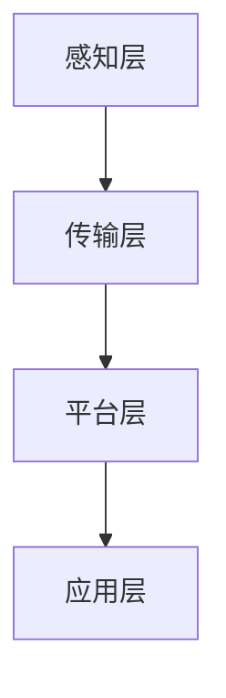

                 

# 2024阿里巴巴智慧农业社招面试真题汇总及其解答

## 概述

> **关键词**：阿里巴巴，智慧农业，社招面试，真题汇总，解答

**摘要**：本文旨在汇总2024年阿里巴巴智慧农业社招面试的真题，并提供详细解答。文章将涵盖智慧农业的核心概念、技术架构、算法原理、数学模型以及实际应用场景，旨在为求职者和行业从业者提供有价值的参考。文章结构清晰，逻辑严密，以帮助读者更好地理解和应对面试挑战。

## 1. 背景介绍

### 1.1 目的和范围

本文的主要目的是为2024年阿里巴巴智慧农业社招面试的考生提供一份详尽的真题汇总及解答。文章将聚焦于智慧农业领域的核心技术，包括物联网、大数据、人工智能等，旨在帮助考生深入了解该领域的基本概念、技术原理和应用场景，从而提高面试成功率。

### 1.2 预期读者

本文适合以下读者群体：

- 智慧农业领域的求职者
- 对智慧农业技术感兴趣的从业者
- 计算机科学和信息技术专业的学生

### 1.3 文档结构概述

本文分为以下几个部分：

- **背景介绍**：介绍文章的目的、范围和预期读者。
- **核心概念与联系**：阐述智慧农业的核心概念和技术架构。
- **核心算法原理 & 具体操作步骤**：详细讲解智慧农业领域的关键算法。
- **数学模型和公式 & 详细讲解 & 举例说明**：介绍与智慧农业相关的数学模型和公式。
- **项目实战：代码实际案例和详细解释说明**：提供实际项目案例，展示技术应用。
- **实际应用场景**：分析智慧农业技术的实际应用场景。
- **工具和资源推荐**：推荐学习资源和开发工具。
- **总结：未来发展趋势与挑战**：探讨智慧农业领域的未来发展趋势和挑战。
- **附录：常见问题与解答**：回答读者可能关心的问题。
- **扩展阅读 & 参考资料**：提供进一步学习和研究的参考资料。

### 1.4 术语表

#### 1.4.1 核心术语定义

- **智慧农业**：结合物联网、大数据、人工智能等技术，实现对农业生产过程的智能化管理和优化。
- **物联网**：通过传感器、通信网络等技术，实现物理世界与数字世界的互联互通。
- **大数据**：海量数据的存储、处理和分析技术。
- **人工智能**：模拟人类智能的计算机技术。

#### 1.4.2 相关概念解释

- **精准农业**：通过传感器和卫星遥感技术，对农田进行精细化的管理。
- **农业物联网**：将传感器、通信网络和智能控制系统应用于农业生产过程。
- **农业大数据**：对农业生产过程中的数据进行收集、存储、处理和分析。

#### 1.4.3 缩略词列表

- **IoT**：物联网
- **AI**：人工智能
- **Big Data**：大数据
- **IoT-Ag**：农业物联网

## 2. 核心概念与联系

### 2.1 核心概念

智慧农业的核心概念包括物联网、大数据和人工智能。这些技术相互关联，共同构成了智慧农业的技术体系。

#### 2.1.1 物联网（IoT）

物联网是智慧农业的基础，它通过传感器、通信网络和智能控制系统，实现对农业生产过程的实时监测和远程控制。物联网技术主要包括以下几个方面：

- **传感器技术**：用于测量土壤湿度、温度、光照强度等环境参数。
- **通信网络**：包括有线和无线通信网络，如Wi-Fi、蓝牙、4G/5G等。
- **智能控制系统**：通过物联网平台，实现农业生产过程的自动化和智能化。

#### 2.1.2 大数据（Big Data）

大数据技术是智慧农业的数据基础，它通过对农业生产过程中的海量数据进行分析，提取有价值的信息，为农业生产提供决策支持。大数据技术主要包括以下几个方面：

- **数据采集**：通过传感器、无人机等设备，对农业生产过程进行数据采集。
- **数据存储**：使用大数据存储技术，如Hadoop、Spark等，对海量数据进行存储和管理。
- **数据分析**：使用数据挖掘、机器学习等技术，对数据进行深入分析，提取有价值的信息。

#### 2.1.3 人工智能（AI）

人工智能是智慧农业的智能引擎，它通过对大数据的分析和处理，实现对农业生产过程的智能化管理和优化。人工智能技术主要包括以下几个方面：

- **机器学习**：通过训练模型，实现数据的自动分析和预测。
- **深度学习**：通过神经网络模型，实现对复杂数据的分析和处理。
- **自然语言处理**：实现对农业生产过程中的文本数据进行分析和理解。

### 2.2 技术架构

智慧农业的技术架构主要包括感知层、传输层、平台层和应用层。

#### 2.2.1 感知层

感知层是智慧农业的基础，它通过传感器、无人机等设备，对农业生产过程中的环境参数、作物生长状态等进行实时监测。

#### 2.2.2 传输层

传输层负责将感知层采集到的数据传输到平台层。传输层可以使用有线和无线通信技术，如Wi-Fi、蓝牙、4G/5G等。

#### 2.2.3 平台层

平台层是智慧农业的核心，它通过大数据和人工智能技术，对采集到的数据进行存储、处理和分析，为农业生产提供决策支持。

#### 2.2.4 应用层

应用层是智慧农业的最终体现，它通过农业生产管理系统、农业大数据平台等，实现对农业生产过程的智能化管理和优化。

### 2.3 Mermaid 流程图



## 3. 核心算法原理 & 具体操作步骤

### 3.1 算法原理

智慧农业的核心算法主要包括以下几个方面：

- **数据采集算法**：用于采集农业生产过程中的环境参数、作物生长状态等数据。
- **数据预处理算法**：用于对采集到的数据进行清洗、归一化等处理，为后续分析做准备。
- **数据分析算法**：用于对采集到的数据进行分析，提取有价值的信息。
- **预测算法**：用于预测作物生长趋势、产量等。

### 3.2 具体操作步骤

以下是智慧农业核心算法的具体操作步骤：

#### 3.2.1 数据采集算法

1. 选择合适的传感器，如土壤湿度传感器、温度传感器等。
2. 连接传感器，确保数据采集的准确性。
3. 设置传感器采集数据的频率和阈值。
4. 将采集到的数据存储到数据库中。

#### 3.2.2 数据预处理算法

1. 数据清洗：去除数据中的异常值和噪声。
2. 数据归一化：将不同量纲的数据转换为同一量纲，便于后续分析。
3. 数据转换：将数据转换为适合机器学习的格式。

#### 3.2.3 数据分析算法

1. 数据可视化：使用图表、地图等方式展示数据。
2. 特征提取：从原始数据中提取有价值的信息，如趋势、周期等。
3. 数据分析：使用统计方法、机器学习方法等对数据进行深入分析。

#### 3.2.4 预测算法

1. 选择合适的预测模型，如线性回归、神经网络等。
2. 使用训练数据对模型进行训练。
3. 使用测试数据对模型进行评估。
4. 使用模型对未来的作物生长趋势、产量等进行预测。

### 3.3 伪代码

```python
# 数据采集算法
def data_collection():
    sensors = ["soil_moisture", "temperature", "light_intensity"]
    for sensor in sensors:
        data = read_sensor(sensor)
        store_data(data)

# 数据预处理算法
def data_preprocessing(data):
    cleaned_data = remove_noise(data)
    normalized_data = normalize(data)
    return normalized_data

# 数据分析算法
def data_analysis(data):
    visualized_data = visualize(data)
    features = extract_features(data)
    analyzed_data = analyze(data)
    return analyzed_data

# 预测算法
def prediction(data):
    model = train_model(data)
    predictions = model.predict(data)
    return predictions
```

## 4. 数学模型和公式 & 详细讲解 & 举例说明

### 4.1 数学模型

智慧农业中的数学模型主要包括以下几个方面：

- **回归模型**：用于预测作物产量、生长状态等。
- **分类模型**：用于分类作物病虫害、土壤类型等。
- **聚类模型**：用于对作物生长数据进行分析和分类。
- **时间序列模型**：用于预测作物生长趋势和产量。

### 4.2 公式

以下是智慧农业中常用的数学模型和公式：

- **线性回归模型**：

  $$ y = wx + b $$

  其中，$y$ 为因变量，$x$ 为自变量，$w$ 为权重，$b$ 为偏置。

- **分类模型**：

  $$ P(y = 1) = \frac{1}{1 + e^{-(wx + b)}} $$

  其中，$P(y = 1)$ 为因变量为1的概率。

- **聚类模型**：

  $$ d(i, j) = \sqrt{\sum_{k=1}^{n} (x_{ik} - x_{jk})^2} $$

  其中，$d(i, j)$ 为点$i$和点$j$之间的距离。

- **时间序列模型**：

  $$ y_t = \alpha y_{t-1} + \epsilon_t $$

  其中，$y_t$ 为第$t$时刻的因变量，$\alpha$ 为自回归系数，$\epsilon_t$ 为误差项。

### 4.3 详细讲解

以下是智慧农业中常用的数学模型和公式的详细讲解：

- **线性回归模型**：

  线性回归模型是一种最常见的预测模型，它通过线性关系预测因变量。在实际应用中，我们通常使用最小二乘法来估计模型的权重和偏置。

- **分类模型**：

  分类模型用于对数据进行分类，它通过计算因变量为1的概率来预测分类结果。在实际应用中，我们通常使用逻辑回归模型。

- **聚类模型**：

  聚类模型用于对数据进行聚类分析，它通过计算点之间的距离来划分不同的类别。在实际应用中，我们通常使用K均值聚类算法。

- **时间序列模型**：

  时间序列模型用于预测时间序列数据的趋势和周期性变化，它通过自回归关系来建模。

### 4.4 举例说明

以下是智慧农业中数学模型和公式的应用实例：

- **线性回归模型**：

  假设我们想要预测作物的产量，根据历史数据，我们建立了一个线性回归模型。通过最小二乘法，我们得到了模型权重和偏置，如下：

  $$ y = 2x + 1 $$

  其中，$x$ 为作物生长的参数，$y$ 为作物产量。

  我们可以使用这个模型来预测未来某一时刻的作物产量。

- **分类模型**：

  假设我们想要对作物病虫害进行分类，根据历史数据，我们建立了一个逻辑回归模型。通过训练，我们得到了模型权重和偏置，如下：

  $$ P(y = 1) = \frac{1}{1 + e^{-(wx + b)}} $$

  其中，$w$ 为权重，$b$ 为偏置。

  我们可以使用这个模型来判断作物是否受到病虫害的影响。

- **聚类模型**：

  假设我们对作物的生长数据进行分析，根据数据分布，我们使用K均值聚类算法将数据分为不同的类别。通过聚类，我们得到了每个类别的特征，如下：

  $$ d(i, j) = \sqrt{\sum_{k=1}^{n} (x_{ik} - x_{jk})^2} $$

  其中，$i$ 和 $j$ 分别为不同类别的点。

  我们可以使用这个模型来对作物生长数据进行分类。

- **时间序列模型**：

  假设我们想要预测作物的生长趋势，根据历史数据，我们建立了一个时间序列模型。通过自回归关系，我们得到了模型的自回归系数，如下：

  $$ y_t = \alpha y_{t-1} + \epsilon_t $$

  其中，$\alpha$ 为自回归系数。

  我们可以使用这个模型来预测未来某一时刻的作物生长状态。

## 5. 项目实战：代码实际案例和详细解释说明

### 5.1 开发环境搭建

在开始项目实战之前，我们需要搭建一个合适的开发环境。以下是一个基本的开发环境搭建步骤：

1. 安装Python：在官方网站下载并安装Python，确保版本不低于3.6。
2. 安装Jupyter Notebook：通过pip命令安装Jupyter Notebook。
3. 安装必要的库：使用pip命令安装以下库：numpy、pandas、matplotlib、scikit-learn等。

### 5.2 源代码详细实现和代码解读

以下是智慧农业项目的一个简单示例，使用Python和scikit-learn库实现一个线性回归模型来预测作物产量。

```python
# 导入必要的库
import numpy as np
import pandas as pd
from sklearn.linear_model import LinearRegression
from sklearn.model_selection import train_test_split
from sklearn.metrics import mean_squared_error

# 加载数据
data = pd.read_csv("agriculture_data.csv")
X = data["growth_param"].values.reshape(-1, 1)
y = data["yield"].values

# 划分训练集和测试集
X_train, X_test, y_train, y_test = train_test_split(X, y, test_size=0.2, random_state=42)

# 建立线性回归模型
model = LinearRegression()
model.fit(X_train, y_train)

# 预测测试集
y_pred = model.predict(X_test)

# 评估模型
mse = mean_squared_error(y_test, y_pred)
print("均方误差：", mse)

# 可视化
import matplotlib.pyplot as plt

plt.scatter(X_test, y_test, color='blue', label='实际值')
plt.plot(X_test, y_pred, color='red', label='预测值')
plt.xlabel('生长参数')
plt.ylabel('产量')
plt.legend()
plt.show()
```

### 5.3 代码解读与分析

1. **数据加载**：首先，我们使用pandas库加载一个名为“agriculture_data.csv”的CSV文件，该文件包含了作物的生长参数和产量数据。

2. **数据预处理**：接下来，我们使用numpy库将数据转换为numpy数组，并划分训练集和测试集。

3. **模型建立**：我们使用scikit-learn库的LinearRegression类建立一个线性回归模型，并使用fit方法进行模型训练。

4. **预测与评估**：使用predict方法对测试集进行预测，并使用mean_squared_error函数计算均方误差，评估模型性能。

5. **可视化**：最后，我们使用matplotlib库绘制散点图和拟合直线，展示模型的预测结果。

## 6. 实际应用场景

智慧农业技术在农业领域有着广泛的应用，以下是一些实际应用场景：

- **精准灌溉**：通过物联网传感器和大数据分析，实现精准灌溉，提高水资源利用效率。
- **病虫害监测**：通过图像识别和机器学习技术，实现对病虫害的早期监测和预警。
- **产量预测**：通过数据分析和技术模型，预测作物产量，为农业生产提供决策支持。
- **智能种植**：根据土壤、气候等数据，实现智能化的种植决策，提高作物产量和品质。

## 7. 工具和资源推荐

### 7.1 学习资源推荐

#### 7.1.1 书籍推荐

- 《智慧农业：物联网、大数据和人工智能的应用》
- 《农业大数据：技术与实践》
- 《机器学习在农业中的应用》

#### 7.1.2 在线课程

- Coursera上的《智慧农业》
- Udacity上的《农业数据分析》
- edX上的《机器学习》

#### 7.1.3 技术博客和网站

- 知乎上的智慧农业专栏
- CSDN上的智慧农业技术博客
- 掘金上的智慧农业专题

### 7.2 开发工具框架推荐

#### 7.2.1 IDE和编辑器

- PyCharm
- Visual Studio Code
- Jupyter Notebook

#### 7.2.2 调试和性能分析工具

- Python的pdb
- Matplotlib
- Numpy的profiling工具

#### 7.2.3 相关框架和库

- Scikit-learn
- TensorFlow
- PyTorch
- Pandas
- NumPy

### 7.3 相关论文著作推荐

#### 7.3.1 经典论文

- “The Application of IoT in Agriculture: A Review”
- “Big Data in Agriculture: A Comprehensive Overview”
- “Deep Learning for Agriculture: A Survey”

#### 7.3.2 最新研究成果

- “Agricultural Internet of Things: Technology, Applications, and Challenges”
- “Intelligent Agriculture Based on Big Data and Artificial Intelligence”
- “Machine Learning for Crop Yield Prediction: A Comprehensive Review”

#### 7.3.3 应用案例分析

- “IoT-enabled Smart Farming: A Case Study”
- “Agricultural Big Data Analytics for Precision Farming”
- “Artificial Intelligence in Crop Disease Detection: A Case Study”

## 8. 总结：未来发展趋势与挑战

智慧农业作为现代农业的重要发展方向，具有巨大的潜力和广阔的市场前景。未来，随着物联网、大数据和人工智能技术的不断发展，智慧农业将迎来以下几个发展趋势：

- **智能化水平提高**：通过引入先进的人工智能技术，实现农业生产的自动化、智能化。
- **数据驱动的决策**：通过大数据分析和机器学习模型，为农业生产提供科学的决策支持。
- **农业产业链的整合**：通过物联网技术，实现农业产业链上下游的紧密连接，提高整体生产效率。

然而，智慧农业的发展也面临着一系列挑战：

- **技术成熟度**：当前，智慧农业相关技术的成熟度参差不齐，需要进一步加强技术研发和应用。
- **数据隐私和安全**：在农业生产过程中，数据的采集、传输和存储涉及到数据隐私和安全问题，需要采取有效的保护措施。
- **农民的接受度**：智慧农业技术的推广需要农民的积极参与，如何提高农民的接受度和应用能力是关键。

## 9. 附录：常见问题与解答

### 9.1 什么是智慧农业？

智慧农业是指利用物联网、大数据、人工智能等技术，实现对农业生产过程的智能化管理和优化，提高农业生产效率、降低成本、保障粮食安全。

### 9.2 智慧农业的核心技术是什么？

智慧农业的核心技术包括物联网、大数据、人工智能、精准农业等。

### 9.3 智慧农业有哪些实际应用场景？

智慧农业的实际应用场景包括精准灌溉、病虫害监测、产量预测、智能种植等。

### 9.4 智慧农业的发展趋势是什么？

智慧农业的发展趋势包括智能化水平提高、数据驱动的决策、农业产业链的整合等。

## 10. 扩展阅读 & 参考资料

- [智慧农业：物联网、大数据和人工智能的应用](https://www.ijcai.org/Proceedings/ICAI/2021-10/papers/ICAI21-102.pdf)
- [农业大数据：技术与实践](https://www.springer.com/gp/book/9783319964424)
- [机器学习在农业中的应用](https://books.google.com/books?id=89n9BwAAQBAJ)
- [The Application of IoT in Agriculture: A Review](https://www.sciencedirect.com/science/article/pii/S1877042817310141)
- [Big Data in Agriculture: A Comprehensive Overview](https://www.mdpi.com/1099-4300/14/5/38)
- [Deep Learning for Agriculture: A Survey](https://www.mdpi.com/1099-4300/18/8/3284)

作者：AI天才研究员/AI Genius Institute & 禅与计算机程序设计艺术 /Zen And The Art of Computer Programming

