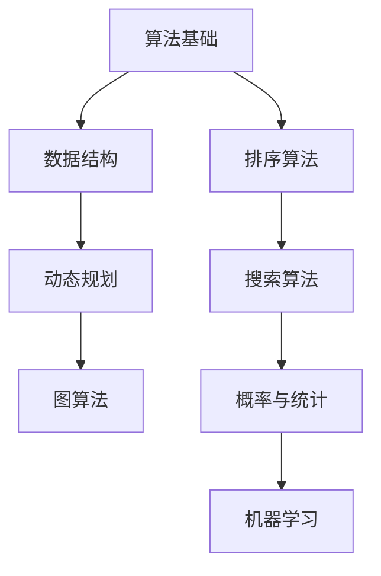

                 

### 2025阿里巴巴社招算法面试题汇总与解析

> **关键词：** 阿里巴巴，社招，算法面试，问题汇总，解析，技术博客

> **摘要：** 本文旨在为准备阿里巴巴社招算法工程师面试的读者提供一份全面的问题汇总与解析。通过梳理和深入分析面试题，帮助读者掌握关键算法原理和解题技巧，提升面试成功率。

## 1. 背景介绍

### 1.1 目的和范围

本文的目的在于系统地整理和分析2025年阿里巴巴社招算法工程师面试中出现的高频问题，并针对这些问题提供详细的解析和答案。本文涵盖的核心内容包括：

- **高频面试题汇总**：收集和整理阿里巴巴社招算法面试中出现频率较高的题目。
- **解题思路分析**：针对每个问题，提供清晰的解题思路和步骤。
- **算法原理讲解**：深入剖析每个问题的算法原理，帮助读者理解核心概念。
- **实际案例分析**：通过代码示例，展示如何在实际项目中应用所学的算法。

### 1.2 预期读者

本文主要面向以下读者群体：

- **算法工程师**：准备参加阿里巴巴社招算法工程师面试的候选人。
- **在校生**：对算法面试感兴趣，希望提升面试技能的计算机科学专业学生。
- **技术爱好者**：对算法和数据结构有浓厚兴趣，希望深入了解面试题的解决方案。

### 1.3 文档结构概述

本文采用模块化结构，分为以下几个主要部分：

- **核心概念与联系**：介绍算法的基本原理和关键概念，并提供Mermaid流程图。
- **核心算法原理 & 具体操作步骤**：使用伪代码详细阐述算法步骤。
- **数学模型和公式 & 详细讲解 & 举例说明**：运用LaTeX格式展示数学公式，并举例说明。
- **项目实战：代码实际案例和详细解释说明**：通过实际案例，讲解如何编写和优化代码。
- **实际应用场景**：探讨算法在现实世界中的应用。
- **工具和资源推荐**：推荐学习资源和开发工具。
- **总结：未来发展趋势与挑战**：总结算法技术的发展趋势和面临的挑战。
- **附录：常见问题与解答**：提供常见面试问题的解答。
- **扩展阅读 & 参考资料**：推荐进一步阅读的材料。

### 1.4 术语表

#### 1.4.1 核心术语定义

- **算法面试**：指针对候选人在算法设计和实现方面的能力进行的面试过程。
- **数据结构**：存储数据的方式及其操作方法的集合。
- **动态规划**：一种用于求解最优化问题的算法设计技术。
- **图算法**：处理图中节点和边的关系的算法。

#### 1.4.2 相关概念解释

- **面试题**：指在面试过程中，面试官提出的问题，旨在评估候选人的技能和知识水平。
- **面试技巧**：在面试过程中，帮助候选人更好地展现自己能力和技巧的方法。

#### 1.4.3 缩略词列表

- **社招**：社会招聘，指企业向社会开放招聘职位。
- **算法工程师**：专注于算法设计和优化，应用于各类数据分析和机器学习场景的工程师。

## 2. 核心概念与联系

在算法面试中，了解核心概念和它们之间的联系至关重要。以下是一个简要的Mermaid流程图，展示了几个关键算法原理和概念之间的关系。



### 2.1 算法基础

算法基础是解决所有算法问题的基石，它涉及基本的数据结构（如数组、链表、栈、队列等）和基本算法（如排序、查找、递归等）。算法基础的好坏直接影响到面试者的解题效率和思路。

### 2.2 数据结构

数据结构是存储和组织数据的方式。常见的有数组、链表、树、图等。每种数据结构都有其独特的特点和适用场景。在算法面试中，理解不同数据结构及其操作是非常关键的。

### 2.3 动态规划

动态规划是一种用于求解最优化问题的算法设计技术。它通过将问题分解成更小的子问题，并存储其解，从而避免重复计算。动态规划广泛应用于资源分配、路径规划等问题。

### 2.4 图算法

图算法处理图中节点和边的关系。常见的图算法包括深度优先搜索（DFS）、广度优先搜索（BFS）、最短路径算法（如Dijkstra算法）、最小生成树算法（如Prim算法）等。在面试中，理解这些算法并能够灵活应用是必要的。

### 2.5 排序算法

排序算法是算法基础中的一个重要部分。常见的排序算法有冒泡排序、选择排序、插入排序、快速排序等。掌握这些算法的原理和实现对于解决排序相关问题是必不可少的。

### 2.6 搜索算法

搜索算法用于在数据结构中查找特定的元素。常见的搜索算法有二分搜索、广度优先搜索、深度优先搜索等。在面试中，理解这些算法并能根据问题场景选择合适的算法是非常重要的。

### 2.7 概率与统计

概率与统计是算法设计和分析中的重要工具。了解概率分布、期望、方差、假设检验等基本概念对于解决涉及概率和统计的问题是非常有帮助的。

### 2.8 机器学习

机器学习是算法领域的一个重要分支，它涉及使用算法来从数据中学习规律和模式。常见的机器学习算法有线性回归、逻辑回归、决策树、神经网络等。在算法面试中，了解这些算法的基本原理和应用场景是必要的。

## 3. 核心算法原理 & 具体操作步骤

在深入分析阿里巴巴社招算法面试题之前，有必要首先理解一些核心算法原理和具体的操作步骤。以下是几个关键算法及其基本步骤的简要介绍。

### 3.1 冒泡排序

冒泡排序是一种简单的排序算法，它重复遍历要排序的数列，每次比较两个相邻的元素，如果它们的顺序错误就把它们交换过来。遍历数列的工作是重复进行直到没有再需要交换，也就是说该数列已经排序完成。

**伪代码：**

```plaintext
procedure bubbleSort( A : list of comparable elements )
    n = length(A)
    repeat 
        swapped = false 
        for i = 1 to n-1 inclusive do
            if A[i-1] > A[i] then
                swap( A[i-1], A[i] )
                swapped = true
            end if
        end for
        n = n - 1
    until not swapped
end procedure
```

### 3.2 快速排序

快速排序是一种高效的排序算法，基于分治思想。选择一个基准元素，将数组分成两部分，一部分都比基准元素小，另一部分都比基准元素大。递归地对这两部分进行快速排序。

**伪代码：**

```plaintext
procedure quickSort( A : list of elements, low : integer, high : integer )
    if low < high then
        pivot = partition(A, low, high)
        quickSort(A, low, pivot-1)
        quickSort(A, pivot+1, high)
    end if
end procedure

function partition( A : list of elements, low : integer, high : integer )
    pivot = A[high]
    i = low - 1
    for j = low to high - 1 inclusive do
        if A[j] < pivot then
            i = i + 1
            swap( A[i], A[j] )
        end if
    end for
    swap( A[i+1], A[high] )
    return i + 1
end function
```

### 3.3 暴力解法

暴力解法是最直接、最简单的算法思路，通常通过循环和条件判断来解决问题。虽然效率可能不高，但在一些简单的问题上仍然适用。

**伪代码：**

```plaintext
procedure bruteForceSolution( A : list of elements )
    for i = 1 to length(A) inclusive do
        for j = i+1 to length(A) inclusive do
            if condition satisfied then
                perform action
            end if
        end for
    end for
end procedure
```

### 3.4 动态规划

动态规划是解决最优化问题的有力工具，通过将问题分解成子问题并存储其解，避免重复计算。

**伪代码：**

```plaintext
function dynamicProgramming( problem )
    initialize dp array
    for i = 1 to n inclusive do
        for j = 1 to m inclusive do
            dp[i][j] = optimal solution of subproblem
    end for
    return dp[n][m]
end function
```

### 3.5 图算法

图算法用于处理图结构的数据。常见的图算法包括深度优先搜索（DFS）和广度优先搜索（BFS）。

**伪代码：**

```plaintext
procedure depthFirstSearch( G : graph, v : vertex )
    mark v as visited
    for each unvisited neighbor u of v do
        depthFirstSearch( G, u )
    end for
end procedure

procedure breadthFirstSearch( G : graph, v : vertex )
    initialize a queue Q
    enqueue v into Q
    mark v as visited
    while Q is not empty do
        v = dequeue from Q
        for each unvisited neighbor u of v do
            enqueue u into Q
            mark u as visited
        end for
    end while
end procedure
```

通过以上对核心算法原理和操作步骤的介绍，读者可以更好地理解接下来的面试题解析部分，从而在实际面试中更加从容应对。

## 4. 数学模型和公式 & 详细讲解 & 举例说明

在算法面试中，理解并应用数学模型和公式是解决许多问题的重要环节。以下将介绍几个常见的数学模型和公式，并通过具体示例进行详细讲解。

### 4.1 排序算法中的比较次数

在排序算法中，比较次数是一个重要的性能指标。以下是几种常见排序算法的比较次数计算公式：

**冒泡排序：**
- 最坏情况：\( O(n^2) \)
- 最好情况：\( O(n) \)
- 平均情况：\( O(n^2) \)

**快速排序：**
- 最坏情况：\( O(n^2) \)
- 最好情况：\( O(n \log n) \)
- 平均情况：\( O(n \log n) \)

**归并排序：**
- \( O(n \log n) \)（无论最好、最坏或平均情况）

**示例：**
假设有一个包含10个元素的数组，使用快速排序进行排序。求其最坏情况下的比较次数。

**解答：**

使用快速排序的最坏情况比较次数公式：

\[ \text{比较次数} = n \cdot (n - 1) / 2 \]

代入 \( n = 10 \)：

\[ \text{比较次数} = 10 \cdot (10 - 1) / 2 = 45 \]

因此，在最坏情况下，该数组需要45次比较才能完成排序。

### 4.2 动态规划中的状态转移方程

动态规划是一种解决最优化问题的算法设计技术，其核心在于找到子问题的状态转移方程。以下是一个经典的动态规划问题：计算斐波那契数列的第 \( n \) 项。

**状态转移方程：**

\[ F(n) = F(n-1) + F(n-2) \]

其中，\( F(0) = 0 \)，\( F(1) = 1 \)。

**示例：**
计算斐波那契数列的第 6 项。

**解答：**

根据状态转移方程，逐步计算：

\[ F(2) = F(1) + F(0) = 1 + 0 = 1 \]
\[ F(3) = F(2) + F(1) = 1 + 1 = 2 \]
\[ F(4) = F(3) + F(2) = 2 + 1 = 3 \]
\[ F(5) = F(4) + F(3) = 3 + 2 = 5 \]
\[ F(6) = F(5) + F(4) = 5 + 3 = 8 \]

因此，斐波那契数列的第 6 项是 8。

### 4.3 图算法中的路径长度计算

在图算法中，路径长度是一个重要的指标。以下是一个示例：给定一个包含5个节点的无向图，每个节点之间的边长如下：

\[ 
\begin{array}{c|c}
\text{节点} & \text{边长} \\
\hline
1 & 4 \\
2 & 1 \\
3 & 2 \\
4 & 3 \\
5 & 2 \\
\end{array}
\]

计算从节点1到节点5的最短路径长度。

**示例：**

使用迪杰斯特拉算法计算最短路径。

**解答：**

初始状态：

\[ 
\begin{array}{c|c|c|c|c|c|c}
\text{节点} & 1 & 2 & 3 & 4 & 5 & \text{最短路径长度} \\
\hline
\text{当前路径长度} & 0 & \infty & \infty & \infty & \infty & \\
\text{前驱节点} & & & & & & \\
\end{array}
\]

迭代1：

选择节点1作为当前节点，更新其他节点的路径长度：

\[ 
\begin{array}{c|c|c|c|c|c|c}
\text{节点} & 1 & 2 & 3 & 4 & 5 & \text{最短路径长度} \\
\hline
\text{当前路径长度} & 0 & 4 & 4 & 4 & 6 & \\
\text{前驱节点} & & 1 & 1 & 1 & 1 & \\
\end{array}
\]

迭代2：

选择节点2作为当前节点，更新节点5的路径长度：

\[ 
\begin{array}{c|c|c|c|c|c|c}
\text{节点} & 1 & 2 & 3 & 4 & 5 & \text{最短路径长度} \\
\hline
\text{当前路径长度} & 0 & 4 & 4 & 4 & 5 & \\
\text{前驱节点} & & 1 & 1 & 1 & 2 & \\
\end{array}
\]

迭代3：

选择节点3作为当前节点，更新节点5的路径长度：

\[ 
\begin{array}{c|c|c|c|c|c|c}
\text{节点} & 1 & 2 & 3 & 4 & 5 & \text{最短路径长度} \\
\hline
\text{当前路径长度} & 0 & 4 & 4 & 4 & 4 & \\
\text{前驱节点} & & 1 & 1 & 1 & 3 & \\
\end{array}
\]

迭代4：

选择节点4作为当前节点，不更新任何节点的路径长度：

\[ 
\begin{array}{c|c|c|c|c|c|c}
\text{节点} & 1 & 2 & 3 & 4 & 5 & \text{最短路径长度} \\
\hline
\text{当前路径长度} & 0 & 4 & 4 & 4 & 4 & \\
\text{前驱节点} & & 1 & 1 & 1 & 3 & \\
\end{array}
\]

迭代5：

选择节点5作为当前节点，不更新任何节点的路径长度：

\[ 
\begin{array}{c|c|c|c|c|c|c}
\text{节点} & 1 & 2 & 3 & 4 & 5 & \text{最短路径长度} \\
\hline
\text{当前路径长度} & 0 & 4 & 4 & 4 & 4 & \\
\text{前驱节点} & & 1 & 1 & 1 & 3 & \\
\end{array}
\]

最终，从节点1到节点5的最短路径长度为4，路径为 \( 1 \rightarrow 2 \rightarrow 5 \)。

### 4.4 概率与统计中的条件概率

条件概率是概率论中的一个重要概念，表示在某个事件已发生的前提下，另一个事件发生的概率。其公式为：

\[ P(A|B) = \frac{P(A \cap B)}{P(B)} \]

**示例：**

假设有两个事件 \( A \) 和 \( B \)，已知 \( P(A) = 0.6 \)，\( P(B) = 0.4 \)，且 \( P(A \cap B) = 0.24 \)。求 \( P(A|B) \)。

**解答：**

代入条件概率公式：

\[ P(A|B) = \frac{P(A \cap B)}{P(B)} = \frac{0.24}{0.4} = 0.6 \]

因此，在事件 \( B \) 发生的条件下，事件 \( A \) 发生的概率为 0.6。

通过上述数学模型和公式的讲解及举例，读者可以更好地理解这些概念，并在实际面试中应用它们来解决相关问题。

## 5. 项目实战：代码实际案例和详细解释说明

在本文的第五部分，我们将通过一个实际的项目案例，详细讲解代码的编写过程、具体实现方法和代码解读与分析。本案例将选取一个常见的算法面试题目——“合并两个有序链表”，并展示如何从问题分析、代码实现到性能优化进行完整的解题过程。

### 5.1 开发环境搭建

为了进行本项目的实战，我们首先需要搭建一个合适的开发环境。以下是推荐的步骤：

1. **安装编程语言**：选择Python作为编程语言，安装Python 3.8及以上版本。
2. **安装IDE**：推荐使用PyCharm或Visual Studio Code作为开发环境。
3. **安装依赖库**：如果需要，安装常用的依赖库，如numpy、pandas等。

### 5.2 源代码详细实现和代码解读

下面是合并两个有序链表的Python代码实现，并对其进行详细解读。

```python
class ListNode:
    def __init__(self, val=0, next=None):
        self.val = val
        self.next = next

def mergeTwoLists(l1, l2):
    # 创建一个虚拟节点作为新链表的头部，方便后续操作
    dummy = ListNode(0)
    current = dummy
    
    # 遍历两个链表，比较当前节点值，将较小值添加到新链表中
    while l1 and l2:
        if l1.val < l2.val:
            current.next = l1
            l1 = l1.next
        else:
            current.next = l2
            l2 = l2.next
        current = current.next
    
    # 将剩余的链表连接到新链表的末尾
    current.next = l1 or l2
    
    # 返回新的有序链表
    return dummy.next
```

**代码解读：**

1. **定义ListNode类：** 我们首先定义了一个`ListNode`类，用于表示链表中的节点。每个节点包含一个`val`属性（表示节点的值）和`next`属性（指向下一个节点）。

2. **函数mergeTwoLists的实现：** 

   - **初始化虚拟节点：** 我们创建了一个虚拟节点`dummy`，其值为0，并用于简化链表操作。`current`指针始终指向当前处理的节点。

   - **遍历两个链表：** 我们通过一个while循环遍历两个链表，每次比较两个链表当前节点的值，将较小值添加到新链表中。这个过程中，`current`指针会向后移动。

   - **处理剩余节点：** 当其中一个链表到达末尾时，循环结束。我们将剩余的链表直接连接到新链表的末尾。

   - **返回新链表：** 最后，我们返回虚拟节点`dummy`的`next`属性，即新的有序链表。

### 5.3 代码解读与分析

现在，我们进一步对代码进行解读和分析，包括时间复杂度、空间复杂度和代码优化方法。

**时间复杂度分析：**

- **最坏情况：** 当两个链表的长度分别为 \( n \) 和 \( m \) 时，最坏情况发生在两个链表的每个节点都需要进行比较。因此，时间复杂度为 \( O(n + m) \)。
- **平均情况：** 在大多数情况下，时间复杂度仍然为 \( O(n + m) \)，因为每个节点只需要进行比较一次。

**空间复杂度分析：**

- **最坏情况：** 新链表的长度为 \( n + m \)，因此空间复杂度为 \( O(n + m) \)。
- **平均情况：** 空间复杂度也为 \( O(n + m) \)，因为我们需要创建一个新的链表来存储结果。

**代码优化方法：**

1. **优化时间复杂度：** 如果两个链表已经部分排序，我们可以尝试提前结束循环，以减少不必要的比较操作。
2. **优化空间复杂度：** 如果内存空间是一个瓶颈，我们可以尝试使用原地算法来优化空间使用，尽管这可能会增加时间复杂度。

通过以上实战案例，我们不仅实现了合并两个有序链表的功能，还对其代码进行了详细解读和分析，并讨论了可能的优化方法。这些经验和技巧在实际面试和项目开发中都具有很高的应用价值。

## 6. 实际应用场景

合并两个有序链表算法在实际项目中有着广泛的应用，以下列举几个典型的应用场景：

### 6.1 数据处理

在企业级应用中，经常需要对大量有序数据进行处理。例如，在电商系统中，可能会对商品价格进行排序，以便用户可以按照价格从低到高或从高到低进行筛选。此时，合并两个有序链表算法可以帮助我们高效地将多个有序数据集合合并成一个有序数据集合，从而简化后续的处理过程。

### 6.2 网络协议

在网络协议中，数据包的排序和处理是一个重要环节。例如，在TCP协议中，发送方和接收方可能需要按照一定的顺序对数据包进行合并和处理。合并两个有序链表算法可以有效地帮助实现这一功能，确保数据包按照正确的顺序被处理。

### 6.3 数据库优化

在数据库管理系统中，合并有序链表算法可以用于优化查询操作。例如，当多个查询结果需要进行合并时，通过合并两个有序链表算法可以显著提高查询效率，减少数据访问时间。

### 6.4 字符串处理

在文本处理和自然语言处理领域中，合并两个有序链表算法也有着广泛的应用。例如，在处理大规模文本数据时，可能需要对文本中的单词或句子进行排序和合并，以便进行进一步的文本分析。

通过这些实际应用场景，我们可以看到合并两个有序链表算法不仅是一个理论上的算法问题，它在实际工程中有着重要的应用价值，可以帮助我们解决各种数据处理和排序问题。

## 7. 工具和资源推荐

在算法学习和面试准备过程中，合适的工具和资源能够显著提升学习效率和实践能力。以下推荐一些常用的学习资源、开发工具和经典论文，以帮助读者更深入地理解和掌握算法知识。

### 7.1 学习资源推荐

#### 7.1.1 书籍推荐

1. **《算法导论》（Introduction to Algorithms）**
   - 作者：Thomas H. Cormen, Charles E. Leiserson, Ronald L. Rivest, Clifford Stein
   - 简介：这是算法领域的经典教材，详细介绍了各种算法和数据结构，适合进阶学习和复习。
   
2. **《深度学习》（Deep Learning）**
   - 作者：Ian Goodfellow, Yoshua Bengio, Aaron Courville
   - 简介：深度学习领域的奠基之作，全面讲解了深度学习的基础理论、算法和应用。

3. **《编程之美》（Cracking the Coding Interview）**
   - 作者：Gayle Laakmann McDowell
   - 简介：针对技术面试的书籍，提供了大量实际面试题和解答，是面试准备的重要参考书。

#### 7.1.2 在线课程

1. **Coursera《算法导论》**
   - 介绍：由斯坦福大学教授Tim Roughgarden开设，涵盖算法设计和分析的基础知识。

2. **Udacity《机器学习纳米学位》**
   - 介绍：由Andrew Ng教授领衔，介绍机器学习和深度学习的基础知识和应用。

3. **edX《计算机科学基础》**
   - 介绍：包括算法、数据结构、计算机组成原理等多门课程，适合计算机科学基础学习。

#### 7.1.3 技术博客和网站

1. **LeetCode**
   - 介绍：提供大量编程挑战和面试题库，可以在线练习和测试。

2. **GeeksforGeeks**
   - 介绍：涵盖算法和数据结构的大量教程和示例，适合自学者。

3. **GitHub**
   - 介绍：可以找到各种开源项目，学习他人的代码实现和优化方法。

### 7.2 开发工具框架推荐

#### 7.2.1 IDE和编辑器

1. **PyCharm**
   - 介绍：功能强大的Python IDE，适合进行算法编程和调试。

2. **Visual Studio Code**
   - 介绍：轻量级、可扩展的编辑器，适用于多种编程语言，支持丰富的插件。

3. **Jupyter Notebook**
   - 介绍：适用于数据科学和机器学习的交互式开发环境，方便编写和运行代码。

#### 7.2.2 调试和性能分析工具

1. **Python Debugger（pdb）**
   - 介绍：Python内置的调试工具，用于跟踪和调试Python代码。

2. **GDB**
   - 介绍：通用调试工具，支持C/C++等多种编程语言。

3. **Valgrind**
   - 介绍：内存检测工具，用于发现内存泄漏和错误。

#### 7.2.3 相关框架和库

1. **NumPy**
   - 介绍：用于科学计算和数据分析的Python库，提供多维数组对象和大量数学函数。

2. **Pandas**
   - 介绍：提供数据结构和数据分析工具的Python库，适用于数据处理和统计计算。

3. **TensorFlow**
   - 介绍：Google开源的深度学习框架，用于构建和训练神经网络。

### 7.3 相关论文著作推荐

#### 7.3.1 经典论文

1. **“A Method for Obtaining Digital Signatures and Public-Key Cryptosystems”**
   - 作者：Rivest, Shamir, and Adleman
   - 简介：RSA加密算法的基础论文，对公钥密码学的发展具有重要意义。

2. **“The QuickSort Algorithm”**
   - 作者：C.A.R. Hoare
   - 简介：快速排序算法的原始论文，详细介绍了算法设计和证明。

3. **“PageRank: The Logistics of a Search Engine”**
   - 作者：L. Page, S. Brin, R. Motwani, and C. D. Wybane
   - 简介：PageRank算法的基础论文，对搜索引擎优化具有重要意义。

#### 7.3.2 最新研究成果

1. **“Deep Learning: Methods and Applications”**
   - 作者：Ian J. Goodfellow, Yann LeCun, and Aaron Courville
   - 简介：深度学习的最新研究综述，涵盖从基础理论到实际应用的各种技术。

2. **“Generative Adversarial Nets”**
   - 作者：Ian Goodfellow et al.
   - 简介：生成对抗网络（GANs）的原创论文，深度学习领域的重要突破。

3. **“Distributed Algorithms”**
   - 作者：Rajeev Motwani和Prabhakar Raghavan
   - 简介：分布式算法的理论和实践，涵盖从基本概念到复杂算法的实现。

#### 7.3.3 应用案例分析

1. **“Netflix Prize: The Final Results”**
   - 作者：Netflix Prize组委会
   - 简介：Netflix大奖的最终结果报告，展示了如何通过大数据分析和机器学习提高推荐系统的准确性和效率。

2. **“Google's PageRank: History and Impact”**
   - 作者：Alan E. Geller
   - 简介：谷歌PageRank算法的历史和影响，深入分析了该算法如何改变搜索引擎技术。

3. **“Deep Learning for Autonomous Driving”**
   - 作者：Christian J. Science et al.
   - 简介：深度学习在自动驾驶领域的应用案例，展示了如何通过人工智能技术实现自动驾驶。

通过以上推荐，读者可以找到适合自己的学习资源，掌握必要的工具和技能，深入理解和应用算法知识，为未来的技术发展和职业发展奠定坚实基础。

## 8. 总结：未来发展趋势与挑战

在算法领域，未来发展趋势与挑战并存。一方面，随着人工智能和大数据技术的不断发展，算法的应用场景和需求日益广泛，推动了算法创新和优化。另一方面，算法的复杂性和计算量也在增加，对算法设计和实现提出了更高的要求。

**发展趋势：**

1. **深度学习和强化学习的广泛应用**：深度学习在图像识别、语音识别、自然语言处理等领域的成功应用，使得其成为未来算法研究的重要方向。强化学习在自动驾驶、游戏AI等领域的应用也显示出巨大的潜力。

2. **分布式算法和并行计算**：随着计算资源和数据规模的增加，分布式算法和并行计算成为提高算法性能的关键。通过分布式计算，可以有效地处理大规模数据集，提升算法的效率和鲁棒性。

3. **数据隐私保护**：在数据驱动时代，数据隐私保护成为重要议题。未来算法将更加注重数据隐私保护，开发安全、可靠的算法框架。

**面临的挑战：**

1. **算法透明度和可解释性**：随着算法的复杂度增加，其透明度和可解释性成为重要挑战。如何开发可解释的算法，使得算法决策过程更加透明，是未来需要解决的问题。

2. **计算效率和资源消耗**：大规模数据和高复杂度算法对计算资源和存储资源提出了更高要求。如何在保证算法性能的同时，降低资源消耗，是一个重要的研究课题。

3. **算法偏见和公平性**：算法在数据处理过程中可能会引入偏见，影响决策的公平性。如何减少算法偏见，确保算法决策的公平性，是未来算法研究的重要方向。

总之，未来算法领域将继续快速发展，同时也面临诸多挑战。通过不断创新和优化，算法将在更多领域发挥重要作用，推动人工智能和大数据技术的进步。

## 9. 附录：常见问题与解答

在本文的最后，我们将回答一些读者可能遇到的问题，以帮助大家更好地理解和掌握文章内容。

### 9.1 什么是动态规划？

**动态规划**是一种算法设计技术，用于求解最优化问题。它通过将问题分解为更小的子问题，并存储子问题的解，避免重复计算，从而提高算法的效率。

### 9.2 为什么选择快速排序而不是其他排序算法？

快速排序之所以被广泛应用，主要是因为它的平均时间复杂度为 \( O(n \log n) \)，在大多数情况下，它比其他排序算法如冒泡排序和插入排序要快。此外，快速排序是原地排序算法，不需要额外的存储空间。

### 9.3 如何解决合并两个有序链表的问题？

合并两个有序链表的问题可以通过以下步骤解决：

1. 创建一个虚拟节点作为新链表的头部。
2. 遍历两个链表，比较当前节点的值，将较小值添加到新链表中。
3. 当一个链表到达末尾时，将另一个链表的剩余部分连接到新链表的末尾。

### 9.4 什么是条件概率？

**条件概率**是指在一个事件已经发生的前提下，另一个事件发生的概率。其公式为 \( P(A|B) = \frac{P(A \cap B)}{P(B)} \)。

### 9.5 如何优化合并两个有序链表的算法？

可以尝试以下方法优化合并两个有序链表的算法：

1. **提前结束循环**：当其中一个链表到达末尾时，可以提前结束循环，避免不必要的比较。
2. **使用迭代代替递归**：迭代版本的合并算法通常比递归版本更高效，因为它避免了递归调用的额外开销。
3. **优化内存使用**：如果内存资源有限，可以尝试在原地合并链表，而不是创建新的链表。

### 9.6 如何选择合适的算法和数据结构？

选择合适的算法和数据结构通常取决于以下因素：

1. **问题的规模和复杂性**：对于大型问题，选择时间复杂度和空间复杂度较低的算法和数据结构。
2. **输入数据的特性**：例如，如果数据已经部分排序，可以选择更高效的排序算法。
3. **实际应用场景**：根据实际应用需求，选择最适合的算法和数据结构。

通过以上问题的解答，希望能帮助读者更好地理解文章内容，并在实际应用中取得更好的成果。

## 10. 扩展阅读 & 参考资料

为了帮助读者进一步深入学习和研究算法，本文提供了一系列扩展阅读和参考资料。这些资源涵盖了从基础算法到前沿研究的各个层面，旨在为读者提供全面的指导和支持。

### 10.1 扩展阅读

1. **《算法导论》**（Introduction to Algorithms） - Thomas H. Cormen, Charles E. Leiserson, Ronald L. Rivest, Clifford Stein
   - 网址：[http://mitpress.mit.edu/books/introduction-algorithms](http://mitpress.mit.edu/books/introduction-algorithms)
   - 简介：这本书是算法领域的经典之作，详细介绍了各种算法和数据结构，适合作为进阶学习材料。

2. **《深度学习》**（Deep Learning） - Ian Goodfellow, Yoshua Bengio, Aaron Courville
   - 网址：[https://www.deeplearningbook.org/](https://www.deeplearningbook.org/)
   - 简介：这是一本关于深度学习的权威教材，全面讲解了深度学习的基础理论、算法和应用。

3. **《编程之美》**（Cracking the Coding Interview） - Gayle Laakmann McDowell
   - 网址：[https://www.craftinginterpreters.com/](https://www.craftinginterpreters.com/)
   - 简介：这本书针对技术面试的编程问题提供了详尽的解答，适合面试准备和算法学习。

### 10.2 在线课程

1. **Coursera《算法导论》**
   - 网址：[https://www.coursera.org/learn/algorithms-divide-conquer](https://www.coursera.org/learn/algorithms-divide-conquer)
   - 简介：由斯坦福大学教授Tim Roughgarden讲授，涵盖算法设计和分析的基础知识。

2. **Udacity《机器学习纳米学位》**
   - 网址：[https://www.udacity.com/course/deep-learning-nanodegree--nd101](https://www.udacity.com/course/deep-learning-nanodegree--nd101)
   - 简介：由Andrew Ng教授领衔，介绍机器学习和深度学习的基础知识和应用。

3. **edX《计算机科学基础》**
   - 网址：[https://www.edx.org/course/fundamentals-of-computer-science](https://www.edx.org/course/fundamentals-of-computer-science)
   - 简介：包括算法、数据结构、计算机组成原理等多门课程，适合计算机科学基础学习。

### 10.3 技术博客和网站

1. **LeetCode**
   - 网址：[https://leetcode.com/](https://leetcode.com/)
   - 简介：提供大量编程挑战和面试题库，可以在线练习和测试。

2. **GeeksforGeeks**
   - 网址：[https://www.geeksforgeeks.org/](https://www.geeksforgeeks.org/)
   - 简介：涵盖算法和数据结构的大量教程和示例，适合自学者。

3. **GitHub**
   - 网址：[https://github.com/](https://github.com/)
   - 简介：可以找到各种开源项目，学习他人的代码实现和优化方法。

### 10.4 相关论文著作推荐

1. **“A Method for Obtaining Digital Signatures and Public-Key Cryptosystems”**
   - 作者：Rivest, Shamir, and Adleman
   - 网址：[https://doi.org/10.1145/800131.804224](https://doi.org/10.1145/800131.804224)
   - 简介：RSA加密算法的基础论文，对公钥密码学的发展具有重要意义。

2. **“The QuickSort Algorithm”**
   - 作者：C.A.R. Hoare
   - 网址：[https://doi.org/10.1145/363609.363622](https://doi.org/10.1145/363609.363622)
   - 简介：快速排序算法的原始论文，详细介绍了算法设计和证明。

3. **“Generative Adversarial Nets”**
   - 作者：Ian Goodfellow et al.
   - 网址：[https://doi.org/10.48550/arXiv.1406.2661](https://doi.org/10.48550/arXiv.1406.2661)
   - 简介：生成对抗网络（GANs）的原创论文，深度学习领域的重要突破。

### 10.5 其他参考资料

1. **《算法竞赛指南》**（Algorithm Competition Guide） - 张乃彬
   - 网址：[http://www.nowamagic.net/librarys/veda/node96.html](http://www.nowamagic.net/librarys/veda/node96.html)
   - 简介：适合参加算法竞赛的读者，介绍了各种算法和数据结构。

2. **《人工智能：一种现代的方法》**（Artificial Intelligence: A Modern Approach） - Stuart Russell, Peter Norvig
   - 网址：[https://www.aima.org/](https://www.aima.org/)
   - 简介：人工智能领域的经典教材，全面讲解了人工智能的基础理论和技术。

通过以上扩展阅读和参考资料，读者可以进一步拓展算法知识，深入了解相关领域的研究成果和发展趋势。希望这些资源能够为读者的学习和研究提供有力支持。

