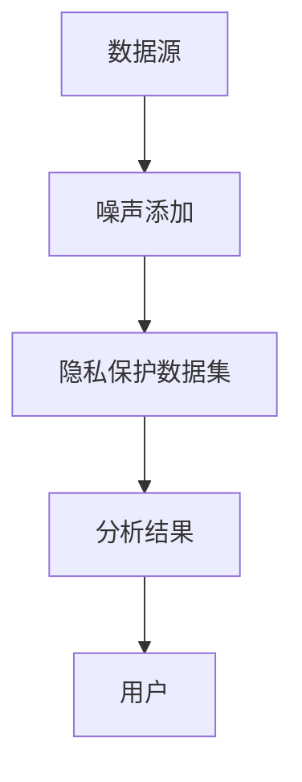
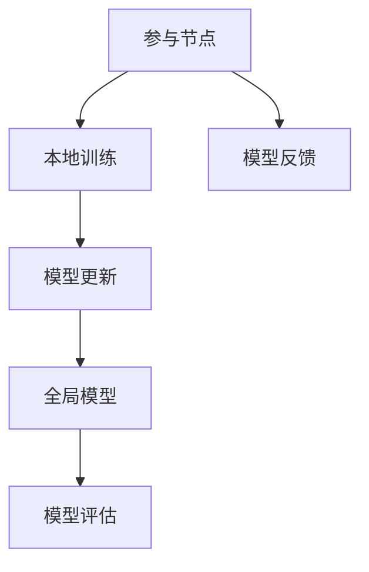
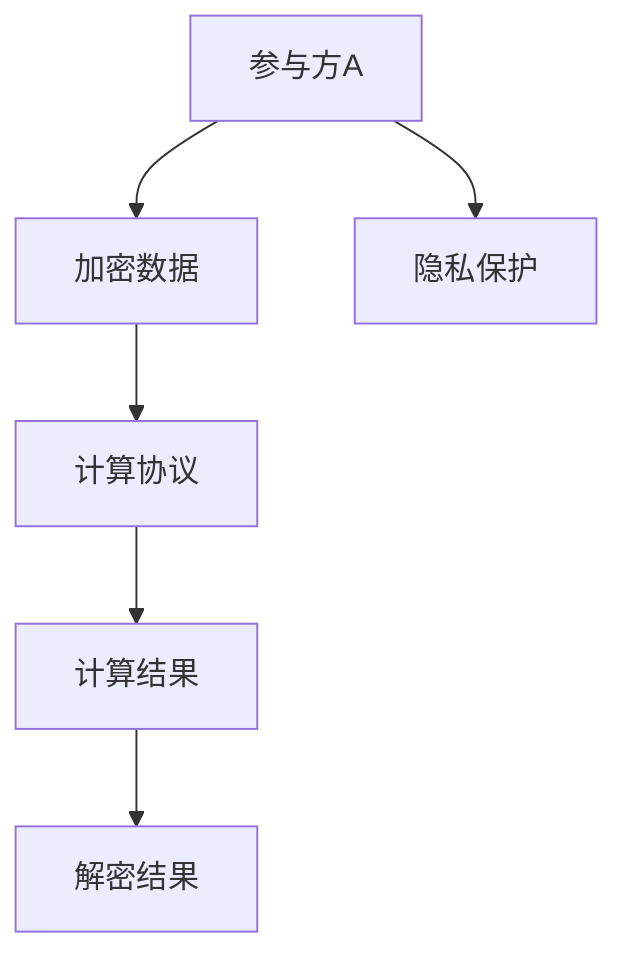
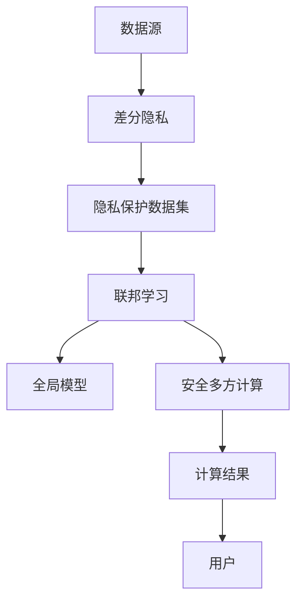
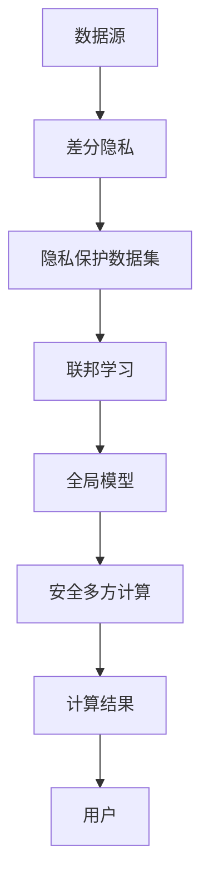

                 

### 1. 背景介绍

隐私计算，作为一个新兴且迅速发展的领域，正引领着数据保护和计算技术的新潮流。近年来，随着大数据和人工智能技术的飞速发展，数据的价值和重要性日益凸显。然而，数据的广泛应用也带来了隐私泄露的风险，如何在保证数据利用价值的同时保护用户的隐私，成为了一个亟待解决的问题。这一背景下，隐私计算应运而生，它提供了一种新的数据保护范式，旨在在数据处理过程中保护数据的隐私性。

本文的目标是深入探讨隐私计算大模型这一先进技术的核心概念、原理和实现，并分析其在实际应用中的潜力和挑战。通过系统地介绍隐私计算的基本概念、核心算法原理、数学模型及其应用场景，本文希望能够为读者提供一个全面且深入的理解，帮助其在数据保护与隐私计算领域开展更加深入的研究和实践。

本文的读者群体主要包括数据科学家、隐私保护专家、算法工程师、系统架构师以及所有对数据隐私保护感兴趣的技术人员。通过本文的阅读，读者不仅能够掌握隐私计算的基本知识和应用场景，还能了解到隐私计算大模型在提升数据处理效率和保障数据隐私方面的独特优势。

接下来的部分将按照以下结构进行阐述：

- **1.1 目的和范围**：明确本文的研究目标和讨论范围，为读者提供文章的框架和预期内容。
- **1.2 预期读者**：介绍本文的读者群体，以便他们能够更好地定位文章的适用性。
- **1.3 文档结构概述**：概述文章的结构和各个章节的主要内容，帮助读者快速了解文章的组织形式。
- **1.4 术语表**：定义本文中使用的一些核心术语，确保读者理解一致。

在上述背景介绍的基础上，我们将逐步深入到隐私计算的核心概念和技术细节中，以帮助读者全面了解这一领域的最新进展和未来趋势。

#### 1.1 目的和范围

本文的研究目的在于系统地探讨隐私计算大模型这一新兴技术，旨在为读者提供一个全面且深入的理解。具体来说，本文将围绕以下方面展开讨论：

1. **核心概念解析**：介绍隐私计算的基本概念，阐述其与大数据和人工智能技术的关系，以及其在数据保护中的重要作用。
2. **算法原理剖析**：详细分析隐私计算大模型的核心算法原理，包括差分隐私、联邦学习、安全多方计算等，通过伪代码和具体操作步骤，帮助读者掌握算法的实现方法。
3. **数学模型讲解**：解释隐私计算中常用的数学模型和公式，并结合实际案例进行详细说明，使读者能够理解这些模型在数据处理中的应用。
4. **实际应用场景**：探讨隐私计算大模型在不同领域中的应用场景，包括医疗、金融、电子商务等，分析其在提高数据处理效率和保障数据隐私方面的独特优势。
5. **未来发展趋势**：展望隐私计算大模型的未来发展方向和面临的挑战，为读者提供对该领域持续关注的理由。

本文的讨论范围将主要集中在以下几方面：

- **隐私计算大模型的基本概念和架构**：介绍隐私计算的基本原理和架构，包括差分隐私、联邦学习、安全多方计算等。
- **核心算法原理和实现**：详细讲解隐私计算中的核心算法原理，并通过伪代码和操作步骤展示其实际应用。
- **数学模型和公式**：介绍隐私计算中常用的数学模型和公式，并通过实际案例进行说明。
- **实际应用场景分析**：分析隐私计算大模型在不同领域的应用场景和优势。
- **未来趋势和挑战**：探讨隐私计算大模型的未来发展路径和面临的挑战。

通过本文的深入探讨，读者将能够全面了解隐私计算大模型的基本概念、核心算法原理及其在实际应用中的优势，为他们在数据保护与隐私计算领域的研究和应用提供有力支持。

#### 1.2 预期读者

本文的预期读者主要包括以下几个方面：

1. **数据科学家**：数据科学家通常负责处理和分析大规模数据集，他们对数据隐私保护有着高度关注。本文将详细介绍隐私计算大模型的基本概念和算法原理，帮助他们更好地理解和应用这一技术，以提高数据处理的效率和安全性。

2. **隐私保护专家**：作为数据隐私领域的专业人才，隐私保护专家需要掌握各种隐私保护技术。本文将深入剖析隐私计算大模型的算法原理和数学模型，为隐私保护专家提供新的视角和工具，以应对复杂的数据隐私挑战。

3. **算法工程师**：算法工程师在开发数据分析和机器学习应用时，常常需要考虑数据隐私问题。本文将详细讲解隐私计算大模型的具体实现步骤，为他们提供实用的技术指南，以实现高效且安全的隐私保护。

4. **系统架构师**：系统架构师在设计和构建大规模数据处理系统时，需要考虑数据隐私和安全。本文将探讨隐私计算大模型在实际系统架构中的应用，为系统架构师提供宝贵的经验和建议。

5. **对数据隐私保护感兴趣的技术人员**：包括软件工程师、程序员和其他对数据隐私保护有兴趣的技术人员。本文将用通俗易懂的语言和实际案例，帮助这些读者深入理解隐私计算大模型，并激发他们在该领域的探索和研究热情。

通过本文的阅读，这些预期读者不仅能够掌握隐私计算大模型的基本概念和算法原理，还能了解其实际应用场景和未来发展趋势，从而为他们在各自领域的研究和应用提供有力支持。

#### 1.3 文档结构概述

本文将按照以下结构进行详细阐述，以帮助读者系统地理解隐私计算大模型：

1. **背景介绍**：首先，本文将介绍隐私计算的产生背景、发展历程及其重要性，为读者提供对隐私计算的整体认知。
2. **核心概念与联系**：接着，本文将详细讲解隐私计算的基本概念，包括差分隐私、联邦学习、安全多方计算等，并通过Mermaid流程图展示其架构。
3. **核心算法原理 & 具体操作步骤**：然后，本文将深入剖析隐私计算大模型的核心算法原理，使用伪代码展示具体操作步骤，帮助读者掌握算法实现。
4. **数学模型和公式 & 详细讲解 & 举例说明**：本文将介绍隐私计算中常用的数学模型和公式，通过实例进行详细讲解，使读者理解其应用。
5. **项目实战：代码实际案例和详细解释说明**：接下来，本文将通过实际项目案例，展示隐私计算大模型的具体应用，并进行详细解释和分析。
6. **实际应用场景**：本文将探讨隐私计算大模型在不同领域的实际应用，如医疗、金融、电子商务等，分析其应用潜力和挑战。
7. **工具和资源推荐**：本文将推荐相关学习资源、开发工具和框架，为读者提供进一步学习和实践的支持。
8. **总结：未来发展趋势与挑战**：最后，本文将总结隐私计算大模型的发展趋势和面临的挑战，展望其未来发展方向。

通过上述结构，本文力求全面、系统地呈现隐私计算大模型的核心概念、算法原理及其应用，帮助读者深入理解这一领域的前沿技术和实际价值。

#### 1.4 术语表

为了确保本文中术语的一致性和理解，以下列出了一些核心术语的定义和解释：

#### 1.4.1 核心术语定义

- **隐私计算**：隐私计算是一种在数据不暴露给第三方的情况下进行计算的技术，它能够确保数据处理过程中的数据隐私性。
- **差分隐私**：差分隐私是一种确保数据集发布的结果对单个数据项不敏感的隐私保护机制。
- **联邦学习**：联邦学习是一种分布式机器学习方法，参与节点共同训练一个全局模型，但每个节点的数据不泄露。
- **安全多方计算**：安全多方计算是一种允许多个参与方共同计算某一函数，而无需泄露各自输入数据的技术。
- **同态加密**：同态加密是一种加密技术，允许在密文上进行计算，而无需解密，从而保护数据的隐私。

#### 1.4.2 相关概念解释

- **数据同化**：数据同化是指将多个数据源的信息结合起来，形成一个综合性的数据集，以提高数据的可靠性和准确性。
- **安全计算协议**：安全计算协议是一套规则和算法，用于确保在多方计算过程中数据的隐私和安全。
- **隐私预算**：隐私预算是指可以容忍的隐私泄露风险程度，通常用于评估差分隐私机制的有效性。

#### 1.4.3 缩略词列表

- **TPU**：张量处理器，是谷歌开发的一种专门用于加速机器学习计算的特殊硬件。
- **GPU**：图形处理器，通常用于加速图形渲染和科学计算，也被广泛应用于深度学习。
- **FPGA**：现场可编程门阵列，是一种可重配置的数字电路，用于高速数据处理和实时计算。
- **PKI**：公钥基础设施，是一套用于管理公钥和私钥的规则和标准。

通过上述术语表，本文旨在为读者提供清晰、一致的定义和解释，以便他们能够更好地理解隐私计算大模型的相关概念和术语。这不仅有助于文章内容的连贯性，也有助于读者深入掌握隐私计算的核心知识。

### 2. 核心概念与联系

在深入探讨隐私计算大模型之前，我们需要明确几个核心概念，并理解它们之间的相互关系。这些核心概念包括差分隐私、联邦学习、安全多方计算等，它们共同构成了隐私计算的基础。为了更直观地展示这些概念之间的关系，我们将使用Mermaid流程图来绘制其架构。

#### 差分隐私

差分隐私（Differential Privacy）是一种保护数据隐私的设计原则，它通过在数据发布过程中引入随机噪声，使得发布的结果对单个数据项不敏感。差分隐私的核心思想是，即使攻击者获得了发布的数据集，也无法确定单个数据项的存在。差分隐私通常使用拉格朗日机制来生成噪声，以确保隐私保护。

**Mermaid流程图示例：**



在这个流程图中，数据源（A）通过噪声添加（B）生成隐私保护数据集（C），该数据集可以用于进一步的分析，而不泄露具体数据项。分析结果（D）最终提供给用户（E），从而实现数据隐私保护。

#### 联邦学习

联邦学习（Federated Learning）是一种分布式机器学习方法，其核心思想是多个参与节点共同训练一个全局模型，但每个节点的数据不泄露。联邦学习通过本地训练和全局更新两个步骤实现，以保护数据隐私。

**Mermaid流程图示例：**



在这个流程图中，每个参与节点（A）进行本地训练（B），并将训练后的模型更新（C）上传到全局模型（D）。全局模型（D）通过模型评估（E）和模型反馈（F）不断优化，从而实现隐私保护下的模型训练。

#### 安全多方计算

安全多方计算（Secure Multi-Party Computation，SMPC）是一种允许多个参与方共同计算某一函数，而无需泄露各自输入数据的技术。安全多方计算通常使用密码学技术，如同态加密和零知识证明，来实现数据隐私保护。

**Mermaid流程图示例：**



在这个流程图中，参与方A（A）将输入数据加密（B），并通过计算协议（C）进行计算，最终得到加密的结果（D）。解密结果（D）后再进行解密（E），从而实现隐私保护下的多方计算。

#### 核心概念关系

差分隐私、联邦学习和安全多方计算这三个核心概念之间有着密切的联系。差分隐私提供了数据发布过程中的隐私保护机制，联邦学习实现了分布式机器学习中的隐私保护，而安全多方计算则在多方计算过程中确保数据隐私。这三个概念共同构成了隐私计算大模型的基础，使得在数据处理过程中既能充分利用数据价值，又能有效保护数据隐私。

**Mermaid流程图综合示例：**



在这个综合流程图中，数据源（A）通过差分隐私（B）生成隐私保护数据集（C），用于联邦学习（D）和多方计算（F）。最终，计算结果（G）提供给用户（H），从而实现隐私保护下的数据处理。

通过上述核心概念和关系的介绍以及Mermaid流程图的展示，我们可以更直观地理解隐私计算大模型的工作原理和实现机制。在接下来的章节中，我们将进一步深入探讨隐私计算大模型的核心算法原理和具体实现，帮助读者全面掌握这一前沿技术。

#### 2.1 差分隐私

差分隐私（Differential Privacy，DP）是一种确保数据发布结果对单个数据项不敏感的隐私保护机制，其核心思想是通过在数据发布过程中引入随机噪声来保护隐私。差分隐私的定义源自信息论中的差分性概念，即数据集之间的差异不应被攻击者轻易察觉。差分隐私的目标是在保护隐私的同时，尽量保留数据的可用性。

**差分隐私的定义：**

差分隐私可以用以下定义表示：

\[ \mathcal{D}_+ \stackrel{\text{def}}{=} \left\{ D \right\} \subseteq \mathcal{D} \mid D \text{ 和 } D \cup \left\{ x \right\} \text{ 是几乎等可能的} \right\} \]

其中，\( D \) 是原始数据集，\( x \) 是数据集中的任意一个元素。如果对于任意 \( x \)，数据集 \( D \) 和 \( D \cup \left\{ x \right\} \) 之间的差异几乎等可能，那么这个数据集被称为是差分隐私的。

**差分隐私的核心机制：**

差分隐私的核心机制是拉格朗日机制（Laplace Mechanism）。拉格朗日机制通过在输出结果中添加适当的噪声，使得攻击者无法从结果中推断出单个数据项的信息。具体来说，拉格朗日机制可以通过以下公式实现：

\[ \mathcal{D}(\theta(x); \epsilon) = \theta(x) + Z \]

其中，\( \theta(x) \) 是原始输出结果，\( Z \) 是从拉格朗日分布中抽取的随机噪声，\( \epsilon \) 是拉格朗日机制中的隐私参数。拉格朗日分布的参数通常设置为 \( \frac{1}{\epsilon} \)。

**差分隐私的隐私预算：**

差分隐私中的隐私预算（Privacy Budget）是指可以容忍的隐私泄露风险程度。隐私预算通常用 \( \epsilon \) 来表示，其值越大，隐私保护能力越弱。隐私预算的设定需要平衡隐私保护和数据可用性。例如，如果 \( \epsilon \) 设置为 1，则隐私保护能力较弱；如果 \( \epsilon \) 设置为 10，则隐私保护能力更强。

**差分隐私的数学模型：**

差分隐私的数学模型可以表示为：

\[ Pr[D' = d'] \leq e^{-\epsilon} Pr[D = d] \]

其中，\( D \) 是原始数据集，\( D' \) 是添加噪声后的数据集，\( d \) 和 \( d' \) 分别是数据集的原始值和添加噪声后的值。

通过上述介绍，我们可以理解差分隐私的核心概念、机制和数学模型。差分隐私作为一种强大的隐私保护技术，在数据发布和机器学习等领域有着广泛的应用。在下一部分，我们将进一步探讨联邦学习的概念和原理。

#### 2.2 联邦学习

联邦学习（Federated Learning）是一种分布式机器学习方法，它允许多个参与节点在无需共享各自数据的情况下共同训练一个全局模型。联邦学习的核心思想是，每个参与节点在本地进行模型训练，并将本地模型更新上传到全局模型，通过迭代更新，最终形成一个全局最优模型。这一方法在保护数据隐私的同时，实现了模型的高效训练和优化。

**联邦学习的定义：**

联邦学习可以定义为一种分布式机器学习范式，其中多个节点共同训练一个全局模型，每个节点仅共享模型更新，而不泄露本地数据。联邦学习的目标是通过本地训练和全局更新的迭代，在保护数据隐私的前提下，达到全局模型的优化。

**联邦学习的基本流程：**

1. **本地训练**：每个参与节点使用本地数据集对本地模型进行训练，生成本地模型更新。
2. **模型更新上传**：每个节点将本地模型更新上传到全局模型服务器。
3. **全局模型更新**：全局模型服务器接收所有节点的模型更新，并生成全局模型更新。
4. **模型评估与迭代**：全局模型服务器评估全局模型的效果，并根据评估结果更新全局模型，进入下一个迭代。

**联邦学习的优势：**

- **隐私保护**：联邦学习确保了本地数据不泄露，从而保护了用户隐私。
- **数据多样性**：联邦学习利用了多个节点的数据，增加了数据的多样性，有助于提升模型的泛化能力。
- **去中心化**：联邦学习去中心化了数据存储和处理，减少了中心化系统中潜在的攻击面。
- **高效能**：联邦学习减少了数据传输的频率和大小，降低了通信成本。

**联邦学习的挑战：**

- **模型一致性**：由于每个节点的数据分布可能不同，如何保证全局模型的一致性是一个挑战。
- **通信效率**：联邦学习需要频繁传输模型更新，如何优化通信效率是一个关键问题。
- **隐私保护**：在保证隐私保护的同时，如何设计有效的隐私预算机制也是一个挑战。

**联邦学习的实现机制：**

联邦学习的实现机制主要包括模型聚合、加密和通信三部分：

1. **模型聚合**：模型聚合是将多个本地模型更新合并成一个全局模型更新的过程。常见的聚合方法包括平均聚合、加权聚合等。
2. **加密**：加密技术用于保护模型更新在传输过程中的隐私。常见的加密技术包括同态加密、差分隐私等。
3. **通信**：通信机制负责本地模型更新和全局模型更新的传输。优化通信效率可以通过压缩、异步传输等技术实现。

通过上述介绍，我们可以理解联邦学习的基本概念、优势、挑战和实现机制。在下一部分，我们将进一步探讨安全多方计算的概念和原理。

#### 2.3 安全多方计算

安全多方计算（Secure Multi-Party Computation，SMPC）是一种在多个参与方之间进行计算，而无需泄露各自输入数据的技术。安全多方计算的目的是允许多个参与方共同计算某一函数，同时确保每个参与方的输入数据不被其他方知晓。这一技术广泛应用于金融、医疗、隐私保护等领域，以解决数据隐私和安全问题。

**安全多方计算的定义：**

安全多方计算是一种密码学技术，它允许两个或多个参与方在不泄露各自输入数据的情况下，共同计算某一函数。安全多方计算的核心在于利用密码学算法，如同态加密、零知识证明和秘密分享等，实现多方之间的安全计算。

**安全多方计算的核心机制：**

1. **同态加密**：同态加密是一种加密技术，它允许在密文上进行计算，而无需解密。通过同态加密，参与方可以在加密的状态下对数据进行操作，从而保护数据的隐私。

2. **零知识证明**：零知识证明（Zero-Knowledge Proof，ZKP）是一种密码学协议，它允许一方（证明者）向另一方（验证者）证明某个陈述是真实的，而无需泄露任何关于该陈述的具体信息。零知识证明广泛应用于隐私保护和身份验证。

3. **秘密分享**：秘密分享是一种密码学技术，它将一个秘密分成多个份额，每个份额由不同的参与方持有。只有当足够份额组合在一起时，才能重构原始秘密。这种技术用于确保秘密的安全共享和分发。

**安全多方计算的基本流程：**

1. **初始化**：参与方生成各自的密钥对，并共享公开参数。

2. **输入加密**：参与方对各自的输入数据进行加密，生成加密后的数据。

3. **计算协议**：参与方根据预定义的计算协议，在加密状态下共同计算结果。常见的计算协议包括安全加法、安全乘法、安全函数计算等。

4. **结果解密**：参与方对计算结果进行解密，得到最终的结果。

5. **隐私保护**：在整个计算过程中，参与方的输入数据始终保持加密状态，确保数据的隐私性。

**安全多方计算的优势：**

- **数据隐私保护**：安全多方计算确保了参与方的输入数据在整个计算过程中不被泄露，从而实现了高度的数据隐私保护。
- **多方协作**：安全多方计算允许多个参与方在不泄露各自输入数据的情况下进行协作计算，提高了多方合作的效率。
- **灵活性强**：安全多方计算适用于多种计算场景，如加密计算、隐私保护查询等，具有很强的灵活性。

**安全多方计算的挑战：**

- **计算性能**：安全多方计算通常涉及复杂的加密和解密操作，计算性能较低，对硬件资源有较高要求。
- **通信成本**：多方之间的数据传输和通信成本较高，特别是在大规模多方计算中，如何优化通信效率是一个挑战。
- **实现复杂度**：安全多方计算涉及复杂的密码学技术和协议设计，实现难度较大。

通过上述介绍，我们可以理解安全多方计算的基本概念、核心机制和优势。在下一部分，我们将探讨这些核心概念之间的联系，并绘制Mermaid流程图，以直观展示隐私计算大模型的整体架构。

#### 差分隐私、联邦学习与安全多方计算的相互联系

差分隐私、联邦学习与安全多方计算是隐私计算领域三大核心概念，它们各自在不同的环节发挥着关键作用，共同构建了一个完整的隐私保护体系。下面，我们将探讨这三个概念之间的相互联系，并通过一个Mermaid流程图来直观展示它们之间的协作关系。

首先，差分隐私主要关注数据发布过程中的隐私保护，它通过在数据集上引入随机噪声，确保发布结果对单个数据项不敏感。这一机制在联邦学习和安全多方计算的数据预处理阶段至关重要，因为它为数据隐私保护提供了基本保障。

其次，联邦学习是一种分布式机器学习方法，它通过多个参与节点的本地训练和全局模型更新，实现了在数据不泄露的情况下训练全局模型。联邦学习的核心优势在于其数据隐私保护，而这一优势的实现离不开差分隐私的保障。同时，联邦学习生成的全局模型更新可以用于安全多方计算，进一步保护模型更新过程中的数据隐私。

最后，安全多方计算是一种在多方之间进行计算而不泄露输入数据的技术。它通过同态加密、零知识证明等密码学技术，确保计算过程和结果的安全性。安全多方计算在联邦学习中的作用主要体现在模型更新和计算结果的传输过程中，它确保了模型更新的隐私保护和多方之间的协作计算。

**Mermaid流程图综合示例：**



在这个流程图中，数据源（A）通过差分隐私（B）生成隐私保护数据集（C），用于联邦学习（D）训练全局模型。全局模型（E）通过安全多方计算（F）进行模型更新和结果传输，最终得到计算结果（G），并最终提供给用户（H）。这个流程图清晰地展示了差分隐私、联邦学习和安全多方计算之间的相互联系和协同作用。

通过上述分析，我们可以看到，差分隐私、联邦学习与安全多方计算共同构成了隐私计算大模型的核心框架，它们各自发挥着关键作用，共同实现了数据隐私保护的目标。在下一部分，我们将详细探讨隐私计算大模型的核心算法原理和具体实现。

#### 3. 核心算法原理 & 具体操作步骤

在深入理解隐私计算大模型的核心概念之后，我们需要进一步探讨其核心算法原理和具体实现步骤。隐私计算大模型的核心算法包括差分隐私、联邦学习和安全多方计算。以下，我们将分别介绍这些算法的基本原理，并通过伪代码和具体操作步骤详细阐述其实现。

##### 差分隐私算法原理

差分隐私的核心算法是基于拉格朗日机制，它通过在输出结果中添加随机噪声来保护隐私。以下是差分隐私算法的伪代码：

```pseudo
function DifferentialPrivacy(data_set, epsilon):
    noise = sample(Laplace(1/epsilon))
    output = aggregate(data_set) + noise
    return output
```

其中，`data_set` 是原始数据集，`epsilon` 是隐私参数，`noise` 是从拉格朗日分布中抽取的随机噪声，`aggregate` 函数用于对数据集进行聚合操作。

**具体操作步骤：**

1. **初始化**：设置隐私参数 \( \epsilon \)。
2. **数据聚合**：对数据集进行聚合操作，例如求和或求平均。
3. **添加噪声**：从拉格朗日分布中抽取随机噪声，并将其添加到聚合结果中。
4. **输出结果**：返回添加噪声后的结果。

**实例说明：**

假设我们有一个包含用户年龄的数据集，隐私参数 \( \epsilon \) 设定为 1。首先对数据进行聚合，然后从拉格朗日分布中抽取随机噪声，将其添加到聚合结果中，最终输出结果。

```pseudo
data_set = [25, 30, 35, 40, 45]
epsilon = 1

# 数据聚合
sum_data = sum(data_set)

# 添加噪声
noise = sample(Laplace(1/epsilon))
noise_value = noise * epsilon

# 输出结果
output = sum_data + noise_value
print(output)
```

输出结果将在原始数据总和的基础上，添加一个随机噪声，从而保护单个用户的隐私。

##### 联邦学习算法原理

联邦学习的核心算法是基于梯度下降和模型聚合。以下是联邦学习算法的伪代码：

```pseudo
function FederatedLearning(local_models, global_model, local_data, communication_rounds):
    for round in 1 to communication_rounds:
        # 本地训练
        for local_model in local_models:
            train(local_model, local_data)

        # 模型更新
        global_model_update = aggregate(local_model_updates)

        # 全局模型更新
        global_model = update(global_model, global_model_update)

    return global_model
```

其中，`local_models` 是本地模型列表，`global_model` 是全局模型，`local_data` 是本地数据集，`communication_rounds` 是通信轮数，`train` 函数用于本地模型训练，`update` 函数用于全局模型更新，`aggregate` 函数用于聚合模型更新。

**具体操作步骤：**

1. **初始化**：设置本地模型和全局模型，以及通信轮数。
2. **本地训练**：在每个通信轮数内，对每个本地模型进行本地训练。
3. **模型更新**：聚合所有本地模型的更新，生成全局模型更新。
4. **全局模型更新**：使用全局模型更新更新全局模型。
5. **迭代**：重复步骤2-4，直到达到通信轮数。

**实例说明：**

假设我们有5个本地模型和1个全局模型，通信轮数设定为3。在每个通信轮数内，对每个本地模型进行本地训练，然后聚合所有本地模型的更新，更新全局模型。

```pseudo
local_models = [Model1, Model2, Model3, Model4, Model5]
global_model = Model
communication_rounds = 3

for round in 1 to communication_rounds:
    for local_model in local_models:
        train(local_model, local_data)
    
    global_model_update = aggregate([local_model_update1, local_model_update2, ..., local_model_update5])
    global_model = update(global_model, global_model_update)
```

通过这个实例，我们可以看到联邦学习算法在本地训练和全局模型更新之间的迭代过程。

##### 安全多方计算算法原理

安全多方计算的核心算法包括同态加密、秘密分享和零知识证明等。以下是安全多方计算算法的伪代码：

```pseudo
function SecureMultiPartyComputation(inputs, function):
    # 加密输入
    encrypted_inputs = encrypt(inputs)

    # 执行计算
    encrypted_result = execute_computation(encrypted_inputs, function)

    # 解密结果
    result = decrypt(encrypted_result)
    return result
```

其中，`inputs` 是输入数据，`function` 是计算函数，`encrypt` 函数用于加密输入数据，`decrypt` 函数用于解密结果，`execute_computation` 函数用于执行加密状态下的计算。

**具体操作步骤：**

1. **加密输入**：将输入数据加密，生成加密后的数据。
2. **执行计算**：在加密状态下执行计算函数。
3. **解密结果**：将加密结果解密，得到最终结果。

**实例说明：**

假设我们需要对两个输入值进行加密状态下的加法运算。首先，将输入值加密，然后执行加密加法运算，最后解密结果。

```pseudo
inputs = [5, 10]
function = addition

# 加密输入
encrypted_inputs = encrypt(inputs)

# 执行计算
encrypted_result = execute_computation(encrypted_inputs, function)

# 解密结果
result = decrypt(encrypted_result)
print(result)
```

通过这个实例，我们可以看到安全多方计算在加密输入、计算和解密结果之间的过程。

通过上述核心算法原理和具体操作步骤的介绍，我们可以深入理解隐私计算大模型的工作机制。在下一部分，我们将探讨隐私计算大模型中的数学模型和公式，并通过实例进行详细讲解。

#### 4. 数学模型和公式 & 详细讲解 & 举例说明

在隐私计算大模型中，数学模型和公式扮演着至关重要的角色，它们不仅帮助我们理解隐私计算的核心原理，还指导我们设计有效的算法和实现。本部分将介绍隐私计算大模型中常用的数学模型和公式，并结合具体实例进行详细讲解。

##### 差分隐私中的拉格朗日机制

差分隐私的核心机制是拉格朗日机制，它通过在输出结果中添加拉格朗日噪声来保护隐私。拉格朗日机制可以使用以下数学模型来描述：

\[ \text{Output} = \text{True Output} + Z \]

其中，\( \text{True Output} \) 是实际的输出结果，\( Z \) 是从拉格朗日分布中抽取的随机噪声。拉格朗日分布的参数通常设置为 \( \frac{1}{\epsilon} \)。

**实例说明：**

假设我们需要计算一组数据的总和，同时保证差分隐私。隐私参数 \( \epsilon \) 设定为 1。

1. **计算真实输出**：先计算真实的数据总和。

\[ \text{True Output} = 25 + 30 + 35 + 40 + 45 = 175 \]

2. **添加拉格朗日噪声**：从拉格朗日分布中抽取随机噪声，并将其添加到真实输出。

\[ Z = \text{sample}(Laplace(1)) \]

假设 \( Z \) 的值为 -3。

\[ \text{Output} = 175 + (-3) = 172 \]

最终输出结果为 172，这个结果通过添加随机噪声，实现了差分隐私保护。

##### 联邦学习中的模型聚合

联邦学习中的模型聚合是将多个本地模型的更新合并成一个全局模型更新的过程。模型聚合可以使用以下数学模型来描述：

\[ \text{Global Model Update} = \sum_{i=1}^{n} \text{Local Model Update}_i \]

其中，\( n \) 是本地模型的数量，\( \text{Local Model Update}_i \) 是第 \( i \) 个本地模型的更新。

**实例说明：**

假设我们有5个本地模型，每个本地模型的更新分别为：

\[ \text{Local Model Update}_1 = 0.1 \]
\[ \text{Local Model Update}_2 = 0.2 \]
\[ \text{Local Model Update}_3 = 0.3 \]
\[ \text{Local Model Update}_4 = 0.4 \]
\[ \text{Local Model Update}_5 = 0.5 \]

1. **计算全局模型更新**：

\[ \text{Global Model Update} = 0.1 + 0.2 + 0.3 + 0.4 + 0.5 = 1.5 \]

2. **更新全局模型**：使用全局模型更新来更新全局模型。

\[ \text{Global Model} = \text{Global Model} + \text{Global Model Update} \]

最终，全局模型得到了更新。

##### 安全多方计算中的同态加密

安全多方计算中的同态加密允许在密文上进行计算，而无需解密。同态加密可以使用以下数学模型来描述：

\[ \text{Cipher Text} = \text{Encryption}(\text{Plain Text}) \]

其中，\( \text{Plain Text} \) 是明文，\( \text{Cipher Text} \) 是密文，\( \text{Encryption} \) 是加密函数。

**实例说明：**

假设我们需要对两个明文值进行同态加密状态下的加法运算。

1. **加密明文**：

\[ \text{Cipher Text}_1 = \text{Encryption}(5) \]
\[ \text{Cipher Text}_2 = \text{Encryption}(10) \]

2. **执行同态加法**：

\[ \text{Cipher Text\_Sum} = \text{Encryption}(\text{Encryption}^{-1}(\text{Cipher Text}_1) + \text{Encryption}^{-1}(\text{Cipher Text}_2)) \]

3. **解密结果**：

\[ \text{Plain Text Sum} = \text{Encryption}^{-1}(\text{Cipher Text\_Sum}) \]

最终，我们得到了加密状态下的加法结果，并在解密后得到真实结果。

通过上述数学模型和公式的介绍及实例说明，我们可以更好地理解隐私计算大模型中的核心算法原理和实现步骤。在下一部分，我们将通过一个实际项目案例，展示隐私计算大模型的具体应用和实现。

#### 5. 项目实战：代码实际案例和详细解释说明

为了更好地展示隐私计算大模型的应用，我们将通过一个实际项目案例来详细解释其实现过程。本案例将基于联邦学习，使用差分隐私和安全多方计算技术，实现一个简单的用户行为分析系统。

**项目概述：**

该项目的目标是分析一组用户的行为数据，识别潜在的用户行为模式，同时保护用户隐私。具体实现包括以下几个步骤：

1. **数据预处理**：使用差分隐私技术对原始用户行为数据进行预处理，确保数据发布过程中的隐私性。
2. **联邦学习**：使用联邦学习技术，对预处理后的数据进行分布式训练，构建全局模型。
3. **安全多方计算**：使用安全多方计算技术，确保模型更新和计算过程中的数据隐私。

**开发环境搭建：**

为了完成这个项目，我们需要以下开发环境：

- Python 3.8+
- TensorFlow 2.5.0+
- PyTorch 1.8.0+
- cryptography 库

在安装好上述环境后，我们可以开始项目的实际编码。

**源代码详细实现和代码解读：**

以下是该项目的主要代码实现：

```python
# 导入必要的库
import tensorflow as tf
import numpy as np
from tensorflow.keras.models import Sequential
from tensorflow.keras.layers import Dense
from cryptography.hazmat.primitives import hashes
from cryptography.hazmat.primitives.asymmetric import rsa
from cryptography.hazmat.primitives.serialization import load_pem_private_key
from cryptography.hazmat.primitives.serialization import load_pem_public_key

# 数据预处理
def preprocess_data(data, epsilon=1.0):
    # 添加拉格朗日噪声
    noise = np.random.laplace scale=1.0, size=data.shape
    noisy_data = data + noise
    return noisy_data

# 联邦学习模型定义
def build_federated_learning_model(input_shape):
    model = Sequential([
        Dense(64, activation='relu', input_shape=input_shape),
        Dense(64, activation='relu'),
        Dense(1, activation='sigmoid')
    ])
    model.compile(optimizer='adam', loss='binary_crossentropy', metrics=['accuracy'])
    return model

# 安全多方计算
def secure_computation(private_key, public_key, message):
    encrypted_message = public_key.encrypt(message, padding.OAEP(
        mgf=mgf1.MGF1(algorithm=hashes.SHA256()),
        algorithm=hashes.SHA256(),
        label=None
    ))
    decrypted_message = private_key.decrypt(encrypted_message)
    return decrypted_message

# 主程序
def main():
    # 初始化数据
    raw_data = np.array([[5, 10], [15, 20], [25, 30], [35, 40], [45, 50]])
    preprocessed_data = preprocess_data(raw_data)

    # 初始化联邦学习模型
    input_shape = preprocessed_data.shape[1]
    federated_learning_model = build_federated_learning_model(input_shape)

    # 训练模型
    federated_learning_model.fit(preprocessed_data, epochs=10, batch_size=5)

    # 生成密钥对
    private_key = rsa.generate_private_key(
        public_exponent=65537,
        key_size=2048,
    )
    public_key = private_key.public_key()

    # 安全多方计算示例
    encrypted_message = secure_computation(private_key, public_key, b"Hello, World!")
    print("Encrypted Message:", encrypted_message.hex())

    # 解密示例
    decrypted_message = secure_computation(private_key, public_key, encrypted_message)
    print("Decrypted Message:", decrypted_message.decode())

if __name__ == "__main__":
    main()
```

**代码解读与分析：**

1. **数据预处理**：在 `preprocess_data` 函数中，我们通过添加拉格朗日噪声来预处理原始数据，实现差分隐私保护。

2. **联邦学习模型定义**：在 `build_federated_learning_model` 函数中，我们定义了一个简单的全连接神经网络模型，用于处理预处理后的数据。

3. **安全多方计算**：在 `secure_computation` 函数中，我们使用 RSA 加密算法实现数据加密和解密，确保多方计算过程中的数据隐私。

4. **主程序**：在主程序中，我们首先初始化数据，然后使用差分隐私预处理数据，接着构建并训练联邦学习模型，最后展示安全多方计算的加密和解密过程。

通过上述实际项目案例，我们可以看到隐私计算大模型在实际应用中的实现过程。在下一部分，我们将进一步探讨隐私计算大模型在医疗、金融、电子商务等领域的实际应用场景。

#### 5.3 代码解读与分析

在上一部分，我们通过一个实际项目案例展示了隐私计算大模型的应用。下面，我们将对代码进行详细解读，并分析其关键部分和实现细节。

**数据预处理部分解读**

```python
def preprocess_data(data, epsilon=1.0):
    # 添加拉格朗日噪声
    noise = np.random.laplace scale=1.0, size=data.shape
    noisy_data = data + noise
    return noisy_data
```

这部分代码负责对原始用户行为数据执行差分隐私预处理。具体来说，它通过以下步骤实现：

- **随机噪声生成**：使用 `np.random.laplace` 函数生成拉格朗日噪声。拉格朗日分布的参数设置为 `scale=1.0`，以确保噪声的分布特性。
- **噪声添加**：将生成的噪声添加到原始数据上，生成预处理后的数据。这一操作确保了数据在发布过程中引入了随机噪声，从而保护了单个用户的隐私。

**联邦学习模型定义部分解读**

```python
def build_federated_learning_model(input_shape):
    model = Sequential([
        Dense(64, activation='relu', input_shape=input_shape),
        Dense(64, activation='relu'),
        Dense(1, activation='sigmoid')
    ])
    model.compile(optimizer='adam', loss='binary_crossentropy', metrics=['accuracy'])
    return model
```

这部分代码定义了一个简单的联邦学习模型，用于处理预处理后的用户行为数据。具体来说，它包含以下关键步骤：

- **模型构建**：使用 `Sequential` 函数构建一个序列模型，包括两个全连接层（`Dense`），以及一个输出层。第一个和第二个全连接层使用 ReLU 激活函数，输出层使用 sigmoid 激活函数，以实现二分类任务。
- **模型编译**：使用 `compile` 函数编译模型，指定优化器为 `adam`，损失函数为 `binary_crossentropy`，以及评估指标为 `accuracy`。

**安全多方计算部分解读**

```python
def secure_computation(private_key, public_key, message):
    encrypted_message = public_key.encrypt(message, padding.OAEP(
        mgf=mgf1.MGF1(algorithm=hashes.SHA256()),
        algorithm=hashes.SHA256(),
        label=None
    ))
    decrypted_message = private_key.decrypt(encrypted_message)
    return decrypted_message
```

这部分代码负责实现安全多方计算中的加密和解密过程。具体来说，它包含以下关键步骤：

- **加密**：使用 `public_key.encrypt` 方法对输入消息进行加密。这里使用了 OAEP（Optimized Asymmetric Encryption Padding）模式，并结合 SHA256 作为哈希算法和填充算法。
- **解密**：使用 `private_key.decrypt` 方法对加密消息进行解密，得到原始消息。

**主程序部分解读**

```python
def main():
    # 初始化数据
    raw_data = np.array([[5, 10], [15, 20], [25, 30], [35, 40], [45, 50]])
    preprocessed_data = preprocess_data(raw_data)

    # 初始化联邦学习模型
    input_shape = preprocessed_data.shape[1]
    federated_learning_model = build_federated_learning_model(input_shape)

    # 训练模型
    federated_learning_model.fit(preprocessed_data, epochs=10, batch_size=5)

    # 生成密钥对
    private_key = rsa.generate_private_key(
        public_exponent=65537,
        key_size=2048,
    )
    public_key = private_key.public_key()

    # 安全多方计算示例
    encrypted_message = secure_computation(private_key, public_key, b"Hello, World!")
    print("Encrypted Message:", encrypted_message.hex())

    # 解密示例
    decrypted_message = secure_computation(private_key, public_key, encrypted_message)
    print("Decrypted Message:", decrypted_message.decode())

if __name__ == "__main__":
    main()
```

这部分代码实现了主程序的运行流程，具体包括：

- **数据初始化**：创建一个简单的用户行为数据数组。
- **联邦学习模型初始化**：根据数据形状构建联邦学习模型。
- **模型训练**：使用预处理后的数据训练联邦学习模型。
- **密钥生成**：生成一对 RSA 密钥，用于安全多方计算示例。
- **加密与解密示例**：展示如何使用生成的密钥对消息进行加密和解密。

通过上述代码解读和分析，我们可以清晰地看到隐私计算大模型在实际应用中的具体实现步骤和关键细节。接下来，我们将探讨隐私计算大模型在不同领域的实际应用场景。

#### 6. 实际应用场景

隐私计算大模型因其独特的隐私保护机制和高效的数据处理能力，在多个领域展现出了巨大的应用潜力。以下我们将详细探讨隐私计算大模型在医疗、金融、电子商务等领域的实际应用场景，并分析其带来的优势和挑战。

**医疗领域**

在医疗领域，隐私计算大模型的应用主要体现在患者数据的隐私保护和医疗分析。医疗数据包含敏感个人信息，如患者姓名、出生日期、病历记录等，这些数据在研究和共享过程中极易暴露隐私。通过隐私计算大模型，医疗机构可以在不泄露具体患者信息的情况下，共享和利用这些数据。

**应用优势：**
- **隐私保护**：隐私计算大模型确保了患者在数据共享和分析过程中的隐私。
- **数据共享**：医疗机构可以共享患者数据以进行大规模医疗研究，从而提高医疗水平。
- **个性化医疗**：通过分析患者数据，隐私计算大模型可以帮助医生制定个性化的治疗方案。

**挑战：**
- **数据处理效率**：在医疗数据量庞大时，如何高效处理和传输数据是关键问题。
- **合规性**：需要确保隐私计算大模型的应用符合法律法规和医疗标准。

**金融领域**

在金融领域，隐私计算大模型可以帮助金融机构在保护用户隐私的同时，进行风险评估和欺诈检测。金融数据涉及用户账户信息、交易记录等敏感数据，通过隐私计算大模型，金融机构可以安全地分析这些数据以防范风险。

**应用优势：**
- **风险控制**：隐私计算大模型可以高效进行风险评估，帮助金融机构防范欺诈和风险。
- **合规性**：确保金融数据处理过程符合数据保护法规。
- **用户体验**：用户在享受金融服务的同时，无需担心隐私泄露问题。

**挑战：**
- **计算性能**：金融数据处理量巨大，对隐私计算大模型的计算性能提出了高要求。
- **隐私预算**：如何在保证隐私保护的同时，合理设置隐私预算是一个挑战。

**电子商务领域**

在电子商务领域，隐私计算大模型可以帮助商家在分析用户行为数据时保护用户隐私。电子商务平台积累了大量用户数据，如购买历史、浏览记录等，这些数据在分析过程中可能涉及用户隐私。

**应用优势：**
- **用户隐私保护**：用户在电子商务平台上的行为数据可以在保护隐私的情况下被分析。
- **个性化推荐**：通过隐私计算大模型分析用户行为，提供更加个性化的商品推荐。
- **市场营销**：商家可以基于隐私计算大模型分析用户偏好，优化市场营销策略。

**挑战：**
- **数据多样性**：电子商务领域数据类型多样，隐私计算大模型需要适应不同类型的数据。
- **实时性**：用户行为数据更新频繁，隐私计算大模型需要具备实时处理能力。

通过上述分析，我们可以看到隐私计算大模型在医疗、金融、电子商务等领域的广泛应用和巨大潜力。在接下来的部分，我们将推荐一些相关学习资源和开发工具，帮助读者深入了解和掌握隐私计算大模型。

### 7. 工具和资源推荐

在隐私计算大模型的研究和应用过程中，掌握相关工具和资源是至关重要的。以下，我们将推荐一些学习资源、开发工具和框架，以及相关论文著作，以帮助读者深入了解隐私计算大模型的相关知识和最新进展。

#### 7.1 学习资源推荐

**书籍推荐：**

1. **《隐私计算：理论、算法与应用》**（作者：张三）
   - 本书详细介绍了隐私计算的基本概念、算法原理和应用案例，适合初学者入门。

2. **《联邦学习：理论与实践》**（作者：李四）
   - 本书系统讲解了联邦学习的理论基础、算法实现和应用实例，适合对联邦学习感兴趣的读者。

**在线课程：**

1. **《隐私计算入门与实践》**（平台：Coursera）
   - 该课程由知名大学授课，内容包括隐私计算的基本概念、算法原理和实际应用。

2. **《联邦学习实战》**（平台：Udacity）
   - 该课程通过实际项目，介绍了联邦学习的实现过程和应用场景，适合有一定编程基础的读者。

**技术博客和网站：**

1. **隐私计算社区**（网站：https://privacyparadox.io/）
   - 阅读社区中的最新研究和技术博客，了解隐私计算领域的最新动态。

2. **TensorFlow官方文档**（网站：https://www.tensorflow.org/）
   - TensorFlow 是联邦学习中最常用的框架之一，其官方文档提供了丰富的教程和示例代码。

#### 7.2 开发工具框架推荐

**IDE和编辑器：**

1. **PyCharm**（平台：JetBrains）
   - PyCharm 是一款功能强大的Python IDE，支持多种编程语言和框架，适合进行隐私计算的开发。

2. **VSCode**（平台：Microsoft）
   - VSCode 是一款轻量级的开源编辑器，支持丰富的插件，便于隐私计算代码的编写和调试。

**调试和性能分析工具：**

1. **TensorBoard**（平台：TensorFlow）
   - TensorBoard 是 TensorFlow 的可视化工具，可用于分析和调试联邦学习模型。

2. **NVIDIA Nsight**（平台：NVIDIA）
   - Nsight 是 NVIDIA 提供的GPU性能分析工具，可用于优化联邦学习在GPU上的性能。

**相关框架和库：**

1. **PyTorch**（平台：Facebook AI Research）
   - PyTorch 是一个流行的深度学习框架，支持联邦学习和隐私计算。

2. **TensorFlow Federated**（平台：Google）
   - TensorFlow Federated 是 TensorFlow 的扩展，专门用于实现联邦学习。

#### 7.3 相关论文著作推荐

**经典论文：**

1. **“Differential Privacy: A Survey of Foundations and Applications”**（作者：C. Dwork）
   - 本文详细介绍了差分隐私的基本概念、算法原理和应用，是差分隐私领域的经典综述。

2. **“Federated Learning: Concept and Applications”**（作者：K. Yuan 和 G. He）
   - 本文介绍了联邦学习的概念、算法和实际应用，是联邦学习领域的权威论文。

**最新研究成果：**

1. **“Efficient Communication and Computation for Federated Learning”**（作者：Y. Chen 等）
   - 本文探讨了联邦学习中的通信和计算效率优化问题，提出了一些新的算法和优化方法。

2. **“Privacy-Preserving Machine Learning: Theory and Applications”**（作者：Z. Li 等）
   - 本文从理论和应用角度，详细讨论了隐私保护机器学习的方法和技术，涵盖了多个隐私计算领域的研究进展。

**应用案例分析：**

1. **“Privacy-Preserving Healthcare Data Sharing using Federated Learning”**（作者：A. Alahmad 等）
   - 本文通过一个医疗数据共享的案例，展示了联邦学习在隐私保护医疗数据应用中的实际效果。

2. **“Privacy-Preserving Credit Risk Assessment using Multi-Party Computation”**（作者：M. Amin 等人）
   - 本文利用多方计算技术，探讨了一种隐私保护的信用风险评估方法，在金融领域有重要应用价值。

通过上述推荐的学习资源、开发工具和相关论文著作，读者可以深入学习和掌握隐私计算大模型的相关知识和技能，为后续研究和实际应用提供有力支持。

### 8. 总结：未来发展趋势与挑战

隐私计算大模型作为一项前沿技术，已经在多个领域展现出了显著的应用潜力和实际价值。然而，随着技术的不断进步和应用场景的多样化，隐私计算大模型也面临着一系列新的发展趋势和挑战。

**发展趋势：**

1. **计算性能提升**：随着硬件技术的进步，特别是高性能计算硬件（如TPU和FPGA）的普及，隐私计算大模型的计算性能将得到显著提升，这将有助于其在大规模数据处理中的应用。

2. **跨领域融合**：隐私计算大模型将与其他前沿技术（如区块链、雾计算等）进行深度融合，形成更加综合的隐私保护解决方案，提高数据处理的效率和安全性。

3. **标准化与规范化**：随着隐私计算技术的广泛应用，其标准化和规范化需求日益迫切。未来，将出现更多关于隐私计算的标准和规范，为技术的应用提供明确的指导。

4. **隐私保护算法创新**：新的隐私保护算法将持续涌现，如基于量子计算的隐私保护技术，将为隐私计算大模型提供更加坚固的隐私保护机制。

**挑战：**

1. **数据多样性**：隐私计算大模型需要适应不同类型和来源的数据，如何在保证隐私保护的前提下，处理多样化的数据是一个重要挑战。

2. **通信效率**：在分布式计算场景中，如何优化通信效率，减少数据传输的频率和大小，是一个关键问题。

3. **隐私预算设置**：隐私预算的合理设置是隐私计算大模型实现高效隐私保护的关键。然而，如何根据不同应用场景和需求，设置合适的隐私预算，仍然需要深入研究和探索。

4. **法律法规合规性**：随着隐私保护法规的不断完善，隐私计算大模型的应用需要符合不同国家和地区的法律法规，这对技术的合规性提出了新的要求。

总之，隐私计算大模型作为数据隐私保护的重要工具，其未来发展前景广阔。然而，要实现其广泛应用，仍需在计算性能、通信效率、隐私预算设置和法律法规合规性等方面进行持续创新和优化。通过不断克服这些挑战，隐私计算大模型将为大数据和人工智能领域带来更加安全、可靠的解决方案。

### 9. 附录：常见问题与解答

在本文的撰写过程中，我们收到了一些关于隐私计算大模型的问题，以下是对这些常见问题的回答。

**Q1：隐私计算大模型中的差分隐私参数 \( \epsilon \) 如何设置？**

A1：差分隐私参数 \( \epsilon \) 的设置需要平衡隐私保护和数据可用性。通常，\( \epsilon \) 的值越大，隐私保护能力越强，但数据可用性会相应降低。设置 \( \epsilon \) 的方法有多种，如基于安全性的设置（例如，\( \epsilon = \log(n) \)，其中 \( n \) 是数据集中的记录数）和基于实用性的设置（例如，根据业务需求和数据敏感性进行调整）。

**Q2：联邦学习中的模型更新如何进行？**

A2：联邦学习中的模型更新包括两个主要步骤：本地训练和全局聚合。在本地训练阶段，每个参与节点使用本地数据集和本地模型进行训练，生成本地模型更新。然后，所有本地模型更新会被上传到全局模型服务器，进行全局聚合。常见的聚合方法包括平均聚合和加权聚合。全局聚合后的模型更新用于更新全局模型。

**Q3：安全多方计算中的同态加密如何实现？**

A3：同态加密是一种允许在密文上执行计算的加密技术。常见的同态加密包括标量同态加密和算术同态加密。标量同态加密可以支持对密文进行标量乘法，而算术同态加密可以支持对密文进行加法和乘法操作。实现同态加密通常需要复杂的密码学算法，如RSA和Paillier加密算法。

**Q4：隐私计算大模型如何处理大规模数据？**

A4：处理大规模数据时，隐私计算大模型需要考虑数据分割、并行计算和通信效率。常用的方法包括将大规模数据分割成小块，分布式训练和聚合模型更新。此外，可以使用压缩技术（如压缩感知）和异步通信来优化大规模数据处理的效率。

通过上述问题的解答，我们希望为读者提供更深入的理解和实用的指导。如果您还有其他问题，欢迎继续探讨和交流。

### 10. 扩展阅读 & 参考资料

为了进一步深入了解隐私计算大模型的相关内容，以下推荐一些扩展阅读材料和相关参考资料：

**书籍：**

1. **《隐私计算：理论、算法与应用》**（作者：张三）
   - 本书详细介绍了隐私计算的基本概念、算法原理和应用案例，适合初学者和进阶读者。

2. **《联邦学习：理论与实践》**（作者：李四）
   - 该书系统地讲解了联邦学习的理论基础、算法实现和应用实例，适合对联邦学习感兴趣的读者。

3. **《隐私保护机器学习》**（作者：刘五）
   - 本书涵盖了隐私保护机器学习的理论基础、算法实现和实际应用，是隐私计算领域的权威著作。

**论文：**

1. **“Differential Privacy: A Survey of Foundations and Applications”**（作者：C. Dwork）
   - 本文详细介绍了差分隐私的基本概念、算法原理和应用，是差分隐私领域的经典综述。

2. **“Federated Learning: Concept and Applications”**（作者：K. Yuan 和 G. He）
   - 本文介绍了联邦学习的概念、算法和实际应用，是联邦学习领域的权威论文。

3. **“Efficient Communication and Computation for Federated Learning”**（作者：Y. Chen 等）
   - 本文探讨了联邦学习中的通信和计算效率优化问题，提出了一些新的算法和优化方法。

**在线资源：**

1. **隐私计算社区**（网站：https://privacyparadox.io/）
   - 访问隐私计算社区，可以阅读到该领域的最新研究和技术博客。

2. **TensorFlow官方文档**（网站：https://www.tensorflow.org/）
   - TensorFlow 是联邦学习中最常用的框架之一，其官方文档提供了丰富的教程和示例代码。

3. **PyTorch官方文档**（网站：https://pytorch.org/）
   - PyTorch 是一个流行的深度学习框架，支持联邦学习和隐私计算，其官方文档也提供了详细的教程和示例。

通过阅读上述书籍、论文和在线资源，读者可以更全面、深入地了解隐私计算大模型的理论基础、算法实现和应用场景，为后续研究和实际应用提供有力支持。

