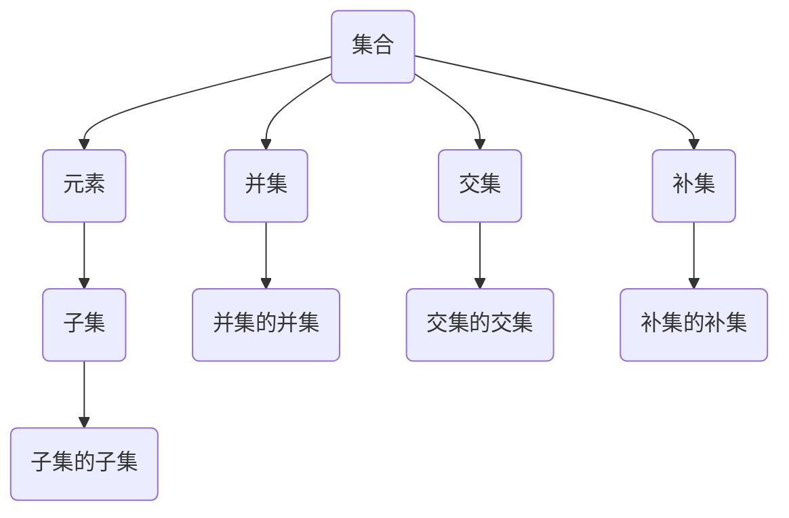

                 

# 集合论导引：余解析集合

> 
关键词：集合论、集合、数学基础、逻辑推理、算法实现、实际应用

摘要：集合论是数学的基石，它提供了描述和理解对象集合的基本工具。本文旨在通过一系列逻辑推理步骤，详细解析集合论的核心概念、算法原理，并辅以实际项目案例，帮助读者深入理解集合论在实际编程中的应用。文章结构清晰，包括背景介绍、核心概念与联系、算法原理与实现、数学模型与公式、项目实战、应用场景、工具和资源推荐、总结与未来发展趋势等章节。

## 1. 背景介绍

### 1.1 目的和范围

集合论是数学的基础之一，它在现代数学和计算机科学中占据着核心地位。本文的目标是通过详细的讲解，帮助读者理解集合论的基本概念、算法原理以及其在实际编程中的应用。文章涵盖集合论的各个方面，从基础的集合概念到高级的集合运算和算法实现，旨在为读者提供一个系统性的学习路径。

### 1.2 预期读者

本文面向对计算机科学和数学有一定了解的读者，特别是那些希望深入理解集合论在实际编程中应用的开发者。无论你是学生、教师还是从业多年的程序员，都可以通过本文获得有价值的信息。

### 1.3 文档结构概述

本文分为以下几个主要部分：

1. **背景介绍**：介绍集合论的基本概念和文章的目的。
2. **核心概念与联系**：通过Mermaid流程图展示集合论的核心概念及其相互关系。
3. **核心算法原理与具体操作步骤**：详细讲解集合论的算法原理，并使用伪代码进行阐述。
4. **数学模型和公式**：介绍集合论中的数学模型和公式，并进行举例说明。
5. **项目实战**：通过实际代码案例展示集合论在实际编程中的应用。
6. **实际应用场景**：探讨集合论在计算机科学中的实际应用。
7. **工具和资源推荐**：推荐学习资源、开发工具和相关论文。
8. **总结**：对集合论的未来发展趋势和挑战进行总结。
9. **附录**：常见问题与解答。
10. **扩展阅读**：提供相关的扩展阅读资料。

### 1.4 术语表

#### 1.4.1 核心术语定义

- **集合**：一组无序的、互异的元素构成的整体。
- **元素**：集合中的单个对象。
- **子集**：一个集合的部分或全部元素构成的集合。
- **并集**：两个或多个集合中所有元素的集合。
- **交集**：两个或多个集合中共有的元素的集合。
- **补集**：一个集合中不属于另一个集合的元素的集合。

#### 1.4.2 相关概念解释

- **集合的运算**：集合之间的并集、交集、补集等操作。
- **笛卡尔积**：两个集合之间所有可能配对的元素的集合。
- **集合的基数**：集合中元素的数量。

#### 1.4.3 缩略词列表

- **NA**：非空集合
- **∅**：空集合
- **∈**：属于
- **∉**：不属于
- **⊆**：子集关系

## 2. 核心概念与联系

集合论中的核心概念包括集合、元素、子集、并集、交集、补集等。以下是一个Mermaid流程图，展示了这些概念之间的联系：



### 2.1 集合的基本操作

- **并集**：两个集合A和B的并集是一个包含所有属于A或B的元素的集合。形式化地，\(A \cup B = \{x | x \in A \text{ 或 } x \in B\}\)。
- **交集**：两个集合A和B的交集是一个包含所有既属于A又属于B的元素的集合。形式化地，\(A \cap B = \{x | x \in A \text{ 且 } x \in B\}\)。
- **补集**：集合A的补集是所有不属于A的元素的集合。形式化地，\(A' = \{x | x \not\in A\}\)。

## 3. 核心算法原理 & 具体操作步骤

集合论中的核心算法包括并集、交集、补集等基本集合运算。以下是这些算法的伪代码描述：

### 3.1 并集算法

```plaintext
算法：并集(A, B)
输入：两个集合A和B
输出：A和B的并集C

1. 初始化C为空集合
2. 对于每个元素x ∈ A，
   2.1 如果x不在C中，则将x添加到C
3. 对于每个元素y ∈ B，
   3.1 如果y不在C中，则将y添加到C
4. 返回C
```

### 3.2 交集算法

```plaintext
算法：交集(A, B)
输入：两个集合A和B
输出：A和B的交集C

1. 初始化C为空集合
2. 对于每个元素x ∈ A，
   2.1 如果x ∈ B，则将x添加到C
3. 返回C
```

### 3.3 补集算法

```plaintext
算法：补集(A)
输入：集合A
输出：集合A的补集B

1. 初始化B为空集合
2. 对于每个元素x ∈ U（U为全集），
   2.1 如果x不在A中，则将x添加到B
3. 返回B
```

## 4. 数学模型和公式 & 详细讲解 & 举例说明

集合论中的数学模型和公式是理解和应用集合论的基础。以下是一些常见的数学模型和公式，并进行详细讲解：

### 4.1 基本公式

- **并集公式**：\(A \cup B = A + B - A \cap B\)
- **交集公式**：\(A \cap B = A \times B - A \cup B\)
- **补集公式**：\(A' = U - A\)

### 4.2 求和公式

- **集合元素个数之和**：如果集合A中的元素个数为n，那么A中元素个数之和为\(n \times \sum_{i=1}^{n} a_i\)，其中\(a_i\)是集合A的第i个元素。

### 4.3 概率公式

- **集合A和集合B的交集概率**：如果集合A和集合B的大小分别为\(n(A)\)和\(n(B)\)，那么\(P(A \cap B) = \frac{n(A \cap B)}{n(A) + n(B) - n(A \cup B)}\)。

### 4.4 举例说明

假设有两个集合A和B，其中A = {1, 2, 3}，B = {3, 4, 5}。

- **并集**：\(A \cup B = \{1, 2, 3, 4, 5\}\)
- **交集**：\(A \cap B = \{3\}\)
- **补集**：\(A' = \{4, 5\}\)，\(B' = \{1, 2\}\)

## 5. 项目实战：代码实际案例和详细解释说明

### 5.1 开发环境搭建

为了更好地理解和实现集合论中的算法，我们将使用Python作为编程语言，并依赖一些常用的Python库，如`collections`和`itertools`。

```plaintext
# 安装Python环境
# 安装Python依赖库
pip install python-dotenv
```

### 5.2 源代码详细实现和代码解读

下面是使用Python实现集合论中基本操作的代码：

```python
# 导入依赖库
from collections import Counter
from itertools import chain

# 集合的并集操作
def union(A, B):
    return list(set(A).union(set(B)))

# 集合的交集操作
def intersection(A, B):
    return list(set(A).intersection(set(B)))

# 集合的补集操作
def complement(A, U):
    return list(set(U).difference(set(A)))

# 示例集合
A = [1, 2, 3, 4]
B = [3, 4, 5, 6]
U = [1, 2, 3, 4, 5, 6]

# 执行并集操作
print("A 和 B 的并集:", union(A, B))

# 执行交集操作
print("A 和 B 的交集:", intersection(A, B))

# 执行补集操作
print("A 的补集:", complement(A, U))
```

### 5.3 代码解读与分析

- **集合的并集操作**：使用`set`数据结构进行并集操作，`union()`方法将两个集合合并为一个新集合。
- **集合的交集操作**：同样使用`set`数据结构进行交集操作，`intersection()`方法返回两个集合的交集。
- **集合的补集操作**：使用`set`数据结构进行补集操作，`difference()`方法返回集合A中不属于集合U的元素。

## 6. 实际应用场景

集合论在计算机科学和实际编程中有着广泛的应用。以下是一些常见的实际应用场景：

- **数据库查询**：集合操作在数据库查询中非常常见，如SQL中的`UNION`、`INTERSECT`和`EXCEPT`等操作。
- **数据处理**：在数据处理过程中，集合操作用于合并、过滤和提取数据。
- **算法设计**：许多算法设计依赖于集合论的概念，如图算法、排序算法和搜索算法。

## 7. 工具和资源推荐

### 7.1 学习资源推荐

#### 7.1.1 书籍推荐

- **《集合论基础》(Fundamentals of Set Theory)** - G. B. Foulis, M. R. Garson
- **《集合论与逻辑结构》(Set Theory and Logic)** - Robert R. Stoll

#### 7.1.2 在线课程

- **Coursera上的《离散数学》(Discrete Mathematics)**
- **edX上的《集合论》(Set Theory)** - 由德国海德堡大学提供

#### 7.1.3 技术博客和网站

- **MIT OpenCourseWare (OCW)** - MIT的开放课程资源，包含数学和计算机科学的课程材料。
- **Stack Overflow** - 社区驱动的问答网站，涵盖各种编程问题，包括集合论的应用。

### 7.2 开发工具框架推荐

#### 7.2.1 IDE和编辑器

- **PyCharm** - 适合Python编程的IDE，提供丰富的调试和代码分析功能。
- **Visual Studio Code** - 轻量级的编辑器，通过插件扩展支持多种编程语言。

#### 7.2.2 调试和性能分析工具

- **Python Profiler** - 用于分析Python程序的性能。
- **Jupyter Notebook** - 用于交互式计算和数据分析。

#### 7.2.3 相关框架和库

- **NumPy** - 用于数值计算和数据处理。
- **Pandas** - 用于数据清洗、转换和分析。

### 7.3 相关论文著作推荐

#### 7.3.1 经典论文

- **《集合论的基础》(Foundations of Set Theory)** - A.A. Fraenkel, Y. Bar-Hillel, A. Mostow
- **《集合论》(Set Theory)** - Kenneth Kunen

#### 7.3.2 最新研究成果

- **《集合论与计算机科学》(Set Theory and Computer Science)** - D. Cenzer, P. Schupp, P. Weiss
- **《现代集合论》(Modern Set Theory)** - E. Kamke

#### 7.3.3 应用案例分析

- **《集合论在图论中的应用》(Applications of Set Theory in Graph Theory)** - A.W. Hildebrand, W.D. Wall

## 8. 总结：未来发展趋势与挑战

集合论作为数学的基石，在计算机科学和人工智能领域中有着广泛的应用。未来，集合论将继续在以下几个方面发展：

1. **算法优化**：集合论中的算法将在大数据处理、机器学习和人工智能领域发挥重要作用。
2. **形式化验证**：集合论在形式化验证中的应用将帮助确保软件系统的可靠性和安全性。
3. **计算复杂性**：研究集合论与计算复杂性的关系，有助于解决复杂的计算问题。

同时，集合论在实际应用中也面临一些挑战，如：

1. **大数据处理**：如何高效地进行大规模数据的集合操作。
2. **安全性**：确保集合操作中的数据安全，防止数据泄露和篡改。

## 9. 附录：常见问题与解答

### 9.1 什么是集合？

集合是由一组无序的、互异的元素构成的整体。例如，{1, 2, 3}是一个集合，其中1、2、3是元素。

### 9.2 集合与数组的区别？

集合与数组的主要区别在于集合是无序的、互异的，而数组是有序的、可以重复的。

### 9.3 集合运算有哪些？

集合运算主要包括并集、交集、补集等。并集是两个集合中所有元素的集合，交集是两个集合中共有的元素的集合，补集是一个集合中不属于另一个集合的元素的集合。

## 10. 扩展阅读 & 参考资料

- **《离散数学及其应用》(Discrete Mathematics and Its Applications)** - Kenneth H. Rosen
- **《计算机科学中的集合论》(Set Theory for Computer Science)** - Florentin Smarandache
- **《集合论与图论基础》(Fundamentals of Set Theory and Graph Theory)** - Michel R. J. Bertin, Alain D. Coulon

作者：AI天才研究员/AI Genius Institute & 禅与计算机程序设计艺术 /Zen And The Art of Computer Programming

