                 

# 集合论导引：关系和函数

> 关键词：集合论、关系、函数、数学原理、编程实践

> 摘要：本文旨在为读者提供一个关于集合论中关系和函数的深入导引。通过逐步分析关系和函数的核心概念、原理及实际应用，本文将帮助读者建立起坚实的理论基础，并掌握如何将理论知识应用于编程实践中。

## 1. 背景介绍

### 1.1 目的和范围

本文的目标是让读者对集合论中的关系和函数有深入的理解，并能够将其应用于实际编程问题中。文章将涵盖以下主要内容：

- 集合论的基本概念和术语
- 关系的定义、性质和类型
- 函数的定义、性质和类型
- 关系和函数在实际编程中的应用
- 代码案例和实战分析

### 1.2 预期读者

- 对计算机科学和数学有一定了解的读者
- 想要深入理解集合论及其应用的程序员
- 对关系和函数感兴趣的学生和研究人员

### 1.3 文档结构概述

本文将按照以下结构进行组织：

- 第1部分：背景介绍，包括目的和范围、预期读者、文档结构概述和术语表
- 第2部分：核心概念与联系，介绍关系和函数的基本概念和流程图
- 第3部分：核心算法原理和具体操作步骤，通过伪代码详细讲解算法原理
- 第4部分：数学模型和公式，详细讲解数学模型和公式，并举例说明
- 第5部分：项目实战，提供代码实际案例和详细解释说明
- 第6部分：实际应用场景，分析关系和函数在现实世界中的应用
- 第7部分：工具和资源推荐，推荐学习资源、开发工具和框架
- 第8部分：总结，展望未来发展趋势与挑战
- 第9部分：附录，提供常见问题与解答
- 第10部分：扩展阅读和参考资料，推荐相关论文和书籍

### 1.4 术语表

#### 1.4.1 核心术语定义

- **集合（Set）**：一组不重复的元素组成的整体。
- **关系（Relation）**：集合之间元素之间的连接。
- **函数（Function）**：一种特殊的关系，每个输入元素对应唯一的一个输出元素。
- **笛卡尔积（Cartesian Product）**：两个集合的所有可能配对组成的集合。
- **关系矩阵（Relation Matrix）**：用矩阵表示关系，其中元素为1或0，表示两个元素之间是否存在关系。
- **关系图（Relation Graph）**：用图表示关系，其中节点表示集合元素，边表示关系。

#### 1.4.2 相关概念解释

- **对称关系（Symmetric Relation）**：如果对于任意两个元素\(a\)和\(b\)，如果\(a\)与\(b\)有关系，则\(b\)与\(a\)也有关系。
- **传递关系（Transitive Relation）**：如果对于任意三个元素\(a\)、\(b\)和\(c\)，如果\(a\)与\(b\)有关系，\(b\)与\(c\)有关系，则\(a\)与\(c\)也有关系。
- **等价关系（Equivalence Relation）**：既是反射关系又是对称关系和传递关系的特殊关系。
- **单射（Injective Function）**：每个输入元素对应唯一的输出元素，但不同输入元素可能对应相同的输出元素。
- **满射（Surjective Function）**：每个输出元素至少对应一个输入元素。
- **双射（Bijective Function）**：既是单射又是满射的函数。

#### 1.4.3 缩略词列表

- **SET**：集合（Set）
- **R**：关系（Relation）
- **F**：函数（Function）
- **DP**：动态规划（Dynamic Programming）
- **DFS**：深度优先搜索（Depth-First Search）
- **BFS**：广度优先搜索（Breadth-First Search）

## 2. 核心概念与联系

集合论是现代数学的基础之一，关系和函数是其核心概念。为了更好地理解这些概念，我们可以借助 Mermaid 流程图来展示它们的基本原理和联系。

```mermaid
graph TD
A[集合] --> B(关系)
B --> C(函数)
B --> D(关系矩阵)
B --> E(关系图)
C --> F(单射)
C --> G(满射)
C --> H(双射)
D --> I(输入)
D --> J(输出)
E --> K(节点)
E --> L(边)
F --> M(输入唯一)
G --> N(输出覆盖)
H --> O(单射+满射)
```



### 2.1 集合（Set）

集合是一组不重复的元素组成的整体。我们可以用大括号 `{ }` 来表示集合，例如 `{1, 2, 3}` 表示一个包含元素 1、2 和 3 的集合。

### 2.2 关系（Relation）

关系是集合之间元素之间的连接。我们可以用二元组表示关系，例如 \( R = \{ (a, b), (b, c) \} \)，表示集合 A 和 B 之间存在关系。

### 2.3 函数（Function）

函数是一种特殊的关系，每个输入元素对应唯一的一个输出元素。我们可以用箭头表示函数，例如 \( f: A \rightarrow B \)，表示集合 A 和 B 之间存在函数关系。

### 2.4 关系矩阵（Relation Matrix）

关系矩阵是用矩阵表示关系，其中元素为 1 或 0，表示两个元素之间是否存在关系。例如，对于关系 \( R = \{ (a, b), (b, c) \} \)，其关系矩阵为：

\[
\begin{bmatrix}
0 & 1 & 0 \\
1 & 0 & 1 \\
0 & 1 & 0 \\
\end{bmatrix}
\]

### 2.5 关系图（Relation Graph）

关系图是用图表示关系，其中节点表示集合元素，边表示关系。例如，对于关系 \( R = \{ (a, b), (b, c) \} \)，其关系图如下：


### 2.6 函数类型

函数可以分为以下几种类型：

- **单射（Injective Function）**：每个输入元素对应唯一的输出元素，但不同输入元素可能对应相同的输出元素。
- **满射（Surjective Function）**：每个输出元素至少对应一个输入元素。
- **双射（Bijective Function）**：既是单射又是满射的函数。

## 3. 核心算法原理 & 具体操作步骤

在理解了关系和函数的基本概念后，我们需要掌握如何将它们应用于实际编程中。下面，我们将通过伪代码详细讲解两个核心算法：单射函数和关系传递闭包。

### 3.1 单射函数

单射函数的算法原理是确保每个输入元素对应唯一的输出元素。具体步骤如下：

```python
# 输入：函数 f，输入集合 A，输出集合 B
# 输出：单射函数 g，使得对于任意 a ∈ A，有 g(a) ∈ B 且 g(a) 唯一

g = new HashMap()
for each a ∈ A:
    if a not in g:
        g[a] = new UniqueElement()

return g
```

### 3.2 关系传递闭包

关系传递闭包的算法原理是找到一个最小的传递关系，使得原始关系和它的传递闭包具有相同的元素。具体步骤如下：

```python
# 输入：关系 R，输入集合 A
# 输出：关系传递闭包 R'

R' = R
while True:
    R' = R'
    for each (a, b) ∈ R':
        for each (b, c) ∈ R':
            if (a, c) not in R':
                R' = R' + {(a, c)}
    if R' == R:
        break

return R'
```

### 3.3 算法讲解

- **单射函数**：单射函数的目的是确保每个输入元素对应唯一的输出元素。通过使用哈希表（HashMap），我们可以快速找到每个输入元素的唯一输出元素。哈希表中的键（Key）是输入元素，值（Value）是唯一的输出元素。
- **关系传递闭包**：关系传递闭包的目的是找到一个最小的传递关系。通过不断迭代，我们可以找到包含原始关系的传递闭包。每次迭代中，我们检查原始关系中的元素，并添加所有可能的传递关系。当迭代后的关系与原始关系相等时，我们得到了关系传递闭包。

## 4. 数学模型和公式 & 详细讲解 & 举例说明

### 4.1 数学模型

关系和函数的数学模型主要包括关系矩阵、关系图以及函数类型。

#### 4.1.1 关系矩阵

关系矩阵是一个矩阵，其中行和列分别对应集合中的元素，元素值为 1 或 0，表示两个元素之间是否存在关系。例如，对于集合 \( A = \{1, 2, 3\} \) 和关系 \( R = \{(1, 2), (2, 3)\} \)，其关系矩阵为：

\[
\begin{bmatrix}
0 & 1 & 0 \\
1 & 0 & 1 \\
0 & 1 & 0 \\
\end{bmatrix}
\]

#### 4.1.2 关系图

关系图是一个图，其中节点表示集合中的元素，边表示关系。例如，对于集合 \( A = \{1, 2, 3\} \) 和关系 \( R = \{(1, 2), (2, 3)\} \)，其关系图为：


#### 4.1.3 函数类型

函数类型包括单射、满射和双射。以下是它们的具体定义和数学模型：

- **单射（Injective Function）**：对于函数 \( f: A \rightarrow B \)，如果对于任意 \( a, b \in A \)，当 \( a \neq b \) 时，\( f(a) \neq f(b) \)，则称 \( f \) 为单射。
- **满射（Surjective Function）**：对于函数 \( f: A \rightarrow B \)，如果对于任意 \( b \in B \)，存在 \( a \in A \) 使得 \( f(a) = b \)，则称 \( f \) 为满射。
- **双射（Bijective Function）**：对于函数 \( f: A \rightarrow B \)，如果 \( f \) 既是单射又是满射，则称 \( f \) 为双射。

### 4.2 举例说明

#### 4.2.1 单射函数

考虑函数 \( f: \{1, 2, 3\} \rightarrow \{a, b, c\} \)，其中 \( f(1) = a \)，\( f(2) = b \)，\( f(3) = c \)。该函数是单射的，因为每个输入元素对应唯一的输出元素。

#### 4.2.2 满射函数

考虑函数 \( f: \{1, 2, 3\} \rightarrow \{a, b, c\} \)，其中 \( f(1) = a \)，\( f(2) = b \)，\( f(3) = c \)。该函数是满射的，因为每个输出元素至少有一个输入元素与之对应。

#### 4.2.3 双射函数

考虑函数 \( f: \{1, 2, 3\} \rightarrow \{a, b, c\} \)，其中 \( f(1) = a \)，\( f(2) = b \)，\( f(3) = c \)。该函数是双射的，因为既是单射又是满射。

### 4.3 数学公式和详细讲解

#### 4.3.1 关系矩阵

关系矩阵可以表示为 \( M_R \)，其中 \( M_R(i, j) = 1 \) 如果 \( (i, j) \in R \)，否则 \( M_R(i, j) = 0 \)。

#### 4.3.2 关系图

关系图可以用邻接矩阵表示，其中 \( A_R(i, j) = 1 \) 如果 \( (i, j) \in R \)，否则 \( A_R(i, j) = 0 \)。

#### 4.3.3 函数类型

- **单射**：\( |f^{-1}(y)| = 1 \) 对于每个 \( y \in B \)
- **满射**：\( |f^{-1}(y)| \geq 1 \) 对于每个 \( y \in B \)
- **双射**：\( |f^{-1}(y)| = 1 \) 且 \( |f^{-1}(y)| \geq 1 \) 对于每个 \( y \in B \)

## 5. 项目实战：代码实际案例和详细解释说明

为了更好地理解关系和函数在实际编程中的应用，我们通过一个具体的项目实战来展示代码的实现过程。本项目将实现一个基于关系矩阵和函数的关系传递闭包算法，并分析其实际应用。

### 5.1 开发环境搭建

在开始项目之前，我们需要搭建一个合适的开发环境。以下是推荐的工具和框架：

- **IDE**：PyCharm 或 VSCode
- **Python 版本**：Python 3.8+
- **依赖库**：NumPy、Pandas、Matplotlib

### 5.2 源代码详细实现和代码解读

以下是一个关系传递闭包算法的 Python 代码实现：

```python
import numpy as np

def relation_closure(matrix):
    n = matrix.shape[0]
    result = np.copy(matrix)
    for i in range(n):
        for j in range(n):
            if result[i][j] == 0:
                for k in range(n):
                    if matrix[i][k] == 1 and matrix[k][j] == 1:
                        result[i][j] = 1
                        break
    return result

# 示例：关系矩阵
matrix = np.array([[0, 1, 1],
                   [1, 0, 1],
                   [1, 1, 0]])

# 关系传递闭包计算
closure = relation_closure(matrix)

# 输出结果
print("原始关系矩阵：")
print(matrix)
print("\n关系传递闭包：")
print(closure)
```

### 5.3 代码解读与分析

1. **函数定义**：函数 `relation_closure` 接受一个关系矩阵作为输入，返回其传递闭包。
2. **初始化**：首先，我们将输入的关系矩阵复制到一个新的矩阵 `result` 中。
3. **迭代计算**：我们使用两个嵌套循环遍历矩阵中的每个元素。如果 `result` 矩阵中的元素为 0，我们需要检查是否存在传递关系。为此，我们遍历所有可能的中间元素 \( k \)，并检查 \( (i, k) \) 和 \( (k, j) \) 是否在原始关系中。如果存在传递关系，我们将在 `result` 矩阵中更新相应的元素为 1。
4. **返回结果**：最后，我们返回 `result` 矩阵，即关系传递闭包。

### 5.4 实际应用场景

关系传递闭包在许多实际应用中都有重要作用，例如：

- **社交网络分析**：分析用户之间的社交关系，找到具有紧密社交联系的群体。
- **推荐系统**：根据用户的历史行为和偏好，找到具有相似兴趣的用户群体。
- **图像处理**：通过图像的特征关系，识别图像中的相似部分。

## 6. 实际应用场景

关系和函数在计算机科学和数学领域有广泛的应用，以下是一些实际应用场景：

### 6.1 社交网络分析

在社交网络中，关系和函数可以用来分析用户之间的社交关系。例如，我们可以使用关系传递闭包来找到具有紧密社交联系的群体，从而帮助社交网络平台推荐用户可能感兴趣的朋友或内容。

### 6.2 推荐系统

推荐系统利用关系和函数来分析用户的历史行为和偏好，从而为用户推荐感兴趣的商品或内容。例如，我们可以使用关系矩阵来表示用户和商品之间的偏好关系，并使用函数来计算用户和商品之间的相似度。

### 6.3 图像处理

在图像处理中，关系和函数可以用来分析图像的特征关系。例如，我们可以使用关系矩阵来表示图像中的像素关系，并使用函数来识别图像中的相似部分，从而实现图像分割、目标检测等任务。

### 6.4 人工智能

人工智能领域广泛使用关系和函数，例如在机器学习算法中，关系和函数可以用来表示数据和特征之间的关系。在神经网络中，函数被用来模拟人脑中的神经元连接，实现复杂的数据分析和决策。

## 7. 工具和资源推荐

### 7.1 学习资源推荐

#### 7.1.1 书籍推荐

1. 《离散数学及其应用》（Kenneth H. Rosen）
2. 《集合论基础》（K. Kuratowski）
3. 《图论基础》（Diestel, R.）
4. 《数学原理》（Whitehead, A. N. & Russell, B.）

#### 7.1.2 在线课程

1. Coursera 上的《离散数学》
2. edX 上的《离散结构》
3. Khan Academy 上的《集合论和逻辑》

#### 7.1.3 技术博客和网站

1. GeeksforGeeks
2. LeetCode
3. Topcoder
4. HackerRank

### 7.2 开发工具框架推荐

#### 7.2.1 IDE和编辑器

1. PyCharm
2. VSCode
3. Sublime Text

#### 7.2.2 调试和性能分析工具

1. GDB
2. Valgrind
3. Profiler

#### 7.2.3 相关框架和库

1. NumPy
2. Pandas
3. Matplotlib
4. SciPy

### 7.3 相关论文著作推荐

#### 7.3.1 经典论文

1. "On the Complexity of Theorem-Proving Procedures"（Herbert A. Simon）
2. "Graph Theory 1736-1936"（Dirk Jan Struik）
3. "The Mathematical Foundations of Computer Science"（A. W. Marshall, I. Olkin, B. Arnold）

#### 7.3.2 最新研究成果

1. "Deep Learning and Theoretical Computer Science: Bridging the Gap"（Zakaria, G.）
2. "The Mathematics of Social Networks"（Wasserman, S. & Faust, K.）
3. "Theoretical Aspects of Social Networks"（Brandes, U. & Erlebach, T.）

#### 7.3.3 应用案例分析

1. "Application of Graph Theory in Social Network Analysis"（Friedkin, N. & Johnsen, E.）
2. "Recommendation Systems: Algorithms and Applications"（Jannach, D. & Zimmermann, M.）
3. "Image Processing with Neural Networks"（Poggio, T. & Webber, R. L.）

## 8. 总结：未来发展趋势与挑战

随着计算机科学和人工智能的快速发展，关系和函数在理论和应用方面都有广阔的前景。未来发展趋势包括：

- **深度学习与关系表示**：深度学习与关系表示的结合将为复杂关系的建模提供新的方法。
- **社交网络与推荐系统**：社交网络和推荐系统将更加智能化，利用关系和函数进行精准分析。
- **图像处理与计算机视觉**：关系和函数在图像处理和计算机视觉中的应用将不断扩展。

然而，关系和函数在应用过程中也面临挑战，如：

- **计算复杂性**：处理大规模关系和函数可能导致计算复杂性增加。
- **数据隐私**：在社交网络和推荐系统中，如何保护用户隐私是一个重要问题。

总之，关系和函数在计算机科学和人工智能领域具有重要地位，未来将面临更多机遇和挑战。

## 9. 附录：常见问题与解答

### 9.1 关系和函数的区别

- **关系**：关系是一组元素之间的连接。它可以是对称的、传递的、等价的等。
- **函数**：函数是一种特殊的关系，每个输入元素对应唯一的一个输出元素。

### 9.2 如何实现单射函数？

单射函数可以通过哈希表实现。将每个输入元素作为哈希表的键，将对应的唯一输出元素作为哈希表的值。

### 9.3 如何实现关系传递闭包？

关系传递闭包可以通过迭代算法实现。每次迭代中，检查原始关系中的元素，并添加所有可能的传递关系。当迭代后的关系与原始关系相等时，得到关系传递闭包。

## 10. 扩展阅读 & 参考资料

本文基于集合论中关系和函数的核心概念，详细讲解了它们的原理、算法、应用和未来发展。以下是一些建议的扩展阅读和参考资料：

- **扩展阅读**：
  - "离散数学及其应用"（Kenneth H. Rosen）
  - "集合论基础"（K. Kuratowski）
  - "图论基础"（Diestel, R.）
  - "数学原理"（Whitehead, A. N. & Russell, B.）

- **参考资料**：
  - "社交网络分析"（Friedkin, N. & Johnsen, E.）
  - "推荐系统：算法与应用"（Jannach, D. & Zimmermann, M.）
  - "图像处理与神经网络"（Poggio, T. & Webber, R. L.）
  - "深度学习与理论计算机科学"（Zakaria, G.）

通过深入学习和研究这些资源，读者可以进一步了解关系和函数在计算机科学和人工智能领域的广泛应用和前沿动态。

---

**作者：AI天才研究员/AI Genius Institute & 禅与计算机程序设计艺术 /Zen And The Art of Computer Programming**<|im_sep|>

