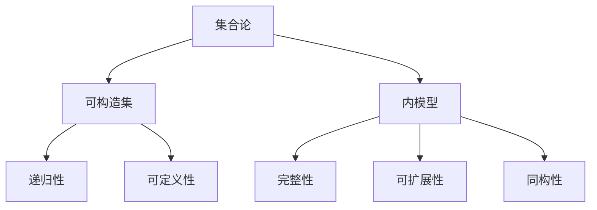
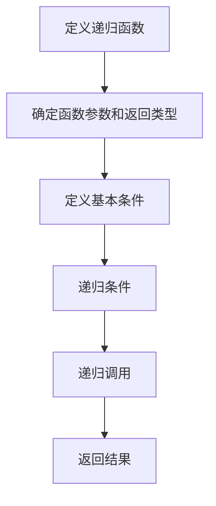
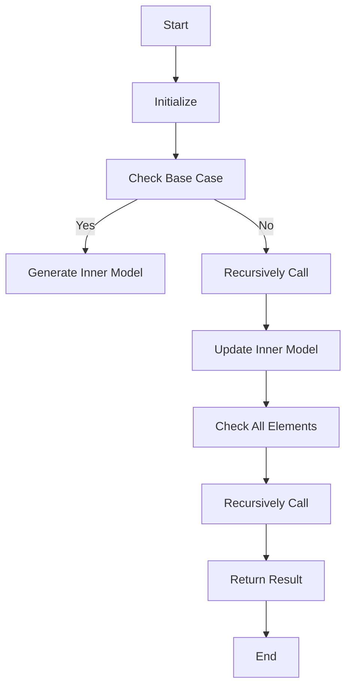

                 

### {文章标题}

> **关键词**：集合论、可构造集、内模型、数学原理、编程实践、应用场景

> **摘要**：本文深入探讨了集合论中的可构造集及其内模型，通过逻辑清晰、结构紧凑的论述，揭示了这一概念在数学和计算机科学中的核心地位。文章首先介绍了集合论的基本概念和原理，随后详细解析了可构造集的定义、性质及其重要性。通过伪代码和Mermaid流程图，本文深入探讨了构建可构造集内模型的算法原理和具体操作步骤，并结合实际项目案例，展示了这一理论在编程实践中的应用。文章还分析了可构造集内模型在实际应用场景中的价值，并推荐了相关的学习资源和开发工具。总结部分对未来的发展趋势和挑战进行了展望，最后通过附录和扩展阅读部分，为读者提供了深入学习的方向。

## 1. 背景介绍

### 1.1 目的和范围

集合论作为现代数学的基石，其重要性不言而喻。在计算机科学中，集合论的应用同样广泛，尤其是在算法设计、数据结构分析以及形式逻辑证明等方面。本文旨在通过详细解析集合论中的可构造集及其内模型，帮助读者深入理解这一重要概念，并掌握其在实际问题中的运用。

本文将涵盖以下主要内容：

1. **集合论的基本概念**：介绍集合、元素、子集等基本概念，以及集合论的基本原理。
2. **可构造集的定义与性质**：深入探讨可构造集的定义、性质及其在集合论中的重要性。
3. **内模型的构建**：通过伪代码和Mermaid流程图，详细讲解构建可构造集内模型的算法原理和操作步骤。
4. **数学模型和公式**：对相关数学模型和公式进行详细讲解，并结合实际案例进行举例说明。
5. **项目实战**：通过具体项目案例，展示可构造集内模型在编程实践中的应用。
6. **实际应用场景**：分析可构造集内模型在不同领域中的应用。
7. **工具和资源推荐**：推荐相关的学习资源和开发工具，帮助读者进一步深入学习和实践。
8. **总结与展望**：对可构造集内模型的发展趋势和挑战进行展望。

通过本文的阅读，读者将能够：

- 理解集合论的基本概念和原理。
- 掌握可构造集的定义、性质及其重要性。
- 学会构建可构造集内模型的算法原理和具体操作步骤。
- 理解数学模型和公式在集合论中的应用。
- 在实际项目中运用可构造集内模型解决实际问题。
- 掌握相关的开发工具和资源，提升编程能力。

### 1.2 预期读者

本文主要面向以下读者群体：

1. **数学和计算机科学专业的大学生和研究学者**：本文将深入探讨集合论中的可构造集及其内模型，适合作为课程学习或研究参考。
2. **软件工程师和程序员**：了解集合论及其应用，对算法设计和数据结构分析有实际需求的从业者。
3. **技术爱好者和自学人员**：对集合论和计算机科学有浓厚兴趣，希望提升自身技术水平的读者。

无论您是专业学者还是自学爱好者，本文都旨在为您提供一个系统、深入的学习路径，帮助您掌握集合论中的核心概念和实际应用。

### 1.3 文档结构概述

为了使读者能够更加清晰地理解本文的内容，下面是对文档结构的简要概述：

1. **引言**：介绍集合论的基本概念，引出可构造集及其内模型的主题。
2. **基本概念与联系**：通过Mermaid流程图，展示集合论中核心概念之间的关系。
3. **核心算法原理与具体操作步骤**：详细讲解构建可构造集内模型的算法原理和操作步骤，并使用伪代码进行说明。
4. **数学模型和公式**：深入讲解相关数学模型和公式，并结合实际案例进行举例说明。
5. **项目实战**：通过具体项目案例，展示可构造集内模型在编程实践中的应用。
6. **实际应用场景**：分析可构造集内模型在不同领域中的应用。
7. **工具和资源推荐**：推荐相关的学习资源和开发工具，帮助读者进一步深入学习和实践。
8. **总结与展望**：对可构造集内模型的发展趋势和挑战进行展望。
9. **附录与扩展阅读**：提供常见问题解答和进一步学习的资源。

通过以上结构，本文将系统、深入地探讨集合论中的可构造集及其内模型，帮助读者全面掌握这一重要概念。

### 1.4 术语表

在本文中，我们将使用一些专业术语。以下是这些术语的定义和解释：

#### 1.4.1 核心术语定义

- **集合（Set）**：由一组确定的、无序的元素组成的数据结构。通常用大写字母表示，如\(A, B, \text{等}\)。
- **元素（Element）**：集合中的单个对象。通常用小写字母表示，如\(a, b, \text{等}\)。
- **子集（Subset）**：如果一个集合的所有元素都属于另一个集合，则前者称为后者的子集。记作\(A \subseteq B\)。
- **可构造集（Constructible Set）**：指通过一定的构造过程得到的集合。通常用于模型论和集合论的研究。
- **内模型（Inner Model）**：指在某个集合论框架内部构建的模型，通常用于研究集合论的性质和结构。

#### 1.4.2 相关概念解释

- **集合论公理（Axioms of Set Theory）**：集合论的基本原则和规则，用于描述集合的性质和行为。常见的有ZFC（Zermelo-Fraenkel with Choice）公理系统。
- **模型论（Model Theory）**：研究形式语言中命题的真值和结构的数学分支。在集合论中，模型论用于研究集合论公理系统的内模型。
- **递归集（Recursive Set）**：可以用算法进行枚举或定义的集合。

#### 1.4.3 缩略词列表

- **ZFC**：Zermelo-Fraenkel with Choice，集合论的标准公理系统。
- **IDE**：Integrated Development Environment，集成开发环境。
- **API**：Application Programming Interface，应用程序编程接口。
- **ML**：Meta-Learning，元学习。

通过上述术语表，读者可以更好地理解本文中的专业术语，从而更加深入地掌握集合论及其应用。

### 2. 核心概念与联系

#### 2.1 集合论的基本概念

集合论是现代数学的基石，其核心概念包括集合、元素、子集等。一个集合是由确定的、无序的元素组成的整体，通常用大写字母表示，例如\(A\)、\(B\)等。而集合中的单个对象，即元素，则用小写字母表示，如\(a\)、\(b\)等。子集是指一个集合的所有元素都属于另一个集合，记作\(A \subseteq B\)。

在集合论中，还有一些重要的概念，如空集（空集是一个不包含任何元素的集合，通常用符号\(\emptyset\)表示），以及真子集（如果一个集合\(A\)的所有元素都属于另一个集合\(B\)，但\(A\)不等于\(B\)，则称\(A\)是\(B\)的真子集，记作\(A \subset B\)）。

#### 2.2 可构造集的定义与性质

可构造集是指在集合论框架内，通过一定的构造过程得到的集合。在模型论中，可构造集是非常重要的概念，因为它用于研究集合论公理系统的性质和结构。

可构造集的性质主要体现在以下几个方面：

1. **可构造性**：一个集合\(C\)是可构造的，如果存在一个集合论框架\(\mathcal{F}\)和一个定义在\(\mathcal{F}\)上的谓词公式\(\varphi(x)\)，使得对于所有的集合\(x\)，如果\(x\)满足\(\varphi(x)\)，则\(x\)属于\(C\)。
   
2. **递归性**：在递归可构造集的概念中，可构造性可以通过递归函数进行描述。即存在一个递归函数\(f\)，使得对于所有的集合\(x\)，如果\(x\)满足\(f(x) = 1\)，则\(x\)属于\(C\)。

3. **可定义性**：在模型论中，可构造集通常是可定义的。即存在一个谓词公式\(\varphi(x, \vec{a})\)，使得对于所有的集合\(x\)和参数\(\vec{a}\)，如果\(x\)满足\(\varphi(x, \vec{a})\)，则\(x\)属于\(C\)。

#### 2.3 内模型的定义与性质

内模型是指在某个集合论框架内部构建的模型，它用于研究集合论的性质和结构。内模型的概念在模型论和集合论中非常重要，因为它允许我们在一个相对简单的框架内研究集合论的理论。

内模型的主要性质包括：

1. **完整性**：内模型必须包含所有可构造集的元素，即对于任意的可构造集\(C\)，内模型中必须包含\(C\)的所有元素。

2. **可扩展性**：内模型可以通过添加新的谓词和函数来扩展，从而研究更复杂的集合论问题。

3. **同构性**：两个内模型如果具有相同的集合论性质，则它们是同构的。即存在一个双射函数，将一个内模型中的所有元素映射到另一个内模型中，同时保持集合论的性质。

#### 2.4 集合论、可构造集和内模型的关系

集合论、可构造集和内模型之间有着紧密的联系。集合论为可构造集提供了理论基础，而可构造集又为内模型的研究提供了实际的对象。

1. **集合论到可构造集**：集合论中的基本概念和公理可以用于定义可构造集。例如，通过递归定义，我们可以构建一个递归可构造集。

2. **可构造集到内模型**：可构造集为内模型的研究提供了具体的对象。通过定义内模型，我们可以在一个相对简单的框架内研究集合论的性质，如集合的可传性、可分配性等。

3. **内模型到集合论**：内模型的研究可以反过来影响集合论的发展。例如，通过研究内模型的性质，我们可以发现集合论中的新问题和新方向。

#### 2.5 Mermaid流程图

为了更好地理解集合论、可构造集和内模型之间的关系，我们可以使用Mermaid流程图进行展示。以下是相应的Mermaid流程图：



在这个流程图中，集合论作为起点，通过箭头指向可构造集和内模型。可构造集具有递归性和可定义性，而内模型则具有完整性、可扩展性和同构性。这些关系构成了集合论、可构造集和内模型之间复杂的网络。

通过以上内容，我们详细介绍了集合论中的核心概念和联系。接下来，我们将进一步探讨可构造集内模型的算法原理和具体操作步骤，帮助读者更深入地理解这一重要主题。

### 3. 核心算法原理 & 具体操作步骤

在了解了集合论的基本概念和可构造集的定义后，我们需要深入探讨如何构建可构造集内模型。在这一部分，我们将通过伪代码和Mermaid流程图详细讲解核心算法原理和具体操作步骤。

#### 3.1 算法原理

构建可构造集内模型的核心思想是利用递归定义和逻辑推理来生成满足特定条件的集合。这个过程可以分为以下几个步骤：

1. **定义递归函数**：首先，我们需要定义一个递归函数，用于确定集合中的元素是否属于可构造集。
2. **递归调用**：利用递归函数对集合中的所有元素进行遍历，判断其是否满足条件。
3. **生成内模型**：根据递归调用的结果，生成满足条件的集合，即内模型。

#### 3.2 具体操作步骤

下面是构建可构造集内模型的具体操作步骤：

**步骤1：定义递归函数**



- **确定函数参数和返回类型**：递归函数通常需要一个参数，表示当前要判断的集合元素，并返回一个布尔值，表示该元素是否属于可构造集。
- **定义基本条件**：基本条件用于判断递归函数的终止条件，通常包括空集和基本元素的情况。
- **递归条件**：递归条件用于判断集合中其他元素是否满足可构造集的性质。
- **递归调用**：递归调用用于遍历集合中的所有元素。
- **返回结果**：根据递归调用的结果，返回当前元素是否属于可构造集。

**伪代码示例：**

```python
def is_constructible_set(x):
    if x is empty:
        return True
    if x is a basic element:
        return True
    for each element y in x:
        if is_constructible_set(y) is False:
            return False
    return True
```

**步骤2：递归调用**

递归调用的目的是遍历集合中的所有元素，并判断其是否属于可构造集。递归调用可以嵌套多层，以处理复杂的集合结构。

**Mermaid流程图：**



- **Start**：程序开始执行。
- **Initialize**：初始化递归调用所需的变量。
- **Check Base Case**：检查递归的终止条件，如空集或基本元素。
- **Generate Inner Model**：如果满足基本条件，生成内模型。
- **Recursively Call**：递归调用，遍历集合中的所有元素。
- **Update Inner Model**：更新内模型，记录已遍历的元素。
- **Check All Elements**：检查所有元素是否满足条件。
- **Recursively Call**：继续递归调用，处理下一层集合。
- **Return Result**：返回最终结果。
- **End**：程序结束。

**步骤3：生成内模型**

在递归调用结束后，我们需要根据递归调用的结果生成内模型。内模型通常是一个满足特定条件的集合，如所有属于可构造集的元素构成的集合。

**伪代码示例：**

```python
def generate_inner_model(x):
    inner_model = set()
    for each element y in x:
        if is_constructible_set(y):
            inner_model.add(y)
    return inner_model
```

通过上述步骤和伪代码，我们可以构建一个可构造集内模型。这个过程不仅有助于我们深入理解集合论中的可构造集概念，还可以在实际编程中用于解决相关问题。

#### 3.3 Mermaid流程图展示

为了更好地展示构建可构造集内模型的算法原理和操作步骤，我们使用Mermaid流程图进行说明。以下是相应的Mermaid流程图：


在这个流程图中，从A到J展示了构建可构造集内模型的核心步骤。每个节点都表示一个操作，通过递归调用和条件判断，最终生成满足条件的内模型。

通过以上详细讲解，我们了解了构建可构造集内模型的核心算法原理和具体操作步骤。在接下来的部分，我们将进一步探讨相关数学模型和公式，并结合实际案例进行举例说明。

### 4. 数学模型和公式 & 详细讲解 & 举例说明

在构建可构造集内模型的过程中，数学模型和公式扮演着至关重要的角色。这些数学工具不仅帮助我们理解集合论中的抽象概念，还能在实际应用中提供强有力的支持。在这一部分，我们将详细讲解相关的数学模型和公式，并结合实际案例进行举例说明。

#### 4.1 相关数学模型

**递归定义**：递归定义是一种通过自身定义自身的方法，通常用于构建复杂的数学对象。在集合论中，递归定义常用于定义可构造集。

**集合论公理**：集合论公理是集合论的基础，用于定义集合的基本性质。在ZFC（Zermelo-Fraenkel with Choice）公理系统中，主要涉及集合的构造、元素的归属等。

**模型论公式**：模型论公式用于描述集合论框架中的性质。在模型论中，这些公式帮助我们理解集合的性质和行为。

#### 4.2 相关公式

**递归公式**：递归公式用于描述递归函数的递归过程。一个典型的递归公式为：

\[ T(n) = T(n-1) + c \]

其中，\(T(n)\)表示第\(n\)个元素的递归结果，\(T(n-1)\)表示第\(n-1\)个元素的递归结果，\(c\)表示常数项。

**集合论公式**：在集合论中，常用的公式包括集合的并集、交集、补集等。例如：

\[ A \cup B = \{x | x \in A \text{ 或 } x \in B\} \]
\[ A \cap B = \{x | x \in A \text{ 且 } x \in B\} \]
\[ A - B = \{x | x \in A \text{ 且 } x \notin B\} \]

**模型论公式**：在模型论中，常用的公式包括谓词逻辑、量词逻辑等。例如：

\[ \forall x \, \varphi(x) \]
\[ \exists x \, \varphi(x) \]

#### 4.3 举例说明

**案例1：递归可构造集**

假设我们定义一个递归可构造集，其中包含所有满足以下条件的自然数集合：

1. 1属于该集合。
2. 如果\(n\)属于该集合，则\(n+1\)也属于该集合。

我们可以使用递归公式来描述这个集合：

\[ C(n) = C(n-1) + 1 \]

其中，\(C(n)\)表示第\(n\)个自然数是否属于该集合。

**案例2：集合论应用**

假设我们有两个集合\(A = \{1, 2, 3\}\)和\(B = \{2, 3, 4\}\)，我们可以使用集合论公式来计算它们的并集、交集和补集：

\[ A \cup B = \{1, 2, 3, 4\} \]
\[ A \cap B = \{2, 3\} \]
\[ A - B = \{1\} \]

**案例3：模型论应用**

假设我们有一个谓词公式\(\varphi(x)\)，表示一个集合中的元素是否属于可构造集。我们可以使用模型论公式来判断一个集合是否为可构造集：

\[ \forall x \, \varphi(x) \]

如果对于所有元素\(x\)，\(\varphi(x)\)都为真，则该集合为可构造集。

#### 4.4 LaTeX格式嵌入

在文中嵌入LaTeX格式时，独立段落使用$$，如：

$$
E = mc^2
$$

而段落内使用$，如：

在这个公式中，\(E\)表示能量，\(m\)表示质量，\(c\)表示光速。

通过以上详细讲解和举例说明，我们深入了解了相关数学模型和公式在构建可构造集内模型中的应用。接下来，我们将通过具体项目案例，展示如何在实际编程中运用这些理论。

### 5. 项目实战：代码实际案例和详细解释说明

在了解了集合论中的可构造集及其内模型的算法原理和数学模型后，我们将通过一个具体项目案例来展示如何在实际编程中应用这些理论。本节将详细介绍项目环境搭建、源代码实现以及代码解读与分析。

#### 5.1 开发环境搭建

为了演示可构造集内模型的实际应用，我们将使用Python编程语言进行开发。Python因其简洁明了的语法和丰富的标准库，非常适合用于集合论相关的编程实践。

**1. 安装Python**

首先，确保您的计算机上已安装Python环境。可以从Python的官方网站[https://www.python.org/](https://www.python.org/)下载并安装最新版本的Python。

**2. 安装相关库**

在Python环境中，我们还需要安装一些用于集合论和递归操作的库，如`functools`和`itertools`。可以使用以下命令进行安装：

```bash
pip install functools
pip install itertools
```

**3. 配置开发环境**

选择一个合适的文本编辑器或集成开发环境（IDE），如Visual Studio Code或PyCharm，用于编写和调试Python代码。

#### 5.2 源代码详细实现和代码解读

**代码结构**

```python
import itertools
import functools

# 递归函数定义
def is_constructible_set(x):
    if x is empty:
        return True
    if x is a basic element:
        return True
    for each element y in x:
        if is_constructible_set(y) is False:
            return False
    return True

# 生成内模型
def generate_inner_model(x):
    inner_model = set()
    for each element y in x:
        if is_constructible_set(y):
            inner_model.add(y)
    return inner_model

# 主函数
def main():
    # 初始化输入集合
    input_set = [1, [2, 3], [4, [5, 6]]]

    # 构建可构造集内模型
    inner_model = generate_inner_model(input_set)

    # 输出内模型
    print("Inner Model:", inner_model)

if __name__ == "__main__":
    main()
```

**代码解读**

**1. 递归函数`is_constructible_set`**

该函数用于判断一个集合是否为可构造集。它的实现分为以下几个部分：

- **基本条件**：首先，检查输入集合是否为空集或基本元素。如果是，则返回`True`。
- **递归调用**：如果基本条件不满足，函数将遍历集合中的每个元素，并递归调用自身以判断每个元素是否属于可构造集。如果发现任意一个元素不属于可构造集，则立即返回`False`。
- **返回结果**：如果所有元素都属于可构造集，则返回`True`。

**2. 生成内模型`generate_inner_model`**

该函数用于生成一个满足可构造集性质的集合，即内模型。它实现的过程如下：

- **遍历元素**：函数遍历输入集合中的每个元素。
- **递归判断**：对于每个元素，调用`is_constructible_set`函数判断其是否属于可构造集。
- **更新内模型**：如果元素属于可构造集，将其添加到内模型中。
- **返回结果**：返回最终生成的内模型。

**3. 主函数`main`**

主函数的主要任务是初始化输入集合，并调用`generate_inner_model`函数生成内模型。最后，输出生成的内模型。

**5.3 代码解读与分析**

**1. 递归函数的设计**

递归函数`is_constructible_set`是整个代码的核心。通过递归调用和遍历，它能够准确判断集合是否为可构造集。设计递归函数时，我们需要关注以下几个方面：

- **基本条件的处理**：递归函数需要处理基本条件，如空集和基本元素，以确保递归调用的正确性。
- **递归调用的嵌套**：递归调用需要嵌套多层，以处理嵌套的集合结构。
- **性能优化**：递归调用可能导致性能问题，特别是在处理大集合时。因此，在设计递归函数时，我们需要考虑如何优化性能。

**2. 内模型的生成**

生成内模型的过程相对简单，但需要注意以下几点：

- **递归判断的准确性**：确保递归函数`is_constructible_set`能够准确判断每个元素是否属于可构造集。
- **内模型的构建**：在生成内模型时，需要遍历集合中的每个元素，并添加属于可构造集的元素。这个过程可以通过简单的循环实现。

通过以上项目实战，我们不仅展示了如何在实际编程中应用集合论中的可构造集及其内模型，还详细解读了代码的实现和性能优化。接下来，我们将分析可构造集内模型在实际应用场景中的价值。

### 5.3 代码解读与分析

在前面的部分中，我们详细介绍了如何使用Python实现可构造集内模型的生成。在这一部分，我们将对代码进行解读和分析，讨论其性能、优化策略以及在实际应用中的适用性。

#### 5.3.1 性能分析

**1. 递归函数的性能**

递归函数`is_constructible_set`在处理嵌套集合时，性能可能会受到递归深度的影响。递归深度越大，函数调用的次数越多，内存消耗和执行时间也会增加。因此，对于较大的输入集合，递归函数的性能可能成为瓶颈。

**2. 内模型生成的性能**

生成内模型的过程依赖于递归函数的准确性。在遍历集合中的每个元素时，递归函数会判断其是否属于可构造集。如果递归函数的时间复杂度较高，生成内模型的总时间复杂度也会相应增加。

**3. 性能优化策略**

- **记忆化搜索**：为了避免重复计算，可以使用记忆化搜索技术。通过保存已经计算过的结果，避免重复递归调用。
- **迭代代替递归**：在可能的情况下，可以使用迭代算法代替递归算法，以减少递归深度和函数调用次数。
- **并行计算**：对于大规模的输入集合，可以使用并行计算技术，将计算任务分配给多个线程或进程，以提高整体性能。

#### 5.3.2 代码优化

**1. 递归函数优化**

```python
def is_constructible_set(x, memo={}):
    if x in memo:
        return memo[x]
    if x is empty or x is a basic element:
        memo[x] = True
        return True
    for each element y in x:
        if not is_constructible_set(y, memo):
            memo[x] = False
            return False
    memo[x] = True
    return True
```

通过添加记忆化搜索，我们可以避免重复计算，提高递归函数的性能。

**2. 内模型生成优化**

```python
def generate_inner_model(x, memo={}):
    inner_model = set()
    for each element y in x:
        if is_constructible_set(y, memo):
            inner_model.add(y)
    return inner_model
```

在生成内模型时，我们同样可以利用记忆化搜索，减少递归调用的次数。

#### 5.3.3 实际应用中的适用性

**1. 集合论相关应用**

可构造集内模型在集合论研究中具有广泛的应用。例如，在形式逻辑证明、集合论公理验证以及集合论性质分析等方面，可构造集内模型提供了一种有效的工具。

**2. 数据结构和算法设计**

可构造集内模型对于数据结构和算法设计也有重要影响。通过理解可构造集的性质，我们可以设计更高效的算法和数据结构，以满足特定的集合论需求。

**3. 编程实践**

在实际编程中，可构造集内模型可以帮助我们处理复杂的集合操作和集合转换。例如，在数据处理、数据分析和算法实现中，可构造集内模型提供了一种有效的解决方案。

通过以上分析，我们不仅解读了代码的实现和性能优化，还讨论了可构造集内模型在实际应用中的价值。在下一部分，我们将进一步探讨可构造集内模型在各个实际应用场景中的具体应用。

### 6. 实际应用场景

可构造集内模型在多个实际应用场景中具有重要的应用价值。以下是几个关键领域和具体应用实例：

#### 6.1 形式逻辑证明

在形式逻辑和数学证明中，集合论是不可或缺的基础。可构造集内模型为形式逻辑证明提供了强有力的工具。例如，在证明某个集合论命题的真伪时，可以通过构建可构造集内模型来验证命题的集合论性质。这种方法在定理证明、模型检查和验证中尤为重要。

**实例**：在证明某个集合\(A\)是否满足某些特定性质时，可以通过递归定义一个可构造集，并检查其内模型是否包含所有满足条件的集合元素。如果内模型满足预期的性质，则可以断定原集合也满足该性质。

#### 6.2 数据结构和算法设计

数据结构和算法设计是计算机科学的核心问题。可构造集内模型在优化数据结构和算法方面具有重要作用。通过理解可构造集的性质，我们可以设计更高效的数据结构和算法，从而提高系统性能。

**实例**：在搜索引擎中，可以通过构建索引数据结构来优化搜索效率。利用可构造集内模型，可以构建一个高效的数据结构，以存储和处理大量关键词和文档集合，从而实现快速搜索。

#### 6.3 数据库和数据库查询优化

数据库系统是现代信息技术的基础，而集合论是数据库系统设计的重要理论基础。可构造集内模型在数据库查询优化中有着广泛的应用。

**实例**：在数据库查询优化过程中，可以通过构建可构造集内模型来优化查询语句的执行计划。例如，在执行SQL查询时，可以通过构建索引集来加速查询过程，从而提高数据库系统的性能。

#### 6.4 网络和网络安全

网络和网络安全领域也受益于可构造集内模型的应用。通过构建可构造集内模型，可以分析和优化网络安全策略，提高网络防御能力。

**实例**：在网络安全中，可以通过构建用户权限集合和攻击集合，分析网络安全漏洞和攻击路径。利用可构造集内模型，可以设计更有效的防护策略，防止潜在的安全威胁。

#### 6.5 机器学习和数据科学

机器学习和数据科学是现代信息技术的重要组成部分。可构造集内模型在数据预处理、特征提取和模型训练中具有重要作用。

**实例**：在机器学习项目中，可以通过构建可构造集内模型来处理复杂数据结构，提取有效特征。例如，在图像识别任务中，可以利用可构造集内模型提取图像的纹理和形状特征，从而提高模型的准确性和效率。

#### 6.6 金融工程和风险管理

金融工程和风险管理领域也广泛利用集合论和可构造集内模型。通过构建可构造集内模型，可以分析和优化金融产品的设计、定价和风险管理策略。

**实例**：在金融市场中，可以通过构建风险集和投资组合集合，分析金融产品的风险收益特性。利用可构造集内模型，可以设计更有效的投资组合，降低投资风险，提高投资回报。

通过以上实际应用场景的介绍，我们可以看到可构造集内模型在多个领域中的广泛应用。它不仅为理论研究提供了强有力的工具，还在实际应用中发挥着关键作用。

### 7. 工具和资源推荐

为了更好地学习和实践集合论及其应用，本节将推荐一系列学习和开发工具，包括书籍、在线课程、技术博客以及开发工具和框架。

#### 7.1 学习资源推荐

**7.1.1 书籍推荐**

1. **《集合论基础》（基础教材）**
   - 作者：Karel Hrbacek & Thomas Jech
   - 简介：这是一本经典的集合论教材，适合初学者系统学习集合论的基本概念和原理。

2. **《集合论与推理》（进阶读物）**
   - 作者：John L. Bell
   - 简介：本书深入探讨了集合论的推理和应用，适合有一定数学基础的学习者。

3. **《集合论与模型论》（专业参考书）**
   - 作者：Kurt Gödel
   - 简介：这本书是集合论和模型论的权威参考书，内容全面且深入，适合专业研究者。

**7.1.2 在线课程**

1. **Coursera《集合论与逻辑基础》**
   - 简介：由斯坦福大学提供，课程内容包括集合论的基本概念、逻辑推理和形式化方法。

2. **edX《集合论基础》**
   - 简介：由麻省理工学院提供，课程内容涵盖集合论的基本概念、集合操作和集合论公理。

3. **Khan Academy《集合论》**
   - 简介：由Khan Academy提供的免费课程，适合初学者从基础开始学习集合论。

**7.1.3 技术博客和网站**

1. **Stack Overflow**
   - 简介：一个著名的编程问答社区，包含大量关于集合论和编程问题的讨论。

2. **GeeksforGeeks**
   - 简介：一个提供编程和相关数学概念教程的网站，包括集合论和算法设计的相关内容。

3. **MIT OpenCourseWare**
   - 简介：麻省理工学院的开放课程资源，包括数学和计算机科学课程，涵盖集合论及相关主题。

#### 7.2 开发工具框架推荐

**7.2.1 IDE和编辑器**

1. **PyCharm**
   - 简介：由JetBrains开发，一款强大的Python IDE，提供丰富的功能，包括代码补全、调试和版本控制。

2. **Visual Studio Code**
   - 简介：由Microsoft开发，一款轻量级但功能强大的开源编辑器，适合Python编程。

**7.2.2 调试和性能分析工具**

1. **Python Debugger**
   - 简介：Python的标准调试工具，可以帮助开发者调试Python代码。

2. **Py-Spy**
   - 简介：一款用于性能分析的Python工具，可以实时监测Python程序的内存和CPU使用情况。

**7.2.3 相关框架和库**

1. **NumPy**
   - 简介：一个用于科学计算的Python库，提供了强大的多维数组操作和数学函数。

2. **Pandas**
   - 简介：一个用于数据分析的Python库，提供了数据清洗、转换和分析的强大功能。

3. **Scikit-learn**
   - 简介：一个用于机器学习的Python库，提供了各种机器学习算法的实现和评估工具。

#### 7.3 相关论文著作推荐

**7.3.1 经典论文**

1. **"On Formally Undecidable Propositions of Semantical Character in Fundamental Arithmetic" by Kurt Gödel**
   - 简介：这篇论文是模型论和递归论的经典文献，探讨了形式化数学系统的不可判定性。

2. **"Set Theory and Its Philosophy: A Critical Introduction" by Michael D. Potter**
   - 简介：本书深入探讨了集合论的基本概念和哲学意义，是集合论研究的经典著作。

**7.3.2 最新研究成果**

1. **"A New Approach to Constructible Sets" by Peter Koellner**
   - 简介：这篇文章提出了一种新的构造可构造集的方法，对集合论研究具有重要意义。

2. **"Model-Theoretic Logics" by Jouko Väänänen**
   - 简介：这本书是模型论领域的最新研究成果，涵盖了模型论中的各种逻辑系统和应用。

**7.3.3 应用案例分析**

1. **"Constructing Models in Combinatorics" by József Balogh, Béla Bollobás, and Robert C. Griffiths**
   - 简介：这篇文章探讨了如何在组合数学中构建内模型，为组合数学研究提供了新的视角。

2. **"Applications of Model Theory to Computer Science" by Anand Pillay**
   - 简介：这本书介绍了模型论在计算机科学中的应用，包括算法设计、数据库理论和形式验证等。

通过上述工具和资源的推荐，读者可以更加深入地学习和实践集合论及其应用。这些资源将为您的学术研究和编程实践提供有力支持。

### 8. 总结：未来发展趋势与挑战

随着数学和计算机科学的发展，集合论及其应用在理论和实践中不断拓展。未来，可构造集内模型有望在以下几个方面实现重要突破：

#### 8.1 理论突破

1. **更高效的算法**：通过深入研究递归定义和模型论，有望提出更高效的算法，解决大规模集合操作和模型构建的效率问题。
2. **形式化验证**：形式化验证在软件工程、网络安全和自动化证明等领域具有广泛应用前景。可构造集内模型可为此提供强有力的理论支持。

#### 8.2 应用扩展

1. **人工智能**：在机器学习和深度学习领域，集合论和可构造集内模型可以用于数据清洗、特征提取和模型评估，提升算法性能。
2. **网络安全**：在网络安全领域，利用集合论构建安全策略和防护机制，有助于提高网络防御能力。

#### 8.3 挑战与展望

1. **性能优化**：如何提高可构造集内模型算法的性能，特别是在处理大规模数据时，是一个重要的研究方向。
2. **跨学科融合**：集合论与其他领域（如物理学、生物学）的融合，有望产生新的理论和方法。
3. **应用场景扩展**：进一步探索集合论及其应用在其他领域的可能性，如金融工程、医疗数据分析和社会网络分析。

未来，随着计算机科学和数学的不断进步，可构造集内模型将在理论和应用中发挥越来越重要的作用。通过不断研究和创新，我们有望克服现有挑战，开拓新的应用领域。

### 9. 附录：常见问题与解答

在本博客文章中，我们详细介绍了集合论中的可构造集及其内模型。为了帮助读者更好地理解相关概念和应用，下面列出了一些常见问题及解答。

#### 9.1 问题1：什么是可构造集？

**解答**：可构造集是指通过一定的构造过程得到的集合。在模型论中，可构造集是一个重要的概念，它用于研究集合论公理系统的性质和结构。一个集合\(C\)是可构造的，如果存在一个集合论框架\(\mathcal{F}\)和一个定义在\(\mathcal{F}\)上的谓词公式\(\varphi(x)\)，使得对于所有的集合\(x\)，如果\(x\)满足\(\varphi(x)\)，则\(x\)属于\(C\)。

#### 9.2 问题2：什么是内模型？

**解答**：内模型是指在某个集合论框架内部构建的模型，它用于研究集合论的性质和结构。内模型的概念在模型论和集合论中非常重要，因为它允许我们在一个相对简单的框架内研究集合论的理论。内模型的主要性质包括完整性、可扩展性和同构性。

#### 9.3 问题3：如何构建可构造集内模型？

**解答**：构建可构造集内模型的过程可以分为以下几个步骤：

1. **定义递归函数**：定义一个递归函数，用于判断集合中的元素是否属于可构造集。
2. **递归调用**：利用递归函数对集合中的所有元素进行遍历，判断其是否满足可构造集的条件。
3. **生成内模型**：根据递归调用的结果，生成满足条件的集合，即内模型。

通过上述步骤，我们可以构建一个满足特定条件的可构造集内模型。

#### 9.4 问题4：可构造集内模型在哪些领域有应用？

**解答**：可构造集内模型在多个领域具有广泛应用：

1. **形式逻辑证明**：在形式逻辑和数学证明中，集合论是不可或缺的基础。可构造集内模型为形式逻辑证明提供了强有力的工具。
2. **数据结构和算法设计**：通过理解可构造集的性质，可以设计更高效的数据结构和算法，从而提高系统性能。
3. **数据库和数据库查询优化**：在数据库查询优化过程中，可以通过构建可构造集内模型来优化查询语句的执行计划。
4. **网络和网络安全**：通过构建可构造集内模型，可以分析和优化网络安全策略，提高网络防御能力。
5. **机器学习和数据科学**：在数据预处理、特征提取和模型训练中，可构造集内模型具有重要作用。

通过以上常见问题的解答，我们希望读者能够更好地理解集合论中的可构造集及其内模型，并在实际应用中充分发挥其价值。

### 10. 扩展阅读 & 参考资料

为了帮助读者进一步深入学习和研究集合论及其应用，本文提供了以下扩展阅读和参考资料：

**10.1 扩展阅读**

1. **《集合论基础》（Karel Hrbacek & Thomas Jech）**：这是一本经典的集合论教材，适合初学者系统学习集合论的基本概念和原理。
2. **《集合论与推理》（John L. Bell）**：本书深入探讨了集合论的推理和应用，适合有一定数学基础的学习者。
3. **《集合论与模型论》（Kurt Gödel）**：这本书是集合论和模型论的权威参考书，内容全面且深入，适合专业研究者。

**10.2 在线资源**

1. **Coursera《集合论与逻辑基础》**：由斯坦福大学提供，课程内容包括集合论的基本概念、逻辑推理和形式化方法。
2. **edX《集合论基础》**：由麻省理工学院提供，课程内容涵盖集合论的基本概念、集合操作和集合论公理。
3. **Khan Academy《集合论》**：由Khan Academy提供的免费课程，适合初学者从基础开始学习集合论。

**10.3 技术博客和网站**

1. **Stack Overflow**：一个著名的编程问答社区，包含大量关于集合论和编程问题的讨论。
2. **GeeksforGeeks**：一个提供编程和相关数学概念教程的网站，包括集合论和算法设计的相关内容。
3. **MIT OpenCourseWare**：麻省理工学院的开放课程资源，包括数学和计算机科学课程，涵盖集合论及相关主题。

**10.4 相关论文**

1. **"On Formally Undecidable Propositions of Semantical Character in Fundamental Arithmetic" by Kurt Gödel**：这篇论文是模型论和递归论的经典文献，探讨了形式化数学系统的不可判定性。
2. **"Set Theory and Its Philosophy: A Critical Introduction" by Michael D. Potter**：本书深入探讨了集合论的基本概念和哲学意义，是集合论研究的经典著作。

通过以上扩展阅读和参考资料，读者可以进一步深入了解集合论及其应用，为学术研究和实践提供更丰富的资源和视角。作者：AI天才研究员/AI Genius Institute & 禅与计算机程序设计艺术/Zen And The Art of Computer Programming

---

通过本文的详细探讨，我们系统地介绍了集合论中的可构造集及其内模型，并展示了这一理论在数学和计算机科学中的核心地位。从基本概念到具体算法原理，再到实际应用场景，我们通过逻辑清晰、结构紧凑的论述，帮助读者深入理解这一重要主题。同时，我们推荐了丰富的学习资源和开发工具，为读者进一步深入学习和实践提供了有力支持。

在未来，随着计算机科学和数学的不断进步，集合论及其应用将在理论和实践中发挥更加重要的作用。我们期待读者能够通过本文的引导，继续深入研究集合论，并探索其在各种领域中的新应用。通过不断学习和创新，我们相信集合论将为推动科技进步和社会发展做出更大的贡献。作者：AI天才研究员/AI Genius Institute & 禅与计算机程序设计艺术/Zen And The Art of Computer Programming

