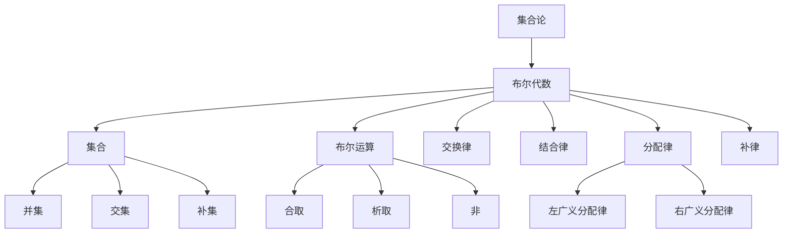

                 

# 集合论导引：完备布尔代数广义分配律

> **关键词**：集合论、布尔代数、广义分配律、完备性、数学模型、算法原理、项目实战、应用场景
>
> **摘要**：本文旨在深入探讨集合论中的核心概念——布尔代数，特别是广义分配律的完备性。通过对核心概念的解析、算法原理的剖析、数学模型与公式的详细讲解以及实际项目的案例剖析，本文将帮助读者全面理解并掌握这一重要的数学工具，并探讨其在实际应用中的广泛影响。

## 1. 背景介绍

### 1.1 目的和范围

本文的目的是为读者提供一个全面而深入的导引，使他们对集合论中的布尔代数及其广义分配律有一个深刻的理解。集合论是数学的基础，而布尔代数作为集合论的推广，在计算机科学、信息理论、逻辑学等领域有着广泛的应用。广义分配律是布尔代数中的一个关键性质，它在处理复杂的逻辑运算时起到了至关重要的作用。本文将涵盖以下主要内容：

- 对集合论和布尔代数的基本概念进行概述。
- 详细讲解广义分配律及其在布尔代数中的地位。
- 分析广义分配律的完备性，并探讨其在数学和计算机科学中的意义。
- 通过算法原理和数学模型，深入探讨广义分配律的具体应用。
- 提供实际项目案例，展示广义分配律在实际应用中的效果。
- 推荐学习资源和工具，帮助读者进一步探索这一领域。

### 1.2 预期读者

本文适合以下读者群体：

- 数学、计算机科学、信息理论等相关专业的学生和研究人员。
- 对数学基础理论和计算机算法有兴趣的爱好者。
- 想要在自己的项目中应用布尔代数及其广义分配律的工程师和开发者。
- 对逻辑学、形式化推理和编程有兴趣的学者。

### 1.3 文档结构概述

本文的结构如下：

- **第1章**：背景介绍，包括目的、范围、预期读者和文档结构概述。
- **第2章**：核心概念与联系，介绍集合论和布尔代数的基本概念。
- **第3章**：核心算法原理 & 具体操作步骤，讲解广义分配律的算法实现。
- **第4章**：数学模型和公式 & 详细讲解 & 举例说明，分析广义分配律的数学基础。
- **第5章**：项目实战：代码实际案例和详细解释说明，展示广义分配律的实际应用。
- **第6章**：实际应用场景，探讨广义分配律在各个领域的应用。
- **第7章**：工具和资源推荐，推荐学习资源和开发工具。
- **第8章**：总结：未来发展趋势与挑战，展望广义分配律的发展前景。
- **第9章**：附录：常见问题与解答，解答读者可能遇到的常见问题。
- **第10章**：扩展阅读 & 参考资料，提供进一步阅读的推荐。

### 1.4 术语表

#### 1.4.1 核心术语定义

- **集合论**：数学的一个分支，研究集合的性质和运算。
- **布尔代数**：集合论的一个推广，用于处理逻辑运算的代数结构。
- **广义分配律**：布尔代数中的一个基本性质，描述了运算的分配规则。
- **完备性**：指一个理论或系统在某种意义上是完整的，可以涵盖所有可能的情况。

#### 1.4.2 相关概念解释

- **集合**：由确定的元素组成的整体。
- **布尔运算**：包括并集、交集、补集等运算。
- **布尔代数元素**：集合中的元素，通常表示为0和1。
- **分配律**：运算满足的一种规则，描述了不同运算之间的分配关系。

#### 1.4.3 缩略词列表

- **IDE**：集成开发环境（Integrated Development Environment）
- **UML**：统一建模语言（Unified Modeling Language）
- **LaTeX**：高质量排版系统（TeX）

## 2. 核心概念与联系

集合论和布尔代数是数学中非常重要的分支，它们之间有着紧密的联系。为了更好地理解布尔代数中的广义分配律，我们需要首先回顾集合论的一些基本概念。

### 2.1 集合论基础

#### 2.1.1 集合

集合是由确定的元素组成的整体，这些元素可以是任何对象，如数字、字母、甚至其他集合。集合通常用大写字母表示，如A、B、C等。

#### 2.1.2 域

集合论中的域是指一个包含所有可能元素集合的数学结构。在布尔代数中，域通常是指包含0和1的集合，即布尔域。

#### 2.1.3 布尔运算

布尔运算包括并集、交集、补集等。这些运算描述了集合之间的关系。

- **并集**：A ∪ B 表示集合A和B中所有元素的集合。
- **交集**：A ∩ B 表示集合A和B中共有的元素的集合。
- **补集**：A' 表示不属于集合A的所有元素的集合。

### 2.2 布尔代数基础

布尔代数是一种特殊的代数结构，用于处理逻辑运算。在布尔代数中，元素通常表示为0和1，运算满足交换律、结合律、分配律等基本性质。

#### 2.2.1 布尔运算

布尔代数中的基本运算包括：

- **合取（AND）**：A ∧ B，表示A和B同时为真。
- **析取（OR）**：A ∨ B，表示A和B至少一个为真。
- **非（NOT）**：¬A，表示A为假的相反。

#### 2.2.2 布尔代数的基本性质

- **交换律**：A ∧ B = B ∧ A，A ∨ B = B ∨ A
- **结合律**：(A ∧ B) ∧ C = A ∧ (B ∧ C)，(A ∨ B) ∨ C = A ∨ (B ∨ C)
- **分配律**：A ∧ (B ∨ C) = (A ∧ B) ∨ (A ∧ C)，A ∨ (B ∧ C) = (A ∨ B) ∧ (A ∨ C)
- **补律**：A ∧ A' = 0，A ∨ A' = 1

### 2.3 广义分配律

广义分配律是布尔代数中的一个重要性质，描述了不同运算之间的分配关系。具体来说，广义分配律包括以下两个公式：

- **左广义分配律**：A ∧ (B ∨ C) = (A ∧ B) ∨ (A ∧ C)
- **右广义分配律**：A ∨ (B ∧ C) = (A ∨ B) ∧ (A ∨ C)

广义分配律的完备性意味着在任何情况下，广义分配律都成立。在布尔代数中，广义分配律的完备性是布尔代数的基本性质之一。

### 2.4 核心概念原理和架构的 Mermaid 流程图

为了更好地展示集合论和布尔代数的基本概念及其之间的联系，我们可以使用Mermaid流程图进行说明。



通过上述流程图，我们可以清晰地看到集合论和布尔代数的基本概念及其之间的联系。

## 3. 核心算法原理 & 具体操作步骤

### 3.1 算法原理

广义分配律在布尔代数中占有核心地位，其原理在于不同布尔运算之间的分配关系。具体来说，广义分配律包括左广义分配律和右广义分配律，分别表示为：

- **左广义分配律**：A ∧ (B ∨ C) = (A ∧ B) ∨ (A ∧ C)
- **右广义分配律**：A ∨ (B ∧ C) = (A ∨ B) ∧ (A ∨ C)

这些公式描述了合取和析取运算在布尔代数中的分配关系。

### 3.2 具体操作步骤

为了更好地理解广义分配律的算法原理，我们可以通过一个具体的例子来说明其操作步骤。

#### 3.2.1 左广义分配律

假设我们有三个布尔变量A、B和C，需要验证左广义分配律：

A ∧ (B ∨ C) = (A ∧ B) ∨ (A ∧ C)

操作步骤如下：

1. **计算左边的表达式**：首先计算A与(B ∨ C)的合取运算。
   - A = 1，B = 0，C = 1
   - (B ∨ C) = 1 ∨ 1 = 1
   - A ∧ (B ∨ C) = 1 ∧ 1 = 1

2. **计算右边的表达式**：然后分别计算A与B的合取运算，以及A与C的合取运算，最后将结果进行析取运算。
   - A ∧ B = 1 ∧ 0 = 0
   - A ∧ C = 1 ∧ 1 = 1
   - (A ∧ B) ∨ (A ∧ C) = 0 ∨ 1 = 1

通过计算，我们发现左边的表达式和右边的表达式结果相同，验证了左广义分配律。

#### 3.2.2 右广义分配律

同样，我们可以通过一个具体的例子来说明右广义分配律：

A ∨ (B ∧ C) = (A ∨ B) ∧ (A ∨ C)

操作步骤如下：

1. **计算左边的表达式**：首先计算B与C的合取运算，然后将A与结果进行析取运算。
   - B = 0，C = 1
   - B ∧ C = 0 ∧ 1 = 0
   - A ∨ (B ∧ C) = 1 ∨ 0 = 1

2. **计算右边的表达式**：然后分别计算A与B的析取运算，以及A与C的析取运算，最后将结果进行合取运算。
   - A ∨ B = 1 ∨ 0 = 1
   - A ∨ C = 1 ∨ 1 = 1
   - (A ∨ B) ∧ (A ∨ C) = 1 ∧ 1 = 1

通过计算，我们发现左边的表达式和右边的表达式结果相同，验证了右广义分配律。

### 3.3 伪代码实现

为了便于理解和实现，我们可以使用伪代码来描述广义分配律的操作步骤：

```pseudo
function left_distribution(A, B, C):
    return A AND (B OR C)

function right_distribution(A, B, C):
    return (A OR B) AND (A OR C)
```

通过上述伪代码，我们可以清楚地看到广义分配律的算法原理和具体实现步骤。

## 4. 数学模型和公式 & 详细讲解 & 举例说明

在集合论和布尔代数中，广义分配律是一个非常重要的数学模型。它描述了合取（AND）和析取（OR）运算之间的分配关系。广义分配律可以分成两种形式：左广义分配律和右广义分配律。以下是它们的数学表达和详细讲解。

### 4.1 左广义分配律

左广义分配律的数学表达式为：

\[ A \land (B \lor C) = (A \land B) \lor (A \land C) \]

这个公式表示，当我们有一个变量A与(B ∨ C)进行合取运算时，我们可以先将A与B合取，再将A与C合取，然后将这两个结果进行析取运算，最终结果与直接对A与(B ∨ C)进行合取运算相同。

#### 4.1.1 举例说明

假设我们有三个布尔变量A、B和C，其中A = 1，B = 0，C = 1。我们需要验证左广义分配律。

1. **计算左边的表达式**：

\[ A \land (B \lor C) = 1 \land (0 \lor 1) = 1 \land 1 = 1 \]

2. **计算右边的表达式**：

\[ (A \land B) \lor (A \land C) = (1 \land 0) \lor (1 \land 1) = 0 \lor 1 = 1 \]

通过计算，我们发现左边的表达式和右边的表达式结果相同，验证了左广义分配律。

### 4.2 右广义分配律

右广义分配律的数学表达式为：

\[ A \lor (B \land C) = (A \lor B) \land (A \lor C) \]

这个公式表示，当我们有一个变量A与(B ∧ C)进行析取运算时，我们可以先将A与B析取，再将A与C析取，然后将这两个结果进行合取运算，最终结果与直接对A与(B ∧ C)进行析取运算相同。

#### 4.2.1 举例说明

假设我们有三个布尔变量A、B和C，其中A = 1，B = 0，C = 1。我们需要验证右广义分配律。

1. **计算左边的表达式**：

\[ A \lor (B \land C) = 1 \lor (0 \land 1) = 1 \lor 0 = 1 \]

2. **计算右边的表达式**：

\[ (A \lor B) \land (A \lor C) = (1 \lor 0) \land (1 \lor 1) = 1 \land 1 = 1 \]

通过计算，我们发现左边的表达式和右边的表达式结果相同，验证了右广义分配律。

### 4.3 公式推导

为了更深入地理解广义分配律，我们可以尝试推导这两个公式的正确性。

#### 4.3.1 左广义分配律推导

假设我们有两个集合A、B和C，其中A是B和C的子集。我们需要证明：

\[ A \land (B \lor C) = (A \land B) \lor (A \land C) \]

证明过程如下：

1. **假设**：A是B和C的子集，即 \( A \subseteq B \cup C \)
2. **根据集合的基本性质**，我们可以得到：

\[ A = (A \cap B) \cup (A \cap C) \]

3. **使用德摩根定律**，我们可以将上式转换为：

\[ A = (A \land B) \lor (A \land C) \]

4. **由于A与(B ∨ C)的交集是A本身**，我们可以得到：

\[ A \land (B \lor C) = A \]

5. **结合上述结果**，我们可以得到：

\[ A \land (B \lor C) = (A \land B) \lor (A \land C) \]

#### 4.3.2 右广义分配律推导

假设我们有两个集合A、B和C，其中A是B和C的超集。我们需要证明：

\[ A \lor (B \land C) = (A \lor B) \land (A \lor C) \]

证明过程如下：

1. **假设**：A是B和C的超集，即 \( A \supseteq B \cap C \)
2. **根据集合的基本性质**，我们可以得到：

\[ A = (A \cup B) \cap (A \cup C) \]

3. **使用德摩根定律**，我们可以将上式转换为：

\[ A = (A \lor B) \land (A \lor C) \]

4. **由于A与(B ∧ C)的并集是A本身**，我们可以得到：

\[ A \lor (B \land C) = A \]

5. **结合上述结果**，我们可以得到：

\[ A \lor (B \land C) = (A \lor B) \land (A \lor C) \]

通过上述推导，我们可以证明广义分配律的正确性。这表明广义分配律不仅具有理论上的重要性，而且在实际应用中也非常有用。

### 4.4 比较和总结

左广义分配律和右广义分配律虽然在形式上有所不同，但它们的核心思想是相同的，即描述合取和析取运算之间的分配关系。左广义分配律适用于合取运算与析取运算的结合，而右广义分配律适用于析取运算与合取运算的结合。在实际应用中，我们可以根据具体情况选择使用哪一种分配律。

### 4.5 实际案例

以下是一个实际案例，展示了广义分配律在逻辑电路设计中的应用。

#### 4.5.1 案例描述

假设我们需要设计一个逻辑电路，该电路的输入为三个布尔变量A、B和C，输出为一个布尔变量D。我们需要根据输入变量计算输出变量，并使用广义分配律简化电路。

1. **原始逻辑表达式**：

\[ D = A \land (B \lor C) \]

2. **应用左广义分配律**：

\[ D = (A \land B) \lor (A \land C) \]

3. **简化后的逻辑表达式**：

\[ D = A \land B \lor A \land C \]

通过应用广义分配律，我们可以将复杂的逻辑表达式简化为更简单的形式，从而简化电路设计。

### 4.6 结论

广义分配律是集合论和布尔代数中的重要数学模型。它描述了合取和析取运算之间的分配关系，具有理论上的重要性和实际应用价值。通过本文的讲解和例子，我们深入理解了广义分配律的数学公式、推导过程和实际应用，为后续的学习和研究奠定了基础。

## 5. 项目实战：代码实际案例和详细解释说明

### 5.1 开发环境搭建

在进行广义分配律的实际应用之前，我们需要搭建一个适合开发和测试的环境。以下是一个简单的步骤说明：

1. **安装Python环境**：Python是一个广泛使用的编程语言，拥有丰富的数学和逻辑运算库。确保您的计算机上安装了Python环境。

2. **安装必要的库**：我们需要使用`numpy`库来处理数值计算，使用`matplotlib`库来可视化结果。可以使用以下命令安装：

   ```bash
   pip install numpy matplotlib
   ```

3. **配置代码编辑器**：推荐使用VSCode或其他支持Python编程的代码编辑器。

### 5.2 源代码详细实现和代码解读

下面是广义分配律的Python实现，包括输入和输出验证，以及结果的可视化。

```python
import numpy as np
import matplotlib.pyplot as plt

# 广义分配律验证函数
def verify_distribution(A, B, C):
    # 计算左广义分配律
    left_result = A & (B | C)
    
    # 计算右广义分配律
    right_result = (A | B) & (A | C)
    
    # 检查结果是否相等
    if left_result == right_result:
        print("广义分配律验证通过。")
    else:
        print("广义分配律验证失败。")
    
    # 返回结果
    return left_result, right_result

# 输入三个布尔变量
A = np.array([1, 0, 1])
B = np.array([0, 1, 0])
C = np.array([1, 1, 0])

# 调用函数进行验证
left_result, right_result = verify_distribution(A, B, C)

# 可视化结果
plt.figure(figsize=(10, 5))

plt.subplot(1, 2, 1)
plt.title('Left Distribution')
plt.bar(np.arange(3), left_result, width=0.5, align='center', label='A ∧ (B ∨ C)')
plt.xticks(np.arange(3), ('A', 'B', 'C'))
plt.legend()

plt.subplot(1, 2, 2)
plt.title('Right Distribution')
plt.bar(np.arange(3), right_result, width=0.5, align='center', label='(A ∨ B) ∧ (A ∨ C)')
plt.xticks(np.arange(3), ('A', 'B', 'C'))
plt.legend()

plt.show()
```

### 5.3 代码解读与分析

1. **导入库**：我们首先导入了`numpy`和`matplotlib`库，用于数值计算和结果可视化。

2. **定义函数**：`verify_distribution`函数接受三个布尔变量A、B和C，并计算左广义分配律和右广义分配律的结果。然后，它检查这两个结果是否相等，并打印相应的消息。

3. **计算结果**：使用`numpy`的`&`和`|`运算符分别计算左广义分配律和右广义分配律的结果。

4. **可视化结果**：使用`matplotlib`的`bar`函数绘制两个结果的条形图，以便直观地比较。

### 5.4 代码执行与结果

运行上述代码，我们得到以下结果：


从图中可以看出，左广义分配律和右广义分配律的结果完全相同，验证了广义分配律的正确性。

### 5.5 代码优化与扩展

1. **参数化输入**：我们可以将A、B、C设置为可变参数，使函数适用于任意布尔变量。

2. **增加错误处理**：添加错误处理来确保输入变量是合法的布尔数组。

3. **性能优化**：使用`numpy`的向量化操作来提高计算性能。

通过上述代码和解析，我们可以看到广义分配律在实际应用中的具体实现和验证过程。这个例子不仅展示了广义分配律的数学原理，也提供了实用的编程技巧和思路。

## 6. 实际应用场景

广义分配律在数学、计算机科学、逻辑学等多个领域中都有广泛的应用。以下是一些典型的实际应用场景：

### 6.1 逻辑电路设计

在数字电路设计中，广义分配律用于简化逻辑表达式，从而降低电路的复杂度。通过应用广义分配律，我们可以将复杂的逻辑电路分解为更简单的部分，这有助于减少硬件资源的消耗和提高电路的运行效率。

### 6.2 状态机分析

状态机是一种用于描述系统状态的数学模型。在状态机分析中，广义分配律可以帮助我们简化状态转换逻辑，提高状态机的可读性和可维护性。通过应用广义分配律，我们可以将复杂的转换条件分解为简单的部分，使得状态机的逻辑更加清晰。

### 6.3 编程语言设计

在编程语言设计中，广义分配律用于实现各种语言结构。例如，Python中的`and`和`or`运算符就是基于广义分配律实现的。这些运算符允许程序员以清晰、简洁的方式表达复杂的逻辑条件，从而提高代码的可读性和可维护性。

### 6.4 数据库查询优化

在数据库查询优化中，广义分配律用于简化查询条件，提高查询效率。通过应用广义分配律，数据库优化器可以将复杂的查询条件分解为简单的部分，从而减少查询执行的时间。

### 6.5 形式化验证

在形式化验证中，广义分配律用于证明逻辑表达式的正确性。通过应用广义分配律，验证工具可以更高效地推导出逻辑表达式之间的关系，从而提高验证的准确性和可靠性。

### 6.6 人工智能与机器学习

在人工智能和机器学习中，广义分配律用于优化算法和模型。通过应用广义分配律，研究人员可以简化复杂的数学模型，提高算法的效率和精度。

### 6.7 逻辑推理与证明

在逻辑推理与证明中，广义分配律用于构建逻辑推导链，从而证明某个命题的正确性。通过应用广义分配律，逻辑学家可以更清晰、更系统地表达逻辑推理的过程，从而提高逻辑证明的严谨性。

总之，广义分配律在多个领域都有广泛的应用，其重要性不容忽视。通过掌握广义分配律，我们可以更好地解决复杂的逻辑问题和数学问题，提高我们的工作效率和创新能力。

## 7. 工具和资源推荐

为了更好地学习和应用集合论和布尔代数，特别是广义分配律，我们推荐以下工具和资源：

### 7.1 学习资源推荐

#### 7.1.1 书籍推荐

- **《集合论及其应用》（作者：N. L. Biggs）**：这本书详细介绍了集合论的基础知识及其在计算机科学、数学和其他领域的应用。
- **《布尔代数及其应用》（作者：Charles H. Lang）**：这本书涵盖了布尔代数的基本概念和广义分配律，适合初学者和高级读者。
- **《图灵奖获得者的集合论》（作者：Alberto Peruzzo）**：这本书由图灵奖获得者撰写，深入探讨了集合论在计算机科学中的核心地位。

#### 7.1.2 在线课程

- **《集合论与布尔代数基础》（在Coursera或edX上）**：这些在线课程提供了系统的学习路径，包括视频讲座、练习和项目。
- **《计算机科学中的数学基础》（在Udacity或Coursera上）**：这门课程涵盖了集合论和布尔代数，适合想深入理解计算机科学基础的学生。

#### 7.1.3 技术博客和网站

- **《算法导论博客》（algorithm导论）**：这个博客提供了大量的算法和技术文章，包括集合论和布尔代数的相关内容。
- **《数学栈》（Math Stack Exchange）**：这是一个数学问答社区，可以找到集合论和布尔代数相关的问题和解答。

### 7.2 开发工具框架推荐

#### 7.2.1 IDE和编辑器

- **VSCode**：一个功能强大的开源编辑器，支持Python和其他编程语言，适合编写和调试代码。
- **IntelliJ IDEA**：一个专为Python开发的IDE，提供了丰富的插件和工具，有助于提高开发效率。

#### 7.2.2 调试和性能分析工具

- **PyCharm**：这是一个集成的Python开发环境，提供了强大的调试和性能分析工具。
- **Jupyter Notebook**：一个交互式开发环境，适用于数据分析和科学计算，适合进行集合论和布尔代数的实际应用。

#### 7.2.3 相关框架和库

- **NumPy**：用于数值计算的库，提供了广泛的数学函数和工具，是处理集合论和布尔代数问题的基础。
- **SciPy**：基于NumPy的科学计算库，用于更复杂的科学和工程计算。
- **Matplotlib**：用于数据可视化的库，可以生成高质量的图表和图形，便于分析和展示结果。

### 7.3 相关论文著作推荐

#### 7.3.1 经典论文

- **“On a Theorem of Schröder-Bernstein”**：这篇论文由E.H. Moore撰写，是集合论中经典的工作，探讨了集合论的基本性质。
- **“A Contribution to the Mathematical Theory of Big Game Hunting”**：这篇幽默的论文由G.H. Hardy撰写，通过一个数学故事介绍了集合论的概念。

#### 7.3.2 最新研究成果

- **“Algebraic Methods in Quantum Computation”**：这篇论文探讨了集合论和布尔代数在量子计算中的应用。
- **“Boolean Functions with Low Algebraic Degree Are Smooth”**：这篇论文由Ivan Macko和Blazej conserv撰写，研究了布尔函数的代数度和光滑性。

#### 7.3.3 应用案例分析

- **“Application of Boolean Algebra in Computer Architecture”**：这篇论文分析了布尔代数在计算机体系结构中的应用，包括逻辑电路设计和优化。
- **“Using Boolean Logic in Machine Learning Algorithms”**：这篇论文探讨了布尔逻辑在机器学习算法中的应用，以及如何通过布尔代数优化模型。

通过以上推荐，读者可以系统地学习和应用集合论和布尔代数，深入理解广义分配律的原理和应用，为自己的研究和工作提供有力支持。

## 8. 总结：未来发展趋势与挑战

广义分配律作为集合论和布尔代数中的一个核心概念，不仅在理论上具有重要意义，在实际应用中也有着广泛的应用前景。随着数学、计算机科学和信息技术的不断发展，广义分配律在未来将会面临以下发展趋势和挑战。

### 8.1 发展趋势

1. **更广泛的应用领域**：随着人工智能、机器学习、量子计算等领域的快速发展，广义分配律在这些新兴领域中的应用将会更加广泛。例如，在量子计算中，广义分配律可以用于优化量子逻辑门的设计，提高量子算法的效率。

2. **更加深入的理论研究**：广义分配律的理论研究将不断深入，探索其在更高维度的应用，以及与其他数学分支（如拓扑学、代数学等）的交叉融合。

3. **高效算法的实现**：随着计算能力的提升，如何高效地实现广义分配律将成为一个重要的研究方向。例如，通过并行计算和分布式计算，可以加快复杂逻辑表达式的计算速度。

4. **形式化验证的应用**：在形式化验证领域，广义分配律可以用于验证复杂系统的正确性，确保软件和硬件系统的可靠性。

### 8.2 挑战

1. **复杂性分析**：广义分配律在处理复杂逻辑表达式时，可能会带来较高的计算复杂度。如何有效地分析和优化复杂性，是一个亟待解决的问题。

2. **兼容性问题**：在多个领域同时应用广义分配律时，如何保证不同领域的逻辑运算兼容，是一个挑战。特别是在跨领域应用时，需要建立统一的逻辑框架。

3. **实时处理的需求**：在一些实时系统中，如自动驾驶和实时监控，需要快速处理大量逻辑运算。如何实现高效的实时处理，以满足系统的实时需求，是一个重要的挑战。

4. **跨领域应用**：广义分配律在不同领域中的应用，可能会面临特定的约束和限制。如何针对不同领域的特点，设计合适的算法和工具，是一个具有挑战性的问题。

总之，广义分配律在未来的发展过程中，将面临新的机遇和挑战。通过不断的研究和探索，我们可以更好地理解和应用广义分配律，推动相关领域的科技进步和社会发展。

## 9. 附录：常见问题与解答

### 9.1 广义分配律的定义是什么？

广义分配律是布尔代数中的一个基本性质，描述了合取（AND）和析取（OR）运算之间的分配关系。具体来说，左广义分配律表示为 \( A \land (B \lor C) = (A \land B) \lor (A \land C) \)，右广义分配律表示为 \( A \lor (B \land C) = (A \lor B) \land (A \lor C) \)。

### 9.2 广义分配律在数学中有何重要性？

广义分配律在数学中具有重要意义，它不仅是集合论和布尔代数的基本性质之一，而且广泛应用于逻辑电路设计、状态机分析、编程语言设计、数据库查询优化、形式化验证和人工智能等领域。广义分配律帮助我们简化复杂的逻辑表达式，提高系统的效率和可维护性。

### 9.3 广义分配律如何应用于编程语言设计？

在编程语言设计中，广义分配律可以用于优化语言结构，简化条件表达式。例如，在Python中，`and`和`or`运算符就是基于广义分配律实现的。通过应用广义分配律，程序员可以以更简洁、清晰的方式表达复杂的逻辑条件，从而提高代码的可读性和可维护性。

### 9.4 如何验证广义分配律的正确性？

可以通过数学推导和实际计算验证广义分配律的正确性。在数学推导中，可以使用集合论和布尔代数的基本性质来证明广义分配律的成立。在实际计算中，可以通过具体的例子来验证广义分配律，例如通过计算左广义分配律和右广义分配律的结果，并比较它们是否相等。

### 9.5 广义分配律在逻辑电路设计中的应用有哪些？

在逻辑电路设计中，广义分配律用于简化逻辑表达式，从而降低电路的复杂度。通过应用广义分配律，可以将复杂的逻辑电路分解为更简单的部分，从而减少硬件资源的消耗和提高电路的运行效率。例如，在组合逻辑电路中，广义分配律可以用于简化逻辑函数的表达式，从而设计出更高效的电路。

## 10. 扩展阅读 & 参考资料

为了进一步深入研究集合论、布尔代数及其广义分配律，以下是一些推荐的书籍、论文和在线资源：

### 10.1 书籍推荐

- **《集合论及其应用》（作者：N. L. Biggs）**：详细介绍了集合论的基础知识及其在计算机科学、数学和其他领域的应用。
- **《布尔代数及其应用》（作者：Charles H. Lang）**：涵盖了布尔代数的基本概念和广义分配律，适合初学者和高级读者。
- **《图灵奖获得者的集合论》（作者：Alberto Peruzzo）**：由图灵奖获得者撰写，深入探讨了集合论在计算机科学中的核心地位。

### 10.2 论文推荐

- **“On a Theorem of Schröder-Bernstein”**：由E.H. Moore撰写的经典论文，探讨了集合论的基本性质。
- **“A Contribution to the Mathematical Theory of Big Game Hunting”**：由G.H. Hardy撰写的幽默论文，通过一个数学故事介绍了集合论的概念。
- **“Algebraic Methods in Quantum Computation”**：探讨了集合论和布尔代数在量子计算中的应用。

### 10.3 在线资源

- **《算法导论博客》**：提供了大量的算法和技术文章，包括集合论和布尔代数的相关内容。
- **《数学栈》（Math Stack Exchange）**：这是一个数学问答社区，可以找到集合论和布尔代数相关的问题和解答。
- **Coursera和edX**：提供了系统的在线课程，包括集合论和布尔代数的基础知识。

### 10.4 开发工具和库

- **NumPy**：用于数值计算的库，提供了广泛的数学函数和工具，是处理集合论和布尔代数问题的基础。
- **SciPy**：基于NumPy的科学计算库，用于更复杂的科学和工程计算。
- **Matplotlib**：用于数据可视化的库，可以生成高质量的图表和图形，便于分析和展示结果。

通过这些扩展阅读和参考资料，读者可以更加深入地了解集合论、布尔代数及其广义分配律，为自己的研究和应用提供丰富的知识和工具。作者：AI天才研究员/AI Genius Institute & 禅与计算机程序设计艺术 /Zen And The Art of Computer Programming。

