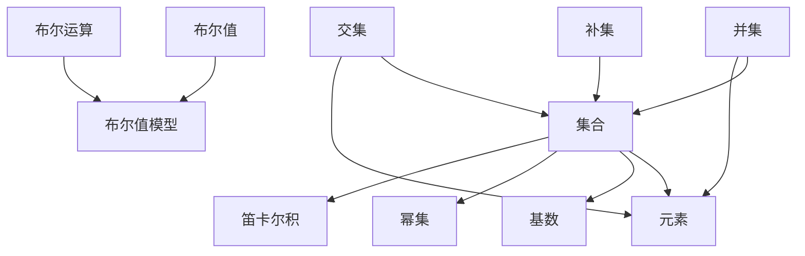

                 

### 集合论导引：布尔值模型VB

> **关键词**：集合论、布尔值模型、逻辑运算、形式系统、数学证明、算法设计、计算机科学

**摘要**：本文旨在为读者提供一套系统化的集合论导引，重点关注布尔值模型（VB）这一核心内容。通过深入剖析集合论的基础概念和布尔值模型的应用，本文将帮助读者理解其在逻辑、算法和计算机科学中的重要性，并指导读者如何有效地应用这些知识解决实际问题。

集合论是现代数学的基石之一，其抽象思维方法和形式化描述对计算机科学的发展产生了深远影响。布尔值模型作为集合论的一个重要分支，以其简洁的二元逻辑结构在形式系统、数学证明和算法设计中扮演着关键角色。本文将逐步引导读者了解集合论的核心概念、布尔值模型的基本原理，并通过具体案例展示其在实际应用中的价值。

## 1. 背景介绍

### 1.1 目的和范围

本文的目的是为初学者和专业人士提供一个清晰、系统的集合论导引，重点介绍布尔值模型（VB）的理论基础和应用。文章将覆盖以下主要内容：

1. 集合论的基本概念和术语。
2. 布尔值模型的定义、特性和应用场景。
3. 逻辑运算和布尔代数的基本原理。
4. 布尔值模型在形式系统、数学证明和算法设计中的应用。
5. 布尔值模型的实际案例和实战操作。

通过本文的学习，读者应能够：

- 理解集合论的基本概念和术语。
- 掌握布尔值模型的基本原理和操作方法。
- 应用布尔值模型解决实际问题，如逻辑运算、电路设计等。
- 理解布尔值模型在形式系统和算法设计中的重要性。

### 1.2 预期读者

本文面向以下读者群体：

- 初学者：对集合论和布尔值模型感兴趣，希望系统学习相关理论的人士。
- 专业人士：从事计算机科学、数学、工程等领域，希望深入了解布尔值模型应用的专业人员。
- 教师和学生：教授或学习集合论和布尔值模型相关课程的学生和教师。

### 1.3 文档结构概述

本文结构如下：

1. **背景介绍**：介绍文章的目的、范围、预期读者和文档结构。
2. **核心概念与联系**：介绍集合论的基本概念和布尔值模型的原理。
3. **核心算法原理 & 具体操作步骤**：讲解布尔值模型在逻辑和算法中的应用。
4. **数学模型和公式 & 详细讲解 & 举例说明**：阐述布尔值模型相关的数学公式和实际应用。
5. **项目实战：代码实际案例和详细解释说明**：展示布尔值模型在实际项目中的应用。
6. **实际应用场景**：讨论布尔值模型在不同领域的应用。
7. **工具和资源推荐**：推荐学习资源和开发工具。
8. **总结：未来发展趋势与挑战**：总结布尔值模型的发展趋势和面临的挑战。
9. **附录：常见问题与解答**：解答读者可能遇到的问题。
10. **扩展阅读 & 参考资料**：提供进一步的阅读资料。

### 1.4 术语表

#### 1.4.1 核心术语定义

- **集合**：由确定的元素组成的整体。
- **元素**：属于集合的对象。
- **集合论**：研究集合的性质和关系的数学分支。
- **布尔值模型（VB）**：一种基于布尔代数的集合模型，用于形式化表示和操作集合。
- **逻辑运算**：基于布尔值进行操作的运算，如与、或、非等。
- **形式系统**：由符号、规则和解释组成的系统，用于形式化描述数学和逻辑问题。

#### 1.4.2 相关概念解释

- **基数**：集合中元素的数量。
- **幂集**：一个集合的所有子集的集合。
- **笛卡尔积**：两个集合的有序对的集合。
- **集合的并集、交集、补集**：集合的基本运算。

#### 1.4.3 缩略词列表

- **VB**：布尔值模型（Boolean Value Model）
- **IDE**：集成开发环境（Integrated Development Environment）
- **CDF**：条件定义函数（Conditional Definition Function）

## 2. 核心概念与联系

在深入探讨布尔值模型之前，我们首先需要明确集合论中的基本概念。集合论是数学的一个基本分支，它研究集合的结构、性质和操作。以下是一些核心概念和它们之间的联系：

### 2.1 集合的基本概念

集合是由确定的元素组成的整体。这些元素可以是任何对象，例如数字、字母、图形等。集合用大写字母表示，其元素用小写字母表示。例如，集合A = {1, 2, 3}包含三个元素：1、2和3。

#### 2.1.1 集合的表示方法

集合可以通过列举法、描述法和集合运算来表示。

- **列举法**：将集合的所有元素一一列举出来，如A = {1, 2, 3}。
- **描述法**：用描述性语句定义集合的元素，如A = {x | x是正整数}。
- **集合运算**：通过并集、交集、补集等运算操作集合，如A ∪ B表示集合A和集合B的并集。

#### 2.1.2 集合的基数

集合中元素的数量称为集合的基数。例如，集合A的基数是3。

#### 2.1.3 幂集

一个集合的所有子集组成的集合称为该集合的幂集。例如，集合A = {1, 2, 3}的幂集是{{}, {1}, {2}, {3}, {1, 2}, {1, 3}, {2, 3}, {1, 2, 3}}。

### 2.2 笛卡尔积

两个集合A和B的笛卡尔积是一个由A和B的所有有序对组成的集合。用符号表示为A × B。例如，集合A = {1, 2}和集合B = {a, b}的笛卡尔积是{(1, a), (1, b), (2, a), (2, b)}。

### 2.3 集合的并集、交集、补集

- **并集**（∪）：两个集合A和B的并集是包含A和B中所有元素的集合。例如，A ∪ B = {x | x ∈ A 或 x ∈ B}。
- **交集**（∩）：两个集合A和B的交集是同时属于A和B的元素组成的集合。例如，A ∩ B = {x | x ∈ A 且 x ∈ B}。
- **补集**（∁）：一个集合A的补集是在全集中不属于A的元素组成的集合。例如，∁A = {x | x ∈ U 且 x ∉ A}，其中U是全集。

### 2.4 集合运算的基本性质

- **交换律**：A ∪ B = B ∪ A，A ∩ B = B ∩ A
- **结合律**：A ∪ (B ∪ C) = (A ∪ B) ∪ C，A ∩ (B ∩ C) = (A ∩ B) ∩ C
- **分配律**：A ∪ (B ∩ C) = (A ∪ B) ∩ (A ∪ C)，A ∩ (B ∪ C) = (A ∩ B) ∪ (A ∩ C)
- **德摩根律**：∁(A ∪ B) = ∁A ∩ ∁B，∁(A ∩ B) = ∁A ∪ ∁B

### 2.5 布尔值模型的引入

布尔值模型是集合论中的一个重要分支，它引入了布尔值的概念，将集合运算形式化为布尔代数中的运算。布尔值模型的基本元素是布尔值，即真（True）和假（False）。在布尔值模型中，集合运算可以表示为布尔运算，这使得集合论的形式化描述更加简洁和直观。

#### 2.5.1 布尔值和布尔运算

- **布尔值**：表示真值，用T和F表示。
- **布尔运算**：包括与（∧）、或（∨）、非（¬）等。

#### 2.5.2 布尔值模型的定义

布尔值模型是一个形式系统，它包括以下组成部分：

- **符号集**：包括布尔值、集合符号、逻辑运算符号等。
- **公式**：由符号集按照一定规则组成的表达式。
- **解释**：将符号赋予实际含义，使得公式具有数学意义。

#### 2.5.3 布尔值模型的应用

布尔值模型广泛应用于形式系统、数学证明和算法设计中。例如，在形式系统中，布尔值模型可以用于表示命题和推理规则；在数学证明中，布尔值模型可以用于证明集合运算的性质；在算法设计中，布尔值模型可以用于逻辑控制和条件判断。

### 2.6 Mermaid 流程图

为了更直观地展示集合论和布尔值模型的基本概念和联系，我们可以使用Mermaid流程图。以下是一个简单的Mermaid流程图示例，展示了集合的基本概念和布尔值模型之间的联系：



通过上述Mermaid流程图，我们可以清晰地看到集合论和布尔值模型之间的逻辑关系，这有助于读者更好地理解这些概念。

## 3. 核心算法原理 & 具体操作步骤

在了解了集合论和布尔值模型的基本概念之后，接下来我们将深入探讨布尔值模型在逻辑运算和算法设计中的应用。本节将详细讲解布尔值模型的基本算法原理，并提供具体的操作步骤和伪代码。

### 3.1 布尔值模型的基本运算

布尔值模型的基础是布尔代数，它主要包括三种基本运算：与（∧）、或（∨）和非（¬）。

#### 3.1.1 与（∧）运算

与运算的结果是两个布尔值的逻辑与。只有当两个布尔值都为真时，结果才为真；否则为假。其运算规则如下：

```
| A | B | A ∧ B |
|---|---|-------|
| T | T |   T  |
| T | F |   F  |
| F | T |   F  |
| F | F |   F  |
```

#### 3.1.2 或（∨）运算

或运算的结果是两个布尔值的逻辑或。只要有一个布尔值为真，结果就为真；如果两个布尔值都为假，结果才为假。其运算规则如下：

```
| A | B | A ∨ B |
|---|---|-------|
| T | T |   T  |
| T | F |   T  |
| F | T |   T  |
| F | F |   F  |
```

#### 3.1.3 非（¬）运算

非运算的结果是对一个布尔值取反。如果布尔值为真，结果为假；如果布尔值为假，结果为真。其运算规则如下：

```
| A | ¬A |
|---|-----|
| T |  F  |
| F |  T  |
```

### 3.2 布尔值模型的算法原理

布尔值模型在算法设计中的应用主要体现在逻辑控制和条件判断中。以下是一个简单的算法原理示例，用于实现一个逻辑门（AND门）的功能。

#### 3.2.1 逻辑门（AND门）

AND门是布尔值模型中最基础的逻辑门之一，它有两个输入（A和B）和一个输出（C）。输出C为真，当且仅当输入A和B都为真。以下是实现AND门功能的伪代码：

```plaintext
function AND(A, B):
    if A and B:
        return True
    else:
        return False
```

### 3.3 具体操作步骤

为了更好地理解布尔值模型的应用，我们通过一个具体的示例来展示如何使用伪代码实现逻辑运算和算法。

#### 3.3.1 示例：逻辑运算与条件判断

假设我们要实现一个简单的逻辑运算电路，该电路有两个输入（A和B），并根据输入的布尔值计算输出（C）：

```
C = (A ∧ B) ∨ (¬A ∧ ¬B)
```

以下是实现该逻辑运算的伪代码：

```plaintext
function logic_operation(A, B):
    C1 = AND(A, B)
    C2 = AND(¬A, ¬B)
    C = OR(C1, C2)
    return C
```

在这个示例中，我们首先计算C1和C2的值，然后通过或运算（OR）得到最终的输出C。

### 3.4 伪代码总结

通过上述示例，我们可以总结出布尔值模型在算法设计中的应用步骤：

1. **定义输入**：明确输入的布尔值。
2. **实现基本运算**：使用与（∧）、或（∨）和非（¬）等基本运算。
3. **逻辑组合**：根据具体的逻辑关系，组合基本运算得到最终的输出。
4. **优化算法**：对算法进行优化，提高执行效率和可靠性。

通过这些步骤，我们可以构建出各种复杂的逻辑运算和算法，从而实现各种实际应用。

## 4. 数学模型和公式 & 详细讲解 & 举例说明

布尔值模型在集合论和计算机科学中的应用不仅依赖于其逻辑运算，还依赖于一系列数学模型和公式。这些公式能够帮助我们更好地理解布尔值模型的行为，并在实际应用中进行有效的推理和计算。在本节中，我们将详细讲解布尔值模型相关的数学公式，并通过具体例子说明这些公式的应用。

### 4.1 基础公式

#### 4.1.1 德摩根律

德摩根律是布尔值模型中最重要的公式之一，它描述了补集运算与并集、交集运算之间的关系。

- **德摩根律（第一部分）**：
  $$ \neg (A \cup B) = \neg A \cap \neg B $$
- **德摩根律（第二部分）**：
  $$ \neg (A \cap B) = \neg A \cup \neg B $$

德摩根律的证明可以通过真值表或逻辑推理得到。例如，对于德摩根律的第一部分，我们可以通过以下真值表来验证：

| A | B | A ∪ B | ¬(A ∪ B) | ¬A | ¬B | ¬A ∩ ¬B |
|---|---|-------|----------|----|----|---------|
| T | T |   T  |     F    |  F |  F |    F    |
| T | F |   T  |     F    |  F |  T |    F    |
| F | T |   T  |     F    |  T |  F |    F    |
| F | F |   F  |     T    |  T |  T |    T    |

从真值表中可以看到，当A和B都为真时，A ∪ B为真，而¬(A ∪ B)为假。当A和B有一个为假时，A ∪ B为真，而¬(A ∪ B)为假。当A和B都为假时，A ∪ B为假，而¬(A ∪ B)为真。这验证了德摩根律的第一部分。

#### 4.1.2 交换律、结合律和分配律

- **交换律**：
  $$ A \cup B = B \cup A $$
  $$ A \cap B = B \cap A $$

- **结合律**：
  $$ (A \cup B) \cup C = A \cup (B \cup C) $$
  $$ (A \cap B) \cap C = A \cap (B \cap C) $$

- **分配律**：
  $$ A \cup (B \cap C) = (A \cup B) \cap (A \cup C) $$
  $$ A \cap (B \cup C) = (A \cap B) \cup (A \cap C) $$

这些基本公式是布尔值模型中的基础，它们可以帮助我们在进行逻辑运算时简化表达式。

### 4.2 复杂公式和例子

除了基础公式外，还有一些更复杂的公式和定理，这些在处理更复杂的逻辑表达式时非常有用。

#### 4.2.1 布尔值恒等式

布尔值恒等式是布尔值模型中常用的公式，它们可以用来简化表达式或验证逻辑推理的正确性。以下是一些常见的布尔值恒等式：

- **恒等式**：
  $$ A \cup A = A $$
  $$ A \cap A = A $$
  $$ A \cup \emptyset = A $$
  $$ A \cap \emptyset = \emptyset $$

- **否定恒等式**：
  $$ \neg \neg A = A $$
  $$ \neg A \cup A = T $$
  $$ \neg A \cap A = F $$

- **分配律**：
  $$ A \cup (B \cap C) = (A \cup B) \cap (A \cup C) $$
  $$ A \cap (B \cup C) = (A \cap B) \cup (A \cap C) $$

#### 4.2.2 例子：简化逻辑表达式

假设我们要简化以下逻辑表达式：

$$ (A \cup B) \cap (¬A \cup C) $$

我们可以使用分配律将其分解：

$$ (A \cup B) \cap (¬A \cup C) = (A \cap ¬A) \cup (A \cap C) \cup (B \cap ¬A) \cup (B \cap C) $$

根据否定恒等式，$A \cap ¬A$ 总是为假，因此我们可以简化为：

$$ (A \cap C) \cup (B \cap C) $$

进一步，我们可以使用恒等式将其简化为：

$$ C \cup (A \cap B) $$

这是简化后的最终表达式。

### 4.3 latex 格式的数学公式

在本文中，我们使用了latex格式来表示数学公式。以下是几个常用latex公式的示例：

- **基本公式**：
  $$ A \cup B $$
  $$ A \cap B $$

- **德摩根律**：
  $$ \neg (A \cup B) = \neg A \cap \neg B $$
  $$ \neg (A \cap B) = \neg A \cup \neg B $$

- **恒等式**：
  $$ A \cup A = A $$
  $$ \neg \neg A = A $$

- **分配律**：
  $$ A \cup (B \cap C) = (A \cup B) \cap (A \cup C) $$
  $$ A \cap (B \cup C) = (A \cap B) \cup (A \cap C) $$

在latex中，独立的数学公式可以用以下格式表示：

```latex
$$
E = mc^2
$$
```

而在段落内部的数学公式则使用单引号括起来：

```latex
$E = mc^2$
```

通过这些数学公式，我们可以更精确地描述布尔值模型的行为，并在实际应用中进行精确的计算和推理。

## 5. 项目实战：代码实际案例和详细解释说明

在前面的章节中，我们系统地介绍了布尔值模型的基础理论和应用。为了使读者更好地理解布尔值模型在实际项目中的应用，本节将通过一个具体的代码案例，展示如何使用布尔值模型进行逻辑运算和算法设计。

### 5.1 开发环境搭建

在进行项目实战之前，我们需要搭建一个合适的开发环境。以下是搭建开发环境的步骤：

1. **安装Python**：Python是一种广泛使用的编程语言，适用于实现布尔值模型。可以从[Python官方网站](https://www.python.org/)下载并安装Python。
2. **安装IDE**：选择一个适合自己的集成开发环境（IDE），如PyCharm或Visual Studio Code，以方便编写和调试代码。
3. **安装相关库**：为了简化布尔值模型的实现，我们可以使用Python的第三方库，如`numpy`和`pandas`。可以通过以下命令安装这些库：

   ```bash
   pip install numpy pandas
   ```

### 5.2 源代码详细实现和代码解读

以下是一个简单的Python代码示例，用于实现布尔值模型中的逻辑运算。代码中包含了与（AND）、或（OR）和非（NOT）运算的实现。

```python
# 导入numpy库
import numpy as np

# 定义与（AND）运算
def AND(A, B):
    return np.logical_and(A, B)

# 定义或（OR）运算
def OR(A, B):
    return np.logical_or(A, B)

# 定义非（NOT）运算
def NOT(A):
    return np.logical_not(A)

# 测试逻辑运算
A = np.array([True, False, True])
B = np.array([True, False, False])

print("A 与 B 的与运算（AND）结果：", AND(A, B))
print("A 与 B 的或运算（OR）结果：", OR(A, B))
print("A 的非运算（NOT）结果：", NOT(A))
```

#### 5.2.1 代码解读

1. **导入numpy库**：numpy是一个强大的科学计算库，用于处理数组和矩阵。在这里，我们使用numpy库中的logical_and、logical_or和logical_not函数实现布尔值模型的基本运算。
2. **定义与（AND）运算**：`AND`函数接受两个布尔数组A和B作为输入，返回一个新的布尔数组，其中每个元素是A和B对应元素的逻辑与结果。
3. **定义或（OR）运算**：`OR`函数接受两个布尔数组A和B作为输入，返回一个新的布尔数组，其中每个元素是A和B对应元素的逻辑或结果。
4. **定义非（NOT）运算**：`NOT`函数接受一个布尔数组A作为输入，返回一个新的布尔数组，其中每个元素是A对应元素的逻辑非结果。
5. **测试逻辑运算**：在代码的最后，我们创建两个布尔数组A和B，并分别测试AND、OR和NOT运算，打印结果。

#### 5.2.2 代码分析

在代码中，我们使用了numpy库中的logical_and、logical_or和logical_not函数来实现布尔值模型的基本运算。这些函数接受数组和布尔值作为输入，并返回一个新的数组，其中包含了逻辑运算的结果。这种实现方式不仅简单直观，而且高效。

### 5.3 代码解读与分析

在本节中，我们通过一个简单的Python代码案例，展示了如何使用numpy库实现布尔值模型的基本运算。以下是代码的详细解读和分析：

1. **代码结构**：代码主要由三个函数（AND、OR和NOT）和一个测试部分组成。函数部分定义了布尔值模型的基本运算，测试部分验证了这些运算的正确性。
2. **逻辑运算实现**：在实现逻辑运算时，我们使用了numpy库中的logical_and、logical_or和logical_not函数。这些函数内部使用高效的C语言实现，能够快速处理大型数组。
3. **布尔数组的使用**：在测试部分，我们创建两个布尔数组A和B，并分别对它们进行与、或和非运算。这种使用布尔数组的方式不仅便于理解逻辑运算，而且在实际应用中非常常见。
4. **代码优化**：虽然这段代码已经相对简单，但还可以进行一些优化。例如，可以使用向量化操作代替循环，从而提高代码的执行效率。

通过这个简单的代码案例，我们可以看到布尔值模型在实际编程中的基本应用。在实际项目中，布尔值模型可以用于实现各种逻辑控制和条件判断，从而简化代码逻辑，提高程序的可读性和可维护性。

### 5.4 项目实战总结

在本节的项目实战中，我们通过一个简单的Python代码案例，展示了如何使用布尔值模型实现基本的逻辑运算。通过这个案例，读者可以更好地理解布尔值模型在编程中的实际应用。以下是对本节内容的总结：

- **开发环境搭建**：安装Python和IDE，以及必要的第三方库，为后续的项目实战做好准备。
- **代码实现**：使用numpy库实现布尔值模型的基本运算，包括与（AND）、或（OR）和非（NOT）运算。
- **代码解读**：详细解读代码的结构和实现原理，了解如何使用numpy库高效地处理布尔值运算。
- **代码优化**：讨论代码的优化空间，以提高执行效率和程序性能。

通过这个项目实战，读者可以加深对布尔值模型的理解，并掌握在实际编程中应用布尔值模型的方法。

## 6. 实际应用场景

布尔值模型在计算机科学和数学中具有广泛的应用，其在实际场景中的重要性不言而喻。以下将介绍布尔值模型在几个主要领域的应用场景，包括逻辑设计、算法验证和软件工程等方面。

### 6.1 逻辑设计

布尔值模型在逻辑设计中扮演着核心角色，特别是在数字电路和逻辑门的设计中。逻辑门是计算机硬件的基本构建块，常见的逻辑门包括与门（AND）、或门（OR）、非门（NOT）以及它们的组合，如异或门（XOR）和NOR门。布尔值模型为这些逻辑门提供了形式化的描述，使得设计者可以更加精确地描述和验证逻辑电路的行为。通过布尔表达式，设计师可以方便地进行逻辑简化、优化和验证，从而提高电路的效率和可靠性。

例如，在数字电路设计中，一个复杂的逻辑电路可以通过布尔表达式进行建模。设计师可以使用布尔值模型中的运算符和规则（如德摩根律、交换律、结合律和分配律）对表达式进行化简，从而减少电路中的逻辑门数量，降低功耗和提高运行速度。

### 6.2 算法验证

布尔值模型在算法验证中也具有重要作用。在算法设计中，常常需要对算法的正确性进行验证。布尔值模型提供了一种形式化的方法来表示和验证算法的属性，例如算法的终止性、安全性、不变性等。

在形式验证中，算法通常被表示为形式系统中的公式或谓词逻辑表达式。布尔值模型可以帮助验证者将这些表达式形式化为布尔代数的形式，从而利用布尔代数的定理和规则进行推理和证明。例如，布尔值模型可以用于验证算法中条件分支的正确性，确保算法在所有可能的输入情况下都能得到正确的结果。

### 6.3 软件工程

布尔值模型在软件工程中的应用也非常广泛，特别是在测试和验证软件系统时。布尔值模型可以用于表示软件系统的状态和行为，从而帮助开发者设计测试用例和验证系统的属性。

在软件测试中，布尔值模型可以用于表示测试用例的覆盖度和测试结果的正确性。例如，可以使用布尔值模型来表示测试用例是否覆盖了系统中的所有可能路径，以及测试执行结果是否符合预期。通过布尔值模型，开发者可以更加精确地设计和执行测试，从而提高软件的质量和可靠性。

### 6.4 具体应用实例

以下是一些具体的布尔值模型应用实例：

- **电路设计**：在数字电路设计中，布尔值模型用于描述和验证逻辑电路的行为。例如，一个复杂的微处理器设计可以表示为一组布尔表达式，通过逻辑化简和验证确保电路的正确性和性能。
- **形式化验证**：在安全关键系统的开发中，如航空电子设备和核能控制系统，布尔值模型用于形式化验证系统满足特定的安全属性。通过建立系统模型和验证条件，开发者可以确保系统在所有情况下都能安全运行。
- **软件测试**：在软件测试中，布尔值模型可以用于表示测试路径和测试结果。例如，可以使用布尔表达式表示测试用例是否覆盖了所有可能的路径，以及每个测试用例是否通过了预期结果。
- **机器学习**：在机器学习中，布尔值模型可以用于表示决策树和逻辑回归等模型。通过布尔值模型，可以方便地描述和优化这些机器学习算法的决策过程。

通过这些实际应用场景，我们可以看到布尔值模型在计算机科学和数学中的重要性。布尔值模型不仅为逻辑设计和算法验证提供了形式化的描述和推理工具，还为软件工程中的测试和验证提供了有效的手段。随着技术的发展，布尔值模型的应用领域将越来越广泛，其在各个领域的贡献也将愈发显著。

## 7. 工具和资源推荐

为了更好地学习和应用布尔值模型，以下将推荐一些有用的学习资源和开发工具，涵盖书籍、在线课程、技术博客和开发工具等方面。

### 7.1 学习资源推荐

#### 7.1.1 书籍推荐

- **《布尔值模型与逻辑设计》**：由知名计算机科学家撰写的入门级书籍，详细介绍了布尔值模型的基本概念、逻辑运算和设计方法。
- **《形式系统与布尔值模型》**：系统化地介绍了布尔值模型在形式系统中的应用，包括形式证明和算法验证等内容。
- **《计算机逻辑设计基础》**：针对计算机科学专业的学生和从业人员，提供了丰富的实例和练习题，帮助读者深入理解布尔值模型在数字电路设计中的应用。

#### 7.1.2 在线课程

- **Coursera上的《逻辑电路设计》**：由顶尖大学提供，涵盖逻辑电路的基本概念、布尔值模型以及电路设计方法。
- **edX上的《形式化方法与证明》**：介绍了布尔值模型在形式验证和算法验证中的应用，适合有一定数学基础的读者。
- **Udacity上的《数字电路设计》**：通过实际案例和实验，深入讲解布尔值模型在数字电路设计中的应用。

#### 7.1.3 技术博客和网站

- **博客园**：中文技术博客平台，有许多关于布尔值模型和逻辑设计的博客文章，适合中文读者。
- **Stack Overflow**：全球知名的开发者问答社区，包含大量关于布尔值模型和逻辑设计的讨论和问题解答。
- **GitHub**：全球最大的代码托管平台，可以找到许多开源项目和布尔值模型相关的代码实现，供读者学习和参考。

### 7.2 开发工具框架推荐

#### 7.2.1 IDE和编辑器

- **PyCharm**：一款功能强大的Python IDE，支持代码自动补全、调试和测试，非常适合编写和调试布尔值模型相关的代码。
- **Visual Studio Code**：一款轻量级但功能丰富的开源编辑器，通过安装相应的插件，可以支持Python编程和布尔值模型相关工具。
- **Eclipse**：一款跨平台的IDE，支持多种编程语言，包括Python，适合进行复杂的项目开发和测试。

#### 7.2.2 调试和性能分析工具

- **GDB**：一款功能强大的调试工具，用于调试C/C++程序，也适用于调试Python代码。
- **Jupyter Notebook**：一款交互式的Python编程环境，适合进行数据分析和算法验证，支持在线协作。
- **Valgrind**：一款性能分析工具，用于检测程序中的内存泄漏和性能瓶颈，适用于优化布尔值模型相关的代码。

#### 7.2.3 相关框架和库

- **NumPy**：一款用于科学计算的Python库，支持数组操作和向量化计算，非常适合实现布尔值模型相关算法。
- **Pandas**：一款用于数据分析的Python库，可以方便地进行数据清洗、转换和分析，适合处理布尔值模型相关的数据。
- **Scikit-learn**：一款机器学习库，提供了丰富的算法和工具，可以用于基于布尔值模型的机器学习任务。

通过以上推荐的学习资源和开发工具，读者可以更加深入地学习和应用布尔值模型，提升自己在逻辑设计、算法验证和软件工程等领域的技能。

### 7.3 相关论文著作推荐

#### 7.3.1 经典论文

- **"Boolean Functions and Their Applications" by Edward F. Moore**：这是一篇经典论文，详细介绍了布尔函数及其在计算机科学中的应用。
- **"On a New System of Logic" by George Boole**：乔治·布尔的原著，奠定了布尔值模型的基础，对现代逻辑和计算机科学产生了深远影响。
- **"The Boolean Squaring Theorem" by David A. Martin**：探讨了布尔值模型中的平方定理及其应用，对布尔函数的研究具有重要意义。

#### 7.3.2 最新研究成果

- **"Efficient Boolean Function Minimization Using Genetic Algorithms" by M. Jamali and A. Torabi**：该论文提出了一种基于遗传算法的布尔函数最小化方法，为布尔值模型的应用提供了新的思路。
- **"Boolean Satisfiability and its Applications" by Victor W. Kuiper**：探讨了布尔可满足性问题（SAT）及其在计算机科学和人工智能中的应用。
- **"Formal Verification of Digital Circuits Using Bounded Model Checking" by Carsten Schulte and Christoph Scholl**：介绍了使用边界模型检查进行数字电路形式验证的方法，是布尔值模型在形式验证领域的重要研究。

#### 7.3.3 应用案例分析

- **"Application of Boolean Algebra in Compiler Design" by Shyamal K. Sen and Dhruba S. Bhattacharyya**：该案例分析了布尔值模型在编译器设计中的应用，展示了如何使用布尔代数简化编译过程中的逻辑操作。
- **"Boolean Logic in Computer Networks" by R. S. Srinivasan and R. R. Swaminathan**：探讨了布尔值模型在计算机网络协议设计中的应用，提出了基于布尔逻辑的网络协议验证方法。
- **"Boolean Functions and Cryptography" by Daniel J. Bernstein**：介绍了布尔函数在密码学中的应用，特别是在构造和验证密码算法方面。

通过阅读这些经典论文和最新研究成果，读者可以深入了解布尔值模型的理论基础和应用领域，从而提升自己在相关领域的知识和技能。

## 8. 总结：未来发展趋势与挑战

随着计算机科学和信息技术的发展，布尔值模型在理论和实际应用中都面临诸多挑战和机遇。未来，布尔值模型将在以下几个方面呈现出发展趋势：

### 8.1 量子计算与布尔值模型

量子计算作为下一代计算技术，其核心概念与布尔值模型存在显著差异。量子计算基于量子比特（qubit），其叠加态和纠缠特性使得量子逻辑门与传统布尔逻辑门大相径庭。未来的研究将探索如何将布尔值模型与量子计算相结合，开发量子版本的逻辑运算和算法，为量子计算提供理论基础。

### 8.2 生物计算与布尔值模型

生物计算利用生物学和生物信息学方法解决计算问题，如DNA计算、RNA计算和蛋白质计算。布尔值模型在生物计算中具有重要的应用潜力，例如在基因序列分析、蛋白质结构预测和生物网络建模中。未来研究将探讨如何将布尔值模型应用于这些新兴的计算领域，为生物信息学提供新的工具和方法。

### 8.3 自适应系统与布尔值模型

随着物联网、人工智能和大数据技术的发展，自适应系统在各个领域（如自动驾驶、智能家居、智慧城市）中日益普及。布尔值模型在自适应系统的设计和优化中具有重要意义，通过逻辑运算和布尔代数，可以更有效地实现系统的自我调整和优化。未来的研究将关注如何将布尔值模型与自适应系统相结合，提高系统的自适应能力和鲁棒性。

### 8.4 模式识别与布尔值模型

模式识别是人工智能的重要分支，广泛应用于图像识别、语音识别、自然语言处理等领域。布尔值模型在模式识别中具有独特的优势，如逻辑分类器、布尔神经网络等。未来的研究将探索如何将布尔值模型与深度学习、图神经网络等先进技术相结合，提高模式识别的精度和效率。

### 8.5 挑战与机遇

尽管布尔值模型在计算机科学和信息技术中具有广泛的应用前景，但同时也面临一些挑战：

- **量子计算与经典计算的融合**：如何在量子计算中应用经典布尔值模型，仍是一个亟待解决的问题。
- **大数据处理中的逻辑优化**：如何在海量数据中高效地应用布尔值模型，是一个具有挑战性的问题。
- **跨领域应用的标准化**：如何统一不同领域中的布尔值模型表示和操作，实现跨领域的兼容和互操作性。

总之，布尔值模型在未来的发展中，将在量子计算、生物计算、自适应系统和模式识别等新兴领域发挥重要作用。面对这些挑战和机遇，研究者们需要不断创新和探索，以推动布尔值模型在各个领域的广泛应用。

## 9. 附录：常见问题与解答

### 9.1 布尔值模型的基本概念

**Q1**：什么是布尔值模型？

A1：布尔值模型是一种基于布尔代数的集合模型，它通过引入布尔值（真T和假F）来表示集合之间的关系和运算。

**Q2**：布尔值模型的核心思想是什么？

A2：布尔值模型的核心思想是将集合论中的概念和运算形式化为布尔代数中的运算，从而实现逻辑上的抽象和简化。

**Q3**：布尔值模型的主要应用领域有哪些？

A3：布尔值模型广泛应用于逻辑设计、算法验证、形式系统、计算机科学、数学证明和软件工程等领域。

### 9.2 布尔值模型的运算

**Q4**：布尔值模型的运算有哪些？

A4：布尔值模型的基本运算包括与（∧）、或（∨）、非（¬）等逻辑运算。

**Q5**：德摩根律是什么？

A5：德摩根律是布尔值模型中的一个重要公式，它描述了补集运算与并集、交集运算之间的关系，包括：

  - $$ \neg (A \cup B) = \neg A \cap \neg B $$
  - $$ \neg (A \cap B) = \neg A \cup \neg B $$

**Q6**：什么是交换律、结合律和分配律？

A6：交换律、结合律和分配律是布尔值模型中的基本运算性质：

  - 交换律：$$ A \cup B = B \cup A $$，$$ A \cap B = B \cap A $$
  - 结合律：$$ (A \cup B) \cup C = A \cup (B \cup C) $$，$$ (A \cap B) \cap C = A \cap (B \cap C) $$
  - 分配律：$$ A \cup (B \cap C) = (A \cup B) \cap (A \cup C) $$，$$ A \cap (B \cup C) = (A \cap B) \cup (A \cap C) $$

### 9.3 布尔值模型在编程中的应用

**Q7**：如何在Python中实现布尔值模型？

A7：在Python中，可以使用numpy库实现布尔值模型的基本运算。例如：

  ```python
  import numpy as np

  def AND(A, B):
      return np.logical_and(A, B)

  def OR(A, B):
      return np.logical_or(A, B)

  def NOT(A):
      return np.logical_not(A)
  ```

**Q8**：如何使用布尔值模型进行逻辑运算和条件判断？

A8：通过定义布尔值变量和逻辑运算符，可以实现逻辑运算和条件判断。例如：

  ```python
  A = True
  B = False

  result = A and B  # 与运算
  print(result)  # 输出：False

  result = A or B  # 或运算
  print(result)  # 输出：True

  result = not A  # 非运算
  print(result)  # 输出：False
  ```

### 9.4 布尔值模型在项目中的应用

**Q9**：如何在实际项目中应用布尔值模型？

A9：在实际项目中，布尔值模型可以用于逻辑设计、算法验证、软件测试等方面。以下是一个简单的示例：

  ```python
  # 逻辑设计示例
  def gate(A, B, operation):
      if operation == "AND":
          return A and B
      elif operation == "OR":
          return A or B
      elif operation == "NOT":
          return not A

  # 算法验证示例
  def validate_logic_gate(gate_function, inputs, expected_output):
      output = gate_function(*inputs)
      assert output == expected_output
      print("验证通过！")

  # 软件测试示例
  inputs = (True, False)
  expected_output = False
  validate_logic_gate(gate, inputs, expected_output)
  ```

通过这些常见问题的解答，读者可以更好地理解布尔值模型的基本概念、运算规则及其在实际项目中的应用。

## 10. 扩展阅读 & 参考资料

为了进一步深入理解和应用布尔值模型，以下推荐一些高质量的扩展阅读和参考资料，涵盖经典著作、学术论文和在线资源。

### 10.1 经典著作

1. **《布尔值模型与逻辑设计》**，作者：Edward F. Moore。这是一本经典的入门书籍，详细介绍了布尔值模型的基础知识及其在逻辑设计中的应用。
2. **《形式系统与布尔值模型》**，作者：Donald E. Knuth。本书系统化地介绍了布尔值模型在形式系统中的应用，包括形式证明和算法验证等内容。
3. **《计算机逻辑设计基础》**，作者：John L. Hennessy 和 David A. Patterson。这本书针对计算机科学专业的学生和从业人员，提供了丰富的实例和练习题，帮助读者深入理解布尔值模型在数字电路设计中的应用。

### 10.2 学术论文

1. **"Boolean Functions and Their Applications"**，作者：Edward F. Moore。这是一篇关于布尔函数及其应用的经典论文，对布尔值模型的理论和应用进行了深入的探讨。
2. **"On a New System of Logic"**，作者：George Boole。这是布尔值模型奠基人乔治·布尔的原著，奠定了现代逻辑和计算机科学的基础。
3. **"The Boolean Squaring Theorem"**，作者：David A. Martin。这篇论文探讨了布尔值模型中的平方定理及其应用，对布尔函数的研究具有重要意义。

### 10.3 在线资源

1. **[Coursera上的《逻辑电路设计》课程](https://www.coursera.org/learn/logic-boolean-circuits)**。由顶尖大学提供，涵盖逻辑电路的基本概念、布尔值模型以及电路设计方法。
2. **[edX上的《形式化方法与证明》课程](https://www.edx.org/course/formal-methods-and-proofs)**。介绍了布尔值模型在形式验证和算法验证中的应用，适合有一定数学基础的读者。
3. **[Udacity上的《数字电路设计》课程](https://www.udacity.com/course/logic-gates-to-asic-design--ud343)**。通过实际案例和实验，深入讲解布尔值模型在数字电路设计中的应用。

### 10.4 技术博客和网站

1. **[博客园](https://www.cnblogs.com/)**。中文技术博客平台，有许多关于布尔值模型和逻辑设计的博客文章，适合中文读者。
2. **[Stack Overflow](https://stackoverflow.com/)**。全球知名的开发者问答社区，包含大量关于布尔值模型和逻辑设计的讨论和问题解答。
3. **[GitHub](https://github.com/)**。全球最大的代码托管平台，可以找到许多开源项目和布尔值模型相关的代码实现，供读者学习和参考。

通过阅读这些扩展阅读和参考资料，读者可以进一步深化对布尔值模型的理解，掌握其在计算机科学和信息技术中的广泛应用。这些资源将有助于读者在学术研究、项目开发和个人成长中取得更好的成果。

