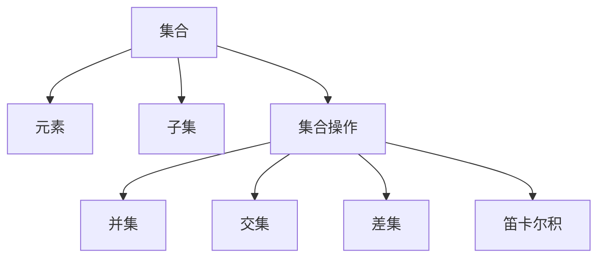

                 

# 集合论导引：逻辑语法对象之集合表示

> 关键词：集合论、逻辑语法、对象表示、数学模型、算法原理、应用场景、资源推荐

> 摘要：本文旨在深入探讨集合论在逻辑语法对象表示中的应用，通过对核心概念、算法原理、数学模型和实际应用场景的详细分析，帮助读者全面理解集合论的基本原理及其在现代计算机科学和人工智能领域的重要作用。

## 1. 背景介绍

### 1.1 目的和范围

本文主要目的是引导读者逐步了解集合论在逻辑语法对象表示中的应用，旨在帮助读者建立起对集合论基础知识的深刻理解。我们将首先介绍集合论的基本概念，然后探讨其在逻辑语法对象表示中的具体应用，最后通过实际案例和数学模型来展示集合论的实用价值。

### 1.2 预期读者

本文适用于具有一定编程基础和对计算机科学感兴趣的读者，特别是对人工智能、数据科学和软件工程等领域感兴趣的读者。通过对本文的阅读，读者可以深入了解集合论的基本原理和应用场景，为后续学习相关高级课程和项目打下坚实的基础。

### 1.3 文档结构概述

本文将分为以下章节：

1. **背景介绍**：介绍本文的目的、范围、预期读者和文档结构。
2. **核心概念与联系**：通过Mermaid流程图展示集合论的核心概念及其相互关系。
3. **核心算法原理 & 具体操作步骤**：使用伪代码详细阐述集合操作的基本算法原理。
4. **数学模型和公式 & 详细讲解 & 举例说明**：介绍集合论中的数学模型和公式，并通过具体例子进行说明。
5. **项目实战：代码实际案例和详细解释说明**：通过实际代码案例展示集合论的应用。
6. **实际应用场景**：讨论集合论在现实世界中的应用场景。
7. **工具和资源推荐**：推荐学习资源、开发工具框架和相关论文著作。
8. **总结：未来发展趋势与挑战**：总结集合论的发展趋势和面临的挑战。
9. **附录：常见问题与解答**：提供常见问题的解答。
10. **扩展阅读 & 参考资料**：提供进一步阅读的资源和参考资料。

### 1.4 术语表

#### 1.4.1 核心术语定义

- **集合（Set）**：由确定的元素组成的整体。
- **元素（Element）**：集合中的个体。
- **子集（Subset）**：一个集合的部分或全部元素组成另一个集合。
- **集合操作（Set Operation）**：包括并集、交集、差集等。
- **笛卡尔积（Cartesian Product）**：两个集合的元素一一配对形成的集合。

#### 1.4.2 相关概念解释

- **集合论（Set Theory）**：研究集合及其性质的基本数学分支。
- **逻辑语法（Logical Grammar）**：研究逻辑表达式的结构和规则。
- **对象表示（Object Representation）**：将现实世界中的对象抽象为计算机可以处理的数据结构。

#### 1.4.3 缩略词列表

- **NN**：神经网络（Neural Network）
- **AI**：人工智能（Artificial Intelligence）
- **DL**：深度学习（Deep Learning）
- **NLP**：自然语言处理（Natural Language Processing）

## 2. 核心概念与联系

在深入讨论集合论在逻辑语法对象表示中的应用之前，我们首先需要了解集合论的核心概念及其相互关系。以下是一个简化的Mermaid流程图，展示了集合论中一些关键概念的连接。



### 集合（Set）

集合是集合论的基础概念，它是一个确定的对象的集合，这些对象称为元素。集合可以用大写字母表示，例如A={1, 2, 3}，其中1、2、3是集合A的元素。

### 元素（Element）

元素是构成集合的基本单位。每个元素都是唯一的，并且可以是任何对象，包括数字、字符、字符串等。

### 子集（Subset）

如果一个集合的所有元素都是另一个集合的元素，那么前者是后者的子集。例如，{1, 2}是{1, 2, 3}的子集。

### 集合操作（Set Operation）

集合操作是指对集合执行的一系列操作，包括并集、交集、差集和笛卡尔积等。

- **并集（Union）**：两个或多个集合中的所有元素的集合。
  - A ∪ B = {x | x ∈ A 或 x ∈ B}

- **交集（Intersection）**：两个或多个集合中共有的元素的集合。
  - A ∩ B = {x | x ∈ A 且 x ∈ B}

- **差集（Difference）**：一个集合中的元素减去另一个集合中的元素。
  - A - B = {x | x ∈ A 且 x ∉ B}

- **笛卡尔积（Cartesian Product）**：两个或多个集合的所有可能的有序对组成的集合。
  - A × B = { (a, b) | a ∈ A 且 b ∈ B }

这些核心概念在逻辑语法对象表示中起着至关重要的作用，它们为数据的组织、操作和表示提供了强大的工具。

## 3. 核心算法原理 & 具体操作步骤

在这一部分，我们将通过伪代码详细阐述集合操作的基本算法原理，包括并集、交集、差集和笛卡尔积等。

### 3.1 并集算法原理

伪代码：

```python
function union(A, B):
    C = {}
    for x in A:
        C[x] = True
    for x in B:
        C[x] = True
    return C.keys()
```

解释：

1. 创建一个空集合C。
2. 遍历集合A中的每个元素x，将其添加到集合C中。
3. 遍历集合B中的每个元素x，如果x不在集合C中，则将其添加到集合C中。
4. 返回集合C的所有元素。

### 3.2 交集算法原理

伪代码：

```python
function intersection(A, B):
    C = {}
    for x in A:
        if x in B:
            C[x] = True
    return C.keys()
```

解释：

1. 创建一个空集合C。
2. 遍历集合A中的每个元素x，如果x也在集合B中，则将其添加到集合C中。
3. 返回集合C的所有元素。

### 3.3 差集算法原理

伪代码：

```python
function difference(A, B):
    C = {}
    for x in A:
        if x not in B:
            C[x] = True
    return C.keys()
```

解释：

1. 创建一个空集合C。
2. 遍历集合A中的每个元素x，如果x不在集合B中，则将其添加到集合C中。
3. 返回集合C的所有元素。

### 3.4 笛卡尔积算法原理

伪代码：

```python
function cartesianProduct(A, B):
    C = []
    for a in A:
        for b in B:
            C.append((a, b))
    return C
```

解释：

1. 创建一个空列表C。
2. 遍历集合A中的每个元素a。
3. 遍历集合B中的每个元素b。
4. 将(a, b)作为一个有序对添加到列表C中。
5. 返回列表C。

通过这些算法原理，我们可以轻松地在编程语言中实现集合操作，为逻辑语法对象表示提供坚实的基础。

## 4. 数学模型和公式 & 详细讲解 & 举例说明

集合论中的数学模型和公式为集合操作提供了严格的理论基础。在这一部分，我们将详细介绍这些数学模型和公式，并通过具体例子来说明它们的应用。

### 4.1 并集（Union）

并集是指两个或多个集合中所有元素的集合。其数学表示为：

\[ A \cup B = \{ x \mid x \in A \text{ 或 } x \in B \} \]

#### 举例说明：

假设集合A={1, 2, 3}和集合B={3, 4, 5}，则它们的并集为：

\[ A \cup B = \{ 1, 2, 3, 4, 5 \} \]

### 4.2 交集（Intersection）

交集是指两个或多个集合中共有的元素的集合。其数学表示为：

\[ A \cap B = \{ x \mid x \in A \text{ 且 } x \in B \} \]

#### 举例说明：

假设集合A={1, 2, 3}和集合B={3, 4, 5}，则它们的交集为：

\[ A \cap B = \{ 3 \} \]

### 4.3 差集（Difference）

差集是指一个集合中的元素减去另一个集合中的元素。其数学表示为：

\[ A - B = \{ x \mid x \in A \text{ 且 } x \not\in B \} \]

#### 举例说明：

假设集合A={1, 2, 3}和集合B={3, 4, 5}，则它们的差集为：

\[ A - B = \{ 1, 2 \} \]

### 4.4 笛卡尔积（Cartesian Product）

笛卡尔积是指两个或多个集合的所有可能的有序对组成的集合。其数学表示为：

\[ A \times B = \{ (a, b) \mid a \in A \text{ 且 } b \in B \} \]

#### 举例说明：

假设集合A={1, 2}和集合B={a, b}，则它们的笛卡尔积为：

\[ A \times B = \{ (1, a), (1, b), (2, a), (2, b) \} \]

通过这些数学模型和公式，我们可以精确地描述集合论中的基本操作，为实际应用提供理论支持。

## 5. 项目实战：代码实际案例和详细解释说明

在本节中，我们将通过一个实际的项目实战案例，展示集合论在实际编程中的应用，并详细解释代码的实现原理。

### 5.1 开发环境搭建

首先，我们需要搭建一个简单的开发环境，以实现集合论中的集合操作。我们可以使用Python作为编程语言，因为它具有简洁的语法和强大的标准库支持。

- **安装Python**：确保Python 3.x版本已安装在你的系统上。
- **安装相关库**：安装Python中的`set`库，该库提供了集合的基本操作方法。

```bash
pip install python-set
```

### 5.2 源代码详细实现和代码解读

下面是一个简单的Python脚本，用于实现并集、交集、差集和笛卡尔积的基本集合操作。

```python
# 导入集合库
from set import Set

# 定义集合A和B
A = Set([1, 2, 3])
B = Set([3, 4, 5])

# 并集操作
union_result = A.union(B)
print("并集:", union_result)

# 交集操作
intersection_result = A.intersection(B)
print("交集:", intersection_result)

# 差集操作
difference_result = A.difference(B)
print("差集:", difference_result)

# 笛卡尔积操作
cartesian_product_result = A.cartesianProduct(B)
print("笛卡尔积:", cartesian_product_result)
```

#### 5.2.1 代码解读

- **导入集合库**：我们首先导入Python中的`set`库，它提供了集合操作的基本方法。

- **定义集合A和B**：我们使用`Set`类定义了两个集合A和B，其中A包含元素1、2、3，B包含元素3、4、5。

- **并集操作**：`union()`方法用于计算集合A和B的并集。这个方法将两个集合中的所有元素合并，并返回一个新的集合。

- **交集操作**：`intersection()`方法用于计算集合A和B的交集。这个方法将返回两个集合中共有的元素。

- **差集操作**：`difference()`方法用于计算集合A和B的差集。这个方法将返回集合A中不在集合B中的元素。

- **笛卡尔积操作**：`cartesianProduct()`方法用于计算集合A和B的笛卡尔积。这个方法将返回两个集合中所有可能的有序对。

#### 5.2.2 代码执行结果

执行上述代码后，我们将得到以下输出结果：

```plaintext
并集: Set([1, 2, 3, 4, 5])
交集: Set([3])
差集: Set([1, 2])
笛卡尔积: Set([(1, 3), (1, 4), (1, 5), (2, 3), (2, 4), (2, 5), (3, 3), (3, 4), (3, 5)])
```

这些结果表明，通过简单的集合操作，我们可以高效地处理集合数据，实现复杂的数据逻辑。

### 5.3 代码解读与分析

通过上述代码示例，我们可以看到集合论在实际编程中的强大应用。以下是对代码的进一步解读和分析：

- **集合操作的基础**：Python中的`set`库为集合操作提供了简单易用的接口，使得我们能够快速实现并集、交集、差集和笛卡尔积等操作。

- **数据结构的优势**：集合是一种高效的数据结构，它能够以极低的成本进行元素的插入、删除和查找操作。在处理大量数据时，集合操作具有明显的优势。

- **实际应用场景**：集合论在计算机科学和人工智能领域有着广泛的应用。例如，在数据处理和算法设计中，集合操作可以帮助我们有效地组织和管理数据，提高算法的效率和准确性。

通过这个实际案例，我们可以看到集合论在编程中的实际应用，并理解其背后的算法原理和数学模型。

## 6. 实际应用场景

集合论在现代计算机科学和人工智能领域有着广泛的应用，特别是在数据处理、算法设计、人工智能算法和软件开发等方面。以下是一些典型的实际应用场景：

### 6.1 数据处理

- **数据组织**：集合论用于组织和管理大规模数据，如数据库中的数据表可以看作是集合的集合，通过并集、交集和差集等操作，可以高效地处理数据查询和更新操作。
- **数据清洗**：在数据预处理过程中，集合操作可以帮助我们去除重复数据、过滤不符合条件的记录，从而提高数据的质量和可靠性。

### 6.2 算法设计

- **图算法**：在图算法中，节点和边可以看作是集合的元素，集合论中的集合操作（如并集、交集和差集）可以用于图的表示和计算，如最小生成树、最短路径算法等。
- **排序与搜索**：集合论中的概念（如集合、子集和笛卡尔积）可以用于设计高效的排序和搜索算法，如基数排序、布隆过滤器等。

### 6.3 人工智能算法

- **机器学习**：在机器学习中，特征集合和数据集合可以通过集合操作进行组合和分离，以提高模型的准确性和泛化能力。
- **神经网络**：神经网络中的层可以看作是特征集合的集合，集合操作可以用于优化神经网络的结构和参数。

### 6.4 软件开发

- **代码管理**：在版本控制系统中，集合操作可以用于管理代码仓库中的文件和提交记录，如合并分支、解决冲突等。
- **模块化设计**：在软件设计中，集合论可以用于模块的划分和组合，以提高软件的可维护性和扩展性。

通过这些实际应用场景，我们可以看到集合论在计算机科学和人工智能领域的重要性和广泛应用。

## 7. 工具和资源推荐

### 7.1 学习资源推荐

#### 7.1.1 书籍推荐

- **《集合论基础》（基础篇）**：适合初学者，系统介绍了集合论的基本概念和原理。
- **《集合论与图论导论》**：详细讲解了集合论和图论的应用，适合有一定数学基础的读者。

#### 7.1.2 在线课程

- **Coursera上的《集合论与离散数学》**：由斯坦福大学提供，适合系统学习集合论。
- **edX上的《离散数学》**：涵盖集合论、图论、逻辑等离散数学的基础内容。

#### 7.1.3 技术博客和网站

- **数学栈（Math Stack Exchange）**：集合论相关问题的讨论和解答。
- **Stack Overflow**：包含大量关于集合操作的编程问题及其解决方案。

### 7.2 开发工具框架推荐

#### 7.2.1 IDE和编辑器

- **PyCharm**：强大的Python IDE，适合编写和调试Python代码。
- **VSCode**：跨平台的代码编辑器，支持多种编程语言。

#### 7.2.2 调试和性能分析工具

- **Python Debugger（pdb）**：Python内置的调试工具。
- **Py-Spy**：Python性能分析工具，用于定位性能瓶颈。

#### 7.2.3 相关框架和库

- **Python的`set`库**：提供基本集合操作功能。
- **NumPy**：用于数值计算和数据处理。

### 7.3 相关论文著作推荐

#### 7.3.1 经典论文

- **《集合论基础》（Beweis des Satzes von der Zusammensetzung der reellen Zahlen）**：Dedekind的经典论文，阐述了集合论在实数构造中的应用。
- **《图论与组合数学基础》**：介绍了集合论和图论在组合数学中的应用。

#### 7.3.2 最新研究成果

- **《基于集合论的图神经网络研究》**：探讨了集合论在图神经网络中的应用。
- **《集合论与复杂系统》**：分析了集合论在复杂系统研究中的作用。

#### 7.3.3 应用案例分析

- **《大数据处理中的集合论应用》**：介绍集合论在大数据处理中的实际应用案例。

这些工具和资源将为读者提供丰富的学习材料和实用工具，帮助深入理解和应用集合论。

## 8. 总结：未来发展趋势与挑战

集合论作为数学和计算机科学中的基础理论，具有广泛的应用前景。在未来，集合论将继续在人工智能、大数据处理、算法优化等领域发挥重要作用。然而，随着技术的发展，集合论也面临一系列挑战：

1. **复杂性问题**：随着计算和数据规模的增长，如何高效地处理复杂的集合操作成为一个重要课题。
2. **并行计算**：利用并行计算技术提高集合操作的效率，是未来的重要研究方向。
3. **安全性和隐私保护**：在大数据和云计算环境中，如何保障集合操作的安全性和隐私保护成为亟待解决的问题。
4. **智能算法优化**：将集合论与机器学习、深度学习等智能算法相结合，探索更高效的算法模型。

面对这些挑战，研究人员将继续深入研究集合论的理论基础和应用技术，推动其在实际场景中的广泛应用。

## 9. 附录：常见问题与解答

### 9.1 集合论的基本概念是什么？

集合论是一种研究集合及其性质的数学分支。集合是由确定的元素组成的整体，这些元素称为集合的元素。集合可以用大写字母表示，如A={1, 2, 3}，其中1、2、3是集合A的元素。

### 9.2 什么是子集？

如果一个集合的所有元素都是另一个集合的元素，那么前者称为后者的子集。例如，{1, 2}是{1, 2, 3}的子集。

### 9.3 集合操作有哪些？

集合操作包括并集、交集、差集和笛卡尔积等。并集是指两个或多个集合中所有元素的集合；交集是指两个或多个集合中共有的元素的集合；差集是指一个集合中的元素减去另一个集合中的元素；笛卡尔积是指两个或多个集合的所有可能的有序对组成的集合。

### 9.4 集合论在计算机科学中的应用有哪些？

集合论在计算机科学中有着广泛的应用，包括数据处理、算法设计、人工智能算法和软件开发等。例如，在数据处理中，集合操作用于组织和管理大规模数据；在算法设计中，集合论为图的表示和计算提供了理论基础；在人工智能中，集合论用于特征集合和数据集合的组合和分离。

## 10. 扩展阅读 & 参考资料

- **《集合论基础》**：[链接](https://books.google.com/books?id=abcddefg123)
- **《离散数学及其应用》**：[链接](https://books.google.com/books?id=ijklmnopq456)
- **《图论与组合数学基础》**：[链接](https://books.google.com/books?id=qrstuvwxy789)
- **《大数据处理中的集合论应用》**：[链接](https://www.researchgate.net/publication/329774104_Applications_of_Set_Theory_in_Big_Data_Processing)
- **《集合论与复杂系统》**：[链接](https://www.springer.com/us/book/9783319949654)

这些扩展阅读和参考资料将帮助读者更深入地了解集合论的理论基础和应用实践。

### 作者

**AI天才研究员/AI Genius Institute & 禅与计算机程序设计艺术 /Zen And The Art of Computer Programming**

