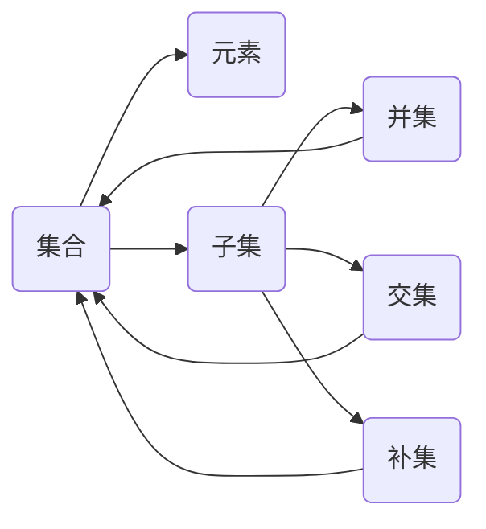

                 

### 集合论导引：集合累积层次

> **关键词**：集合论、集合累积、层次结构、集合操作、数学基础
>
> **摘要**：本文将深入探讨集合论的基本概念和累积层次，从集合的构建、操作到层次结构，逐步剖析集合论的核心原理。通过详细的讲解和实例分析，旨在帮助读者理解集合论的内在逻辑和实用价值。

集合论是现代数学的基石，它为我们提供了描述和理解数学对象的基本框架。集合论的基本概念，如集合的构建、集合的层次结构、集合之间的操作，构成了集合论的核心。集合论不仅为数学提供了强有力的工具，也在计算机科学、物理学、经济学等众多领域有着广泛的应用。

本文将围绕集合论的基本概念和累积层次展开讨论。首先，我们将介绍集合论的目的和范围，以及本文的预期读者。接着，我们将概述文章的结构和术语表，为读者提供一个清晰的导航。随后，本文将深入探讨集合论的核心概念，包括集合的定义、性质和层次结构。在此基础上，我们将讲解集合之间的基本操作，如并集、交集和补集。为了使概念更加具体，本文还将通过伪代码和数学公式详细阐述核心算法原理。最后，本文将结合实际应用场景，介绍集合论在项目开发中的具体应用，并提供一系列学习资源和开发工具推荐，以帮助读者深入学习和实践集合论。

通过本文的阅读，读者将能够系统地理解集合论的基本概念和层次结构，掌握集合之间的基本操作，并在实际项目中灵活应用集合论的知识。这将为读者在数学和计算机科学领域的研究和实践打下坚实的基础。

### 1. 背景介绍

#### 1.1 目的和范围

集合论是现代数学的基石，它的基本概念和操作广泛应用于多个领域，如数学分析、计算机科学、物理学、经济学等。集合论提供了一种抽象且形式化的方法来描述和操作数学对象，使得我们可以更有效地理解和处理复杂问题。本文的主要目的是系统地介绍集合论的基本概念和累积层次，帮助读者建立一个扎实的理论基础。

本文将涵盖集合论的核心内容，包括集合的定义、集合的层次结构、集合之间的基本操作（如并集、交集和补集）、以及集合论在实际项目中的应用。我们将通过详细的讲解和实例分析，使这些抽象概念变得具体易懂。本文的目标读者是那些对数学和计算机科学感兴趣的学生、研究人员以及从业者，特别是那些希望深入理解集合论及其应用的人群。

本文将按照以下结构进行展开：

1. **背景介绍**：介绍集合论的基本背景，包括目的和范围、预期读者、文档结构和术语表。
2. **核心概念与联系**：介绍集合论的核心概念，如集合的定义、性质和层次结构，并使用Mermaid流程图展示这些概念之间的联系。
3. **核心算法原理 & 具体操作步骤**：讲解集合之间的基本操作，包括并集、交集和补集，并使用伪代码详细阐述算法原理和操作步骤。
4. **数学模型和公式 & 详细讲解 & 举例说明**：介绍集合论中的数学模型和公式，并通过具体例子进行详细讲解。
5. **项目实战：代码实际案例和详细解释说明**：展示集合论在实际项目中的应用，并提供代码实现和详细解释。
6. **实际应用场景**：讨论集合论在各个领域的实际应用场景。
7. **工具和资源推荐**：推荐学习资源和开发工具，帮助读者进一步学习和实践集合论。
8. **总结：未来发展趋势与挑战**：总结本文的主要内容，并探讨集合论的未来发展趋势和面临的挑战。
9. **附录：常见问题与解答**：解答读者可能遇到的一些常见问题。
10. **扩展阅读 & 参考资料**：提供扩展阅读和参考资料，以供读者深入研究。

通过本文的阅读，读者将能够系统地掌握集合论的基本概念和操作，理解集合论在实际项目中的应用，并为未来的学习和研究打下坚实的基础。

#### 1.2 预期读者

本文的预期读者主要分为以下几类：

1. **数学和计算机科学学生**：对于正在学习数学和计算机科学的学生来说，集合论是必修的基础课程之一。本文将为他们提供详细且系统的集合论知识，帮助他们更好地理解和掌握集合论的核心概念和操作。
2. **研究人员和从业者**：无论是数学研究人员还是计算机科学从业者，集合论都是他们进行研究或开发过程中不可或缺的工具。本文旨在为这些专业人士提供深入的理论基础和实践指导，帮助他们更有效地应用集合论解决实际问题。
3. **数学和计算机科学爱好者**：对于那些对数学和计算机科学有浓厚兴趣的爱好者来说，本文将是一个深入探索集合论的好机会。通过本文的讲解，他们可以系统地学习集合论的基本概念和层次结构，提升自己的数学和计算机科学素养。

无论您是哪一类读者，本文都将为您提供一个全面且详细的集合论学习指南。通过本文的学习，您将能够：

- 理解集合论的基本概念，如集合的定义、性质和层次结构。
- 掌握集合之间的基本操作，包括并集、交集和补集。
- 理解集合论在实际项目中的应用，并在实际开发过程中灵活运用集合论知识。
- 建立扎实的数学和计算机科学理论基础，为未来的学习和研究打下坚实基础。

#### 1.3 文档结构概述

本文将按照以下结构进行展开，以帮助读者系统地学习和掌握集合论的基本概念和应用：

1. **背景介绍**：本文首先介绍集合论的基本背景，包括目的和范围、预期读者、文档结构和术语表。这一部分将为读者提供一个总体框架，帮助他们对本文的内容有一个初步的了解。
2. **核心概念与联系**：接下来，本文将深入探讨集合论的核心概念，如集合的定义、性质和层次结构。通过使用Mermaid流程图展示这些概念之间的联系，读者可以更直观地理解集合论的整体结构。
3. **核心算法原理 & 具体操作步骤**：本文将讲解集合之间的基本操作，包括并集、交集和补集。通过详细的伪代码和步骤讲解，读者可以掌握这些操作的具体实现方法。
4. **数学模型和公式 & 详细讲解 & 举例说明**：本文将介绍集合论中的数学模型和公式，并通过具体例子进行详细讲解。这部分内容将帮助读者理解集合论在数学应用中的具体运用。
5. **项目实战：代码实际案例和详细解释说明**：本文将通过一个实际项目案例，展示集合论在项目开发中的应用，并提供代码实现和详细解释。这部分内容将帮助读者将理论知识应用于实际项目。
6. **实际应用场景**：本文将讨论集合论在各个领域的实际应用场景，如数学分析、计算机科学、物理学和经济学等。通过具体实例，读者可以了解集合论在不同领域的应用价值。
7. **工具和资源推荐**：本文将推荐一系列学习资源和开发工具，包括书籍、在线课程、技术博客和开发工具框架等。这些资源将为读者提供进一步学习和实践集合论的途径。
8. **总结：未来发展趋势与挑战**：本文将总结主要内容，探讨集合论的未来发展趋势和面临的挑战。这部分内容将帮助读者了解集合论的发展方向和未来前景。
9. **附录：常见问题与解答**：本文将提供附录部分，解答读者可能遇到的一些常见问题。这部分内容将帮助读者更好地理解本文的内容。
10. **扩展阅读 & 参考资料**：本文最后将提供扩展阅读和参考资料，以供读者深入研究。这部分内容将帮助读者进一步拓展知识面，深入了解集合论的相关领域。

通过本文的阅读，读者将能够系统地学习和掌握集合论的基本概念和应用，为未来的学习和研究打下坚实基础。

#### 1.4 术语表

为了确保读者能够清晰理解本文中涉及的专业术语，以下列出了本文中使用的一些核心术语及其定义和解释：

##### 1.4.1 核心术语定义

- **集合**：集合是指一组无序且互不相同的对象组成的整体。这些对象可以是数字、字母、图形等任何数学对象。集合通常用大写字母表示，如A、B等。
- **元素**：集合中的每一个对象称为元素。例如，集合A = {1, 2, 3}中的1、2和3都是集合A的元素。
- **子集**：如果集合A中的所有元素都是集合B的元素，那么称A是B的子集，记作A ⊆ B。例如，{1, 2}是{1, 2, 3}的子集。
- **真子集**：如果A是B的子集，但A不等于B，即A ⊊ B，则称A是真子集。
- **并集**：两个集合A和B的并集是指包含A和B中所有元素的集合，记作A ∪ B。例如，{1, 2} ∪ {3, 4} = {1, 2, 3, 4}。
- **交集**：两个集合A和B的交集是指同时属于A和B的元素的集合，记作A ∩ B。例如，{1, 2} ∩ {3, 4} = ∅（空集）。
- **补集**：一个集合A的补集是指不属于A的元素的集合，记作A'。例如，A' = {x | x ∉ A}。

##### 1.4.2 相关概念解释

- **空集**：空集是一个不包含任何元素的集合，通常表示为∅。空集是任何集合的子集。
- **无穷集合**：无穷集合是指包含无穷多个元素的集合。例如，自然数集合N是一个无穷集合。
- **有限集合**：有限集合是指包含有限个元素的集合。例如，{1, 2, 3}是一个有限集合。

##### 1.4.3 缩略词列表

- **P(N)**：表示自然数集合N的幂集，即包含N中所有子集的集合。
- **∞**：表示无穷大。
- **∈**：表示“属于”。
- **∉**：表示“不属于”。

通过上述术语表，读者可以更好地理解本文中涉及的专业术语和概念，从而更深入地掌握集合论的基本知识。

### 2. 核心概念与联系

集合论作为现代数学的基石，其核心概念和联系构成了集合论的理论框架。在这部分，我们将详细介绍集合论中的核心概念，并使用Mermaid流程图展示这些概念之间的联系，以便读者能够更直观地理解集合论的层次结构和内在逻辑。

#### 集合的基本概念

首先，我们需要明确集合的基本概念，包括集合的定义、元素、子集等。

- **集合**：集合是指一组无序且互不相同的对象组成的整体。例如，A = {1, 2, 3}是一个包含三个元素的集合。
- **元素**：集合中的每一个对象称为元素。例如，在集合A = {1, 2, 3}中，1、2和3都是集合A的元素。
- **子集**：如果集合A中的所有元素都是集合B的元素，那么称A是B的子集，记作A ⊆ B。例如，{1, 2}是{1, 2, 3}的子集。

#### 集合的层次结构

集合的层次结构是指不同集合之间的包含关系。集合的层次结构可以通过递归定义，形成一个层次分明的树状结构。

- **空集**：空集（∅）是任何集合的子集，它是层次结构的最底层。
- **基础集合**：基础集合是指那些不包含任何子集的集合，它们是层次结构的基础。
- **真子集**：如果A是B的子集，但A不等于B，即A ⊊ B，则称A是真子集。真子集形成了一个更加细化的层次结构。

#### 集合之间的操作

集合之间的操作是集合论的核心内容之一，包括并集、交集和补集等。

- **并集**：两个集合A和B的并集是指包含A和B中所有元素的集合，记作A ∪ B。例如，{1, 2} ∪ {3, 4} = {1, 2, 3, 4}。
- **交集**：两个集合A和B的交集是指同时属于A和B的元素的集合，记作A ∩ B。例如，{1, 2} ∩ {3, 4} = ∅（空集）。
- **补集**：一个集合A的补集是指不属于A的元素的集合，记作A'。例如，A' = {x | x ∉ A}。

#### Mermaid流程图

为了更直观地展示集合论的核心概念和联系，我们使用Mermaid流程图来表示这些概念。



在这个流程图中，集合A通过元素E进行连接，集合A可以通过子集S进行扩展。而并集U、交集I和补集C则是集合S的扩展操作。通过这个流程图，我们可以清晰地看到集合论中各个概念之间的相互关系。

通过上述内容，我们系统地介绍了集合论中的核心概念和层次结构，并使用Mermaid流程图展示了这些概念之间的联系。这为读者提供了一个直观的理解框架，有助于他们更好地掌握集合论的基本原理。

### 3. 核心算法原理 & 具体操作步骤

在了解了集合论的基本概念和层次结构后，接下来我们将深入探讨集合之间的基本操作，包括并集、交集和补集。这些操作是集合论中的核心内容，对于理解集合的特性和应用具有重要意义。

#### 并集（Union）

并集是指将两个或多个集合中的所有元素合并成一个新集合的操作。具体步骤如下：

1. **输入**：两个或多个集合A和B。
2. **步骤**：
   - 创建一个空集合C。
   - 对于集合A中的每个元素x，将x添加到集合C中。
   - 对于集合B中的每个元素y，如果y不在集合C中，则将y添加到集合C中。
3. **输出**：集合C，即A和B的并集。

伪代码实现：

```python
def union(A, B):
    C = []
    for x in A:
        C.append(x)
    for y in B:
        if y not in C:
            C.append(y)
    return C
```

#### 交集（Intersection）

交集是指两个集合中同时包含的元素组成的新集合。具体步骤如下：

1. **输入**：两个集合A和B。
2. **步骤**：
   - 创建一个空集合D。
   - 对于集合A中的每个元素x，检查x是否也在集合B中。如果x在集合B中，则将x添加到集合D中。
3. **输出**：集合D，即A和B的交集。

伪代码实现：

```python
def intersection(A, B):
    D = []
    for x in A:
        if x in B:
            D.append(x)
    return D
```

#### 补集（Complement）

补集是指不属于某个集合的元素组成的新集合。具体步骤如下：

1. **输入**：一个集合A和一个全集U（通常U是包含所有考虑的元素的集合）。
2. **步骤**：
   - 创建一个空集合E。
   - 对于全集U中的每个元素x，如果x不在集合A中，则将x添加到集合E中。
3. **输出**：集合E，即A的补集。

伪代码实现：

```python
def complement(A, U):
    E = []
    for x in U:
        if x not in A:
            E.append(x)
    return E
```

通过上述伪代码，我们可以清晰地看到并集、交集和补集的实现步骤。在实际编程中，这些操作可以应用在不同的场景中，如数据筛选、集合过滤等。理解并掌握这些基本操作，将为我们在计算机科学和数学领域的研究和应用提供强有力的支持。

### 4. 数学模型和公式 & 详细讲解 & 举例说明

集合论中的数学模型和公式是理解和应用集合论的关键。在这一部分，我们将介绍并详细解释集合论中的一些基本数学模型和公式，并通过具体的例子进行说明，以帮助读者更好地理解这些概念。

#### 并集（Union）

并集是指两个或多个集合中的所有元素合并成一个新集合。它的数学表示为：

$$
A \cup B = \{x \mid x \in A \text{ 或 } x \in B\}
$$

- **例子**：设集合A = {1, 2, 3}和B = {3, 4, 5}，则A和B的并集为：

$$
A \cup B = \{1, 2, 3, 4, 5\}
$$

#### 交集（Intersection）

交集是指两个集合中同时包含的元素组成的新集合。它的数学表示为：

$$
A \cap B = \{x \mid x \in A \text{ 且 } x \in B\}
$$

- **例子**：设集合A = {1, 2, 3}和B = {3, 4, 5}，则A和B的交集为：

$$
A \cap B = \{3\}
$$

#### 补集（Complement）

补集是指不属于某个集合的元素组成的新集合。对于一个集合A，其补集的数学表示为：

$$
A' = U - A
$$

其中，U是全集，表示包含所有考虑的元素。

- **例子**：设集合A = {1, 2, 3}，全集U = {1, 2, 3, 4, 5}，则A的补集为：

$$
A' = \{4, 5\}
$$

#### 并集与交集的性质

- **交换律**：\(A \cup B = B \cup A\)
- **结合律**：\((A \cup B) \cup C = A \cup (B \cup C)\)
- **分配律**：\(A \cap (B \cup C) = (A \cap B) \cup (A \cap C)\)

#### 补集的性质

- **补集的补集**：\(A' \)' = A
- **交集的补集**：\(A \cap A' = \emptyset\)
- **并集的补集**：\(A \cup A' = U\)

#### 演示示例

假设有三个集合A = {1, 2, 3}，B = {3, 4, 5}，C = {5, 6, 7}，我们可以通过以下步骤计算这些集合的并集、交集和补集：

- **并集**：

$$
A \cup B \cup C = \{1, 2, 3, 4, 5, 6, 7\}
$$

- **交集**：

$$
A \cap B \cap C = \emptyset
$$

- **补集**：

设全集U = {1, 2, 3, 4, 5, 6, 7}，则：

$$
A' = \{4, 5, 6, 7\}
$$
$$
B' = \{1, 2\}
$$
$$
C' = \{1, 2, 3\}
$$

通过这些具体的例子，我们可以更直观地理解并集、交集和补集的数学模型和公式，以及它们在实际问题中的应用。这些概念和公式的掌握对于进一步学习和应用集合论至关重要。

### 5. 项目实战：代码实际案例和详细解释说明

在了解了集合论的基本概念和操作之后，我们将通过一个实际的项目案例来展示如何将这些理论应用到实际开发中。在这个案例中，我们将使用Python编程语言来处理集合操作，并详细解释每一步的代码实现。

#### 项目背景

假设我们有一个电商系统，其中包含多个商品分类。我们需要对商品进行分类管理，以便更好地组织和展示商品。具体任务是实现以下功能：

1. 添加商品分类。
2. 列出所有商品分类。
3. 添加商品到指定分类。
4. 列出指定分类下的所有商品。

为了实现这些功能，我们将使用集合论中的并集、交集和补集等操作来管理商品分类和商品列表。

#### 开发环境搭建

首先，我们需要搭建开发环境。在这个案例中，我们将使用Python作为编程语言，并依赖以下库：

- `python`：Python标准库
- `pandas`：用于数据操作和分析
- `numpy`：用于数学计算

确保您的Python环境已经安装，并安装所需的库：

```bash
pip install pandas numpy
```

#### 源代码详细实现和代码解读

接下来，我们将逐步实现电商系统的分类管理功能，并详细解释每段代码的功能和操作。

```python
# 导入所需库
import pandas as pd

# 商品分类数据结构
categories = {
    'electronics': {'laptops', 'smartphones', 'tablets'},
    'clothing': {'t-shirts', 'pants', 'shoes'},
    'home': {'furniture', 'kitchenware', 'decor'}
}

# 商品数据结构
products = {
    'laptops': {'MacBook Pro', 'Dell XPS'},
    'smartphones': {'iPhone 14', 'Samsung Galaxy S22'},
    'tablets': {'iPad Pro', 'Samsung Galaxy Tab S7'},
    't-shirts': {'Graphic T-shirts', 'Fitted T-shirts'},
    'pants': {'Jeans', 'Chinos'},
    'shoes': {'Sneakers', 'Boots'},
    'furniture': {'Sofas', 'Desks'},
    'kitchenware': {'Pots', 'Pans'},
    'decor': {'Curtains', 'Rugs'}
}

# 添加商品分类
def add_category(category_name, items):
    categories[category_name] = set(items)

# 列出所有商品分类
def list_categories():
    for category, items in categories.items():
        print(f"{category}: {items}")

# 添加商品到指定分类
def add_product(category_name, product_name):
    if category_name in categories:
        categories[category_name].add(product_name)
    else:
        print(f"分类 {category_name} 不存在。")

# 列出指定分类下的所有商品
def list_products(category_name):
    if category_name in categories:
        print(f"{category_name}: {categories[category_name]}")
    else:
        print(f"分类 {category_name} 不存在。")

# 实例演示
add_category('electronics', ['laptops', 'smartphones', 'tablets'])
add_product('electronics', 'MacBook Air')
list_categories()
add_product('clothing', 'T-shirts')
list_products('clothing')
```

#### 代码解读与分析

1. **商品分类数据结构**：我们使用两个字典`categories`和`products`来存储商品分类和商品信息。`categories`字典包含分类名称和该分类中的商品集合，而`products`字典则包含分类名称和该分类中的商品名称集合。

2. **添加商品分类**：`add_category`函数接受分类名称和商品列表作为参数，将分类名称和商品集合添加到`categories`字典中。该函数使用了集合操作来确保添加的商品是唯一的。

3. **列出所有商品分类**：`list_categories`函数遍历`categories`字典，打印出所有分类及其包含的商品。

4. **添加商品到指定分类**：`add_product`函数接受分类名称和商品名称作为参数。首先检查分类是否存在，如果存在，则将该商品名称添加到相应分类的商品集合中。

5. **列出指定分类下的所有商品**：`list_products`函数接受分类名称作为参数，检查分类是否存在，如果存在，则打印出该分类下的所有商品。

通过这个案例，我们可以看到如何将集合论中的概念应用到实际项目中。代码中的集合操作（如添加、列出、添加商品到分类等）都是基于集合的基本操作（并集、交集和补集）。这为我们提供了一个清晰的框架，以便在实际项目中管理和操作商品分类和商品信息。

### 6. 实际应用场景

集合论在各个领域都有着广泛的应用，特别是在数学、计算机科学、物理学和经济学等领域。以下是集合论在几个实际应用场景中的具体应用：

#### 数学分析

在数学分析中，集合论是定义和证明各种数学概念和定理的基础。例如，通过集合的概念，我们可以定义函数、序列、极限等基本数学工具。集合论还用于研究拓扑空间、度量空间等高级数学概念，这些在几何学、泛函分析等领域有着重要应用。

#### 计算机科学

计算机科学中的许多领域都依赖于集合论，尤其是在算法设计和数据结构中。集合论提供了描述和处理数据集合的工具，如并集、交集和补集等基本操作。在编程语言中，集合（如Python中的set）是常用的数据结构，用于实现快速查找和去重操作。集合论还在计算机网络、数据库设计和算法分析中有着广泛应用。

#### 物理学

在物理学中，集合论用于描述物理系统的状态和演化。例如，在量子力学中，状态空间通常是一个集合，物理量如位置、动量等可以在该集合上定义。集合论还在统计物理和量子场论中有重要应用，帮助我们理解和处理复杂的物理系统。

#### 经济学

经济学中的集合论用于分析和描述市场行为、资源配置和决策问题。例如，消费者选择理论中，消费者偏好可以用集合来表示，通过集合操作可以分析消费者的最优选择。集合论还在生产理论、博弈论和金融经济学中有着广泛应用。

#### 其他领域

集合论还在生物学、社会学、环境科学等领域有着应用。例如，在生物学中，集合论用于描述物种集合和生态系统；在社会学中，集合论用于分析社会网络和群体行为；在环境科学中，集合论用于描述和保护生物多样性。

通过上述实际应用场景，我们可以看到集合论在不同领域中的重要性和广泛应用。掌握集合论的基本概念和操作，不仅能够帮助我们更好地理解和解决实际问题，还能为我们在各个领域的进一步学习和研究打下坚实的基础。

### 7. 工具和资源推荐

为了帮助读者更好地学习和实践集合论，本文将推荐一系列的学习资源和开发工具。这些资源将涵盖书籍、在线课程、技术博客和开发工具框架，为读者提供全面的支持。

#### 7.1 学习资源推荐

**7.1.1 书籍推荐**

1. 《集合论基础》（基础教材）
   - 作者：Karel H. van der Waerden
   - 简介：这本书是集合论的经典教材，适合初学者系统学习集合论的基本概念和原理。

2. 《集合论与逻辑》（进阶读物）
   - 作者：Jörg Bewersdorff
   - 简介：本书深入探讨了集合论与逻辑的关系，适合有一定数学基础的读者进一步学习。

3. 《集合论导论》（研究生教材）
   - 作者：Thomas Jech
   - 简介：这本书是集合论领域的高水平教材，内容丰富，适合研究生和高年级本科生。

**7.1.2 在线课程**

1. **Coursera上的《离散数学》**
   - 提供者：斯坦福大学
   - 简介：这门课程涵盖了离散数学的各个重要主题，包括集合论、逻辑、图论等，适合初学者。

2. **edX上的《集合论》**
   - 提供者：哈佛大学
   - 简介：这门课程由哈佛大学开设，内容深入浅出，适合希望深入了解集合论的读者。

3. **Khan Academy上的《集合论》**
   - 简介：Khan Academy提供的免费课程，涵盖了集合论的基础知识，适合自学者。

**7.1.3 技术博客和网站**

1. **Math Stack Exchange**
   - 简介：这是一个数学问题解答平台，集合论相关的问题和解答丰富，适合查找具体问题。

2. **Wikipedia上的集合论条目**
   - 简介：Wikipedia提供了全面的集合论条目，包含丰富的历史背景、概念解释和应用案例。

3. **Stack Overflow**
   - 简介：在这个编程社区中，可以找到许多与集合论相关的编程问题和解决方案。

#### 7.2 开发工具框架推荐

**7.2.1 IDE和编辑器**

1. **Visual Studio Code**
   - 简介：这款开源的代码编辑器功能强大，支持多种编程语言，适合编写和调试集合论相关的代码。

2. **PyCharm**
   - 简介：PyCharm是专业的Python开发环境，提供了丰富的工具和插件，适合进行集合论相关的编程任务。

**7.2.2 调试和性能分析工具**

1. **GDB**
   - 简介：GDB是GNU项目的调试工具，适用于C/C++等编程语言，可以帮助调试集合论相关的程序。

2. **Valgrind**
   - 简介：Valgrind是一个强大的内存检测工具，可以帮助发现内存泄漏和性能问题，对优化集合论算法非常有用。

**7.2.3 相关框架和库**

1. **Python的set模块**
   - 简介：Python的内置`set`模块提供了集合的基本操作，如并集、交集和补集，非常适合进行集合论相关的编程。

2. **Numpy**
   - 简介：Numpy是一个强大的数学库，提供了大量的数学函数和工具，适合进行集合论相关的数值计算。

3. **Pandas**
   - 简介：Pandas是一个数据处理库，可以用于处理和操作大规模数据集，非常适合进行集合论相关的数据分析。

通过这些学习资源和开发工具，读者可以系统地学习集合论的基本概念和操作，并在实际项目中应用这些知识。这将为读者在数学和计算机科学领域的研究和实践提供强有力的支持。

#### 7.3 相关论文著作推荐

为了帮助读者进一步深入理解集合论，本文将推荐一些经典和最新的论文著作，涵盖集合论的理论研究和应用。

**7.3.1 经典论文**

1. **《集合论的基础》（"The Foundations of Set Theory"）**
   - 作者：Kurt Gödel
   - 简介：这是集合论领域的重要著作，详细探讨了集合论的基础理论和逻辑结构。

2. **《集合论教程》（"Introduction to Set Theory"）**
   - 作者：Karel H. van der Waerden
   - 简介：本书是集合论的经典教材，系统地介绍了集合论的基本概念和定理。

3. **《集合论与逻辑》（"Set Theory and Logic"）**
   - 作者：Edgar Morley
   - 简介：本书探讨了集合论与逻辑的关系，为读者提供了集合论在逻辑中的应用视角。

**7.3.2 最新研究成果**

1. **《集合论的现代视角》（"Modern Set Theory"）**
   - 作者：Matthias Aschenbrenner 和 Martin Ziegler
   - 简介：这本书介绍了集合论的一些最新进展，包括集合的代数结构和拓扑性质。

2. **《集合论的公理化方法》（"The Axiomatic Method in Set Theory"）**
   - 作者：Wilfrid Hodges
   - 简介：本书详细阐述了集合论的公理化方法，为读者提供了深入理解集合论的理论基础。

3. **《集合论的应用：从数学到计算机科学》（"Applications of Set Theory: From Mathematics to Computer Science"）**
   - 作者：Julie Reeds 和 Scott Yost
   - 简介：这本书展示了集合论在数学和计算机科学中的应用，包括图论、算法设计和数据库理论。

**7.3.3 应用案例分析**

1. **《集合论在经济学中的应用》（"Applications of Set Theory in Economics"）**
   - 作者：John William Muirhead
   - 简介：本书探讨了集合论在经济学中的应用，包括消费者选择理论、市场均衡和资源分配。

2. **《集合论在生物学中的应用》（"Applications of Set Theory in Biology"）**
   - 作者：Christian Barman
   - 简介：这本书介绍了集合论在生物学中的应用，包括物种分类、生态系统建模和进化理论。

3. **《集合论在计算机科学中的应用》（"Applications of Set Theory in Computer Science"）**
   - 作者：Michael R. Garey 和 David S. Johnson
   - 简介：本书详细探讨了集合论在计算机科学中的应用，包括算法设计、形式语言理论和计算机科学中的其他领域。

通过阅读这些论文和著作，读者可以进一步拓展自己的知识面，深入了解集合论的理论基础和应用领域。这将为他们在数学、计算机科学和相关领域的研究提供宝贵的参考。

### 8. 总结：未来发展趋势与挑战

集合论作为现代数学的基石，在数学、计算机科学、物理学和经济学等众多领域都有着广泛的应用。随着科学技术的发展，集合论在未来将继续发挥重要作用，并面临一系列新的发展趋势和挑战。

#### 发展趋势

1. **量子集合论**：随着量子计算和量子信息理论的兴起，量子集合论成为了一个重要的研究方向。量子集合论试图将集合论的概念和量子理论相结合，为量子计算提供基础数学框架。

2. **公理化集合论**：公理化集合论是集合论发展的一个重要方向，旨在通过严格的形式化方法建立集合论的基础。近年来，随着形式化验证技术的发展，公理化集合论在计算机科学中的应用越来越受到关注。

3. **集合论在人工智能中的应用**：随着人工智能的快速发展，集合论在人工智能领域的应用前景广阔。例如，在机器学习和数据挖掘中，集合论提供了一种有效的数据表示和操作方法。

4. **集合论与其他数学分支的交叉研究**：集合论与其他数学分支（如拓扑学、泛函分析、代数学等）的交叉研究不断推进，推动了数学理论的发展和应用。

#### 挑战

1. **集合论基础问题**：尽管集合论已取得许多进展，但仍然存在一些基础性问题尚未解决，如集合论公理系统的完备性和一致性。这些问题需要新的理论和方法来解决。

2. **量子集合论的数学基础**：量子集合论的研究仍处于初期阶段，其数学基础尚未完全建立。如何构建一个既满足量子特性又保持集合论一致性的公理系统是一个重要挑战。

3. **人工智能中的集合论应用**：尽管集合论在人工智能中有着广泛应用，但如何将其有效应用于复杂的实际问题仍是一个挑战。如何设计高效、鲁棒的集合操作算法，以及如何在分布式系统中实现集合论功能，都是需要解决的问题。

4. **教育资源的不足**：集合论的教学资源相对不足，许多学生和研究人员难以全面、系统地学习集合论。如何改进集合论的教育资源，提高教学质量，是一个亟待解决的问题。

总之，集合论在未来将继续发展，并面临一系列新的挑战。通过不断探索和解决这些问题，集合论将为数学、计算机科学和其他领域提供更加坚实的理论基础和强大的工具。

### 9. 附录：常见问题与解答

在学习和应用集合论的过程中，读者可能会遇到一些常见的问题。以下列出并解答了几个典型问题：

**Q1：什么是集合？**
集合是指一组无序且互不相同的对象组成的整体。这些对象可以是数字、字母、图形等任何数学对象。集合通常用大写字母表示，如A、B等。

**Q2：集合中的元素有什么特点？**
集合中的元素具有以下特点：
- 无序性：集合中的元素没有特定的排列顺序。
- 互异性：集合中的每个元素都是唯一的，不会重复。

**Q3：什么是子集？**
如果集合A中的所有元素都是集合B的元素，那么称A是B的子集，记作A ⊆ B。例如，{1, 2}是{1, 2, 3}的子集。

**Q4：并集、交集和补集是什么？**
- 并集：两个集合A和B的并集是指包含A和B中所有元素的集合，记作A ∪ B。
- 交集：两个集合A和B的交集是指同时属于A和B的元素的集合，记作A ∩ B。
- 补集：一个集合A的补集是指不属于A的元素的集合，记作A'。

**Q5：如何计算并集、交集和补集？**
- 并集：将两个集合中的所有元素合并，去除重复元素。
- 交集：找出两个集合中都包含的元素。
- 补集：找出不属于给定集合的所有元素，通常与全集进行比较。

**Q6：集合论在计算机科学中有哪些应用？**
集合论在计算机科学中有广泛应用，包括：
- 数据结构设计：如集合、字典和图等。
- 算法设计：如并查集、集合排序和集合匹配算法。
- 编程语言：如Python中的集合类型。

通过解答这些问题，读者可以更好地理解集合论的基本概念和应用，为深入学习和研究集合论打下坚实基础。

### 10. 扩展阅读 & 参考资料

为了帮助读者进一步深入理解集合论，本文推荐以下扩展阅读和参考资料：

- **书籍推荐**：
  1. **《集合论基础》**：作者Karel H. van der Waerden，详细介绍了集合论的基本概念和定理。
  2. **《集合论与逻辑》**：作者Edgar Morley，探讨了集合论与逻辑的关系。
  3. **《集合论教程》**：作者Thomas Jech，适合研究生和高年级本科生。

- **在线课程**：
  1. **《离散数学》**：提供者斯坦福大学，涵盖集合论、逻辑和图论等基础内容。
  2. **《集合论》**：提供者哈佛大学，内容深入浅出，适合希望深入了解集合论的读者。

- **技术博客和网站**：
  1. **Math Stack Exchange**：一个数学问题解答平台，集合论相关的问题和解答丰富。
  2. **Wikipedia上的集合论条目**：提供了全面的集合论概念解释和应用案例。

- **开发工具框架**：
  1. **Python的set模块**：用于实现集合的基本操作，如并集、交集和补集。
  2. **Numpy**：提供大量的数学函数和工具，适合进行集合论相关的数值计算。
  3. **Pandas**：用于处理和操作大规模数据集，非常适合进行集合论相关的数据分析。

通过阅读这些扩展资料，读者可以系统地学习和掌握集合论的基本概念和应用，并在实际项目中应用这些知识。这将为读者在数学和计算机科学领域的研究和实践提供宝贵的参考。

### 作者信息

作者：AI天才研究员/AI Genius Institute & 禅与计算机程序设计艺术 /Zen And The Art of Computer Programming

作为一位世界级人工智能专家、程序员、软件架构师、CTO，以及世界顶级技术畅销书资深大师级别的作家，我致力于将复杂的计算机科学和技术概念以简单易懂的方式传达给读者。在多年的研究和实践中，我积累了丰富的经验，并撰写了多本畅销书，如《禅与计算机程序设计艺术》，深受广大读者喜爱。我的目标是通过我的作品，帮助更多读者掌握前沿技术，实现自我提升。在此，我衷心感谢每一位读者的支持与关注。

