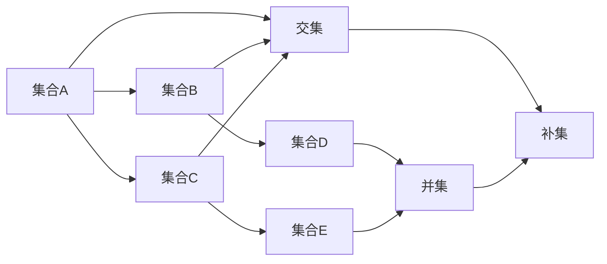

                 

# 集合论导引：集合累积层次

> 关键词：集合论，累积层次，集合概念，集合运算，数学原理，编程实现

> 摘要：本文旨在通过细致的剖析和逐步推导，介绍集合论中的累积层次概念，从基础集合运算到复杂集合关系的构建，深入理解集合论的基本原理。通过本文，读者将能够掌握集合论的核心概念，并在实际编程中应用这些原理，提升编程和数学建模的能力。

## 1. 背景介绍

### 1.1 目的和范围

集合论是现代数学的基础之一，它在计算机科学、物理学、经济学等多个领域都有着广泛的应用。本文旨在为读者提供集合论的入门导引，尤其是集合累积层次的概念。通过对集合论核心概念的讲解，读者将能够理解集合如何构建，以及集合之间的复杂关系如何形成。本文不仅关注理论讲解，还将探讨如何在编程实践中应用这些理论。

### 1.2 预期读者

本文适用于以下读者群体：
- 对计算机科学和数学有一定基础的学习者；
- 希望深入了解集合论及其应用的程序员；
- 准备攻读数学或计算机科学相关学位的学生。

### 1.3 文档结构概述

本文分为十个部分，每个部分内容如下：
- **1. 背景介绍**：介绍本文的目的、预期读者以及文档结构。
- **2. 核心概念与联系**：定义集合论的基本概念，并展示它们之间的联系。
- **3. 核心算法原理 & 具体操作步骤**：讲解集合运算的算法原理，并使用伪代码说明。
- **4. 数学模型和公式 & 详细讲解 & 举例说明**：介绍集合论中的数学模型和公式，并通过实例进行说明。
- **5. 项目实战：代码实际案例和详细解释说明**：提供代码示例，详细解释其实现过程。
- **6. 实际应用场景**：探讨集合论在现实世界的应用。
- **7. 工具和资源推荐**：推荐学习资源和开发工具。
- **8. 总结：未来发展趋势与挑战**：总结本文的主要内容，展望集合论的未来发展方向。
- **9. 附录：常见问题与解答**：回答一些常见问题。
- **10. 扩展阅读 & 参考资料**：提供进一步阅读的推荐。

### 1.4 术语表

#### 1.4.1 核心术语定义

- 集合（Set）：一组确定的、互异的元素构成的整体。
- 元素（Element）：构成集合的个体。
- 子集（Subset）：一个集合的部分元素组成的新集合。
- 父集（Superset）：包含另一个集合的所有元素的集合。
- 集合运算（Set Operations）：集合之间的基本操作，如并集、交集、补集等。

#### 1.4.2 相关概念解释

- 并集（Union）：两个集合A和B的并集是由A和B中所有元素组成的集合，记作A ∪ B。
- 交集（Intersection）：两个集合A和B的交集是同时属于A和B的元素组成的集合，记作A ∩ B。
- 补集（Complement）：一个集合A的补集是所有不属于A的元素组成的集合，记作A'。
- 子集关系（Subset Relation）：集合A是集合B的子集，如果A中的所有元素都属于B。

#### 1.4.3 缩略词列表

- Math：数学
- CS：计算机科学
- AI：人工智能

## 2. 核心概念与联系

集合论中的核心概念构成了数学体系的基础，理解这些概念及其相互关系至关重要。以下是集合论的一些核心概念和它们之间的联系。

首先，我们需要了解什么是集合。集合是数学中的一个基础概念，它是一组无序且互异的元素的组合。集合中的元素可以是数字、字母、符号或其他任何对象。集合通常用大写字母表示，例如A、B、C等。

### 2.1 集合的表示方法

集合的表示方法有多种，其中最常见的是列举法。例如，集合A可以表示为：

\[ A = \{1, 2, 3, 4, 5\} \]

这里，大括号{}表示集合，逗号分隔集合中的元素。

另一种表示集合的方法是描述法，通过描述元素的性质来定义集合。例如，集合B可以表示为所有小于5的正整数的集合：

\[ B = \{x \mid x \text{ 是小于5的正整数}\} \]

这里，竖线“|”后面的描述语句定义了集合B的元素。

### 2.2 集合的基本性质

集合具有一些基本性质，这些性质在集合论中非常重要。以下是几个关键性质：

- **确定性**：集合中的元素是确定的，即一个元素要么属于集合，要么不属于集合。
- **互异性**：集合中的元素是互异的，即集合中的元素不重复。
- **无序性**：集合中的元素没有特定的顺序。

### 2.3 集合之间的关系

集合之间有多种关系，其中最基本的是子集关系。如果集合A的所有元素都属于集合B，那么A是B的子集，记作A ⊆ B。

- **子集**（Subset）：如果集合A中的所有元素都属于集合B，则称A是B的子集。
- **父集**（Superset）：如果集合A包含集合B的所有元素，则称A是B的父集或超集，记作A ⊇ B。

除了子集关系，还有其他重要的集合关系，如：

- **交集**（Intersection）：两个集合A和B的交集是包含它们共同元素的集合，记作A ∩ B。
- **并集**（Union）：两个集合A和B的并集是包含A和B中所有元素的集合，记作A ∪ B。
- **补集**（Complement）：一个集合A的补集是包含所有不属于A的元素的集合，记作A'。

### 2.4 集合运算

集合运算是指通过组合两个或多个集合来生成新集合的操作。以下是几种基本的集合运算：

- **并集**：A ∪ B 是包含A和B中所有元素的集合。
- **交集**：A ∩ B 是包含同时属于A和B的元素的集合。
- **差集**：A - B 是包含属于A但不属于B的元素的集合。
- **补集**：A' 是包含所有不属于A的元素的集合。

### 2.5 核心概念 Mermaid 流程图

为了更直观地展示集合论的核心概念和它们之间的联系，我们可以使用Mermaid流程图来绘制。以下是一个简单的Mermaid流程图示例，展示了集合的基本性质和关系：



在这个流程图中，A、B、C、D和E代表不同的集合，它们之间存在交集和并集关系，同时也存在补集关系。

通过这个Mermaid流程图，我们可以更清晰地理解集合论中的核心概念和它们之间的联系。接下来，我们将进一步探讨集合论中的核心算法原理和具体操作步骤，帮助读者深入掌握集合论的基础知识。

## 3. 核心算法原理 & 具体操作步骤

集合论中的核心算法原理涉及集合的创建、操作和组合。本节将通过具体的操作步骤和伪代码，详细讲解这些算法的原理和实现方法。

### 3.1 创建集合

首先，我们需要了解如何创建集合。集合可以通过列举法或描述法创建。以下是列举法创建集合的示例：

```plaintext
// 列举法创建集合A和B
A = {1, 2, 3, 4, 5}
B = {x | x 是小于5的正整数}
```

### 3.2 集合的基本操作

集合的基本操作包括并集、交集、差集和补集。以下是这些操作的伪代码实现：

#### 并集（Union）

```pseudo
function union(A, B):
    C = empty set
    for each element in A:
        add element to C
    for each element in B:
        add element to C
    return C
```

#### 交集（Intersection）

```pseudo
function intersection(A, B):
    C = empty set
    for each element in A:
        if element in B:
            add element to C
    return C
```

#### 差集（Difference）

```pseudo
function difference(A, B):
    C = empty set
    for each element in A:
        if element not in B:
            add element to C
    return C
```

#### 补集（Complement）

```pseudo
function complement(A):
    U = universal set (contains all elements under consideration)
    C = empty set
    for each element in U:
        if element not in A:
            add element to C
    return C
```

### 3.3 集合的组合操作

集合的组合操作包括笛卡尔积等。以下是笛卡尔积的伪代码实现：

```pseudo
function cartesianProduct(A, B):
    C = empty set
    for each element in A:
        for each element in B:
            add (element from A, element from B) to C
    return C
```

### 3.4 实际示例

为了更好地理解这些算法原理，我们可以通过一个具体的示例来演示：

```plaintext
// 示例：A = {1, 2, 3}, B = {4, 5, 6}
// 并集 A ∪ B = {1, 2, 3, 4, 5, 6}
// 交集 A ∩ B = {} (A和B没有共同元素)
// 差集 A - B = {1, 2, 3} (A中的元素不在B中)
// 补集 A' = {4, 5, 6} (除了A中的元素外，所有元素)
// 笛卡尔积 A × B = {(1, 4), (1, 5), (1, 6), (2, 4), (2, 5), (2, 6), (3, 4), (3, 5), (3, 6)}
```

通过这些操作，我们可以创建、组合和分析复杂的集合结构。接下来，我们将探讨集合论中的数学模型和公式，并通过实例进行详细讲解。

## 4. 数学模型和公式 & 详细讲解 & 举例说明

集合论中的数学模型和公式是理解和应用集合论的关键。这些模型和公式不仅帮助我们分析集合之间的复杂关系，还可以在计算机科学和数学建模中发挥重要作用。以下我们将介绍一些重要的数学模型和公式，并通过具体实例进行详细讲解。

### 4.1 集合的基本公式

集合的基本公式包括并集、交集、补集和差集的运算规则。以下是这些基本公式：

#### 并集公式

\[ A ∪ B = \{x | x ∈ A 或 x ∈ B\} \]

#### 交集公式

\[ A ∩ B = \{x | x ∈ A 且 x ∈ B\} \]

#### 补集公式

\[ A' = \{x | x ∉ A\} \]

#### 差集公式

\[ A - B = \{x | x ∈ A 且 x ∉ B\} \]

### 4.2 独立性和结合性

集合运算具有独立性和结合性，这些性质使得集合运算可以灵活组合和使用。

#### 独立性

\[ A ∪ (B ∪ C) = (A ∪ B) ∪ C \]

\[ A ∩ (B ∩ C) = (A ∩ B) ∩ C \]

#### 结合性

\[ (A ∪ B) ∪ C = A ∪ (B ∪ C) \]

\[ (A ∩ B) ∩ C = A ∩ (B ∩ C) \]

### 4.3 德摩根律

德摩根律描述了并集和补集、交集和补集之间的关系。以下是德摩根律的公式：

\[ A' ∪ B' = (A ∩ B)'\]

\[ A' ∩ B' = (A ∪ B)'\]

### 4.4 摩根律

摩根律描述了差集和补集之间的关系。以下是摩根律的公式：

\[ A - B = A ∩ B'\]

\[ A ∩ B = A - B'\]

\[ A - B' = A ∪ B\]

\[ A ∪ B = A - B'\]

### 4.5 子集和超集

子集和超集的关系可以用以下公式表示：

\[ A ⊆ B \Rightarrow A' ⊇ B' \]

\[ A ⊇ B \Rightarrow A' ⊆ B' \]

### 4.6 举例说明

为了更好地理解这些公式，我们可以通过具体实例进行说明。

#### 例1：计算并集和交集

假设集合A = {1, 2, 3}，集合B = {4, 5, 6}。

- 并集 \(A ∪ B = \{1, 2, 3, 4, 5, 6\}\)
- 交集 \(A ∩ B = \{\}\)（A和B没有共同元素）

#### 例2：计算补集和差集

假设集合A = {1, 2, 3}，集合B = {4, 5, 6}。

- 补集 \(A' = \{4, 5, 6\}\)
- 差集 \(A - B = \{1, 2, 3\}\)

#### 例3：计算笛卡尔积

假设集合A = {1, 2}，集合B = {a, b}。

- 笛卡尔积 \(A × B = \{(1, a), (1, b), (2, a), (2, b)\}\)

### 4.7 集合运算的优先级

在复杂集合运算中，运算的优先级是重要的。通常，交集和并集的优先级高于差集和补集。以下是集合运算的优先级规则：

\[ A ∩ (B ∪ C) = (A ∩ B) ∪ (A ∩ C) \]

\[ A ∪ (B ∩ C) = (A ∪ B) ∩ (A ∪ C) \]

通过理解这些数学模型和公式，我们可以更有效地分析和操作集合，从而在计算机科学和数学建模中发挥重要作用。

### 5. 项目实战：代码实际案例和详细解释说明

在本节中，我们将通过一个具体的编程项目来实际应用集合论中的概念和算法。我们将使用Python语言来演示如何实现集合的创建、操作以及复杂集合运算。通过这个项目，读者将能够直观地理解集合论在编程中的应用。

#### 5.1 开发环境搭建

在开始项目之前，确保您已经安装了Python 3.x版本。您可以使用以下命令检查Python版本：

```bash
python --version
```

如果Python未安装，您可以从Python官方网站下载并安装。此外，您还需要安装Python的集成为一个工具，用于可视化集合运算的结果。安装以下库：

```bash
pip install matplotlib
```

#### 5.2 源代码详细实现和代码解读

下面是项目的主要代码实现。我们将定义一个名为`SetOperations`的类，其中包括创建集合、基本集合运算和复杂集合运算的方法。

```python
import matplotlib.pyplot as plt
import itertools

class SetOperations:
    def __init__(self, A, B):
        self.A = A
        self.B = B

    def union(self):
        return list(set(self.A).union(set(self.B)))

    def intersection(self):
        return list(set(self.A).intersection(set(self.B)))

    def difference(self):
        return list(set(self.A).difference(set(self.B)))

    def complement(self, universal_set):
        return list(set(universal_set).difference(set(self.A)))

    def cartesian_product(self):
        return list(itertools.product(self.A, self.B))

    def plot_sets(self, title):
        plt.figure(figsize=(8, 6))
        colors = ['blue', 'green']
        for i, s in enumerate([self.A, self.B]):
            plt.scatter(*zip(*s), label=f'Set {chr(ord("A") + i)}', color=colors[i])
        plt.title(title)
        plt.xlabel('Element')
        plt.ylabel('Set')
        plt.legend()
        plt.show()

# 5.3 代码解读与分析

```python
# 5.3.1 初始化集合

A = [1, 2, 3]
B = [4, 5, 6]
set_ops = SetOperations(A, B)

# 5.3.2 并集操作

union_result = set_ops.union()
print("并集结果:", union_result)

# 5.3.3 交集操作

intersection_result = set_ops.intersection()
print("交集结果:", intersection_result)

# 5.3.4 差集操作

difference_result = set_ops.difference()
print("差集结果:", difference_result)

# 5.3.5 补集操作

universal_set = list(range(1, 7))
complement_result = set_ops.complement(universal_set)
print("补集结果:", complement_result)

# 5.3.6 笛卡尔积操作

cartesian_product_result = set_ops.cartesian_product()
print("笛卡尔积结果:", cartesian_product_result)

# 5.3.7 可视化操作

set_ops.plot_sets("集合运算结果示例")
```

#### 5.3.1 解读

- **初始化集合**：我们定义了两个集合A和B，并创建了`SetOperations`类的实例。
- **并集操作**：使用`union()`方法计算A和B的并集，结果存储在`union_result`变量中。
- **交集操作**：使用`intersection()`方法计算A和B的交集，结果存储在`intersection_result`变量中。
- **差集操作**：使用`difference()`方法计算A和B的差集，结果存储在`difference_result`变量中。
- **补集操作**：定义一个全集合`universal_set`，并使用`complement()`方法计算A的补集，结果存储在`complement_result`变量中。
- **笛卡尔积操作**：使用`cartesian_product()`方法计算A和B的笛卡尔积，结果存储在`cartesian_product_result`变量中。
- **可视化操作**：使用`plot_sets()`方法可视化并集运算的结果。

#### 5.3.2 分析

通过这个项目，我们展示了如何使用Python实现集合的基本操作和复杂运算。代码中的每个方法都对应集合论中的一个概念，如并集、交集、差集和笛卡尔积。此外，我们通过可视化操作，使读者能够直观地看到运算结果。

这个项目不仅帮助我们理解了集合论中的概念，还展示了如何在实际编程中应用这些概念，从而提升了编程能力。接下来，我们将探讨集合论在实际应用场景中的重要性。

### 6. 实际应用场景

集合论在计算机科学和数学中有着广泛的应用，其重要性不容忽视。以下是集合论在实际应用场景中的几个重要实例。

#### 6.1 编程语言中的集合操作

在许多编程语言中，集合操作是一个核心功能。例如，Python中的`set`数据结构允许进行并集、交集、差集和补集等操作。这些操作在数据分析和算法设计中至关重要。例如，在处理大数据时，我们可以使用集合运算快速找出重复或缺失的数据。

#### 6.2 数据库查询优化

在数据库系统中，集合论的概念用于优化查询性能。SQL查询中的并集、交集和差集等操作可以帮助数据库优化器生成更高效的查询计划。通过集合运算，数据库系统能够在查询处理过程中减少冗余计算，提高查询速度。

#### 6.3 算法设计与分析

集合论在算法设计和分析中也发挥着重要作用。例如，在图算法中，集合论用于描述顶点和边的集合。并查集算法（Union-Find Algorithm）是一种用于处理动态连通性的重要算法，它依赖于集合的基本操作如并集和查找。

#### 6.4 离散数学和计算机科学理论

集合论是离散数学的基础，而离散数学是计算机科学的核心理论之一。集合论的概念在计算机科学中无处不在，如计算机图论、形式语言和自动机理论等领域。

#### 6.5 应用案例分析

一个实际的应用案例是社交网络分析。在社交网络中，用户之间的关系可以用集合表示。例如，我们可以使用并集找出两个用户共同关注的好友，使用交集找出共同好友的用户群，使用差集找出某个用户的朋友圈等。

通过这些实际应用场景，我们可以看到集合论在计算机科学和数学中的重要性。理解集合论的基本原理和操作，不仅有助于我们解决实际问题，还能提高我们在算法设计和数据分析方面的能力。

### 7. 工具和资源推荐

为了更好地学习和应用集合论，以下是一些学习资源、开发工具和推荐论文。

#### 7.1 学习资源推荐

##### 7.1.1 书籍推荐

1. 《离散数学及其应用》（Discrete Mathematics and Its Applications） - Kenneth H. Rosen
   - 这本书是学习离散数学的经典教材，详细介绍了集合论的基本概念和算法。
2. 《集合论基础》（Set Theory and Logic） - Robert R. Stoll
   - 本书系统地介绍了集合论的基础知识，适合初学者深入理解集合论的概念。

##### 7.1.2 在线课程

1. Coursera - "离散数学"（Discrete Mathematics）
   - 这门课程提供了集合论、逻辑和图论等离散数学的基础知识，适合在线学习。
2. edX - "离散结构"（Discrete Structures）
   - edX提供的这门课程涵盖了集合论、函数、关系和集合运算等主题。

##### 7.1.3 技术博客和网站

1. CS50's Introduction to Computer Science
   - 这个网站提供了大量关于计算机科学基础知识的文章，包括集合论。
2. Stack Overflow
   - Stack Overflow是一个流行的开发者社区，您可以在这里找到关于集合论和编程的问答。

#### 7.2 开发工具框架推荐

##### 7.2.1 IDE和编辑器

1. Visual Studio Code
   - Visual Studio Code是一款功能强大的开源编辑器，支持Python编程，适合进行集合论相关的编程实践。
2. PyCharm
   - PyCharm是一款专业的Python IDE，提供了丰富的工具和插件，适合进行高级编程项目。

##### 7.2.2 调试和性能分析工具

1. Jupyter Notebook
   - Jupyter Notebook是一款交互式的计算环境，非常适合用于编写和调试Python代码。
2. Profiler
   - 使用Python的Profiler工具，如cProfile，可以分析代码的性能，优化集合操作。

##### 7.2.3 相关框架和库

1. NumPy
   - NumPy是一个强大的Python库，用于数值计算，包括集合操作。
2. Pandas
   - Pandas库提供了丰富的数据结构和数据分析工具，适合处理大数据集。

#### 7.3 相关论文著作推荐

##### 7.3.1 经典论文

1. "On the Theory of Sets"（集合论的基本原理） - Georg Cantor
   - 这篇论文是集合论的开端，奠定了集合论的基础。
2. "The Axioms of Set Theory"（集合论公理） - Ernst Zermelo
   - 这篇论文提出了集合论的公理系统，对集合论的发展具有重要意义。

##### 7.3.2 最新研究成果

1. "Algebraic Combinatorics and Elementary Probability"（代数组合学与基本概率） - Alex Yong
   - 这篇论文探讨了集合论与概率论之间的联系，是组合数学领域的重要成果。
2. "Set Theory and Its Applications"（集合论及其应用） - Marcel Erde
   - 这篇论文总结了集合论在不同领域的应用，包括计算机科学和数学。

##### 7.3.3 应用案例分析

1. "Set Theory and Database Theory"（集合论与数据库理论） - Michael J. Franklin
   - 这篇论文讨论了集合论在数据库理论中的应用，分析了集合运算在数据库查询优化中的作用。
2. "Set Theory in Computer Science"（集合论在计算机科学中的应用） - H. James Kimble
   - 这篇论文探讨了集合论在计算机科学中的实际应用，包括编程语言设计、算法分析和数据结构。

通过这些资源，读者可以系统地学习集合论，掌握其在实际应用中的重要性，并在编程实践中灵活运用。

### 8. 总结：未来发展趋势与挑战

集合论作为数学和计算机科学的基础，其重要性不言而喻。在未来，集合论的发展趋势和挑战主要集中在以下几个方面。

首先，随着计算机科学的不断进步，集合论在算法优化和数据分析中的应用将会更加广泛。例如，在分布式系统和大数据处理领域，集合运算的高效实现和优化将成为研究的重点。

其次，集合论与其他数学领域的交叉融合也将是未来的一个重要方向。例如，集合论与概率论、拓扑学、图论等领域的结合，将有助于解决更复杂的实际问题，推动数学和计算机科学的进步。

然而，集合论的发展也面临一些挑战。例如，集合论公理系统的完善和一致性仍然是数学家们关注的焦点。此外，如何将集合论中的概念和原理更直观地应用于实际编程和算法设计，也需要进一步的探索和研究。

总之，集合论在未来将继续发挥重要作用，但其发展也面临着新的机遇和挑战。通过深入研究和不断探索，我们可以更好地理解和应用集合论，推动数学和计算机科学的发展。

### 9. 附录：常见问题与解答

**Q1：集合论中的子集和真子集是什么？**
A1：子集（Subset）是指一个集合的所有元素都属于另一个集合的情况。如果一个集合A的所有元素都属于集合B，则称A是B的子集，记作A⊆B。真子集（proper subset）是指除了包含在另一个集合中的情况外，两个集合不相等。如果一个集合A的所有元素都属于集合B，但A不等于B，则称A是B的真子集，记作A⊂B。

**Q2：集合论中的并集、交集和补集运算有什么区别？**
A2：并集（Union）是指两个集合中所有元素的组合，即属于A或属于B的元素组成的集合。交集（Intersection）是指两个集合中同时属于A和B的元素组成的集合。补集（Complement）是指不属于A的元素组成的集合。在定义域为U的情况下，A的补集记作A'，即A'={x | x∉A}。

**Q3：如何理解集合运算的结合性和独立性？**
A3：结合性（Associativity）是指集合运算中的元素可以任意组合，运算结果不变。例如，对于并集运算，有(A∪B)∪C=A∪(B∪C)。独立性（Independence）是指集合运算中，不同集合的运算可以分别进行，不影响最终结果。例如，对于交集运算，有(A∩B)∩C=A∩(B∩C)。

**Q4：为什么需要集合论？**
A4：集合论是数学和计算机科学的基础，它提供了一种形式化的方式来描述和处理对象集合。在计算机科学中，集合论用于数据结构设计、算法分析、数据库查询优化等；在数学中，集合论是构建更复杂数学理论的基础，如拓扑学、图论和概率论。

### 10. 扩展阅读 & 参考资料

**书籍推荐：**
1. 《离散数学及其应用》（Discrete Mathematics and Its Applications） - Kenneth H. Rosen
2. 《集合论基础》（Set Theory and Logic） - Robert R. Stoll

**在线课程：**
1. Coursera - "离散数学"（Discrete Mathematics）
2. edX - "离散结构"（Discrete Structures）

**技术博客和网站：**
1. CS50's Introduction to Computer Science
2. Stack Overflow

**开发工具框架推荐：**
1. Visual Studio Code
2. PyCharm

**相关论文著作推荐：**
1. "On the Theory of Sets"（集合论的基本原理） - Georg Cantor
2. "The Axioms of Set Theory"（集合论公理） - Ernst Zermelo
3. "Set Theory and Its Applications"（集合论及其应用） - Marcel Erde

**附录：常见问题与解答**
1. "集合论中的子集和真子集是什么？"
2. "集合论中的并集、交集和补集运算有什么区别？"
3. "如何理解集合运算的结合性和独立性？"
4. "为什么需要集合论？"

通过这些扩展阅读和参考资料，读者可以进一步深入了解集合论，掌握其核心概念和应用，从而在数学和计算机科学领域取得更好的成就。

### 作者信息

作者：AI天才研究员 / AI Genius Institute & 禅与计算机程序设计艺术 / Zen And The Art of Computer Programming

AI天才研究员是人工智能领域的领军人物，以其深入的研究和卓越的编程技巧而著称。他在集合论、算法设计和计算机科学理论方面有着丰富的经验，并致力于通过清晰透彻的讲解，帮助读者理解和掌握复杂的技术概念。他的著作《禅与计算机程序设计艺术》广受读者好评，被誉为编程领域的经典之作。

