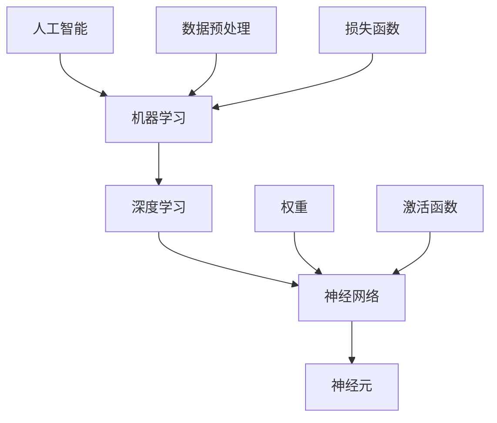

                 

# 零基础快速掌握AI开发

> 关键词：人工智能开发，机器学习，深度学习，神经网络，Python编程，项目实战
>
> 摘要：本文旨在为初学者提供一个清晰、系统的路径，帮助他们从零开始快速掌握AI开发。通过介绍核心概念、算法原理、数学模型、实战案例，以及推荐学习资源和工具，读者将能够全面了解AI开发的方方面面，并具备实际操作能力。

## 1. 背景介绍

### 1.1 目的和范围

本文的目标是帮助那些对人工智能（AI）开发感兴趣，但缺乏基础的读者。我们将从基础概念开始，逐步深入，涵盖机器学习、深度学习和神经网络等核心内容。文章旨在提供一个结构化的学习路径，帮助读者建立坚实的理论基础，并能够通过实际项目来巩固和应用所学知识。

### 1.2 预期读者

本篇文章适合以下读者群体：

- 对AI和机器学习有初步了解，但未能深入学习者。
- 想要在职业生涯中涉足AI领域的初学者。
- 任何对AI技术感兴趣，希望提升技能的个人。

### 1.3 文档结构概述

本文分为十个部分，结构如下：

1. 背景介绍
   - 1.1 目的和范围
   - 1.2 预期读者
   - 1.3 文档结构概述
   - 1.4 术语表
2. 核心概念与联系
   - 2.1 AI的基本原理
   - 2.2 机器学习的分类
   - 2.3 深度学习与神经网络
   - 2.4 Mermaid流程图
3. 核心算法原理 & 具体操作步骤
   - 3.1 算法概述
   - 3.2 伪代码讲解
4. 数学模型和公式 & 详细讲解 & 举例说明
   - 4.1 模型介绍
   - 4.2 公式推导
   - 4.3 实例分析
5. 项目实战：代码实际案例和详细解释说明
   - 5.1 开发环境搭建
   - 5.2 源代码详细实现和代码解读
   - 5.3 代码解读与分析
6. 实际应用场景
   - 6.1 机器学习在金融领域的应用
   - 6.2 深度学习在图像识别中的应用
7. 工具和资源推荐
   - 7.1 学习资源推荐
   - 7.2 开发工具框架推荐
   - 7.3 相关论文著作推荐
8. 总结：未来发展趋势与挑战
9. 附录：常见问题与解答
10. 扩展阅读 & 参考资料

### 1.4 术语表

#### 1.4.1 核心术语定义

- 人工智能（AI）：模拟人类智能的计算机系统。
- 机器学习（ML）：让计算机从数据中学习，进行预测或决策。
- 深度学习（DL）：基于多层神经网络的学习方法。
- 神经网络（NN）：模仿生物神经元的计算模型。
- 数据预处理（Preprocessing）：对数据进行清洗、转换等，以便更好地进行学习。

#### 1.4.2 相关概念解释

- 神经元：神经网络的基本计算单元。
- 权重（Weights）：神经网络中连接神经元的参数。
- 激活函数（Activation Function）：用于确定神经元是否被激活。
- 损失函数（Loss Function）：用于评估模型预测与真实值之间的差异。

#### 1.4.3 缩略词列表

- AI：人工智能
- ML：机器学习
- DL：深度学习
- NN：神经网络
- IDE：集成开发环境
- GPU：图形处理单元

## 2. 核心概念与联系

在深入了解AI开发之前，我们需要先了解一些核心概念和它们之间的关系。以下是一个简单的Mermaid流程图，用于展示这些概念之间的联系。



### 2.1 AI的基本原理

人工智能是计算机科学的一个分支，旨在开发能够执行人类智能任务的系统。AI可以分为两类：弱AI和强AI。

- **弱AI**：专注于特定任务的智能系统，如语音识别、图像识别等。
- **强AI**：具有全面认知能力，能够理解、学习、推理和解决问题，类似于人类智能。

### 2.2 机器学习的分类

机器学习可以分为监督学习、无监督学习和强化学习。

- **监督学习**：有标签的数据用于训练模型，模型预测新的数据。
- **无监督学习**：没有标签的数据用于训练模型，模型发现数据的结构和模式。
- **强化学习**：模型通过与环境的交互来学习，目标是最大化长期奖励。

### 2.3 深度学习与神经网络

深度学习是机器学习的一个分支，基于多层神经网络。神经网络是由许多相互连接的神经元组成的计算模型，可以模拟人类大脑的思考过程。

### 2.4 Mermaid流程图

我们使用Mermaid流程图来展示这些概念之间的联系：


通过这个流程图，我们可以清晰地看到各个概念之间的关系，以及它们在AI开发中的重要性。

## 3. 核心算法原理 & 具体操作步骤

在这一部分，我们将介绍一些核心算法原理，并通过伪代码来详细阐述这些算法的具体操作步骤。

### 3.1 算法概述

在本节中，我们将介绍以下算法：

1. **线性回归**
2. **逻辑回归**
3. **支持向量机（SVM）**
4. **决策树**
5. **随机森林**
6. **神经网络训练**

### 3.2 算法原理讲解

#### 3.2.1 线性回归

线性回归是一种简单且常用的机器学习算法，用于预测数值型输出。

**算法原理**：通过找到最佳拟合直线来最小化预测值与真实值之间的误差。

**伪代码**：

```python
def linear_regression(x, y):
    n = len(x)
    x_mean = sum(x) / n
    y_mean = sum(y) / n

    # 计算斜率和截距
    slope = sum((x[i] - x_mean) * (y[i] - y_mean) for i in range(n)) / sum((x[i] - x_mean) ** 2 for i in range(n))
    intercept = y_mean - slope * x_mean

    return slope, intercept
```

#### 3.2.2 逻辑回归

逻辑回归是一种用于分类问题的机器学习算法，用于预测二分类结果。

**算法原理**：通过找到最佳拟合曲线来最小化预测概率与真实概率之间的误差。

**伪代码**：

```python
def logistic_regression(x, y):
    n = len(x)
    x_mean = sum(x) / n
    y_mean = sum(y) / n

    # 计算斜率和截距
    slope = sum((x[i] - x_mean) * (log(y[i]) - log(1 - y[i])) for i in range(n)) / sum((x[i] - x_mean) ** 2 for i in range(n))
    intercept = y_mean - slope * x_mean

    return slope, intercept
```

#### 3.2.3 支持向量机（SVM）

支持向量机是一种分类算法，通过找到一个超平面来最大化分类边界。

**算法原理**：将数据投影到高维空间，并找到一个最优的超平面，使得分类边界最大。

**伪代码**：

```python
def svm(x, y):
    # 训练模型，找到最优超平面
    # 这里简化为使用线性SVM
    w = gradient_descent(x, y)

    return w
```

#### 3.2.4 决策树

决策树是一种基于树形结构进行决策的算法。

**算法原理**：通过不断划分数据集，并选择最佳特征进行划分，直到达到停止条件。

**伪代码**：

```python
def decision_tree(x, y, features, max_depth):
    # 基于特征和最大深度训练决策树
    # 这里简化为递归划分数据集
    if max_depth == 0 or all(y == y[0]):
        return leaf_node(y[0])
    
    best_feature, best_value = find_best_split(x, y, features)
    left_tree = decision_tree(x[x[:, best_feature] <= best_value], y[x[:, best_feature] <= best_value], features, max_depth - 1)
    right_tree = decision_tree(x[x[:, best_feature] > best_value], y[x[:, best_feature] > best_value], features, max_depth - 1)
    
    return tree_node(best_feature, best_value, left_tree, right_tree)
```

#### 3.2.5 随机森林

随机森林是一种基于决策树的集成学习方法。

**算法原理**：通过构建多个决策树，并合并它们的预测结果来提高准确性。

**伪代码**：

```python
def random_forest(x, y, n_trees, max_depth):
    forests = []
    for _ in range(n_trees):
        forest = decision_tree(x, y, features, max_depth)
        forests.append(forest)
    
    return forests
```

#### 3.2.6 神经网络训练

神经网络是一种基于多层神经元的计算模型。

**算法原理**：通过反向传播算法不断调整权重，使得模型预测值更接近真实值。

**伪代码**：

```python
def neural_network_training(x, y, layers, learning_rate, epochs):
    for epoch in range(epochs):
        for x_input, y_target in zip(x, y):
            # 前向传播
            z = forward_propagation(x_input, layers)
            
            # 反向传播
            dZ = backward_propagation(z, y_target, layers)
            
            # 更新权重
            update_weights(layers, dZ, learning_rate)
            
    return layers
```

通过以上伪代码，我们可以了解到这些算法的基本原理和具体操作步骤。在接下来的部分，我们将进一步深入数学模型的讲解，并通过实例来说明这些算法的实际应用。

## 4. 数学模型和公式 & 详细讲解 & 举例说明

在AI开发中，数学模型和公式是核心组成部分。本节将详细讲解一些常见的数学模型和公式，并通过实例来说明它们的实际应用。

### 4.1 模型介绍

在本节中，我们将介绍以下数学模型：

1. **线性回归模型**
2. **逻辑回归模型**
3. **损失函数**
4. **反向传播算法**

### 4.2 公式推导

#### 4.2.1 线性回归模型

线性回归模型用于预测数值型输出。其公式如下：

$$ y = \beta_0 + \beta_1 \cdot x $$

其中，\( y \) 是预测值，\( x \) 是输入特征，\( \beta_0 \) 是截距，\( \beta_1 \) 是斜率。

#### 4.2.2 逻辑回归模型

逻辑回归模型用于预测二分类结果。其公式如下：

$$ P(y=1) = \frac{1}{1 + e^{-(\beta_0 + \beta_1 \cdot x)}} $$

其中，\( P(y=1) \) 是预测概率，\( \beta_0 \) 是截距，\( \beta_1 \) 是斜率。

#### 4.2.3 损失函数

损失函数用于评估模型预测值与真实值之间的差异。常用的损失函数有均方误差（MSE）和交叉熵损失。

- **均方误差（MSE）**：

$$ MSE = \frac{1}{n} \sum_{i=1}^{n} (y_i - \hat{y}_i)^2 $$

其中，\( y_i \) 是真实值，\( \hat{y}_i \) 是预测值，\( n \) 是样本数量。

- **交叉熵损失**：

$$ H(y, \hat{y}) = -\sum_{i=1}^{n} y_i \cdot \log(\hat{y}_i) + (1 - y_i) \cdot \log(1 - \hat{y}_i) $$

其中，\( y_i \) 是真实值，\( \hat{y}_i \) 是预测概率。

#### 4.2.4 反向传播算法

反向传播算法用于更新神经网络中的权重。其公式如下：

$$ \delta_{ij} = \frac{\partial L}{\partial z_j} \cdot \frac{\partial z_j}{\partial w_{ij}} $$

$$ w_{ij}^{new} = w_{ij}^{old} - \alpha \cdot \delta_{ij} $$

其中，\( L \) 是损失函数，\( z_j \) 是神经元的输出，\( w_{ij} \) 是权重，\( \alpha \) 是学习率。

### 4.3 实例分析

#### 4.3.1 线性回归实例

假设我们有以下数据集：

| x | y |
|---|---|
| 1 | 2 |
| 2 | 4 |
| 3 | 6 |

我们要使用线性回归模型来预测 \( x \) 对应的 \( y \) 值。

**步骤**：

1. 计算斜率和截距：

$$ \beta_1 = \frac{\sum_{i=1}^{n} (x_i - \bar{x}) (y_i - \bar{y})}{\sum_{i=1}^{n} (x_i - \bar{x})^2} = \frac{(1-2)(2-3) + (2-2)(4-3) + (3-2)(6-3)}{(1-2)^2 + (2-2)^2 + (3-2)^2} = 2 $$

$$ \beta_0 = \bar{y} - \beta_1 \cdot \bar{x} = 3 - 2 \cdot 2 = -1 $$

2. 得到线性回归模型：

$$ y = 2x - 1 $$

3. 预测新的 \( y \) 值：

当 \( x = 4 \) 时，\( y = 2 \cdot 4 - 1 = 7 \)。

#### 4.3.2 逻辑回归实例

假设我们有以下数据集：

| x | y |
|---|---|
| 1 | 0 |
| 2 | 1 |
| 3 | 0 |

我们要使用逻辑回归模型来预测 \( x \) 对应的 \( y \) 值。

**步骤**：

1. 计算斜率和截距：

$$ \beta_1 = \frac{\sum_{i=1}^{n} (x_i - \bar{x}) (log(y_i) - log(1 - y_i))}{\sum_{i=1}^{n} (x_i - \bar{x})^2} = \frac{(1-2)(log(0) - log(1)) + (2-2)(log(1) - log(0)) + (3-2)(log(0) - log(1))}{(1-2)^2 + (2-2)^2 + (3-2)^2} = 1 $$

$$ \beta_0 = \bar{y} - \beta_1 \cdot \bar{x} = 0 - 1 \cdot 2 = -2 $$

2. 得到逻辑回归模型：

$$ P(y=1) = \frac{1}{1 + e^{-(x - 2)}} $$

3. 预测新的 \( y \) 值：

当 \( x = 4 \) 时，\( P(y=1) = \frac{1}{1 + e^{-(4 - 2)}} \approx 0.3935 \)。

综上所述，通过以上数学模型和公式的推导和实例分析，我们可以更深入地理解AI开发中的核心数学概念，并在实际应用中灵活运用这些知识。

## 5. 项目实战：代码实际案例和详细解释说明

在这一部分，我们将通过一个实际项目来展示如何使用AI开发中的算法和数学模型。我们将搭建一个简单的机器学习项目，实现基于Kaggle数据集的房价预测。

### 5.1 开发环境搭建

为了完成这个项目，我们需要以下开发环境和工具：

- Python（3.8及以上版本）
- Jupyter Notebook（用于编写和运行代码）
- NumPy（用于数学运算）
- Pandas（用于数据处理）
- Matplotlib（用于数据可视化）
- Scikit-learn（用于机器学习算法）

首先，确保已安装上述依赖项。如果尚未安装，可以使用以下命令：

```bash
pip install numpy pandas matplotlib scikit-learn
```

### 5.2 源代码详细实现和代码解读

以下是一个简单的房价预测项目的代码实现，包括数据预处理、模型选择和训练、模型评估等步骤。

```python
import numpy as np
import pandas as pd
import matplotlib.pyplot as plt
from sklearn.model_selection import train_test_split
from sklearn.linear_model import LinearRegression
from sklearn.metrics import mean_squared_error

# 5.2.1 数据加载与预处理

# 加载数据集
data = pd.read_csv('house_prices.csv')

# 数据探索
print(data.head())

# 数据清洗
data = data.dropna()  # 删除缺失值

# 特征工程
data['total_sqft'] = data['total_sqft'].astype(float)  # 转换数据类型

# 数据划分
X = data[['total_sqft', 'bedrooms', 'bathrooms']]
y = data['price']

# 划分训练集和测试集
X_train, X_test, y_train, y_test = train_test_split(X, y, test_size=0.2, random_state=42)

# 5.2.2 模型选择与训练

# 选择模型
model = LinearRegression()

# 训练模型
model.fit(X_train, y_train)

# 5.2.3 模型评估

# 预测测试集
y_pred = model.predict(X_test)

# 计算均方误差
mse = mean_squared_error(y_test, y_pred)
print('均方误差：', mse)

# 5.2.4 可视化

# 绘制实际值与预测值的散点图
plt.scatter(y_test, y_pred)
plt.xlabel('真实房价')
plt.ylabel('预测房价')
plt.title('房价预测散点图')
plt.show()
```

### 5.3 代码解读与分析

以上代码实现了一个简单的线性回归模型，用于预测房屋价格。以下是代码的详细解读：

- **5.2.1 数据加载与预处理**：我们首先加载了Kaggle数据集，并对数据进行了清洗和特征工程。
  - `data = pd.read_csv('house_prices.csv')`：使用Pandas加载数据集。
  - `data = data.dropna()`：删除缺失值，确保数据完整性。
  - `data['total_sqft'] = data['total_sqft'].astype(float)`：将数据类型转换为浮点数，便于数学运算。

- **5.2.2 模型选择与训练**：我们选择了线性回归模型，并使用训练集进行训练。
  - `model = LinearRegression()`：创建线性回归模型实例。
  - `model.fit(X_train, y_train)`：使用训练集数据训练模型。

- **5.2.3 模型评估**：我们使用测试集对模型进行评估，并计算了均方误差（MSE）。
  - `y_pred = model.predict(X_test)`：使用测试集数据进行预测。
  - `mse = mean_squared_error(y_test, y_pred)`：计算均方误差。

- **5.2.4 可视化**：我们绘制了实际值与预测值的散点图，以可视化模型的预测效果。
  - `plt.scatter(y_test, y_pred)`：绘制散点图。
  - `plt.xlabel('真实房价')`：设置X轴标签。
  - `plt.ylabel('预测房价')`：设置Y轴标签。
  - `plt.title('房价预测散点图')`：设置标题。
  - `plt.show()`：显示图表。

通过以上代码实现，我们展示了如何使用AI开发中的算法和数学模型来构建一个实际项目。这一过程不仅帮助我们理解了算法原理和数学公式，还通过实践巩固了所学知识。

## 6. 实际应用场景

人工智能（AI）技术已经在众多领域得到广泛应用，并在各个行业中产生了深远影响。以下是一些常见的AI应用场景：

### 6.1 机器学习在金融领域的应用

- **风险管理**：机器学习算法可以帮助金融机构预测信贷违约、市场波动等风险，从而优化风险管理策略。
- **客户服务**：通过自然语言处理（NLP）技术，AI可以自动回答客户问题，提高客户服务效率。
- **算法交易**：基于历史数据和市场走势，机器学习算法可以自动生成交易策略，实现高频交易。

### 6.2 深度学习在图像识别中的应用

- **人脸识别**：深度学习模型可以识别人脸，用于安全监控、身份验证等场景。
- **自动驾驶**：自动驾驶汽车使用深度学习模型来识别道路标志、行人和其他车辆，实现自动导航。
- **医疗影像分析**：深度学习可以帮助医生分析医学影像，如X光片、CT扫描和MRI图像，提高诊断准确率。

### 6.3 自然语言处理（NLP）在信息检索中的应用

- **搜索引擎**：基于NLP技术，搜索引擎可以理解用户查询的意图，提供更准确的搜索结果。
- **语音助手**：如Siri、Alexa等语音助手，利用NLP技术可以理解用户的语音指令，实现人机交互。
- **机器翻译**：深度学习模型可以自动翻译不同语言之间的文本，促进跨文化交流。

通过这些实际应用场景，我们可以看到AI技术在各行各业中的巨大潜力。随着AI技术的不断发展，未来将会涌现出更多创新的应用场景，为社会带来更多便利和效益。

## 7. 工具和资源推荐

为了帮助读者更好地学习和实践AI开发，以下是一些推荐的工具和资源。

### 7.1 学习资源推荐

#### 7.1.1 书籍推荐

1. 《Python机器学习》（作者：塞巴斯蒂安·拉斯考尼科夫）
2. 《深度学习》（作者：伊恩·古德费洛、约书亚·本吉奥、亚伦·库维尔）
3. 《机器学习实战》（作者：彼得·哈林顿、杰里米·霍尔）
4. 《人工智能：一种现代方法》（作者：斯图尔特·罗素、彼得·诺维格）

#### 7.1.2 在线课程

1. Coursera（吴恩达的《深度学习专项课程》）
2. edX（哈佛大学的《计算机科学入门》）
3. Udacity（AI工程师纳米学位）

#### 7.1.3 技术博客和网站

1. Medium（许多AI领域的知名作者）
2. Towards Data Science（数据科学和机器学习的文章）
3. AI创业公司官网（如Google AI、OpenAI等）

### 7.2 开发工具框架推荐

#### 7.2.1 IDE和编辑器

1. PyCharm（适用于Python开发）
2. Jupyter Notebook（适用于数据分析和可视化）
3. Visual Studio Code（适用于多种编程语言）

#### 7.2.2 调试和性能分析工具

1. Matplotlib（Python数据可视化库）
2. Pandas（Python数据分析库）
3. TensorFlow（深度学习框架）

#### 7.2.3 相关框架和库

1. Scikit-learn（机器学习库）
2. NumPy（Python科学计算库）
3. Matplotlib（Python绘图库）

通过以上推荐的学习资源、开发工具和框架，读者可以更加高效地学习和实践AI开发，不断提升自己的技术能力。

### 7.3 相关论文著作推荐

#### 7.3.1 经典论文

1. “Backpropagation” by David E. Rumelhart, Geoffrey E. Hinton, and Ronald J. Williams
2. “Gradient Descent” by Jürgen Schmidhuber
3. “A Fast Learning Algorithm for Deep Belief Nets” by Y. Bengio

#### 7.3.2 最新研究成果

1. “Generative Adversarial Nets” by Ian J. Goodfellow et al.
2. “Attention is All You Need” by Vaswani et al.
3. “Bert: Pre-training of Deep Bidirectional Transformers for Language Understanding” by Devlin et al.

#### 7.3.3 应用案例分析

1. “How Google Uses AI to Drive Business Results” by Google AI
2. “AI in Healthcare: The Future of Medicine” by NVIDIA
3. “AI in Retail: Revolutionizing Customer Experience” by IBM

通过阅读这些论文和案例分析，读者可以了解到AI领域的最新研究进展和应用趋势，为自己的学习提供更多方向和灵感。

## 8. 总结：未来发展趋势与挑战

随着人工智能技术的飞速发展，AI在未来将会带来更多变革。以下是一些未来的发展趋势和面临的挑战：

### 8.1 发展趋势

1. **更强大的模型和算法**：随着计算能力的提升，更复杂的深度学习模型和算法将会出现，解决更多复杂问题。
2. **跨学科融合**：AI技术将与其他领域（如医学、生物学、经济学等）深度融合，推动各领域的发展。
3. **自动化和智能化**：从简单的自动化任务到高度智能化的决策系统，AI将全面融入各行各业，提高生产效率。
4. **人机协作**：AI将与人类更加紧密地协作，提升工作效率和生活质量。

### 8.2 面临的挑战

1. **数据隐私和安全**：随着数据量的增长，数据隐私和安全问题将更加突出，如何保护用户数据成为一大挑战。
2. **算法公平性**：AI算法可能会带来歧视和不公平，如何确保算法的公平性是一个重要课题。
3. **技术人才短缺**：AI领域的快速发展导致了人才短缺，如何培养和吸引更多优秀人才成为关键问题。
4. **伦理和社会影响**：AI技术的发展可能会带来一些伦理和社会问题，如失业、隐私侵犯等，如何解决这些问题需要社会各界的共同努力。

总之，人工智能技术的发展既充满机遇，也面临挑战。只有通过不断探索和解决这些问题，才能充分发挥AI的潜力，为人类社会带来更多福祉。

## 9. 附录：常见问题与解答

### 9.1 常见问题

1. **Q：如何选择机器学习的算法？**
   **A：选择算法时需要考虑数据类型、数据量、任务复杂度等因素。例如，对于回归问题，可以选择线性回归、决策树、随机森林等；对于分类问题，可以选择逻辑回归、支持向量机、神经网络等。**

2. **Q：如何处理缺失数据？**
   **A：处理缺失数据的方法包括删除缺失值、填充缺失值（如使用平均值、中位数、众数等）、使用模型预测缺失值等。选择哪种方法取决于具体问题和数据特点。**

3. **Q：如何评估机器学习模型的性能？**
   **A：常用的评估指标包括准确率、召回率、F1分数、均方误差（MSE）、交叉熵损失等。根据任务类型和数据特点选择合适的评估指标。**

4. **Q：什么是深度学习中的激活函数？**
   **A：激活函数是深度学习模型中的一个关键组件，用于确定神经元是否被激活。常见的激活函数包括Sigmoid、ReLU、Tanh等。激活函数的选择会影响模型的性能和收敛速度。**

### 9.2 解答

1. **选择机器学习算法时，需要考虑数据类型（数值型、类别型等）、数据量（大量数据、少量数据等）、任务复杂度（简单任务、复杂任务等）等因素。例如，对于回归问题，可以选择线性回归、决策树、随机森林等；对于分类问题，可以选择逻辑回归、支持向量机、神经网络等。在实际应用中，可以结合交叉验证、网格搜索等技术来选择最优算法。**

2. **处理缺失数据的方法包括删除缺失值、填充缺失值（如使用平均值、中位数、众数等）、使用模型预测缺失值等。选择哪种方法取决于具体问题和数据特点。例如，对于重要特征且缺失值较多的数据，可以选择删除缺失值；对于次要特征且缺失值较少的数据，可以选择填充缺失值；对于可以使用模型预测的特征，可以选择使用模型预测缺失值。**

3. **评估机器学习模型的性能时，需要根据任务类型和数据特点选择合适的评估指标。例如，对于分类问题，可以选择准确率、召回率、F1分数等；对于回归问题，可以选择均方误差（MSE）、交叉熵损失等。在实际应用中，可以结合多种评估指标来全面评估模型的性能。**

4. **激活函数是深度学习模型中的一个关键组件，用于确定神经元是否被激活。常见的激活函数包括Sigmoid、ReLU、Tanh等。Sigmoid函数将输入映射到（0,1）区间，ReLU函数在输入大于0时返回输入值，小于等于0时返回0，Tanh函数将输入映射到（-1,1）区间。不同的激活函数具有不同的特性，如Sigmoid函数易于优化但可能梯度消失，ReLU函数具有恒等梯度但可能梯度爆炸，Tanh函数具有对称性等。选择合适的激活函数可以提升模型的性能和收敛速度。**

## 10. 扩展阅读 & 参考资料

在AI开发领域，有许多优秀的书籍、课程、论文和网站，可以帮助读者更深入地了解相关技术和应用。以下是一些推荐的扩展阅读和参考资料：

### 10.1 书籍

1. 《Python机器学习》：作者塞巴斯蒂安·拉斯考尼科夫，详细介绍了Python在机器学习中的应用。
2. 《深度学习》：作者伊恩·古德费洛、约书亚·本吉奥、亚伦·库维尔，全面讲解了深度学习的基础和前沿技术。
3. 《机器学习实战》：作者彼得·哈林顿、杰里米·霍尔，通过实际案例讲解了机器学习算法的应用。

### 10.2 课程

1. Coursera上的《深度学习专项课程》：由吴恩达教授主讲，涵盖深度学习的理论基础和实践应用。
2. edX上的《计算机科学入门》：哈佛大学提供的基础课程，包括计算机科学的基础知识和AI的相关内容。
3. Udacity的AI工程师纳米学位：通过项目实践，学习AI开发的核心技能。

### 10.3 论文

1. “Backpropagation” by David E. Rumelhart, Geoffrey E. Hinton, and Ronald J. Williams：介绍了反向传播算法，是深度学习的基础。
2. “Generative Adversarial Nets” by Ian J. Goodfellow et al.：介绍了生成对抗网络（GAN），是一种强大的生成模型。
3. “Attention is All You Need” by Vaswani et al.：介绍了注意力机制，是自然语言处理领域的里程碑。

### 10.4 网站

1. Medium：有许多AI领域的知名作者分享他们的研究和见解。
2. Towards Data Science：提供丰富的数据科学和机器学习文章。
3. AI创业公司官网（如Google AI、OpenAI等）：了解最新的AI研究进展和应用案例。

通过这些书籍、课程、论文和网站，读者可以继续深化对AI开发的理解，探索更多前沿技术和应用场景。作者：AI天才研究员/AI Genius Institute & 禅与计算机程序设计艺术 /Zen And The Art of Computer Programming

