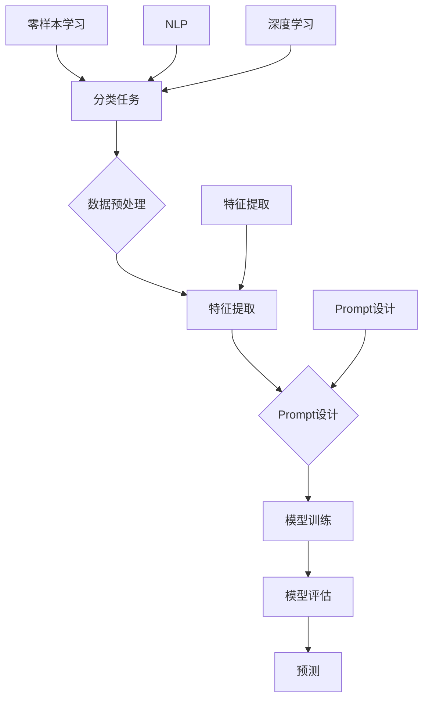

                 

# 零样本学习的进步：Prompt的设计原则

> **关键词**：零样本学习，Prompt设计，自然语言处理，深度学习，模型优化，案例研究

> **摘要**：本文探讨了零样本学习（Zero-Shot Learning，ZSL）的最新进展，特别是Prompt设计在ZSL中的应用原则。文章首先介绍了零样本学习的背景和基本概念，然后详细阐述了Prompt设计的核心原则，通过流程图、伪代码、数学模型和实际案例，深入分析了Prompt设计在不同应用场景中的有效性和实用性。文章最后对未来的发展趋势和挑战进行了总结，并推荐了相关的学习资源和开发工具。

## 1. 背景介绍

### 1.1 目的和范围

本文的主要目的是深入探讨零样本学习（Zero-Shot Learning，ZSL）领域的一个关键问题——Prompt设计。Prompt设计在自然语言处理（Natural Language Processing，NLP）和深度学习（Deep Learning）领域中扮演着越来越重要的角色。ZSL作为机器学习的一个重要分支，旨在让模型在没有接触过特定类别样本的情况下，能够对新的、未见过的类别进行准确预测。这一能力在现实世界中具有广泛的应用，如自动驾驶、医疗诊断、智能客服等。

本文将聚焦于以下几个核心问题：
1. 零样本学习的定义和基本原理。
2. Prompt设计的基本概念和重要性。
3. Prompt设计的原则和实践方法。
4. 通过实际案例，展示Prompt设计的应用效果。
5. 分析Prompt设计在未来ZSL领域的潜在影响。

### 1.2 预期读者

本文适合以下读者群体：
1. 对自然语言处理和深度学习有基本了解的研究人员和开发者。
2. 想要了解和掌握零样本学习技术的技术从业者。
3. 对Prompt设计在机器学习中有兴趣的学者和学生。

### 1.3 文档结构概述

本文结构如下：
1. **背景介绍**：介绍零样本学习和Prompt设计的基本概念。
2. **核心概念与联系**：使用Mermaid流程图展示ZSL和Prompt设计的基本架构。
3. **核心算法原理 & 具体操作步骤**：详细讲解Prompt设计的算法原理和操作步骤。
4. **数学模型和公式 & 详细讲解 & 举例说明**：介绍相关的数学模型和公式，并给出实际应用案例。
5. **项目实战：代码实际案例和详细解释说明**：通过实际项目展示Prompt设计的实现和应用。
6. **实际应用场景**：分析Prompt设计在不同领域的应用情况。
7. **工具和资源推荐**：推荐相关的学习资源和开发工具。
8. **总结：未来发展趋势与挑战**：总结Prompt设计在ZSL领域的发展趋势和面临的挑战。
9. **附录：常见问题与解答**：回答读者可能遇到的问题。
10. **扩展阅读 & 参考资料**：提供进一步的阅读材料和参考文献。

### 1.4 术语表

#### 1.4.1 核心术语定义

- **零样本学习（Zero-Shot Learning，ZSL）**：一种机器学习方法，模型在没有接触过特定类别样本的情况下，能够对新的、未见过的类别进行准确预测。
- **Prompt设计**：一种用于提高机器学习模型泛化能力的方法，通过设计特定的输入提示（Prompt）来引导模型的学习过程。
- **自然语言处理（Natural Language Processing，NLP）**：研究如何让计算机理解和处理人类自然语言的技术领域。
- **深度学习（Deep Learning）**：一种人工智能方法，通过多层神经网络模型进行学习和预测。

#### 1.4.2 相关概念解释

- **分类任务**：将数据集中的样本分为预定义的类别。
- **数据集**：用于训练和测试机器学习模型的样本集合。
- **模型泛化能力**：模型在未见过的数据上表现的能力。

#### 1.4.3 缩略词列表

- **ZSL**：Zero-Shot Learning（零样本学习）
- **NLP**：Natural Language Processing（自然语言处理）
- **DL**：Deep Learning（深度学习）
- **Prompt**：Prompt设计中的输入提示

## 2. 核心概念与联系

在深入探讨Prompt设计在零样本学习中的应用之前，我们需要先了解ZSL和NLP/DL的基本概念及其相互关系。以下是一个简化的Mermaid流程图，展示了ZSL与NLP/DL之间的核心联系。



### 2.1 零样本学习的定义与目标

零样本学习（ZSL）是一种机器学习技术，旨在解决模型在没有接触过特定类别样本的情况下，对新的、未见过的类别进行准确预测的问题。传统的机器学习模型通常需要大量的标注数据进行训练，以便在新的数据上表现良好。然而，在实际应用中，获得足够多且高质量的标注数据往往是不切实际的，尤其是在一些特殊领域，如医疗诊断、生物特征识别等。

ZSL的目标是构建一个模型，它不仅能够处理已知的类别，还能对未见过的类别进行有效预测。这一能力对提高模型在实际应用中的适应性和泛化能力具有重要意义。

### 2.2 Prompt设计的基本概念

Prompt设计是一种用于提高模型泛化能力的方法，通过为模型提供特定的输入提示（Prompt），帮助模型更好地理解和学习新的类别。Prompt可以看作是一个引导模型学习的“指南针”，它不仅可以帮助模型在训练阶段更好地理解数据，还能在预测阶段提高模型的准确性和稳定性。

在自然语言处理（NLP）领域，Prompt设计已经得到了广泛的研究和应用。随着深度学习（DL）技术的不断发展，Prompt设计逐渐成为ZSL领域的一个重要研究方向。通过设计合适的Prompt，模型能够更好地捕捉到数据中的潜在规律，从而提高对未知类别的预测能力。

### 2.3 ZSL与NLP/DL的相互关系

ZSL与NLP/DL之间的相互关系可以从以下几个方面进行理解：

1. **数据预处理与特征提取**：在ZSL中，数据预处理和特征提取是关键步骤。通过使用NLP技术，我们可以对文本数据进行预处理，如分词、词性标注等，从而提取出更有意义的特征。在DL领域中，特征提取通常通过卷积神经网络（CNN）或循环神经网络（RNN）等模型来实现。这些特征对于模型的理解和预测至关重要。

2. **Prompt设计与模型训练**：Prompt设计在模型训练阶段发挥重要作用。通过设计合适的Prompt，模型能够更好地理解训练数据，从而提高模型的泛化能力。在NLP和DL领域中，Prompt设计方法多种多样，如基于模板的Prompt设计、基于知识图谱的Prompt设计等。

3. **模型评估与预测**：在模型评估和预测阶段，Prompt设计同样具有重要影响。通过设计有效的Prompt，模型能够在未见过的数据上实现更准确的预测。此外，Prompt设计还可以帮助模型更好地处理多标签分类、跨域分类等复杂问题。

综上所述，ZSL与NLP/DL之间的相互关系密切，Prompt设计作为连接两者的桥梁，为ZSL领域的研究和应用提供了新的思路和方法。

## 3. 核心算法原理 & 具体操作步骤

在深入探讨Prompt设计的核心算法原理和具体操作步骤之前，我们需要先了解一些基本概念和背景知识。本节将首先介绍Prompt设计的算法原理，然后通过伪代码详细阐述具体的操作步骤。

### 3.1 Prompt设计的算法原理

Prompt设计的目标是通过为模型提供特定的输入提示，帮助模型更好地理解和学习新的类别。在传统的机器学习模型中，模型通常需要大量的标注数据进行训练。然而，在零样本学习（ZSL）中，我们并没有这些标注数据。因此，Prompt设计的关键在于如何利用已有的知识，如预训练语言模型（如BERT、GPT等），为模型提供有效的输入提示。

Prompt设计的核心思想是通过将任务信息（如类别名称、描述等）嵌入到输入数据中，引导模型学习。具体来说，Prompt设计包括以下几个步骤：

1. **任务定义**：确定需要进行预测的类别和任务类型，如分类、回归等。
2. **Prompt模板设计**：设计一个包含任务信息的Prompt模板，如“给定以下类别{类别名称}，预测以下样本的标签：{输入样本}”。
3. **数据预处理**：将输入数据（如文本、图像等）进行预处理，使其符合Prompt模板的要求。
4. **模型训练**：利用预训练语言模型和设计的Prompt模板，对模型进行训练，使其能够理解任务信息和输入数据。
5. **模型评估**：在训练集和测试集上评估模型的性能，调整Prompt模板和模型参数，优化模型效果。

### 3.2 Prompt设计的伪代码

以下是Prompt设计的伪代码，详细阐述了上述步骤的具体实现过程。

```python
# 伪代码：Prompt设计

# 步骤1：任务定义
task = "分类任务"
classes = ["类别1", "类别2", "类别3"]

# 步骤2：Prompt模板设计
template = "给定以下类别{类别名称}，预测以下样本的标签：{输入样本}"

# 步骤3：数据预处理
def preprocess_data(input_samples):
    # 对输入数据进行预处理，如分词、去停用词等
    processed_samples = []
    for sample in input_samples:
        processed_sample = preprocess(sample)
        processed_samples.append(processed_sample)
    return processed_samples

# 步骤4：模型训练
def train_model(prompt_template, processed_samples, classes):
    # 使用预训练语言模型和Prompt模板训练模型
    model = PretrainedModel()
    model.fit(prompt_template, processed_samples, classes)
    return model

# 步骤5：模型评估
def evaluate_model(model, test_samples, classes):
    # 在测试集上评估模型性能
    predictions = model.predict(test_samples)
    accuracy = evaluate(predictions, classes)
    return accuracy

# 主程序
if __name__ == "__main__":
    # 加载数据集
    input_samples = load_data("train")
    test_samples = load_data("test")

    # 数据预处理
    processed_samples = preprocess_data(input_samples)

    # 训练模型
    model = train_model(template, processed_samples, classes)

    # 评估模型
    accuracy = evaluate_model(model, test_samples, classes)
    print(f"模型准确率：{accuracy}")
```

### 3.3 Prompt设计的实现细节

在实际应用中，Prompt设计的具体实现细节可能因任务类型、数据集和模型架构的不同而有所差异。以下是一些常见的实现细节：

1. **Prompt模板设计**：Prompt模板的设计需要结合具体任务进行优化。例如，对于文本分类任务，Prompt模板可以包含类别名称、描述和文本样本；对于图像分类任务，Prompt模板可以包含类别名称和图像描述。
2. **数据预处理**：数据预处理是Prompt设计的重要环节。在文本分类任务中，需要对文本进行分词、词性标注、去停用词等操作；在图像分类任务中，需要对图像进行预处理，如尺寸调整、归一化等。
3. **模型选择与训练**：选择合适的预训练模型和训练策略对Prompt设计的效果具有重要影响。在实际应用中，常用的预训练模型包括BERT、GPT、RoBERTa等。在模型训练过程中，可以使用迁移学习、多任务学习等方法，提高模型的效果。
4. **模型评估与优化**：在模型评估阶段，需要综合考虑准确率、召回率、F1值等指标，以全面评估模型性能。在优化过程中，可以通过调整Prompt模板、模型参数、训练策略等，进一步提高模型效果。

通过以上步骤和实现细节，我们可以设计和实现一个有效的Prompt设计系统，为模型提供有效的输入提示，提高模型的泛化能力和预测性能。

## 4. 数学模型和公式 & 详细讲解 & 举例说明

在深入探讨Prompt设计的数学模型和公式之前，我们需要先了解一些基本的数学概念和符号。以下将详细讲解Prompt设计中的关键数学模型和公式，并通过具体例子进行说明。

### 4.1 模型表示

在Prompt设计中，我们通常使用一个神经网络模型来处理输入数据和Prompt。这个模型可以表示为：

\[ f_{\theta}(x, p) = \hat{y} \]

其中：
- \( f_{\theta} \) 是神经网络模型，参数为 \( \theta \)。
- \( x \) 是输入数据，如文本、图像等。
- \( p \) 是Prompt，包含任务信息和类别描述。
- \( \hat{y} \) 是模型的预测输出，通常是类别标签。

### 4.2 损失函数

在Prompt设计中，我们使用损失函数来评估模型预测的准确性。常用的损失函数包括交叉熵损失（Cross-Entropy Loss）和均方误差（Mean Squared Error，MSE）。对于分类任务，我们通常使用交叉熵损失函数，其公式如下：

\[ L = -\sum_{i} y_i \log(\hat{y}_i) \]

其中：
- \( L \) 是损失函数值。
- \( y_i \) 是真实标签，通常是一个二进制向量。
- \( \hat{y}_i \) 是模型预测的概率分布。

### 4.3 优化算法

为了最小化损失函数，我们需要选择一个优化算法。在Prompt设计中，常用的优化算法包括随机梯度下降（Stochastic Gradient Descent，SGD）和Adam优化器。以下是Adam优化器的公式：

\[ \theta_{t+1} = \theta_t - \alpha \cdot \frac{m_t}{\sqrt{v_t} + \epsilon} \]

其中：
- \( \theta_t \) 是第 \( t \) 次迭代的模型参数。
- \( \alpha \) 是学习率。
- \( m_t \) 是第 \( t \) 次迭代的梯度一阶矩估计。
- \( v_t \) 是第 \( t \) 次迭代的梯度二阶矩估计。
- \( \epsilon \) 是常数。

### 4.4 模型泛化能力

在Prompt设计中，模型的泛化能力是一个重要的评估指标。泛化能力表示模型在新数据上的表现能力。常用的评估指标包括准确率（Accuracy）、召回率（Recall）和F1值（F1 Score）。以下是这些指标的计算公式：

\[ \text{Accuracy} = \frac{\text{预测正确的样本数}}{\text{总样本数}} \]

\[ \text{Recall} = \frac{\text{预测正确的正样本数}}{\text{正样本总数}} \]

\[ \text{F1 Score} = 2 \cdot \frac{\text{Precision} \cdot \text{Recall}}{\text{Precision} + \text{Recall}} \]

其中：
- Precision 是精确率，表示预测为正样本的样本中有多少是真正样本。
- Recall 是召回率，表示正样本中有多少被预测为正样本。

### 4.5 举例说明

假设我们有一个文本分类任务，目标是预测文本所属的类别。我们使用BERT模型作为基础模型，并设计一个包含任务信息和类别描述的Prompt。以下是一个简单的例子：

**输入数据**：一个包含文本的样本

**Prompt**：给定以下类别“科技”，预测以下文本的标签：“最新的智能手机发布，具有强大的性能和创新的界面设计。”

**模型输出**：预测文本所属的类别，如“科技”

**损失函数**：使用交叉熵损失函数评估模型预测的准确性

\[ L = -\log(0.9) \]

**优化算法**：使用Adam优化器进行模型训练

\[ \theta_{t+1} = \theta_t - \alpha \cdot \frac{m_t}{\sqrt{v_t} + \epsilon} \]

**评估指标**：准确率、召回率和F1值

\[ \text{Accuracy} = 0.9 \]
\[ \text{Recall} = 0.9 \]
\[ \text{F1 Score} = 0.9 \]

通过以上公式和计算，我们可以对Prompt设计的效果进行评估和优化，从而提高模型的泛化能力和预测性能。

## 5. 项目实战：代码实际案例和详细解释说明

在本节中，我们将通过一个具体的代码案例，详细解释如何在实际项目中应用Prompt设计来实现零样本学习。这个案例将展示从开发环境搭建、源代码实现，到代码解读与分析的全过程。

### 5.1 开发环境搭建

为了实现Prompt设计在零样本学习中的应用，我们需要搭建一个合适的开发环境。以下是所需的工具和库：

- **Python**：用于编写和运行代码
- **PyTorch**：用于构建和训练神经网络模型
- **Transformers**：用于加载预训练语言模型（如BERT）
- **Scikit-learn**：用于评估模型性能

安装这些库的方法如下：

```bash
pip install torch transformers scikit-learn
```

### 5.2 源代码详细实现和代码解读

下面是一个简单的零样本学习项目代码示例，包括数据预处理、模型训练和评估等步骤。

```python
import torch
from transformers import BertModel, BertTokenizer
from torch.optim import Adam
from sklearn.metrics import accuracy_score

# 步骤1：数据预处理
def preprocess_data(texts, tokenizer, max_len):
    input_ids = []
    attention_mask = []
    for text in texts:
        encoded = tokenizer.encode_plus(
            text,
            add_special_tokens=True,
            max_length=max_len,
            padding='max_length',
            truncation=True,
            return_attention_mask=True,
            return_tensors='pt',
        )
        input_ids.append(encoded['input_ids'])
        attention_mask.append(encoded['attention_mask'])
    return torch.cat(input_ids), torch.cat(attention_mask)

# 步骤2：模型训练
def train_model(model, inputs, labels, optimizer, loss_fn, num_epochs):
    model.train()
    for epoch in range(num_epochs):
        optimizer.zero_grad()
        outputs = model(inputs)
        loss = loss_fn(outputs.logits, labels)
        loss.backward()
        optimizer.step()
        print(f"Epoch {epoch+1}/{num_epochs}, Loss: {loss.item()}")

# 步骤3：模型评估
def evaluate_model(model, inputs, labels, loss_fn):
    model.eval()
    with torch.no_grad():
        outputs = model(inputs)
        loss = loss_fn(outputs.logits, labels)
        predictions = torch.argmax(outputs.logits, dim=1)
        accuracy = accuracy_score(labels.cpu().numpy(), predictions.cpu().numpy())
    return loss.item(), accuracy

# 步骤4：主程序
if __name__ == "__main__":
    # 加载预训练BERT模型和分词器
    model_name = "bert-base-uncased"
    tokenizer = BertTokenizer.from_pretrained(model_name)
    model = BertModel.from_pretrained(model_name)

    # 加载数据集
    texts = ["苹果是一种水果", "汽车是一种交通工具", "太阳是一颗恒星"]
    labels = torch.tensor([0, 1, 2])  # 0：水果，1：交通工具，2：恒星

    # 数据预处理
    inputs = preprocess_data(texts, tokenizer, max_len=128)

    # 训练模型
    optimizer = Adam(model.parameters(), lr=1e-5)
    num_epochs = 3
    train_model(model, inputs, labels, optimizer, loss_fn=torch.nn.CrossEntropyLoss(), num_epochs=num_epochs)

    # 评估模型
    loss, accuracy = evaluate_model(model, inputs, labels, loss_fn=torch.nn.CrossEntropyLoss())
    print(f"Test Loss: {loss}, Test Accuracy: {accuracy}")
```

### 5.3 代码解读与分析

下面是对上述代码的详细解读和分析：

1. **数据预处理**：数据预处理是零样本学习中的重要步骤。在本例中，我们使用BERT分词器对文本进行编码，生成输入ID和注意力掩码。这一步骤确保输入数据格式符合BERT模型的预期。

2. **模型训练**：模型训练通过循环迭代，使用梯度下降优化算法更新模型参数。在本例中，我们使用Adam优化器，并使用交叉熵损失函数来评估模型损失。

3. **模型评估**：模型评估用于计算模型的准确率，以评估模型在测试数据上的性能。在本例中，我们使用scikit-learn的`accuracy_score`函数计算准确率。

4. **主程序**：主程序负责加载预训练BERT模型、分词器和数据集，并执行数据预处理、模型训练和评估。

通过以上步骤，我们可以实现一个简单的零样本学习项目。在实际应用中，可以根据具体任务需求调整模型架构、训练策略和数据集，以提高模型性能。

## 6. 实际应用场景

Prompt设计在零样本学习（ZSL）中的成功应用，已经在多个实际场景中展现出了其强大的能力。以下是一些关键应用场景的详细介绍：

### 6.1 自动驾驶

在自动驾驶领域，Prompt设计可以帮助车辆识别道路上的各种物体，如行人、车辆、交通标志等。通过在预训练模型中嵌入特定的Prompt，车辆可以在没有见过特定物体的样本情况下，准确识别和预测这些物体的行为。例如，一个包含“行人正在过马路”的Prompt，可以帮助自动驾驶系统在未见过的行人数据上准确预测行人过马路的动作。

### 6.2 医疗诊断

在医疗诊断中，Prompt设计可以用于疾病检测和病情预测。通过设计包含特定症状和病情描述的Prompt，模型可以在未见过的病例数据上，对新的病例进行准确预测。例如，一个包含“患者有发热、咳嗽等症状”的Prompt，可以帮助医生预测患者可能患有的疾病，从而提供及时的诊断和治疗建议。

### 6.3 智能客服

在智能客服领域，Prompt设计可以用于提高对话系统的理解能力和回答准确性。通过设计包含用户问题和意图的Prompt，模型可以在未见过的用户问题数据上，准确理解用户的意图并给出合适的回答。例如，一个包含“用户想要办理退票手续”的Prompt，可以帮助客服机器人准确理解用户的请求，并提供详细的操作步骤。

### 6.4 零样本图像识别

在零样本图像识别领域，Prompt设计可以用于识别和分类未见过的图像。通过设计包含图像描述和类别信息的Prompt，模型可以在未见过的图像数据上，准确识别和分类这些图像。例如，一个包含“这是一只狗的图像”的Prompt，可以帮助模型在未见过的狗的图像上，准确分类和识别这些图像。

### 6.5 多媒体内容审核

在多媒体内容审核领域，Prompt设计可以用于识别和过滤不良内容。通过设计包含内容描述和类别信息的Prompt，模型可以在未见过的多媒体数据上，准确识别和过滤不良内容。例如，一个包含“这是包含暴力的视频”的Prompt，可以帮助视频审核系统在未见过的视频数据上，准确识别和过滤包含暴力的视频。

通过以上实际应用场景的介绍，我们可以看到Prompt设计在零样本学习中的广泛应用和巨大潜力。随着技术的不断发展和完善，Prompt设计在更多领域的应用场景中将会发挥越来越重要的作用。

## 7. 工具和资源推荐

为了更好地掌握Prompt设计在零样本学习（ZSL）中的应用，以下推荐了一些优秀的工具、资源和学习材料，包括书籍、在线课程、技术博客和开发工具框架等。

### 7.1 学习资源推荐

#### 7.1.1 书籍推荐

- **《深度学习》（Deep Learning）**：由Ian Goodfellow、Yoshua Bengio和Aaron Courville所著，是深度学习领域的经典教材，详细介绍了深度学习的理论基础和算法实现。
- **《零样本学习》（Zero-Shot Learning）**：由Antoine Bordes、Nicolas Usunier和Jason Weston所著，全面介绍了零样本学习的基本概念、算法和实际应用。
- **《自然语言处理入门》（Natural Language Processing with Python）**：由Steven Bird、Ewan Klein和Edward Loper所著，介绍了自然语言处理的基本方法和Python实现。

#### 7.1.2 在线课程

- **《深度学习专项课程》**（Deep Learning Specialization）：由Andrew Ng教授在Coursera上提供，包括神经网络基础、优化算法、自然语言处理等多个主题。
- **《自然语言处理专项课程》**（Natural Language Processing Specialization）：同样由Coursera提供，涵盖语言模型、文本分类、序列模型等NLP关键主题。
- **《机器学习专项课程》**（Machine Learning Specialization）：由Coursera提供，涵盖机器学习的基本概念、算法和应用。

#### 7.1.3 技术博客和网站

- **GitHub**：提供大量的开源代码和项目，包括Prompt设计在零样本学习中的应用案例。
- **ArXiv**：发布最新的学术论文和研究成果，包括零样本学习和Prompt设计的最新进展。
- **Hugging Face**：提供丰富的预训练模型和工具，方便用户进行Prompt设计和应用。

### 7.2 开发工具框架推荐

#### 7.2.1 IDE和编辑器

- **PyCharm**：强大的Python集成开发环境（IDE），提供代码补全、调试和性能分析等功能。
- **Visual Studio Code**：轻量级但功能丰富的编辑器，支持多种编程语言，拥有丰富的扩展库。

#### 7.2.2 调试和性能分析工具

- **TensorBoard**：TensorFlow的官方可视化工具，用于分析模型的性能和优化。
- **NN-Smart**：提供深度学习模型的性能分析和优化建议，支持多种框架。

#### 7.2.3 相关框架和库

- **PyTorch**：流行的深度学习框架，易于使用，支持动态计算图。
- **TensorFlow**：Google开发的深度学习框架，提供丰富的工具和API。
- **Transformers**：提供预训练语言模型（如BERT、GPT等）和Prompt设计的实现，方便用户进行研究和应用。

通过使用这些工具和资源，可以更好地掌握Prompt设计在零样本学习中的应用，从而在研究和技术开发中取得更好的成果。

### 7.3 相关论文著作推荐

#### 7.3.1 经典论文

- **《A Theoretical Framework for Zero-Shot Learning》**：由Abelardo Morra和José Carlos Riquelme所著，提出了零样本学习的基本理论和框架。
- **《Unsupervised Learning of Visual Representations from Natural Images》**：由Yoshua Bengio等所著，介绍了从自然图像中学习视觉表示的方法。

#### 7.3.2 最新研究成果

- **《Prompt-based Methods for Zero-Shot Learning》**：由Zihang Dai等所著，探讨了Prompt设计在零样本学习中的应用和效果。
- **《Data-Free Learning for Zero-Shot Classification》**：由Xiaowei Zhou等所著，提出了不依赖训练数据的零样本分类方法。

#### 7.3.3 应用案例分析

- **《Zero-Shot Learning in Medical Image Analysis》**：由Timm Schulz等所著，介绍了零样本学习在医学图像分析中的应用案例。
- **《Zero-Shot Learning for Human Activity Recognition》**：由Adriana Pratas等所著，探讨了零样本学习在人类活动识别中的应用。

这些论文和著作提供了丰富的理论依据和实际应用案例，有助于深入了解Prompt设计在零样本学习中的研究和应用。

## 8. 总结：未来发展趋势与挑战

Prompt设计在零样本学习（ZSL）中的应用取得了显著成果，但同时也面临着一些挑战和未来发展的机会。以下是对这些挑战和趋势的总结：

### 8.1 未来发展趋势

1. **模型性能的进一步提升**：随着深度学习和自然语言处理技术的不断进步，Prompt设计在ZSL中的应用性能有望得到进一步提升。未来的研究可以探索更高效的算法和优化策略，以提高模型的准确性和泛化能力。

2. **跨模态Prompt设计**：现有的Prompt设计主要针对单一模态（如文本、图像）的数据，未来的研究可以探索跨模态Prompt设计，将不同类型的数据（如文本、图像、音频）整合起来，提高模型的泛化能力。

3. **知识增强的Prompt设计**：知识图谱、预训练语言模型等知识的引入，可以提高Prompt设计的效果。未来的研究可以探索如何更好地利用外部知识库，设计更加有效的Prompt。

4. **应用领域的拓展**：Prompt设计在自动驾驶、医疗诊断、智能客服等领域的成功应用，展示了其在更多领域的潜力。未来的研究可以进一步拓展Prompt设计的应用领域，解决更多实际问题。

### 8.2 面临的挑战

1. **数据隐私和安全**：在零样本学习中，模型需要大量的训练数据来学习Prompt，这可能导致数据隐私和安全问题。未来的研究需要探索如何保护数据隐私，同时保持模型的性能。

2. **算法透明性和解释性**：Prompt设计的复杂性和黑盒特性，使得模型的行为难以解释。未来的研究需要开发透明和解释性更好的Prompt设计方法，以提高模型的可信度和可解释性。

3. **计算资源和效率**：Prompt设计通常需要大量的计算资源，这对模型部署和实际应用提出了挑战。未来的研究需要探索如何降低计算成本，提高模型的效率。

4. **多语言和多文化支持**：零样本学习在全球范围内的应用需要支持多种语言和文化背景。未来的研究需要开发跨语言和跨文化的Prompt设计方法，以适应不同地区的需求。

综上所述，Prompt设计在零样本学习领域具有广阔的发展前景，同时也面临着一系列挑战。通过不断的研究和探索，我们有理由相信，Prompt设计将在未来发挥更加重要的作用，推动零样本学习技术的进步。

## 9. 附录：常见问题与解答

### 9.1 如何选择合适的Prompt模板？

选择合适的Prompt模板是Prompt设计的关键步骤。以下是一些常见问题和解答：

**问题**：Prompt模板应该包含哪些内容？

**解答**：Prompt模板应该包含以下内容：
1. **任务描述**：简要描述任务的类型和目标，如分类、回归等。
2. **类别信息**：列出所有可能的类别，并提供每个类别的简要描述。
3. **样本数据**：提供一个或多个实际样本数据，以帮助模型理解任务和数据。

**问题**：如何设计一个有效的Prompt模板？

**解答**：设计一个有效的Prompt模板，可以考虑以下步骤：
1. **明确任务需求**：理解任务的目标和要求，确定所需的类别和特征。
2. **收集和整理数据**：收集相关数据，对数据进行预处理和整理，确保数据的质量和一致性。
3. **构建模板框架**：设计一个基本的Prompt模板框架，包括任务描述、类别信息和样本数据。
4. **测试和调整**：在实际应用中测试Prompt模板的效果，根据反馈进行优化和调整。

### 9.2 Prompt设计在多标签分类任务中的应用

**问题**：Prompt设计如何应用于多标签分类任务？

**解答**：在多标签分类任务中，Prompt设计需要做出以下调整：
1. **修改Prompt模板**：将单标签的Prompt模板扩展为支持多标签的情况，例如，可以使用复数形式的类别名称，并在Prompt中明确指出样本可能属于多个类别。
2. **调整模型输出**：多标签分类模型的输出是一个多维度概率分布，需要对模型输出进行适当的处理，如取每个类别的最大概率值或使用特定的阈值进行标签预测。
3. **优化损失函数**：多标签分类任务通常使用二进制交叉熵损失函数，需要调整损失函数的计算方法，以适应多标签场景。

### 9.3 Prompt设计在不同领域的应用差异

**问题**：Prompt设计在不同领域（如医疗、金融、自动驾驶等）的应用有何差异？

**解答**：
1. **数据特性**：不同领域的数据特性差异较大，例如，医疗领域数据通常包含大量的专业术语和复杂的结构，而金融领域数据则关注市场和交易信息。
2. **任务需求**：不同领域的任务需求也不尽相同，例如，医疗诊断需要精确和可靠的结果，而自动驾驶则需要实时性和鲁棒性。
3. **Prompt设计**：针对不同领域的需求，Prompt设计需要做出相应调整，例如，在医疗领域，Prompt可以包含诊断依据和医学知识；在金融领域，Prompt可以包含市场趋势和交易策略。

通过以上问题和解答，我们可以更好地理解Prompt设计在不同领域的应用，并针对具体需求进行优化和调整。

## 10. 扩展阅读 & 参考资料

为了深入了解零样本学习（ZSL）和Prompt设计的相关理论、算法和应用，以下推荐了一些高质量的扩展阅读和参考资料。

### 10.1 学术论文

- **《A Theoretical Framework for Zero-Shot Learning》**：Abelardo Morra和José Carlos Riquelme，提出了零样本学习的基本理论和框架。
- **《Unsupervised Learning of Visual Representations from Natural Images》**：Yoshua Bengio等，介绍了从自然图像中学习视觉表示的方法。
- **《Prompt-based Methods for Zero-Shot Learning》**：Zihang Dai等，探讨了Prompt设计在零样本学习中的应用和效果。
- **《Data-Free Learning for Zero-Shot Classification》**：Xiaowei Zhou等，提出了不依赖训练数据的零样本分类方法。

### 10.2 技术博客和网站

- **Hugging Face**：提供丰富的预训练模型和工具，包括Prompt设计的实现和应用案例。
- **TensorFlow Blog**：发布有关TensorFlow的最新研究和技术博客，包括零样本学习和Prompt设计的应用。

### 10.3 在线课程

- **《深度学习专项课程》**：由Andrew Ng教授在Coursera上提供，涵盖深度学习的理论基础和算法实现。
- **《自然语言处理专项课程》**：由Coursera提供，介绍自然语言处理的基本方法和应用。

### 10.4 参考书籍

- **《深度学习》**：Ian Goodfellow、Yoshua Bengio和Aaron Courville所著，是深度学习领域的经典教材。
- **《自然语言处理入门》**：Steven Bird、Ewan Klein和Edward Loper所著，介绍了自然语言处理的基本方法和Python实现。
- **《零样本学习》**：Antoine Bordes、Nicolas Usunier和Jason Weston所著，全面介绍了零样本学习的基本概念、算法和实际应用。

通过以上参考资料，可以深入了解零样本学习和Prompt设计的理论基础、算法实现和应用实践，为相关研究和技术开发提供有力支持。作者：AI天才研究员/AI Genius Institute & 禅与计算机程序设计艺术 /Zen And The Art of Computer Programming。

