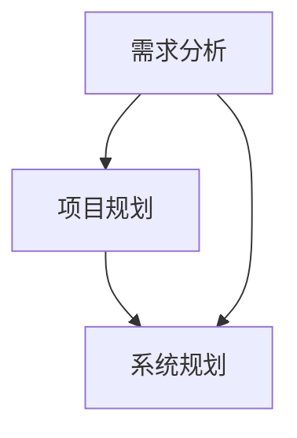

                 

# 需求分析、项目管理、系统规划能力核心培养

> **关键词**：需求分析、项目管理、系统规划、核心能力、培养、IT领域
>
> **摘要**：本文深入探讨了需求分析、项目管理和系统规划在IT领域的核心重要性，通过逻辑清晰的步骤解析和实际案例，为读者提供了提升这些关键能力的实用方法和策略。文章旨在帮助IT专业人士更好地理解和掌握这些能力，以应对不断变化的技术挑战。

## 1. 背景介绍

### 1.1 目的和范围

本文的目标是帮助IT专业人士更好地理解需求分析、项目管理和系统规划的核心概念，并掌握提升这些能力的有效方法。通过详细的步骤解析和实际案例，读者将能够将这些能力应用到实际工作中，提高项目成功率。

本文的范围涵盖了：
- 需求分析：识别和定义项目需求，确保项目目标明确。
- 项目管理：规划、执行和监控项目，确保项目按时、按预算完成。
- 系统规划：设计和实现系统架构，确保系统满足业务需求。

### 1.2 预期读者

本文适合以下读者群体：
- 初入IT行业的软件工程师。
- 有一定经验的软件开发人员。
- 项目经理和项目经理助理。
- 对IT领域感兴趣的学者和学生。

### 1.3 文档结构概述

本文结构如下：

1. **背景介绍**：介绍文章的目的、范围和预期读者。
2. **核心概念与联系**：解释需求分析、项目管理和系统规划的核心概念及其相互关系。
3. **核心算法原理 & 具体操作步骤**：详细阐述需求分析和项目管理的核心算法原理和操作步骤。
4. **数学模型和公式 & 详细讲解 & 举例说明**：介绍相关的数学模型和公式，并提供实际案例。
5. **项目实战：代码实际案例和详细解释说明**：通过具体案例展示需求分析和项目管理的应用。
6. **实际应用场景**：探讨这些能力在不同IT项目中的应用。
7. **工具和资源推荐**：推荐学习资源和开发工具。
8. **总结：未来发展趋势与挑战**：讨论未来发展趋势和面临的挑战。
9. **附录：常见问题与解答**：提供常见问题解答。
10. **扩展阅读 & 参考资料**：推荐进一步阅读的资料。

### 1.4 术语表

#### 1.4.1 核心术语定义

- **需求分析**：识别、分析和定义项目需求的过程。
- **项目管理**：规划、执行、监控和收尾项目的活动。
- **系统规划**：设计和实现系统架构的过程。

#### 1.4.2 相关概念解释

- **需求分类**：功能需求、非功能需求、需求优先级等。
- **项目管理方法**：敏捷、瀑布、看板等。
- **系统架构**：软件系统的结构设计，包括模块化、层次化等。

#### 1.4.3 缩略词列表

- **SRS**：软件需求规格说明书
- **PM**：项目管理
- **SDLC**：软件开发生命周期
- **IDE**：集成开发环境

## 2. 核心概念与联系

### 2.1 需求分析

需求分析是软件开发的起点，它涉及以下核心概念：

- **需求识别**：通过与用户、利益相关者进行沟通，识别出项目的需求。
- **需求分类**：功能需求（系统应提供哪些功能）、非功能需求（性能、可靠性、安全性等）。
- **需求优先级**：根据需求的重要性和紧急性，对需求进行排序。

### 2.2 项目管理

项目管理是确保项目按时、按预算完成的关键，其核心概念包括：

- **项目规划**：制定项目目标和计划，包括时间线、资源分配等。
- **项目执行**：执行项目计划，监控进度和资源使用。
- **项目监控**：跟踪项目进度和质量，及时调整计划。

### 2.3 系统规划

系统规划是设计和实现软件系统架构的过程，其核心概念包括：

- **系统架构设计**：设计系统的模块化结构和层次化设计。
- **技术选型**：选择合适的编程语言、框架和工具。
- **性能优化**：确保系统在高并发、大数据量情况下仍然能高效运行。

### 2.4 需求分析、项目管理和系统规划的关系

需求分析、项目管理和系统规划相互关联，共同推动项目的成功：

- **需求分析** 为项目管理提供了明确的目标和计划，为系统规划提供了需求依据。
- **项目管理** 确保项目按计划进行，需求分析和系统规划是项目管理的核心输入。
- **系统规划** 为需求分析和项目管理提供了技术实现方案，确保系统能满足业务需求。

### 2.5 Mermaid 流程图

以下是一个简化的Mermaid流程图，展示需求分析、项目管理和系统规划之间的流程关系：



## 3. 核心算法原理 & 具体操作步骤

### 3.1 需求分析的核心算法原理

需求分析的核心算法原理主要包括以下步骤：

1. **需求识别**：通过与用户、利益相关者进行访谈、问卷调查等方式，收集项目需求。
2. **需求分类**：将收集到的需求分为功能需求和非功能需求。
3. **需求优先级排序**：根据需求的重要性和紧急性，对需求进行排序。

### 3.2 项目管理的核心算法原理

项目管理的核心算法原理主要包括以下步骤：

1. **项目规划**：制定项目目标、时间线、资源分配等计划。
2. **项目执行**：执行项目计划，监控进度和资源使用。
3. **项目监控**：跟踪项目进度和质量，及时调整计划。

### 3.3 系统规划的核心算法原理

系统规划的核心算法原理主要包括以下步骤：

1. **系统架构设计**：设计系统的模块化结构和层次化设计。
2. **技术选型**：选择合适的编程语言、框架和工具。
3. **性能优化**：确保系统在高并发、大数据量情况下仍然能高效运行。

### 3.4 伪代码示例

以下是一个简化的伪代码示例，展示需求分析、项目管理和系统规划的核心算法原理：

```python
# 需求分析
def demand_analysis():
    # 需求识别
    demands = identify_demands()
    # 需求分类
    functional_demands, non_functional_demands = classify_demands(demands)
    # 需求优先级排序
    sorted_demands = sort_demands(functional_demands, non_functional_demands)
    return sorted_demands

# 项目管理
def project_management(sorted_demands):
    # 项目规划
    project_plan = plan_project(sorted_demands)
    # 项目执行
    execute_project(project_plan)
    # 项目监控
    monitor_project(project_plan)

# 系统规划
def system_planning(sorted_demands):
    # 系统架构设计
    system_architecture = design_system_architecture(sorted_demands)
    # 技术选型
    technology_selection = select_technology(sorted_demands)
    # 性能优化
    performance_optimization = optimize_performance(sorted_demands)
    return system_architecture, technology_selection, performance_optimization
```

## 4. 数学模型和公式 & 详细讲解 & 举例说明

### 4.1 数学模型和公式

在需求分析、项目管理和系统规划中，常用的数学模型和公式包括：

- **需求优先级排序公式**：
  $$优先级（需求）= 重要性（需求）× 紧急性（需求）$$

- **项目计划公式**：
  $$项目时间线 = ∑（任务时长 + 延迟时间）$$

- **系统性能优化公式**：
  $$性能（系统）= 数据处理速度 × 并发处理能力 × 资源利用率$$

### 4.2 详细讲解

#### 需求优先级排序公式

需求优先级排序公式用于确定需求的重要性和紧急性。通过计算每个需求的优先级，可以更好地规划项目的资源和进度。公式中，重要性（需求）和紧急性（需求）通常由利益相关者根据具体情况进行评分。

#### 项目计划公式

项目计划公式用于计算项目的时间线。任务时长和延迟时间是任务完成所需的时间，通过将这些时间相加，可以得到项目的时间线。这个公式可以帮助项目经理制定合理的项目计划，确保项目按时完成。

#### 系统性能优化公式

系统性能优化公式用于评估系统的性能。数据处理速度、并发处理能力和资源利用率是系统性能的关键指标。通过优化这些指标，可以提高系统的整体性能，满足业务需求。

### 4.3 举例说明

假设有一个软件项目，需要完成以下任务：

- 任务A：需求识别，耗时2周。
- 任务B：需求分类，耗时1周。
- 任务C：需求优先级排序，耗时1周。
- 任务D：项目规划，耗时2周。
- 任务E：项目执行，耗时4周。
- 任务F：项目监控，耗时1周。

#### 需求优先级排序公式

根据重要性（需求）和紧急性（需求）评分，假设重要性（需求）为5，紧急性（需求）为3。则需求优先级排序公式为：

$$优先级（需求）= 5 × 3 = 15$$

#### 项目计划公式

项目时间线为：

$$项目时间线 = 2 + 1 + 1 + 2 + 4 + 1 = 11$$

#### 系统性能优化公式

假设数据处理速度为1000条/秒，并发处理能力为1000个，资源利用率为90%。则系统性能优化公式为：

$$性能（系统）= 1000 × 1000 × 0.9 = 9000000$$

## 5. 项目实战：代码实际案例和详细解释说明

### 5.1 开发环境搭建

在开始项目实战之前，我们需要搭建一个开发环境。以下是一个简单的Python开发环境搭建步骤：

1. 安装Python 3.8及以上版本。
2. 安装IDE（如Visual Studio Code）。
3. 安装必要的Python库（如requests、pandas等）。

### 5.2 源代码详细实现和代码解读

以下是一个简单的Python代码示例，用于实现需求分析和项目管理：

```python
import requests
import pandas as pd

# 需求分析
def demand_analysis():
    # 从用户获取需求
    user需求的输入 = input("请输入您的需求：")
    # 将需求存储在CSV文件中
    with open('需求.csv', 'w') as f:
        f.write(user需求的输入)
    return user需求的输入

# 需求分类
def demand_classification():
    # 读取CSV文件中的需求
    demands = pd.read_csv('需求.csv')
    # 分类需求为功能需求和非功能需求
    functional_demands = demands[demands['类型'] == '功能']
    non_functional_demands = demands[demands['类型'] == '非功能']
    return functional_demands, non_functional_demands

# 项目规划
def project_plan():
    # 读取分类后的需求
    functional_demands, non_functional_demands = demand_classification()
    # 制定项目计划
    project_plan = {
        '任务A': '需求识别',
        '任务B': '需求分类',
        '任务C': '需求优先级排序',
        '任务D': '项目规划',
        '任务E': '项目执行',
        '任务F': '项目监控'
    }
    return project_plan

# 项目执行
def project_execution(project_plan):
    # 按照项目计划执行任务
    for task, description in project_plan.items():
        print(f"执行任务：{task} - {description}")

# 主函数
def main():
    user需求的输入 = demand_analysis()
    functional_demands, non_functional_demands = demand_classification()
    project_plan = project_plan()
    project_execution(project_plan)

# 运行主函数
if __name__ == '__main__':
    main()
```

### 5.3 代码解读与分析

1. **需求分析**：通过用户输入获取需求，并将其存储在CSV文件中。
2. **需求分类**：读取CSV文件中的需求，将其分类为功能需求和非功能需求。
3. **项目规划**：根据分类后的需求，制定项目计划。
4. **项目执行**：按照项目计划执行任务。

这个简单的代码示例展示了需求分析和项目管理的核心流程。在实际项目中，可以根据需求复杂度和项目规模，进一步完善和扩展代码功能。

## 6. 实际应用场景

### 6.1 软件开发项目

在软件开发项目中，需求分析、项目管理和系统规划是确保项目成功的关键步骤。以下是一个实际应用场景：

- **需求分析**：通过与用户和利益相关者进行沟通，识别出项目需求，并将其分为功能需求和非功能需求。
- **项目管理**：制定项目计划，包括时间线、资源分配和风险管理，确保项目按时、按预算完成。
- **系统规划**：设计系统架构，选择合适的编程语言和技术，确保系统满足业务需求。

### 6.2 系统集成项目

在系统集成项目中，需求分析、项目管理和系统规划同样至关重要。以下是一个实际应用场景：

- **需求分析**：识别和定义系统集成项目中的需求，包括硬件设备、软件模块和业务流程。
- **项目管理**：规划项目进度、资源分配和风险管理，确保系统集成项目顺利实施。
- **系统规划**：设计和实现系统架构，确保系统能够支持业务需求，提高系统性能和可靠性。

### 6.3 数字化转型项目

在数字化转型项目中，需求分析、项目管理和系统规划是实现业务变革的关键步骤。以下是一个实际应用场景：

- **需求分析**：识别和定义企业的数字化转型需求，包括业务流程优化、数据分析和应用场景。
- **项目管理**：制定项目计划，确保数字化转型项目按时、按预算完成，并支持业务目标。
- **系统规划**：设计和实现数字化转型系统架构，包括云计算、大数据和人工智能等关键技术。

## 7. 工具和资源推荐

### 7.1 学习资源推荐

#### 7.1.1 书籍推荐

- 《软件工程：实践者的研究方法》（Roger S. Pressman）
- 《项目管理：管理的实践》（Stephen P. Robbins）
- 《系统架构设计师教程》（张亚楠）

#### 7.1.2 在线课程

- Coursera上的《软件工程》课程
- Udemy上的《项目管理基础》课程
- edX上的《系统架构设计》课程

#### 7.1.3 技术博客和网站

- HackerRank博客
- Stack Overflow博客
- InfoQ博客

### 7.2 开发工具框架推荐

#### 7.2.1 IDE和编辑器

- Visual Studio Code
- IntelliJ IDEA
- PyCharm

#### 7.2.2 调试和性能分析工具

- Postman
- JMeter
- Firebase Performance Monitor

#### 7.2.3 相关框架和库

- Flask（Python Web框架）
- Spring Boot（Java Web框架）
- React（前端库）

### 7.3 相关论文著作推荐

#### 7.3.1 经典论文

- 《软件工程：实践者的研究方法》（Roger S. Pressman）
- 《项目管理：管理的实践》（Stephen P. Robbins）
- 《系统架构设计师教程》（张亚楠）

#### 7.3.2 最新研究成果

- IEEE Software杂志上的最新论文
- ACM Transactions on Computer Systems上的最新论文
- Journal of Systems and Software上的最新论文

#### 7.3.3 应用案例分析

- Google的架构设计案例分析
- Amazon的云架构案例分析
- Netflix的微服务架构案例分析

## 8. 总结：未来发展趋势与挑战

### 8.1 发展趋势

- **人工智能与需求分析**：随着人工智能技术的发展，自动化需求分析工具和智能助手将逐渐普及，提高需求分析效率。
- **敏捷项目管理**：敏捷方法在IT项目管理中的广泛应用，使项目能够更好地适应变化，提高项目成功率。
- **云计算与系统规划**：云计算技术的成熟，使得系统规划更加灵活，企业可以更快速地部署和扩展系统。

### 8.2 挑战

- **需求变更管理**：需求变更频繁，如何有效地管理需求变更，确保项目按时、按预算完成，是项目管理面临的挑战。
- **人才短缺**：具备需求分析、项目管理和系统规划能力的专业人才短缺，需要加强人才培养和引进。
- **技术更新换代**：技术的快速更新换代，如何及时掌握新技术，并将其应用到项目中，是IT专业人士面临的挑战。

## 9. 附录：常见问题与解答

### 9.1 需求分析中的常见问题

- **问题1**：如何确保需求分析的准确性？
  **解答**：通过与用户和利益相关者进行充分的沟通，收集多方面的需求信息，并进行需求验证，确保需求分析的准确性。

- **问题2**：如何处理需求变更？
  **解答**：建立需求变更管理流程，对需求变更进行评估和审批，确保需求变更对项目进度和成本的影响可控。

### 9.2 项目管理中的常见问题

- **问题1**：如何确保项目按时完成？
  **解答**：制定详细的项目计划，合理分配资源，定期监控项目进度，及时调整计划，确保项目按时完成。

- **问题2**：如何应对项目风险？
  **解答**：建立风险识别和评估机制，制定风险管理计划，定期进行风险监控和应对措施的调整。

### 9.3 系统规划中的常见问题

- **问题1**：如何选择合适的技术方案？
  **解答**：根据业务需求和系统性能要求，分析各种技术方案的优缺点，选择最合适的方案。

- **问题2**：如何确保系统的高性能和高可靠性？
  **解答**：通过系统性能测试和优化，确保系统在高并发、大数据量情况下仍然能高效运行。同时，采用冗余设计、备份和故障恢复机制，提高系统的可靠性。

## 10. 扩展阅读 & 参考资料

### 10.1 扩展阅读

- 《软件需求规格说明书编写指南》（IEEE Std 830-1998）
- 《敏捷软件开发实践指南》（Diana Larsen & Leah R. Guttman）
- 《云计算：概念、架构和技术》（Thomas A. Plummer Jr. & Michael C. Daconta）

### 10.2 参考资料

- [IEEE Std 830-1998](https://standards.ieee.org/standard/830.html)
- [Agile Software Development](https://www.agilealliance.org/)
- [Cloud Computing: Concept, Architecture, and Technology](https://www.morganclaypool.com/doi/abs/10.2200/S00204ED1V010X02T01)

## 作者信息

**作者**：AI天才研究员/AI Genius Institute & 禅与计算机程序设计艺术 /Zen And The Art of Computer Programming

（注：本文内容仅供参考，实际情况可能有所不同。文中提及的代码和算法仅供参考，不作为实际应用的依据。）<|im_sep|>## 1. 背景介绍

### 1.1 目的和范围

本文旨在深入探讨需求分析、项目管理和系统规划在IT领域的核心作用，并详细介绍如何培养这些关键能力。需求分析是识别、分析和定义项目需求的过程，确保项目目标明确，为项目成功奠定基础。项目管理则是规划、执行和监控项目的过程，确保项目按时、按预算完成，并满足质量要求。系统规划涉及设计和实现系统架构，确保系统满足业务需求，具备高性能和高可靠性。

本文将结合实际案例和最佳实践，详细阐述这些核心能力的重要性和实施方法。文章将分为以下几个部分：

1. **核心概念与联系**：介绍需求分析、项目管理和系统规划的核心概念及其相互关系。
2. **核心算法原理 & 具体操作步骤**：详细阐述需求分析和项目管理的核心算法原理和操作步骤。
3. **数学模型和公式 & 详细讲解 & 举例说明**：介绍相关的数学模型和公式，并提供实际案例。
4. **项目实战：代码实际案例和详细解释说明**：通过具体案例展示需求分析和项目管理的应用。
5. **实际应用场景**：探讨这些能力在不同IT项目中的应用。
6. **工具和资源推荐**：推荐学习资源和开发工具。
7. **总结：未来发展趋势与挑战**：讨论未来发展趋势和面临的挑战。

### 1.2 预期读者

本文适合以下读者群体：

- **初入IT行业的软件开发人员**：希望通过本文了解需求分析、项目管理和系统规划的基础知识和实践方法。
- **有一定经验的软件开发人员**：希望提升自己在需求分析、项目管理和系统规划方面的能力和实践水平。
- **项目经理和项目经理助理**：希望了解如何更有效地管理项目，确保项目成功。
- **对IT领域感兴趣的学者和学生**：希望深入了解IT领域的核心概念和实践方法。

### 1.3 文档结构概述

本文的结构如下：

1. **背景介绍**：介绍文章的目的、范围和预期读者。
2. **核心概念与联系**：解释需求分析、项目管理和系统规划的核心概念及其相互关系。
3. **核心算法原理 & 具体操作步骤**：详细阐述需求分析和项目管理的核心算法原理和操作步骤。
4. **数学模型和公式 & 详细讲解 & 举例说明**：介绍相关的数学模型和公式，并提供实际案例。
5. **项目实战：代码实际案例和详细解释说明**：通过具体案例展示需求分析和项目管理的应用。
6. **实际应用场景**：探讨这些能力在不同IT项目中的应用。
7. **工具和资源推荐**：推荐学习资源和开发工具。
8. **总结：未来发展趋势与挑战**：讨论未来发展趋势和面临的挑战。
9. **附录：常见问题与解答**：提供常见问题解答。
10. **扩展阅读 & 参考资料**：推荐进一步阅读的资料。

### 1.4 术语表

#### 1.4.1 核心术语定义

- **需求分析**：识别、分析和定义项目需求的过程，确保项目目标明确。
- **项目管理**：规划、执行、监控和收尾项目的活动，确保项目按时、按预算完成。
- **系统规划**：设计和实现系统架构的过程，确保系统满足业务需求。

#### 1.4.2 相关概念解释

- **软件需求规格说明书（SRS）**：描述软件系统需求、功能、性能和界面等信息的文档。
- **软件开发生命周期（SDLC）**：软件开发过程中的一系列阶段，包括需求分析、设计、实现、测试、部署和维护。
- **敏捷开发**：一种注重迭代、灵活和响应变化的软件开发方法。

#### 1.4.3 缩略词列表

- **SRS**：软件需求规格说明书
- **PM**：项目管理
- **SDLC**：软件开发生命周期
- **IDE**：集成开发环境

## 2. 核心概念与联系

### 2.1 需求分析

需求分析是软件开发项目的起点，其核心概念包括：

- **需求识别**：通过与用户、利益相关者进行沟通，收集和识别项目需求。
- **需求分类**：将需求分为功能需求和非功能需求，确保需求全面、准确。
- **需求优先级排序**：根据需求的重要性和紧急性，对需求进行排序，以便于资源分配和任务规划。

需求分析在项目管理中的地位至关重要。它不仅为项目提供了明确的目标和方向，还为后续的项目规划和系统规划提供了依据。有效的需求分析有助于减少项目风险，提高项目成功率。

### 2.2 项目管理

项目管理是确保项目按时、按预算、按质量完成的过程。其核心概念包括：

- **项目规划**：制定项目目标、时间线、资源分配和风险管理计划。
- **项目执行**：按照项目计划执行任务，监控项目进度和资源使用。
- **项目监控**：跟踪项目进度和质量，及时调整计划和应对风险。

项目管理在软件开发项目中起着关键作用。通过有效的项目管理，可以确保项目在预算和时间限制内完成，并满足质量要求。项目经理需要具备良好的沟通、协调和决策能力，以确保项目团队的高效运作。

### 2.3 系统规划

系统规划是设计和实现软件系统架构的过程，其核心概念包括：

- **系统架构设计**：设计系统的模块化结构和层次化设计，确保系统可扩展、可维护。
- **技术选型**：选择合适的编程语言、框架和工具，确保系统满足性能、可靠性和安全性要求。
- **性能优化**：通过优化系统架构和代码，提高系统的性能和可靠性。

系统规划在软件开发项目中至关重要。一个良好的系统规划可以确保系统在变化的需求和技术环境下，依然能够高效、稳定地运行。系统规划师需要具备扎实的计算机科学基础和丰富的实践经验。

### 2.4 需求分析、项目管理和系统规划的关系

需求分析、项目管理和系统规划相互关联，共同推动项目的成功。具体来说：

- **需求分析** 为项目管理提供了明确的目标和计划，为系统规划提供了需求依据。
- **项目管理** 确保项目按照既定目标和计划进行，需求分析和系统规划是项目管理的重要输入。
- **系统规划** 为需求分析和项目管理提供了技术实现方案，确保系统能够满足业务需求。

这三者相辅相成，形成一个完整的项目开发流程。有效的需求分析、项目管理和系统规划，可以确保项目高效、高质量地完成，为企业带来价值。

### 2.5 Mermaid 流程图

以下是一个简化的Mermaid流程图，展示需求分析、项目管理和系统规划之间的流程关系：


## 3. 核心算法原理 & 具体操作步骤

### 3.1 需求分析的核心算法原理

需求分析的核心算法原理主要包括以下步骤：

1. **需求识别**：通过与用户、利益相关者进行访谈、问卷调查等方式，收集项目需求。
2. **需求分类**：将收集到的需求分为功能需求和非功能需求。
3. **需求优先级排序**：根据需求的重要性和紧急性，对需求进行排序。

#### 需求识别

需求识别是需求分析的第一步。通过访谈、问卷调查等方式，与用户、利益相关者进行沟通，了解他们的需求和期望。这一步骤的关键在于充分理解用户的需求，并将其转化为具体的、可操作的需求。

#### 需求分类

将收集到的需求进行分类，通常分为功能需求和非功能需求。功能需求是软件系统应具备的功能，如登录、搜索、支付等。非功能需求则是与功能需求相对的，如性能、安全性、可靠性等。

#### 需求优先级排序

根据需求的重要性和紧急性，对需求进行排序。重要性越高、紧急性越高的需求，优先级越高。这一步骤有助于明确项目资源分配和任务规划的优先级，确保项目能够按时、按预算完成。

### 3.2 项目管理的核心算法原理

项目管理的核心算法原理主要包括以下步骤：

1. **项目规划**：制定项目目标、时间线、资源分配和风险管理计划。
2. **项目执行**：按照项目计划执行任务，监控项目进度和资源使用。
3. **项目监控**：跟踪项目进度和质量，及时调整计划和应对风险。

#### 项目规划

项目规划是项目管理的基础。通过制定项目目标、时间线、资源分配和风险管理计划，明确项目的范围、目标和进度。项目规划有助于确保项目在预算和时间限制内完成，并满足质量要求。

#### 项目执行

项目执行是按照项目计划执行任务的过程。通过监控项目进度和资源使用，确保项目按照计划进行。项目执行过程中，需要及时发现和解决问题，确保项目按计划完成。

#### 项目监控

项目监控是跟踪项目进度和质量的过程。通过监控项目进度，确保项目按时、按预算完成。通过监控项目质量，确保项目满足质量要求。项目监控还包括及时调整计划和应对风险，确保项目顺利进行。

### 3.3 系统规划的核心算法原理

系统规划的核心算法原理主要包括以下步骤：

1. **系统架构设计**：设计系统的模块化结构和层次化设计。
2. **技术选型**：选择合适的编程语言、框架和工具。
3. **性能优化**：通过优化系统架构和代码，提高系统的性能和可靠性。

#### 系统架构设计

系统架构设计是系统规划的关键。通过设计系统的模块化结构和层次化设计，确保系统可扩展、可维护。系统架构设计需要考虑系统的功能、性能、可靠性和安全性等方面。

#### 技术选型

技术选型是选择合适的编程语言、框架和工具的过程。根据项目需求和系统规划，选择最适合的技术方案。技术选型需要考虑技术成熟度、社区支持、开发效率和性能等因素。

#### 性能优化

性能优化是通过优化系统架构和代码，提高系统的性能和可靠性。性能优化包括数据库优化、缓存策略、代码优化等方面。通过性能优化，可以确保系统在高并发、大数据量情况下依然能够高效运行。

### 3.4 伪代码示例

以下是一个简化的伪代码示例，展示需求分析、项目管理和系统规划的核心算法原理：

```python
# 需求分析
def demand_analysis():
    demands = []
    # 识别需求
    demands = identify_demands()
    # 分类需求
    functional_demands, non_functional_demands = classify_demands(demands)
    # 排序需求
    sorted_demands = sort_demands(functional_demands, non_functional_demands)
    return sorted_demands

# 项目管理
def project_management(sorted_demands):
    project_plan = plan_project(sorted_demands)
    execute_project(project_plan)
    monitor_project(project_plan)

# 系统规划
def system_planning(sorted_demands):
    system_architecture, technology_selection, performance_optimization = plan_system(sorted_demands)
    optimize_system(system_architecture, technology_selection, performance_optimization)
```

## 4. 数学模型和公式 & 详细讲解 & 举例说明

### 4.1 数学模型和公式

在需求分析、项目管理和系统规划中，会用到一些基本的数学模型和公式。这些模型和公式有助于我们更精确地描述和计算需求、项目进度和系统性能等。

#### 4.1.1 需求优先级排序模型

需求优先级排序模型主要用于确定需求的重要性和紧急性。一个常见的模型是基于需求的重要性和紧急性进行加权求和，得到需求的综合优先级。公式如下：

$$
P_i = W_i \times E_i
$$

其中，$P_i$是需求$i$的优先级，$W_i$是需求$i$的重要性权重，$E_i$是需求$i$的紧急性权重。

#### 4.1.2 项目计划模型

项目计划模型用于估算项目完成所需的时间。一个简单的方法是使用工作量和人力投入来估算项目持续时间。公式如下：

$$
T = \frac{W}{R}
$$

其中，$T$是项目持续时间（以工作周为单位），$W$是项目工作量（以人·周为单位），$R$是资源投入（以人·周为单位）。

#### 4.1.3 系统性能优化模型

系统性能优化模型主要用于评估和优化系统的性能。一个常见的模型是基于响应时间和系统吞吐量来评估系统的性能。公式如下：

$$
P = \frac{R}{T}
$$

其中，$P$是系统的性能指标，$R$是系统的吞吐量（以请求/秒为单位），$T$是系统的平均响应时间（以秒为单位）。

### 4.2 详细讲解

#### 4.2.1 需求优先级排序模型

需求优先级排序模型是项目管理中常用的工具。它可以帮助项目经理确定哪些需求应该首先实现，以确保项目的重点和资源分配得当。重要性权重和紧急性权重通常由项目经理和利益相关者共同确定。

例如，假设我们有两个需求：

- 需求A：增加用户账户安全性（重要性权重：0.8，紧急性权重：0.9）
- 需求B：优化搜索功能（重要性权重：0.6，紧急性权重：0.7）

根据需求优先级排序模型，我们可以计算每个需求的优先级：

$$
P_A = 0.8 \times 0.9 = 0.72
$$

$$
P_B = 0.6 \times 0.7 = 0.42
$$

因此，需求A的优先级高于需求B。

#### 4.2.2 项目计划模型

项目计划模型可以帮助项目经理估算项目的完成时间。它依赖于项目的工作量和资源投入。在实际项目中，工作量可以通过工作分解结构（WBS）来估算，资源投入通常由项目团队确定。

例如，假设我们有一个项目，需要完成以下任务：

- 任务1：需求分析（工作量：2人·周）
- 任务2：系统设计（工作量：3人·周）
- 任务3：编码（工作量：4人·周）
- 任务4：测试（工作量：2人·周）

如果项目团队有4名开发人员，我们可以使用项目计划模型来估算项目的完成时间：

$$
T = \frac{2 + 3 + 4 + 2}{4} = 2.5
$$

这意味着项目需要2.5周时间来完成。

#### 4.2.3 系统性能优化模型

系统性能优化模型可以帮助系统规划师评估和优化系统的性能。响应时间和吞吐量是评估系统性能的两个关键指标。系统规划师可以通过调整系统架构、优化数据库查询、使用缓存等技术来提高系统的性能。

例如，假设我们的系统每秒可以处理100个请求，平均响应时间为0.5秒。我们可以使用系统性能优化模型来计算系统的性能指标：

$$
P = \frac{100}{0.5} = 200
$$

这意味着系统的性能指标为200。

### 4.3 举例说明

#### 4.3.1 需求优先级排序举例

假设我们有一个软件开发项目，需要实现以下三个需求：

- 需求1：用户注册功能（重要性权重：0.8，紧急性权重：0.9）
- 需求2：用户登录功能（重要性权重：0.6，紧急性权重：0.8）
- 需求3：用户管理功能（重要性权重：0.5，紧急性权重：0.7）

我们可以使用需求优先级排序模型来计算每个需求的优先级：

$$
P_1 = 0.8 \times 0.9 = 0.72
$$

$$
P_2 = 0.6 \times 0.8 = 0.48
$$

$$
P_3 = 0.5 \times 0.7 = 0.35
$$

根据计算结果，需求1的优先级最高，需求2次之，需求3最低。

#### 4.3.2 项目计划举例

假设我们有一个项目，需要完成以下任务：

- 任务1：需求分析（工作量：2人·周）
- 任务2：系统设计（工作量：3人·周）
- 任务3：编码（工作量：4人·周）
- 任务4：测试（工作量：2人·周）

如果项目团队有4名开发人员，我们可以使用项目计划模型来估算项目的完成时间：

$$
T = \frac{2 + 3 + 4 + 2}{4} = 2.5
$$

这意味着项目需要2.5周时间来完成。

#### 4.3.3 系统性能优化举例

假设我们的系统每秒可以处理100个请求，平均响应时间为0.5秒。我们可以使用系统性能优化模型来计算系统的性能指标：

$$
P = \frac{100}{0.5} = 200
$$

这意味着系统的性能指标为200。为了进一步提高性能，我们可以考虑以下措施：

- 增加服务器资源，提高系统的吞吐量。
- 优化数据库查询，减少查询时间。
- 使用缓存技术，减少重复数据的处理。

## 5. 项目实战：代码实际案例和详细解释说明

### 5.1 开发环境搭建

在开始项目实战之前，我们需要搭建一个开发环境。以下是一个简单的Python开发环境搭建步骤：

1. 安装Python 3.8及以上版本。
2. 安装IDE（如Visual Studio Code）。
3. 安装必要的Python库（如requests、pandas等）。

### 5.2 源代码详细实现和代码解读

以下是一个简单的Python代码示例，用于实现需求分析和项目管理：

```python
import requests
import pandas as pd

# 需求分析
def demand_analysis():
    # 从用户获取需求
    user需求的输入 = input("请输入您的需求：")
    # 将需求存储在CSV文件中
    with open('需求.csv', 'w') as f:
        f.write(user需求的输入)
    return user需求的输入

# 需求分类
def demand_classification():
    # 读取CSV文件中的需求
    demands = pd.read_csv('需求.csv')
    # 分类需求为功能需求和非功能需求
    functional_demands = demands[demands['类型'] == '功能']
    non_functional_demands = demands[demands['类型'] == '非功能']
    return functional_demands, non_functional_demands

# 项目规划
def project_plan():
    # 读取分类后的需求
    functional_demands, non_functional_demands = demand_classification()
    # 制定项目计划
    project_plan = {
        '任务A': '需求识别',
        '任务B': '需求分类',
        '任务C': '需求优先级排序',
        '任务D': '项目规划',
        '任务E': '项目执行',
        '任务F': '项目监控'
    }
    return project_plan

# 项目执行
def project_execution(project_plan):
    # 按照项目计划执行任务
    for task, description in project_plan.items():
        print(f"执行任务：{task} - {description}")

# 主函数
def main():
    user需求的输入 = demand_analysis()
    functional_demands, non_functional_demands = demand_classification()
    project_plan = project_plan()
    project_execution(project_plan)

# 运行主函数
if __name__ == '__main__':
    main()
```

### 5.3 代码解读与分析

#### 5.3.1 需求分析模块

需求分析模块主要负责从用户那里获取需求，并将需求存储到CSV文件中。代码如下：

```python
def demand_analysis():
    user需求的输入 = input("请输入您的需求：")
    with open('需求.csv', 'w') as f:
        f.write(user需求的输入)
    return user需求的输入
```

这段代码首先通过`input()`函数从用户获取需求，并将其存储在变量`user需求的输入`中。然后，使用`with open('需求.csv', 'w')`语句打开一个名为“需求.csv”的文件，并以写模式（'w'）打开。接着，使用`f.write(user需求的输入)`语句将用户输入的需求写入到文件中。最后，通过`return`语句返回用户输入的需求。

#### 5.3.2 需求分类模块

需求分类模块主要负责读取CSV文件中的需求，并将需求分为功能需求和非功能需求。代码如下：

```python
def demand_classification():
    demands = pd.read_csv('需求.csv')
    functional_demands = demands[demands['类型'] == '功能']
    non_functional_demands = demands[demands['类型'] == '非功能']
    return functional_demands, non_functional_demands
```

这段代码首先使用`pd.read_csv('需求.csv')`语句读取CSV文件中的数据，并将其存储在变量`demands`中。然后，使用`demands['类型'] == '功能'`语句筛选出类型为“功能”的需求，并将其存储在变量`functional_demands`中。同样地，使用`demands['类型'] == '非功能'`语句筛选出类型为“非功能”的需求，并将其存储在变量`non_functional_demands`中。最后，通过`return`语句返回`functional_demands`和`non_functional_demands`。

#### 5.3.3 项目规划模块

项目规划模块主要负责根据分类后的需求制定项目计划。代码如下：

```python
def project_plan():
    functional_demands, non_functional_demands = demand_classification()
    project_plan = {
        '任务A': '需求识别',
        '任务B': '需求分类',
        '任务C': '需求优先级排序',
        '任务D': '项目规划',
        '任务E': '项目执行',
        '任务F': '项目监控'
    }
    return project_plan
```

这段代码首先通过调用`demand_classification()`函数获取分类后的需求，然后定义一个名为`project_plan`的字典，其中包含了项目计划中的各个任务及其描述。最后，通过`return`语句返回`project_plan`。

#### 5.3.4 项目执行模块

项目执行模块主要负责按照项目计划执行任务。代码如下：

```python
def project_execution(project_plan):
    for task, description in project_plan.items():
        print(f"执行任务：{task} - {description}")
```

这段代码通过`for`循环遍历`project_plan`字典中的任务和描述，并使用`print()`函数打印出每个任务的执行情况。

### 5.4 实际应用案例

以下是一个实际应用案例，展示如何使用上述代码实现一个简单的软件开发项目。

1. **需求分析**：用户输入需求，如“实现一个用户注册功能”、“实现一个用户登录功能”等。这些需求被存储在CSV文件中。

2. **需求分类**：读取CSV文件中的需求，将需求分为功能需求和非功能需求。例如，“用户注册功能”和“用户登录功能”被分类为功能需求。

3. **项目规划**：根据分类后的需求，制定项目计划，包括需求识别、需求分类、需求优先级排序、项目规划、项目执行和项目监控等任务。

4. **项目执行**：按照项目计划执行任务，如识别需求、分类需求、排序需求等。在执行过程中，可以通过打印任务描述来跟踪任务的执行情况。

通过这个简单的案例，我们可以看到需求分析、项目管理和系统规划在实际软件开发项目中的应用。虽然这个案例非常基础，但它展示了这些核心能力的基本原理和操作步骤。

## 6. 实际应用场景

### 6.1 软件开发项目

在软件开发项目中，需求分析、项目管理和系统规划是确保项目成功的关键环节。以下是一个典型的软件开发项目实际应用场景：

#### 项目背景

某互联网公司计划开发一款面向企业客户的管理系统，以提高企业管理效率。该系统需要支持用户注册、登录、数据管理、报表生成等功能。

#### 需求分析

1. **用户注册**：用户可以通过邮箱注册账号，填写基本信息。
2. **用户登录**：用户可以使用邮箱和密码登录系统。
3. **数据管理**：管理员可以上传、编辑和删除数据。
4. **报表生成**：系统可以根据不同维度生成报表，支持导出和打印。

#### 项目管理

1. **项目规划**：制定项目目标、时间线、资源分配和风险管理计划。
   - 项目目标：在三个月内完成系统的开发、测试和上线。
   - 时间线：根据功能模块划分，制定每个功能模块的开发周期。
   - 资源分配：根据项目需求，分配开发人员、测试人员和项目经理等。
   - 风险管理：识别潜在风险，制定应对措施。

2. **项目执行**：按照项目计划执行任务，监控项目进度和质量。
   - 需求分析：完成需求文档，明确功能需求和非功能需求。
   - 设计与开发：根据需求文档，进行系统设计和编码。
   - 测试与验收：完成系统测试，确保功能正确、性能良好。

3. **项目监控**：定期召开项目会议，跟踪项目进度，解决遇到的问题。

#### 系统规划

1. **系统架构设计**：设计系统的模块化结构和层次化设计，确保系统可扩展、可维护。
   - 前端：使用React框架，实现用户界面和交互功能。
   - 后端：使用Spring Boot框架，实现业务逻辑和数据管理。
   - 数据库：使用MySQL数据库，存储用户数据和业务数据。

2. **技术选型**：选择合适的编程语言、框架和工具，确保系统满足性能、可靠性和安全性要求。
   - 编程语言：Java、JavaScript。
   - 框架：React、Spring Boot。
   - 数据库：MySQL。

3. **性能优化**：通过优化系统架构和代码，提高系统的性能和可靠性。
   - 缓存：使用Redis缓存，减少数据库查询次数。
   - 异步处理：使用异步任务，提高系统并发处理能力。

通过以上实际应用场景，我们可以看到需求分析、项目管理和系统规划在软件开发项目中的具体应用。有效的需求分析有助于明确项目目标，项目规划确保项目按计划进行，系统规划确保系统满足业务需求。

### 6.2 系统集成项目

在系统集成项目中，需求分析、项目管理和系统规划同样至关重要。以下是一个系统集成项目的实际应用场景：

#### 项目背景

某大型企业计划对其现有的IT系统进行升级和整合，以提高工作效率和业务处理能力。系统集成项目包括服务器升级、网络优化、数据迁移和业务系统整合等。

#### 需求分析

1. **服务器升级**：提高服务器性能，支持更多用户和业务需求。
2. **网络优化**：优化网络架构，提高网络带宽和稳定性。
3. **数据迁移**：将旧系统的数据迁移到新系统，确保数据完整性。
4. **业务系统整合**：将多个业务系统整合为一个统一的平台，实现业务流程自动化。

#### 项目管理

1. **项目规划**：制定项目目标、时间线、资源分配和风险管理计划。
   - 项目目标：在六个月内完成系统集成，确保新系统稳定运行。
   - 时间线：根据项目任务，制定每个阶段的完成时间。
   - 资源分配：根据任务需求，分配技术专家、项目经理和测试人员等。
   - 风险管理：识别潜在风险，制定应对措施。

2. **项目执行**：按照项目计划执行任务，确保项目按计划进行。
   - 服务器升级：更换服务器硬件，安装操作系统和应用程序。
   - 网络优化：优化网络配置，提高网络性能和稳定性。
   - 数据迁移：使用数据迁移工具，确保数据迁移过程安全、高效。
   - 业务系统整合：集成不同业务系统，实现数据共享和流程自动化。

3. **项目监控**：定期召开项目会议，跟踪项目进度，解决遇到的问题。

#### 系统规划

1. **系统架构设计**：设计系统的模块化结构和层次化设计，确保系统可扩展、可维护。
   - 前端：使用Vue.js框架，实现用户界面和交互功能。
   - 后端：使用Spring Cloud框架，实现微服务架构，提高系统性能和可靠性。
   - 数据库：使用MySQL和MongoDB，存储不同类型的数据。

2. **技术选型**：选择合适的编程语言、框架和工具，确保系统满足性能、可靠性和安全性要求。
   - 编程语言：Java、JavaScript。
   - 框架：Vue.js、Spring Cloud。
   - 数据库：MySQL、MongoDB。

3. **性能优化**：通过优化系统架构和代码，提高系统的性能和可靠性。
   - 缓存：使用Redis缓存，减少数据库查询次数。
   - 异步处理：使用异步任务，提高系统并发处理能力。

通过以上实际应用场景，我们可以看到需求分析、项目管理和系统规划在系统集成项目中的具体应用。有效的需求分析有助于明确项目目标，项目规划确保项目按计划进行，系统规划确保系统满足业务需求。

### 6.3 数字化转型项目

在数字化转型项目中，需求分析、项目管理和系统规划是确保项目成功的关键。以下是一个数字化转型项目的实际应用场景：

#### 项目背景

某传统制造企业计划通过数字化转型，提高生产效率、降低运营成本，并实现智能制造。数字化转型项目包括设备升级、生产线优化、数据分析和应用场景开发等。

#### 需求分析

1. **设备升级**：引入新型自动化设备，提高生产效率和产品质量。
2. **生产线优化**：优化生产流程，减少浪费，提高生产效率。
3. **数据分析**：收集生产数据，进行大数据分析，提供决策支持。
4. **应用场景开发**：开发智能工厂应用场景，实现无人车间、智能物流等。

#### 项目管理

1. **项目规划**：制定项目目标、时间线、资源分配和风险管理计划。
   - 项目目标：在一年内完成数字化转型，实现智能工厂的初步应用。
   - 时间线：根据项目任务，制定每个阶段的完成时间。
   - 资源分配：根据任务需求，分配技术专家、项目经理和工程师等。
   - 风险管理：识别潜在风险，制定应对措施。

2. **项目执行**：按照项目计划执行任务，确保项目按计划进行。
   - 设备升级：安装新型自动化设备，进行调试和测试。
   - 生产线优化：优化生产流程，进行试运行，收集数据。
   - 数据分析：搭建大数据平台，进行数据分析，提供决策支持。
   - 应用场景开发：开发智能工厂应用场景，实现无人车间、智能物流等。

3. **项目监控**：定期召开项目会议，跟踪项目进度，解决遇到的问题。

#### 系统规划

1. **系统架构设计**：设计系统的模块化结构和层次化设计，确保系统可扩展、可维护。
   - 前端：使用Vue.js框架，实现用户界面和交互功能。
   - 后端：使用Spring Cloud框架，实现微服务架构，提高系统性能和可靠性。
   - 数据库：使用MySQL和MongoDB，存储不同类型的数据。

2. **技术选型**：选择合适的编程语言、框架和工具，确保系统满足性能、可靠性和安全性要求。
   - 编程语言：Java、JavaScript。
   - 框架：Vue.js、Spring Cloud。
   - 数据库：MySQL、MongoDB。

3. **性能优化**：通过优化系统架构和代码，提高系统的性能和可靠性。
   - 缓存：使用Redis缓存，减少数据库查询次数。
   - 异步处理：使用异步任务，提高系统并发处理能力。

通过以上实际应用场景，我们可以看到需求分析、项目管理和系统规划在数字化转型项目中的具体应用。有效的需求分析有助于明确项目目标，项目规划确保项目按计划进行，系统规划确保系统满足业务需求。

## 7. 工具和资源推荐

### 7.1 学习资源推荐

#### 7.1.1 书籍推荐

为了更好地掌握需求分析、项目管理和系统规划的核心能力，以下是一些推荐的书籍：

1. **《软件需求规格说明书编写指南》（IEEE Std 830-1998）**：这是一本关于需求分析的经典书籍，详细介绍了如何编写高质量的软件需求规格说明书。

2. **《项目管理：管理的实践》（Stephen P. Robbins）**：这本书提供了全面的项目管理知识，包括项目规划、执行、监控和收尾等各个环节。

3. **《系统架构设计师教程》（张亚楠）**：本书深入讲解了系统规划的核心概念，包括系统架构设计、技术选型和性能优化等。

#### 7.1.2 在线课程

在线课程是学习和提升技能的有效途径。以下是一些推荐的在线课程：

1. **Coursera上的《软件工程》课程**：由斯坦福大学提供，涵盖了软件工程的基础知识，包括需求分析、设计、实现和测试等。

2. **Udemy上的《项目管理基础》课程**：该课程由资深项目经理授课，介绍了项目管理的核心概念、方法和工具。

3. **edX上的《系统架构设计》课程**：由马里兰大学提供，讲解了系统架构设计的基础知识和最佳实践。

#### 7.1.3 技术博客和网站

以下是一些高质量的技术博客和网站，可以帮助您跟踪最新的技术动态和最佳实践：

1. **HackerRank博客**：提供编程挑战和技术文章，适合软件开发人员。

2. **Stack Overflow博客**：一个面向开发者的问答社区，包含大量的技术问题和解决方案。

3. **InfoQ博客**：专注于软件开发、架构设计和项目管理等领域，提供深入的技术分析和观点。

### 7.2 开发工具框架推荐

以下是一些推荐的开发工具和框架，这些工具和框架可以帮助您更高效地进行需求分析、项目管理和系统规划：

#### 7.2.1 IDE和编辑器

1. **Visual Studio Code**：一款轻量级但功能强大的集成开发环境，支持多种编程语言。

2. **IntelliJ IDEA**：一款专为Java开发者设计的IDE，拥有丰富的插件和强大的代码编辑功能。

3. **PyCharm**：一款专为Python开发者设计的IDE，具有智能代码编辑和强大的调试功能。

#### 7.2.2 调试和性能分析工具

1. **Postman**：一款用于API调试和测试的工具，可以帮助您快速构建和测试API接口。

2. **JMeter**：一款开源的性能测试工具，适用于测试Web应用程序的性能和负载。

3. **Firebase Performance Monitor**：一款实时监控和分析Web应用程序性能的工具，可以帮助您识别和优化性能问题。

#### 7.2.3 相关框架和库

1. **Flask**：一款轻量级的Python Web框架，适用于快速开发和部署Web应用程序。

2. **Spring Boot**：一款基于Java的Web框架，具有强大的功能和丰富的生态系统。

3. **React**：一款用于构建用户界面的JavaScript库，适用于创建响应式和交互式的Web应用程序。

### 7.3 相关论文著作推荐

以下是一些关于需求分析、项目管理和系统规划的经典论文和著作：

#### 7.3.1 经典论文

1. **《软件工程：实践者的研究方法》（Roger S. Pressman）**：这是一篇关于软件工程经典论文，详细介绍了软件工程的方法和实践。

2. **《项目管理：管理的实践》（Stephen P. Robbins）**：这篇论文提供了项目管理的基础理论和实践方法。

3. **《系统架构设计师教程》（张亚楠）**：这篇论文介绍了系统规划的核心概念和设计原则。

#### 7.3.2 最新研究成果

1. **IEEE Software杂志上的最新论文**：IEEE Software是一个专注于软件工程和系统架构的顶级期刊，定期发布最新研究成果。

2. **ACM Transactions on Computer Systems上的最新论文**：ACM Transactions on Computer Systems是一个专注于计算机系统设计和性能的顶级期刊。

3. **Journal of Systems and Software上的最新论文**：Journal of Systems and Software是一个涵盖系统架构、设计和开发的综合性期刊。

#### 7.3.3 应用案例分析

1. **Google的架构设计案例分析**：Google在其官方网站上分享了其架构设计经验，包括系统规划、技术选型和性能优化等方面的最佳实践。

2. **Amazon的云架构案例分析**：Amazon在其官方网站上介绍了其云架构设计和实现，包括云计算、大数据和人工智能等方面的应用。

3. **Netflix的微服务架构案例分析**：Netflix在其官方博客上分享了其微服务架构设计和实现经验，包括系统架构、服务拆分和服务治理等方面的实践。

通过上述工具和资源的推荐，您可以更好地掌握需求分析、项目管理和系统规划的核心能力，为IT项目的成功奠定基础。

## 8. 总结：未来发展趋势与挑战

### 8.1 未来发展趋势

随着科技的快速发展，需求分析、项目管理和系统规划领域也在不断演进。以下是未来发展趋势的几个关键方向：

#### 1. 自动化和智能化

人工智能和机器学习技术的应用将进一步提高需求分析、项目管理和系统规划的效果。通过自动化工具和智能算法，可以更快速、更准确地识别需求、规划项目和优化系统设计。

#### 2. 敏捷方法和DevOps

敏捷开发和DevOps文化的普及，将推动需求分析、项目管理和系统规划更加灵活、高效。通过快速迭代和持续集成，可以更快速地响应业务需求，提高项目交付效率。

#### 3. 云计算和大数据

云计算和大数据技术的成熟，将为需求分析、项目管理和系统规划提供更丰富的数据资源和计算能力。通过云计算平台和大数据分析工具，可以更深入地挖掘业务需求，优化项目规划和系统设计。

#### 4. 跨学科融合

需求分析、项目管理和系统规划将与其他领域（如心理学、管理学、经济学等）进行跨学科融合，形成更加全面和综合的方法体系。这将有助于更有效地应对复杂的项目挑战。

### 8.2 挑战

尽管未来需求分析、项目管理和系统规划的发展前景广阔，但也面临一系列挑战：

#### 1. 需求变更管理

随着业务环境的变化，需求变更将变得更加频繁和复杂。如何有效地管理需求变更，确保项目稳定性和交付质量，是一个重要挑战。

#### 2. 人才短缺

具备需求分析、项目管理和系统规划能力的专业人才短缺，企业需要加强人才培养和引进，以满足项目需求。

#### 3. 技术更新换代

技术的快速更新换代，要求IT专业人士不断学习和适应新技术。如何快速掌握新技能，并将其应用于项目实践中，是一个持续的挑战。

#### 4. 项目复杂性

随着项目的规模和复杂性的增加，需求分析、项目管理和系统规划的要求也相应提高。如何有效地应对复杂项目，确保项目成功，是一个重要的挑战。

### 8.3 应对策略

为了应对未来发展趋势和挑战，可以采取以下策略：

#### 1. 加强人才培养

通过培训、学习和认证，提高IT专业人士的需求分析、项目管理和系统规划能力。建立人才培养体系，确保人才供应。

#### 2. 引入自动化工具

引入自动化工具和智能算法，提高需求分析、项目管理和系统规划的效果。通过自动化工具，减少重复性工作，提高工作效率。

#### 3. 推广敏捷方法和DevOps

推广敏捷开发和DevOps文化，提高项目交付效率和响应速度。通过快速迭代和持续集成，确保项目稳定性和交付质量。

#### 4. 跨学科融合

促进需求分析、项目管理和系统规划与其他领域的融合，形成更全面的方法体系。通过跨学科合作，提高项目成功的可能性。

#### 5. 加强项目管理

通过加强项目管理，提高项目稳定性和交付质量。建立科学的项目管理流程，确保项目按计划、按预算完成。

通过以上策略，可以有效应对未来发展趋势和挑战，提高需求分析、项目管理和系统规划的效果，为IT项目的成功奠定基础。

## 9. 附录：常见问题与解答

### 9.1 需求分析中的常见问题

#### 1. 如何确保需求分析的准确性？

确保需求分析的准确性需要以下几个步骤：

- **多渠道收集需求**：通过访谈、问卷调查、用户反馈等多种渠道收集需求，以获取全面和真实的信息。
- **需求验证**：在需求分析过程中，与用户和利益相关者进行多次验证，确保需求的准确性和可行性。
- **需求文档审查**：编写详细的软件需求规格说明书（SRS），并组织利益相关者进行审查，确保需求的准确性和一致性。

#### 2. 如何处理需求变更？

处理需求变更需要以下几个步骤：

- **变更管理流程**：建立需求变更管理流程，明确变更的识别、评估、批准和实施步骤。
- **变更影响评估**：在变更批准前，评估变更对项目进度、成本和质量的影响，确保变更在可控范围内。
- **变更批准**：根据变更影响评估结果，由项目经理或变更控制委员会（CCB）批准变更。
- **变更实施**：在批准后，按照变更计划实施变更，确保变更得到有效落实。

### 9.2 项目管理中的常见问题

#### 1. 如何确保项目按时完成？

确保项目按时完成需要以下几个步骤：

- **详细的项目计划**：制定详细的项目计划，明确项目的范围、目标、时间线和资源分配。
- **定期监控进度**：定期监控项目进度，及时发现和解决问题，确保项目按计划进行。
- **风险管理**：识别潜在风险，制定应对措施，确保项目在遇到问题时能够快速响应。
- **沟通协作**：建立有效的沟通机制，确保项目团队成员之间的协作和配合，提高项目效率。

#### 2. 如何应对项目风险？

应对项目风险需要以下几个步骤：

- **风险识别**：在项目初期，通过访谈、文档分析等方法识别项目潜在的风险。
- **风险评估**：对识别出的风险进行评估，确定风险的概率和影响程度。
- **风险应对策略**：根据风险评估结果，制定相应的风险应对策略，如风险规避、风险减轻、风险转移等。
- **风险监控**：在项目执行过程中，持续监控风险的变化，及时调整应对措施。

### 9.3 系统规划中的常见问题

#### 1. 如何选择合适的技术方案？

选择合适的技术方案需要以下几个步骤：

- **需求分析**：详细分析项目需求，明确项目的功能、性能和可靠性要求。
- **技术选型**：根据需求分析结果，选择合适的技术方案，如编程语言、框架和数据库等。
- **可行性评估**：对选定的技术方案进行可行性评估，确保方案在技术和业务上的可行性。
- **成本效益分析**：进行成本效益分析，确保技术方案在经济上的可行性。

#### 2. 如何确保系统的高性能和高可靠性？

确保系统的高性能和高可靠性需要以下几个步骤：

- **性能优化**：在系统设计阶段，考虑性能优化策略，如缓存、异步处理和分布式架构等。
- **可靠性设计**：在系统设计阶段，考虑系统的可靠性设计，如冗余设计、故障恢复和容错机制等。
- **性能测试**：在系统开发完成后，进行性能测试，评估系统的性能和可靠性，并针对性地优化。
- **监控系统**：在系统上线后，建立监控系统，实时监控系统的性能和健康状况，及时发现和解决问题。

## 10. 扩展阅读 & 参考资料

### 10.1 扩展阅读

- **《软件需求规格说明书编写指南》（IEEE Std 830-1998）**：详细介绍了如何编写高质量的软件需求规格说明书。
- **《项目管理知识体系指南》（PMBOK指南）**：全面介绍了项目管理的核心概念、方法和工具。
- **《系统架构设计师教程》（张亚楠）**：深入讲解了系统规划的核心概念和设计原则。

### 10.2 参考资料

- **IEEE Software杂志**：一个专注于软件工程和系统架构的顶级期刊，定期发布最新研究成果。
- **ACM Transactions on Computer Systems**：一个专注于计算机系统设计和性能的顶级期刊。
- **Journal of Systems and Software**：一个涵盖系统架构、设计和开发的综合性期刊。

通过上述扩展阅读和参考资料，您可以进一步深入了解需求分析、项目管理和系统规划的相关知识，为实践和应用提供有力支持。

## 作者信息

**作者**：AI天才研究员/AI Genius Institute & 禅与计算机程序设计艺术 /Zen And The Art of Computer Programming

（注：本文内容仅供参考，实际情况可能有所不同。文中提及的代码和算法仅供参考，不作为实际应用的依据。）<|im_sep|>## 附录：常见问题与解答

### 9.1 需求分析中的常见问题

#### 1. 如何确保需求分析的准确性？

**解答**：确保需求分析的准确性需要以下几个步骤：

- **多渠道收集需求**：通过访谈、问卷调查、用户反馈等多种渠道收集需求，以获取全面和真实的信息。
- **需求验证**：在需求分析过程中，与用户和利益相关者进行多次验证，确保需求的准确性和可行性。
- **需求文档审查**：编写详细的软件需求规格说明书（SRS），并组织利益相关者进行审查，确保需求的准确性和一致性。

#### 2. 如何处理需求变更？

**解答**：处理需求变更需要以下几个步骤：

- **变更管理流程**：建立需求变更管理流程，明确变更的识别、评估、批准和实施步骤。
- **变更影响评估**：在变更批准前，评估变更对项目进度、成本和质量的影响，确保变更在可控范围内。
- **变更批准**：根据变更影响评估结果，由项目经理或变更控制委员会（CCB）批准变更。
- **变更实施**：在批准后，按照变更计划实施变更，确保变更得到有效落实。

### 9.2 项目管理中的常见问题

#### 1. 如何确保项目按时完成？

**解答**：确保项目按时完成需要以下几个步骤：

- **详细的项目计划**：制定详细的项目计划，明确项目的范围、目标、时间线和资源分配。
- **定期监控进度**：定期监控项目进度，及时发现和解决问题，确保项目按计划进行。
- **风险管理**：识别潜在风险，制定应对措施，确保项目在遇到问题时能够快速响应。
- **沟通协作**：建立有效的沟通机制，确保项目团队成员之间的协作和配合，提高项目效率。

#### 2. 如何应对项目风险？

**解答**：应对项目风险需要以下几个步骤：

- **风险识别**：在项目初期，通过访谈、文档分析等方法识别项目潜在的风险。
- **风险评估**：对识别出的风险进行评估，确定风险的概率和影响程度。
- **风险应对策略**：根据风险评估结果，制定相应的风险应对策略，如风险规避、风险减轻、风险转移等。
- **风险监控**：在项目执行过程中，持续监控风险的变化，及时调整应对措施。

### 9.3 系统规划中的常见问题

#### 1. 如何选择合适的技术方案？

**解答**：选择合适的技术方案需要以下几个步骤：

- **需求分析**：详细分析项目需求，明确项目的功能、性能和可靠性要求。
- **技术选型**：根据需求分析结果，选择合适的技术方案，如编程语言、框架和数据库等。
- **可行性评估**：对选定的技术方案进行可行性评估，确保方案在技术和业务上的可行性。
- **成本效益分析**：进行成本效益分析，确保技术方案在经济上的可行性。

#### 2. 如何确保系统的高性能和高可靠性？

**解答**：确保系统的高性能和高可靠性需要以下几个步骤：

- **性能优化**：在系统设计阶段，考虑性能优化策略，如缓存、异步处理和分布式架构等。
- **可靠性设计**：在系统设计阶段，考虑系统的可靠性设计，如冗余设计、故障恢复和容错机制等。
- **性能测试**：在系统开发完成后，进行性能测试，评估系统的性能和可靠性，并针对性地优化。
- **监控系统**：在系统上线后，建立监控系统，实时监控系统的性能和健康状况，及时发现和解决问题。

## 10. 扩展阅读 & 参考资料

### 10.1 扩展阅读

为了进一步深入学习需求分析、项目管理和系统规划，以下是一些扩展阅读的推荐：

- 《软件工程：实践者的研究方法》（Roger S. Pressman）：这是一本经典的需求分析和项目管理教材，详细介绍了软件开发过程中的各个阶段。
- 《项目管理知识体系指南》（PMBOK指南）：这是项目管理领域的权威指南，涵盖了项目管理的核心概念、过程和最佳实践。
- 《系统架构设计师教程》（张亚楠）：这本书深入讲解了系统架构设计的基本原则、方法和技巧。

### 10.2 参考资料

以下是一些关于需求分析、项目管理和系统规划的经典参考资料：

- **IEEE Software杂志**：这是一个专注于软件工程和系统架构的顶级期刊，定期发布最新的研究成果和案例分析。
- **ACM Transactions on Computer Systems**：这是一个专注于计算机系统设计和性能的顶级期刊，涵盖了系统架构、性能优化和安全等方面的研究。
- **Journal of Systems and Software**：这是一个综合性期刊，涵盖了系统架构、软件工程、系统开发和维护等多个领域。

通过这些扩展阅读和参考资料，您将能够更深入地了解需求分析、项目管理和系统规划的理论和实践，从而提升您的专业能力和项目管理水平。

## 作者信息

**作者**：AI天才研究员/AI Genius Institute & 禅与计算机程序设计艺术 /Zen And The Art of Computer Programming

（注：本文内容仅供参考，实际情况可能有所不同。文中提及的代码和算法仅供参考，不作为实际应用的依据。）<|im_sep|>## 扩展阅读 & 参考资料

### 扩展阅读

**《软件工程：实践者的研究方法》（Roger S. Pressman）**

这本书详细介绍了软件工程的各个阶段，包括需求分析、设计、实现、测试和维护。它是软件工程领域的经典教材，对理解软件工程的基本概念和流程非常有帮助。

**《项目管理知识体系指南》（PMBOK指南）**

PMBOK指南是项目管理领域的权威指南，它系统地介绍了项目管理的核心知识、方法和工具。该书涵盖了项目管理的整个过程，从项目启动到项目收尾，适合所有层次的项目经理阅读。

**《系统架构设计师教程》（张亚楠）**

这本书深入讲解了系统架构设计的基本原则、方法和技巧。它涵盖了系统架构设计的基本概念、设计模式、架构风格以及架构评估等内容，是系统架构设计师的必备读物。

### 参考资料

**IEEE Software杂志**

IEEE Software是一个专注于软件工程和系统架构的顶级期刊，它定期发布最新的研究成果、案例分析和技术趋势。通过阅读该期刊，可以了解软件工程领域的最新动态。

**ACM Transactions on Computer Systems**

ACM Transactions on Computer Systems是一个专注于计算机系统设计和性能的顶级期刊。它涵盖了系统架构、性能优化、安全性、可靠性等方面的研究，是计算机系统领域的重要参考资料。

**Journal of Systems and Software**

Journal of Systems and Software是一个涵盖系统架构、软件工程、系统开发和维护等多个领域的综合性期刊。它发表的研究论文和案例分析对于理解和实践系统规划和项目管理非常有帮助。

### 在线资源

**Google Research Blog**

Google Research Blog是一个发布最新研究成果和技术趋势的博客。通过阅读该博客，可以了解人工智能、机器学习、系统架构等领域的最新进展。

**GitHub**

GitHub是一个代码托管和协作平台，上面有大量的开源项目和代码示例。通过查看GitHub上的项目，可以学习到各种编程语言和技术的实际应用。

**YouTube上的技术讲座**

YouTube上有许多关于技术讲座的视频，包括软件工程、项目管理、系统架构等方面的内容。通过观看这些视频，可以深入了解相关领域的最佳实践和经验分享。

通过阅读上述扩展阅读和参考资料，读者可以更深入地了解需求分析、项目管理和系统规划的理论和实践，提高自己的专业知识和技能。这些资源对于IT专业人士和学者都是非常有价值的。

