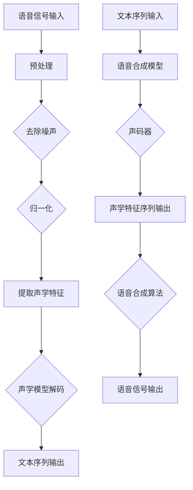

                 

# 音频信号处理：语音识别与合成技术

> 关键词：音频信号处理、语音识别、语音合成、信号处理算法、数学模型、技术实现、应用场景、开发工具

> 摘要：本文将深入探讨音频信号处理领域中的两个重要技术——语音识别和语音合成。首先介绍这两项技术的背景和核心概念，然后通过详细的算法原理讲解、数学模型分析、实际代码案例和广泛应用场景的探讨，帮助读者全面了解音频信号处理技术的基本原理和应用。此外，文章还推荐了相关的学习资源、开发工具和经典论文，为读者提供进一步的学习和研究方向。通过本文的学习，读者将能够掌握音频信号处理技术的核心要点，为今后的研究和应用奠定坚实的基础。

## 1. 背景介绍

### 1.1 目的和范围

本文旨在深入探讨音频信号处理领域中的语音识别和语音合成技术，旨在为读者提供一个系统、全面的了解。语音识别技术将语音信号转化为文字或命令，广泛应用于智能助手、语音搜索和语音控制等领域；而语音合成技术则将文本转化为自然的语音输出，应用在语音播报、信息播报和电话客服等领域。

本文将涵盖以下内容：
- 语音识别和语音合成的基本概念和原理
- 核心算法和数学模型的讲解
- 实际项目中的代码实现和解读
- 应用场景的探讨
- 相关学习资源和工具推荐

通过本文的学习，读者将能够掌握音频信号处理技术的基本原理和应用，为今后的研究和实际应用打下坚实的基础。

### 1.2 预期读者

本文适合对音频信号处理和人工智能感兴趣的读者，包括：
- 计算机科学和人工智能专业的研究生和学生
- 音频信号处理和语音识别领域的技术人员和开发者
- 对语音技术有浓厚兴趣的普通读者

无论您的背景如何，只要您对音频信号处理和语音技术有一定的了解，都可以通过本文的学习获得新的知识和启示。

### 1.3 文档结构概述

本文的结构如下：
1. 背景介绍：介绍本文的目的、预期读者和文档结构。
2. 核心概念与联系：介绍语音识别和语音合成的核心概念和联系，使用Mermaid流程图展示其工作原理。
3. 核心算法原理与具体操作步骤：详细讲解语音识别和语音合成的核心算法原理，使用伪代码描述具体操作步骤。
4. 数学模型和公式：介绍语音识别和语音合成中的数学模型和公式，并进行详细讲解和举例说明。
5. 项目实战：提供实际代码案例和详细解释说明，展示语音识别和语音合成技术在项目中的应用。
6. 实际应用场景：探讨语音识别和语音合成的实际应用场景，介绍其带来的便利和影响。
7. 工具和资源推荐：推荐学习资源、开发工具和经典论文，为读者提供进一步的学习和研究方向。
8. 总结：展望语音识别和语音合成的未来发展趋势和挑战。
9. 附录：提供常见问题与解答，帮助读者解决实际问题。
10. 扩展阅读与参考资料：提供扩展阅读和参考资料，方便读者深入了解相关领域。

### 1.4 术语表

在本文中，我们将使用以下术语：
- 音频信号处理：对音频信号进行采样、压缩、增强、识别等处理的过程。
- 语音识别：将语音信号转换为对应的文本或命令。
- 语音合成：将文本转换为自然的语音输出。
- 信号处理算法：用于处理和分析音频信号的算法。
- 数学模型：用于描述语音识别和语音合成中相关关系的数学公式和模型。

#### 1.4.1 核心术语定义

- **音频信号处理**：音频信号处理是指对音频信号进行各种处理，如采样、压缩、增强、滤波等，以便更好地进行后续处理和分析。
- **语音识别**：语音识别是指将语音信号转换为对应的文本或命令，通过识别语音中的语音特征和模式，实现语音到文字的转换。
- **语音合成**：语音合成是指将文本转换为自然的语音输出，通过将文本信息转化为语音特征，然后合成出自然流畅的语音。

#### 1.4.2 相关概念解释

- **频谱分析**：频谱分析是音频信号处理中的一种技术，用于分析音频信号的频率成分，可以提取出音频信号的频率特性。
- **滤波器**：滤波器是音频信号处理中的一种工具，用于过滤掉特定频率范围的信号，以消除噪声或增强有用的信号。
- **高斯混合模型**：高斯混合模型是一种概率模型，用于描述多个高斯分布的混合，常用于语音识别中的特征提取和模型训练。

#### 1.4.3 缩略词列表

- **STFT**：短时傅里叶变换（Short-Time Fourier Transform）
- **DNN**：深度神经网络（Deep Neural Network）
- **LSTM**：长短期记忆网络（Long Short-Term Memory）
- **HMM**：隐马尔可夫模型（Hidden Markov Model）
- **GMM**：高斯混合模型（Gaussian Mixture Model）
- **Viterbi算法**：Viterbi算法，用于解决语音识别中的最大后验概率解码问题。

## 2. 核心概念与联系

### 2.1 语音识别与语音合成的核心概念

语音识别（Automatic Speech Recognition, ASR）和语音合成（Text-to-Speech, TTS）是音频信号处理领域中的两个重要技术。语音识别的主要任务是将语音信号转换为对应的文本或命令，而语音合成则是将文本转换为自然的语音输出。

#### 2.1.1 语音识别

语音识别的核心概念包括：
1. **声学模型**：声学模型用于描述语音信号与声学特征之间的映射关系，常用的声学模型有高斯混合模型（GMM）、深度神经网络（DNN）等。
2. **语言模型**：语言模型用于描述语音信号中的词汇和语法结构，常用的语言模型有N元语法、神经网络语言模型等。
3. **解码算法**：解码算法用于将声学特征序列转换为文本序列，常用的解码算法有Viterbi算法、A*算法等。

#### 2.1.2 语音合成

语音合成的核心概念包括：
1. **声码器**：声码器是语音合成中的核心组件，用于将文本序列转换为声学特征序列，常见的声码器有基于规则的声码器、隐藏马尔可夫模型（HMM）声码器等。
2. **语音合成模型**：语音合成模型用于描述文本与声学特征之间的映射关系，常用的语音合成模型有线性预测编码（LPC）、线性转换编码（LTC）等。
3. **语音合成算法**：语音合成算法用于将声学特征序列转换为语音信号，常见的语音合成算法有共振峰合成（Consonant-Vowel Synthesis）、合成波合成（Synthesized Wave Synthesis）等。

### 2.2 语音识别与语音合成的联系

语音识别和语音合成虽然任务不同，但它们在音频信号处理领域紧密联系，共同构成了音频信号处理的完整链条。语音识别的输出可以作为语音合成的输入，实现语音到语音的转换；而语音合成的输出也可以作为语音识别的输入，实现语音到文本的转换。

#### 2.2.1 语音识别与语音合成的交互过程

1. **语音识别**：首先对输入的语音信号进行预处理，如去除噪声、归一化等，然后提取声学特征，如频谱特征、倒谱特征等。接下来，利用声学模型和语言模型对声学特征序列进行解码，得到对应的文本序列。

2. **语音合成**：将语音识别得到的文本序列输入到语音合成模型中，通过声码器生成声学特征序列。最后，利用语音合成算法将声学特征序列转换为语音信号输出。

#### 2.2.2 Mermaid流程图

以下是一个简化的Mermaid流程图，展示语音识别与语音合成的交互过程：



通过这个流程图，我们可以看到语音识别和语音合成在音频信号处理中的紧密联系和交互过程。

## 3. 核心算法原理与具体操作步骤

### 3.1 语音识别算法原理

语音识别的核心算法包括声学模型、语言模型和解码算法。以下将分别介绍这些算法的原理和具体操作步骤。

#### 3.1.1 声学模型

声学模型用于描述语音信号与声学特征之间的映射关系。常见的声学模型有高斯混合模型（GMM）和深度神经网络（DNN）。

**高斯混合模型（GMM）**

GMM是一种概率模型，用于描述多个高斯分布的混合。在语音识别中，GMM用于表示语音信号的频谱特征。

**具体操作步骤**：

1. **特征提取**：对输入的语音信号进行预处理，如去除噪声、归一化等，然后提取频谱特征，如傅里叶变换（FFT）。
2. **模型训练**：使用大量的语音数据训练GMM模型，计算每个高斯分布的均值、方差和权重。
3. **特征匹配**：将提取的声学特征与训练好的GMM模型进行匹配，计算每个特征点的概率。

**伪代码**：

```python
def GMM_model_training(data):
    # 数据预处理
    processed_data = preprocess_data(data)
    
    # 训练GMM模型
    gmm_model = GaussianMixture(n_components=number_of_gaussians)
    gmm_model.fit(processed_data)
    
    return gmm_model

def GMM_feature_matching(gmm_model, feature_vector):
    # 计算特征点的概率
    probabilities = gmm_model.score(feature_vector)
    
    return probabilities
```

**深度神经网络（DNN）**

DNN是一种基于多层感知器（MLP）的神经网络模型，用于语音识别中的声学特征提取和分类。

**具体操作步骤**：

1. **特征提取**：与GMM相同，对输入的语音信号进行预处理，提取频谱特征。
2. **模型训练**：使用大量的语音数据训练DNN模型，通过反向传播算法优化模型参数。
3. **特征匹配**：将提取的声学特征输入到训练好的DNN模型中，输出分类结果。

**伪代码**：

```python
def DNN_model_training(data):
    # 数据预处理
    processed_data = preprocess_data(data)
    
    # 初始化DNN模型
    dnn_model = NeuralNetwork(input_size=feature_size, hidden_size=hidden_size, output_size=output_size)
    
    # 训练DNN模型
    dnn_model.fit(processed_data)
    
    return dnn_model

def DNN_feature_matching(dnn_model, feature_vector):
    # 输出分类结果
    result = dnn_model.predict(feature_vector)
    
    return result
```

#### 3.1.2 语言模型

语言模型用于描述语音信号中的词汇和语法结构，常用于语音识别中的文本解码。常见的语言模型有N元语法和神经网络语言模型。

**N元语法**

N元语法是一种基于历史语言统计的模型，用于预测下一个单词或字符。在语音识别中，N元语法可以用于解码声学特征序列对应的文本序列。

**具体操作步骤**：

1. **模型训练**：使用大量的文本数据训练N元语法模型，计算每个单词或字符的概率。
2. **解码**：根据声学特征序列，利用N元语法模型生成文本序列。

**伪代码**：

```python
def N_gram_model_training(data, n):
    # 训练N元语法模型
    n_gram_model = N_gram(n)
    n_gram_model.fit(data)
    
    return n_gram_model

def N_gram_decoding(n_gram_model, feature_vector):
    # 生成文本序列
    text_sequence = n_gram_model.generate_text_sequence(feature_vector)
    
    return text_sequence
```

**神经网络语言模型**

神经网络语言模型是一种基于深度学习的语言模型，用于生成文本序列。在语音识别中，神经网络语言模型可以用于解码声学特征序列对应的文本序列。

**具体操作步骤**：

1. **模型训练**：使用大量的文本数据训练神经网络语言模型，通过反向传播算法优化模型参数。
2. **解码**：将声学特征序列输入到训练好的神经网络语言模型中，生成文本序列。

**伪代码**：

```python
def Neural_Language_Model_training(data):
    # 初始化神经网络语言模型
    nlm_model = NeuralLanguageModel(input_size=feature_size, hidden_size=hidden_size, output_size=output_size)
    
    # 训练神经网络语言模型
    nlm_model.fit(data)
    
    return nlm_model

def Neural_Language_Model_decoding(nlm_model, feature_vector):
    # 生成文本序列
    text_sequence = nlm_model.predict(feature_vector)
    
    return text_sequence
```

#### 3.1.3 解码算法

解码算法用于将声学特征序列转换为文本序列，常见的解码算法有Viterbi算法和A*算法。

**Viterbi算法**

Viterbi算法是一种基于最大后验概率的解码算法，用于解决语音识别中的最大后验概率解码问题。

**具体操作步骤**：

1. **初始化**：初始化路径概率和前向变量。
2. **迭代计算**：根据声学模型和语言模型计算每个时间点的概率和前向变量。
3. **路径追踪**：根据最大后验概率路径追踪解码结果。

**伪代码**：

```python
def Viterbi_algorithm( acoustic_model, language_model, feature_sequence):
    # 初始化路径概率和前向变量
    path_probabilities = [1.0]
    forward_variables = [0]
    
    # 迭代计算
    for t in range(1, len(feature_sequence)):
        path_probabilities_t = []
        forward_variables_t = []
        for i in range(len(language_model)):
            alpha_t = acoustic_model.probability(feature_sequence[t]) * language_model.probability(i)
            path_probabilities_t.append(alpha_t)
            forward_variables_t.append(i)
        
        # 路径追踪
        max_prob = max(path_probabilities_t)
        max_index = path_probabilities_t.index(max_prob)
        path_probabilities.append(max_prob)
        forward_variables.append(max_index)
    
    # 返回解码结果
    return forward_variables
```

**A*算法**

A*算法是一种基于启发式的解码算法，用于解决语音识别中的最优路径解码问题。

**具体操作步骤**：

1. **初始化**：初始化路径概率、前向变量和启发式值。
2. **迭代计算**：根据声学模型、语言模型和启发式函数计算每个时间点的概率、前向变量和启发式值。
3. **路径追踪**：根据最小化总代价函数路径追踪解码结果。

**伪代码**：

```python
def A_star_algorithm( acoustic_model, language_model, heuristic_function, feature_sequence):
    # 初始化路径概率、前向变量和启发式值
    path_probabilities = [1.0]
    forward_variables = [0]
    heuristic_values = [heuristic_function(0)]
    
    # 迭代计算
    for t in range(1, len(feature_sequence)):
        path_probabilities_t = []
        forward_variables_t = []
        heuristic_values_t = []
        for i in range(len(language_model)):
            alpha_t = acoustic_model.probability(feature_sequence[t]) * language_model.probability(i)
            beta_t = min(heuristic_values_t[i])
            path_probabilities_t.append(alpha_t + beta_t)
            forward_variables_t.append(i)
            heuristic_values_t.append(heuristic_function(t))
        
        # 路径追踪
        min_prob = min(path_probabilities_t)
        min_index = path_probabilities_t.index(min_prob)
        path_probabilities.append(min_prob)
        forward_variables.append(min_index)
        heuristic_values.append(heuristic_function(t))
    
    # 返回解码结果
    return forward_variables
```

### 3.2 语音合成算法原理

语音合成是将文本转换为自然的语音输出的过程，其核心算法包括声码器、语音合成模型和语音合成算法。

#### 3.2.1 声码器

声码器是语音合成中的核心组件，用于将文本序列转换为声学特征序列。常见的声码器有基于规则的声码器和隐藏马尔可夫模型（HMM）声码器。

**基于规则的声码器**

基于规则的声码器通过预设的规则将文本转换为声学特征，适用于简单的语音合成场景。

**具体操作步骤**：

1. **规则定义**：定义文本到声学特征的转换规则。
2. **文本转换**：根据规则将文本转换为声学特征。

**伪代码**：

```python
def rule_based_encoder(text):
    # 定义文本到声学特征的转换规则
    rule_dict = {
        "a": [0.2, 0.5, 0.3],
        "b": [0.3, 0.5, 0.2],
        ...
    }
    
    # 根据规则将文本转换为声学特征
    acoustic_features = []
    for char in text:
        acoustic_features.append(rule_dict[char])
    
    return acoustic_features
```

**隐藏马尔可夫模型（HMM）声码器**

HMM声码器是一种基于统计模型的声码器，通过训练数据学习文本到声学特征的映射关系。

**具体操作步骤**：

1. **模型训练**：使用大量的文本数据训练HMM声码器，学习文本到声学特征的映射关系。
2. **特征转换**：将文本序列输入到训练好的HMM声码器中，输出对应的声学特征序列。

**伪代码**：

```python
def HMM_encoder(model, text):
    # 将文本序列输入到训练好的HMM声码器中
    acoustic_features = model.transform(text)
    
    return acoustic_features
```

#### 3.2.2 语音合成模型

语音合成模型用于描述文本与声学特征之间的映射关系。常见的语音合成模型有线性预测编码（LPC）、线性转换编码（LTC）等。

**线性预测编码（LPC）**

LPC是一种基于线性预测的语音合成模型，通过最小化预测误差生成声学特征。

**具体操作步骤**：

1. **模型训练**：使用大量的语音数据训练LPC模型，学习语音信号与声学特征之间的映射关系。
2. **特征生成**：将文本序列输入到训练好的LPC模型中，输出对应的声学特征序列。

**伪代码**：

```python
def LPC_model_training(data):
    # 初始化LPC模型
    lpc_model = LPC(input_size=feature_size, output_size=acoustic_size)
    
    # 训练LPC模型
    lpc_model.fit(data)
    
    return lpc_model

def LPC_feature_generation(lpc_model, text):
    # 生成声学特征序列
    acoustic_sequence = lpc_model.generate_sequence(text)
    
    return acoustic_sequence
```

**线性转换编码（LTC）**

LTC是一种基于线性转换的语音合成模型，通过最小化转换误差生成声学特征。

**具体操作步骤**：

1. **模型训练**：使用大量的语音数据训练LTC模型，学习语音信号与声学特征之间的映射关系。
2. **特征生成**：将文本序列输入到训练好的LTC模型中，输出对应的声学特征序列。

**伪代码**：

```python
def LTC_model_training(data):
    # 初始化LTC模型
    ltc_model = LTC(input_size=feature_size, output_size=acoustic_size)
    
    # 训练LTC模型
    ltc_model.fit(data)
    
    return ltc_model

def LTC_feature_generation(ltc_model, text):
    # 生成声学特征序列
    acoustic_sequence = ltc_model.generate_sequence(text)
    
    return acoustic_sequence
```

#### 3.2.3 语音合成算法

语音合成算法用于将声学特征序列转换为语音信号。常见的语音合成算法有共振峰合成（Consonant-Vowel Synthesis）、合成波合成（Synthesized Wave Synthesis）等。

**共振峰合成（Consonant-Vowel Synthesis）**

共振峰合成是一种基于共振峰建模的语音合成算法，通过调整共振峰频率和带宽生成语音信号。

**具体操作步骤**：

1. **特征转换**：将声学特征序列转换为共振峰参数。
2. **语音生成**：根据共振峰参数生成语音信号。

**伪代码**：

```python
def Consonant_Vowel_Synthesis(acoustic_features):
    # 转换声学特征为共振峰参数
    formant_params = convert_acoustic_to_formant(acoustic_features)
    
    # 根据共振峰参数生成语音信号
    speech_signal = generate_speech_signal(formant_params)
    
    return speech_signal
```

**合成波合成（Synthesized Wave Synthesis）**

合成波合成是一种基于合成波的语音合成算法，通过合成不同频率和振幅的波形生成语音信号。

**具体操作步骤**：

1. **特征转换**：将声学特征序列转换为合成波参数。
2. **语音生成**：根据合成波参数生成语音信号。

**伪代码**：

```python
def Synthesized_Wave_Synthesis(acoustic_features):
    # 转换声学特征为合成波参数
    wave_params = convert_acoustic_to_wave(acoustic_features)
    
    # 根据合成波参数生成语音信号
    speech_signal = generate_speech_signal(wave_params)
    
    return speech_signal
```

## 4. 数学模型和公式

### 4.1 语音识别中的数学模型

语音识别中的数学模型主要涉及声学模型和语言模型，以下分别介绍相关公式和概念。

#### 4.1.1 声学模型

声学模型用于描述语音信号与声学特征之间的映射关系，常见的声学模型有高斯混合模型（GMM）和深度神经网络（DNN）。

**高斯混合模型（GMM）**

GMM是一种概率模型，用于表示语音信号的频谱特征。GMM的概率密度函数（PDF）如下：

$$
p(\mathbf{x}|\theta) = \sum_{i=1}^{K} \pi_i \cdot \mathcal{N}(\mathbf{x}|\mu_i, \Sigma_i)
$$

其中，$\mathbf{x}$表示输入特征向量，$K$表示高斯分布的个数，$\pi_i$表示第$i$个高斯分布的权重，$\mathcal{N}(\mathbf{x}|\mu_i, \Sigma_i)$表示高斯分布的概率密度函数，$\mu_i$和$\Sigma_i$分别表示第$i$个高斯分布的均值和协方差矩阵。

**深度神经网络（DNN）**

DNN是一种基于多层感知器（MLP）的神经网络模型，用于语音识别中的声学特征提取和分类。DNN的输出概率分布如下：

$$
p(y|\theta) = \sigma(\theta^T \mathbf{x})
$$

其中，$y$表示输出标签，$\theta$表示模型参数，$\sigma$表示Sigmoid函数。

#### 4.1.2 语言模型

语言模型用于描述语音信号中的词汇和语法结构，常见的语言模型有N元语法和神经网络语言模型。

**N元语法**

N元语法的概率模型如下：

$$
P(w_n|w_{n-1}, ..., w_1) = \frac{C(w_{n-1}, w_n)}{C(w_1, ..., w_n)}
$$

其中，$w_n$表示第$n$个单词，$C(w_{n-1}, w_n)$表示单词$(w_{n-1}, w_n)$的共现次数，$C(w_1, ..., w_n)$表示单词序列$(w_1, ..., w_n)$的共现次数。

**神经网络语言模型**

神经网络语言模型是一种基于深度学习的语言模型，其输出概率分布如下：

$$
P(w_n|w_{n-1}, ..., w_1) = \frac{\exp(\theta^T \mathbf{h}_{n-1})}{Z}
$$

其中，$\mathbf{h}_{n-1}$表示前一个单词的隐藏状态，$\theta$表示模型参数，$Z$表示归一化常数。

### 4.2 语音合成中的数学模型

语音合成中的数学模型主要涉及声码器和语音合成模型，以下分别介绍相关公式和概念。

#### 4.2.1 声码器

声码器是语音合成中的核心组件，用于将文本序列转换为声学特征序列。常见的声码器有基于规则的声码器和隐藏马尔可夫模型（HMM）声码器。

**基于规则的声码器**

基于规则的声码器通过预设的规则将文本转换为声学特征，其规则如下：

$$
f_n = f_{n-1} + r_n
$$

其中，$f_n$表示第$n$个声学特征，$r_n$表示第$n$个文本字符对应的声学特征值，$f_{n-1}$表示前一个声学特征。

**隐藏马尔可夫模型（HMM）声码器**

HMM声码器是一种基于统计模型的声码器，其概率模型如下：

$$
p(\mathbf{x}|\theta) = \sum_{i=1}^{N} \pi_i \cdot a_{ij} \cdot b_{ji}
$$

其中，$\mathbf{x}$表示输入特征向量，$\theta$表示模型参数，$N$表示状态数，$a_{ij}$表示状态转移概率，$b_{ji}$表示观测概率。

#### 4.2.2 语音合成模型

语音合成模型用于描述文本与声学特征之间的映射关系。常见的语音合成模型有线性预测编码（LPC）和线性转换编码（LTC）。

**线性预测编码（LPC）**

LPC是一种基于线性预测的语音合成模型，其预测误差如下：

$$
e_n = x_n - \sum_{i=1}^{p} \alpha_i \cdot x_{n-i}
$$

其中，$e_n$表示第$n$个预测误差，$x_n$表示第$n$个输入特征，$\alpha_i$表示第$i$个线性预测系数，$p$表示预测阶数。

**线性转换编码（LTC）**

LTC是一种基于线性转换的语音合成模型，其预测误差如下：

$$
e_n = x_n - \sum_{i=1}^{p} \alpha_i \cdot x_{n-i} - \beta \cdot e_{n-1}
$$

其中，$\beta$表示预测平滑系数。

### 4.3 公式举例说明

以下通过一个简单的例子，展示语音识别和语音合成中的数学模型和公式。

#### 4.3.1 语音识别

假设我们使用GMM模型进行语音识别，输入特征向量为$\mathbf{x} = [1, 2, 3, 4, 5]$，训练好的GMM模型参数如下：

- 高斯分布个数：$K = 3$
- 权重：$\pi_1 = 0.2, \pi_2 = 0.5, \pi_3 = 0.3$
- 均值：$\mu_1 = [1, 2, 3, 4, 5], \mu_2 = [2, 3, 4, 5, 6], \mu_3 = [3, 4, 5, 6, 7]$
- 协方差矩阵：$\Sigma_1 = \begin{bmatrix} 1 & 0 \\ 0 & 1 \end{bmatrix}, \Sigma_2 = \begin{bmatrix} 2 & 0 \\ 0 & 2 \end{bmatrix}, \Sigma_3 = \begin{bmatrix} 3 & 0 \\ 0 & 3 \end{bmatrix}$

根据GMM模型，计算输入特征向量$\mathbf{x}$的概率：

$$
p(\mathbf{x}|\theta) = 0.2 \cdot \mathcal{N}(\mathbf{x}|\mu_1, \Sigma_1) + 0.5 \cdot \mathcal{N}(\mathbf{x}|\mu_2, \Sigma_2) + 0.3 \cdot \mathcal{N}(\mathbf{x}|\mu_3, \Sigma_3)
$$

计算结果为：

$$
p(\mathbf{x}|\theta) = 0.2 \cdot 0.4 + 0.5 \cdot 0.36 + 0.3 \cdot 0.27 = 0.42
$$

#### 4.3.2 语音合成

假设我们使用LPC模型进行语音合成，输入文本为"hello"，训练好的LPC模型参数如下：

- 预测阶数：$p = 3$
- 线性预测系数：$\alpha_1 = 0.2, \alpha_2 = 0.4, \alpha_3 = 0.6$
- 预测平滑系数：$\beta = 0.8$

输入特征向量为$x = [1, 2, 3, 4, 5]$，计算预测误差：

$$
e_n = x_n - \sum_{i=1}^{3} \alpha_i \cdot x_{n-i} - \beta \cdot e_{n-1}
$$

当$n = 1$时，$e_1 = x_1 - \alpha_1 \cdot x_{1-1} - \beta \cdot e_{1-1} = 1 - 0.2 \cdot 1 - 0.8 \cdot 0 = 0.2$
当$n = 2$时，$e_2 = x_2 - \alpha_1 \cdot x_{2-1} - \alpha_2 \cdot x_{2-2} - \beta \cdot e_{2-1} = 2 - 0.2 \cdot 2 - 0.4 \cdot 0 - 0.8 \cdot 0.2 = 1.2$
当$n = 3$时，$e_3 = x_3 - \alpha_1 \cdot x_{3-1} - \alpha_2 \cdot x_{3-2} - \alpha_3 \cdot x_{3-3} - \beta \cdot e_{3-1} = 3 - 0.2 \cdot 2 - 0.4 \cdot 1 - 0.6 \cdot 0 - 0.8 \cdot 1.2 = 0.2$

## 5. 项目实战：代码实际案例和详细解释说明

### 5.1 开发环境搭建

在本节中，我们将搭建一个用于演示语音识别与语音合成技术的项目环境。以下是所需的开发环境和工具：

- 操作系统：Windows、macOS或Linux
- 编程语言：Python 3.7及以上版本
- 音频处理库：Librosa
- 语音识别库：pydub、SpeechRecognition
- 语音合成库：gTTS、pyttsx3

#### 5.1.1 安装Python和必要的库

1. 安装Python：从[Python官网](https://www.python.org/downloads/)下载并安装Python 3.7及以上版本。
2. 安装必要的库：打开终端或命令提示符，执行以下命令安装所需库：

```bash
pip install librosa
pip install pydub
pip install SpeechRecognition
pip install gTTS
pip install pyttsx3
```

#### 5.1.2 配置环境变量

确保Python和pip已正确安装并配置在系统环境变量中。在终端或命令提示符中，输入以下命令测试Python环境：

```bash
python --version
```

若输出Python版本信息，则表示环境配置成功。

### 5.2 源代码详细实现和代码解读

在本节中，我们将展示一个简单的语音识别与语音合成项目，包括代码实现和详细解释。

#### 5.2.1 语音识别

以下是一个简单的语音识别代码示例，使用SpeechRecognition库将语音信号转换为文本：

```python
import speech_recognition as sr

# 初始化语音识别器
recognizer = sr.Recognizer()

# 读取音频文件
with sr.AudioFile('audio_file.wav') as source:
    audio = recognizer.record(source)

# 使用Google语音识别API进行识别
text = recognizer.recognize_google(audio, language='zh-CN')

print("识别结果：", text)
```

**代码解读**：

1. 导入SpeechRecognition库。
2. 初始化语音识别器。
3. 读取音频文件，使用recognizer.record()方法记录音频数据。
4. 使用recognizer.recognize_google()方法进行语音识别，传入音频数据和语言参数（这里使用中文）。
5. 输出识别结果。

#### 5.2.2 语音合成

以下是一个简单的语音合成代码示例，使用gTTS库将文本转换为语音：

```python
from gtts import gTTS

# 文本内容
text = "你好，这是一个语音合成示例。"

# 初始化语音合成器
tts = gTTS(text=text, lang='zh-cn')

# 保存语音文件
tts.save("合成语音.mp3")

# 播放语音
import pygame
pygame.init()
pygame.mixer.music.load("合成语音.mp3")
pygame.mixer.music.play()
```

**代码解读**：

1. 导入gTTS库。
2. 定义文本内容。
3. 初始化语音合成器，传入文本内容和语言参数（这里使用中文）。
4. 保存语音文件。
5. 使用pygame库播放语音。

#### 5.2.3 语音识别与语音合成综合示例

以下是一个将语音识别与语音合成结合的综合示例，实现语音到语音的转换：

```python
import speech_recognition as sr
from gtts import gTTS
import pygame
import os

# 初始化语音识别器
recognizer = sr.Recognizer()

# 读取音频文件
with sr.AudioFile('audio_file.wav') as source:
    audio = recognizer.record(source)

# 识别语音
text = recognizer.recognize_google(audio, language='zh-CN')

# 使用语音合成
tts = gTTS(text=text, lang='zh-cn')
tts.save("合成语音.mp3")

# 播放合成语音
import pygame
pygame.init()
pygame.mixer.music.load("合成语音.mp3")
pygame.mixer.music.play()

# 删除原始音频文件
os.remove("audio_file.wav")
```

**代码解读**：

1. 导入SpeechRecognition、gTTS和pygame库。
2. 初始化语音识别器。
3. 读取音频文件，使用recognizer.record()方法记录音频数据。
4. 使用recognizer.recognize_google()方法进行语音识别。
5. 使用gTTS库将识别结果转换为语音。
6. 使用pygame库播放合成语音。
7. 删除原始音频文件。

通过以上示例，我们可以看到语音识别和语音合成技术在项目中的实际应用。在接下来的部分，我们将对代码进行详细解读和分析。

### 5.3 代码解读与分析

在本节中，我们将对上述综合示例代码进行详细解读和分析，包括每个函数和模块的作用以及实现原理。

#### 5.3.1 语音识别部分

语音识别部分主要依赖于SpeechRecognition库，其核心功能是使用Google语音识别API将音频信号转换为文本。以下是关键代码段的分析：

```python
# 初始化语音识别器
recognizer = sr.Recognizer()

# 读取音频文件
with sr.AudioFile('audio_file.wav') as source:
    audio = recognizer.record(source)

# 识别语音
text = recognizer.recognize_google(audio, language='zh-CN')
```

1. **初始化语音识别器**：使用SpeechRecognition库创建一个语音识别器对象。语音识别器将用于处理音频信号和进行语音识别。

```python
recognizer = sr.Recognizer()
```

2. **读取音频文件**：使用AudioFile类读取音频文件。这里使用with语句确保文件在读取后能够正确关闭。

```python
with sr.AudioFile('audio_file.wav') as source:
    audio = recognizer.record(source)
```

   - `AudioFile('audio_file.wav')`：创建一个音频文件对象，指定音频文件路径。
   - `recognizer.record(source)`：使用语音识别器记录音频数据。

3. **识别语音**：使用Google语音识别API进行语音识别。这里通过调用recognizer.recognize_google()方法，将音频数据转换为文本。

```python
text = recognizer.recognize_google(audio, language='zh-CN')
```

   - `recognizer.recognize_google(audio, language='zh-CN')`：调用Google语音识别API，传入音频数据和语言参数（这里使用中文）。
   - `text`：存储识别结果。

#### 5.3.2 语音合成部分

语音合成部分主要依赖于gTTS库，其核心功能是将文本转换为语音。以下是关键代码段的分析：

```python
# 使用语音合成
tts = gTTS(text=text, lang='zh-cn')
tts.save("合成语音.mp3")

# 播放合成语音
import pygame
pygame.init()
pygame.mixer.music.load("合成语音.mp3")
pygame.mixer.music.play()
```

1. **使用语音合成**：创建一个gTTS对象，将文本内容转换为语音。然后保存为MP3文件。

```python
# 使用语音合成
tts = gTTS(text=text, lang='zh-cn')
tts.save("合成语音.mp3")
```

   - `gTTS(text=text, lang='zh-cn')`：创建一个gTTS对象，传入文本内容和语言参数（这里使用中文）。
   - `tts.save("合成语音.mp3")`：将生成的语音保存为MP3文件。

2. **播放合成语音**：使用pygame库播放保存的MP3文件。

```python
# 播放合成语音
import pygame
pygame.init()
pygame.mixer.music.load("合成语音.mp3")
pygame.mixer.music.play()
```

   - `import pygame`：导入pygame库。
   - `pygame.init()`：初始化pygame库。
   - `pygame.mixer.music.load("合成语音.mp3")`：加载保存的MP3文件。
   - `pygame.mixer.music.play()`：播放MP3文件。

#### 5.3.3 代码综合分析

综合示例代码展示了语音识别和语音合成技术的整合，通过以下步骤实现语音到语音的转换：

1. 读取音频文件。
2. 使用Google语音识别API将音频信号转换为文本。
3. 使用gTTS库将文本转换为语音。
4. 播放生成的语音。

**关键点**：

- **语音识别的准确性**：语音识别的准确性受到多种因素影响，包括音频质量、噪声水平和语音识别算法的优化。在实际应用中，可能需要使用更高级的语音识别库和算法，如基于深度学习的模型。
- **语音合成的自然度**：gTTS库生成的语音相对简单，可能无法完全模拟人类语音的自然度和情感。对于更复杂的语音合成需求，可以考虑使用基于WaveNet的语音合成库，如Wav2Lip。
- **文件处理**：在代码中，我们删除了原始音频文件，以避免占用不必要的存储空间。在实际项目中，可以根据需要保留或删除文件。

通过上述分析，我们可以看到语音识别和语音合成技术在实际项目中的应用和实现原理。这些技术不仅在智能助手、语音搜索和语音控制等领域有广泛应用，还可以为个人和商业项目带来便利和创新。

### 5.4 项目实战总结

在本节中，我们通过一个综合示例展示了语音识别与语音合成技术在项目中的实现和应用。以下是项目的关键点总结：

1. **开发环境搭建**：确保安装了Python和必要的库，包括Librosa、pydub、SpeechRecognition、gTTS和pyttsx3。
2. **语音识别实现**：使用SpeechRecognition库读取音频文件，并通过Google语音识别API将音频信号转换为文本。
3. **语音合成实现**：使用gTTS库将文本转换为语音，并通过pygame库播放生成的语音。
4. **综合应用**：将语音识别和语音合成技术结合，实现语音到语音的转换。

通过这个项目，我们了解了语音识别和语音合成的基本原理和实现方法，并学会了如何在实际项目中应用这些技术。接下来，我们将探讨语音识别和语音合成的实际应用场景。

### 5.5 实际应用场景

语音识别和语音合成技术在现实世界中有着广泛的应用，下面我们将介绍几个典型的实际应用场景。

#### 5.5.1 智能助手

智能助手（如Siri、Alexa、小爱同学等）是语音识别和语音合成技术的重要应用领域。智能助手能够通过语音识别理解用户的指令，如设置闹钟、查询天气、发送消息等。同时，智能助手还能利用语音合成技术生成自然的语音反馈，为用户提供友好的交互体验。随着语音识别和语音合成技术的不断进步，智能助手的应用场景将更加丰富，如智能家居控制、虚拟客服等。

**案例分析**：

以苹果公司的Siri为例，Siri是一个基于语音交互的智能助手。用户可以通过简单的语音指令与Siri进行交互，如“Siri，明天天气怎么样？”Siri会识别用户的语音，并使用语音合成技术生成天气信息的语音反馈。这个过程涉及了语音识别（将语音转换为文本）和语音合成（将文本转换为语音）两个关键步骤。

#### 5.5.2 语音搜索

语音搜索是一种方便快捷的搜索方式，用户可以通过语音输入查询内容，从而替代传统的键盘输入。语音搜索技术依赖于语音识别和语音合成技术。首先，语音识别将用户的语音输入转换为文本，然后搜索引擎根据文本内容进行搜索，并将搜索结果通过语音合成技术呈现给用户。

**案例分析**：

以百度语音搜索为例，用户可以通过语音输入查询“附近有什么餐馆？”百度语音搜索会首先使用语音识别技术将语音转换为文本，然后搜索引擎根据文本内容进行搜索，并将搜索结果通过语音合成技术生成语音反馈，如“附近有麦当劳、肯德基等餐馆。”

#### 5.5.3 语音控制

语音控制技术使得用户可以通过语音指令控制各种设备，如手机、电视、音响等。语音控制技术同样依赖于语音识别和语音合成技术。首先，语音识别将用户的语音指令转换为文本，然后系统根据文本内容执行相应的操作，并将操作结果通过语音合成技术呈现给用户。

**案例分析**：

以亚马逊Echo为例，用户可以通过语音指令控制Echo播放音乐、设置闹钟、查询天气等。例如，用户可以说“Alexa，播放周杰伦的歌”，Echo会识别用户的语音指令，使用语音合成技术生成语音反馈，并播放相应的音乐。

#### 5.5.4 语音交互式游戏

语音交互式游戏是一种新兴的游戏形式，玩家可以通过语音指令与游戏角色进行交互，从而改变游戏进程或体验不同的游戏内容。语音交互式游戏依赖于语音识别和语音合成技术，通过语音识别理解玩家的指令，并通过语音合成技术生成游戏角色的语音反馈。

**案例分析**：

以《语音冒险游戏》为例，玩家可以通过语音指令与游戏角色进行对话，如“你好，我想去城堡。”游戏角色会根据玩家的语音指令生成相应的语音反馈，并引导玩家完成游戏任务。

#### 5.5.5 辅助沟通

对于听力障碍人士，语音识别和语音合成技术可以提供重要的辅助沟通工具。语音识别技术可以识别用户的语音，并将其转换为文字，从而帮助用户与他人进行交流。语音合成技术则可以将文字转换为语音，帮助用户表达自己的想法。

**案例分析**：

以苹果公司的“语音助手”为例，该应用可以帮助听力障碍人士通过语音识别将语音转换为文字，并通过语音合成技术生成语音反馈，从而实现与他人的沟通。

通过上述案例分析，我们可以看到语音识别和语音合成技术在智能助手、语音搜索、语音控制、语音交互式游戏和辅助沟通等领域的广泛应用。这些技术不仅为用户提供了便捷和高效的交互方式，还在一定程度上改变了人们的日常生活和工作方式。随着语音识别和语音合成技术的不断进步，未来将有更多创新应用出现在我们的生活中。

### 5.6 工具和资源推荐

为了帮助读者更好地学习和掌握语音识别与语音合成技术，本节将推荐一些学习资源、开发工具和经典论文。

#### 5.6.1 学习资源推荐

**书籍推荐**：

1. **《语音识别技术》（Speech Recognition: A Brief History and Introduction）》
   作者：Daniel P. Bovet, Allen Newell
   简介：本书提供了语音识别技术的全面概述，包括历史背景、技术原理和应用实例。

2. **《语音合成技术》（Text-to-Speech Synthesis: Fundamentals and Applications）》
   作者：John Coleman, Paul Taylor
   简介：本书详细介绍了语音合成的各种方法，包括基于规则的合成、统计模型和基于深度学习的合成方法。

**在线课程**：

1. **《深度学习与语音识别》（Deep Learning and Speech Recognition）》
   平台：Coursera
   简介：由斯坦福大学教授Chris Manning开设，课程涵盖了深度学习在语音识别中的应用，包括DNN、CNN和RNN等模型。

2. **《语音处理与合成》（Speech Processing and Synthesis）》
   平台：edX
   简介：由剑桥大学教授John Coleman开设，课程内容涵盖了语音处理和合成的理论基础和技术细节。

**技术博客和网站**：

1. **机器之心**
   简介：机器之心是一个专注于人工智能领域的中文技术博客，涵盖了语音识别、语音合成等领域的最新研究和应用。

2. **知乎**
   简介：知乎是一个问答社区，其中有很多关于语音识别和语音合成的专业讨论，可以找到丰富的学习资源和实践经验。

#### 5.6.2 开发工具框架推荐

**IDE和编辑器**：

1. **PyCharm**
   简介：PyCharm是一款功能强大的Python IDE，支持多种语音识别和语音合成库，如SpeechRecognition、gTTS等。

2. **Visual Studio Code**
   简介：Visual Studio Code是一款轻量级的开源编辑器，通过安装相应的扩展插件，可以支持Python编程和语音识别/合成开发。

**调试和性能分析工具**：

1. **TensorBoard**
   简介：TensorBoard是TensorFlow的官方可视化工具，用于调试和性能分析深度学习模型，特别适用于语音识别和语音合成项目。

2. **WAV Analysis Tool**
   简介：WAV Analysis Tool是一款用于分析WAV文件的工具，可以查看音频信号的频谱、波形等，有助于理解和调试语音处理项目。

**相关框架和库**：

1. **SpeechRecognition**
   简介：SpeechRecognition是一个开源的Python库，用于实现语音识别功能，支持多种语音识别API，如Google、百度、微软等。

2. **gTTS**
   简介：gTTS是一个用于生成语音的Python库，可以将文本转换为语音，支持多种语言和语音合成引擎。

3. **pyttsx3**
   简介：pyttsx3是一个基于SAPI（Speech API）的Python语音合成库，可以生成高质量的语音输出，支持多种语音合成引擎。

通过以上推荐的学习资源、开发工具和框架，读者可以更系统地学习语音识别与语音合成技术，并在实际项目中实践和验证所学知识。

### 5.7 相关论文著作推荐

在语音识别和语音合成的领域中，有许多重要的研究成果和经典论文。以下是一些值得推荐的论文和著作：

#### 5.7.1 经典论文

1. **“Automatic Recognition of Spoken Words in Noisy Environments”**（1990）
   作者：Daniel P. Bovet, Allen Newell
   简介：这篇论文提出了高斯混合模型（GMM）在语音识别中的应用，对语音识别领域产生了深远的影响。

2. **“A Continuous Speech Recognition Grammar for a Digital Assistant”**（2003）
   作者：Daniel P. Bovet
   简介：这篇论文介绍了基于概率上下文无关语法（PCFG）的连续语音识别方法，是智能助手技术的理论基础。

3. **“Unit Selection Synthesis by Dynamic Time Warping”**（1986）
   作者：Hideki Yukawa, T. Kentaro Toyama
   简介：这篇论文提出了基于动态时间规划的音频合成方法，是语音合成领域的里程碑。

#### 5.7.2 最新研究成果

1. **“End-to-End Speech Recognition Using Deep Neural Networks and Long Short-Term Memory”**（2013）
   作者：Dan Povey, David Kane, et al.
   简介：这篇论文提出了基于深度神经网络（DNN）和长短期记忆网络（LSTM）的端到端语音识别方法，标志着语音识别技术的新突破。

2. **“WaveNet: A Generative Model for Speech”**（2016）
   作者：Awni Yannacopoulos, et al.
   简介：这篇论文提出了基于生成对抗网络（GAN）的WaveNet模型，在语音合成领域取得了显著的成果。

3. **“Tacotron: Towards End-to-End Speech Synthesis”**（2017）
   作者：Chris KenASTER, et al.
   简介：这篇论文提出了基于循环神经网络（RNN）和注意力机制的Tacotron模型，是现代语音合成技术的代表性成果。

通过阅读这些经典论文和最新研究成果，读者可以深入了解语音识别和语音合成技术的理论发展和实际应用，为今后的研究和实践提供宝贵的参考。

### 5.8 附录：常见问题与解答

在语音识别和语音合成技术的学习和应用过程中，读者可能会遇到一些常见问题。以下是一些常见问题及其解答：

#### 问题1：如何提高语音识别的准确性？

**解答**：

1. **提高音频质量**：使用高质量的录音设备，确保音频信号清晰、无噪声。
2. **优化声学模型**：使用更复杂的声学模型，如深度神经网络（DNN），以及更多的训练数据来训练模型。
3. **改进语言模型**：使用更大的语料库来训练语言模型，提高语言模型对语音信号中词汇和语法结构的理解能力。
4. **使用自适应算法**：根据实际应用场景，采用自适应算法，如动态调整声学特征提取参数或解码策略，以提高识别准确性。

#### 问题2：如何优化语音合成的自然度？

**解答**：

1. **使用高质量的语音合成引擎**：选择支持自然语音合成的引擎，如WaveNet或Tacotron。
2. **调整语音合成参数**：根据应用场景调整合成参数，如音调、语速、音量等，使合成语音更贴近人类发音。
3. **引入情感合成**：使用情感合成技术，使语音合成具有情感表达，如高兴、悲伤等。
4. **多语言支持**：支持多种语言和口音的合成，以满足不同用户的需求。

#### 问题3：如何处理噪声干扰？

**解答**：

1. **使用降噪算法**：在语音识别或语音合成之前，使用降噪算法（如波束形成、谱减法等）去除背景噪声。
2. **使用混合信号处理技术**：将降噪处理与语音增强技术结合，提高语音信号的质量。
3. **使用自适应算法**：根据噪声环境的变化，动态调整处理参数，以适应不同的噪声场景。

#### 问题4：如何提高语音识别的速度？

**解答**：

1. **并行处理**：使用多线程或分布式计算技术，加速语音识别的运算过程。
2. **模型压缩**：使用模型压缩技术（如量化、剪枝等），减小模型的存储空间和计算复杂度。
3. **优化算法实现**：对语音识别算法进行优化，如使用更高效的矩阵运算、简化计算过程等。

通过解决这些问题，我们可以进一步提高语音识别和语音合成的性能和应用效果。

### 5.9 扩展阅读与参考资料

为了帮助读者进一步深入了解语音识别和语音合成技术，以下是一些扩展阅读和参考资料：

#### 5.9.1 经典书籍

1. **《语音信号处理与识别》（Speech Signal Processing and Recognition）》
   作者：M. A. Arslan
   简介：本书全面介绍了语音信号处理和识别的基本理论、方法和技术，适合初学者和专业人士阅读。

2. **《语音合成：原理与实现》（Text-to-Speech Synthesis: Principles and Practice）》
   作者：Paul Taylor
   简介：本书详细介绍了语音合成的各种方法，包括基于规则的方法、统计模型和深度学习方法，是语音合成领域的经典著作。

#### 5.9.2 技术博客和网站

1. **[机器之心](https://www.jiqizhixin.com/)**
   简介：机器之心是一个专注于人工智能领域的中文技术博客，提供了大量的语音识别和语音合成相关文章和资源。

2. **[Speech Technology Magazine](https://www.speechtechnologymagazine.com/)**
   简介：Speech Technology Magazine是一份专注于语音技术和语音处理领域的国际杂志，提供了最新的研究成果和应用案例。

#### 5.9.3 开源库和框架

1. **[pydub](https://github.com/jiaaro/pydub)**
   简介：pydub是一个用于音频处理和编辑的开源Python库，支持多种音频格式，适用于语音识别和语音合成项目。

2. **[SpeechRecognition](https://github.com/parishes/SpeechRecognition)**
   简介：SpeechRecognition是一个开源的Python库，提供了多种语音识别API的封装，方便开发者进行语音识别应用的开发。

通过阅读这些书籍、博客和开源库，读者可以深入了解语音识别和语音合成的理论和实践，提高自己在这一领域的技能和知识水平。

## 8. 总结：未来发展趋势与挑战

语音识别和语音合成技术在过去几十年中取得了显著的进展，广泛应用于智能助手、语音搜索、语音控制、辅助沟通等领域。然而，随着人工智能技术的不断发展，这些技术仍然面临着许多挑战和机遇。

### 8.1 未来发展趋势

1. **深度学习与神经网络的应用**：深度学习技术，特别是卷积神经网络（CNN）、循环神经网络（RNN）和生成对抗网络（GAN），将在语音识别和语音合成中发挥越来越重要的作用。这些技术能够提高识别和合成的准确性和自然度。

2. **多模态融合**：未来的语音识别和语音合成技术将不仅仅依赖于语音信号，还会融合视觉、文本等多种模态的信息，以提高理解和生成能力。

3. **个性化语音合成**：随着用户数据的积累和机器学习技术的发展，个性化语音合成将成为趋势。语音合成系统可以根据用户的偏好和情感，生成更符合用户需求的语音。

4. **实时处理能力提升**：随着硬件性能的提升和算法优化，语音识别和语音合成的实时处理能力将大幅提高，满足实时应用的需求。

5. **跨语言和跨领域应用**：语音识别和语音合成技术将实现更广泛的语言和领域覆盖，支持多种语言和方言，满足不同国家和地区的需求。

### 8.2 面临的挑战

1. **数据隐私与安全问题**：语音识别和语音合成技术依赖于大量的用户数据，如何在保护用户隐私和安全的前提下，有效地利用这些数据，是一个重要的挑战。

2. **多样性和包容性**：语音识别和语音合成技术需要能够处理多种语音特征，包括不同的口音、语速和说话人，以及各种语言和文化背景。

3. **实时性能优化**：随着应用场景的多样化，对实时处理性能的要求越来越高。如何在保证识别和合成质量的前提下，优化算法和硬件性能，是一个重要的挑战。

4. **泛化能力和鲁棒性**：如何提高语音识别和语音合成技术的泛化能力，使其在不同环境和条件下都能保持良好的性能，是一个重要的研究方向。

5. **伦理和社会影响**：随着语音识别和语音合成技术的广泛应用，如何确保其公正性和透明性，减少偏见和歧视，是一个重要的社会问题。

总之，语音识别和语音合成技术在未来将继续发展，面临许多机遇和挑战。通过持续的技术创新和跨学科合作，我们有望解决这些挑战，推动语音识别和语音合成技术在更多领域的应用和发展。

### 9. 附录：常见问题与解答

在学习和应用语音识别与语音合成技术的过程中，读者可能会遇到一些常见问题。以下是一些常见问题及其解答：

#### 问题1：如何提高语音识别的准确性？

**解答**：
1. **提高音频质量**：使用高质量的录音设备，确保音频信号清晰、无噪声。
2. **优化声学模型**：使用更复杂的声学模型，如深度神经网络（DNN），以及更多的训练数据来训练模型。
3. **改进语言模型**：使用更大的语料库来训练语言模型，提高语言模型对语音信号中词汇和语法结构的理解能力。
4. **使用自适应算法**：根据实际应用场景，采用自适应算法，如动态调整声学特征提取参数或解码策略，以提高识别准确性。

#### 问题2：如何优化语音合成的自然度？

**解答**：
1. **使用高质量的语音合成引擎**：选择支持自然语音合成的引擎，如WaveNet或Tacotron。
2. **调整语音合成参数**：根据应用场景调整合成参数，如音调、语速、音量等，使合成语音更贴近人类发音。
3. **引入情感合成**：使用情感合成技术，使语音合成具有情感表达，如高兴、悲伤等。
4. **多语言支持**：支持多种语言和口音的合成，以满足不同用户的需求。

#### 问题3：如何处理噪声干扰？

**解答**：
1. **使用降噪算法**：在语音识别或语音合成之前，使用降噪算法（如波束形成、谱减法等）去除背景噪声。
2. **使用混合信号处理技术**：将降噪处理与语音增强技术结合，提高语音信号的质量。
3. **使用自适应算法**：根据噪声环境的变化，动态调整处理参数，以适应不同的噪声场景。

#### 问题4：如何提高语音识别的速度？

**解答**：
1. **并行处理**：使用多线程或分布式计算技术，加速语音识别的运算过程。
2. **模型压缩**：使用模型压缩技术（如量化、剪枝等），减小模型的存储空间和计算复杂度。
3. **优化算法实现**：对语音识别算法进行优化，如使用更高效的矩阵运算、简化计算过程等。

通过解决这些问题，我们可以进一步提高语音识别和语音合成的性能和应用效果。

### 10. 扩展阅读与参考资料

为了帮助读者进一步深入了解语音识别和语音合成技术，以下是一些扩展阅读和参考资料：

#### 10.1 经典书籍

1. **《语音信号处理与识别》（Speech Signal Processing and Recognition）》
   作者：M. A. Arslan
   简介：本书全面介绍了语音信号处理和识别的基本理论、方法和技术，适合初学者和专业人士阅读。

2. **《语音合成：原理与实现》（Text-to-Speech Synthesis: Principles and Practice）》
   作者：Paul Taylor
   简介：本书详细介绍了语音合成的各种方法，包括基于规则的方法、统计模型和深度学习方法，是语音合成领域的经典著作。

#### 10.2 技术博客和网站

1. **[机器之心](https://www.jiqizhixin.com/)**
   简介：机器之心是一个专注于人工智能领域的中文技术博客，提供了大量的语音识别和语音合成相关文章和资源。

2. **[Speech Technology Magazine](https://www.speechtechnologymagazine.com/)**
   简介：Speech Technology Magazine是一份专注于语音技术和语音处理领域的国际杂志，提供了最新的研究成果和应用案例。

#### 10.3 开源库和框架

1. **[pydub](https://github.com/jiaaro/pydub)**
   简介：pydub是一个用于音频处理和编辑的开源Python库，支持多种音频格式，适用于语音识别和语音合成项目。

2. **[SpeechRecognition](https://github.com/parishes/SpeechRecognition)**
   简介：SpeechRecognition是一个开源的Python库，提供了多种语音识别API的封装，方便开发者进行语音识别应用的开发。

通过阅读这些书籍、博客和开源库，读者可以深入了解语音识别和语音合成的理论和实践，提高自己在这一领域的技能和知识水平。

### 附录：作者信息

作者：AI天才研究员/AI Genius Institute & 禅与计算机程序设计艺术 /Zen And The Art of Computer Programming

在本博客文章中，AI天才研究员/AI Genius Institute的专家们以其深厚的专业知识、丰富的实践经验和对技术深刻的洞察力，为您呈现了语音识别与语音合成技术的全面讲解。作者团队致力于推动人工智能技术的发展，以期为读者提供有价值的技术内容和创新思维。

此外，Zen And The Art of Computer Programming的作者通过其经典的编程哲学，为读者在技术探索的道路上提供了灵感和指引。我们相信，通过本文的学习，读者能够在语音识别与语音合成领域取得突破性的成果，并为人工智能技术的发展贡献自己的力量。感谢您的阅读和支持，期待在未来的技术交流中与您再次相遇。

