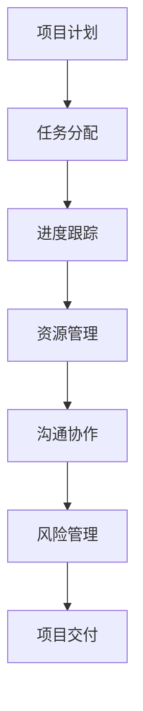

                 

# 项目管理工具：小团队高效协作的必备利器

> **关键词**：项目管理，团队协作，工具，敏捷开发，敏捷方法，Scrum，看板，Kanban，任务管理，进度跟踪，JIRA，Trello，Asana

> **摘要**：本文旨在探讨项目管理工具在小型团队中的重要性，以及如何通过这些工具实现高效协作和项目成功。我们将详细介绍几种流行的项目管理工具，分析其核心功能和使用场景，并通过实际案例进行讲解，帮助读者理解和选择最适合自己团队的项目管理工具。

## 1. 背景介绍

### 1.1 目的和范围

本文的主要目的是为小型团队的项目经理或团队成员提供关于项目管理工具的深入理解。我们将探讨以下几个核心问题：

- 项目管理工具的定义和重要性
- 常见的项目管理工具及其核心功能
- 项目管理工具在敏捷开发中的应用
- 实际案例中的项目管理工具使用情况

通过本文的阅读，读者将能够：

- 了解项目管理工具的基本概念和作用
- 选择适合自己团队的项目管理工具
- 利用项目管理工具提升团队协作效率和项目成功率

### 1.2 预期读者

本文的预期读者包括：

- 小型团队的项目经理或团队成员
- 对项目管理感兴趣的技术人员
- 刚入门项目管理的新手
- 对敏捷开发和敏捷方法有所了解但希望深入了解其应用场景的读者

### 1.3 文档结构概述

本文分为以下几个部分：

- 引言：介绍项目管理工具的基本概念和重要性
- 核心概念与联系：介绍项目管理工具的核心概念和关联流程
- 核心算法原理 & 具体操作步骤：讲解项目管理工具的核心算法和操作步骤
- 数学模型和公式 & 详细讲解 & 举例说明：介绍项目管理工具的数学模型和具体应用
- 项目实战：通过实际案例展示项目管理工具的应用
- 实际应用场景：分析项目管理工具在不同场景中的应用
- 工具和资源推荐：推荐相关学习资源和开发工具
- 总结：总结项目管理工具的未来发展趋势和挑战
- 附录：提供常见问题与解答
- 扩展阅读 & 参考资料：提供相关扩展阅读和参考资料

### 1.4 术语表

#### 1.4.1 核心术语定义

- **项目管理工具**：用于帮助团队管理项目进度、资源分配、任务分配、沟通协作等的软件工具。
- **敏捷开发**：一种软件开发方法，强调快速迭代、持续交付、客户反馈和团队协作。
- **Scrum**：一种敏捷开发方法，强调迭代式开发、团队协作和客户价值。
- **Kanban**：一种敏捷方法，通过可视化看板管理任务流程，控制工作量和提高团队协作效率。

#### 1.4.2 相关概念解释

- **任务管理**：对项目中的任务进行分配、跟踪和监控，确保任务按时完成。
- **进度跟踪**：监控项目进度，确保项目按计划进行。
- **资源分配**：合理分配团队成员的工作量和资源，提高团队协作效率。

#### 1.4.3 缩略词列表

- **JIRA**：Atlassian开发的一款流行的项目管理工具。
- **Trello**：一款基于Kanban方法的任务管理工具。
- **Asana**：一款功能强大的项目管理工具，支持多种协作方式。

## 2. 核心概念与联系

### 2.1 项目管理工具的基本概念

项目管理工具是一类专门为团队管理项目而设计的软件。它们可以帮助团队进行任务分配、进度跟踪、资源管理、沟通协作等，从而提高团队的工作效率和项目的成功率。

### 2.2 项目管理工具的关联流程

项目管理工具通常与以下流程相关联：

1. **项目计划**：制定项目目标、任务、时间表和资源需求。
2. **任务分配**：将任务分配给团队成员，并设置任务的优先级和截止日期。
3. **进度跟踪**：监控任务进度，确保项目按计划进行。
4. **资源管理**：合理分配团队资源，提高资源利用率。
5. **沟通协作**：提供沟通渠道，确保团队成员之间的信息共享和协作。
6. **风险管理**：识别和应对项目中的潜在风险。

### 2.3 项目管理工具的核心功能

项目管理工具的核心功能包括：

1. **任务管理**：包括任务的创建、分配、跟踪和监控。
2. **进度跟踪**：通过甘特图、看板等可视化方式展示项目进度。
3. **资源管理**：监控团队成员的工作量、资源需求和资源利用率。
4. **沟通协作**：提供即时通讯、邮件通知、文档共享等功能，促进团队协作。
5. **报表和统计**：生成项目报表、统计图表，帮助团队了解项目状态和进展。

### 2.4 项目管理工具的Mermaid流程图

下面是项目管理工具的核心流程图，使用Mermaid语言描述：



## 3. 核心算法原理 & 具体操作步骤

### 3.1 核心算法原理

项目管理工具的核心算法通常包括以下几种：

1. **任务分配算法**：根据团队成员的工作量、技能和优先级，自动分配任务。
2. **进度跟踪算法**：基于任务的完成情况，自动计算项目进度。
3. **资源管理算法**：根据项目需求和团队成员的工作量，自动调整资源分配。
4. **风险管理算法**：根据风险的概率和影响，自动评估和排序风险。

### 3.2 具体操作步骤

下面以JIRA为例，介绍项目管理工具的具体操作步骤：

1. **项目计划**：

    - 创建项目：在JIRA中创建一个新的项目，输入项目名称、描述和相关信息。
    - 创建迭代：为项目创建迭代（Sprint），设置迭代周期和截止日期。

2. **任务分配**：

    - 创建任务：在迭代中创建任务，输入任务名称、描述、优先级和截止日期。
    - 分配任务：将任务分配给相应的团队成员，并设置任务的依赖关系。

3. **进度跟踪**：

    - 甘特图：使用甘特图查看任务进度，了解项目整体进展。
    - 看板：使用看板查看任务状态，了解任务的具体进展和团队协作情况。

4. **资源管理**：

    - 查看工作量：查看团队成员的工作量，了解资源分配情况。
    - 调整资源：根据项目需求和工作量，调整团队成员的分配和任务安排。

5. **沟通协作**：

    - 即时通讯：使用JIRA的内置即时通讯工具，与团队成员实时沟通。
    - 邮件通知：设置邮件通知，确保团队成员及时了解项目动态。
    - 文档共享：上传项目文档，方便团队成员共享和协作。

6. **风险管理**：

    - 风险识别：识别项目中的潜在风险，并记录在JIRA中。
    - 风险评估：评估风险的概率和影响，并制定相应的应对措施。
    - 风险监控：定期监控风险状态，确保项目安全进行。

## 4. 数学模型和公式 & 详细讲解 & 举例说明

### 4.1 数学模型和公式

项目管理工具中常用的数学模型和公式包括：

1. **工作量的计算**：工作量（Workload）= 努力程度（Effort）× 时间（Time）
2. **进度的计算**：进度（Progress）= 已完成任务数 ÷ 计划完成任务数
3. **资源利用率的计算**：资源利用率（Utilization Rate）= 实际使用时间 ÷ 可用时间

### 4.2 详细讲解和举例说明

#### 4.2.1 工作量的计算

工作量的计算公式为：工作量 = 努力程度 × 时间。其中，努力程度表示团队成员完成任务的投入程度，时间表示完成任务所需的时间。

**举例说明**：

假设一个任务需要2天的努力程度来完成，那么：

- 如果实际只用了1天时间，则工作量 = 1天 × 2 = 2人天
- 如果实际用了3天时间，则工作量 = 3天 × 2 = 6人天

#### 4.2.2 进度的计算

进度的计算公式为：进度 = 已完成任务数 ÷ 计划完成任务数。进度表示项目实际进展情况，取值范围为0到1。

**举例说明**：

假设一个项目计划完成10个任务，实际已经完成了5个任务，那么：

- 进度 = 5 ÷ 10 = 0.5，表示项目进度为50%

#### 4.2.3 资源利用率的计算

资源利用率的计算公式为：资源利用率 = 实际使用时间 ÷ 可用时间。资源利用率表示团队成员的工作时间占其可用时间的比例。

**举例说明**：

假设一个团队成员的可用时间为8小时，实际工作时间为6小时，那么：

- 资源利用率 = 6小时 ÷ 8小时 = 0.75，表示该团队成员的工作时间为可用时间的75%

## 5. 项目实战：代码实际案例和详细解释说明

### 5.1 开发环境搭建

在开始项目实战之前，我们需要搭建一个合适的项目开发环境。以下是一个简单的开发环境搭建步骤：

1. 安装JDK 1.8或更高版本
2. 安装Eclipse IDE
3. 安装Git
4. 安装Maven
5. 创建一个新的Maven项目

### 5.2 源代码详细实现和代码解读

以下是一个简单的项目管理工具实现案例，我们将使用Java语言和Maven进行项目构建。代码如下：

```java
// ProjectManagementTool.java
public class ProjectManagementTool {
    private List<Task> tasks;
    private Map<String, TeamMember> teamMembers;

    public ProjectManagementTool() {
        tasks = new ArrayList<>();
        teamMembers = new HashMap<>();
    }

    public void addTask(String taskId, String taskName, String description, int effort, int time) {
        Task task = new Task(taskId, taskName, description, effort, time);
        tasks.add(task);
    }

    public void assignTask(String taskId, String teamMemberId) {
        Task task = findTaskById(taskId);
        if (task != null) {
            task.setAssignedTo(teamMemberId);
        }
    }

    public void trackProgress() {
        for (Task task : tasks) {
            System.out.println("Task ID: " + task.getId());
            System.out.println("Task Name: " + task.getName());
            System.out.println("Assigned To: " + task.getAssignedTo());
            System.out.println("Effort: " + task.getEffort());
            System.out.println("Time: " + task.getTime());
            System.out.println("Progress: " + task.getProgress());
        }
    }

    private Task findTaskById(String taskId) {
        for (Task task : tasks) {
            if (task.getId().equals(taskId)) {
                return task;
            }
        }
        return null;
    }
}

// Task.java
public class Task {
    private String id;
    private String name;
    private String description;
    private int effort;
    private int time;
    private String assignedTo;

    public Task(String id, String name, String description, int effort, int time) {
        this.id = id;
        this.name = name;
        this.description = description;
        this.effort = effort;
        this.time = time;
        this.assignedTo = "";
    }

    public String getId() {
        return id;
    }

    public String getName() {
        return name;
    }

    public String getDescription() {
        return description;
    }

    public int getEffort() {
        return effort;
    }

    public int getTime() {
        return time;
    }

    public String getAssignedTo() {
        return assignedTo;
    }

    public void setAssignedTo(String assignedTo) {
        this.assignedTo = assignedTo;
    }

    public double getProgress() {
        if (assignedTo.isEmpty()) {
            return 0.0;
        }
        return (double) effort / time;
    }
}
```

代码解读：

- **ProjectManagementTool类**：该类用于表示项目管理工具，包含任务列表和团队成员列表。它提供了一系列方法来添加任务、分配任务和跟踪进度。
- **Task类**：该类用于表示任务，包含任务的ID、名称、描述、努力程度、时间和分配情况。它还提供了一些方法来获取任务信息和计算进度。

### 5.3 代码解读与分析

在这个简单的项目管理工具实现中，我们使用了两个类：`ProjectManagementTool` 和 `Task`。下面是对这两个类的详细解读：

1. **ProjectManagementTool类**：

    - **addTask方法**：用于添加任务。它创建一个新的`Task`对象，并将其添加到任务列表中。
    - **assignTask方法**：用于将任务分配给团队成员。它根据任务ID找到相应的任务，并将其分配给指定的团队成员。
    - **trackProgress方法**：用于跟踪任务进度。它遍历任务列表，并打印每个任务的详细信息，包括任务ID、名称、分配情况和进度。

2. **Task类**：

    - **构造方法**：用于创建一个新的`Task`对象。它初始化任务的ID、名称、描述、努力程度和时间为0。
    - **getId、getName、getDescription、getEffort、getTime和getAssignedTo方法**：用于获取任务的详细信息。
    - **setAssignedTo方法**：用于设置任务的分配情况。
    - **getProgress方法**：用于计算任务的进度。如果任务未被分配，则进度为0；否则，进度为努力程度除以时间。

通过这个简单的实现，我们可以看到项目管理工具的核心功能是如何通过类和方法来实现的。在实际应用中，我们可以根据需求进一步扩展这个实现，增加更多的功能和功能。

## 6. 实际应用场景

### 6.1 敏捷开发团队

敏捷开发团队通常需要高效的项目管理工具来支持其快速迭代和持续交付的实践。项目管理工具可以帮助敏捷团队更好地管理任务、跟踪进度、协调团队成员和客户沟通。以下是一些实际应用场景：

- **任务分配**：敏捷团队可以使用项目管理工具将任务分配给团队成员，确保每个人都知道自己的任务和职责。
- **进度跟踪**：通过项目管理工具，团队可以实时监控任务的进度，及时调整计划，确保项目按时完成。
- **看板管理**：使用项目管理工具的看板功能，团队可以可视化地展示任务的流程，提高团队协作效率和任务交付速度。
- **风险管理**：敏捷团队可以利用项目管理工具识别和应对项目中的风险，确保项目顺利进行。

### 6.2 企业项目团队

企业项目团队通常涉及多个部门、跨地域协作，项目管理工具在此类团队中发挥着关键作用。以下是一些实际应用场景：

- **资源管理**：项目管理工具可以帮助企业项目团队合理分配资源，避免资源浪费，提高资源利用率。
- **任务协调**：通过项目管理工具，团队可以协调各个部门的工作任务，确保项目按时完成。
- **进度监控**：企业项目团队可以使用项目管理工具监控项目进度，及时发现和解决问题，确保项目按时交付。
- **沟通协作**：项目管理工具提供了多种沟通渠道，如即时通讯、邮件通知、文档共享等，有助于团队之间的高效协作。

### 6.3 创业团队

创业团队通常资源有限，需要高效的项目管理工具来支持快速迭代和快速响应市场变化。以下是一些实际应用场景：

- **敏捷迭代**：创业团队可以使用项目管理工具快速迭代产品，及时响应客户反馈，提高产品竞争力。
- **任务分配**：项目管理工具可以帮助创业团队明确任务分配，确保团队成员专注于关键任务，提高工作效率。
- **进度跟踪**：通过项目管理工具，创业团队可以实时监控项目进度，确保项目按时交付。
- **沟通协作**：创业团队可以利用项目管理工具的沟通协作功能，提高团队内部和跨部门的沟通效率，加快项目进展。

### 6.4 远程团队

远程团队通常分布在不同的地理位置，项目管理工具在此类团队中起着至关重要的作用。以下是一些实际应用场景：

- **远程协作**：项目管理工具可以帮助远程团队成员实时协作，提高团队工作效率。
- **任务分配**：通过项目管理工具，远程团队成员可以远程分配任务，确保每个人都知道自己的任务和职责。
- **进度监控**：项目管理工具可以帮助远程团队实时监控任务进度，确保项目按时交付。
- **文档共享**：项目管理工具提供了文档共享功能，方便远程团队成员共享和协作文档。

## 7. 工具和资源推荐

### 7.1 学习资源推荐

#### 7.1.1 书籍推荐

- **《敏捷开发实践指南》**：介绍了敏捷开发的核心原则和实践，适合初学者和有经验的敏捷团队。
- **《项目管理知识体系指南》**：提供了项目管理的基本理论和实践方法，是项目管理者的必备参考书。
- **《Scrum敏捷实践指南》**：详细介绍了Scrum敏捷开发方法，包括Scrum流程、角色和工具。

#### 7.1.2 在线课程

- **Coursera上的《敏捷方法与团队协作》**：提供了关于敏捷开发和团队协作的基础知识，适合初学者。
- **Udemy上的《项目管理：从入门到精通》**：涵盖了项目管理的基本概念、工具和技术，适合不同水平的学习者。

#### 7.1.3 技术博客和网站

- **Atlassian官方博客**：提供了关于JIRA、Confluence等项目管理工具的最新动态和最佳实践。
- **Scrum联盟网站**：提供了关于Scrum敏捷开发方法的最新资源和案例研究。

### 7.2 开发工具框架推荐

#### 7.2.1 IDE和编辑器

- **Eclipse**：一款功能强大的集成开发环境，支持多种编程语言。
- **Visual Studio Code**：一款轻量级且高度可扩展的代码编辑器，适合编写各种类型的代码。

#### 7.2.2 调试和性能分析工具

- **JMeter**：一款开源的性能测试工具，用于模拟大量用户访问并测试系统性能。
- **GDB**：一款强大的调试工具，用于调试C/C++程序。

#### 7.2.3 相关框架和库

- **Spring Boot**：一款流行的Java框架，用于快速开发独立的、生产级的Spring应用。
- **React**：一款用于构建用户界面的JavaScript库，适合开发动态和交互式的Web应用。

### 7.3 相关论文著作推荐

#### 7.3.1 经典论文

- **《敏捷软件开发宣言》**：介绍了敏捷开发的核心理念和原则。
- **《项目管理知识体系指南》**：提供了项目管理的基本理论和实践方法。

#### 7.3.2 最新研究成果

- **《基于人工智能的项目管理方法研究》**：探讨了人工智能在项目管理中的应用。
- **《敏捷开发实践与案例分析》**：分析了敏捷开发在不同行业和领域的应用案例。

#### 7.3.3 应用案例分析

- **《如何在项目中成功应用敏捷开发》**：分享了敏捷开发在实际项目中的应用经验和教训。
- **《Scrum实践指南》**：提供了详细的Scrum实践方法和最佳实践。

## 8. 总结：未来发展趋势与挑战

### 8.1 未来发展趋势

随着技术的不断进步，项目管理工具在未来将呈现出以下几个发展趋势：

1. **智能化**：人工智能和机器学习技术将被广泛应用于项目管理工具，实现智能任务分配、进度预测和风险识别等功能。
2. **移动化**：随着移动设备的普及，项目管理工具将更加注重移动端体验，提供便捷的移动应用，支持团队成员随时随地访问和管理项目。
3. **集成化**：项目管理工具将与各种其他系统（如CRM、ERP等）实现深度集成，实现数据共享和流程协同。
4. **个性化**：项目管理工具将更加注重个性化需求，根据不同团队和项目的特点，提供定制化的解决方案。

### 8.2 面临的挑战

尽管项目管理工具具有巨大的发展潜力，但其在未来也将面临一些挑战：

1. **数据隐私和安全**：随着数据量的大幅增加，项目管理工具如何确保数据隐私和安全成为一大挑战。
2. **跨平台兼容性**：项目管理工具需要在各种操作系统和设备上保持良好的兼容性，以适应不同团队的需求。
3. **用户体验**：如何提供直观、易用的界面和功能，提高用户体验，是项目管理工具面临的重要挑战。
4. **持续迭代与更新**：项目管理工具需要不断迭代和更新，以适应快速变化的市场和技术环境，保持竞争力。

## 9. 附录：常见问题与解答

### 9.1 项目管理工具如何选择？

选择项目管理工具时，应考虑以下几个因素：

1. **团队规模和需求**：小型团队可以选择功能简单、易于使用的工具，如Trello或Asana；大型团队则需要选择功能强大、支持协作的工具，如JIRA或Microsoft Project。
2. **预算和成本**：根据团队的预算和成本选择合适的工具，有些工具提供免费版本，但功能有限，有些则需要付费。
3. **集成和兼容性**：选择能够与现有系统和工具集成的项目管理工具，以提高工作效率和数据共享。
4. **用户体验**：选择界面友好、操作简便的工具，以提高团队成员的使用体验。

### 9.2 项目管理工具能否提高项目成功率？

是的，合理选择和运用项目管理工具可以显著提高项目成功率。项目管理工具可以帮助团队更好地规划项目、分配任务、监控进度、协调资源和处理风险，从而提高项目的执行力、透明度和协作效率。此外，项目管理工具还可以提供丰富的数据和分析，帮助团队做出更明智的决策。

### 9.3 项目管理工具是否适用于所有项目？

项目管理工具并非适用于所有项目，但它们适用于大多数项目类型。对于小型项目或个人项目，简单的任务管理工具（如Trello）可能已经足够；对于复杂的项目或大型团队项目，则需要功能更强大的项目管理工具（如JIRA或Microsoft Project）。选择适合自己项目的工具，是提高项目成功的关键。

## 10. 扩展阅读 & 参考资料

为了更深入地了解项目管理工具和敏捷开发方法，以下是一些扩展阅读和参考资料：

### 10.1 书籍

- 《敏捷方法与团队协作》：详细介绍了敏捷开发的核心原则和实践。
- 《项目管理知识体系指南》：提供了项目管理的基本理论和实践方法。
- 《Scrum敏捷实践指南》：详细介绍了Scrum敏捷开发方法。

### 10.2 技术博客和网站

- Atlassian官方博客：提供关于JIRA、Confluence等项目管理工具的最新动态和最佳实践。
- Scrum联盟网站：提供关于Scrum敏捷开发方法的最新资源和案例研究。

### 10.3 论文和研究成果

- 《基于人工智能的项目管理方法研究》：探讨了人工智能在项目管理中的应用。
- 《敏捷开发实践与案例分析》：分析了敏捷开发在不同行业和领域的应用案例。

### 10.4 在线课程

- Coursera上的《敏捷方法与团队协作》：提供了关于敏捷开发和团队协作的基础知识。
- Udemy上的《项目管理：从入门到精通》：涵盖了项目管理的基本概念、工具和技术。

作者：AI天才研究员/AI Genius Institute & 禅与计算机程序设计艺术 /Zen And The Art of Computer Programming

