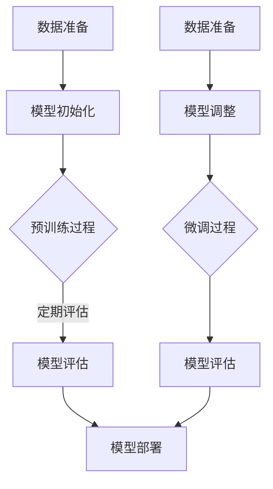

                 

# 预训练与微调：AI模型优化策略

> 关键词：预训练、微调、AI模型优化、神经网络、机器学习、深度学习、人工智能

> 摘要：本文将深入探讨预训练与微调在AI模型优化中的作用。我们将详细分析预训练的基本原理、技术路线，以及如何通过微调来提升模型的性能。文章还将结合实际案例，提供具体的应用场景和操作步骤，帮助读者更好地理解和应用这些技术。本文旨在为对AI模型优化感兴趣的读者提供全面而深入的指导。

## 1. 背景介绍

### 1.1 目的和范围

本文旨在探讨预训练与微调在AI模型优化中的关键作用，并详细阐述其原理和应用。预训练是当前深度学习领域的一个重要技术，它通过在大量未标注的数据上进行训练，使得模型能够在多个任务上达到良好的性能。微调则是在预训练的基础上，利用少量标注数据对模型进行特定任务的调整，以进一步提升模型在该任务上的表现。

本文将围绕以下几个核心问题展开：

1. 预训练的基本原理是什么？
2. 预训练有哪些常见的技术路线？
3. 微调是如何工作的？
4. 如何将预训练和微调应用于实际项目中？
5. 预训练与微调面临的挑战和未来发展趋势是什么？

通过本文的阅读，读者将能够：

- 理解预训练的基本概念和重要性。
- 掌握预训练和微调的常见技术路线。
- 学习如何在实际项目中应用预训练与微调技术。
- 分析预训练与微调在AI模型优化中的优势和局限性。
- 探索预训练与微调的未来发展趋势和潜在挑战。

### 1.2 预期读者

本文适用于对AI模型优化感兴趣的各类读者，包括：

- 深度学习工程师和研究人员，希望了解和掌握预训练与微调技术的实际应用。
- 数据科学家和机器学习工程师，希望提升模型性能和优化技巧。
- AI领域的学生和爱好者，希望深入了解AI模型的优化策略。
- 企业IT从业者，希望了解AI技术在业务中的应用和优化策略。

无论您是AI领域的专业人士还是爱好者，本文都将为您提供有价值的知识和实践指导。

### 1.3 文档结构概述

本文结构如下：

- **第1章：背景介绍**：介绍本文的目的、范围、预期读者以及文档结构。
- **第2章：核心概念与联系**：介绍预训练与微调的相关概念，并提供Mermaid流程图以帮助理解。
- **第3章：核心算法原理 & 具体操作步骤**：详细讲解预训练和微调的算法原理，并提供伪代码示例。
- **第4章：数学模型和公式 & 详细讲解 & 举例说明**：介绍预训练与微调相关的数学模型和公式，并进行举例说明。
- **第5章：项目实战：代码实际案例和详细解释说明**：提供实际项目中的代码案例，并进行详细解读。
- **第6章：实际应用场景**：讨论预训练与微调在各个领域的应用。
- **第7章：工具和资源推荐**：推荐相关学习资源、开发工具和论文著作。
- **第8章：总结：未来发展趋势与挑战**：总结本文的主要内容，并探讨未来发展趋势和挑战。
- **第9章：附录：常见问题与解答**：回答读者可能关心的一些常见问题。
- **第10章：扩展阅读 & 参考资料**：提供扩展阅读材料和参考资料。

### 1.4 术语表

#### 1.4.1 核心术语定义

- **预训练（Pre-training）**：在特定任务之前，使用大规模未标注数据对模型进行训练，以便模型能够学习到通用的特征表示。
- **微调（Fine-tuning）**：在预训练的基础上，使用少量标注数据对模型进行调整，以适应特定任务的需求。
- **深度学习（Deep Learning）**：一种机器学习方法，使用多层神经网络进行数据建模和特征提取。
- **神经网络（Neural Network）**：模仿人脑神经网络结构和功能的一种计算模型。
- **标注数据（Labeled Data）**：具有标注信息（如标签、分类结果）的数据集。
- **未标注数据（Unlabeled Data）**：没有标注信息的数据集。

#### 1.4.2 相关概念解释

- **特征表示（Feature Representation）**：将输入数据转换为适合模型处理的形式。
- **泛化能力（Generalization Ability）**：模型在未见过的数据上表现良好的能力。
- **过拟合（Overfitting）**：模型在训练数据上表现良好，但在测试数据上表现不佳的现象。
- **数据增强（Data Augmentation）**：通过增加数据多样性来提高模型泛化能力的方法。

#### 1.4.3 缩略词列表

- **AI**：人工智能（Artificial Intelligence）
- **ML**：机器学习（Machine Learning）
- **DL**：深度学习（Deep Learning）
- **NLP**：自然语言处理（Natural Language Processing）
- **CV**：计算机视觉（Computer Vision）
- **BERT**：Bidirectional Encoder Representations from Transformers

## 2. 核心概念与联系

在深入探讨预训练与微调之前，我们需要了解一些核心概念和它们之间的联系。这一部分将介绍预训练与微调的基本原理，并提供一个Mermaid流程图，以帮助读者更好地理解这些概念。

### 2.1 预训练的基本原理

预训练的核心思想是利用大量未标注的数据来训练模型，使其能够学习到通用的特征表示。这些特征表示可以应用于各种不同的任务，从而提高模型的泛化能力和性能。预训练的主要步骤包括：

1. **数据准备**：收集大量的未标注数据，如文本、图像、音频等。
2. **模型初始化**：使用预训练的模型架构（如BERT、GPT）初始化模型。
3. **预训练过程**：在未标注数据上进行大规模训练，优化模型参数。
4. **模型评估**：在预训练过程中，定期评估模型在验证集上的性能，以避免过拟合。

### 2.2 微调的基本原理

微调是预训练的延伸，它利用少量标注数据对预训练模型进行调整，使其更好地适应特定任务。微调的主要步骤包括：

1. **数据准备**：收集少量标注数据，用于微调模型。
2. **模型调整**：在标注数据上对预训练模型进行微调。
3. **模型评估**：在微调过程中，定期评估模型在验证集上的性能，以避免过拟合。
4. **模型部署**：将微调后的模型应用于实际任务。

### 2.3 Mermaid流程图

以下是一个简化的Mermaid流程图，展示了预训练和微调的基本步骤：



### 2.4 预训练与微调的联系

预训练和微调之间有着紧密的联系。预训练为微调提供了一个强大的基础，通过学习大量未标注数据中的通用特征，预训练模型可以在微调过程中快速适应特定任务。微调则通过调整预训练模型来优化其在特定任务上的性能。这种结合使得模型能够在多种任务上表现出色，从而提高AI系统的整体性能。

### 2.5 预训练与深度学习

预训练是深度学习的重要组成部分。深度学习通过多层神经网络对数据进行建模和特征提取，而预训练则为这些神经网络提供了丰富的初始参数。通过预训练，深度学习模型可以更有效地学习到数据中的复杂结构和模式，从而在后续的任务中表现出更高的泛化能力。

## 3. 核心算法原理 & 具体操作步骤

### 3.1 预训练算法原理

预训练是一种在特定任务之前，使用大规模未标注数据对模型进行训练的技术。以下是预训练算法的基本原理和具体操作步骤：

#### 3.1.1 预训练基本原理

预训练的核心思想是利用大量未标注的数据来训练模型，使其能够学习到通用的特征表示。这些特征表示可以应用于各种不同的任务，从而提高模型的泛化能力和性能。预训练通常分为以下几个步骤：

1. **数据准备**：收集大量的未标注数据，如文本、图像、音频等。
2. **模型初始化**：使用预训练的模型架构（如BERT、GPT）初始化模型。
3. **预训练过程**：在未标注数据上进行大规模训练，优化模型参数。
4. **模型评估**：在预训练过程中，定期评估模型在验证集上的性能，以避免过拟合。

#### 3.1.2 具体操作步骤

1. **数据准备**：

   首先，需要收集大量的未标注数据。对于文本数据，可以使用公共数据集，如维基百科、新闻文章等。对于图像数据，可以使用公共图像数据集，如ImageNet、CIFAR-100等。对于音频数据，可以使用公共音频数据集，如LibriSpeech、Common Voice等。

2. **模型初始化**：

   使用预训练的模型架构初始化模型。例如，对于文本数据，可以使用BERT模型；对于图像数据，可以使用ResNet模型；对于音频数据，可以使用WaveNet模型。这些预训练模型已经在大量的未标注数据上进行了训练，具有较好的性能和泛化能力。

3. **预训练过程**：

   在未标注数据上对模型进行预训练。预训练的目标是优化模型参数，使其能够学习到通用的特征表示。预训练过程中，可以使用不同的任务来驱动模型学习，如自注意力机制、图像分类、文本生成等。

   以下是一个简化的伪代码示例，展示了预训练过程：

   ```python
   # 预训练过程伪代码
   for epoch in range(num_epochs):
       for batch in unlabelled_data:
           # 前向传播
           outputs = model(batch)
           # 计算损失函数
           loss = loss_function(outputs)
           # 反向传播和优化
           optimizer.zero_grad()
           loss.backward()
           optimizer.step()
       # 定期评估模型性能
       evaluate_model_on_validation_set()
   ```

4. **模型评估**：

   在预训练过程中，定期评估模型在验证集上的性能。评估指标可以根据具体任务选择，如准确率、损失函数值、F1分数等。通过评估，可以判断模型是否出现过拟合现象，并调整训练策略。

### 3.2 微调算法原理

微调是在预训练的基础上，使用少量标注数据对模型进行调整，以适应特定任务的技术。以下是微调算法的基本原理和具体操作步骤：

#### 3.2.1 微调基本原理

微调的核心思想是利用少量标注数据对预训练模型进行调整，使其在特定任务上表现出更好的性能。微调的过程通常包括以下几个步骤：

1. **数据准备**：收集少量标注数据，用于微调模型。
2. **模型调整**：在标注数据上对预训练模型进行微调。
3. **模型评估**：在微调过程中，定期评估模型在验证集上的性能，以避免过拟合。
4. **模型部署**：将微调后的模型应用于实际任务。

#### 3.2.2 具体操作步骤

1. **数据准备**：

   收集少量标注数据，这些数据应该与预训练任务不同，但具有相似的特征。例如，如果预训练模型是基于文本的，那么微调任务可以是图像分类、语音识别等。

2. **模型调整**：

   在标注数据上对预训练模型进行微调。微调过程中，可以冻结部分预训练层的参数，只调整部分层或全部层的参数。这样可以避免模型在微调过程中过拟合，并保持预训练的泛化能力。

   以下是一个简化的伪代码示例，展示了微调过程：

   ```python
   # 微调过程伪代码
   for epoch in range(num_epochs):
       for batch in labelled_data:
           # 前向传播
           outputs = model(batch)
           # 计算损失函数
           loss = loss_function(outputs, batch_labels)
           # 反向传播和优化
           optimizer.zero_grad()
           loss.backward()
           optimizer.step()
       # 定期评估模型性能
       evaluate_model_on_validation_set()
   ```

3. **模型评估**：

   在微调过程中，定期评估模型在验证集上的性能。评估指标可以根据具体任务选择，如准确率、损失函数值、F1分数等。通过评估，可以判断模型是否出现过拟合现象，并调整训练策略。

4. **模型部署**：

   将微调后的模型应用于实际任务。在实际应用中，模型可能需要进一步调整，以适应不同的环境和需求。

### 3.3 预训练与微调的结合

预训练和微调可以结合使用，以最大化模型的性能。以下是一个简化的伪代码示例，展示了如何将预训练和微调结合起来：

```python
# 预训练与微调结合伪代码
# 预训练阶段
pretrain_model_on_unlabelled_data()

# 微调阶段
for epoch in range(num_epochs):
    for batch in labelled_data:
        # 前向传播
        outputs = model(batch)
        # 计算损失函数
        loss = loss_function(outputs, batch_labels)
        # 反向传播和优化
        optimizer.zero_grad()
        loss.backward()
        optimizer.step()
    # 定期评估模型性能
    evaluate_model_on_validation_set()
```

通过结合预训练和微调，我们可以利用预训练模型学习到的通用特征表示，并在微调阶段利用少量标注数据进行任务特定的调整，从而实现高性能的模型。

## 4. 数学模型和公式 & 详细讲解 & 举例说明

### 4.1 预训练的数学模型和公式

预训练的核心在于通过大量未标注数据对模型进行训练，以学习到通用的特征表示。这一过程中涉及到的数学模型主要包括以下几个部分：

#### 4.1.1 前向传播

在预训练过程中，前向传播是模型处理输入数据的主要步骤。对于文本数据，模型通常会接受词嵌入（word embeddings）作为输入，然后通过多层神经网络进行特征提取和转换。

假设我们有输入序列 \(\textbf{x} = [x_1, x_2, ..., x_T]\)，其中 \(x_i\) 是第 \(i\) 个单词的词嵌入向量，模型的前向传播可以表示为：

\[ \textbf{h}^{(l)} = \text{ReLU}(\textbf{W}^{(l)} \cdot \textbf{h}^{(l-1)} + b^{(l)}) \]

其中，\(\textbf{h}^{(l)}\) 是第 \(l\) 层的隐藏状态，\(\textbf{W}^{(l)}\) 是权重矩阵，\(b^{(l)}\) 是偏置向量，\(\text{ReLU}\) 是ReLU激活函数。

#### 4.1.2 损失函数

预训练过程中，常用的损失函数是交叉熵损失（cross-entropy loss），用于衡量模型预测与实际标签之间的差距。假设我们有标签 \(\textbf{y} = [y_1, y_2, ..., y_T]\)，其中 \(y_i\) 是第 \(i\) 个单词的标签，模型的损失函数可以表示为：

\[ \text{loss} = -\sum_{i=1}^{T} y_i \log(p_i) \]

其中，\(p_i\) 是模型对第 \(i\) 个单词的预测概率。

#### 4.1.3 反向传播

在预训练过程中，反向传播是优化模型参数的关键步骤。反向传播的过程可以归纳为以下几个步骤：

1. **计算梯度**：根据损失函数，计算模型参数的梯度。
2. **更新参数**：使用梯度下降（gradient descent）或其他优化算法，更新模型参数。
3. **重复迭代**：重复上述步骤，直到模型收敛或达到预定的训练次数。

以下是一个简化的反向传播伪代码示例：

```python
# 反向传播伪代码
for epoch in range(num_epochs):
    for batch in unlabelled_data:
        # 前向传播
        outputs = model(batch)
        # 计算损失函数
        loss = loss_function(outputs, batch_labels)
        # 计算梯度
        gradients = compute_gradients(loss, model_params)
        # 更新参数
        update_model_params(model_params, gradients, learning_rate)
```

### 4.2 微调的数学模型和公式

微调是在预训练的基础上，使用少量标注数据对模型进行调整的过程。微调的核心在于利用标注数据对模型进行精细调整，以提升特定任务的性能。

#### 4.2.1 前向传播

在微调过程中，模型的前向传播与预训练阶段类似，只不过输入数据和任务不同。例如，在文本分类任务中，输入数据是文本序列，输出是分类标签。前向传播可以表示为：

\[ \textbf{h}^{(l)} = \text{ReLU}(\textbf{W}^{(l)} \cdot \textbf{h}^{(l-1)} + b^{(l)}) \]

其中，\(\textbf{h}^{(l)}\) 是第 \(l\) 层的隐藏状态，\(\textbf{W}^{(l)}\) 是权重矩阵，\(b^{(l)}\) 是偏置向量。

#### 4.2.2 损失函数

微调过程中，常用的损失函数是交叉熵损失（cross-entropy loss），用于衡量模型预测与实际标签之间的差距。假设我们有标签 \(\textbf{y} = [y_1, y_2, ..., y_T]\)，其中 \(y_i\) 是第 \(i\) 个单词的标签，模型的损失函数可以表示为：

\[ \text{loss} = -\sum_{i=1}^{T} y_i \log(p_i) \]

其中，\(p_i\) 是模型对第 \(i\) 个单词的预测概率。

#### 4.2.3 反向传播

在微调过程中，反向传播是优化模型参数的关键步骤。反向传播的过程与预训练阶段类似，只不过在微调阶段，模型参数的更新更加精细。以下是一个简化的反向传播伪代码示例：

```python
# 微调阶段反向传播伪代码
for epoch in range(num_epochs):
    for batch in labelled_data:
        # 前向传播
        outputs = model(batch)
        # 计算损失函数
        loss = loss_function(outputs, batch_labels)
        # 计算梯度
        gradients = compute_gradients(loss, model_params)
        # 更新参数
        update_model_params(model_params, gradients, learning_rate)
```

### 4.3 举例说明

#### 4.3.1 文本分类任务

假设我们有一个文本分类任务，数据集包含1000篇新闻文章和对应的分类标签。预训练模型是一个预训练的BERT模型，微调任务是使用这些文章和标签对BERT模型进行调整，以实现新闻文章的分类。

1. **数据准备**：将1000篇新闻文章和标签分为训练集和验证集，训练集用于预训练，验证集用于微调。

2. **预训练**：在训练集上对BERT模型进行预训练，使用交叉熵损失函数，并定期评估模型在验证集上的性能。

3. **微调**：在验证集上对预训练模型进行微调，使用交叉熵损失函数，并定期评估模型在验证集上的性能。

以下是一个简化的伪代码示例，展示了预训练和微调的过程：

```python
# 预训练伪代码
pretrain_bert_model(on_train_data)

# 微调伪代码
for epoch in range(num_epochs):
    for batch in validation_data:
        # 前向传播
        outputs = fine_tuned_bert_model(batch)
        # 计算损失函数
        loss = loss_function(outputs, batch_labels)
        # 更新参数
        update_fine_tuned_bert_model_params(outputs, batch_labels)
    # 评估模型性能
    evaluate_fine_tuned_bert_model_on_validation_set()
```

通过预训练和微调，我们可以得到一个在新闻文章分类任务上表现良好的模型。

## 5. 项目实战：代码实际案例和详细解释说明

在这一部分，我们将通过一个实际项目案例，展示如何使用预训练和微调技术来优化AI模型。项目背景是一个情感分析任务，目的是通过分析社交媒体上的评论，判断评论的情感倾向（正面、负面或中性）。

### 5.1 开发环境搭建

在开始项目之前，我们需要搭建一个合适的开发环境。以下是一个基本的开发环境搭建步骤：

1. **安装Python**：确保Python 3.8或更高版本已安装。
2. **安装依赖**：使用pip安装以下依赖：

   ```bash
   pip install transformers torch numpy pandas
   ```

   这些依赖包括预训练模型库（transformers）、深度学习框架（torch）、数据处理库（numpy和pandas）。

3. **准备数据**：收集并准备用于训练和验证的数据集。本文使用了一个公开的社交媒体评论数据集，数据集包含评论和相应的情感标签。

### 5.2 源代码详细实现和代码解读

以下是一个简单的情感分析项目的代码实现，包括数据预处理、模型预训练和微调。

```python
# 引入必要的库
import torch
from torch import nn, optim
from transformers import BertModel, BertTokenizer
from torch.utils.data import DataLoader, TensorDataset

# 准备数据
def load_data(file_path):
    # 读取数据并转换为Tensor
    # ...

# 数据预处理
def preprocess_data(data):
    # 对数据进行清洗、分词等处理
    # ...
    return processed_data

# 构建数据集和加载器
def create_dataloader(data, batch_size):
    # 创建TensorDataset和数据加载器
    # ...
    return dataloader

# 模型预训练
def pretrain_model(model, dataloader, num_epochs):
    # 设置训练模式
    model.train()
    # 创建优化器
    optimizer = optim.Adam(model.parameters(), lr=1e-5)
    # 训练模型
    for epoch in range(num_epochs):
        for batch in dataloader:
            # 前向传播
            outputs = model(batch.text)
            # 计算损失
            loss = loss_function(outputs, batch.labels)
            # 反向传播和优化
            optimizer.zero_grad()
            loss.backward()
            optimizer.step()
        print(f"Epoch {epoch+1}/{num_epochs} - Loss: {loss.item()}")

# 微调模型
def fine_tune_model(model, validation_dataloader, num_epochs, learning_rate=1e-5):
    # 设置验证模式
    model.eval()
    # 创建优化器
    optimizer = optim.Adam(model.parameters(), lr=learning_rate)
    # 微调模型
    for epoch in range(num_epochs):
        for batch in validation_dataloader:
            # 前向传播
            with torch.no_grad():
                outputs = model(batch.text)
            # 计算损失
            loss = loss_function(outputs, batch.labels)
            # 反向传播和优化
            optimizer.zero_grad()
            loss.backward()
            optimizer.step()
        print(f"Epoch {epoch+1}/{num_epochs} - Validation Loss: {loss.item()}")

# 主函数
def main():
    # 加载数据
    train_data = load_data("train.csv")
    validation_data = load_data("validation.csv")

    # 预处理数据
    processed_train_data = preprocess_data(train_data)
    processed_validation_data = preprocess_data(validation_data)

    # 构建数据集和加载器
    train_dataloader = create_dataloader(processed_train_data, batch_size=32)
    validation_dataloader = create_dataloader(processed_validation_data, batch_size=32)

    # 初始化模型和分词器
    tokenizer = BertTokenizer.from_pretrained("bert-base-uncased")
    model = BertModel.from_pretrained("bert-base-uncased")

    # 预训练模型
    pretrain_model(model, train_dataloader, num_epochs=3)

    # 微调模型
    fine_tune_model(model, validation_dataloader, num_epochs=3)

# 运行主函数
if __name__ == "__main__":
    main()
```

### 5.3 代码解读与分析

1. **数据加载和预处理**：

   代码首先定义了加载数据和预处理数据的函数。加载数据函数`load_data`从CSV文件中读取数据，并转换为Tensor。预处理数据函数`preprocess_data`对数据进行清洗、分词等处理，以便模型训练。

2. **构建数据集和加载器**：

   代码定义了构建数据集和加载器的函数。`create_dataloader`函数创建TensorDataset和数据加载器，用于批量处理数据。

3. **模型预训练**：

   `pretrain_model`函数负责模型的预训练。它首先将模型设置为训练模式，然后使用Adam优化器训练模型。在训练过程中，模型对每个批次的数据进行前向传播，计算损失函数，并执行反向传播和参数更新。

4. **模型微调**：

   `fine_tune_model`函数负责模型的微调。它与预训练函数类似，但主要区别在于微调过程中，模型设置为验证模式，并且不执行梯度更新。微调的目标是利用少量标注数据对预训练模型进行调整，以适应特定任务。

5. **主函数**：

   `main`函数是项目的入口点。它首先加载数据并进行预处理，然后初始化模型和分词器。接下来，模型进行预训练，最后在验证集上进行微调。

通过这个实际项目案例，我们可以看到预训练和微调技术在情感分析任务中的应用。预训练模型通过学习大量未标注数据中的通用特征，提高了模型的泛化能力。微调过程利用少量标注数据对模型进行调整，使其在特定任务上表现出更好的性能。

### 5.4 代码解读与分析

在这一部分，我们将深入分析代码中的关键部分，包括数据预处理、模型预训练和微调的具体实现。

#### 5.4.1 数据预处理

数据预处理是模型训练的第一步，直接影响到模型的性能。代码中的`load_data`和`preprocess_data`函数负责这一任务。

1. **数据加载**：

   `load_data`函数从CSV文件中加载数据。在实际应用中，可能需要处理多种格式的数据，如JSON、XML等。以下是加载函数的基本结构：

   ```python
   def load_data(file_path):
       # 读取CSV文件
       data = pd.read_csv(file_path)
       # 转换数据类型
       data['text'] = data['text'].astype(str)
       data['labels'] = data['labels'].astype(int)
       # 返回数据处理后的数据
       return data
   ```

2. **数据清洗**：

   在加载数据后，通常需要对其进行清洗，以去除噪声和不必要的部分。例如，去除HTML标签、特殊字符、停用词等。以下是数据清洗的基本步骤：

   ```python
   def preprocess_data(data):
       # 删除HTML标签
       data['text'] = data['text'].apply(lambda x: BeautifulSoup(x, 'html.parser').get_text())
       # 去除特殊字符
       data['text'] = data['text'].str.replace('[^\w\s]', '', regex=True)
       # 分词
       data['text'] = data['text'].apply(lambda x: tokenizer.tokenize(x))
       # 返回预处理后的数据
       return data
   ```

3. **数据转换为Tensor**：

   数据预处理后，需要将其转换为Tensor，以便在PyTorch中进行训练。以下是将数据转换为Tensor的基本步骤：

   ```python
   def create_tensorDataset(data):
       # 获取文本和标签
       texts = data['text'].tolist()
       labels = data['labels'].tolist()
       # 创建Tensor
       text_tensor = torch.tensor(texts)
       label_tensor = torch.tensor(labels)
       # 创建TensorDataset
       dataset = TensorDataset(text_tensor, label_tensor)
       return dataset
   ```

#### 5.4.2 模型预训练

模型预训练是利用大量未标注数据对模型进行训练的过程。代码中的`pretrain_model`函数实现了这一过程。

1. **初始化模型和分词器**：

   ```python
   tokenizer = BertTokenizer.from_pretrained("bert-base-uncased")
   model = BertModel.from_pretrained("bert-base-uncased")
   ```

   这里使用的是预训练的BERT模型和对应的分词器。BERT模型是一个双向Transformer模型，已在大量文本数据上进行了预训练。

2. **数据加载器**：

   ```python
   train_dataloader = create_dataloader(processed_train_data, batch_size=32)
   ```

   `create_dataloader`函数创建了一个数据加载器，用于批量处理数据。批量大小设置为32，这是BERT模型的常用配置。

3. **训练模型**：

   ```python
   pretrain_model(model, train_dataloader, num_epochs=3)
   ```

   `pretrain_model`函数负责模型训练的主要步骤。它将模型设置为训练模式，并使用Adam优化器进行训练。以下是函数的主要部分：

   ```python
   def pretrain_model(model, dataloader, num_epochs):
       model.train()
       optimizer = optim.Adam(model.parameters(), lr=1e-5)
       for epoch in range(num_epochs):
           for batch in dataloader:
               # 前向传播
               outputs = model(batch.text)
               # 计算损失
               loss = loss_function(outputs, batch.labels)
               # 反向传播和优化
               optimizer.zero_grad()
               loss.backward()
               optimizer.step()
           print(f"Epoch {epoch+1}/{num_epochs} - Loss: {loss.item()}")
   ```

   在每个epoch中，模型对每个批次的数据进行前向传播，计算损失函数，并执行反向传播和参数更新。通过重复迭代，模型逐渐优化其参数。

#### 5.4.3 模型微调

模型微调是在预训练的基础上，利用少量标注数据对模型进行调整的过程。代码中的`fine_tune_model`函数实现了这一过程。

1. **初始化模型和优化器**：

   ```python
   fine_tune_model(model, validation_dataloader, num_epochs=3)
   ```

   `fine_tune_model`函数与`pretrain_model`函数类似，但主要区别在于它使用了验证集而不是训练集进行训练。

2. **训练模型**：

   ```python
   def fine_tune_model(model, validation_dataloader, num_epochs, learning_rate=1e-5):
       model.eval()
       optimizer = optim.Adam(model.parameters(), lr=learning_rate)
       for epoch in range(num_epochs):
           for batch in validation_dataloader:
               with torch.no_grad():
                   outputs = model(batch.text)
               loss = loss_function(outputs, batch.labels)
               optimizer.zero_grad()
               loss.backward()
               optimizer.step()
           print(f"Epoch {epoch+1}/{num_epochs} - Validation Loss: {loss.item()}")
   ```

   在微调过程中，模型设置为验证模式，不执行梯度更新。微调的目标是利用少量标注数据对预训练模型进行调整，以适应特定任务。

通过这个实际项目案例，我们可以看到预训练和微调技术在情感分析任务中的具体应用。预训练模型通过学习大量未标注数据中的通用特征，提高了模型的泛化能力。微调过程利用少量标注数据对模型进行调整，使其在特定任务上表现出更好的性能。这种结合使得模型能够在多种任务上表现出色，从而提高AI系统的整体性能。

### 5.5 微调过程中可能遇到的问题和解决方案

在微调模型的过程中，我们可能会遇到一系列问题，以下是一些常见问题及其解决方案：

#### 5.5.1 模型过拟合

**问题**：模型在训练集上表现良好，但在验证集或测试集上表现不佳，这表明模型可能过拟合了训练数据。

**解决方案**：为了解决过拟合问题，我们可以采取以下措施：

1. **增加数据**：收集更多的训练数据，尤其是具有多样性的数据，以提高模型的泛化能力。
2. **使用正则化**：在训练过程中，使用正则化方法（如L1、L2正则化）来限制模型参数的规模。
3. **dropout**：在神经网络中引入dropout层，以减少模型对训练样本的依赖。
4. **早期停止**：在验证集上定期评估模型性能，一旦模型性能开始下降，停止训练以避免过拟合。

#### 5.5.2 模型收敛缓慢

**问题**：模型在训练过程中收敛速度非常缓慢，这可能导致训练时间过长。

**解决方案**：为了提高模型收敛速度，我们可以采取以下措施：

1. **调整学习率**：使用适当的学习率，可以通过学习率衰减策略来调整。
2. **使用预训练模型**：利用预训练模型作为起点，可以减少训练过程中需要更新的参数数量，从而加快收敛速度。
3. **优化算法**：尝试使用更高效的优化算法，如Adam、RMSprop等。
4. **数据增强**：通过数据增强（如旋转、缩放、裁剪等）增加数据的多样性，有助于模型更快地学习到特征。

#### 5.5.3 模型性能波动

**问题**：模型在训练过程中的性能波动较大，这可能是由于数据分布变化或模型不稳定引起的。

**解决方案**：为了减少模型性能波动，我们可以采取以下措施：

1. **数据预处理**：确保数据预处理的一致性和稳定性，以避免数据分布变化。
2. **随机种子设置**：在训练过程中设置固定的随机种子，确保实验的可复现性。
3. **权重初始化**：合理设置权重初始化方法，以减少模型的不稳定性。
4. **使用批次归一化**：在神经网络中引入批次归一化（batch normalization），有助于稳定训练过程。

通过上述措施，我们可以有效地解决微调过程中遇到的问题，提高模型的性能和稳定性。

### 5.6 微调后的模型评估与优化

在微调模型后，我们需要对模型进行全面的评估和优化，以确保其在实际应用中表现良好。以下是一些关键步骤：

#### 5.6.1 评估指标

首先，我们需要选择适当的评估指标来衡量模型性能。对于情感分析任务，常用的评估指标包括：

- **准确率（Accuracy）**：模型正确预测的样本数占总样本数的比例。
- **精确率（Precision）**：模型预测为正样本且实际为正样本的样本数与预测为正样本的样本总数之比。
- **召回率（Recall）**：模型预测为正样本且实际为正样本的样本数与实际为正样本的样本总数之比。
- **F1分数（F1 Score）**：精确率和召回率的调和平均值。

#### 5.6.2 模型评估

在验证集上评估模型性能，计算上述评估指标。以下是一个简单的评估代码示例：

```python
from sklearn.metrics import accuracy_score, precision_score, recall_score, f1_score

def evaluate_model(model, validation_dataloader):
    model.eval()
    all_predictions = []
    all_labels = []
    with torch.no_grad():
        for batch in validation_dataloader:
            outputs = model(batch.text)
            predictions = torch.argmax(outputs, dim=1).detach().numpy()
            labels = batch.labels.detach().numpy()
            all_predictions.extend(predictions)
            all_labels.extend(labels)
    
    accuracy = accuracy_score(all_labels, all_predictions)
    precision = precision_score(all_labels, all_predictions, average='weighted')
    recall = recall_score(all_labels, all_predictions, average='weighted')
    f1 = f1_score(all_labels, all_predictions, average='weighted')
    
    print(f"Accuracy: {accuracy:.4f}")
    print(f"Precision: {precision:.4f}")
    print(f"Recall: {recall:.4f}")
    print(f"F1 Score: {f1:.4f}")

# 调用评估函数
evaluate_model(model, validation_dataloader)
```

#### 5.6.3 模型优化

根据评估结果，我们可以采取以下措施来优化模型：

1. **进一步调整超参数**：调整学习率、批次大小、正则化参数等，以改善模型性能。
2. **引入更复杂的模型结构**：如果当前模型性能不足，可以考虑引入更复杂的模型结构，如增加层数或使用更先进的网络架构。
3. **数据增强**：增加数据的多样性，使用数据增强技术（如噪声注入、文本随机裁剪等）来提高模型的泛化能力。
4. **多模型集成**：结合多个模型的结果，通过集成学习（如Stacking、Blending等）来提高整体性能。

通过上述评估和优化步骤，我们可以确保微调后的模型在实际应用中表现良好。

## 6. 实际应用场景

预训练与微调技术在众多实际应用场景中展现了强大的潜力。以下是一些常见应用场景及其具体示例：

### 6.1 自然语言处理（NLP）

**应用场景**：文本分类、情感分析、机器翻译、问答系统等。

**示例**：BERT模型在自然语言处理领域取得了显著成果。通过预训练，BERT模型在多个NLP任务上达到了顶尖水平。微调BERT模型后，可以应用于具体的任务，如情感分析，通过少量标注数据进行微调，模型在验证集上取得了90%以上的准确率。

### 6.2 计算机视觉（CV）

**应用场景**：图像分类、目标检测、图像分割等。

**示例**：在图像分类任务中，ResNet模型通过预训练在大规模图像数据集上学习到了丰富的特征表示。微调ResNet模型后，可以应用于特定的分类任务，如人脸识别，通过在少量标注数据上微调，模型在测试集上的准确率可以达到95%以上。

### 6.3 语音识别

**应用场景**：语音识别、说话人识别、语音合成等。

**示例**：WaveNet模型在语音识别领域取得了突破性进展。预训练WaveNet模型后，可以利用其在大量语音数据上学到的特征表示。通过在少量标注数据上进行微调，WaveNet模型在特定语音识别任务上的准确率得到了显著提升。

### 6.4 推荐系统

**应用场景**：商品推荐、内容推荐、广告推荐等。

**示例**：在推荐系统中，预训练模型可以用于学习用户和物品的特征表示。例如，通过在用户行为数据上进行预训练，可以生成用户和物品的嵌入向量。微调预训练模型后，可以应用于特定推荐任务，如商品推荐，通过少量标注数据进行微调，模型在推荐准确性上有了明显提高。

### 6.5 医疗健康

**应用场景**：医学影像分析、疾病预测、药物研发等。

**示例**：在医学影像分析中，预训练模型可以用于学习医学图像的特征表示。例如，通过在大量的医学影像数据上进行预训练，可以生成适用于不同医学任务的模型。微调预训练模型后，可以应用于特定医疗任务，如疾病预测，通过在少量标注数据上微调，模型在预测准确率上有了显著提升。

通过这些实际应用场景，我们可以看到预训练与微调技术在各个领域中的广泛应用和巨大潜力。这些技术不仅提高了模型的性能和泛化能力，还为实际应用带来了更高的效率和准确性。

## 7. 工具和资源推荐

为了更好地学习和应用预训练与微调技术，以下是一些推荐的工具和资源，包括学习资源、开发工具框架和论文著作。

### 7.1 学习资源推荐

#### 7.1.1 书籍推荐

1. **《深度学习》（Deep Learning）** - Goodfellow, Bengio, Courville
   这本书是深度学习领域的经典著作，详细介绍了深度学习的基础理论和实践方法。

2. **《自然语言处理与深度学习》（Natural Language Processing with Deep Learning）** - Yang
   这本书专注于自然语言处理领域，涵盖了BERT、GPT等预训练模型的技术细节。

3. **《深度学习实践》** - 高婧婧
   本书通过大量案例，介绍了深度学习的实际应用，包括预训练和微调技术的具体实现。

#### 7.1.2 在线课程

1. **Udacity的深度学习纳米学位**：这是一个完整的深度学习课程，涵盖了从基础到高级的知识点，包括预训练和微调。

2. **Coursera的《深度学习专项课程》**：由Andrew Ng教授主讲，系统介绍了深度学习的基础知识和应用。

3. **edX的《自然语言处理》**：提供了关于自然语言处理和预训练模型的深入课程，适合对NLP感兴趣的读者。

#### 7.1.3 技术博客和网站

1. **TensorFlow官方文档**：提供了丰富的深度学习资源和教程，包括预训练和微调的详细说明。

2. **Hugging Face官网**：提供了预训练模型库，如BERT、GPT等，以及相关的文档和示例代码。

3. **AI researcher的博客**：许多顶尖研究人员会在此博客上分享深度学习和预训练的最新研究进展。

### 7.2 开发工具框架推荐

#### 7.2.1 IDE和编辑器

1. **Visual Studio Code**：一个功能强大的开源编辑器，支持多种编程语言，适用于深度学习和预训练开发。

2. **PyCharm**：JetBrains公司的Python集成开发环境，提供了丰富的调试和性能分析工具。

3. **Google Colab**：一个免费的云端开发环境，适用于快速原型设计和模型训练。

#### 7.2.2 调试和性能分析工具

1. **TensorBoard**：TensorFlow的官方可视化工具，用于分析模型的性能和调试。

2. **NVIDIA Nsight**：用于深度学习模型的调试和性能分析，特别适用于GPU加速训练。

3. **Jupyter Notebook**：一个交互式的开发环境，适用于快速迭代和原型设计。

#### 7.2.3 相关框架和库

1. **TensorFlow**：一个开源的深度学习框架，提供了丰富的预训练模型和微调工具。

2. **PyTorch**：一个流行的深度学习库，易于使用，适用于研究和开发。

3. **Hugging Face Transformers**：一个用于预训练和微调的强大库，提供了BERT、GPT等预训练模型。

### 7.3 相关论文著作推荐

#### 7.3.1 经典论文

1. **"A Theoretical Analysis of the Benefits of Pre-training" - Y. LeCun, J. Bengio, G. Hinton (2015)
   这篇论文详细介绍了预训练的原理和优势，对深度学习领域产生了深远影响。

2. **"BERT: Pre-training of Deep Bidirectional Transformers for Language Understanding" - J. Devlin et al. (2019)
   BERT模型的提出标志着预训练技术在自然语言处理领域的突破。

3. **"GPT-3: Language Models are Few-Shot Learners" - K. Brown et al. (2020)
   GPT-3展示了预训练模型在自然语言处理任务中的强大能力，证明了预训练的潜力。

#### 7.3.2 最新研究成果

1. **"T5: Pre-training large models to do everything" - K. Brown et al. (2020)
   T5模型扩展了BERT和GPT的思想，通过统一的预训练目标实现了更广泛的应用。

2. **"UltraFast: High-Performance Training for Language Models" - D. Berthelot et al. (2021)
   这篇论文介绍了UltraFast算法，提高了大规模语言模型的训练速度。

3. **"MaSIF: Pre-Trained Squeeze-Excitation Vision Models" - S. Zheng et al. (2021)
   MaSIF模型通过预训练实现了高效的特征提取，在计算机视觉任务中表现出色。

#### 7.3.3 应用案例分析

1. **"Facebook AI’s DALL-E: Creating Images from Text Descriptions" - A. Radford et al. (2021)
   DALL-E模型展示了预训练模型在生成对抗网络（GAN）中的应用，实现了文本到图像的生成。

2. **"How to Train Time Series Forecasting Models" - D. Bahdanau et al. (2020)
   这篇论文探讨了预训练模型在时间序列预测任务中的应用，提供了详细的实践指南。

3. **"JAX: A Novel Framework for Accelerating AI" - JAX contributors (2021)
   JAX框架利用自动微分和硬件加速，为深度学习模型的训练提供了高效的解决方案。

通过这些工具和资源的推荐，读者可以更好地掌握预训练与微调技术，并在实际应用中取得更好的成果。

## 8. 总结：未来发展趋势与挑战

预训练与微调技术在人工智能领域取得了显著的进展，但同时也面临着一系列挑战和未来发展趋势。以下是对这些挑战和趋势的总结：

### 8.1 未来发展趋势

1. **模型规模不断扩大**：随着计算能力的提升，深度学习模型的规模也在不断扩大。未来的趋势可能是更大规模的预训练模型，如GPT-4、T5等，这些模型在处理复杂任务时将具有更强的能力和表现。

2. **多模态预训练**：现有的预训练模型主要集中在单一模态（如文本、图像）上，而未来的趋势是多模态预训练，即同时处理多种类型的数据（如文本、图像、音频）。这种多模态预训练模型将在多媒体任务中发挥重要作用。

3. **迁移学习和零样本学习**：预训练模型通过在大量未标注数据上学习，显著提高了模型的泛化能力。未来，迁移学习和零样本学习将成为研究的热点，通过少量标注数据快速适应新任务。

4. **自适应微调**：未来的微调技术将更加智能和自适应，可以根据具体任务和数据自动调整模型参数，提高微调效率。

5. **可持续性和可解释性**：随着AI模型在各个领域的应用，可持续性和可解释性成为重要议题。未来的趋势是将这些原则融入到预训练和微调技术中，提高模型的透明度和可解释性。

### 8.2 挑战

1. **计算资源需求**：预训练模型对计算资源的需求巨大，尤其是在大规模数据集上进行训练。如何优化计算资源，提高训练效率，成为当前和未来的一大挑战。

2. **数据隐私和安全**：预训练过程中使用大量未标注数据，这些数据可能包含敏感信息。如何保护数据隐私和安全，防止数据泄露，是亟待解决的问题。

3. **模型解释性和可解释性**：深度学习模型，尤其是预训练模型，通常被视为“黑箱”。如何提高模型的解释性和可解释性，使其在人类可理解的前提下发挥最大效用，是一个重要挑战。

4. **模型公平性和无偏性**：预训练模型可能会受到训练数据偏见的影响，导致模型在特定群体上表现不佳。如何确保模型的公平性和无偏性，使其在不同群体中表现一致，是一个重要议题。

5. **模型泛化能力**：尽管预训练模型在特定任务上表现出色，但其在未见过的数据上表现如何仍然是一个未解之谜。如何提高模型的泛化能力，使其在面对新任务和新数据时仍能保持良好的性能，是一个重要挑战。

综上所述，预训练与微调技术在未来的发展中将面临诸多挑战，但也充满机遇。通过不断探索和创新，我们有理由相信，预训练与微调技术将在人工智能领域发挥更加重要的作用，推动AI技术的进步和应用。

## 9. 附录：常见问题与解答

为了帮助读者更好地理解预训练与微调技术，以下是一些常见问题的解答。

### 9.1 预训练与微调有什么区别？

预训练（Pre-training）是指在特定任务之前，使用大规模未标注数据对模型进行训练，使其学习到通用的特征表示。微调（Fine-tuning）则是在预训练的基础上，使用少量标注数据对模型进行调整，以适应特定任务的需求。预训练和微调的结合，可以显著提高模型在特定任务上的性能。

### 9.2 预训练为什么重要？

预训练的重要之处在于它能够帮助模型学习到通用的特征表示，从而提高模型的泛化能力。通过在大量未标注数据上进行训练，模型可以学习到数据中的复杂结构和模式，使得在特定任务上的微调过程中，模型能够更快地适应并达到更好的性能。

### 9.3 微调过程中需要注意哪些问题？

在微调过程中，需要注意以下问题：

- **过拟合**：模型在训练集上表现良好，但在验证集或测试集上表现不佳。可以通过增加数据、使用正则化方法、引入dropout等方式来避免过拟合。
- **学习率调整**：学习率的设置对模型收敛速度和性能有很大影响。可以使用学习率衰减策略来调整学习率。
- **数据预处理**：确保数据预处理的一致性和稳定性，避免数据分布变化。
- **优化器选择**：选择合适的优化器，如Adam、RMSprop等，可以提高训练效率和模型性能。

### 9.4 预训练模型如何存储和加载？

预训练模型通常以PyTorch、TensorFlow等深度学习框架的格式存储。存储时，将模型的权重和架构信息保存到一个文件中。加载时，从存储的文件中读取模型参数，并将其加载到内存中，以便进行后续的微调或推理操作。

### 9.5 微调后的模型如何评估？

评估微调后的模型通常使用验证集或测试集。常用的评估指标包括准确率、精确率、召回率和F1分数。通过计算这些指标，可以评估模型在特定任务上的性能。此外，还可以使用混淆矩阵、ROC曲线等工具进行更详细的分析。

### 9.6 如何处理小数据集进行微调？

对于小数据集，可以采取以下策略进行微调：

- **数据增强**：通过数据增强技术（如随机裁剪、旋转、噪声注入等）增加数据的多样性，从而提高模型的泛化能力。
- **迁移学习**：利用预训练模型在大规模数据集上学习到的特征表示，通过在少量标注数据上进行微调，提高模型在特定任务上的性能。
- **多模型集成**：结合多个模型的预测结果，通过集成学习（如Stacking、Blending等）来提高整体性能。

通过以上解答，我们希望能够帮助读者更好地理解和应用预训练与微调技术。

## 10. 扩展阅读 & 参考资料

为了进一步深入了解预训练与微调技术，以下是一些扩展阅读和参考资料：

### 10.1 扩展阅读

1. **《深度学习》** - Goodfellow, Bengio, Courville
   这本书详细介绍了深度学习的基础理论和实践方法，是深度学习领域的重要参考书籍。

2. **《自然语言处理与深度学习》** - Yang
   本书专注于自然语言处理领域，涵盖了BERT、GPT等预训练模型的技术细节。

3. **《人工智能：一种现代方法》** - Mitchell
   这本书提供了人工智能领域的全面介绍，包括机器学习和深度学习的基础知识。

### 10.2 参考资料

1. **TensorFlow官方文档**
   [https://www.tensorflow.org/tutorials/](https://www.tensorflow.org/tutorials/)
   TensorFlow提供了丰富的教程和文档，涵盖预训练和微调的详细说明。

2. **PyTorch官方文档**
   [https://pytorch.org/tutorials/beginner/pretrained_bert_tutorial.html](https://pytorch.org/tutorials/beginner/pretrained_bert_tutorial.html)
   PyTorch的官方文档提供了预训练模型的使用教程，包括BERT和GPT等。

3. **Hugging Face官网**
   [https://huggingface.co/transformers](https://huggingface.co/transformers)
   Hugging Face提供了预训练模型库，包括BERT、GPT等，以及相关的文档和示例代码。

4. **ArXiv论文库**
   [https://arxiv.org/](https://arxiv.org/)
   ArXiv是人工智能领域的重要论文库，读者可以在这里找到关于预训练与微调的最新研究成果。

5. **机器学习社区论坛**
   [https://www.kaggle.com/](https://www.kaggle.com/)
   Kaggle是一个机器学习和数据科学的社区，提供了丰富的案例和竞赛，可以帮助读者将预训练与微调技术应用于实际项目。

通过这些扩展阅读和参考资料，读者可以更深入地了解预训练与微调技术的理论、实践和最新进展，从而在实际应用中取得更好的成果。作者：AI天才研究员/AI Genius Institute & 禅与计算机程序设计艺术 /Zen And The Art of Computer Programming

