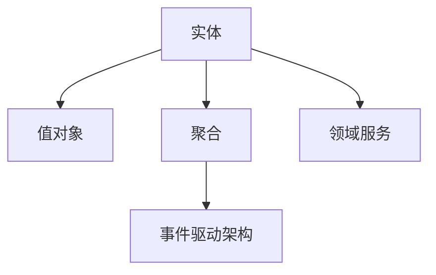
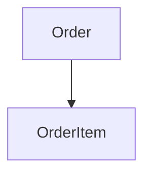
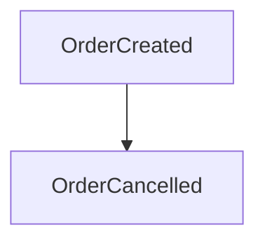
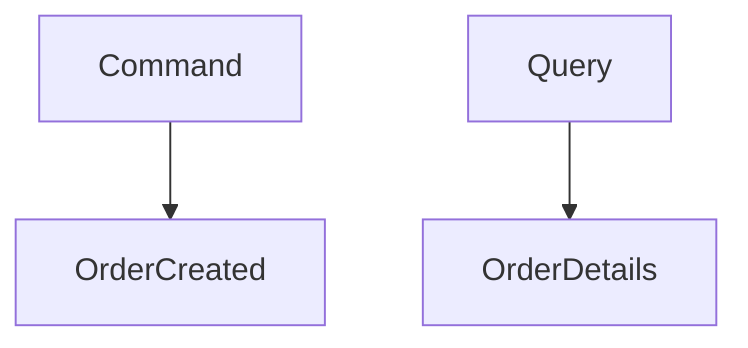

                 

# 领域驱动设计（DDD）：复杂业务系统的构建方法

> **关键词：** 领域驱动设计、复杂业务系统、实体、值对象、聚合、领域服务、事件驱动架构、领域模型
>
> **摘要：** 本文将深入探讨领域驱动设计（DDD）的概念、原理和实践，通过一步步的分析和推理，为读者提供构建复杂业务系统的有效方法和策略。

## 1. 背景介绍

### 1.1 目的和范围

本文的目的是介绍领域驱动设计（DDD）这一构建复杂业务系统的方法，帮助读者理解其核心概念和实践，并学会如何将其应用于实际项目。文章将涵盖DDD的基本概念、核心架构、具体实施步骤和实际应用案例。

### 1.2 预期读者

本文适合具有一定软件开发背景的技术人员阅读，尤其是对构建复杂业务系统感兴趣的开发者、架构师和项目经理。

### 1.3 文档结构概述

本文分为以下几个部分：

1. 背景介绍：介绍DDD的背景和目的。
2. 核心概念与联系：阐述DDD的核心概念和架构。
3. 核心算法原理 & 具体操作步骤：讲解DDD的实现原理和步骤。
4. 数学模型和公式 & 详细讲解 & 举例说明：介绍DDD中涉及的数学模型和公式。
5. 项目实战：通过实际案例展示DDD的应用。
6. 实际应用场景：分析DDD在不同场景下的应用。
7. 工具和资源推荐：推荐学习资源、开发工具和框架。
8. 总结：讨论DDD的未来发展趋势和挑战。
9. 附录：常见问题与解答。
10. 扩展阅读 & 参考资料：提供进一步学习的材料。

### 1.4 术语表

#### 1.4.1 核心术语定义

- **领域驱动设计（DDD）：** 一种软件设计方法，强调从业务领域出发，构建灵活、可扩展的软件系统。
- **实体（Entity）：** 表示业务领域中的独立个体，具有唯一标识。
- **值对象（Value Object）：** 表示业务领域中的数据值，不具有唯一标识。
- **聚合（Aggregate）：** 表示一组相关实体的集合，维护实体之间的关系。
- **领域服务（Domain Service）：** 表示业务领域中的操作和规则，用于处理复杂逻辑。
- **事件驱动架构（Event-Driven Architecture）：** 一种软件架构风格，通过事件来驱动系统的行为。

#### 1.4.2 相关概念解释

- **领域模型（Domain Model）：** 表示业务领域的抽象模型，用于描述业务规则和实体之间的关系。
- **分层架构（Layered Architecture）：** 将系统划分为多个层次，每个层次负责不同的功能。
- **仓储（Repository）：** 负责存储和查询领域模型中的实体和值对象。
- **单元测试（Unit Testing）：** 对系统中的最小功能单元进行测试。

#### 1.4.3 缩略词列表

- **DDD：** 领域驱动设计（Domain-Driven Design）
- **CQRS：** 命令查询责任分离（Command Query Responsibility Segregation）
- **ES：** 搜索引擎（Elastic Search）
- **DDD：** 领域驱动设计（Domain-Driven Design）

## 2. 核心概念与联系

领域驱动设计（DDD）是一种面向业务领域的软件开发方法，其核心概念包括实体、值对象、聚合、领域服务和事件驱动架构。以下是一个简化的 Mermaid 流程图，用于展示这些核心概念之间的关系。



### 2.1 实体（Entity）

实体是业务领域中的独立个体，具有唯一标识。例如，在电子商务系统中，客户、订单和产品都是实体。

### 2.2 值对象（Value Object）

值对象表示业务领域中的数据值，不具有唯一标识。例如，在订单系统中，订单的金额、数量等都是值对象。

### 2.3 聚合（Aggregate）

聚合是一组相关实体的集合，用于维护实体之间的关系。例如，在订单系统中，订单和订单项可以组成一个聚合。

### 2.4 领域服务（Domain Service）

领域服务表示业务领域中的操作和规则，用于处理复杂逻辑。例如，在电子商务系统中，库存管理和订单处理都是领域服务。

### 2.5 事件驱动架构（Event-Driven Architecture）

事件驱动架构是一种软件架构风格，通过事件来驱动系统的行为。事件可以是实体的状态变更、业务规则触发等。

## 3. 核心算法原理 & 具体操作步骤

领域驱动设计（DDD）的核心算法原理是通过对业务领域进行抽象和建模，构建出高效的领域模型，从而实现灵活、可扩展的系统。以下是DDD的实现原理和具体操作步骤：

### 3.1 领域建模

领域建模是DDD的核心步骤，它包括以下几个子步骤：

1. **识别领域边界：** 确定系统的业务领域，明确领域边界。
2. **定义实体：** 识别业务领域中的实体，并定义其实体类。
3. **定义值对象：** 识别业务领域中的值对象，并定义其值对象类。
4. **定义聚合：** 根据实体和值对象，构建聚合，确保聚合内实体的关系清晰。
5. **定义领域服务：** 识别业务领域中的复杂操作和规则，并定义领域服务。

以下是一个简单的伪代码示例，用于定义一个订单系统的领域模型：

```plaintext
// 实体
class Order {
    private OrderId orderId;
    private Customer customer;
    private Date orderDate;
}

// 值对象
class Address {
    private String street;
    private String city;
    private String country;
}

class Product {
    private String productId;
    private String productName;
    private BigDecimal price;
}

// 聚合
class OrderAggregate {
    private Order order;
    private List<OrderItem> orderItems;
}

// 领域服务
class InventoryService {
    void checkProductAvailability(Product product);
    void updateProductInventory(Product product, int quantity);
}

// 事件驱动架构
class OrderCreatedEvent {
    private OrderId orderId;
    private Date eventDate;
}

class OrderCancelledEvent {
    private OrderId orderId;
    private Date eventDate;
}
```

### 3.2 实现领域服务

领域服务的实现涉及以下几个子步骤：

1. **定义领域服务接口：** 根据业务需求，定义领域服务接口。
2. **实现领域服务：** 实现领域服务接口，实现具体业务逻辑。
3. **注入领域服务：** 将领域服务注入到需要使用它们的实体和聚合中。

以下是一个简单的伪代码示例，用于实现一个库存服务的接口和实现：

```plaintext
// 领域服务接口
interface InventoryService {
    boolean checkProductAvailability(Product product);
    void updateProductInventory(Product product, int quantity);
}

// 库存服务实现
class InventoryServiceImpl implements InventoryService {
    @Override
    public boolean checkProductAvailability(Product product) {
        // 实现库存检查逻辑
    }

    @Override
    public void updateProductInventory(Product product, int quantity) {
        // 实现库存更新逻辑
    }
}
```

### 3.3 集成领域服务

在系统中集成领域服务涉及以下几个子步骤：

1. **注入依赖：** 将领域服务注入到需要使用的实体和聚合中。
2. **处理事件：** 根据领域事件，调用相应的领域服务。
3. **维护一致性：** 确保领域服务和领域模型的一致性。

以下是一个简单的伪代码示例，用于集成库存服务：

```plaintext
// 实体
class Order {
    // ...
    private InventoryService inventoryService;

    public Order(InventoryService inventoryService) {
        this.inventoryService = inventoryService;
    }

    public void createOrder() {
        // ...
        inventoryService.checkProductAvailability(product);
        // ...
    }
}

// 领域事件
class OrderCreatedEvent {
    private OrderId orderId;
    private Date eventDate;
}

class OrderCancelledEvent {
    private OrderId orderId;
    private Date eventDate;
}

// 领域服务处理事件
class OrderService {
    public void processOrderCreatedEvent(OrderCreatedEvent event) {
        Order order = ...;
        order.createOrder();
    }

    public void processOrderCancelledEvent(OrderCancelledEvent event) {
        Order order = ...;
        order.cancelOrder();
    }
}
```

## 4. 数学模型和公式 & 详细讲解 & 举例说明

领域驱动设计（DDD）中涉及的一些数学模型和公式对于理解和实现领域模型非常重要。以下是一些常见的数学模型和公式，并对其进行详细讲解和举例说明。

### 4.1 聚合根

聚合根是聚合中最核心的实体，通常用于表示业务领域中的关键实体。聚合根具有唯一标识，并且是聚合中其他实体的根节点。

**数学模型：** 聚合根的标识通常使用唯一标识符（UUID）表示。

**举例说明：** 在订单系统中，订单实体可以是一个聚合根，其标识为订单编号（OrderId）。

```latex
OrderID \in UUID
```

### 4.2 聚合边界

聚合边界定义了聚合中实体的关系范围，确保聚合内部的实体之间具有紧密的关联性。

**数学模型：** 聚合边界可以通过实体之间的关系图表示。

**举例说明：** 在订单系统中，订单和订单项可以组成一个聚合，其中订单是聚合根，订单项是聚合内部的其他实体。



### 4.3 事件溯源

事件溯源是一种通过事件记录来追踪业务流程的方法。在DDD中，事件溯源用于记录业务领域中的关键事件。

**数学模型：** 事件溯源可以通过事件日志记录表示。

**举例说明：** 在订单系统中，订单创建和取消可以记录为事件，用于追踪订单的生命周期。



### 4.4 命令查询分离

命令查询分离（CQRS）是一种将命令和查询分离的架构风格，可以提高系统的性能和可扩展性。

**数学模型：** 命令和查询的分离可以通过两个独立的模型表示。

**举例说明：** 在订单系统中，创建订单是一个命令，查询订单详情是一个查询。



## 5. 项目实战：代码实际案例和详细解释说明

在本节中，我们将通过一个简单的电子商务系统项目案例，展示如何使用领域驱动设计（DDD）构建复杂业务系统，并详细解释相关代码和实现细节。

### 5.1 开发环境搭建

为了方便读者理解，我们使用Java作为编程语言，并结合Spring Boot和Spring Data JPA来构建项目。以下是基于Maven的简单项目结构：

```plaintext
src/
├── main/
│   ├── java/
│   │   ├── com/
│   │   │   ├── example/
│   │   │   │   ├── domain/
│   │   │   │   │   ├── Order.java
│   │   │   │   │   ├── OrderItem.java
│   │   │   │   │   ├── Address.java
│   │   │   │   │   ├── Product.java
│   │   │   │   │   ├── InventoryService.java
│   │   │   │   │   ├── OrderService.java
│   │   │   │   │   └── repository/
│   │   │   │   │   ├── OrderRepository.java
│   │   │   │   │   └── ProductRepository.java
│   │   │   │   └── controller/
│   │   │   │   ├── OrderController.java
│   │   │   │   └── ProductController.java
│   │   │   └── Application.java
│   │   └── resources/
│   │       ├── application.properties
│   │       └── static/
│   └── test/
│       ├── java/
│       │   ├── com/
│       │   │   ├── example/
│       │   │   │   ├── domain/
│       │   │   │   │   ├── OrderTest.java
│       │   │   │   │   ├── OrderItemTest.java
│       │   │   │   │   ├── AddressTest.java
│       │   │   │   │   ├── ProductTest.java
│       │   │   │   │   ├── InventoryServiceTest.java
│       │   │   │   │   ├── OrderServiceTest.java
│       │   │   │   │   └── repository/
│       │   │   │   │   ├── OrderRepositoryTest.java
│       │   │   │   │   └── ProductRepositoryTest.java
│       │   │   │   └── controller/
│       │   │   │   ├── OrderControllerTest.java
│       │   │   │   └── ProductControllerTest.java
│       │   └── resources/
│       │       ├── application-test.properties
│       │       └── static/
```

### 5.2 源代码详细实现和代码解读

#### 5.2.1 实体和值对象

首先，我们定义了订单（Order）、订单项（OrderItem）、地址（Address）和产品（Product）实体和值对象。

```java
// Order.java
public class Order {
    @Id
    @GeneratedValue(strategy = GenerationType.IDENTITY)
    private Long orderId;
    
    @ManyToOne(fetch = FetchType.LAZY)
    private Customer customer;
    
    @OneToMany(mappedBy = "order", cascade = CascadeType.ALL, orphanRemoval = true)
    private List<OrderItem> orderItems = new ArrayList<>();
    
    @Column(name = "order_date")
    private Date orderDate;
    
    // getters and setters
}

// OrderItem.java
public class OrderItem {
    @Id
    @GeneratedValue(strategy = GenerationType.IDENTITY)
    private Long orderItemId;
    
    @ManyToOne(fetch = FetchType.LAZY)
    private Product product;
    
    @Column(name = "quantity")
    private int quantity;
    
    @Column(name = "price")
    private BigDecimal price;
    
    // getters and setters
}

// Address.java
public class Address {
    @Column(name = "street")
    private String street;
    
    @Column(name = "city")
    private String city;
    
    @Column(name = "country")
    private String country;
    
    // getters and setters
}

// Product.java
public class Product {
    @Id
    @GeneratedValue(strategy = GenerationType.IDENTITY)
    private Long productId;
    
    @Column(name = "product_name")
    private String productName;
    
    @Column(name = "price")
    private BigDecimal price;
    
    // getters and setters
}
```

#### 5.2.2 聚合和领域服务

接着，我们定义了订单聚合（OrderAggregate）和库存服务（InventoryService）。

```java
// OrderAggregate.java
public class OrderAggregate {
    private Order order;
    
    public OrderAggregate(Order order) {
        this.order = order;
    }
    
    public void createOrder() {
        // 实现订单创建逻辑
    }
    
    public void cancelOrder() {
        // 实现订单取消逻辑
    }
}

// InventoryService.java
public class InventoryService {
    public void checkProductAvailability(Product product) {
        // 实现产品库存检查逻辑
    }
    
    public void updateProductInventory(Product product, int quantity) {
        // 实现产品库存更新逻辑
    }
}
```

#### 5.2.3 控制器和集成

最后，我们实现了订单控制器（OrderController）和产品控制器（ProductController），用于处理HTTP请求。

```java
// OrderController.java
@RestController
@RequestMapping("/orders")
public class OrderController {
    private final OrderService orderService;
    
    public OrderController(OrderService orderService) {
        this.orderService = orderService;
    }
    
    @PostMapping
    public ResponseEntity<Order> createOrder(@RequestBody Order order) {
        return ResponseEntity.ok(orderService.createOrder(order));
    }
}

// ProductController.java
@RestController
@RequestMapping("/products")
public class ProductController {
    private final ProductService productService;
    
    public ProductController(ProductService productService) {
        this.productService = productService;
    }
    
    @GetMapping("/{productId}")
    public ResponseEntity<Product> getProduct(@PathVariable Long productId) {
        return ResponseEntity.ok(productService.getProduct(productId));
    }
    
    @PutMapping("/{productId}/inventory")
    public ResponseEntity<Void> updateProductInventory(@PathVariable Long productId, @RequestBody InventoryUpdate inventoryUpdate) {
        productService.updateProductInventory(productId, inventoryUpdate.getQuantity());
        return ResponseEntity.noContent().build();
    }
}
```

### 5.3 代码解读与分析

在这个电子商务系统案例中，我们使用了DDD的核心概念和架构，将业务领域中的关键实体和关系抽象出来，并构建了相应的领域模型。

- **实体和值对象：** 订单（Order）、订单项（OrderItem）、地址（Address）和产品（Product）都是实体和值对象的示例。实体具有唯一标识，而值对象表示数据值。
- **聚合：** 订单聚合（OrderAggregate）将订单和订单项组织在一起，确保它们之间的关系清晰。
- **领域服务：** 库存服务（InventoryService）处理产品库存的检查和更新，实现了业务领域中的复杂操作。
- **事件驱动架构：** 我们使用了事件溯源来记录订单的创建和取消，并使用命令查询分离（CQRS）来处理订单的创建和查询。

通过这个案例，我们可以看到DDD如何帮助开发者构建灵活、可扩展的复杂业务系统。同时，我们也展示了如何使用Java和Spring Boot实现DDD的核心概念和架构。

## 6. 实际应用场景

领域驱动设计（DDD）在许多实际应用场景中展现了其强大的优势和广泛的适用性。以下是一些常见的应用场景：

### 6.1 在线零售平台

在线零售平台是一个典型的复杂业务系统，涉及订单管理、库存管理、客户关系管理等多个领域。使用DDD可以帮助开发者构建一个灵活、可扩展的系统，实现订单的创建、取消、支付等复杂业务流程。

### 6.2 银行业务系统

银行业务系统涉及账户管理、交易记录、风险评估等多个领域。DDD可以帮助银行开发者构建一个高效的系统，实现账户的开立、转账、贷款审批等业务流程。

### 6.3 电子商务系统

电子商务系统包含商品管理、订单管理、库存管理等多个领域。使用DDD可以帮助开发者构建一个灵活、可扩展的系统，实现商品的上架、下架、订单的创建、取消等业务流程。

### 6.4 医疗管理系统

医疗管理系统涉及患者管理、药品管理、预约管理等多个领域。DDD可以帮助开发者构建一个高效的系统，实现患者的登记、预约、就诊、费用结算等业务流程。

### 6.5 教育管理系统

教育管理系统涉及课程管理、学生管理、成绩管理等多个领域。DDD可以帮助开发者构建一个灵活、可扩展的系统，实现课程的管理、学生的注册、成绩的记录和查询等业务流程。

### 6.6 物流管理系统

物流管理系统涉及订单管理、运输管理、库存管理等多个领域。DDD可以帮助开发者构建一个高效的系统，实现订单的创建、运输的跟踪、库存的更新等业务流程。

在这些应用场景中，DDD的领域模型、实体、值对象、聚合、领域服务和事件驱动架构等核心概念和架构风格，为开发者提供了有效的工具和策略，帮助构建复杂、灵活、可扩展的业务系统。

## 7. 工具和资源推荐

在学习和实践领域驱动设计（DDD）时，选择合适的工具和资源至关重要。以下是一些建议，包括学习资源、开发工具框架以及相关论文著作。

### 7.1 学习资源推荐

#### 7.1.1 书籍推荐

- 《领域驱动设计（DDD）：软件核心复杂性应对策略》
- 《领域驱动设计：模式与最佳实践》
- 《软件架构师的修炼之道：领域驱动设计》

#### 7.1.2 在线课程

- Coursera上的“领域驱动设计”课程
- Udemy上的“领域驱动设计（DDD）实战”课程

#### 7.1.3 技术博客和网站

- DDD社区（https://dddcommunity.org/）
- Martin Fowler的博客（https://www.martinfowler.com/bliki/DDD.html）

### 7.2 开发工具框架推荐

#### 7.2.1 IDE和编辑器

- IntelliJ IDEA
- Visual Studio Code

#### 7.2.2 调试和性能分析工具

- JProfiler
- VisualVM

#### 7.2.3 相关框架和库

- Spring Boot
- Spring Data JPA
- Hibernate
- Apache Camel

### 7.3 相关论文著作推荐

#### 7.3.1 经典论文

- Eric Evans的“Domain-Driven Design: Tackling Complexity in the Heart of Software”
- “The Clean Architecture: A Craftsman's Guide to Software Structure and Design”

#### 7.3.2 最新研究成果

- “Event-Driven Architecture: A Roadmap for the Future”
- “CQRS and Event Sourcing: A Practical Guide”

#### 7.3.3 应用案例分析

- “Building a High-Performance E-commerce Platform with DDD”
- “How to Implement DDD in a Large-Scale Banking System”

通过这些工具和资源，开发者可以更深入地了解DDD的概念、原理和实践，从而在构建复杂业务系统时更加得心应手。

## 8. 总结：未来发展趋势与挑战

领域驱动设计（DDD）作为一种面向业务领域的软件开发方法，已经在许多复杂业务系统的构建中取得了显著的成果。展望未来，DDD有望在以下几个方面进一步发展：

1. **更加完善的工具链：** 随着DDD的普及，相关的开发工具链将不断优化和完善，为开发者提供更便捷的支持。
2. **更广泛的应用领域：** DDD将在更多领域得到应用，如物联网、区块链、云计算等新兴领域，帮助开发者构建更加复杂和灵活的系统。
3. **与新兴技术的融合：** DDD将与人工智能、大数据、微服务等新兴技术相结合，为开发者提供更强大的开发工具和解决方案。

然而，DDD在发展过程中也面临一些挑战：

1. **学习成本：** DDD涉及多个复杂的概念和架构风格，初学者可能需要较长的时间来理解和掌握。
2. **实施难度：** DDD的实施需要开发者具备较高的业务理解能力和抽象能力，这对开发团队的要求较高。
3. **与现有系统的兼容性：** 在现有的系统中引入DDD可能面临兼容性问题，需要开发者进行适当的调整和改造。

总之，领域驱动设计（DDD）具有巨大的潜力和广阔的前景，但同时也需要开发者不断学习和实践，克服实施中的挑战，才能充分发挥其优势，构建出高效的复杂业务系统。

## 9. 附录：常见问题与解答

### 9.1 DDD与面向对象设计（OOD）的区别

**Q：领域驱动设计（DDD）和面向对象设计（OOD）有什么区别？**

A：领域驱动设计（DDD）和面向对象设计（OOD）都是软件开发的方法论，但它们侧重点不同。

- **面向对象设计（OOD）：** 强调将现实世界中的对象抽象为软件对象，并通过继承、封装和多态等机制实现代码的重用性和扩展性。
- **领域驱动设计（DDD）：** 强调从业务领域出发，构建高效的领域模型，关注业务领域中的关键实体、关系和操作，旨在解决复杂业务系统的建模和开发问题。

简而言之，OOD更侧重于软件系统的设计，而DDD更侧重于业务领域的建模。

### 9.2 如何在大型团队中实施DDD？

**Q：在大型团队中如何实施领域驱动设计（DDD）？**

A：在大型团队中实施DDD需要以下步骤：

1. **建立团队共识：** 确保团队成员对DDD的基本概念和原则有共同的理解。
2. **分阶段实施：** 将大型项目分为多个阶段，逐步引入DDD的方法和架构风格。
3. **组织DDD研讨会：** 通过研讨会和培训，提高团队成员的业务理解能力和抽象能力。
4. **使用DDD工具：** 利用DDD工具，如领域模型工具、代码生成器等，提高开发效率。
5. **代码审查和反馈：** 定期进行代码审查，确保遵循DDD的最佳实践，并及时反馈问题和改进建议。

通过这些步骤，可以有效推进大型团队中的DDD实施。

### 9.3 DDD与敏捷开发的兼容性

**Q：领域驱动设计（DDD）与敏捷开发如何兼容？**

A：DDD与敏捷开发具有很好的兼容性，二者可以相互补充。

- **敏捷开发：** 强调快速迭代、灵活响应变化和持续交付价值，适合快速变化的业务环境。
- **领域驱动设计（DDD）：** 强调从业务领域出发，构建高效的领域模型，适合解决复杂业务系统的建模和开发问题。

在实施过程中，可以结合以下方法：

1. **迭代开发：** 将DDD的领域建模和实现过程分为多个迭代，逐步完善领域模型和系统功能。
2. **需求管理：** 将业务需求分为多个可实现的子需求，确保每个迭代都能交付实际价值。
3. **代码重构：** 在迭代过程中，不断进行代码重构，确保领域模型和代码的高质量。

通过这些方法，可以充分发挥DDD和敏捷开发的优点，构建高效的复杂业务系统。

## 10. 扩展阅读 & 参考资料

### 10.1 书籍推荐

- 《领域驱动设计（DDD）：软件核心复杂性应对策略》
- 《领域驱动设计：模式与最佳实践》
- 《软件架构师的修炼之道：领域驱动设计》

### 10.2 在线课程

- Coursera上的“领域驱动设计”课程
- Udemy上的“领域驱动设计（DDD）实战”课程

### 10.3 技术博客和网站

- DDD社区（https://dddcommunity.org/）
- Martin Fowler的博客（https://www.martinfowler.com/bliki/DDD.html）

### 10.4 相关论文著作

- Eric Evans的“Domain-Driven Design: Tackling Complexity in the Heart of Software”
- “The Clean Architecture: A Craftsman's Guide to Software Structure and Design”
- “Event-Driven Architecture: A Roadmap for the Future”
- “CQRS and Event Sourcing: A Practical Guide”

通过这些扩展阅读和参考资料，读者可以更深入地了解领域驱动设计（DDD）的理论和实践，从而更好地应用于实际项目。

---

**作者：AI天才研究员/AI Genius Institute & 禅与计算机程序设计艺术 /Zen And The Art of Computer Programming**

