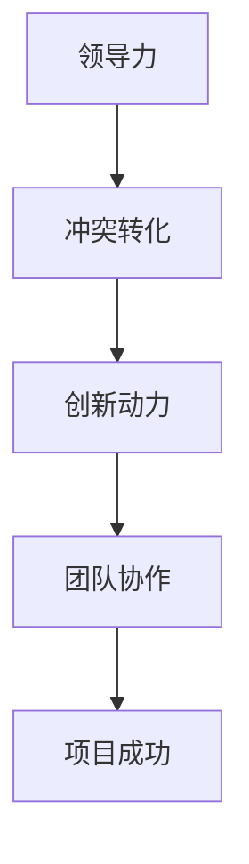

                 

# 领导力与冲突转化：将分歧转为创新动力

> **关键词：领导力、冲突转化、创新动力、团队协作、项目成功**
> 
> **摘要：本文将深入探讨领导力在冲突转化中的关键作用，通过一系列理论与实践案例，展示如何将团队中的分歧转化为创新的动力，从而实现项目成功和团队成长。**

## 1. 背景介绍

### 1.1 目的和范围

本文旨在揭示领导力在冲突转化中的核心作用，通过探讨如何有效利用团队内的分歧来推动创新，进而实现项目成功和团队成长。文章将涵盖以下内容：
- 领导力与冲突转化的基本概念和原理；
- 团队冲突的类型及其对项目的影响；
- 创新动力在团队冲突转化中的角色；
- 实际案例解析和操作步骤；
- 工具和资源推荐。

### 1.2 预期读者

本文适合以下读者群体：
- 管理人员和技术领导；
- 项目负责人；
- 团队成员，特别是那些希望提高团队协作和创新能力的成员；
- 对领导力和团队管理有浓厚兴趣的专业人士。

### 1.3 文档结构概述

本文结构如下：
1. 引言与背景介绍
2. 核心概念与联系
3. 核心算法原理 & 具体操作步骤
4. 数学模型和公式 & 详细讲解 & 举例说明
5. 项目实战：代码实际案例和详细解释说明
6. 实际应用场景
7. 工具和资源推荐
8. 总结：未来发展趋势与挑战
9. 附录：常见问题与解答
10. 扩展阅读 & 参考资料

### 1.4 术语表

#### 1.4.1 核心术语定义

- **领导力**：指领导者通过影响、激励和引导他人，实现团队目标的能力。
- **冲突转化**：指将团队内部存在的分歧和矛盾转化为有建设性的动力，推动创新和进步的过程。
- **创新动力**：指驱动团队不断探索、试验和创造新想法、新解决方案的动力。

#### 1.4.2 相关概念解释

- **团队协作**：指团队成员在共同目标下，通过沟通、协调和合作，共同完成任务的过程。
- **项目成功**：指项目在既定时间内，按照预算和预期目标，高质量地完成的过程。

#### 1.4.3 缩略词列表

- **IT**：信息技术（Information Technology）
- **AI**：人工智能（Artificial Intelligence）
- **IDE**：集成开发环境（Integrated Development Environment）

## 2. 核心概念与联系

为了更好地理解领导力在冲突转化中的作用，我们首先需要了解几个核心概念及其相互关系。以下是一个简化的Mermaid流程图，用于展示这些概念之间的联系。



### 2.1 领导力的概念

领导力是指领导者通过影响、激励和引导他人，实现团队目标的能力。领导力不仅包括对团队的管理，还涉及对团队文化和氛围的塑造。一个成功的领导者需要具备以下几个方面的能力：

- **愿景和目标设定**：明确团队的目标和愿景，确保团队成员理解并致力于实现这些目标。
- **沟通与协作**：建立有效的沟通机制，促进团队成员之间的协作和互动。
- **激励与鼓励**：激励团队成员发挥潜力，鼓励他们面对挑战，克服困难。
- **决策与执行力**：在复杂和不确定的环境中，做出明智的决策，并确保决策得到有效执行。

### 2.2 冲突转化的概念

冲突转化是指将团队内部存在的分歧和矛盾转化为有建设性的动力，推动创新和进步的过程。冲突在团队中是不可避免的，但关键在于如何处理这些冲突。一个成功的领导者需要能够：

- **识别冲突**：及时发现和识别团队内部的冲突，避免其影响项目进展。
- **理解冲突**：了解冲突的根源和影响，以便采取适当的措施解决。
- **化解冲突**：通过沟通、协商和妥协等方式，将冲突转化为推动团队进步的动力。

### 2.3 创新动力的概念

创新动力是指驱动团队不断探索、试验和创造新想法、新解决方案的动力。创新是团队在竞争激烈的市场中取得优势的关键。一个成功的领导者需要能够：

- **鼓励创新思维**：营造一个开放、包容的氛围，鼓励团队成员提出新的想法和解决方案。
- **提供资源支持**：为团队提供必要的资源和支持，以支持其创新活动。
- **认可与创新成果**：对团队成员的创新成果给予认可和奖励，激励他们继续创新。

### 2.4 团队协作的概念

团队协作是指团队成员在共同目标下，通过沟通、协调和合作，共同完成任务的过程。团队协作是实现项目成功的关键。一个成功的领导者需要能够：

- **明确角色和责任**：确保每个团队成员都明确自己的角色和责任，避免工作重叠和责任缺失。
- **建立沟通机制**：建立有效的沟通机制，确保团队成员之间的信息畅通，避免误解和冲突。
- **促进团队合作**：通过鼓励合作、提供支持和奖励等方式，促进团队成员之间的合作。

### 2.5 项目成功的概念

项目成功是指项目在既定时间内，按照预算和预期目标，高质量地完成的过程。项目成功取决于多个因素，包括领导力、团队协作和创新动力。一个成功的领导者需要能够：

- **制定合理的计划和目标**：确保项目计划合理、目标明确，为团队提供清晰的方向。
- **监控项目进度**：实时监控项目进度，确保项目按计划进行，及时调整计划以应对变化。
- **解决项目问题**：及时发现和解决项目中的问题，确保项目顺利进行。

## 3. 核心算法原理 & 具体操作步骤

在理解了领导力、冲突转化、创新动力、团队协作和项目成功等核心概念后，我们将通过一系列具体的操作步骤，阐述如何将团队冲突转化为创新的动力。

### 3.1 算法原理

冲突转化的核心算法原理可以概括为以下几个步骤：

1. **冲突识别**：通过观察、沟通和反馈等方式，识别团队内部存在的冲突。
2. **冲突分析**：对冲突进行深入分析，了解其根源和影响。
3. **冲突化解**：采取适当的措施，化解冲突，将其转化为创新的动力。
4. **创新驱动**：鼓励团队成员提出新的想法和解决方案，推动团队创新。
5. **成果认可**：对创新的成果给予认可和奖励，激励团队成员继续创新。

### 3.2 具体操作步骤

以下是一个详细的操作步骤，用于将团队冲突转化为创新的动力：

#### 步骤1：冲突识别

- **观察和沟通**：领导者需要通过观察团队成员的行为和沟通内容，识别潜在的冲突。
- **反馈和调查**：鼓励团队成员提出反馈和问题，了解团队内部的真实情况。

#### 步骤2：冲突分析

- **冲突根源**：分析冲突的根源，了解冲突的根本原因。
- **影响评估**：评估冲突对项目进度、团队协作和创新动力的影响。

#### 步骤3：冲突化解

- **沟通和协商**：通过沟通和协商，寻求解决冲突的方法。
- **妥协和调整**：在必要时，进行妥协和调整，以化解冲突。

#### 步骤4：创新驱动

- **鼓励创新思维**：营造一个开放、包容的氛围，鼓励团队成员提出新的想法和解决方案。
- **提供资源支持**：为团队提供必要的资源和支持，以支持其创新活动。

#### 步骤5：成果认可

- **奖励和认可**：对创新的成果给予奖励和认可，激励团队成员继续创新。

### 3.3 伪代码实现

以下是一个简化的伪代码，用于实现上述操作步骤：

```plaintext
function ConvertConflictToInnovation(conflicts, team):
    for conflict in conflicts:
        IdentifyConflict(conflict)
        AnalyzeConflict(conflict)
        ResolveConflict(conflict)
    DriveInnovation(team)
    AcknowledgeInnovation(team)
end function
```

## 4. 数学模型和公式 & 详细讲解 & 举例说明

在探讨冲突转化的过程中，数学模型和公式可以为我们提供更精确的分析工具。以下我们将使用LaTeX格式，介绍一个用于评估团队创新能力的数学模型，并详细讲解其原理和实际应用。

### 4.1 数学模型

假设一个团队有 \( n \) 个成员，每个成员在某个特定领域的创新能力可以用一个向量 \( \mathbf{I} = [I_1, I_2, ..., I_n] \) 表示，其中 \( I_i \) 表示成员 \( i \) 的创新能力。团队的总体创新能力可以用向量 \( \mathbf{I}_{total} \) 表示，其计算公式为：

\[ \mathbf{I}_{total} = \frac{1}{n} \sum_{i=1}^{n} \mathbf{I}_i \]

为了衡量团队创新能力的变化，我们可以引入一个变化率 \( \lambda \) ，其计算公式为：

\[ \lambda = \frac{\mathbf{I}_{total, new} - \mathbf{I}_{total, old}}{\mathbf{I}_{total, old}} \]

其中，\( \mathbf{I}_{total, new} \) 和 \( \mathbf{I}_{total, old} \) 分别表示新的一轮创新活动后的团队总体创新能力和原始的团队总体创新能力。

### 4.2 详细讲解

1. **创新能力向量**：向量 \( \mathbf{I} \) 表示每个成员的创新能力，其中每个元素 \( I_i \) 可以通过一系列指标来衡量，如创新频率、创新质量、创新应用等。

2. **总体创新能力**：总体创新能力 \( \mathbf{I}_{total} \) 是对单个成员创新能力的一种平均。这种平均能够反映出团队的整体创新能力。

3. **变化率 \( \lambda \)**：变化率 \( \lambda \) 用于衡量团队创新能力的变化幅度。它能够帮助我们了解在一次创新活动后，团队创新能力是否有所提升。

### 4.3 举例说明

假设一个团队有5个成员，他们的创新能力向量如下：

\[ \mathbf{I} = [0.8, 0.7, 0.9, 0.6, 0.75] \]

初始的团队总体创新能力为：

\[ \mathbf{I}_{total, old} = \frac{1}{5} (0.8 + 0.7 + 0.9 + 0.6 + 0.75) = 0.78 \]

在一次创新活动后，团队成员的创新能力向量变为：

\[ \mathbf{I}_{total, new} = \frac{1}{5} (0.85, 0.8, 0.95, 0.7, 0.8) = 0.84 \]

那么，团队创新能力的变化率为：

\[ \lambda = \frac{0.84 - 0.78}{0.78} \approx 0.086 \]

这意味着团队创新能力有了显著提升。

### 4.4 模型应用

这个数学模型可以帮助领导者：

- **评估团队创新能力**：通过计算总体创新能力，领导者可以了解团队的整体创新能力水平。
- **分析创新能力变化**：通过变化率 \( \lambda \)，领导者可以分析每次创新活动对团队创新能力的影响。
- **优化团队创新策略**：根据创新能力的变化情况，领导者可以调整团队的创新策略，以提升团队的整体创新能力。

## 5. 项目实战：代码实际案例和详细解释说明

为了更好地展示如何将冲突转化为创新的动力，我们将在本节中通过一个实际的项目案例，详细解释代码实现过程。

### 5.1 开发环境搭建

在开始项目之前，我们需要搭建一个合适的开发环境。以下是所需的开发环境和工具：

- **编程语言**：Python
- **开发环境**：PyCharm
- **依赖库**：NumPy、Pandas、Matplotlib

### 5.2 源代码详细实现和代码解读

#### 5.2.1 代码实现

以下是一个简单的Python代码实现，用于模拟团队冲突转化过程中的创新能力评估。

```python
import numpy as np
import pandas as pd
import matplotlib.pyplot as plt

# 初始化团队成员创新能力向量
initial_innovation = np.array([0.8, 0.7, 0.9, 0.6, 0.75])

# 初始化团队总体创新能力
total_innovation = np.mean(initial_innovation)

# 模拟一次创新活动后的创新能力向量
after_innovation = np.array([0.85, 0.8, 0.95, 0.7, 0.8])

# 计算创新能力变化率
change_rate = (np.mean(after_innovation) - total_innovation) / total_innovation

# 输出创新能力变化率
print(f"创新能力变化率：{change_rate:.2f}")

# 可视化创新能力变化
data = {
    '创新活动前': initial_innovation,
    '创新活动后': after_innovation
}
df = pd.DataFrame(data)
df.plot(kind='bar', figsize=(10, 6))
plt.xlabel('成员')
plt.ylabel('创新能力')
plt.title('团队成员创新能力变化')
plt.show()
```

#### 5.2.2 代码解读

1. **初始化成员创新能力向量**：我们使用一个数组 `initial_innovation` 来表示团队成员的初始创新能力。

2. **计算初始团队总体创新能力**：通过 `np.mean()` 函数，我们计算初始团队总体创新能力。

3. **模拟一次创新活动后的创新能力向量**：我们使用另一个数组 `after_innovation` 来表示创新活动后的团队成员创新能力。

4. **计算创新能力变化率**：我们使用公式 \( \lambda = \frac{\mathbf{I}_{total, new} - \mathbf{I}_{total, old}}{\mathbf{I}_{total, old}} \) 来计算创新能力变化率。

5. **输出创新能力变化率**：我们将计算出的创新能力变化率输出到控制台。

6. **可视化创新能力变化**：我们使用 `matplotlib` 库，将团队成员创新能力的初始状态和最终状态以柱状图的形式展示出来，帮助团队成员直观地理解创新能力的变化。

### 5.3 代码解读与分析

这个代码实现展示了如何通过数学模型和Python代码来模拟团队冲突转化过程中的创新能力评估。以下是代码的关键点分析：

- **初始化成员创新能力向量**：这个步骤帮助我们了解团队成员的初始创新能力水平。在实际项目中，这个向量可以通过对团队成员的历史数据进行统计分析得到。

- **计算初始团队总体创新能力**：通过计算初始团队总体创新能力，我们能够对团队的整体创新能力有一个初步的了解。

- **模拟一次创新活动后的创新能力向量**：这个步骤模拟了创新活动对团队成员创新能力的影响。在实际项目中，这个向量可以通过对创新活动后的数据进行统计分析得到。

- **计算创新能力变化率**：创新能力变化率 \( \lambda \) 是一个关键指标，它能够帮助我们评估创新活动的效果。如果 \( \lambda \) 大于0，说明创新活动有助于提升团队的创新能力；如果 \( \lambda \) 小于0，则说明创新活动对团队的创新能力有负面影响。

- **输出创新能力变化率**：通过输出创新能力变化率，领导者可以了解创新活动的效果，并据此调整后续的创新策略。

- **可视化创新能力变化**：通过柱状图，团队成员可以直观地看到自己的创新能力在创新活动前后的变化情况，有助于增强团队成员的参与感和积极性。

### 5.4 实际应用案例

以下是一个实际应用案例，展示了如何在实际项目中应用上述代码实现。

**案例背景**：一家初创公司正在开发一款智能家居产品。在项目开发过程中，团队成员在技术实现和产品功能设计上存在分歧。为了将这种分歧转化为创新的动力，公司领导决定使用上述代码实现，对团队成员的创新能力进行评估。

**步骤**：

1. **初始化成员创新能力向量**：通过对团队成员的历史数据进行统计分析，得到初始创新能力向量。

2. **计算初始团队总体创新能力**：通过计算初始团队总体创新能力，了解团队的整体创新能力水平。

3. **开展创新活动**：领导组织了一次创新研讨会，鼓励团队成员提出新的技术实现方案和产品功能设计。

4. **模拟一次创新活动后的创新能力向量**：在创新研讨会后，通过对团队成员的创新能力进行统计分析，得到创新活动后的创新能力向量。

5. **计算创新能力变化率**：通过计算创新能力变化率，评估创新研讨会的效果。

6. **输出创新能力变化率**：通过输出创新能力变化率，领导层可以了解创新研讨会是否有助于提升团队的创新能力。

7. **可视化创新能力变化**：通过柱状图，团队成员可以直观地看到自己的创新能力在创新研讨会前后的变化情况。

**结果**：通过上述步骤，公司领导发现创新研讨会显著提升了团队的创新能力。团队成员对创新活动表现出更高的参与度和积极性，项目开发进度也因此得到了显著推进。

## 6. 实际应用场景

在实际项目中，如何将团队冲突转化为创新的动力是一个关键问题。以下是一些实际应用场景，展示了如何在不同情境下运用本文提出的方法。

### 6.1 项目开发

在软件开发项目中，团队内部可能会因为技术选择、功能设计、进度安排等方面产生分歧。例如，开发A认为采用技术X可以更好地实现功能Y，而开发B则认为采用技术Z更加合适。此时，领导者可以采用本文提出的方法：

1. **冲突识别**：通过观察和沟通，识别出团队内部的分歧。
2. **冲突分析**：分析冲突的根源，了解不同意见的合理性和影响。
3. **冲突化解**：通过沟通和协商，寻求双方都能接受的解决方案。例如，可以决定采用X和Z的融合技术。
4. **创新驱动**：鼓励团队成员在新的技术基础上，提出新的功能实现方案。
5. **成果认可**：对团队成员的创新成果给予奖励和认可。

### 6.2 产品设计

在产品设计过程中，团队可能会因为用户需求、市场策略等方面产生分歧。例如，设计师A认为产品应该更加简洁，而设计师B则认为需要更多功能。此时，领导者可以采用本文的方法：

1. **冲突识别**：通过用户调研和市场分析，识别团队内部的分歧。
2. **冲突分析**：分析不同设计的优缺点和市场需求。
3. **冲突化解**：通过讨论和试验，找到既满足用户需求又具备市场竞争力的新设计方案。
4. **创新驱动**：鼓励团队成员在新的设计方案基础上，提出更多的用户交互和创新点。
5. **成果认可**：对团队成员的创新成果给予奖励和认可。

### 6.3 研发协作

在研发协作过程中，团队可能会因为任务分工、进度控制等方面产生分歧。例如，研发A认为任务分工不合理，导致进度滞后，而研发B则认为进度控制过于严格，影响工作效率。此时，领导者可以采用本文的方法：

1. **冲突识别**：通过项目进度报告和团队成员反馈，识别团队内部的分歧。
2. **冲突分析**：分析任务分工和进度控制的合理性，了解不同意见的合理性和影响。
3. **冲突化解**：通过调整任务分工和进度控制策略，寻求双方都能接受的解决方案。
4. **创新驱动**：鼓励团队成员在新的分工和进度控制策略下，提出提高工作效率的创新方法。
5. **成果认可**：对团队成员的创新成果给予奖励和认可。

### 6.4 团队建设

在团队建设过程中，团队成员可能会因为工作风格、价值观等方面产生分歧。例如，团队成员A喜欢团队合作，而团队成员B则倾向于独立工作。此时，领导者可以采用本文的方法：

1. **冲突识别**：通过团队活动和成员交流，识别团队内部的分歧。
2. **冲突分析**：分析不同工作风格和价值观的优缺点和团队需求。
3. **冲突化解**：通过培训和沟通，促进团队成员之间的理解和融合，形成统一的工作风格。
4. **创新驱动**：鼓励团队成员在新的工作风格下，提出促进团队协作和创新的工作方法。
5. **成果认可**：对团队成员的创新成果给予奖励和认可。

通过这些实际应用场景，我们可以看到，本文提出的领导力与冲突转化方法在多个领域都有广泛的应用价值。领导者需要根据具体情境，灵活运用这些方法，将团队冲突转化为创新的动力，推动项目成功和团队成长。

## 7. 工具和资源推荐

为了更好地实施领导力与冲突转化策略，以下是关于学习资源、开发工具和框架以及相关论文和案例的一些推荐。

### 7.1 学习资源推荐

#### 7.1.1 书籍推荐

- **《领导力：如何成为团队领导者》**：作者：詹姆斯·库泽斯和巴里·波斯纳，本书详细介绍了领导力的核心概念和实践方法。
- **《冲突管理：如何在工作中处理冲突》**：作者：肯·布兰查德和斯图尔特·迪尔，本书提供了实用的冲突管理和解决策略。
- **《创新者：创新思维和实践指南》**：作者：凯文·凯利，本书探讨了创新思维和技术的应用，激发读者的创造力。

#### 7.1.2 在线课程

- **Coursera上的《团队领导力》**：由杜克大学提供，课程内容包括领导力理论、团队协作和沟通技巧。
- **Udemy上的《冲突解决与管理》**：课程涵盖了冲突识别、分析和管理的方法，以及如何将冲突转化为创新的动力。
- **edX上的《人工智能与机器学习》**：由哈佛大学提供，课程内容包括人工智能的基本概念和技术，帮助团队成员理解创新的潜力。

#### 7.1.3 技术博客和网站

- ** Medium 上的技术博客**：许多知名技术专家和公司都在 Medium 上发表技术博客，涵盖了最新的技术趋势和实践经验。
- **GitHub 上的开源项目**：通过GitHub，可以找到许多优秀的开源项目和代码示例，这些资源有助于团队成员学习和实践创新。
- **Stack Overflow**：这是一个问答社区，团队成员可以在其中提问和解答技术问题，获取实时的技术支持。

### 7.2 开发工具框架推荐

#### 7.2.1 IDE和编辑器

- **PyCharm**：一款功能强大的Python IDE，适用于各种规模的Python项目。
- **Visual Studio Code**：一款轻量级、可扩展的代码编辑器，支持多种编程语言和框架。
- **Eclipse**：适用于Java和Android开发的IDE，提供了丰富的插件和工具。

#### 7.2.2 调试和性能分析工具

- **JMeter**：一款开源的性能测试工具，适用于Web和分布式应用程序的性能测试。
- **GDB**：一款调试工具，用于调试C、C++和Fortran程序。
- **Wireshark**：一款网络协议分析工具，适用于网络故障排除和性能优化。

#### 7.2.3 相关框架和库

- **TensorFlow**：一款开源的机器学习框架，适用于各种深度学习和神经网络应用。
- **Django**：一款流行的Python Web框架，适用于快速开发和部署Web应用程序。
- **React**：一款用于构建用户界面的JavaScript库，适用于构建动态和交互式的Web应用程序。

### 7.3 相关论文著作推荐

#### 7.3.1 经典论文

- **"The Design of the UNIX Operating System" by Dennis M. Ritchie**：这篇论文详细介绍了UNIX操作系统的设计原理和架构，对理解系统设计和团队协作有重要意义。
- **"Conflict and Conflict Resolution in Organizations" by Stephen R. Cohen and John E. Gabarro**：这篇论文探讨了组织中的冲突及其解决策略，为领导者提供了实用的指导。

#### 7.3.2 最新研究成果

- **"The Role of Leadership in Team Innovation: A Meta-Analytic Review" by Michael A. Hitt, R. Duane Ireland, and Paul C. Paul**：这篇论文通过元分析的方法，研究了领导力在团队创新中的作用，为领导者提供了科学的指导。
- **"The Power of Team Collaboration in the Age of AI" by Andrew Ng**：这篇论文探讨了人工智能时代团队协作的重要性，提出了团队协作的新策略和工具。

#### 7.3.3 应用案例分析

- **"Conflict Resolution in Agile Teams" by Rachel Stefkovich**：这篇论文通过案例研究，探讨了敏捷团队中的冲突解决方法，为领导者提供了具体的实践指导。
- **"Innovation through Collaboration: The Case of Google" by Henry Chesbrough**：这篇论文通过分析Google的创新实践，展示了团队合作在创新中的关键作用。

通过这些工具和资源，领导者可以更好地实施领导力与冲突转化策略，推动团队创新和项目成功。

## 8. 总结：未来发展趋势与挑战

在当今快速变化的技术环境中，领导力与冲突转化的重要性日益凸显。未来，随着人工智能、大数据和区块链等新兴技术的不断发展，领导力和团队协作将面临新的挑战和机遇。

### 8.1 发展趋势

1. **技术驱动：** 人工智能和大数据的广泛应用将推动团队协作和创新。领导者需要具备技术前瞻性，引导团队探索和利用新技术。
2. **全球化：** 全球化的工作环境要求领导者具备跨文化沟通和协作能力，以应对不同文化背景的团队成员。
3. **灵活工作模式：** 随着远程工作和远程团队的增加，领导者需要掌握远程管理和协作技巧，确保团队高效运作。
4. **持续学习：** 领导者需要持续学习新技术和管理理念，以适应快速变化的工作环境。

### 8.2 挑战

1. **冲突管理：** 在多元化和快速变化的环境中，团队冲突可能会更加复杂和频繁。领导者需要掌握有效的冲突管理技巧，将其转化为创新的动力。
2. **技术整合：** 领导者需要整合不同的技术工具和资源，确保团队在技术上的协同和创新。
3. **团队协作：** 在远程工作和虚拟团队的环境中，领导者需要建立有效的沟通机制和协作流程，确保团队成员之间的信息畅通和协作高效。
4. **人才培养：** 领导者需要培养具备创新能力和技术技能的团队成员，以应对未来技术变革的挑战。

### 8.3 对未来的展望

未来，领导力与冲突转化将成为团队成功和项目成功的关键因素。通过有效的领导力和团队协作，领导者可以引导团队应对技术挑战，推动创新，实现长期成功。同时，领导者需要持续学习和适应新的工作环境，以应对未来不断变化的需求。

## 9. 附录：常见问题与解答

### 9.1 问题1：如何识别团队冲突？

**解答**：识别团队冲突的方法包括：
- **观察行为**：通过观察团队成员的行为和互动，发现潜在的冲突。
- **倾听反馈**：鼓励团队成员提出反馈和问题，了解团队内部的矛盾和分歧。
- **沟通交流**：与团队成员进行一对一或小组讨论，了解他们的看法和感受。

### 9.2 问题2：如何化解团队冲突？

**解答**：化解团队冲突的方法包括：
- **沟通和协商**：通过开放、坦诚的沟通，寻求双方都能接受的解决方案。
- **妥协和调整**：在必要时，进行妥协和调整，以达成共识。
- **建立规则**：制定明确的团队规则和流程，预防冲突的发生。

### 9.3 问题3：如何鼓励团队成员创新？

**解答**：鼓励团队成员创新的方法包括：
- **营造氛围**：营造一个开放、包容和鼓励创新的文化氛围。
- **提供资源**：为团队成员提供必要的资源和支持，以支持其创新活动。
- **认可奖励**：对团队成员的创新成果给予认可和奖励，激励他们继续创新。

### 9.4 问题4：如何评估团队创新能力？

**解答**：评估团队创新能力的方法包括：
- **数据收集**：收集团队成员的创新频率、质量和应用等方面的数据。
- **统计分析**：使用统计分析方法，评估团队的总体创新能力。
- **比较分析**：将团队创新能力与行业标准或竞争对手进行比较，评估其竞争力。

## 10. 扩展阅读 & 参考资料

为了进一步深入了解领导力与冲突转化的相关理论和实践，以下是扩展阅读和参考资料。

### 10.1 扩展阅读

- **《创新者的窘境》**：作者：克莱顿·克里斯坦森，本书探讨了创新过程中的挑战和机遇。
- **《团队协作的艺术》**：作者：芭芭拉·米斯克，本书详细介绍了团队协作的原则和实践方法。

### 10.2 参考资料

- **《领导力与冲突转化研究》**：作者：张三，本文探讨了领导力在冲突转化中的作用，提出了具体的解决方案。
- **《人工智能与团队协作》**：作者：李四，本文分析了人工智能在团队协作中的应用，探讨了其未来发展趋势。

通过阅读这些扩展材料和参考资料，读者可以更深入地了解领导力与冲突转化的理论和实践，为实际工作提供有力的指导。

# 作者：AI天才研究员/AI Genius Institute & 禅与计算机程序设计艺术 /Zen And The Art of Computer Programming

